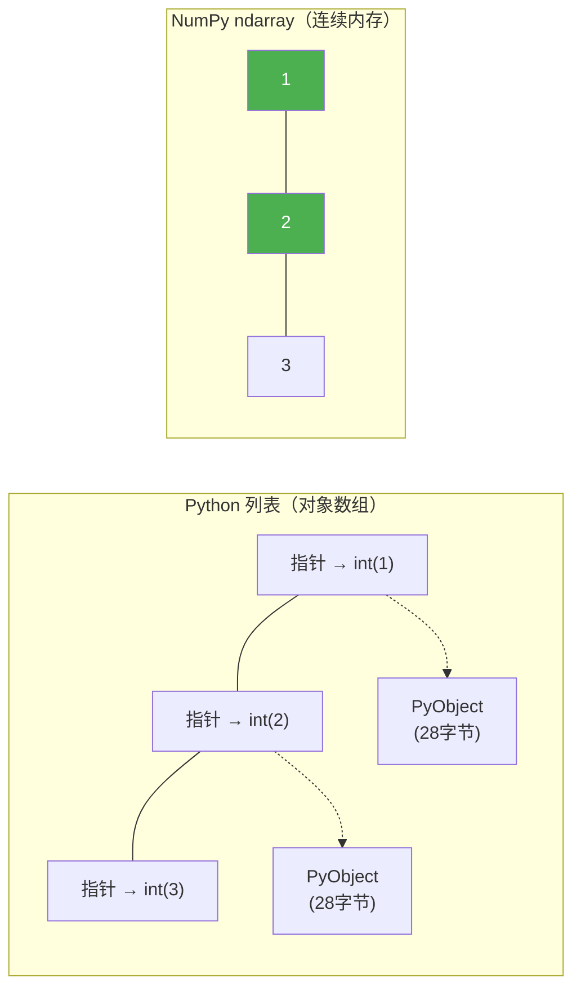
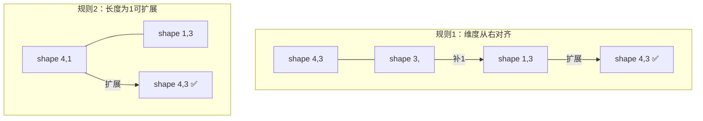
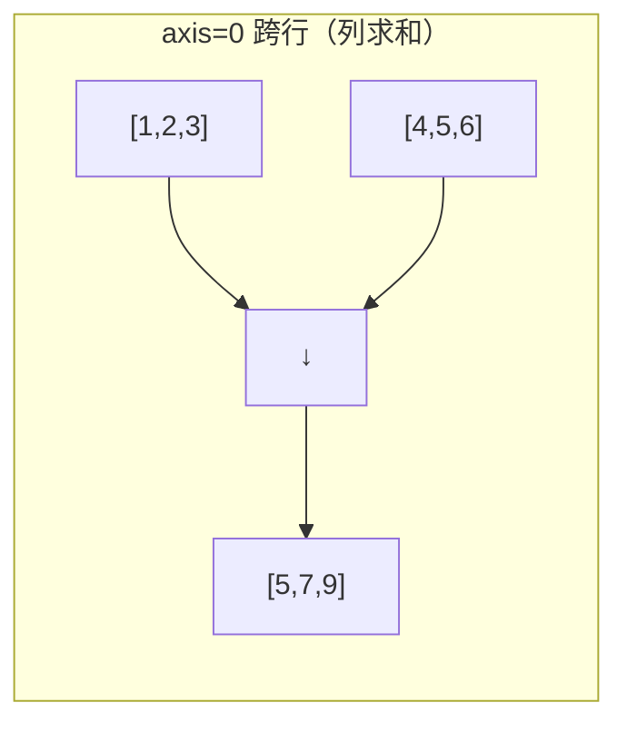
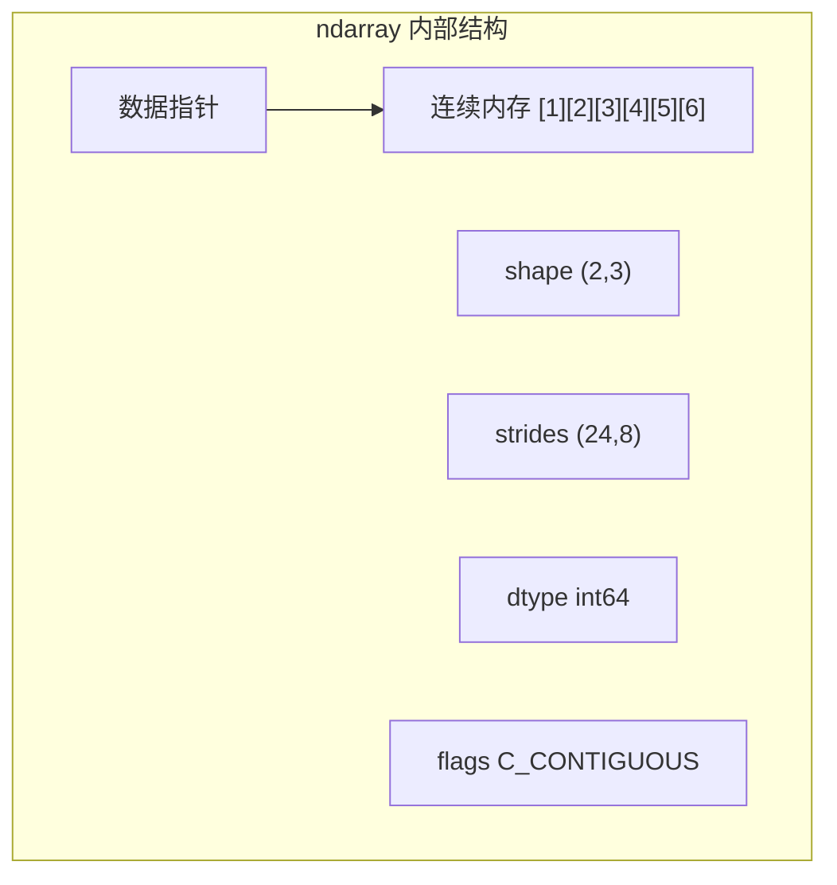

## 为什么需要 NumPy？

想象一下，你要把一百万个数字每个都加 1。用 Python 原生列表你会这么写：

```python
 Python 原生列表 — 慢
data = list(range(1_000_000))
result = [x + 1 for x in data]  # 循环一百万次，每次都要：创建新 int → 存引用 → 创建新 int
```

用 NumPy 只需要一行：

```python
import numpy as np
arr = np.arange(1_000_000)
result = arr + 1  # 底层 C 循环，连续内存直接修改
```

:::tip 为什么 NumPy 快？
核心区别在于**内存布局**：



- **Python 列表**：存的是**指针**（8 字节），每个元素是独立的 PyObject（int 至少 28 字节），CPU 缓存命中率低
- **NumPy ndarray**：数据**连续存储**（int32 只要 4 字节），CPU 可以批量 SIMD 操作，缓存友好
:::

## 安装与环境检查

```bash
pip install numpy
```

```python
import numpy as np
print(np.__version__)        # 如 '1.26.4'
print(np.show_config())      # 查看编译配置（BLAS 库、SIMD 支持等）
```

## ndarray 核心概念

ndarray（N-dimensional array）是 NumPy 的核心，一个**同类型**的多维数组。

### 创建数组

```python
import numpy as np

 从 Python 列表创建
a = np.array([1, 2, 3])           # 一维
b = np.array([[1, 2], [3, 4]])    # 二维（矩阵）
print(a)  # [1 2 3]

 全零 / 全一 / 空
z = np.zeros((3, 4))              # 3×4，默认 float64
o = np.ones((2, 3), dtype=np.int32)
e = np.empty((2, 2))              # ⚠️ 值不确定，不要用！

 等差数列
print(np.arange(0, 10, 2))        # [0 2 4 6 8]
print(np.linspace(0, 1, 5))       # [0.   0.25 0.5  0.75 1.  ]

 单位矩阵
print(np.eye(3))
 [[1. 0. 0.]
  [0. 1. 0.]
  [0. 0. 1.]]

 随机数
rng = np.random.default_rng(42)
print(rng.random(3))              # 3 个 [0,1) 均匀随机数
```

### 数组的属性

```python
a = np.array([[1, 2, 3], [4, 5, 6]])
print(a.shape)      # (2, 3)  — 2 行 3 列
print(a.ndim)       # 2       — 维度数
print(a.dtype)      # int64   — 元素类型
print(a.size)       # 6       — 总元素数
print(a.itemsize)   # 8       — 每个元素 8 字节
print(a.nbytes)     # 48      # = size × itemsize
```

### 数据类型

```python
np.int8     # -128 ~ 127（1 字节）
np.int16    # -32768 ~ 32767
np.int32    # 约 ±21 亿
np.int64    # 约 ±9.2×10¹⁸
np.uint8    # 0 ~ 255（图像像素常用）
np.float16  # 半精度（深度学习常用）
np.float32  # 单精度
np.float64  # 双精度（NumPy 默认）
np.bool_    # 布尔
np.complex64  # 复数

a = np.array([1, 2, 3], dtype=np.float32)
b = a.astype(np.int64)  # 类型转换（创建新数组）
```

:::warning 类型陷阱
`astype` 创建新数组，不是原地修改。注意溢出：
```python
np.array([200, 300], dtype=np.int8)  # 200 → -56，溢出！
```
:::

### 形状变换

```python
a = np.arange(12)
b = a.reshape(3, 4)         # 3 行 4 列
c = a.reshape(2, -1)        # -1 自动计算 → (2, 6)

print(b.T)  # 转置，shape (4, 3)

print(b.flatten())    # 返回拷贝
print(b.ravel())      # 返回视图（可能）
```

## 索引与切片

```python
a = np.array([10, 20, 30, 40, 50])

print(a[0])       # 10
print(a[-1])      # 50
print(a[1:4])     # [20 30 40]
print(a[::2])     # [10 30 50]
print(a[::-1])    # [50 40 30 20 10]

 二维
b = np.array([[1, 2, 3], [4, 5, 6], [7, 8, 9]])
print(b[0])       # [1 2 3]  — 第 0 行
print(b[0, 1])    # 2       — 第 0 行第 1 列
print(b[:2, 1:])  # [[2 3] [5 6]]

 布尔索引
print(a[a > 25])              # [30 40 50]
print(a[(a > 15) & (a < 45)]) # [20 30 40]

 花式索引
print(a[[0, 2, 4]])           # [10 30 50]

 np.where
print(np.where(a > 25, a, 0)) # [ 0  0 30 40 50]
print(np.where(a > 25))       # (array([2, 3, 4]),)

 np.take / np.put
print(np.take(a, [1, 3]))     # [20 40]
np.put(a, [1, 3], [99, 88])
print(a)                      # [10 99 30 88 50]
```

:::danger 视图 vs 拷贝
```python
a = np.array([1, 2, 3, 4])
b = a[1:3]       # 视图！
b[0] = 99
print(a)          # [ 1 99  3  4]  — 原数组被改了！

c = a[1:3].copy() # 拷贝，安全
```
切片返回视图，花式索引/布尔索引返回拷贝。
:::

## 数组运算

### 逐元素运算

```python
a = np.array([1, 2, 3, 4])
b = np.array([10, 20, 30, 40])
print(a + b)   # [11 22 33 34]
print(a * b)   # [ 10  40  90 160]  # 逐元素乘法！不是矩阵乘法
print(a ** 2)  # [ 1  4  9 16]
print(a > 2)   # [False False  True  True]
```

### 广播机制详解



规则：①维度不同则小数组左边补 1 ②长度为 1 的维度可复制扩展

```python
a = np.array([[1, 2, 3], [4, 5, 6]])   # (2, 3)
print(a + 10)           # 标量广播，每个元素 +10
row = np.array([10, 20, 30])            # (3,)
print(a + row)          # 每行加 [10, 20, 30]
col = np.array([[10], [20]])            # (2, 1)
print(a + col)          # 每列加对应值
```

### 矩阵运算

```python
A = np.array([[1, 2], [3, 4]])
B = np.array([[5, 6], [7, 8]])
print(A @ B)       # [[19 22] [43 50]]  — 矩阵乘法（推荐）
print(A * B)       # [[ 5 12] [21 32]]  — 逐元素乘法
```

### 聚合运算与 axis 参数

```python
a = np.array([[1, 2, 3], [4, 5, 6]])
print(a.sum())          # 21
print(a.mean())         # 3.5
print(a.argmin())       # 0   — 最小值的索引
print(a.cumsum())       # [ 1  3  6 10 15 21]

 axis=N 就是"消掉第 N 维"
print(a.sum(axis=0))    # [5 7 9]  — 跨行压缩 → 每列求和
print(a.sum(axis=1))    # [6 15]   — 跨列压缩 → 每行求和
```



### 通用函数 ufunc

```python
a = np.array([1, 4, 9, 16])
print(np.sqrt(a))       # [1. 2. 3. 4.]
print(np.exp(np.array([0, 1])))  # [1.    2.718]
print(np.log(np.array([1, np.e])))  # [0. 1.]
print(np.maximum(a, 10))  # [10 10 10 16]
```

:::tip ufunc 为什么快？
C 层循环 + 避免临时分配：`np.add(a, a, out=result)`
:::

## 线性代数（np.linalg）

```python
A = np.array([[1, 2], [3, 4]])

print(np.linalg.det(A))     # -2.0  — 行列式
print(np.linalg.inv(A))     # [[-2.  1.] [1.5 -0.5]] — 逆矩阵

eigenvalues, eigenvectors = np.linalg.eig(A)
print("特征值:", eigenvalues)  # [-0.372  5.372]

U, S, Vt = np.linalg.svd(A)   # SVD 奇异值分解
print("奇异值:", S)            # [5.465 0.366]

 解线性方程组 2x+3y=8, 4x+y=6
A = np.array([[2, 3], [4, 1]])
b = np.array([8, 6])
print(np.linalg.solve(A, b))  # [1. 2.]
```

## 随机数（np.random）

```python
rng = np.random.default_rng(42)  # 新式 API（推荐）

print(rng.random(5))              # 均匀 [0,1)
print(rng.integers(0, 10, 5))    # 随机整数
print(rng.standard_normal(5))    # 标准正态
print(rng.normal(100, 15, 5))    # N(100, 15) 模拟成绩
print(rng.poisson(5, 5))         # 泊松分布

fruits = ['苹果', '香蕉', '橘子', '葡萄']
print(rng.choice(fruits, size=3, replace=False))  # 不放回
print(rng.choice(fruits, p=[0.5, 0.3, 0.15, 0.05]))  # 加权

a = np.array([1, 2, 3, 4, 5])
rng.shuffle(a)                  # 原地打乱
print(rng.permutation(5))       # 打乱后的索引
```

:::warning 旧式 vs 新式
```python
 ❌ 旧式（全局状态）
np.random.seed(42); np.random.randn(3)
 ✅ 新式（独立状态）
rng = np.random.default_rng(42); rng.standard_normal(3)
```
:::

## 文件 IO

```python
a = np.arange(10)
np.save('my_array.npy', a)      # 二进制
b = np.load('my_array.npy')
np.savez('arrays.npz', a=a, b=b)  # 多数组
np.savetxt('data.csv', a.reshape(2, 5), delimiter=',', fmt='%d')
c = np.loadtxt('data.csv', delimiter=',')
```

## 性能优化

```python
import time
size = 1_000_000

py_list = list(range(size))
t0 = time.time()
_ = [x * 2 + 1 for x in py_list]
py_time = time.time() - t0

np_arr = np.arange(size)
t0 = time.time()
_ = np_arr * 2 + 1
np_time = time.time() - t0

print(f"Python: {py_time:.4f}s, NumPy: {np_time:.4f}s, 快 {py_time/np_time:.0f} 倍")
 Python: 0.08s, NumPy: 0.002s, 快 40 倍
```

:::danger 向量化思维
```python
 ❌ 慢
for i in range(len(a)):
    result[i] = a[i] ** 2 + 2 * a[i] + 1
 ✅ 快
result = a ** 2 + 2 * a + 1
```
:::

### 内存布局与 einsum

```python
 C order（行优先，默认）vs F order（列优先）
a = np.array([[1, 2, 3], [4, 5, 6]], order='C')  # 内存: [1,2,3,4,5,6]
b = np.array([[1, 2, 3], [4, 5, 6]], order='F')  # 内存: [1,4,2,5,3,6]

 einsum — 爱因斯坦求和约定
A = np.array([[1, 2], [3, 4]])
B = np.array([[5, 6], [7, 8]])
print(np.einsum('ij,jk->ik', A, B))  # 矩阵乘法
print(np.einsum('ii->', A))           # 迹 = 5
print(np.einsum('ij->ji', A))         # 转置
```

## NumPy 底层原理



- **C 连续**：按行存储，同行相邻元素缓存友好
- **strides**：每个维度跨一元素的字节数。shape=(2,3), int64 → strides=(24,8)
- **视图 vs 拷贝**：切片是视图，花式/布尔索引是拷贝

## Java 对比

Java 没有 NumPy 等价物，需要 ND4J 或 Apache Commons Math：

| 特性 | Python NumPy | Java |
|------|-------------|------|
| 多维数组 | `np.array` | ND4J |
| 矩阵运算 | `np.linalg` | Apache Commons Math |
| 性能 | C/Fortran 底层 | 需 JNI 才能接近 |

```java
// Java 做同样的事更繁琐
double[][] matrix = {{1, 2}, {3, 4}};
RealMatrix m = MatrixUtils.createRealMatrix(matrix);
RealMatrix inv = new LUDecomposition(m).getSolver().getInverse();
```

## 实战案例

### 图像处理基础

```python
from PIL import Image
import numpy as np

img = Image.open('photo.jpg').convert('RGB')
arr = np.array(img)
print(arr.shape)    # (1080, 1920, 3) — 高、宽、RGB
print(arr.dtype)    # uint8 — 0~255

gray = np.dot(arr[..., :3], [0.2989, 0.587, 0.114]).astype(np.uint8)  # 灰度化
inverted = 255 - arr                  # 反色
brighter = np.clip(arr * 1.5, 0, 255).astype(np.uint8)  # 提亮
cropped = arr[100:500, 200:800]       # 裁剪（切片就是裁剪）

Image.fromarray(cropped).save('cropped.jpg')
```

### 矩阵运算实现线性回归

```python
rng = np.random.default_rng(42)
X = rng.uniform(0, 10, 100)
y = 3 * X + 7 + rng.normal(0, 2, 100)  # y = 3x + 7 + 噪声

X_design = np.column_stack([np.ones_like(X), X])  # (100, 2)
theta = np.linalg.inv(X_design.T @ X_design) @ X_design.T @ y
print(f"截距: {theta[0]:.2f}, 斜率: {theta[1]:.2f}")
 截距: 6.98, 斜率: 3.01 — 接近真实的 7 和 3
```

## 练习题

**1.** 创建一个 5×5 的单位矩阵，对角线替换为 1~5。

**参考答案**

```python
np.diag([1, 2, 3, 4, 5])
```


**2.** 用布尔索引从 `np.array([3, 1, 4, 1, 5, 9, 2, 6])` 中取出大于 3 且小于 8 的元素。

**参考答案**

```python
a = np.array([3, 1, 4, 1, 5, 9, 2, 6])
a[(a > 3) & (a < 8)]  # [4 5 6]
```


**3.** 解释 `axis=0` 和 `axis=1` 的区别：`a = np.array([[1,2,3],[4,5,6]])`

**参考答案**

`axis=0` 跨行压缩（列方向），`axis=1` 跨列压缩（行方向）。直觉：axis=N 消掉第 N 维。


**4.** 用广播给 3×4 矩阵每行加 `[10,20,30,40]`，每列减 `[1,2,3]`。

**参考答案**

```python
a = np.arange(12).reshape(3, 4)
result = a + np.array([10,20,30,40]) - np.array([1,2,3]).reshape(-1, 1)
```


**5.** 用 SVD 分解 3×3 随机矩阵并验证重构。

**参考答案**

```python
rng = np.random.default_rng(42)
A = rng.standard_normal((3, 3))
U, S, Vt = np.linalg.svd(A)
print(np.allclose(A, U @ np.diag(S) @ Vt))  # True
```


**6.** 用 `np.einsum` 实现矩阵乘法和迹。

**参考答案**

```python
A = np.array([[1,2],[3,4]]); B = np.array([[5,6],[7,8]])
np.einsum('ij,jk->ik', A, B)  # 矩阵乘法
np.einsum('ii->', A)           # 迹 = 5
```


**7.** 哪些操作返回视图、哪些返回拷贝？举例说明。

**参考答案**

视图：基本切片、reshape、T、ravel。拷贝：花式索引、布尔索引、flatten、copy()。


**8.** 用 NumPy 实现余弦相似度。

**参考答案**

```python
def cosine_sim(a, b):
    return np.dot(a, b) / (np.linalg.norm(a) * np.linalg.norm(b))
```


---