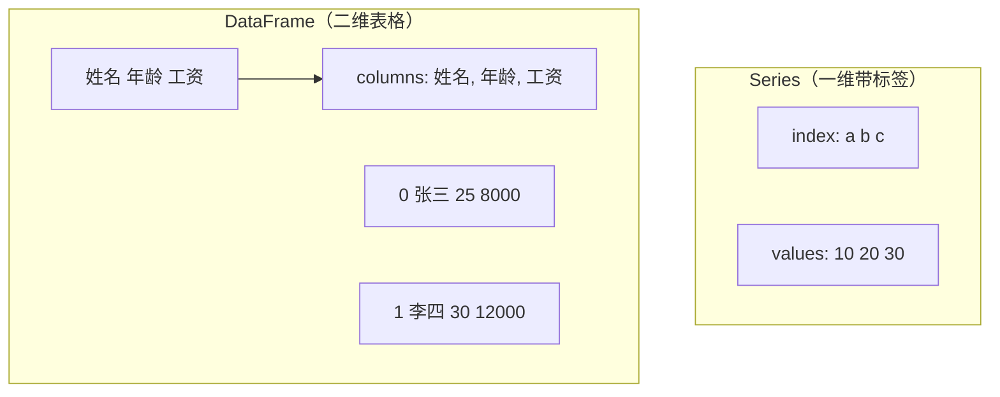
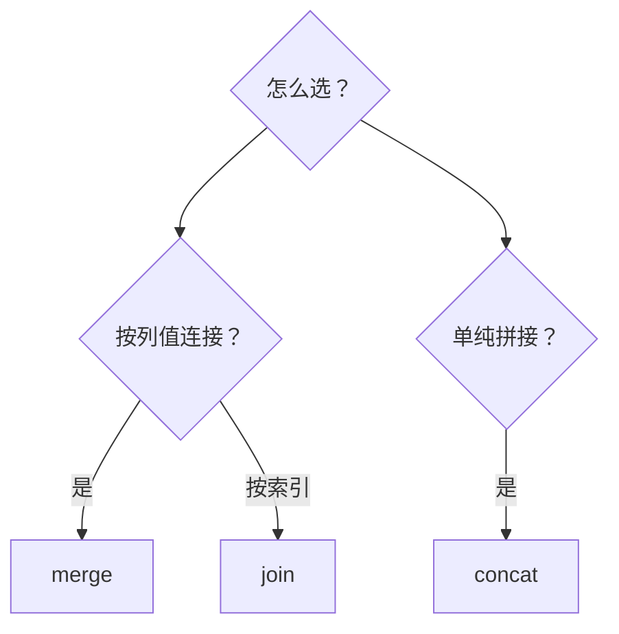
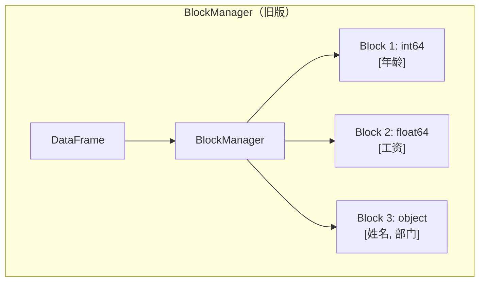

## 为什么需要 Pandas？

如果说 NumPy 是"数组的 Excel"，那 Pandas 就是"真正的 Excel"——带标签、混合类型、缺失值处理、分组聚合、时间序列，一应俱全。

```python
import pandas as pd
df = pd.DataFrame({'姓名': ['张三', '李四', '王五'], '年龄': [25, 30, 35], '工资': [8000, 12000, 15000]})
print(df.describe())  # 一键统计摘要
```

## 安装

```bash
pip install pandas
```

## 核心数据结构



### Series

```python
import pandas as pd
import numpy as np

s1 = pd.Series([10, 20, 30])                     # 默认索引 0,1,2
s2 = pd.Series([10, 20, 30], index=['a', 'b', 'c'])  # 自定义索引
s3 = pd.Series({'x': 1, 'y': 2, 'z': 3})         # 从字典
s4 = pd.Series(5, index=[0, 1, 2])               # 标量广播

 索引
print(s2['b'])            # 20    — 标签
print(s2[0])              # 10    — 位置
print(s2[['a', 'c']])     # 花式
print(s2[s2 > 15])        # 布尔

 属性
print(s2.index)           # Index(['a', 'b', 'c'])
print(s2.values)          # [10 20 30]
print(s2.dtype)           # int64
print(s2.shape)           # (3,)

 方法
s = pd.Series([1, 2, 2, 3, 3, 3, 4])
print(s.value_counts())   # 每个值出现次数
print(s.unique())         # [1 2 3 4]
print(s.nunique())        # 4
print(s.describe())       # 统计摘要
```

### 索引对齐

```python
s1 = pd.Series([1, 2, 3], index=['a', 'b', 'c'])
s2 = pd.Series([10, 20, 30], index=['b', 'c', 'd'])
print(s1 + s2)
 a     NaN  — 自动对齐，不匹配的填 NaN
 b    12.0
 c    23.0
 d     NaN

print(s1.add(s2, fill_value=0))  # 指定填充值
```

### DataFrame

```python
 创建
df1 = pd.DataFrame({'姓名': ['张三', '李四'], '年龄': [25, 30]})
df2 = pd.DataFrame([{'姓名': '张三', '年龄': 25}])
df3 = pd.DataFrame(np.arange(6).reshape(2, 3), columns=['A', 'B', 'C'])

 信息查看
df = pd.read_csv('data.csv')
print(df.head(5))         # 前 5 行
print(df.tail(3))         # 后 3 行
print(df.info())          # 列名、类型、非空数量
print(df.describe())      # 数值列统计
print(df.dtypes)          # 每列类型
print(df.shape)           # (行, 列)
print(df.columns)         # 列名
print(df.index)           # 行索引

 列选择
df['姓名']                # 单列 → Series
df[['姓名', '年龄']]      # 多列 → DataFrame

 行选择
df.loc[0]                 # 标签索引第 0 行
df.loc[0:2]               # 包含 2！
df.iloc[0]                # 位置索引
df.iloc[0:2]              # 不包含 2！
df[df['年龄'] > 25]       # 布尔
df.query('年龄 > 25')     # 字符串查询

 新增/删除列
df['城市'] = ['北京', '上海']
df = df.drop('城市', axis=1)
```

:::tip loc vs iloc
- `loc`：**标签**索引，切片**包含**右端点
- `iloc`：**位置**索引，切片**不包含**右端点
:::

## 数据清洗

数据清洗通常占分析 60%~80% 的时间。

### 缺失值处理

```python
df = pd.DataFrame({'姓名': ['张三', '李四', None, '王五'], '年龄': [25, np.nan, 35, 40]})

print(df.isna().sum())            # 每列缺失数
 姓名    1
 年龄    1

print(df.dropna())                # 删除含 NaN 的行
print(df.dropna(subset=['姓名'])) # 只检查指定列
print(df.fillna(0))               # 全填 0
print(df.fillna({'年龄': df['年龄'].mean()}))  # 不同列不同策略
print(df.fillna(method='ffill'))  # 前向填充
print(df.interpolate())           # 线性插值
```

:::tip 缺失值策略选择
| 策略 | 场景 |
|------|------|
| `fillna(0)` | 数值，缺失代表"无" |
| `fillna(mean())` | 随机遗漏 |
| `ffill` | 时间序列 |
| `interpolate()` | 平滑过渡 |
| `dropna()` | 缺失比例高 |
:::

### 重复值

```python
df.duplicated()                    # 标记重复
df.drop_duplicates()               # 删除（保留第一个）
df.drop_duplicates(keep='last')    # 保留最后一个
df.drop_duplicates(subset=['姓名']) # 按指定列判断
```

### 类型转换

```python
df['工资'] = df['工资'].astype(int)
df['年龄'] = pd.to_numeric(df['年龄'], errors='coerce')  # 无效值 → NaN
df['日期'] = pd.to_datetime(df['日期'])
```

### 字符串处理

```python
df = pd.DataFrame({'邮箱': ['Alice@Gmail.COM', 'bob@yahoo.com']})

df['邮箱'].str.lower()        # 全小写
df['邮箱'].str.upper()        # 全大写
df['邮箱'].str.strip()        # 去首尾空格
df['邮箱'].str.contains('gmail')  # 包含检查
df['邮箱'].str.replace('@', ' at ')  # 替换
df['邮箱'].str.split('@').str[0]  # 分割取第一部分 → ['Alice', 'bob']
df['邮箱'].str.extract(r'(.+)@')   # 正则提取 → ['Alice', 'bob']
```

### 异常值检测

```python
data = pd.DataFrame({'工资': [5000, 6000, 7000, 8000, 50000]})

 IQR 方法
Q1 = data['工资'].quantile(0.25)
Q3 = data['工资'].quantile(0.75)
IQR = Q3 - Q1
outliers = data[(data['工资'] < Q1 - 1.5 * IQR) | (data['工资'] > Q3 + 1.5 * IQR)]
print(outliers)
      工资
 4  50000

 Z-score 方法
from scipy import stats
z = np.abs(stats.zscore(data['工资']))
outliers = data[z > 3]
```

### 重命名与排序

```python
df.rename(columns={'姓名': 'name', '年龄': 'age'}, inplace=True)  # 列重命名
df.rename(index={0: 'first'}, inplace=True)                        # 行重命名
df.sort_values('工资', ascending=False)   # 按值排序
df.sort_index()                           # 按索引排序
```

## 数据聚合与分组

### groupby 基础

```python
df = pd.DataFrame({
    '部门': ['技术', '技术', '市场', '市场', '技术'],
    '姓名': ['张三', '李四', '王五', '赵六', '钱七'],
    '工资': [15000, 12000, 8000, 9000, 13000]
})

 单列分组
print(df.groupby('部门')['工资'].mean())
 部门
 市场    8500.0
 技术    13333.333333

 多列分组
print(df.groupby(['部门', '姓名'])['工资'].sum())

 多个聚合
print(df.groupby('部门')['工资'].agg(['mean', 'max', 'min', 'count']))
           mean    max    min  count
 部门
 市场   8500.0   9000   8000      2
 技术  13333.3  15000  12000      3

 自定义聚合
print(df.groupby('部门')['工资'].agg(
    平均工资='mean',
    最高工资='max',
    人数='count'
))
```

### transform 与 filter

```python
 transform — 组内变换，保持原 shape
df['部门平均工资'] = df.groupby('部门')['工资'].transform('mean')
print(df)
    部门  姓名     工资     部门平均工资
 0  技术  张三  15000  13333.33
 1  技术  李四  12000  13333.33
 2  市场  王五   8000   8500.00

 filter — 组过滤
tech = df.groupby('部门').filter(lambda x: x['工资'].mean() > 10000)
print(tech)  # 只保留平均工资 > 10000 的部门（技术部）
```

### apply

```python
 apply — 万能方法
df['工资等级'] = df['工资'].apply(lambda x: '高' if x > 12000 else '低')
print(df)
    部门  姓名     工资 工资等级
 0  技术  张三  15000     高
 1  技术  李四  12000     低
 2  市场  王五   8000     低
```

### pivot_table 与 crosstab

```python
 透视表
print(pd.pivot_table(df, values='工资', index='部门', aggfunc='mean'))
 部门
 市场    8500.0
 技术  13333.3

 交叉表
print(pd.crosstab(df['部门'], df['工资等级']))
 工资等级  低  高
 部门
 市场     1   0
 技术     2   1

 melt — 宽表转长表
wide = pd.DataFrame({'姓名': ['张三'], '语文': [90], '数学': [85]})
print(pd.melt(wide, id_vars=['姓名'], var_name='科目', value_name='成绩'))
   姓名  科目  成绩
 0 张三  语文   90
 1 张三  数学   85
```

## 合并与连接

```python
df1 = pd.DataFrame({'id': [1, 2, 3], '姓名': ['张三', '李四', '王五']})
df2 = pd.DataFrame({'id': [2, 3, 4], '工资': [8000, 12000, 15000]})

 merge — SQL 风格连接
print(pd.merge(df1, df2, on='id'))              # inner join（默认）
    id  姓名     工资
 0   2  李四   8000
 1   3  王五  12000

print(pd.merge(df1, df2, on='id', how='outer'))  # outer join
    id   姓名      工资
 0   1  张三     NaN
 1   2  李四  8000.0
 2   3  王五  12000.0
 3   4  NaN  15000.0

print(pd.merge(df1, df2, on='id', how='left'))   # left join
    id  姓名      工资
 0   1  张三     NaN
 1   2  李四  8000.0
 2   3  王五  12000.0

 concat — 纵向/横向拼接
df3 = pd.DataFrame({'id': [5, 6], '姓名': ['赵六', '钱七']})
print(pd.concat([df1, df3], ignore_index=True))  # 纵向
df4 = pd.DataFrame({'年龄': [25, 30, 35]})
print(pd.concat([df1, df4], axis=1))              # 横向

 join — 索引连接
df1_j = df1.set_index('id')
df2_j = df2.set_index('id')
print(df1_j.join(df2_j))  # 按 index 连接
```



## 时间序列

```python
 创建时间索引
dates = pd.date_range('2024-01-01', periods=6, freq='D')
df = pd.DataFrame({'日期': dates, '销售额': [100, 120, 90, 150, 130, 160]})
df = df.set_index('日期')

 重采样 — 按周聚合
print(df.resample('W').sum())
             销售额
 日期
 2024-01-07   310
 2024-01-14   440

 滚动窗口 — 3 天移动平均
print(df.rolling(window=3).mean())
             销售额
 日期
 2024-01-01    NaN
 2024-01-02    NaN
 2024-01-03  103.3
 2024-01-04  120.0
 2024-01-05  123.3
 2024-01-06  146.7

 移位 — 计算环比
print(df['销售额'].shift(1))  # 向下移一行
 2024-01-01    NaN
 2024-01-02  100.0
 2024-01-03  120.0 ...

df['环比'] = df['销售额'] / df['销售额'].shift(1) - 1

 时区处理
ts = pd.Timestamp('2024-01-01 12:00')
ts_utc = ts.tz_localize('UTC')
print(ts_utc.tz_convert('Asia/Shanghai'))  # 2024-01-01 20:00:00+08:00
```

## 高级技巧

### pipe 管道操作

```python
def remove_outliers(df, column):
    Q1, Q3 = df[column].quantile([0.25, 0.75])
    IQR = Q3 - Q1
    return df[(df[column] >= Q1 - 1.5 * IQR) & (df[column] <= Q3 + 1.5 * IQR)]

def normalize(df, column):
    return df.assign(**{column: (df[column] - df[column].mean()) / df[column].std()})

 链式操作
result = (df
    .pipe(remove_outliers, '工资')
    .pipe(normalize, '工资')
)
```

### 多级索引

```python
index = pd.MultiIndex.from_tuples(
    [('北京', '张三'), ('北京', '李四'), ('上海', '王五')],
    names=['城市', '姓名']
)
df = pd.DataFrame({'工资': [15000, 12000, 13000]}, index=index)

print(df.loc['北京'])          # 选择"北京"所有行
print(df.loc[('北京', '张三')])  # 选择特定行
print(df.xs('张三', level='姓名'))  # 跨层选择

df_reset = df.reset_index()    # 重置为普通列
```

### 内存优化

```python
df = pd.DataFrame({'部门': ['技术'] * 100000, '工资': [15000] * 100000})
print(df.memory_usage(deep=True))

 category 类型 — 重复字符串节省内存
df['部门'] = df['部门'].astype('category')
print(df.memory_usage(deep=True))  # 部门列从 ~3MB → ~100KB

 downcast — 降低数值精度
df['工资'] = pd.to_numeric(df['工资'], downcast='integer')  # int64 → int32
```

### 大文件处理

```python
 chunksize — 分块读取
chunks = pd.read_csv('big_file.csv', chunksize=10000)
result = pd.concat([chunk[chunk['金额'] > 1000] for chunk in chunks])

 或逐块处理
for chunk in pd.read_csv('big_file.csv', chunksize=10000):
    process(chunk)
```

:::tip eval/query 性能优化
```python
 慢
df[(df['a'] > 0) & (df['b'] < 10)]
 快
df.query('a > 0 and b < 10')
df.eval('a + b')
```
:::

## Pandas 底层原理



Pandas 内部将 DataFrame 按数据类型分成多个 **Block**，每个 Block 是连续的 NumPy 数组。同类型的列存在一起，操作时可以避免逐列循环。

## Java 对比

Java 没有 Pandas 等价物：

| 特性 | Python Pandas | Java |
|------|--------------|------|
| DataFrame | `pd.DataFrame` | Tablesaw / Apache Calcite |
| 分组聚合 | `groupby` | Java Streams `Collectors.groupingBy` |
| 时间序列 | 原生支持 | 需要手动处理 |
| CSV 读取 | `pd.read_csv()` | OpenCSV / Jackson CSV |

```java
// Java 做分组聚合
Map<String, Double> avgSalary = employees.stream()
    .collect(Collectors.groupingBy(
        Employee::getDepartment,
        Collectors.averagingInt(Employee::getSalary)
    ));
```

## 实战案例：电商数据分析

```python
import pandas as pd
import numpy as np

 1. 生成模拟数据
rng = np.random.default_rng(42)
n = 1000
df = pd.DataFrame({
    '订单日期': pd.date_range('2024-01-01', periods=n),
    '商品类别': rng.choice(['电子产品', '服装', '食品', '家居'], n),
    '订单金额': rng.integers(10, 1000, n).astype(float),
    '用户ID': rng.integers(1, 101, n)
})

 2. 数据清洗
 模拟缺失值
df.loc[rng.choice(n, 50), '订单金额'] = np.nan
print(f"缺失值: {df.isna().sum().sum()}")

df['订单金额'] = df['订单金额'].fillna(df['订单金额'].median())
print(f"清洗后缺失值: {df.isna().sum().sum()}")

 异常值检测
Q1 = df['订单金额'].quantile(0.25)
Q3 = df['订单金额'].quantile(0.75)
IQR = Q3 - Q1
df = df[(df['订单金额'] >= Q1 - 1.5*IQR) & (df['订单金额'] <= Q3 + 1.5*IQR)]
print(f"异常值处理后: {len(df)} 条")

 3. 探索性分析
print("\n=== 各品类统计 ===")
print(df.groupby('商品类别')['订单金额'].agg(['mean', 'sum', 'count']))

print("\n=== 月度趋势 ===")
df['月份'] = df['订单日期'].dt.month
monthly = df.groupby('月份')['订单金额'].sum()
print(monthly)

print("\n=== 用户消费排行 ===")
top_users = df.groupby('用户ID')['订单金额'].sum().sort_values(ascending=False).head(10)
print(top_users)

 4. 用户分群
user_stats = df.groupby('用户ID').agg(
    消费总额=('订单金额', 'sum'),
    消费次数=('订单金额', 'count'),
    平均客单价=('订单金额', 'mean')
)
 用分位数分群
user_stats['用户等级'] = pd.qcut(user_stats['消费总额'], q=4, labels=['青铜', '白银', '黄金', '钻石'])
print(user_stats.head())

## 练习题

**1.** 创建一个包含 3 列（姓名、年龄、工资）的 DataFrame，添加一列"税后工资"（工资 × 0.8）。

**参考答案**

```python
df = pd.DataFrame({'姓名': ['张三', '李四'], '年龄': [25, 30], '工资': [15000, 12000]})
df['税后工资'] = df['工资'] * 0.8
```


**2.** 用 `pd.read_csv('data.csv')` 读取数据，检查缺失值，用均值填充数值列、用前向填充文本列。

**参考答案**

```python
df = pd.read_csv('data.csv')
num_cols = df.select_dtypes(include='number').columns
cat_cols = df.select_dtypes(include='object').columns
df[num_cols] = df[num_cols].fillna(df[num_cols].mean())
df[cat_cols] = df[cat_cols].fillna(method='ffill')
```


**3.** 给定销售数据，用 groupby 计算每个地区的总销售额和平均订单金额。

**参考答案**

```python
result = df.groupby('地区')['销售额'].agg(['sum', 'mean'])
```


**4.** 用 merge 将订单表和用户表连接，左连接保留所有订单。

**参考答案**

```python
merged = pd.merge(orders, users, on='user_id', how='left')
```


**5.** 将宽格式数据用 melt 转为长格式。

**参考答案**

```python
long = pd.melt(wide_df, id_vars=['姓名'], var_name='科目', value_name='成绩')
```


**6.** 用 IQR 方法检测并删除异常值。

**参考答案**

```python
Q1, Q3 = df['列名'].quantile([0.25, 0.75])
IQR = Q3 - Q1
df = df[(df['列名'] >= Q1 - 1.5*IQR) & (df['列名'] <= Q3 + 1.5*IQR)]
```


**7.** 用 pipe 实现一个清洗管道：去除缺失值 → 去除异常值 → 标准化。

**参考答案**

```python
def remove_na(df): return df.dropna()
def remove_outliers(df, col):
    Q1, Q3 = df[col].quantile([0.25, 0.75])
    return df[(df[col] >= Q1 - 1.5*(Q3-Q1)) & (df[col] <= Q3 + 1.5*(Q3-Q1))]
def standardize(df, col):
    return df.assign(**{col: (df[col] - df[col].mean()) / df[col].std()})

result = df.pipe(remove_na).pipe(remove_outliers, '金额').pipe(standardize, '金额')
```


---