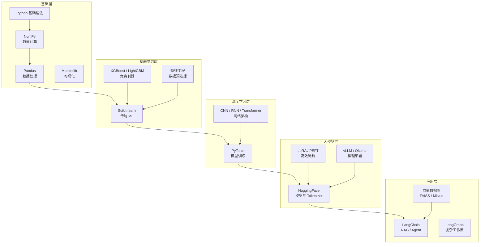
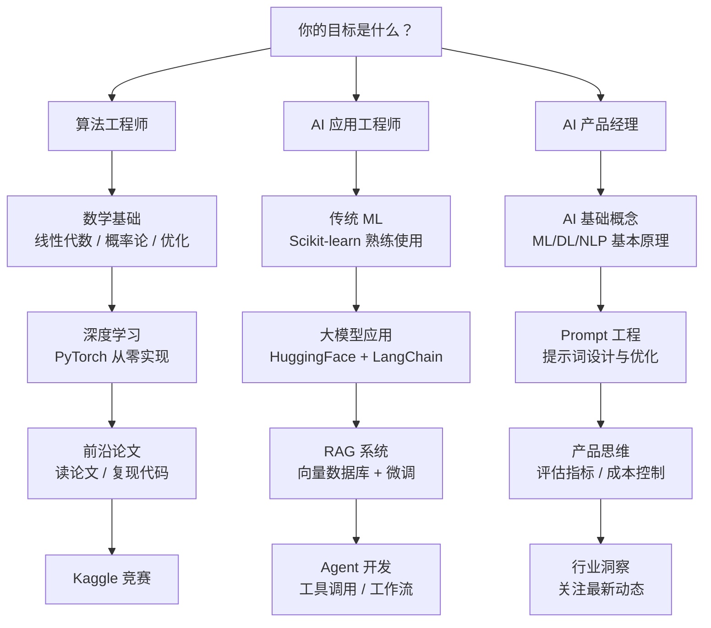
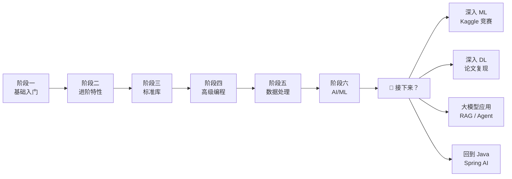

## AI 技术栈全景图

## 不同目标的学习路径

## 推荐资源

**课程**：
- 吴恩达《Machine Learning》（Coursera）— ML 入门经典
- 吴恩达《Deep Learning Specialization》（Coursera）— DL 入门
- 李沐《动手学深度学习》（d2l.ai）— PyTorch 实战
- fast.ai — 自顶向下的实战课程
- Andrej Karpathy《Neural Networks: Zero to Hero》（YouTube）— 从零理解 NN

**书籍**：
- 《统计学习方法》李航 — ML 理论
- 《动手学深度学习》李沐 — PyTorch 实战
- 《Deep Learning》Goodfellow — 深度学习圣经（偏理论）
- 《Build a LLM from Scratch》Sebastian Raschka — 大模型原理

**社区**：
- Hugging Face（https://huggingface.co）— 模型和数据集
- Kaggle（https://kaggle.com）— 竞赛和数据集
- Papers With Code（https://paperswithcode.com）— 论文 + 代码
- GitHub Trending — 关注最新项目

## Python 学习路线总结

恭喜你完成了 Python 全部六个阶段！🎓

| 阶段 | 内容 | 预计用时 | 核心收获 |
|------|------|---------|---------|
| 一：基础入门 | 语法、数据结构、函数 | 1-2 周 | 能写 Python 脚本 |
| 二：进阶特性 | OOP、装饰器、生成器 | 1-2 周 | 理解 Pythonic 风格 |
| 三：标准库 | 常用模块、包管理 | 1 周 | 不重复造轮子 |
| 四：高级编程 | 并发、元类、类型系统 | 2 周 | 写出高质量代码 |
| 五：数据处理 | NumPy、Pandas、Matplotlib | 2 周 | 能处理真实数据 |
| 六：AI/ML 入门 | Sklearn、PyTorch、大模型 | 2-4 周 | 进入 AI 领域 |

**总计约 2-3 个月**（有编程基础的情况）。

学完之后，你已经具备了进入 AI 领域的基础能力。接下来可以：

1. **深入机器学习** — 手写算法、参加 Kaggle 比赛、学习特征工程
2. **深入深度学习** — CNN 图像、RNN 序列、Transformer 架构
3. **大模型应用** — LangChain、Agent、RAG 系统、微调部署
4. **回到 Java** — Spring AI、LangChain4j，用 Java 做 AI 应用

无论选哪条路，记住：**实践 > 理论**。跑通一个项目比读十篇教程更有价值。

---

> **延伸阅读**：
> - 上一篇：[阶段五：数据处理](./stage5-datascience.md)
> - Python 学习路线完整目录：[README](./README.md)