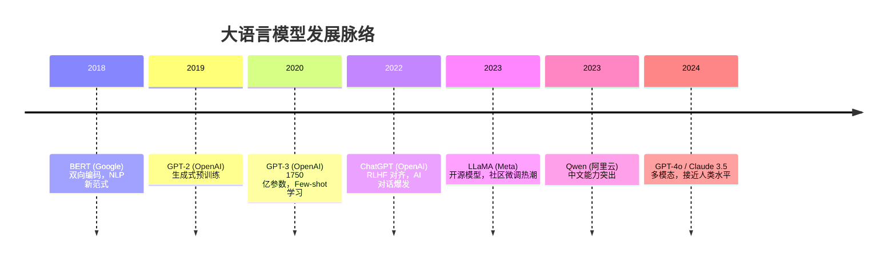
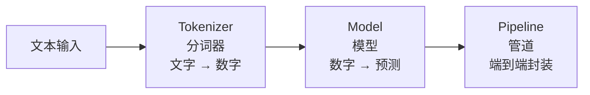
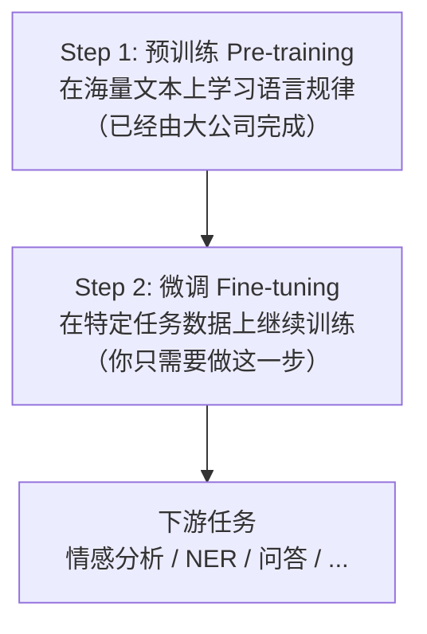

## 大模型时代



## 安装

```bash
pip install transformers datasets accelerate
 可选：sentencepiece（Tokenizer 依赖）
pip install sentencepiece
```

## 核心概念



- **Tokenizer**：把文本变成模型能理解的数字序列
- **Model**：核心神经网络，负责推理
- **Pipeline**：把 Tokenizer + Model + 后处理封装成一行代码

## Pipeline 快速上手

```python
from transformers import pipeline

 ========== 文本分类 ==========
classifier = pipeline("sentiment-analysis")
result = classifier("这部电影太好看了，强烈推荐！")
print(result)
 [{'label': 'POSITIVE', 'score': 0.9999}]

result = classifier("这是我看过的最差的电影")
print(result)
 [{'label': 'NEGATIVE', 'score': 0.9998}]

 ========== 文本生成 ==========
generator = pipeline("text-generation", model="Qwen/Qwen2.5-0.5B")
result = generator("Python 是一门", max_new_tokens=30)
print(result[0]["generated_text"])
 Python 是一门简洁优雅的编程语言，广泛应用于数据分析...

 ========== 命名实体识别（NER）==========
ner = pipeline("ner", grouped_entities=True)
result = ner("张三在北京清华大学学习计算机科学")
for entity in result:
    print(f"  {entity['word']}: {entity['entity_group']}")
 张三: PER（人名）
 北京: LOC（地点）
 清华大学: ORG（组织）

 ========== 问答系统 ==========
qa = pipeline("question-answering")
result = qa(
    question="Python 是谁发明的？",
    context="Python 由 Guido van Rossum 于 1991 年首次发布。"
)
print(result["answer"])  # Guido van Rossum

 ========== 文本摘要 ==========
summarizer = pipeline("summarization")
text = "（长文本...）"
result = summarizer(text, max_length=50, min_length=10)
print(result[0]["summary_text"])

 ========== 翻译 ==========
translator = pipeline("translation", model="Helsinki-NLP/opus-mt-zh-en")
result = translator("机器学习是人工智能的一个分支")
print(result[0]["translation_text"])  # Machine learning is a branch of AI
```

## Tokenizer 详解

```python
from transformers import AutoTokenizer

tokenizer = AutoTokenizer.from_pretrained("bert-base-chinese")

 分词：把文本变成 token
text = "我喜欢自然语言处理"
tokens = tokenizer.tokenize(text)
print(f"Tokens: {tokens}")
 Tokens: ['我', '喜', '欢', '自', '然', '语', '言', '处', '理']

 编码：token → 数字 ID
encoding = tokenizer(text)
print(f"Input IDs: {encoding['input_ids']}")
 Input IDs: [101, 2769, 1591, 4385, 2338, 6371, 749, 6422, 1418, 102]

 特殊 token
print(f"CLS token: {tokenizer.cls_token} ({tokenizer.cls_token_id})")
 CLS token: [CLS] (101)  — 句子开头，BERT 用它做分类
print(f"SEP token: {tokenizer.sep_token} ({tokenizer.sep_token_id})")
 SEP token: [SEP] (102)  — 句子分隔符
print(f"PAD token: {tokenizer.pad_token} ({tokenizer.pad_token_id})")
 PAD token: [PAD] (0)    — 填充符，使 batch 中序列等长

 Padding 和 Truncation
texts = ["短文本", "这是一段比较长的文本，用来演示 padding 和 truncation 的效果"]
encodings = tokenizer(
    texts,
    padding=True,         # 填充到最长序列
    truncation=True,      # 超过最大长度则截断
    max_length=20,
    return_tensors="pt"   # 返回 PyTorch 张量
)
print(f"Shape: {encodings['input_ids'].shape}")
 Shape: torch.Size([2, 20])

 解码：数字 ID → 文本
decoded = tokenizer.decode(encodings["input_ids"][0])
print(decoded)
 [CLS] 短 文 本 [SEP] [PAD] [PAD] ...
```

**分词方式**：
- **BPE（Byte Pair Encoding）**：GPT 系列使用。从字符级开始，反复合并最高频的字符对，最终形成子词词表。
- **WordPiece**：BERT 使用。类似 BPE，但合并标准不同。
- **SentencePiece**：Qwen、LLaMA 使用。直接处理原始文本（不依赖预分词），对多语言更友好。

## 模型加载与推理

```python
from transformers import AutoModel, AutoTokenizer
import torch

tokenizer = AutoTokenizer.from_pretrained("bert-base-chinese")
model = AutoModel.from_pretrained("bert-base-chinese")

text = "自然语言处理很有趣"
inputs = tokenizer(text, return_tensors="pt")

 GPU 推理
device = torch.device("mps" if torch.backends.mps.is_available() else "cpu")
model = model.to(device)
inputs = {k: v.to(device) for k, v in inputs.items()}

 前向传播
with torch.no_grad():
    outputs = model(**inputs)

 输出解读
print(f"last_hidden_state shape: {outputs.last_hidden_state.shape}")
 last_hidden_state shape: torch.Size([1, 12, 768])
 1 个样本，12 个 token，每个 token 768 维的向量表示

print(f"pooler_output shape: {outputs.pooler_output.shape}")
 pooler_output shape: torch.Size([1, 768])
 整句话的 768 维向量表示（用于分类）

 批量推理
texts = ["自然语言处理很有趣", "深度学习改变了一切"]
batch_inputs = tokenizer(texts, padding=True, truncation=True, return_tensors="pt")
batch_inputs = {k: v.to(device) for k, v in batch_inputs.items()}
with torch.no_grad():
    batch_outputs = model(**batch_inputs)
print(f"Batch shape: {batch_outputs.last_hidden_state.shape}")
 Batch shape: torch.Size([2, 14, 768])
```

## 微调（Fine-tuning）基础



**全参数微调**：更新模型的所有参数。需要大显存，但效果通常最好。

**LoRA / QLoRA**：只训练少量额外参数（低秩适配），冻结原始模型。大幅降低显存需求，效果接近全参数微调。

```python
 全参数微调示例（使用 Trainer API）
from transformers import (
    AutoModelForSequenceClassification,
    AutoTokenizer,
    TrainingArguments,
    Trainer,
    DataCollatorWithPadding
)
from datasets import load_dataset

 加载数据集
dataset = load_dataset("glue", "sst2")
train_dataset = dataset["train"].shuffle(seed=42).select(range(1000))
eval_dataset = dataset["validation"].shuffle(seed=42).select(range(200))

 加载模型和分词器
model_name = "bert-base-uncased"
tokenizer = AutoTokenizer.from_pretrained(model_name)
model = AutoModelForSequenceClassification.from_pretrained(
    model_name, num_labels=2
)

 预处理
def tokenize_function(examples):
    return tokenizer(examples["sentence"], truncation=True)

tokenized_train = train_dataset.map(tokenize_function, batched=True)
tokenized_eval = eval_dataset.map(tokenize_function, batched=True)

 训练参数
training_args = TrainingArguments(
    output_dir="./results",
    num_train_epochs=3,
    per_device_train_batch_size=8,
    per_device_eval_batch_size=8,
    eval_strategy="epoch",
    save_strategy="epoch",
    learning_rate=2e-5,
    weight_decay=0.01,
    load_best_model_at_end=True,
)

 训练器
trainer = Trainer(
    model=model,
    args=training_args,
    train_dataset=tokenized_train,
    eval_dataset=tokenized_eval,
    tokenizer=tokenizer,
    data_collator=DataCollatorWithPadding(tokenizer=tokenizer),
)

trainer.train()  # 开始训练
print(f"评估结果: {trainer.evaluate()}")
```

## 模型社区与本地部署

**Hugging Face Hub**（https://huggingface.co）：类似 GitHub 的模型社区，有数十万个预训练模型和数万个数据集。

**本地部署**：
- **Ollama**：一行命令运行本地大模型，`ollama run qwen2.5:7b`
- **vLLM**：高性能推理引擎，支持 PagedAttention，吞吐量极高

```bash
 安装 Ollama（macOS）
brew install ollama

 下载并运行模型
ollama run qwen2.5:7b

 Python 调用 Ollama
pip install langchain-community
```

```python
from langchain_community.llms import Ollama

llm = Ollama(model="qwen2.5:7b")
response = llm.invoke("用一句话解释什么是机器学习")
print(response)
 机器学习是让计算机通过数据自动学习和改进，而无需显式编程的技术。
```

## 本章练习题

**1.** Tokenizer 的作用是什么？为什么不能直接把文本输入模型？


**参考答案**

模型只能处理数字，不能直接处理文本。Tokenizer 负责把文本分割成 token（子词），然后映射成数字 ID。同时还负责添加特殊 token（[CLS]、[SEP]、[PAD]）以及 padding 和 truncation，确保 batch 中的序列等长。


**2.** `padding=True` 和 `truncation=True` 分别解决什么问题？


**参考答案**

`padding=True`：把短序列填充到 batch 中最长序列的长度（用 [PAD] token），因为模型需要固定长度的输入。`truncation=True`：把超过最大长度的序列截断，避免超出模型的上下文窗口。


**3.** 什么是预训练？什么是微调？为什么需要两步？


**参考答案**

预训练是在海量无标注文本上训练，让模型学习语言规律（语法、语义、常识知识）。微调是在特定任务的标注数据上继续训练，让模型适应具体任务。两步走的原因：预训练需要海量数据和算力（大公司做），微调只需少量数据和普通 GPU（个人/团队做）。预训练提供"基础能力"，微调提供"专业技能"。


**4.** LoRA 相比全参数微调有什么优势和劣势？


**参考答案**

优势：(1) 显存需求大幅降低（可以微调 7B/13B 模型只需单张消费级 GPU）；(2) 训练速度快；(3) 多个 LoRA 适配器可以共享同一个基础模型。劣势：效果可能略逊于全参数微调（但差距通常很小），对某些复杂任务可能不够。


---