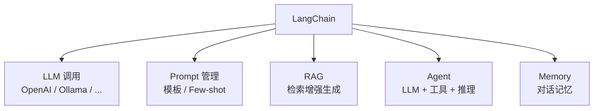
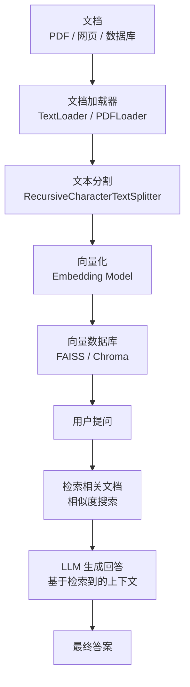
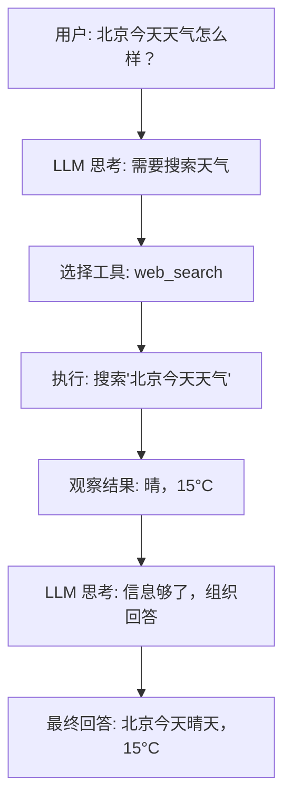

## 为什么需要 LangChain？

LLM 有三个核心局限：(1) **知识截止**：训练数据有日期，不知道最新信息；(2) **幻觉（Hallucination）**：一本正经地胡说八道；(3) **没有工具**：不能搜索网页、不能操作数据库、不能执行代码。

LangChain 的价值：把 LLM 和外部工具、数据源、记忆系统连接起来，构建完整的 AI 应用。



## 安装

```bash
pip install langchain langchain-openai langchain-community
 如果用本地模型
pip install langchain-ollama
```

## LLM 调用

```python
from langchain_openai import ChatOpenAI
from langchain_ollama import ChatOllama
from langchain_core.messages import HumanMessage

 ========== OpenAI API ==========
llm = ChatOpenAI(model="gpt-4o-mini", temperature=0.7)
response = llm.invoke([HumanMessage(content="什么是机器学习？")])
print(response.content)

 ========== 本地模型（Ollama）==========
local_llm = ChatOllama(model="qwen2.5:7b", temperature=0)
response = local_llm.invoke("什么是机器学习？")
print(response)

 ========== 流式输出 ==========
for chunk in llm.stream("讲一个关于编程的笑话"):
    print(chunk.content, end="", flush=True)
 逐字输出，用户体验更好
```

## Prompt 工程

```python
from langchain_core.prompts import PromptTemplate, ChatPromptTemplate
from langchain_core.output_parsers import StrOutputParser

 ========== PromptTemplate ==========
template = PromptTemplate.from_template(
    "你是一个{role}。请用{style}的风格回答以下问题：\n\n{question}"
)
prompt = template.invoke({
    "role": "Python 专家",
    "style": "简洁专业",
    "question": "什么是装饰器？"
})
print(prompt.to_string())

 ========== ChatPromptTemplate ==========
chat_template = ChatPromptTemplate.from_messages([
    ("system", "你是一个{role}，回答要简洁。"),
    ("human", "{input}"),
])

 ========== Few-shot Prompting ==========
from langchain_core.prompts import FewShotChatMessagePromptTemplate

examples = [
    {"input": "Python", "output": "Guido van Rossum"},
    {"input": "Java", "output": "James Gosling"},
]
few_shot_prompt = FewShotChatMessagePromptTemplate(
    example_prompt=ChatPromptTemplate.from_messages([
        ("human", "{input}"),
        ("ai", "{output}"),
    ]),
    examples=examples,
)

 ========== 输出解析 ==========
from langchain_core.output_parsers import JsonOutputParser
from pydantic import BaseModel

class BookReview(BaseModel):
    title: str
    rating: int
    summary: str

parser = JsonOutputParser(pydantic_object=BookReview)

chain = chat_template | llm | parser
result = chain.invoke({"role": "书评家", "input": "评价《深入理解计算机系统》"})
print(result)
 {'title': '深入理解计算机系统', 'rating': 5, 'summary': '...'}
```

## RAG（检索增强生成）

RAG 是目前最实用的 LLM 应用模式。核心思想：先从知识库中检索相关信息，再让 LLM 基于这些信息生成回答。



**为什么需要 RAG？** LLM 的知识有截止日期，而且会"幻觉"（编造不存在的事实）。RAG 让 LLM 先查阅资料再回答，大幅提升准确性和可靠性。

```python
from langchain_community.document_loaders import TextLoader, WebBaseLoader
from langchain_text_splitters import RecursiveCharacterTextSplitter
from langchain_openai import OpenAIEmbeddings
from langchain_community.vectorstores import FAISS
from langchain_openai import ChatOpenAI
from langchain.chains import create_retrieval_chain
from langchain.chains.combine_documents import create_stuff_documents_chain
from langchain_core.prompts import ChatPromptTemplate
import os

 ========== 1. 加载文档 ==========
loader = TextLoader("knowledge_base.txt", encoding="utf-8")
docs = loader.load()

 从网页加载
 web_loader = WebBaseLoader("https://docs.python.org/3/tutorial/")
 web_docs = web_loader.load()

 ========== 2. 分割文本 ==========
splitter = RecursiveCharacterTextSplitter(
    chunk_size=500,       # 每个 chunk 最大 500 字符
    chunk_overlap=50,     # chunk 之间重叠 50 字符（保持上下文连贯）
    separators=["\n\n", "\n", "。", " ", ""]  # 优先按段落分割
)
chunks = splitter.split_documents(docs)
print(f"文档数: {len(docs)}, 分割后: {len(chunks)} chunks")
 文档数: 1, 分割后: 15 chunks

 ========== 3. 向量化并存储 ==========
 Embedding：把文本变成向量（高维数组），语义相似的文本向量也相似
embeddings = OpenAIEmbeddings()
vectorstore = FAISS.from_documents(chunks, embeddings)

 ========== 4. 创建检索器 ==========
retriever = vectorstore.as_retriever(
    search_type="similarity",       # 相似度搜索
    search_kwargs={"k": 3}          # 返回最相关的 3 个 chunk
)

 ========== 5. 构建 RAG Chain ==========
llm = ChatOpenAI(model="gpt-4o-mini", temperature=0)

prompt = ChatPromptTemplate.from_template("""
根据以下上下文回答问题。如果上下文中没有相关信息，请说"我不知道"。

上下文：
{context}

问题：{input}
""")

 文档链：把检索到的文档填入 prompt
document_chain = create_stuff_documents_chain(llm, prompt)
 检索链：先检索再生成
rag_chain = create_retrieval_chain(retriever, document_chain)

 ========== 6. 查询 ==========
result = rag_chain.invoke({"input": "Python 的 GIL 是什么？"})
print(f"答案: {result['answer']}")
print(f"来源文档数: {len(result['context'])}")
 答案: GIL（全局解释器锁）是 CPython 中的机制...
 来源文档数: 3
```

### RAG 优化技巧

```python
 1. 调整 chunk_size 和 overlap
 chunk_size 太小 → 信息不完整；太大 → 检索不精确
 overlap 保持 10-20% 的 chunk_size，确保上下文连贯

 2. MMR 检索（最大边际相关性）：平衡相关性和多样性
retriever = vectorstore.as_retriever(
    search_type="mmr",
    search_kwargs={"k": 3, "fetch_k": 10}  # 先取 10 个，再选 3 个最多样且相关的
)

 3. 混合检索：关键词（BM25）+ 向量（Embedding）
 from langchain.retrievers import BM25Retriever, EnsembleRetriever
 bm25 = BM25Retriever.from_documents(chunks, k=3)
 ensemble = EnsembleRetriever(retrievers=[bm25, vector_retriever], weights=[0.4, 0.6])

 4. Rerank：检索后用更精确的模型重新排序
 from langchain_community.cross_encoders import HuggingFaceCrossEncoder
 reranker = HuggingFaceCrossEncoder("BAAI/bge-reranker-base")
```

## Agent

Agent = LLM + 工具 + 推理循环。LLM 不再只是"回答问题"，而是"思考 → 选择工具 → 执行 → 观察结果 → 继续思考"，直到任务完成。



```python
from langchain.tools import tool
from langchain_openai import ChatOpenAI
from langchain.agents import create_tool_calling_agent, AgentExecutor
from langchain_core.prompts import ChatPromptTemplate

 ========== 定义工具 ==========
@tool
def search_web(query: str) -> str:
    """搜索网页获取最新信息"""
    # 实际中调用搜索 API
    return f"搜索 '{query}' 的结果: ..."

@tool
def calculator(expression: str) -> str:
    """计算数学表达式"""
    try:
        return str(eval(expression))
    except Exception as e:
        return f"计算错误: {e}"

@tool
def get_current_time() -> str:
    """获取当前时间"""
    from datetime import datetime
    return datetime.now().strftime("%Y-%m-%d %H:%M:%S")

tools = [search_web, calculator, get_current_time]

 ========== 创建 Agent ==========
llm = ChatOpenAI(model="gpt-4o-mini")
prompt = ChatPromptTemplate.from_messages([
    ("system", "你是一个有用的助手，可以搜索网页、计算数学表达式、获取时间。"),
    ("human", "{input}"),
    ("placeholder", "{agent_scratchpad}"),  # Agent 的思考过程
])

agent = create_tool_calling_agent(llm, tools, prompt)
agent_executor = AgentExecutor(agent=agent, tools=tools, verbose=True)

 ========== 运行 ==========
result = agent_executor.invoke({"input": "帮我算一下 (123 + 456) * 789"})
 > Entering new AgentExecutor chain...
 > Invoking: calculator with {'expression': '(123 + 456) * 789'}
 > 455289
 > Final Answer: (123 + 456) * 789 = 455,289
```

**ReAct 框架**：Agent 的核心推理模式。Reasoning（推理）+ Acting（行动）交替进行——先推理需要做什么，然后执行行动，观察结果，再继续推理。

## Memory（对话记忆）

```python
from langchain_community.chat_message_histories import ChatMessageHistory
from langchain_core.chat_history import BaseChatMessageHistory
from langchain_core.runnables.history import RunnableWithMessageHistory

 存储对话历史
store = {}

def get_session_history(session_id: str) -> BaseChatMessageHistory:
    if session_id not in store:
        store[session_id] = ChatMessageHistory()
    return store[session_id]

 给 chain 加上记忆
chain_with_memory = RunnableWithMessageHistory(
    rag_chain,
    get_session_history,
    input_messages_key="input",
    history_messages_key="chat_history",
)

 第一次对话
result1 = chain_with_memory.invoke(
    {"input": "我叫小明"},
    config={"configurable": {"session_id": "user1"}}
)

 第二次对话（记得之前的上下文）
result2 = chain_with_memory.invoke(
    {"input": "我叫什么名字？"},
    config={"configurable": {"session_id": "user1"}}
)
 "你叫小明"
```

## LangChain 生态

- **LangGraph**：构建有状态的、多步骤的 AI Agent 应用（有循环、分支的复杂工作流）
- **LangSmith**：LLM 应用的调试和监控平台（追踪每次调用、评估输出质量）
- **LangServe**：一键把 LangChain chain 部署为 REST API

## Java 对比

| 维度 | Python (LangChain) | Java |
|------|-------------------|------|
| 生态成熟度 | 最成熟 | 快速追赶 |
| 库 | LangChain | LangChain4j、Spring AI |
| 社区 | 极大 | 增长中 |
| 生产部署 | FastAPI | Spring Boot |

```java
// Spring AI 示例
@RestController
public class ChatController {
    private final ChatClient chatClient;

    public ChatController(ChatClient.Builder builder) {
        this.chatClient = builder.build();
    }

    @GetMapping("/chat")
    public String chat(@RequestParam String message) {
        return chatClient.prompt()
            .user(message)
            .call()
            .content();
    }
}
```

## 实战：个人知识库问答系统

```python
"""
个人知识库问答系统
功能：上传文档 → 自动建立索引 → 智能问答
"""
from langchain_community.document_loaders import (
    TextLoader, DirectoryLoader, PyPDFLoader
)
from langchain_text_splitters import RecursiveCharacterTextSplitter
from langchain_openai import OpenAIEmbeddings, ChatOpenAI
from langchain_community.vectorstores import Chroma
from langchain.chains import create_retrieval_chain
from langchain.chains.combine_documents import create_stuff_documents_chain
from langchain_core.prompts import ChatPromptTemplate

 1. 加载所有文档
loader = DirectoryLoader(
    "./knowledge_base",
    glob="**/*.md",
    loader_cls=TextLoader
)
docs = loader.load()
print(f"加载了 {len(docs)} 个文档")

 2. 分割
splitter = RecursiveCharacterTextSplitter(
    chunk_size=1000, chunk_overlap=100
)
chunks = splitter.split_documents(docs)

 3. 向量化存储（Chroma 持久化到磁盘）
embeddings = OpenAIEmbeddings()
vectorstore = Chroma.from_documents(
    chunks, embeddings,
    persist_directory="./chroma_db"  # 持久化，下次不用重新计算
)

 4. 构建问答链
llm = ChatOpenAI(model="gpt-4o-mini", temperature=0)
retriever = vectorstore.as_retriever(search_kwargs={"k": 5})

prompt = ChatPromptTemplate.from_template("""
你是个人知识库助手。请根据以下文档内容回答问题。
如果文档中没有相关信息，请如实说明。

文档内容：
{context}

问题：{input}
""")

document_chain = create_stuff_documents_chain(llm, prompt)
rag_chain = create_retrieval_chain(retriever, document_chain)

 5. 交互式问答
import sys
print("📝 个人知识库问答系统（输入 'quit' 退出）")
while True:
    question = input("\n❓ 问题: ")
    if question.lower() == "quit":
        break
    result = rag_chain.invoke({"input": question})
    print(f"💡 回答: {result['answer']}")
    print(f"📄 引用了 {len(result['context'])} 个文档片段")
```

## 本章练习题

**1.** RAG 解决了 LLM 的哪些问题？


**参考答案**

RAG 主要解决三个问题：(1) **知识截止**：LLM 的训练数据有截止日期，RAG 通过检索最新文档获取最新信息；(2) **幻觉**：LLM 会编造不存在的事实，RAG 让 LLM 基于真实文档回答，大幅减少幻觉；(3) **私有数据**：LLM 不知道你的私有数据（公司文档、个人笔记），RAG 把这些数据纳入 LLM 的知识范围。


**2.** chunk_size 和 chunk_overlap 分别怎么设置？有什么影响？


**参考答案**

chunk_size 太小（如 100 字）→ 检索精度高但信息可能不完整；太大（如 2000 字）→ 信息完整但检索噪声大。通常 300-1000 字比较合适。chunk_overlap 建议 10-20% 的 chunk_size，确保相邻 chunk 之间有上下文衔接，避免关键信息被切断。


**3.** Agent 和普通的 Chain 有什么区别？


**参考答案**

Chain 是预定义的步骤顺序（A→B→C），Agent 可以自主决定下一步做什么。Agent 有"思考"能力——它会根据当前状态选择使用哪个工具、是否需要更多信息。简单任务用 Chain，复杂任务（需要多步推理、使用多个工具）用 Agent。


**4.** 为什么需要 Memory？没有 Memory 的对话有什么问题？


**参考答案**

没有 Memory 的对话是无状态的——每次调用 LLM 都是独立的，LLM 不记得之前说了什么。Memory 保存了历史对话，让 LLM 能理解上下文（比如"刚才说的那个"指代什么）。不同场景需要不同类型的 Memory：窗口记忆（保留最近 N 轮）、摘要记忆（自动总结旧对话）、实体记忆（记住用户提到的实体）。


**5.** 如果知识库有 10 万个 chunk，每次检索都扫描全部太慢了怎么办？


**参考答案**

使用专业的向量数据库（如 Milvus、Pinecone、Weaviate），它们使用 ANN（近似最近邻）索引（如 HNSW、IVF），可以在毫秒级别从亿级向量中检索。FAISS 适合中小规模（百万级以下），Milvus 适合大规模（亿级）。


---