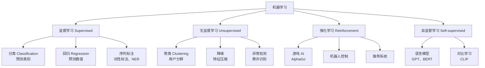
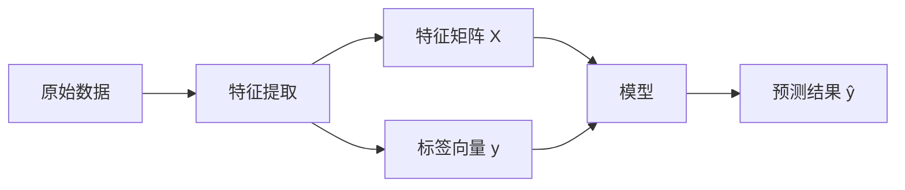
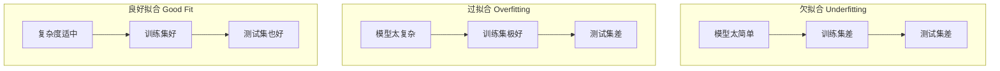
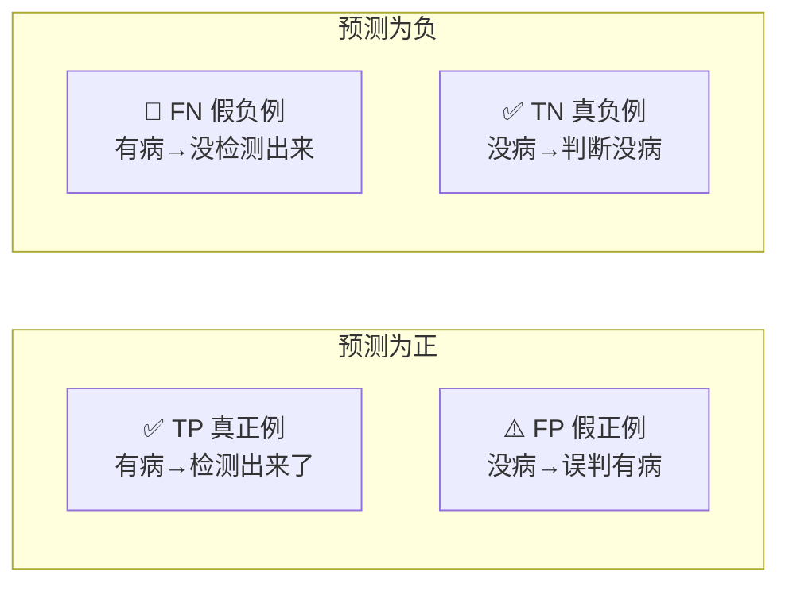
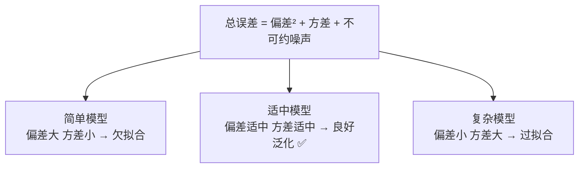

## 什么是机器学习？

先别管公式，从一个生活例子开始。

你每天用邮箱，系统自动把垃圾邮件放进垃圾箱。这个"自动识别垃圾邮件"的过程，就是机器学习的典型应用：

1. **收集数据**：用户手动标记了几千封邮件，哪些是垃圾邮件（标注了标签）
2. **训练模型**：让计算机从这些数据中"学习"规律（比如含"中奖""免费"的邮件大概率是垃圾邮件）
3. **预测**：新来一封邮件，模型根据学到的规律判断是不是垃圾邮件

**机器学习的本质**：不靠人工写规则，而是让计算机从数据中自动学习规律。

再举几个你每天都在用的例子：

| 应用 | 机器学习任务 | 输入 | 输出 |
|------|------------|------|------|
| 垃圾邮件识别 | 二分类 | 邮件内容 | 垃圾/正常 |
| 商品推荐 | 推荐系统 | 用户浏览历史 | 推荐商品列表 |
| 人脸识别 | 图像分类 | 照片 | 人物身份 |
| 语音助手 | 语音识别 | 语音信号 | 文字 |
| 自动驾驶 | 目标检测 | 车载摄像头画面 | 障碍物位置 |

## 机器学习的分类



- **监督学习**：数据有标签。就像老师给你题目和答案，你学习规律。
- **无监督学习**：数据没有标签。计算机自己发现数据中的结构。
- **强化学习**：通过"试错 + 奖励"来学习。就像训练小狗：做对了给零食，做错了不给。
- **自监督学习**：模型自己从数据中构造标签。比如"完形填空"——遮住句子中的一个词，让模型预测。GPT、BERT 都是这样训练出来的。

## 核心概念



- **特征（Feature）**：描述事物的属性。预测房价时，面积、房间数、地段都是特征。类比 Java：对象的属性字段。
- **标签（Label）**：要预测的目标。房价预测中，标签就是房屋价格。
- **训练集（Training Set）**：用来训练模型的数据，占 70%-80%。
- **测试集（Test Set）**：用来评估模型的数据，占 20%-30%。训练时**绝对不能看**测试集。
- **验证集（Validation Set）**：用来调参和选择模型，从训练集中分出来。

### 过拟合、欠拟合与泛化



- **欠拟合**：模型太简单，连训练数据都学不好。就像考试前没复习。
- **过拟合**：模型太复杂，把训练数据的噪声也学了。就像死记硬背答案，换题就不会。这是实际中最常见的问题。
- **泛化**：模型对没见过的新数据也能做出好预测。这是终极目标。

:::tip Java 开发者理解
- 过拟合 ≈ 过度设计：写了太多特例代码，换个需求就不 work
- 泛化 ≈ 好的抽象：设计合理，面对新需求也能轻松扩展
:::

## 模型评估指标

假设做一个"检测疾病"的模型。混淆矩阵是基础：



### 准确率（Accuracy）

$$Accuracy = \frac{TP + TN}{TP + TN + FP + FN}$$

所有预测中正确的比例。**有陷阱**：1000 人中 10 人患病，模型预测所有人健康，准确率 = 990/1000 = 99%，但完全没用！

### 精确率（Precision）——"你说的对不对"

$$Precision = \frac{TP}{TP + FP}$$

预测为正的样本中，真正为正的比例。**误判代价高时需要高精确率**（垃圾邮件过滤不能把正常邮件判为垃圾）。

### 召回率（Recall）——"你没漏掉吧"

$$Recall = \frac{TP}{TP + FN}$$

真正为正的样本中，被正确预测的比例。**漏判代价高时需要高召回率**（疾病检测漏诊很危险）。

### F1 分数

$$F1 = 2 \times \frac{Precision \times Recall}{Precision + Recall}$$

两者的调和平均数，需要平衡时使用。

### AUC-ROC

ROC 曲线以假正率（FPR）为横轴、真正率（TPR）为纵轴。AUC 是曲线下面积。随机取一个正样本和负样本，模型把正排在前面的概率。AUC = 0.5 跟抛硬币一样，AUC = 1.0 完美。

```python
from sklearn.metrics import (
    accuracy_score, precision_score, recall_score,
    f1_score, roc_auc_score
)

y_true = [1, 0, 1, 1, 0, 1, 0, 0, 1, 0]
y_pred = [1, 0, 1, 0, 0, 1, 1, 0, 1, 1]

print(f"准确率:   {accuracy_score(y_true, y_pred):.2f}")    # 0.70
print(f"精确率:   {precision_score(y_true, y_pred):.2f}")    # 0.67
print(f"召回率:   {recall_score(y_true, y_pred):.2f}")        # 0.80
print(f"F1 分数:  {f1_score(y_true, y_pred):.2f}")           # 0.73

 AUC 需要概率输出而非 0/1
y_scores = [0.9, 0.1, 0.8, 0.4, 0.2, 0.7, 0.6, 0.1, 0.85, 0.55]
print(f"AUC:      {roc_auc_score(y_true, y_scores):.4f}")    # 0.9167
```

## 偏差-方差权衡



**偏差（Bias）**：系统性偏差，模型太简单学不到真实规律。**方差（Variance）**：对训练数据微小变化过于敏感，模型太复杂。两者此消彼长，需要找到平衡点。

```python
import numpy as np
import matplotlib.pyplot as plt

model_complexity = np.arange(1, 21)
bias_squared = 1.0 / model_complexity
variance = 0.01 * model_complexity ** 1.5
noise = np.full_like(model_complexity, 0.1, dtype=float)
total_error = bias_squared + variance + noise

plt.figure(figsize=(10, 6))
plt.plot(model_complexity, bias_squared, "b-", label="偏差² (Bias²)")
plt.plot(model_complexity, variance, "r-", label="方差 (Variance)")
plt.plot(model_complexity, noise, "g--", label="不可约噪声")
plt.plot(model_complexity, total_error, "k-", linewidth=2, label="总误差")
plt.axvline(x=8, color="purple", linestyle=":", label="最优复杂度")
plt.xlabel("模型复杂度"); plt.ylabel("误差")
plt.title("偏差-方差权衡"); plt.legend()
plt.savefig("bias_variance.png", dpi=100)
 输出一张经典的 U 型总误差曲线图
```

## 特征工程基础

```python
import numpy as np
import pandas as pd
from sklearn.preprocessing import (
    StandardScaler, MinMaxScaler, LabelEncoder, OneHotEncoder
)
from sklearn.impute import SimpleImputer

df = pd.DataFrame({
    "年龄": [25, 30, np.nan, 45, 35, 28],
    "收入": [5000, 8000, 6000, 15000, np.nan, 7000],
    "城市": ["北京", "上海", "北京", "深圳", "上海", "广州"],
    "学历": ["本科", "硕士", "本科", "博士", "硕士", "本科"]
})

 1. 缺失值处理
imputer = SimpleImputer(strategy="median")
df["年龄"] = imputer.fit_transform(df[["年龄"]])
 np.nan → 32.6（中位数）

 2. 标准化：z = (x - μ) / σ，结果均值=0 标准差=1
scaler = StandardScaler()
df[["年龄_std"]] = scaler.fit_transform(df[["年龄"]])
 25 → -1.02, 45 → 1.85

 3. 归一化：缩放到 [0, 1]
minmax = MinMaxScaler()
df[["年龄_norm"]] = minmax.fit_transform(df[["年龄"]])
 25 → 0.00, 45 → 1.00

 4. 标签编码（适合有序类别）
le = LabelEncoder()
df["学历_enc"] = le.fit_transform(df["学历"])
 本科=0, 博士=1, 硕士=2

 5. 独热编码（适合无序类别）
ohe = OneHotEncoder(sparse_output=False, drop="first")
city_onehot = ohe.fit_transform(df[["城市"]])
print(f"独热编码 shape: {city_onehot.shape}")  # (6, 3)
```

:::warning 标准化 vs 归一化
- **StandardScaler**：均值 0、标准差 1。默认选择，适合 SVM、逻辑回归、KNN。
- **MinMaxScaler**：缩放到 [0,1]。适合图像处理。对异常值敏感。
:::

## Java 对比

| 维度 | Python | Java |
|------|--------|------|
| ML 库 | scikit-learn、PyTorch、TensorFlow | Weka、Deeplearning4j、DJL |
| 社区资源 | 极其丰富 | 资源少 |
| 大模型调用 | LangChain、Transformers | Spring AI、LangChain4j |
| **推荐策略** | 模型训练用 Python | 模型推理可部署到 Java 服务 |

```java
// Java 调用 Python 模型的典型方式：REST API
RestTemplate restTemplate = new RestTemplate();
Map<String, Object> request = Map.of("features", List.of(25, 5000, 1));
ResponseEntity<Map> response = restTemplate.postForEntity(
    "http://ml-service:8000/predict", request, Map.class
);
```

## 本章练习题

**1.** 什么是过拟合？举一个生活中的类比。


**参考答案**

过拟合就像一个学生把历年考试题和答案都背下来了，遇到原题拿满分，但稍微换一下题就不会了。模型在训练集上表现极好，测试集上表现很差，说明把噪声也学进去了。


**2.** 垃圾邮件检测中，精确率和召回率哪个更重要？为什么？


**参考答案**

通常召回率更重要。漏掉一封垃圾邮件（FN）用户最多看到一条广告；但把重要邮件误判为垃圾（FP），用户可能错过关键信息。应优先保证高召回率。不过实际中还需根据业务调整——银行反欺诈中，漏掉欺诈（FN）损失巨大，所以召回率更关键。


**3.** AUC = 0.5 和 AUC = 1.0 分别意味着什么？


**参考答案**

AUC = 0.5 意味着模型和随机猜测一样，没有区分能力。AUC = 1.0 意味着完美分类。实际中 0.7-0.8 可接受，0.8-0.9 优秀，0.9+ 非常好。


**4.** 为什么独热编码比标签编码更适合无序类别变量？


**参考答案**

标签编码会给类别分配数字（北京=0, 上海=1, 深圳=2），模型可能误以为有大小关系。独热编码为每个类别创建独立的二进制列，避免了这个问题。但有序类别（如学历）用标签编码更合适。


**5.** 10000 个样本，正样本 100 个，模型预测全部为负，准确率是多少？模型有用吗？


**参考答案**

准确率 = 9900/10000 = 99%，但模型完全没用——它一个正样本都没检测出来。这就是类别不平衡时不能只看准确率的原因。


---