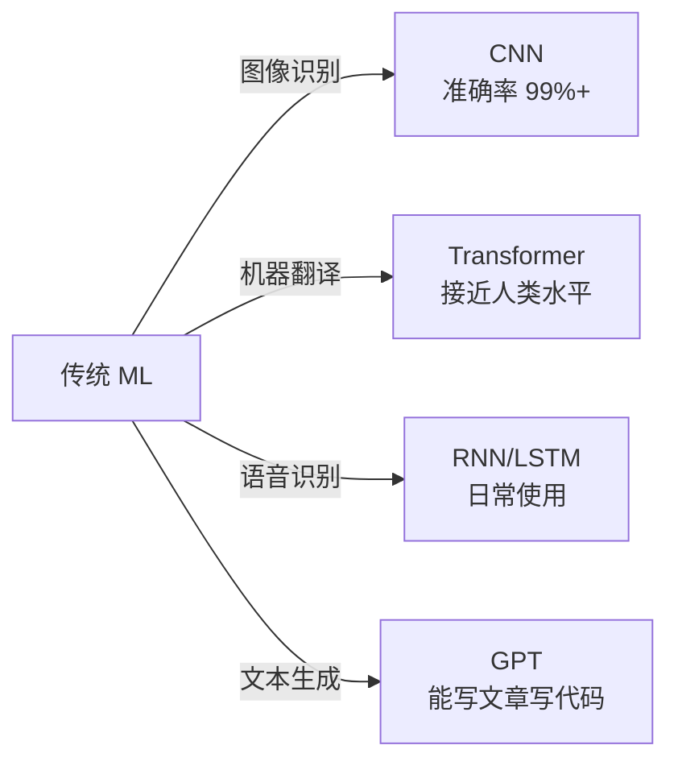
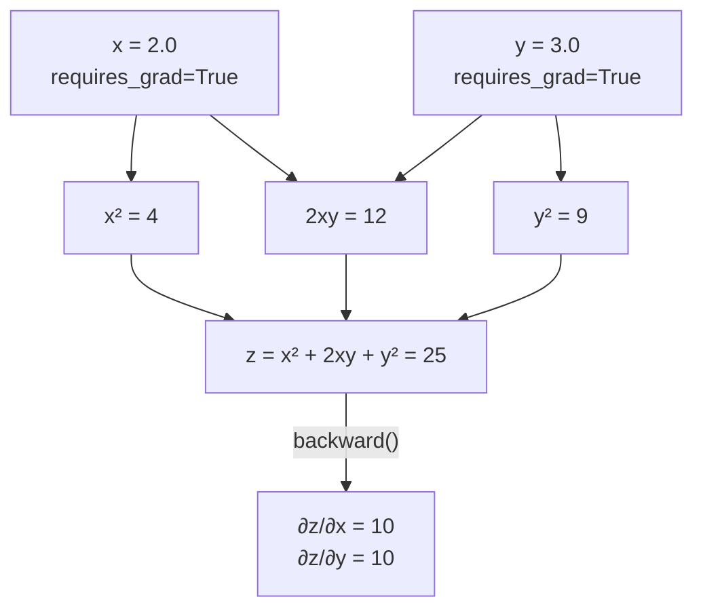
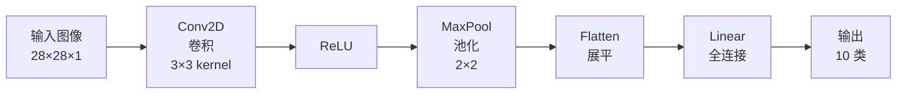
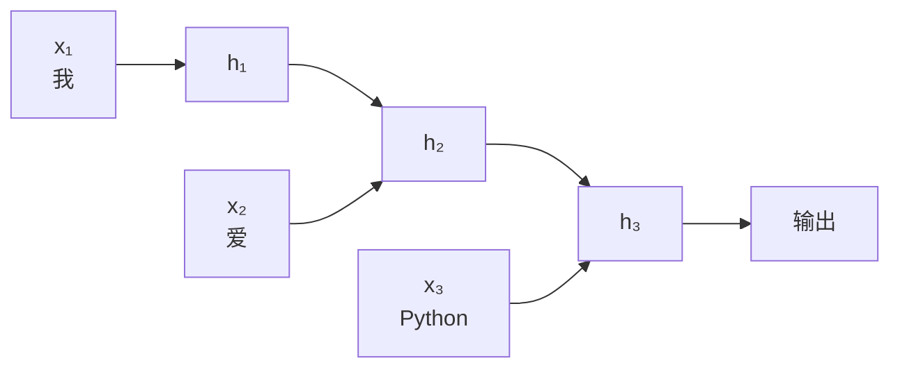
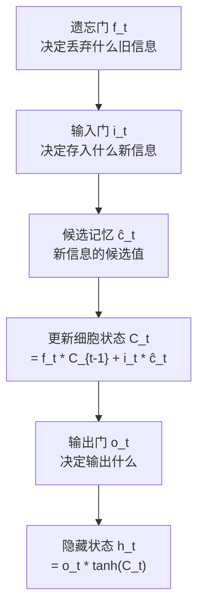
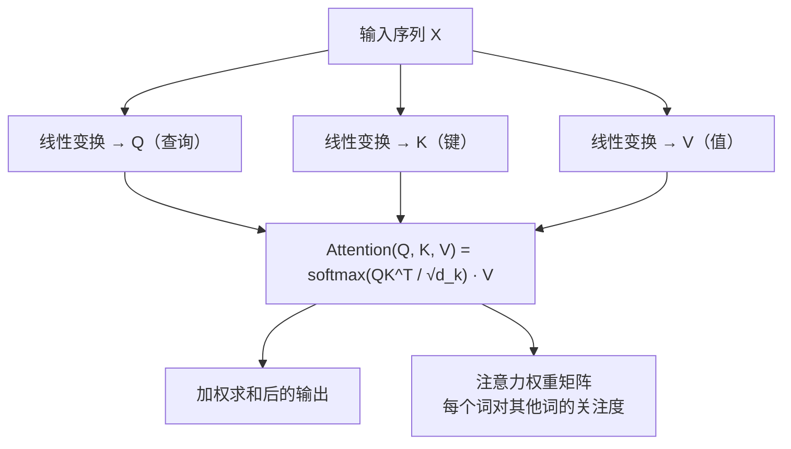

## 为什么需要深度学习？

传统机器学习有局限：特征需要人工设计（特征工程耗时）、难以处理图像/音频/文本等非结构化数据、模型容量有限。

深度学习通过多层神经网络自动学习特征，在以下场景大幅超越传统方法：



## 安装与环境检查

```bash
 macOS（Apple Silicon 用 MPS 加速）
pip install torch torchvision torchaudio

 验证
python -c "
import torch
print(f'PyTorch: {torch.__version__}')
print(f'MPS 可用: {torch.backends.mps.is_available()}')  # Apple GPU
print(f'CUDA 可用: {torch.cuda.is_available()}')          # NVIDIA GPU
"
 PyTorch: 2.3.0
 MPS 可用: True
 CUDA 可用: False
```

## 张量基础

张量（Tensor）是 PyTorch 的核心数据结构，可以理解为多维数组。标量是 0 维张量，向量是 1 维，矩阵是 2 维，图像是 3 维（C×H×W），视频是 4 维。

```python
import torch
import numpy as np

 ========== 创建张量 ==========
a = torch.tensor([1, 2, 3])           # 从 Python 列表
b = torch.zeros((3, 4))               # 全零
c = torch.ones((2, 3))                # 全一
d = torch.randn(3, 3)                 # 标准正态分布随机数
e = torch.arange(0, 10, 2)            # [0, 2, 4, 6, 8]
f = torch.linspace(0, 1, 5)           # [0.0, 0.25, 0.5, 0.75, 1.0]

print(f"a: {a}, dtype: {a.dtype}")     # a: tensor([1, 2, 3]), dtype: torch.int64
print(f"d shape: {d.shape}")           # d shape: torch.Size([3, 3])

 ========== 张量属性 ==========
x = torch.randn(2, 3, 4)
print(f"shape: {x.shape}")             # torch.Size([2, 3, 4])
print(f"dtype: {x.dtype}")             # torch.float32
print(f"device: {x.device}")           # cpu

 ========== 张量操作 ==========
a = torch.tensor([[1, 2], [3, 4]])
b = torch.tensor([[5, 6], [7, 8]])

print(a + b)          # 加法: [[6, 8], [10, 12]]
print(a * b)          # 逐元素乘: [[5, 12], [21, 32]]
print(a @ b)          # 矩阵乘: [[19, 22], [43, 50]]
print(a[0])           # 第一行: [1, 2]
print(a[:, 1])        # 第二列: [2, 4]
print(a[0, 1])        # 第一个元素: 2

 拼接
c = torch.cat([a, b], dim=0)   # 按行拼接 → shape (4, 2)
d = torch.cat([a, b], dim=1)   # 按列拼接 → shape (2, 4)

 重塑
e = torch.arange(12).reshape(3, 4)  # shape (3, 4)
f = e.view(-1)                      # 展平 → shape (12)

 ========== NumPy 互转 ==========
np_arr = np.array([1, 2, 3])
tensor = torch.from_numpy(np_arr)   # NumPy → Tensor（共享内存）
arr = tensor.numpy()                # Tensor → NumPy

 ========== GPU 加速 ==========
device = torch.device("mps" if torch.backends.mps.is_available() else "cpu")
x = torch.randn(1000, 1000, device=device)  # 直接在 GPU 上创建
y = torch.randn(1000, 1000, device=device)
z = x @ y  # GPU 上的矩阵乘法，比 CPU 快很多
print(f"z device: {z.device}")  # mps
```

## 自动求导（Autograd）

Autograd 是 PyTorch 的灵魂。它能自动计算任意函数对任意参数的导数，这是训练神经网络的基础。

```python
import torch

 ========== requires_grad：标记需要求导的张量 ==========
x = torch.tensor(2.0, requires_grad=True)
y = torch.tensor(3.0, requires_grad=True)

 定义计算图
z = x**2 + 2*x*y + y**2  # z = x² + 2xy + y²

 反向传播，计算梯度
z.backward()

 ∂z/∂x = 2x + 2y = 2(2) + 2(3) = 10
 ∂z/∂y = 2x + 2y = 2(2) + 2(3) = 10
print(f"∂z/∂x = {x.grad}")  # tensor(10.)
print(f"∂z/∂y = {y.grad}")  # tensor(10.)
```



### 计算图与反向传播

PyTorch 用**计算图（Computational Graph）**记录每一步运算。调用 `backward()` 时，从输出节点开始，沿着边**反向**传播梯度，利用链式法则逐层计算。

**链式法则**：如果 $z = f(g(x))$，那么 $\frac{dz}{dx} = \frac{dz}{df} \cdot \frac{df}{dg} \cdot \frac{dg}{dx}$。

```python
 多层计算图的梯度传播
x = torch.tensor(1.0, requires_grad=True)
a = x * 2        # a = 2x
b = a ** 2       # b = a² = 4x²
c = b + 1        # c = 4x² + 1

c.backward()
 dc/dx = dc/db * db/da * da/dx = 1 * 2a * 2 = 2(2x)(2) = 8x = 8
print(f"∂c/∂x = {x.grad}")  # tensor(8.)
```

### 梯度累积与清零

```python
 ⚠️ 梯度是累积的！不清零会越加越大
x = torch.tensor(1.0, requires_grad=True)

y = x ** 2
y.backward()
print(x.grad)  # tensor(2.)

y = x ** 3
y.backward()
print(x.grad)  # tensor(5.)  ← 2 + 3，累积了！

 正确做法：每次 backward 前清零
x.grad.zero_()
y = x ** 3
y.backward()
print(x.grad)  # tensor(3.)  ← 正确
```

### detach() 和 torch.no_grad()

```python
x = torch.tensor(2.0, requires_grad=True)
y = x ** 2

 detach()：创建一个不需要梯度的新张量
y_detached = y.detach()
print(y_detached.requires_grad)  # False

 torch.no_grad()：上下文管理器，推理时节省内存
with torch.no_grad():
    z = x ** 2 + 1
    print(z.requires_grad)  # False

 训练时需要梯度，推理（预测）时不需要
 这是 PyTorch 中最重要的优化之一
```

## 神经网络（nn.Module）

```python
import torch
import torch.nn as nn

 ========== 常用层 ==========

 全连接层：y = xW^T + b
linear = nn.Linear(in_features=10, out_features=5)
x = torch.randn(3, 10)  # 3 个样本，每个 10 个特征
output = linear(x)
print(f"输出 shape: {output.shape}")  # torch.Size([3, 5])

 激活函数
relu = nn.ReLU()           # max(0, x)，最常用
sigmoid = nn.Sigmoid()     # 1/(1+e^(-x))，二分类输出层
softmax = nn.Softmax(dim=1)  # 多分类输出层

x = torch.tensor([-2.0, -1.0, 0.0, 1.0, 2.0])
print(f"ReLU:     {relu(x)}")      # [0., 0., 0., 1., 2.]
print(f"Sigmoid:  {sigmoid(x)}")   # [0.12, 0.27, 0.50, 0.73, 0.88]

 Dropout：随机丢弃部分神经元，防止过拟合
dropout = nn.Dropout(p=0.3)  # 30% 概率丢弃
 只在训练时生效，推理时自动关闭

 批归一化：对每个 mini-batch 做归一化，加速训练
batchnorm = nn.BatchNorm1d(num_features=10)
```


### 自定义网络

```python
import torch.nn as nn
import torch.optim as optim

class IrisNet(nn.Module):
    """自定义神经网络：用于鸢尾花分类"""
    def __init__(self, input_size: int, hidden_size: int, num_classes: int):
        super().__init__()
        # 用 Sequential 快速搭建网络
        self.net = nn.Sequential(
            nn.Linear(input_size, hidden_size),  # 输入层 → 隐藏层
            nn.BatchNorm1d(hidden_size),          # 批归一化
            nn.ReLU(),                            # 激活
            nn.Dropout(0.3),                      # 防过拟合
            nn.Linear(hidden_size, hidden_size),  # 隐藏层 → 隐藏层
            nn.ReLU(),
            nn.Linear(hidden_size, num_classes)   # 隐藏层 → 输出层
        )

    def forward(self, x: torch.Tensor) -> torch.Tensor:
        """前向传播：定义数据如何流过网络"""
        return self.net(x)
```

## 训练流程（完整 6 步）

```python
from sklearn.datasets import load_iris
from sklearn.model_selection import train_test_split
from sklearn.preprocessing import StandardScaler
import torch
from torch.utils.data import TensorDataset, DataLoader
import torch.nn as nn
import torch.optim as optim

 ========== Step 1: 准备数据 ==========
iris = load_iris()
X, y = iris.data, iris.target

X_train, X_test, y_train, y_test = train_test_split(
    X, y, test_size=0.2, random_state=42, stratify=y
)

 标准化
scaler = StandardScaler()
X_train = scaler.fit_transform(X_train)
X_test = scaler.transform(X_test)

 转为 PyTorch 张量
X_train_t = torch.FloatTensor(X_train)
y_train_t = torch.LongTensor(y_train)
X_test_t = torch.FloatTensor(X_test)
y_test_t = torch.LongTensor(y_test)

 创建 DataLoader（自动分批次、打乱）
train_dataset = TensorDataset(X_train_t, y_train_t)
train_loader = DataLoader(train_dataset, batch_size=16, shuffle=True)

 ========== Step 2: 定义模型 ==========
model = IrisNet(input_size=4, hidden_size=32, num_classes=3)

 ========== Step 3: 定义损失函数 ==========
criterion = nn.CrossEntropyLoss()  # 多分类交叉熵（内置 Softmax）

 ========== Step 4: 定义优化器 ==========
optimizer = optim.Adam(model.parameters(), lr=0.001)
 Adam 是最常用的优化器，自适应学习率
 其他选择：SGD（更基础）、AdamW（加权重衰减）

 学习率调度器：训练过程中自动降低学习率
scheduler = optim.lr_scheduler.StepLR(optimizer, step_size=30, gamma=0.5)

 ========== Step 5: 训练循环 ==========
num_epochs = 100

for epoch in range(num_epochs):
    model.train()  # 设为训练模式（启用 Dropout、BatchNorm 更新）
    epoch_loss = 0.0

    for batch_X, batch_y in train_loader:
        # 前向传播
        outputs = model(batch_X)
        loss = criterion(outputs, batch_y)

        # 反向传播
        optimizer.zero_grad()  # 清零梯度（重要！）
        loss.backward()        # 计算梯度
        optimizer.step()       # 更新参数

        epoch_loss += loss.item()

    scheduler.step()  # 更新学习率

    if (epoch + 1) % 20 == 0:
        print(f"Epoch [{epoch+1}/{num_epochs}], Loss: {epoch_loss/len(train_loader):.4f}")

 Epoch [20/100], Loss: 0.8523
 Epoch [40/100], Loss: 0.4512
 Epoch [60/100], Loss: 0.2315
 Epoch [80/100], Loss: 0.1421
 Epoch [100/100], Loss: 0.0987

 ========== Step 6: 评估 ==========
model.eval()  # 设为评估模式（关闭 Dropout、BatchNorm 用运行统计量）
with torch.no_grad():
    outputs = model(X_test_t)
    _, predicted = torch.max(outputs, 1)  # 取概率最大的类别
    accuracy = (predicted == y_test_t).sum().item() / len(y_test_t)
    print(f"测试集准确率: {accuracy:.4f}")
    # 测试集准确率: 1.0000
```

:::tip 训练循环核心模式
前向传播 → 计算损失 → 清零梯度 → 反向传播 → 更新参数。这 5 步是所有 PyTorch 训练的固定套路，记住这个模式就掌握了一半。
:::

## CNN 卷积神经网络

CNN 是处理图像的核心架构。核心思想：用卷积核（filter）在图像上滑动，提取局部特征。



```python
class SimpleCNN(nn.Module):
    def __init__(self):
        super().__init__()
        self.features = nn.Sequential(
            # 卷积层：32 个 3×3 卷积核，提取边缘、纹理等特征
            nn.Conv2d(1, 32, kernel_size=3, padding=1),  # 28×28 → 28×28
            nn.ReLU(),
            nn.MaxPool2d(2),  # 28×28 → 14×14（取 2×2 区域最大值）

            nn.Conv2d(32, 64, kernel_size=3, padding=1),  # 14×14 → 14×14
            nn.ReLU(),
            nn.MaxPool2d(2),  # 14×14 → 7×7
        )
        self.classifier = nn.Sequential(
            nn.Flatten(),                          # 7×7×64 → 3136
            nn.Linear(64 * 7 * 7, 128),
            nn.ReLU(),
            nn.Dropout(0.5),
            nn.Linear(128, 10)  # 10 个类别
        )

    def forward(self, x):
        x = self.features(x)
        x = self.classifier(x)
        return x
```

**经典架构**：LeNet（1998，手写数字识别）、VGGNet（深层小卷积核）、ResNet（残差连接，解决梯度消失，ImageNet 冠军）、EfficientNet（自动搜索网络结构）。

## RNN / LSTM

RNN 处理序列数据（文本、时间序列、语音）。核心：每一步的输出不仅依赖当前输入，还依赖之前的隐藏状态。



**LSTM（长短期记忆网络）** 解决了 RNN 的梯度消失问题，通过三个"门"控制信息的流动：



```python
class SentimentLSTM(nn.Module):
    def __init__(self, vocab_size, embed_dim, hidden_dim, num_classes):
        super().__init__()
        self.embedding = nn.Embedding(vocab_size, embed_dim)
        self.lstm = nn.LSTM(embed_dim, hidden_dim, batch_first=True, num_layers=2)
        self.fc = nn.Linear(hidden_dim, num_classes)

    def forward(self, x):
        embedded = self.embedding(x)        # (batch, seq_len, embed_dim)
        lstm_out, (h_n, c_n) = self.lstm(embedded)
        return self.fc(h_n[-1])             # 用最后一层的隐藏状态
```

## Transformer 简介

Transformer 是 2017 年 Google 提出的架构，彻底改变了 NLP 领域。GPT、BERT、Qwen 等大模型都基于 Transformer。

### 自注意力机制（Self-Attention）

核心思想：让序列中的每个位置都能"关注"其他所有位置，动态计算它们之间的相关性。



**直觉理解**：Q（Query）是"我在找什么"，K（Key）是"我有什么"，V（Value）是"我的内容"。就像搜索引擎：你输入查询词（Q），系统匹配关键词（K），返回内容（V）。

```python
import torch
import torch.nn as nn
import math

class SelfAttention(nn.Module):
    def __init__(self, embed_dim, num_heads):
        super().__init__()
        self.num_heads = num_heads
        self.head_dim = embed_dim // num_heads

        # Q、K、V 的线性变换
        self.W_q = nn.Linear(embed_dim, embed_dim)
        self.W_k = nn.Linear(embed_dim, embed_dim)
        self.W_v = nn.Linear(embed_dim, embed_dim)
        self.W_o = nn.Linear(embed_dim, embed_dim)

    def forward(self, x):
        B, T, C = x.shape  # (batch_size, seq_len, embed_dim)

        # 计算 Q、K、V
        Q = self.W_q(x)  # (B, T, C)
        K = self.W_k(x)
        V = self.W_v(x)

        # 多头注意力：把 C 维度拆成 num_heads 个 head_dim 维度
        Q = Q.view(B, T, self.num_heads, self.head_dim).transpose(1, 2)  # (B, H, T, D)
        K = K.view(B, T, self.num_heads, self.head_dim).transpose(1, 2)
        V = V.view(B, T, self.num_heads, self.head_dim).transpose(1, 2)

        # 注意力分数：QK^T / √d_k
        scores = torch.matmul(Q, K.transpose(-2, -1)) / math.sqrt(self.head_dim)
        attn_weights = torch.softmax(scores, dim=-1)  # (B, H, T, T)

        # 加权求和
        output = torch.matmul(attn_weights, V)  # (B, H, T, D)
        output = output.transpose(1, 2).contiguous().view(B, T, C)

        return self.W_o(output)
```

**多头注意力（Multi-Head Attention）**：把注意力计算拆成多个"头"并行做，每个头关注不同方面的信息，最后拼接起来。相当于让多个"专家"从不同角度分析同一个问题。

**位置编码（Positional Encoding）**：Transformer 没有循环结构，本身不知道词的顺序。通过给每个位置加一个固定的编码（正弦/余弦函数），让模型知道词的相对位置。

**完整 Transformer 架构**：由 N 个 Encoder 层和 N 个 Decoder 层堆叠而成。每个 Encoder 层包含多头注意力 + 前馈网络；每个 Decoder 层额外有交叉注意力（关注 Encoder 输出）。

## 模型保存与加载

```python
 保存模型（只保存参数，不保存结构）
torch.save(model.state_dict(), "iris_model.pth")

 加载模型
model = IrisNet(input_size=4, hidden_size=32, num_classes=3)
model.load_state_dict(torch.load("iris_model.pth", weights_only=True))
model.eval()

 保存整个模型（包括结构，不推荐，可能有版本兼容问题）
 torch.save(model, "iris_model_full.pth")
```

## PyTorch vs TensorFlow

| 维度 | PyTorch | TensorFlow/Keras |
|------|---------|-----------------|
| 研究界 | **主流**，灵活，调试方便 | 较少 |
| 工业界 | 越来越多 | **成熟**，部署方便 |
| API 风格 | Pythonic，像写普通代码 | 声明式，Keras 简洁 |
| 动态图 | 天然支持 | TF 2.x 也支持 |
| 移动端 | 支持 | **更成熟**（TFLite） |
| **推荐** | 学习和研究用 | 生产部署 |

## Java 对比：DJL

```java
// DJL (Deep Java Library) — AWS 开源的 Java 深度学习框架
// 可以加载 PyTorch/TensorFlow/MXNet 训练好的模型

import ai.djl.ModelException;
import ai.djl.inference.Predictor;
import ai.djl.repository.zoo.Criteria;
import ai.djl.translate.TranslateException;

Criteria<Image, Classifications> criteria = Criteria.builder()
    .setTypes(Image.class, Classifications.class)
    .optModelUrls("https://example.com/model.zip")
    .build();

try (Predictor<Image, Classifications> predictor = criteria.loadModel().newPredictor()) {
    Classifications result = predictor.predict(image);
    System.out.println(result.best().getClassName());
}
```

## 本章练习题

**1.** `requires_grad=True` 的作用是什么？不是所有张量都需要设为 True 吗？


**参考答案**

不是。只有需要计算梯度的张量（通常是模型参数和输入）才设 `requires_grad=True`。标签、中间结果等不需要梯度。设置 `requires_grad=True` 会让 PyTorch 记录该张量的计算图，消耗额外内存。模型参数（`nn.Linear` 的权重）默认就是 `requires_grad=True`。


**2.** 为什么每次 `backward()` 前要 `zero_grad()`？


**参考答案**

PyTorch 的梯度是**累积**的（不会自动清零）。如果不清零，多次 backward 的梯度会叠加，导致参数更新方向错误。这实际上是个 feature——梯度累积可以让小 batch 模拟大 batch 的效果。


**3.** Dropout 为什么能防止过拟合？


**参考答案**

Dropout 训练时随机丢弃一部分神经元，迫使网络不依赖任何单个神经元，相当于训练了多个子网络的集成。推理时所有神经元都参与，但输出会乘以 (1-p) 来补偿。直觉上，就像一个团队中随机抽人做任务，每个人都要能独立工作。


**4.** 解释 Transformer 中 Q、K、V 的含义。


**参考答案**

Q（Query）= 查询向量，代表"我在找什么信息"。K（Key）= 键向量，代表"我能提供什么信息"。V（Value）= 值向量，代表"我的实际内容"。注意力计算：用 Q 和 K 的点积衡量相关性，作为权重对 V 做加权求和。就像数据库查询：WHERE（Q 匹配 K）→ SELECT（返回 V）。


**5.** CNN 为什么比全连接网络更适合图像？


**参考答案**

两个核心优势：(1) **局部连接**：卷积核只关注局部区域，符合图像的局部特征（边缘、纹理）；(2) **参数共享**：同一个卷积核在整个图像上滑动，大幅减少参数量。全连接网络把图像展平后每个像素连接到每个神经元，参数量爆炸且丢失空间信息。


---