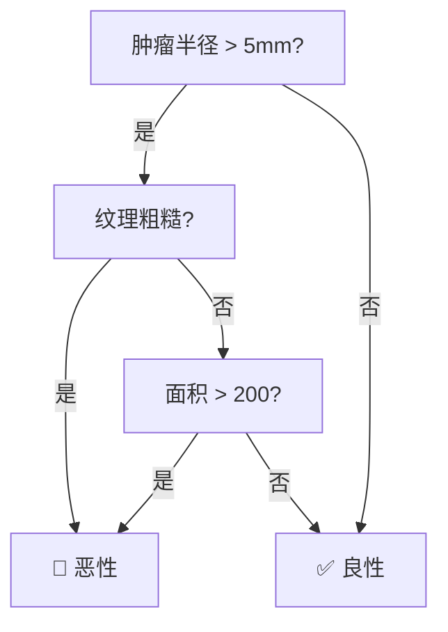
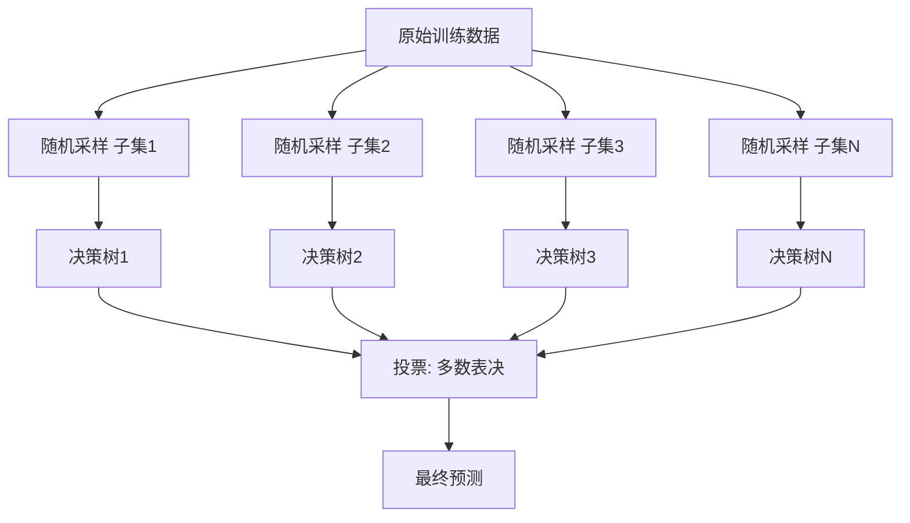
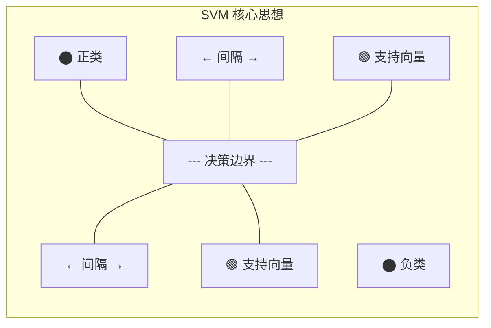
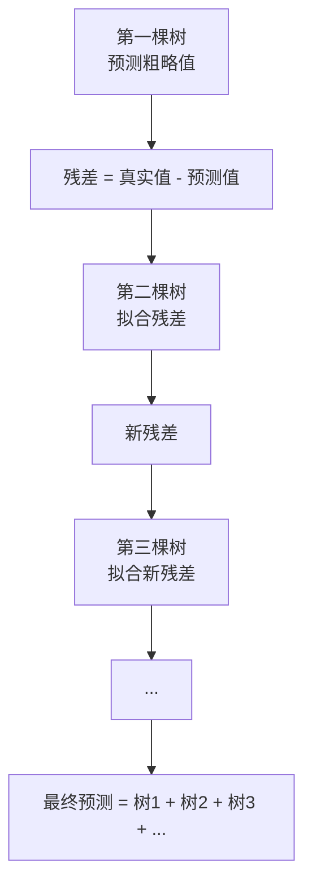
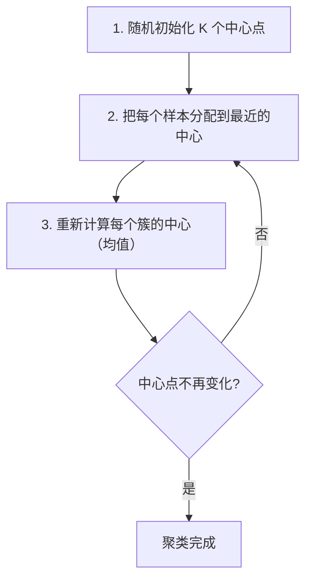
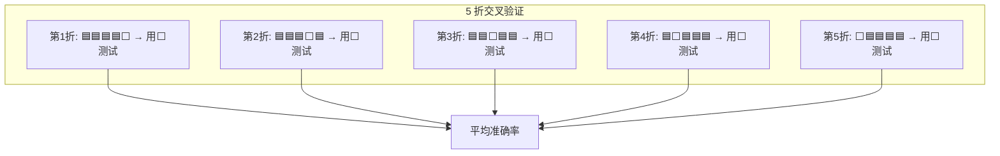

Scikit-learn（sklearn）是 Python 传统机器学习的瑞士军刀。API 设计优雅一致，覆盖从预处理到模型评估的完整流程。

## 安装与环境检查

```bash
pip install scikit-learn
python -c "import sklearn; print(sklearn.__version__)"
 1.5.2
```

## 数据预处理 Pipeline

Pipeline 把多个步骤串联成一个整体，避免数据泄漏（测试集的信息泄露到训练过程）。

```python
from sklearn.pipeline import Pipeline
from sklearn.preprocessing import StandardScaler, OneHotEncoder
from sklearn.compose import ColumnTransformer
from sklearn.impute import SimpleImputer
from sklearn.model_selection import train_test_split
import pandas as pd
import numpy as np

df = pd.DataFrame({
    "年龄": [25, 30, 35, 40, 45, 28, 33, np.nan, 50, 22],
    "收入": [5000, 8000, 6000, 12000, 15000, 7000, 9000, 11000, np.nan, 4500],
    "性别": ["男", "女", "男", "女", "男", "女", "男", "女", "男", "女"],
    "城市": ["北京", "上海", "广州", "北京", "上海", "广州", "北京", "上海", "北京", "广州"],
    "购买": [0, 1, 0, 1, 1, 0, 1, 1, 1, 0]
})

X = df.drop("购买", axis=1)
y = df["购买"]

 stratify=y 保证正负样本比例一致
X_train, X_test, y_train, y_test = train_test_split(
    X, y, test_size=0.3, random_state=42, stratify=y
)
print(f"训练集: {X_train.shape[0]} 条, 测试集: {X_test.shape[0]} 条")
 训练集: 7 条, 测试集: 3 条

 数值特征处理
numeric_transformer = Pipeline(steps=[
    ("imputer", SimpleImputer(strategy="median")),
    ("scaler", StandardScaler())
])

 类别特征处理
categorical_transformer = Pipeline(steps=[
    ("imputer", SimpleImputer(strategy="most_frequent")),
    ("onehot", OneHotEncoder(drop="first", sparse_output=False))
])

preprocessor = ColumnTransformer(transformers=[
    ("num", numeric_transformer, ["年龄", "收入"]),
    ("cat", categorical_transformer, ["性别", "城市"])
])
```

## 分类算法

### 逻辑回归（Logistic Regression）

虽然名字里有"回归"，但它是**分类算法**。核心思想：用 sigmoid 函数把线性输出压缩到 (0,1)，作为正类的概率。


**Sigmoid 函数**：$\sigma(z) = \frac{1}{1 + e^{-z}}$，把任意实数映射到 (0, 1)。

```python
from sklearn.linear_model import LogisticRegression
from sklearn.datasets import load_breast_cancer
from sklearn.metrics import classification_report

 加载乳腺癌数据集（二分类：恶性/良性）
data = load_breast_cancer()
X, y = data.data, data.target

X_train, X_test, y_train, y_test = train_test_split(
    X, y, test_size=0.2, random_state=42, stratify=y
)

 创建 Pipeline（预处理 + 模型）
pipe = Pipeline(steps=[
    ("preprocessor", StandardScaler()),
    ("classifier", LogisticRegression(max_iter=1000, random_state=42))
])

pipe.fit(X_train, y_train)
y_pred = pipe.predict(X_test)

print(classification_report(y_test, y_pred, target_names=data.target_names))
               precision    recall  f1-score   support
    malignant       0.98      0.93      0.95        42
       benign       0.96      0.99      0.98        72
     accuracy                           0.97       114
    macro avg       0.97      0.96      0.97       114
 weighted avg       0.97      0.97      0.97       114
```

:::tip Java 开发者理解逻辑回归
逻辑回归 ≈ 一个线性回归 + 一个 Sigmoid 激活函数。权重 w 类似于你写的规则权重，但不是手动设定的，而是通过梯度下降从数据中自动学到的。
:::

### 决策树（Decision Tree）

像一棵倒过来的树，每个节点问一个问题，根据答案走到不同的分支。



```python
from sklearn.tree import DecisionTreeClassifier, export_text

tree = DecisionTreeClassifier(max_depth=3, random_state=42)
tree.fit(X_train, y_train)

print(f"准确率: {tree.score(X_test, y_test):.4f}")
 准确率: 0.9474

 查看决策规则（前几条）
print(export_text(tree, feature_names=data.feature_names, max_depth=2))
 |--- worst radius <= 16.80
 |   |--- worst concave points <= 0.14
 |   |   |--- class: 1  (良性)
 |   |--- worst concave points >  0.14
 |   |   |--- class: 0  (恶性)
 |--- worst radius >  16.80
     |--- ...
```

**核心原理**：
- **信息增益（Information Gain）**：选择使分裂后信息熵减少最多的特征。信息熵 $H = -\sum p_i \log_2 p_i$，衡量不确定性。
- **基尼系数（Gini Impurity）**：$Gini = 1 - \sum p_i^2$，衡量节点中类别混合程度。sklearn 默认使用基尼系数。
- **剪枝（Pruning）**：限制树的深度（`max_depth`）、叶节点最少样本数（`min_samples_leaf`），防止过拟合。

### 随机森林（Random Forest）

多棵决策树"投票"——每棵树用不同的数据子集和特征子集训练，最终取多数投票结果。



```python
from sklearn.ensemble import RandomForestClassifier

rf = RandomForestClassifier(
    n_estimators=100,    # 100 棵树
    max_depth=5,         # 限制深度防过拟合
    random_state=42,
    oob_score=True       # 启用 OOB 评估
)
rf.fit(X_train, y_train)

print(f"测试集准确率: {rf.score(X_test, y_test):.4f}")
 测试集准确率: 0.9649

print(f"OOB 准确率: {rf.oob_score_:.4f}")
 OOB 准确率: 0.9604

 特征重要性：哪些特征对预测最有用？
for name, imp in sorted(
    zip(data.feature_names, rf.feature_importances_),
    key=lambda x: -x[1]
)[:5]:
    print(f"  {name}: {imp:.4f}")
 worst concave points: 0.1423
 worst radius: 0.1287
 worst perimeter: 0.1124
 mean concave points: 0.0689
 worst area: 0.0612
```

**Bagging 原理**：每棵树用有放回随机采样（Bootstrap）的数据训练，相当于让多个"专家"独立判断，然后取平均。这样能显著降低方差，减少过拟合。

**OOB（Out-of-Bag）评估**：每棵树训练时约有 37% 的样本没被采到，这些样本可以用来评估这棵树，不需要单独的验证集。

### SVM（支持向量机）

找到一条"最大间隔"的超平面来分隔两类数据。



```python
from sklearn.svm import SVC

 核技巧：用 rbf 核处理非线性可分的数据
svm = SVC(kernel="rbf", C=1.0, gamma="scale", random_state=42)
svm.fit(X_train, y_train)
print(f"SVM 准确率: {svm.score(X_test, y_test):.4f}")
 SVM 准确率: 0.9825
```

**核技巧（Kernel Trick）**：当数据线性不可分时，通过核函数把数据映射到高维空间，在高维空间找到线性分隔面。RBF 核是最常用的，能处理任意形状的决策边界。

### KNN（K 近邻）

最直观的分类算法：看离样本最近的 K 个邻居，多数票决定类别。

```python
from sklearn.neighbors import KNeighborsClassifier

 K=5，使用欧氏距离
knn = KNeighborsClassifier(n_neighbors=5)
knn.fit(X_train, y_train)
print(f"KNN 准确率: {knn.score(X_test, y_test):.4f}")
 KNN 准确率: 0.9561
```

**距离度量**：默认使用欧氏距离 $d = \sqrt{\sum (x_i - y_i)^2}$。也可用曼哈顿距离、余弦相似度等。**注意**：KNN 对特征尺度敏感，必须先标准化！

### XGBoost（梯度提升树）

竞赛和工业界的常胜将军。原理：每棵新树拟合之前所有树的"残差"（预测错误的部分），逐步减少误差。

```python
 pip install xgboost
from xgboost import XGBClassifier

xgb = XGBClassifier(
    n_estimators=100,
    max_depth=4,
    learning_rate=0.1,
    random_state=42,
    eval_metric="logloss",
    use_label_encoder=False
)
xgb.fit(X_train, y_train)
print(f"XGBoost 准确率: {xgb.score(X_test, y_test):.4f}")
 XGBoost 准率: 0.9649
```



:::tip 为什么 XGBoost 在竞赛中常用？
1. **精度高**：Boosting 逐步减小误差，通常比 Bagging 效果更好
2. **速度快**：支持并行化、GPU 加速
3. **鲁棒性强**：内置正则化，自动处理缺失值
4. **可解释**：输出特征重要性
:::

## 回归算法

### 线性回归

用一条直线拟合数据。目标是最小化预测值和真实值的差的平方和（最小二乘法）。

$$Loss = \frac{1}{n} \sum_{i=1}^{n} (y_i - \hat{y}_i)^2 = \frac{1}{n} \sum_{i=1}^{n} (y_i - wx_i - b)^2$$

```python
from sklearn.linear_model import LinearRegression
from sklearn.metrics import mean_squared_error, r2_score
from sklearn.preprocessing import PolynomialFeatures
import numpy as np

 生成示例数据：y = 3x + 2 + 噪声
np.random.seed(42)
X = np.random.rand(100, 1) * 10  # 0~10 的随机数
y = 3 * X.squeeze() + 2 + np.random.randn(100) * 2

X_train, X_test, y_train, y_test = train_test_split(
    X, y, test_size=0.2, random_state=42
)

lr = LinearRegression()
lr.fit(X_train, y_train)
y_pred = lr.predict(X_test)

print(f"系数 w: {lr.coef_[0]:.2f}")   # 3.02（接近真实值 3）
print(f"截距 b: {lr.intercept_:.2f}")  # 2.08（接近真实值 2）
print(f"R² 分数: {r2_score(y_test, y_pred):.4f}")  # 0.9523
print(f"MSE: {mean_squared_error(y_test, y_pred):.4f}")  # 3.8421
```

**正规方程**：可以直接解出最优解 $w = (X^T X)^{-1} X^T y$，不需要迭代。但当特征数很多时（>10000），矩阵求逆的计算量太大，需要用梯度下降。

### 多项式回归

当数据关系不是线性的（比如 U 型曲线），多项式回归可以拟合非线性关系。

```python
 y = x² + 噪声
X_poly_data = np.random.randn(100, 1) * 2
y_poly = X_poly_data.squeeze() ** 2 + np.random.randn(100) * 0.5

X_train_p, X_test_p, y_train_p, y_test_p = train_test_split(
    X_poly_data, y_poly, test_size=0.2, random_state=42
)

 把 x 变成 [1, x, x²]
poly_features = PolynomialFeatures(degree=2, include_bias=False)
X_train_poly = poly_features.fit_transform(X_train_p)

lr_poly = LinearRegression()
lr_poly.fit(X_train_poly, y_train_p)

X_test_poly = poly_features.transform(X_test_p)
print(f"多项式回归 R²: {r2_score(y_test_p, lr_poly.predict(X_test_poly)):.4f}")
 多项式回归 R²: 0.8845
```

### 随机森林回归

```python
from sklearn.ensemble import RandomForestRegressor

rf_reg = RandomForestRegressor(n_estimators=100, max_depth=5, random_state=42)
rf_reg.fit(X_train, y_train)
print(f"随机森林回归 R²: {r2_score(y_test, rf_reg.predict(X_test)):.4f}")
 随机森林回归 R²: 0.9401
```

## 聚类算法

### K-Means

把数据分成 K 个组，使组内距离最小。

```python
from sklearn.cluster import KMeans
from sklearn.metrics import silhouette_score
import matplotlib.pyplot as plt

 生成 3 个簇的模拟数据
from sklearn.datasets import make_blobs
X_blob, y_blob = make_blobs(n_samples=300, centers=3, random_state=42)

 肘部法则：选择 K
inertias = []
K_range = range(2, 10)
for k in K_range:
    km = KMeans(n_clusters=k, random_state=42, n_init=10)
    km.fit(X_blob)
    inertias.append(km.inertia_)  # 簇内距离之和

plt.plot(K_range, inertias, "bo-")
plt.xlabel("K 值"); plt.ylabel("Inertia（簇内距离）")
plt.title("肘部法则选 K")
plt.savefig("elbow.png", dpi=100)
 在 K=3 处出现明显拐点（"肘部"）

 轮廓系数：衡量聚类质量，范围 [-1, 1]
km_best = KMeans(n_clusters=3, random_state=42, n_init=10)
labels = km_best.fit_predict(X_blob)
print(f"轮廓系数: {silhouette_score(X_blob, labels):.4f}")
 轮廓系数: 0.6819（越接近 1 越好）
```



### DBSCAN

基于密度的聚类，不需要预先指定簇数，能发现任意形状的簇，还能识别异常点。

```python
from sklearn.cluster import DBSCAN

db = DBSCAN(eps=1.0, min_samples=5)  # eps: 邻域半径, min_samples: 最少样本数
labels = db.fit_predict(X_blob)

n_clusters = len(set(labels)) - (1 if -1 in labels else 0)
n_noise = list(labels).count(-1)
print(f"发现 {n_clusters} 个簇, {n_noise} 个噪声点")
 发现 3 个簇, 0 个噪声点
```

## 模型选择与评估

### 交叉验证

把数据分成 K 份，每次用 K-1 份训练、1 份验证，重复 K 次，取平均。



```python
from sklearn.model_selection import cross_val_score, StratifiedKFold

 StratifiedKFold 保证每折中类别比例一致
cv = StratifiedKFold(n_splits=5, shuffle=True, random_state=42)

pipe = Pipeline([
    ("scaler", StandardScaler()),
    ("clf", RandomForestClassifier(n_estimators=100, random_state=42))
])

scores = cross_val_score(pipe, X, y, cv=cv, scoring="accuracy")
print(f"5 折交叉验证: {scores.mean():.4f} ± {scores.std():.4f}")
 5 折交叉验证: 0.9648 ± 0.0197
```

### 网格搜索 & 随机搜索

```python
from sklearn.model_selection import GridSearchCV, RandomizedSearchCV

 GridSearchCV：穷举所有参数组合
param_grid = {
    "n_estimators": [50, 100, 200],
    "max_depth": [3, 5, 7, None],
    "min_samples_split": [2, 5, 10]
}

grid_search = GridSearchCV(
    RandomForestClassifier(random_state=42),
    param_grid,
    cv=5,
    scoring="accuracy",
    n_jobs=-1  # 用所有 CPU 核心
)
grid_search.fit(X_train, y_train)
print(f"最佳参数: {grid_search.best_params_}")
 最佳参数: {'max_depth': 7, 'min_samples_split': 2, 'n_estimators': 200}
print(f"最佳分数: {grid_search.best_score_:.4f}")
 最佳分数: 0.9643

 RandomizedSearchCV：随机采样（参数空间大时更高效）
from scipy.stats import randint
param_dist = {
    "n_estimators": randint(50, 300),
    "max_depth": randint(3, 10),
    "min_samples_split": randint(2, 20)
}
random_search = RandomizedSearchCV(
    RandomForestClassifier(random_state=42),
    param_dist,
    n_iter=20,  # 随机尝试 20 组
    cv=5,
    scoring="accuracy",
    random_state=42
)
random_search.fit(X_train, y_train)
print(f"最佳参数: {random_search.best_params_}")
 最佳参数: {'max_depth': 8, 'min_samples_split': 2, 'n_estimators': 267}
```

### 学习曲线

判断模型是过拟合还是欠拟合。

```python
from sklearn.model_selection import learning_curve
import matplotlib.pyplot as plt

train_sizes, train_scores, val_scores = learning_curve(
    RandomForestClassifier(max_depth=5, random_state=42),
    X, y, cv=5, train_sizes=np.linspace(0.1, 1.0, 10),
    scoring="accuracy", n_jobs=-1
)

train_mean = train_scores.mean(axis=1)
val_mean = val_scores.mean(axis=1)

plt.plot(train_sizes, train_mean, "o-", label="训练集")
plt.plot(train_sizes, val_mean, "o-", label="验证集")
plt.xlabel("训练样本数"); plt.ylabel("准确率")
plt.title("学习曲线"); plt.legend()
plt.savefig("learning_curve.png", dpi=100)
 训练集和验证集的曲线 converge → 模型泛化良好
 训练集远高于验证集 → 过拟合，需要简化模型或增加数据
```

## 实战：Titanic 生存预测

完整流程：数据探索 → 清洗 → 特征工程 → 模型训练 → 评估 → 调参。

```python
import pandas as pd
import numpy as np
from sklearn.ensemble import RandomForestClassifier, GradientBoostingClassifier
from sklearn.model_selection import cross_val_score, GridSearchCV
from sklearn.pipeline import Pipeline
from sklearn.preprocessing import StandardScaler, OneHotEncoder
from sklearn.compose import ColumnTransformer
from sklearn.impute import SimpleImputer

 ========== 1. 加载数据 ==========
url = "https://raw.githubusercontent.com/datasciencedojo/datasets/master/titanic.csv"
df = pd.read_csv(url)
print(f"数据 shape: {df.shape}")
 数据 shape: (891, 12)
print(df.head())
    PassengerId  Survived  Pclass  ...     Ticket  Cabin  Embarked
 0            1         0       3  ...  A/5 21171    NaN         S
 1            2         1       1  ...  PC 17599    C85         C

 ========== 2. 数据探索 ==========
print(df.info())
print(f"\n缺失值:\n{df.isnull().sum()}")
 Age      177
 Cabin    687
 Embarked   2

print(f"\n生存率: {df['Survived'].mean():.2%}")
 生存率: 38.38%

 ========== 3. 特征工程 ==========
def engineer_features(df):
    """从原始数据中提取有用特征"""
    df = df.copy()

    # 从 Name 中提取称谓
    df["Title"] = df["Name"].str.extract(r" ([A-Za-z]+)\.")
    df["Title"] = df["Title"].replace(
        ["Lady","Countess","Dr","Rev","Sir","Major","Col","Don","Jonkheer","Capt"],
        "Rare"
    )
    df["Title"] = df["Title"].replace({"Mlle": "Miss", "Ms": "Miss", "Mme": "Mrs"})

    # 家庭大小
    df["FamilySize"] = df["SibSp"] + df["Parch"] + 1
    df["IsAlone"] = (df["FamilySize"] == 1).astype(int)

    # 是否有船舱号
    df["HasCabin"] = df["Cabin"].notnull().astype(int)

    return df

df = engineer_features(df)

 ========== 4. 定义特征 ==========
features = ["Pclass", "Sex", "Age", "Fare", "Embarked", "Title",
            "FamilySize", "IsAlone", "HasCabin"]
numeric_features = ["Age", "Fare", "FamilySize"]
categorical_features = ["Pclass", "Sex", "Embarked", "Title", "IsAlone", "HasCabin"]

X = df[features]
y = df["Survived"]

 ========== 5. 构建 Pipeline ==========
numeric_transformer = Pipeline(steps=[
    ("imputer", SimpleImputer(strategy="median")),
    ("scaler", StandardScaler())
])

categorical_transformer = Pipeline(steps=[
    ("imputer", SimpleImputer(strategy="most_frequent")),
    ("onehot", OneHotEncoder(handle_unknown="ignore", sparse_output=False))
])

preprocessor = ColumnTransformer(transformers=[
    ("num", numeric_transformer, numeric_features),
    ("cat", categorical_transformer, categorical_features)
])

 ========== 6. 模型训练与评估 ==========
models = {
    "Random Forest": RandomForestClassifier(n_estimators=100, random_state=42),
    "Gradient Boosting": GradientBoostingClassifier(n_estimators=100, random_state=42),
}

for name, model in models.items():
    pipe = Pipeline([("preprocessor", preprocessor), ("clf", model)])
    scores = cross_val_score(pipe, X, y, cv=5, scoring="accuracy")
    print(f"{name}: {scores.mean():.4f} ± {scores.std():.4f}")
 Random Forest: 0.8104 ± 0.0349
 Gradient Boosting: 0.8283 ± 0.0383

 ========== 7. 调参 ==========
pipe = Pipeline([
    ("preprocessor", preprocessor),
    ("clf", GradientBoostingClassifier(random_state=42))
])

param_grid = {
    "clf__n_estimators": [50, 100, 200],
    "clf__max_depth": [3, 5, 7],
    "clf__learning_rate": [0.05, 0.1, 0.2]
}

grid = GridSearchCV(pipe, param_grid, cv=5, scoring="accuracy", n_jobs=-1)
grid.fit(X, y)
print(f"最佳参数: {grid.best_params_}")
 最佳参数: {'clf__learning_rate': 0.05, 'clf__max_depth': 3, 'clf__n_estimators': 200}
print(f"最佳分数: {grid.best_score_:.4f}")
 最佳分数: 0.8350
```

## 本章练习题

**1.** Pipeline 有什么好处？不用 Pipeline 直接一步步处理数据会怎样？


**参考答案**

Pipeline 的好处：(1) 避免数据泄漏——测试集的信息不会泄露到训练过程（比如用全数据的均值做标准化）；(2) 代码更简洁，训练和预测只需一行；(3) 可以和 GridSearchCV 配合，对 Pipeline 中的所有步骤一起调参。不用 Pipeline 时，如果先用全数据 fit 了 StandardScaler，测试集的信息就泄露了，评估结果会偏乐观。


**2.** 随机森林和 XGBoost 的核心区别是什么？


**参考答案**

随机森林用 **Bagging**（并行训练多棵独立的树，取投票），目标是降低方差。XGBoost 用 **Boosting**（串行训练，每棵树拟合之前树的残差），目标是降低偏差。通常 Boosting 的精度更高，但更容易过拟合，需要更仔细的调参。


**3.** 什么时候用 KNN，什么时候用 SVM？


**参考答案**

KNN 适合数据量小、特征少的简单场景，但预测速度慢（需要和所有训练样本算距离）。SVM 适合中小数据集、高维数据（如文本分类），对特征尺度敏感需要标准化。大数据集（>10万样本）时两者都不太适合，随机森林和 XGBoost 更好。


**4.** 交叉验证中 K 值怎么选？


**参考答案**

常用 K=5 或 K=10。K 越大，每次训练的数据越多，评估结果越稳定，但计算量也越大。数据量小时用 K=10（留一法极端情况 K=n），数据量大时用 K=5。类别不平衡时用 StratifiedKFold。


**5.** 在 Titanic 案例中，为什么要把 Title 从 Name 中提取出来？


**参考答案**

Title（称谓如 Mr、Mrs、Miss）包含了性别和年龄段的信息，而且和生存率强相关（女性和儿童的生存率更高）。直接用 Name 字符串做特征没有意义，但提取出的 Title 是一个高信息量的类别特征。


---