# 高并发架构

> 高并发不是"把服务器加到 100 台"就能解决的。10,000 QPS 和 1,000,000 QPS 面对的挑战完全不同——数据库扛不住、缓存击穿、限流怎么做、消息堆积怎么处理。这篇文章从"请求进来"到"响应返回"，讲清楚每个环节的应对策略。

## 基础入门：什么是高并发？

### 高并发场景有多常见？

| 场景 | 特点 | 典型 QPS | 核心挑战 |
|------|------|---------|---------|
| 🔥 秒杀 | 瞬时流量暴增 100 倍 | 10 万+ | 超卖、库存一致性 |
| 📱 微博热搜 | 读多写少 | 数万 | 热点数据读取 |
| 🎮 直播互动 | 高频写入，实时性要求高 | 数万 | 写入瓶颈、消息分发 |
| 🎫 抢票 | 短时涌入，竞争激烈 | 100 万+ | 公平性、防刷 |
| 💰 红包 | 瞬时高并发 + 金额计算 | 50 万+ | 金额不能出错 |

### 三大核心指标

| 指标 | 含义 | 目标 | 计算方式 |
|------|------|------|---------|
| **QPS** | 每秒查询数 | 根据业务定 | `总请求数 / 时间（秒）` |
| **响应时间（RT）** | 请求处理时间 | < 200ms（用户无感知） | P99 更有参考价值 |
| **可用性** | 系统正常服务时间占比 | 99.99%（一年宕机 < 53 分钟） | `(总时间 - 故障时间) / 总时间` |

::: tip 关注 P99 而非平均值
平均响应时间 100ms 可能隐藏了真相：99% 的请求 50ms，但 1% 的请求 5000ms。**P99（第 99 百分位）** 才是用户体验的真实反映。用户不会记得那 99 次快的体验，只会记得那 1 次卡的体验。
:::

---

## 高并发全景——请求的"通关之路"

一个请求从用户发起到收到响应，要经过层层"关卡"，每一层都在保护后端不被压垮：

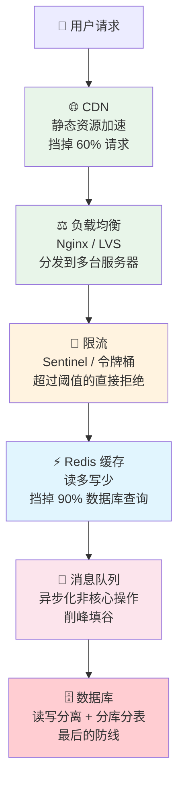

::: tip 核心思路
高并发的本质就是**层层拦截**：每一层挡掉一部分请求，最终到达数据库的请求量是可控的。CDN 挡静态资源、缓存挡读请求、MQ 挡写请求的峰值、限流挡恶意流量。**目标是让 99% 的请求在前三层就被处理掉，只有 1% 到达数据库**。
:::

---

## 缓存——高并发的第一道防线

### 缓存读写策略

缓存不是"查不到就去 DB 查然后放进缓存"这么简单，需要根据场景选择不同的读写策略。

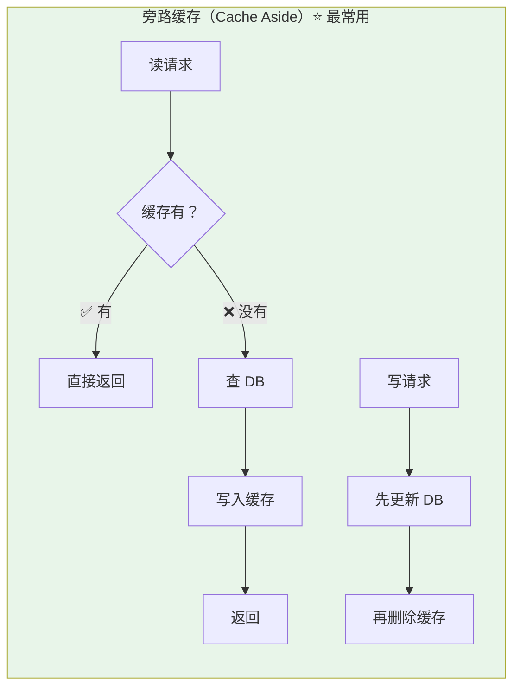

**旁路缓存模式要点：**
- **读**：先读缓存 → 没有 → 读 DB → 写缓存 → 返回
- **写**：先更新 DB → 再删除缓存（不是更新缓存！）
- **为什么删除而不是更新？** 因为缓存 value 可能是经过计算聚合的，更新成本高。而且懒加载（删除后下次查询再填充）比主动更新更简单可靠

::: warning 先更新 DB 还是先删缓存？
理论上两种都有问题：
- **先删缓存再更新 DB**：并发时另一个线程查 DB 放入旧值到缓存
- **先更新 DB 再删缓存**：极端情况下（DB 更新成功但删缓存失败）会出现短暂不一致

**推荐先更新 DB 再删缓存**，因为 DB 更新成功的概率远大于删缓存失败的概率。如果担心删缓存失败，可以用 **MQ 异步重试删除** 或 **Canal 监听 binlog 异步删除**，保证最终一致性。
:::

### 三种缓存模式对比

| 模式 | 一致性 | 复杂度 | 适用场景 |
|------|--------|--------|---------|
| **Cache Aside**（旁路缓存） | 最终一致 | 低 | ⭐ 大多数业务（读多写少） |
| **Read/Write Through**（读写穿透） | 强一致 | 中 | 需要缓存自己维护数据 |
| **Write Behind**（异步写） | 弱一致 | 高 | 写多读少（如计数器、点赞数） |

### 缓存的三大经典问题

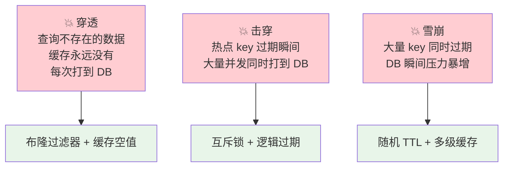

::: tip 速记口诀
- **穿透** = 查不存在的 → **布隆过滤器**挡住
- **击穿** = 热点过期 → **互斥锁**拦住
- **雪崩** = 大量过期 → **随机 TTL**打散
:::

#### 缓存穿透详解

**问题本质**：恶意请求或误操作查询一个不存在的数据，缓存没有，每次都穿透到 DB。

**解决方案：**

| 方案 | 原理 | 优缺点 |
|------|------|--------|
| **布隆过滤器** | 将所有合法 ID 存入布隆过滤器，查询前先过过滤器 | ✅ 内存占用极小 ❌ 有误判率（不存在但可能说存在） |
| **缓存空值** | 查不到时缓存 `null`，TTL 设短（如 5 分钟） | ✅ 简单 ❌ 大量不存在的 key 浪费内存 |
| **参数校验** | 拦截非法请求（如 ID ≤ 0） | ✅ 第一道防线 ❌ 不能覆盖所有情况 |

**推荐组合**：参数校验（第一层） + 布隆过滤器（第二层） + 缓存空值（兜底）

#### 缓存击穿详解

**问题本质**：一个热点 key 在某个时刻过期，瞬间大量并发请求同时打到 DB。

**解决方案：**

| 方案 | 原理 | 优缺点 |
|------|------|--------|
| **互斥锁（SETNX）** | 只允许一个线程查 DB 并重建缓存，其他线程等待 | ✅ 数据一致性好 ❌ 其他线程阻塞 |
| **逻辑过期** | 缓存不设物理 TTL，存一个逻辑过期时间，过期后异步更新 | ✅ 无阻塞 ❌ 短暂返回旧数据 |
| **热点 key 永不过期** | 后台定时任务主动刷新 | ✅ 简单 ❌ 需要识别热点 key |

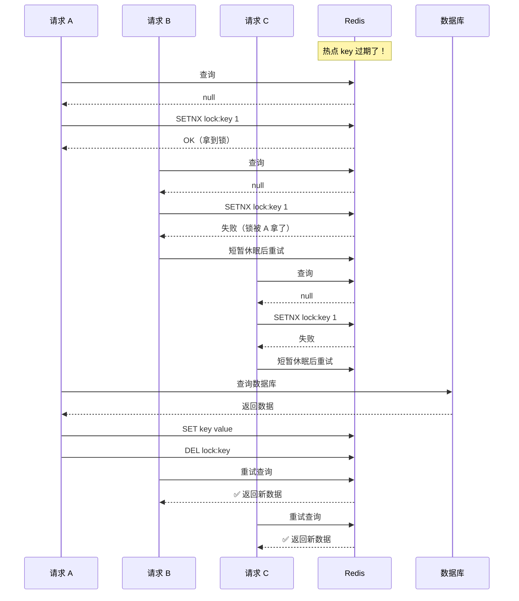

#### 缓存雪崩详解

**问题本质**：大量 key 在同一时间过期（如缓存预热时设置了相同的 TTL），或者 Redis 集群宕机。

**解决方案：**

| 方案 | 说明 |
|------|------|
| **随机 TTL** | 给 key 的过期时间加上随机偏移（如基础 TTL ± 随机 1-5 分钟） |
| **多级缓存** | 本地缓存（Caffeine/Guava） + Redis，Redis 挂了还有本地缓存兜底 |
| **缓存高可用** | Redis Sentinel 或 Cluster，避免单点故障 |
| **永不过期** | 热点数据不设 TTL，后台定时刷新 |

### 多级缓存架构

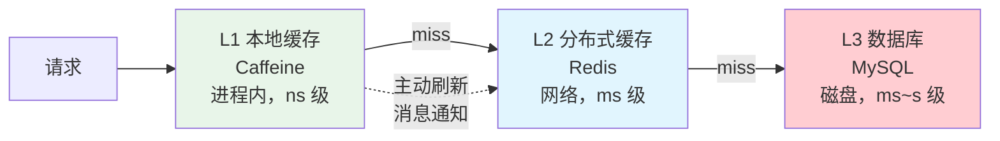

::: details 本地缓存 + Redis 的一致性问题
当 Redis 更新后，如何通知所有服务实例刷新本地缓存？
1. **Redis Pub/Sub**：发布更新消息，所有订阅的服务实例收到后清空本地缓存。缺点：消息不可靠，可能丢失。
2. **MQ 广播**：通过 MQ 的广播模式发送更新消息，保证可靠投递。缺点：增加 MQ 依赖。
3. **定期刷新**：本地缓存设置较短的 TTL（如 30 秒），容忍短暂不一致。最简单，适合大多数场景。
:::

---

## 限流——保护系统不被打爆

### 四种限流算法对比

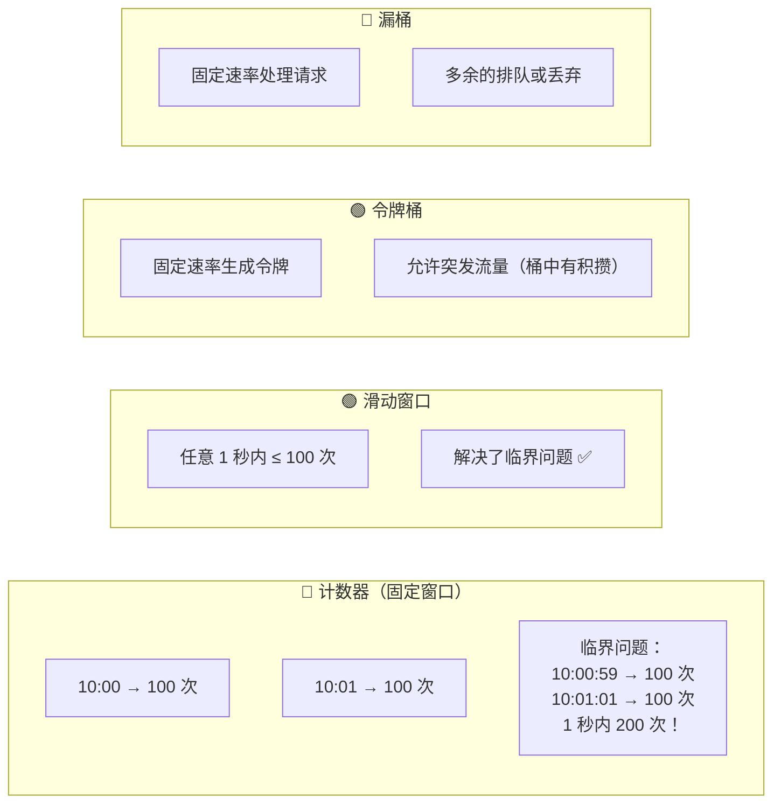

| 算法 | 优点 | 缺点 | 适用场景 |
|------|------|------|---------|
| 计数器 | 简单 | 临界问题 | 粗粒度限流 |
| 滑动窗口 | 精确 | 内存占用稍大 | API 限流 |
| **令牌桶** | **允许突发、精确** | 稍复杂 | **⭐ 大多数场景（Sentinel 默认）** |
| 漏桶 | 削峰填谷 | 不允许任何突发 | 流量整形 |

### 令牌桶算法详解

令牌桶是最常用的限流算法，Sentinel 和 Guava RateLimiter 都基于它实现。

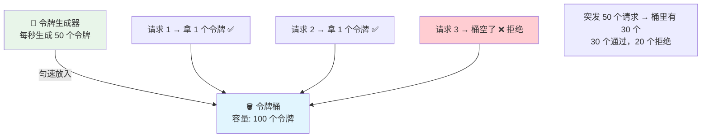

**核心逻辑**：
1. 令牌以**固定速率**放入桶中（如每秒 50 个）
2. 桶有**最大容量**（如 100 个），满了就丢弃多余的令牌
3. 每个请求需要从桶中**取一个令牌**才能通过
4. 桶空了 → 请求被拒绝（或排队等待）

**为什么允许突发？** 如果桶是满的（有 100 个令牌），瞬间来 100 个请求可以全部通过。这就是令牌桶比漏桶灵活的地方。

### 多级限流架构

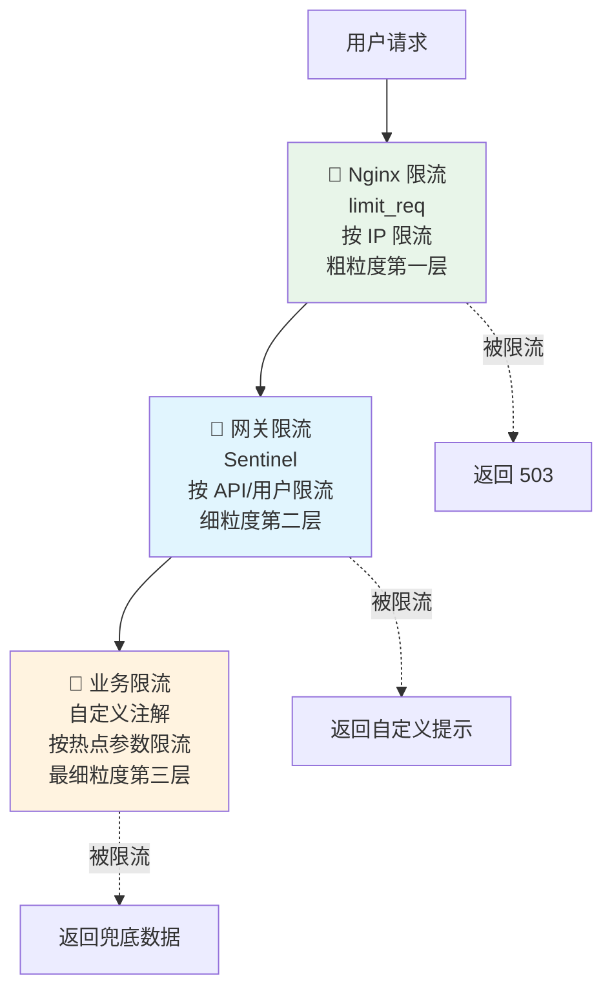

::: tip 限流的粒度选择
- **全局限流**：整个 API 的总 QPS 上限（如 10000 QPS）
- **用户级限流**：每个用户的 QPS 上限（如 100 QPS/用户），防刷
- **IP 级限流**：每个 IP 的 QPS 上限，防爬虫
- **热点参数限流**：对某个热点参数单独限流（如某个商品 ID 的查询 QPS）

Sentinel 支持热点参数限流，可以对频繁访问的商品 ID 做单独限制，而其他商品不受影响。
:::

---

## 异步——消息队列的核心价值

### 同步 vs 异步

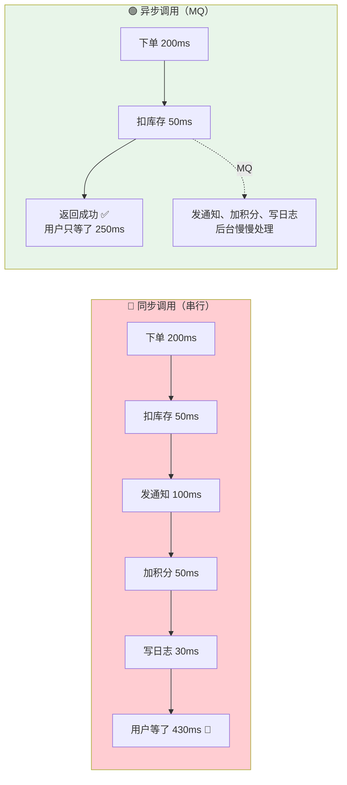

::: tip 异步的代价
异步不是免费的。引入 MQ 带来了新问题：**消息丢失**（三端保障）、**消息重复**（消费端幂等）、**消息顺序**（分区路由）、**消息堆积**（扩容消费者）。详见 [消息队列](../distributed/mq.md)。
:::

### 异步化的三个层次

| 层次 | 方式 | 延迟 | 可靠性 | 适用场景 |
|------|------|------|--------|---------|
| **线程池异步** | `@Async` / `CompletableFuture` | ms 级 | 进程内，重启丢失 | 非关键操作（日志、统计） |
| **MQ 异步** | RocketMQ / Kafka | 10ms+ 级 | 持久化，高可靠 | 核心业务异步（通知、积分） |
| **事件溯源** | 所有状态变更以事件存储 | 更高 | 最强一致性 | 金融、审计场景 |

### 削峰填谷实战

秒杀场景中，流量是"尖峰"状的，而系统处理能力是"平"的。MQ 就是那个"水库"。

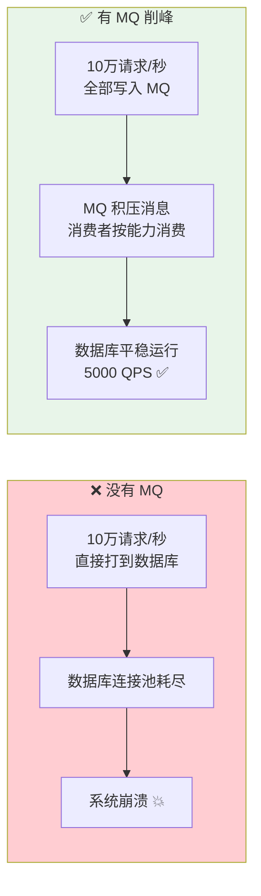

::: warning MQ 削峰的前提
削峰只适用于**可以异步化的操作**。下单本身不能异步（用户需要知道是否成功），但下单后的通知、积分、日志可以异步。如果所有操作都是同步的，MQ 也救不了你。
:::

---

## 降级与熔断——系统最后的防线

### 降级策略

当系统负载过高或某个服务不可用时，主动牺牲非核心功能来保全核心功能。

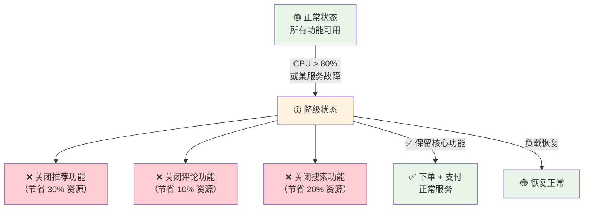

**降级的常见实现方式：**

| 方式 | 实现 | 特点 |
|------|------|------|
| **自动降级** | Sentinel / Hystrix 触发 | 基于指标自动触发，无需人工干预 |
| **手动降级** | 配置中心开关 | 运维人员根据经验手动关闭功能 |
| **超时降级** | 调用超时自动返回兜底 | 防止级联超时 |
| **限流降级** | 超过阈值拒绝请求 | 返回"系统繁忙"提示 |

::: tip 降级的兜底数据
降级返回的数据不能是"系统错误"这种干巴巴的提示。应该返回**有意义的兜底数据**：
- 商品推荐 → 返回热门商品（从本地缓存读取）
- 用户积分 → 返回 0 或缓存值
- 搜索结果 → 返回默认推荐列表
- 活动页面 → 返回静态 HTML 缓存
:::

### 限流、降级、熔断的区别

很多人分不清这三个概念，用一张图说清楚：

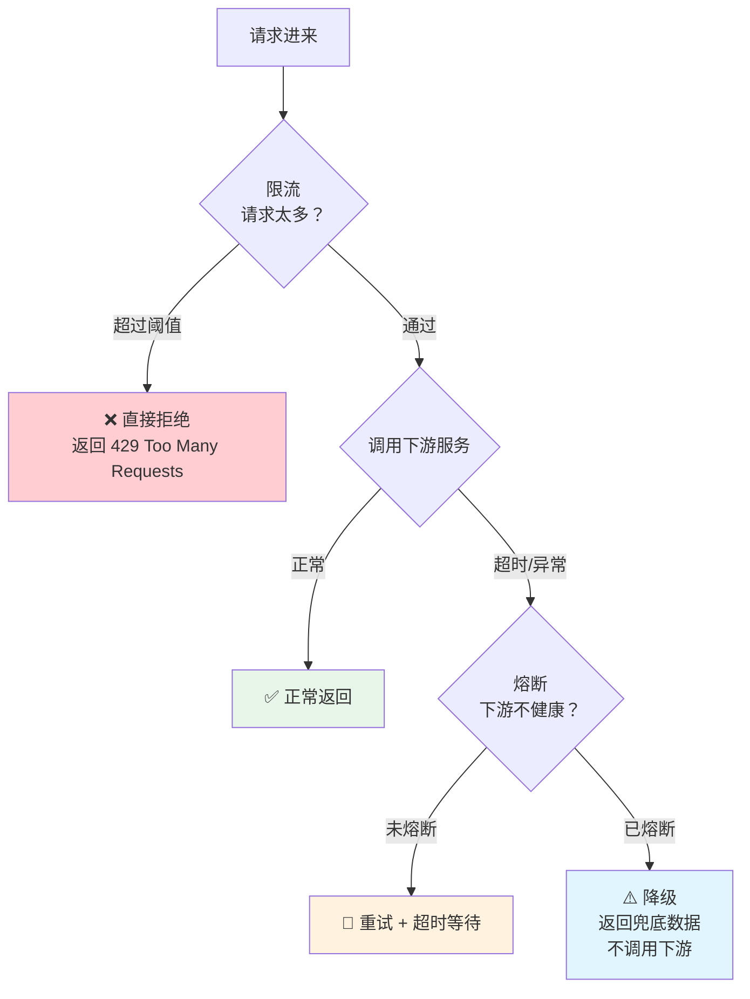

| 概念 | 作用对象 | 目的 | 类比 |
|------|---------|------|------|
| **限流** | 请求方 | 控制请求总量 | 地铁进站安检，人多限流 |
| **熔断** | 调用方 | 保护自己不被下游拖垮 | 发现前面路断了，不再往前走 |
| **降级** | 服务方 | 牺牲非核心保核心 | 船沉了，先扔行李保人 |

---

## 数据库——最后的防线

当缓存和 MQ 都挡不住时，请求最终会到达数据库。数据库层面的应对策略：

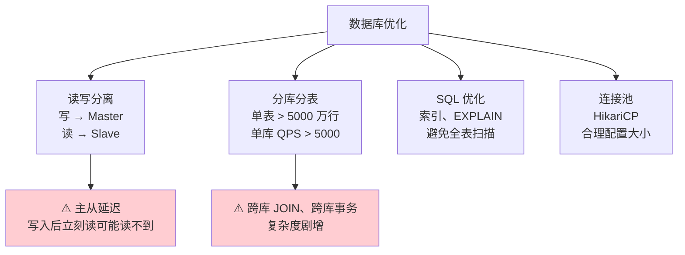

::: warning 分库分表的代价
能不分就不分！先优化 SQL → 加缓存 → 读写分离 → 确实扛不住再分库分表。分库分表后跨库 JOIN、跨库事务、全局 ID、数据迁移都是大坑。
:::

### 读写分离详解

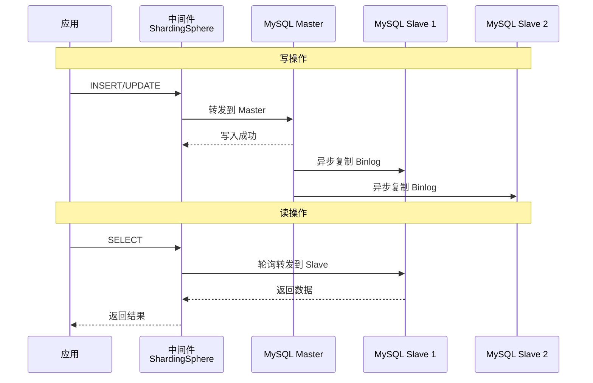

::: details 主从延迟问题
MySQL 主从复制是**异步**的，写入 Master 后数据不会立刻同步到 Slave。正常延迟 1-5ms，高负载时可能到几百毫秒甚至秒级。

**解决方案：**
1. **关键读走 Master**：写后立刻读的场景，通过注解或 Hint 强制走 Master
2. **半同步复制**：Master 等至少一个 Slave 确认收到 Binlog 才返回成功（牺牲一点写性能）
3. **接受最终一致性**：大部分业务（如商品详情）可以接受 1 秒的延迟
:::

### 分库分表决策

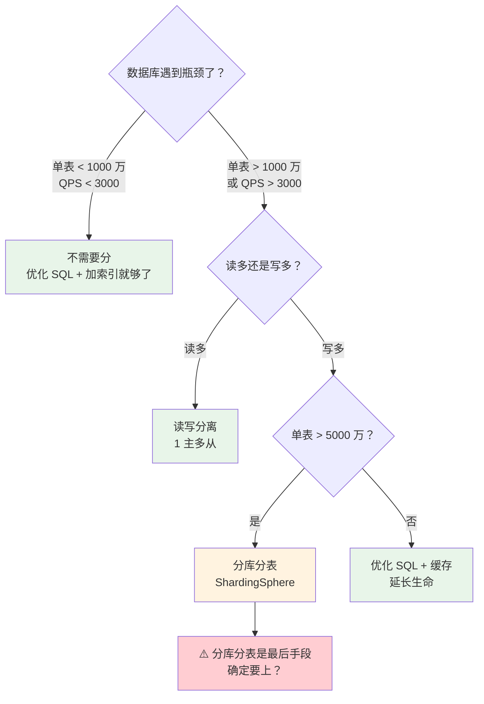

---

## 秒杀系统实战——综合运用

秒杀是高并发场景的"终极考试"，它几乎用到了所有高并发技术。

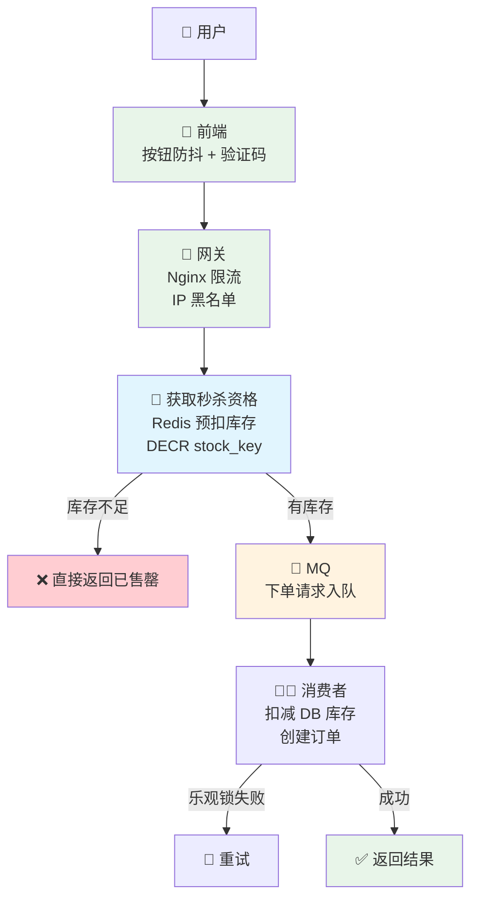

### 秒杀系统的关键技术点

| 环节 | 技术 | 目的 |
|------|------|------|
| **前端** | 按钮防抖、验证码、隐藏秒杀地址 | 削减无效请求、防刷 |
| **网关** | Nginx 限流（按 IP 100 QPS） | 第一层限流 |
| **Redis 预扣库存** | `DECR` 原子操作，库存不足直接返回 | 99% 的请求在 Redis 层被拦截 |
| **MQ 异步下单** | 通过请求入 MQ，消费者慢慢处理 | 削峰填谷，保护 DB |
| **乐观锁防超卖** | `UPDATE stock SET count = count - 1 WHERE id = ? AND count > 0` | 保证不超卖 |
| **限购** | Redis `INCR` + 过期时间 | 限制每人购买数量 |

::: danger 秒杀的核心：大部分请求不应该到达数据库
秒杀 10 万件商品，可能有 1000 万人参与。如果 1000 万请求打到 DB，DB 必挂。通过 Redis 预扣库存 + MQ 异步下单，最终到达 DB 的只有 10 万（甚至更少，因为很多人抢不到库存就放弃了）。
:::

---

## 面试高频题

**Q1：秒杀系统怎么设计？**

核心：**限流 + 缓存 + 异步**。前端：按钮防重复点击 + 验证码分流。网关：令牌桶限流。Service 层：Redis DECR 预扣库存，下单请求入 MQ。MQ 消费者：真正扣库存 + 创建订单（乐观锁防超卖）。数据库：读写分离。

**Q2：如何设计一个分布式限流？**

Redis + Lua 脚本实现滑动窗口/令牌桶（原子操作）。Redisson 的 `RRateLimiter` 开箱即用。Sentinel 集群限流配合 Token Server。网关层用 Nginx `limit_req` 做第一层限流。建议多级限流：网关 → Sentinel → 业务层。

**Q3：缓存、降级、限流分别解决什么问题？**

- **缓存**：减少数据库查询（读优化）
- **降级**：服务不可用时返回兜底数据（容错）
- **限流**：超过系统承载能力时拒绝请求（保护）

三者组合使用：限流保护系统 → 缓存减轻 DB 压力 → 降级保证基本可用。

**Q4：MQ 削峰填谷的原理？有什么限制？**

生产者将请求全部写入 MQ，消费者按照自己的处理能力从 MQ 拉取消息处理。这样即使瞬时流量是系统处理能力的 100 倍，也不会压垮系统。**限制**：只适用于可以异步化的操作，同步操作（如用户等待结果）无法削峰。MQ 本身也可能成为瓶颈，需要做好分区和消费者扩容。

**Q5：如何保证缓存和数据库的一致性？**

推荐方案：**先更新 DB 再删除缓存**。极端情况（更新 DB 成功但删除缓存失败）可通过以下方式保证：① MQ 异步重试删除；② Canal 监听 binlog 异步删除；③ 延迟双删（先删缓存 → 更新 DB → 延迟 500ms 再删一次）。最终一致性即可，大部分业务不需要强一致。

## 延伸阅读

- [微服务架构](microservice.md) — 服务拆分、服务治理
- [Redis](../database/redis.md) — 缓存实战、常见问题
- [消息队列](../distributed/mq.md) — RocketMQ/Kafka 原理
- [分布式事务](../distributed/transaction.md) — 最终一致性方案
