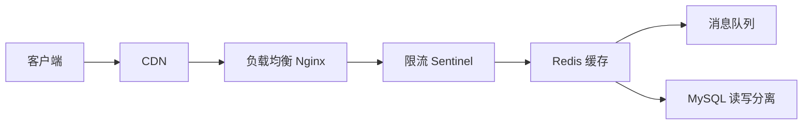

# 高并发架构

> 高并发不是"把服务器加到 100 台"就能解决的。10000 QPS 和 1000000 QPS 面对的挑战完全不同——数据库扛不住、缓存击穿、限流怎么做、消息堆积怎么处理。这篇文章从"请求进来"到"响应返回"，讲清楚每个环节的应对策略。

## 基础入门：什么是高并发？

### 高并发场景有多常见？

```
秒杀：10万人抢1000件商品 → 瞬时 QPS 暴增 100 倍
微博热搜：一条热门微博 → 读多写少，QPS 数万
直播互动：弹幕 + 礼物 → 高频写入，实时性要求高
```

### 三大核心指标

| 指标 | 含义 | 目标 |
|------|------|------|
| QPS | 每秒查询数 | 根据业务定 |
| 响应时间 | 请求处理时间 | < 200ms |
| 可用性 | 系统正常服务时间占比 | 99.99%（4个9） |

### 应对思路

```
1. 缓存：读多写少 → Redis 缓存
2. 异步：非核心操作 → MQ 异步
3. 限流：保护后端 → Sentinel 限流
4. 降级：兜底方案 → 返回默认数据
5. 分库分表：数据量大 → 水平拆分

---


## 高并发三大利器



```
请求进来
    │
    ▼
CDN / DNS（静态资源加速，减少源站压力）
    │
    ▼
负载均衡（Nginx / LVS）
    │
    ▼
限流（Sentinel / 令牌桶）
    │
    ▼
缓存（Redis）
    │    │
    │    ├── 命中 → 直接返回
    │    └── 未命中 → 穿透保护 → 查数据库 → 写缓存
    │
    ▼
异步（消息队列 MQ）
    │    │
    │    └── 非核心操作异步化（发通知、写日志、数据分析）
    │
    ▼
数据库（读写分离 + 分库分表）
```

## 缓存——高并发的第一道防线

### 缓存的三大经典问题

```java
// 1. 缓存穿透：查询不存在的数据，缓存永远没有，每次都打到数据库
// 解决：
// - 缓存空值（设置较短的过期时间）
// - 布隆过滤器（Bloom Filter）快速判断 key 是否可能存在

// 2. 缓存击穿：热点 key 过期的瞬间，大量请求同时打到数据库
// 解决：
// - 互斥锁（SETNX 加锁，只有一个线程能查数据库）
// - 逻辑过期（不设物理过期，后台线程异步刷新）
// - 永不过期 + 后台更新

// 3. 缓存雪崩：大量 key 同时过期，数据库瞬间压力暴增
// 解决：
// - 过期时间加随机偏移（避免同时过期）
// - 多级缓存（本地缓存 + Redis）
// - 熔断降级（数据库扛不住就降级）
```

### 缓存使用最佳实践

```java
// 1. 缓存粒度：不要缓存整个对象，缓存需要的字段
// 2. 过期策略：热点数据短过期（5-10分钟），冷数据长过期（1小时+）
// 3. 缓存预热：系统启动时加载热点数据
// 4. 大 Key 拆分：单个 value 不要超过 10KB
// 5. 热 Key 分散：同一个 key 的请求分散到多个副本
```

## 限流——保护系统不被打爆

```
限流算法：

1. 计数器（固定窗口）
   - 简单但有临界问题（窗口边界瞬间流量翻倍）
   - 适合：粗粒度限流

2. 滑动窗口
   - 解决了固定窗口的临界问题
   - 适合：API 限流

3. 令牌桶（Token Bucket）
   - 固定速率生成令牌，请求需要获取令牌
   - 允许突发流量（桶中有积累的令牌）
   - 适合：大多数场景（Sentinel 默认）

4. 漏桶（Leaky Bucket）
   - 固定速率处理请求，多余的请求排队或丢弃
   - 削峰填谷
   - 适合：流量整形
```

## 异步——消息队列的核心价值

```
同步调用的问题：
  用户下单 → 创建订单 → 扣库存 → 发通知 → 加积分 → 写日志
  总耗时 = 所有步骤之和 → 用户等很久

异步化：
  用户下单 → 创建订单 → 扣库存 → 返回"下单成功"
                                    ↓（异步）
                              MQ → 发通知、加积分、写日志
  用户感知的耗时 = 核心链路耗时

但异步带来了新问题：
  - 消息丢失怎么办？（发送端确认 + MQ 持久化 + 消费端手动 ACK）
  - 消息重复怎么办？（消费端幂等性设计）
  - 消息顺序怎么办？（单队列单消费者 / 消息带序号）
```

## 数据库——最后的防线

```
读写分离：
  写 → Master
  读 → Slave（多个）
  问题：主从延迟（写入后立刻读可能读不到）

分库分表：
  水平分库：按用户 ID 分到不同库
  水平分表：单表数据量 > 5000 万行时分表
  问题：跨库查询、跨库事务、数据迁移

什么时候需要分库分表？
  - 单表数据量 > 5000 万行
  - 单库 QPS > 5000
  - 单表超过 2GB

分库分表的代价：
  - 复杂度剧增（跨库 JOIN、跨库事务、全局 ID）
  - 运维成本高（数据迁移、扩容）
  - 能不分就不分（先优化 SQL、加缓存、读写分离）
```

## 面试高频题

**Q1：秒杀系统怎么设计？**

核心：限流 + 缓存 + 异步。前端：按钮防重复点击、验证码分流。网关：限流（令牌桶）。Service 层：库存预扣（Redis DECR），下单请求入 MQ 异步处理。MQ 消费者：真正扣库存、创建订单。数据库：乐观锁（版本号）防超卖。

**Q2：如何设计一个分布式限流？**

Redis + Lua 脚本实现令牌桶：用 `INCR` 和 `EXPIRE` 控制窗口内的请求数。Redisson 的 `RRateLimiter` 已实现。Sentinel 集群限流配合 Token Server。网关层用 Nginx 的 `limit_req` 做第一层限流。

## 延伸阅读

- [微服务架构](microservice.md) — 服务拆分、服务治理
- [Redis](../database/redis.md) — 缓存实战、常见问题
- [消息队列](../distributed/mq.md) — RocketMQ/Kafka 原理
