# 微服务架构

> 微服务不是"把单体拆成很多小服务"就叫微服务。拆分后带来的分布式复杂性——服务发现、配置管理、链路追踪、分布式事务、灰度发布——远超单体。这篇文章帮你理清微服务的核心挑战和应对策略。

## 基础入门：单体 vs 微服务

### 两种架构的对比

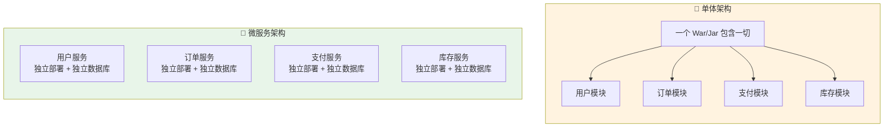

| 维度 | 🏢 单体 | 🧩 微服务 |
|------|--------|----------|
| 开发 | 简单，一个项目搞定 | 多项目协作，需要规范 |
| 部署 | 改一行代码全量发布 | 独立发布，互不影响 |
| 扩展 | 只能整体扩展 | 按需扩缩单个服务 |
| 技术栈 | 统一 | 每个服务可以不同 |
| 故障隔离 | 一个 Bug 全挂 | 故障隔离在单个服务 |
| 运维 | 简单 | **分布式复杂性爆炸** 💥 |

---

## 什么时候该拆？——别盲目跟风

::: warning 微服务不是万能药
很多团队在不需要微服务的时候强行拆分，结果分布式复杂性没解决，反而增加了运维成本和开发效率下降。**单体不丢人，微服务也不是终点**。
:::

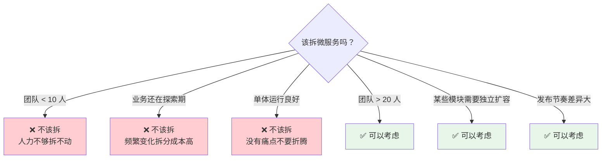

::: tip 康威定律
> 系统的架构会趋同于组织的沟通结构。

如果你的团队按业务线划分（用户组、订单组、支付组），架构也应该按业务拆分。反过来，组织结构没调整就强行拆微服务，会适得其反。
:::

---

## 服务拆分原则——怎么拆才合理？

### DDD 领域驱动设计指导拆分

微服务拆分最核心的问题是**边界在哪**。DDD（Domain-Driven Design）提供了一套方法论：

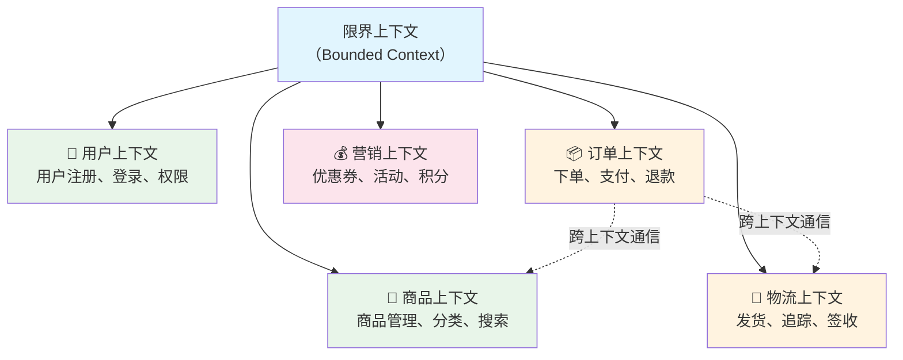

**核心概念速览：**

| DDD 概念 | 通俗理解 | 示例 |
|---------|---------|------|
| **领域（Domain）** | 业务范围 | 电商、社交、金融 |
| **限界上下文（Bounded Context）** | 微服务的边界 | 订单服务、用户服务 |
| **聚合根（Aggregate Root）** | 一个事务边界内的核心实体 | `Order`（订单）、`User`（用户） |
| **领域事件（Domain Event）** | 跨服务传递的"发生了什么事" | `OrderCreatedEvent`、`PaymentSuccessEvent` |
| **防腐层（Anti-Corruption Layer）** | 防止外部模型污染内部 | 对接第三方支付时做一层适配 |

### 拆分粒度怎么定？

::: danger 按技术层拆分是最大的反模式
❌ 不要拆成"用户 Controller 服务"、"用户 Service 服务"、"用户 DAO 服务"——这只是分布式化的单体，增加了网络开销却没有带来任何微服务的好处。
:::

| 拆分粒度 | 特点 | 适合阶段 |
|---------|------|---------|
| 粗粒度（5-10 个服务） | 拆分成本低，边界清晰 | 早期、团队 < 20 人 |
| 中粒度（10-30 个服务） | 平衡灵活性和复杂度 | 成长期、团队 20-50 人 |
| 细粒度（30+ 个服务） | 灵活但运维复杂度高 | 成熟期、有大 SRE 团队 |

::: tip 拆分经验法则
- **先拆核心域**（订单、支付、库存），稳定域后拆支撑域（用户、通知）
- **一个服务 = 一个数据库**，这是铁律，不要共享数据库
- **一个服务 = 一个团队**，如果两个服务需要同一个人维护，说明拆太细了
- **服务数量 = 团队人数的 1~2 倍**，不要超过 2 倍
:::

### 拆分策略：绞杀者模式

不要试图一次性把单体拆成微服务，风险太大。推荐**绞杀者模式**（Strangler Fig Pattern）：

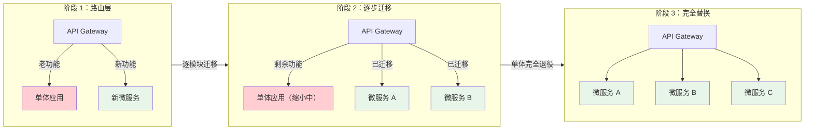

**实施步骤：**
1. 在单体应用前面加一层 API Gateway
2. 新功能直接开发成独立微服务，通过 Gateway 路由
3. 每次发版迁移一个模块到微服务，Gateway 路由到新服务
4. 反复迭代，直到单体完全"被绞杀"

---

## 微服务核心组件详解

### 📡 服务注册与发现——Nacos

服务注册与发现是微服务的"通讯录"。没有它，服务之间不知道对方在哪。

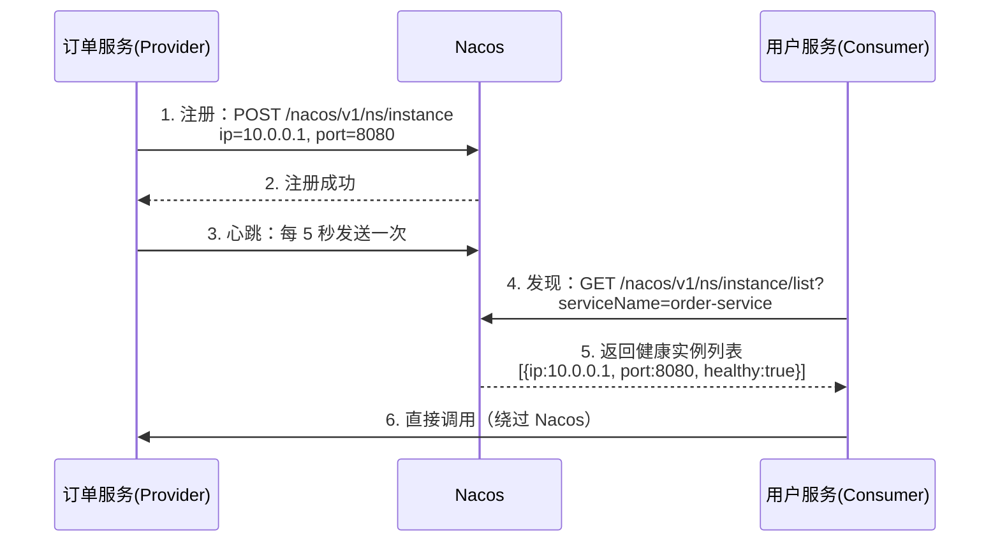

**为什么需要服务发现？** 在云环境中，服务实例的 IP 是动态的（容器重启、自动扩缩），硬编码 IP 不可行。服务注册中心就是让服务自己"报到"，让调用方"查通讯录"。

| 注册中心 | 特点 | 适用场景 |
|---------|------|---------|
| **Nacos** ⭐ | 注册+配置二合一，AP/CP 可切换，阿里系 | Spring Cloud Alibaba 首选 |
| Eureka | 纯 AP，已被废弃 | 老项目维护 |
| Consul | CP 模型，Go 语言，支持健康检查 | 多语言环境 |
| ZooKeeper | CP 模型，强一致性 | Dubbo 生态 |

::: details Nacos 健康检查机制
Nacos 支持两种健康检查模式：
- **临时实例（默认）**：客户端主动发送心跳，15 秒未收到心跳标记为不健康，30 秒未收到则剔除。服务重启后自动重新注册。
- **持久实例**：Nacos 服务端主动探测，TCP/HTTP 探测失败标记为不健康，但不会自动剔除。

临时实例适合普通微服务（自动剔除故障节点），持久实例适合数据库、缓存等基础设施（不应该自动剔除）。
:::

### ⚙️ 配置中心——Nacos Config

微服务可能有几十上百个实例，每个实例的配置需要统一管理且实时生效。

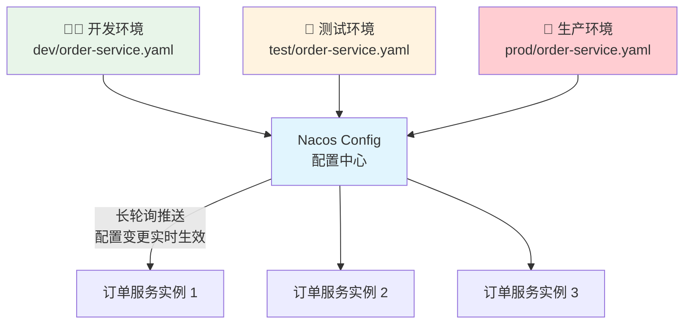

**配置中心解决的核心问题：**

| 问题 | 没有 Config | 有 Config |
|------|------------|----------|
| 配置分散 | 每个服务自己维护配置文件 | 统一在 Nacos 管理 |
| 修改不生效 | 改配置要重启服务 | 实时推送，无需重启 |
| 环境隔离 | dev/test/prod 配置混在一起 | Namespace + Group 隔离 |
| 敏感信息 | 数据库密码写在代码仓库 | 配置加密 + 动态注入 |

::: tip 配置优先级
Nacos 配置加载优先级（高 → 低）：**远程配置 > 本地 bootstrap.yaml > 本地 application.yaml**。如果远程和本地有同名配置，远程覆盖本地。
:::

### 🚪 API 网关——Spring Cloud Gateway

网关是微服务的"统一入口"，所有外部请求先到网关，再由网关路由到具体服务。

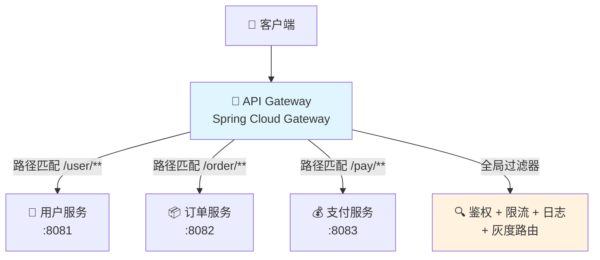

**网关的核心职责：**

| 职责 | 说明 | 实现方式 |
|------|------|---------|
| **路由转发** | 根据 Path/Header 将请求转发到后端服务 | `RouteLocator` + 谓词 |
| **统一鉴权** | 在网关层拦截未登录请求，避免每个服务重复写 | `GlobalFilter` + JWT 校验 |
| **限流熔断** | 保护后端服务不被流量打垮 | `RequestRateLimiter` + Redis |
| **日志追踪** | 统一生成 TraceId，传递到下游服务 | `Filter` + MDC |
| **协议转换** | 对外 REST，对内 gRPC | `Grpc` Route Definition |
| **灰度发布** | 按规则将部分流量导到新版本 | 自定义 `WeightPredicate` |

::: warning 网关的性能瓶颈
网关是所有请求的必经之路，**不能在网关做重逻辑**。鉴权应该只做 Token 校验（不查数据库），限流用 Redis 令牌桶，业务逻辑永远不要放在网关里。网关挂了 = 全站挂了，所以网关本身也要高可用（多实例 + 负载均衡）。
:::

### 🛡️ 熔断降级——Sentinel

微服务之间互相调用，一个服务挂了可能导致雪崩。Sentinel 就是"保险丝"。

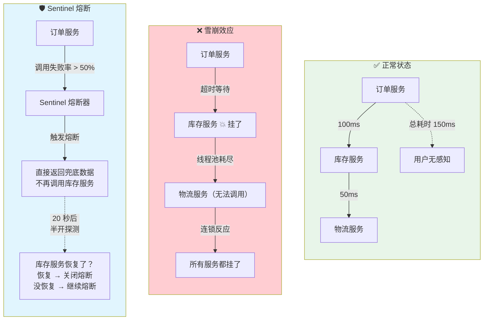

**Sentinel 三种熔断策略：**

| 策略 | 原理 | 适用场景 |
|------|------|---------|
| **慢调用比例** | 响应时间超过阈值（如 500ms）的比例 > 配置值时熔断 | 对延迟敏感的服务 |
| **异常比例** | 异常数 / 总调用数 > 配置值时熔断 | 对错误率敏感的服务 |
| **异常数** | 异常数绝对值 > 配置值时熔断 | 请求量较小的场景 |

**熔断器的三个状态：**

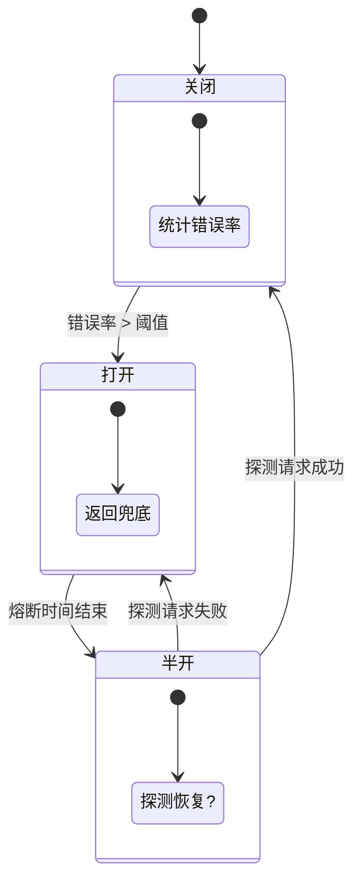

**关闭** → 正常放行所有请求，同时统计错误率。
**打开** → 所有请求直接失败（返回兜底数据），不再调用后端。
**半开** → 熔断时间到了，放行少量请求试探，成功就关闭，失败就继续打开。

::: tip 降级 vs 熔断
- **熔断**：调用方保护自己，当被调用方不健康时主动断开
- **降级**：在资源紧张或非核心链路故障时，主动牺牲非核心功能保全核心功能。例如：双十一期间关闭"推荐商品"功能，把资源全部给"下单"功能
:::

### 🔍 链路追踪——SkyWalking

微服务调用链路可能很长（A → B → C → D → E），一个请求慢了，到底是谁慢？

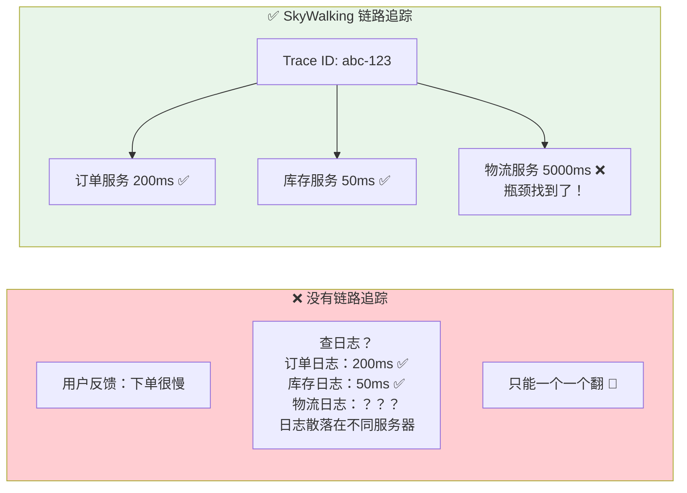

**SkyWalking 核心概念：**

| 概念 | 说明 | 类比 |
|------|------|------|
| **Trace** | 一次完整请求的调用链 | 一个快递单号 |
| **Span** | 调用链中的一次服务调用 | 快递经过的一个中转站 |
| **Segment** | 一个服务内的 Span 集合 | 某个中转站的操作记录 |

::: tip SkyWalking 无侵入接入
SkyWalking 使用 Java Agent 字节码增强，**不需要改任何代码**。只需要在启动参数加上 `-javaagent:/path/to/skywalking-agent.jar`，并配置 `agent.service_name` 和 `collector.backend_service` 即可。对业务代码零侵入。
:::

---

## 服务间通信——深入对比

### 同步调用：OpenFeign vs gRPC

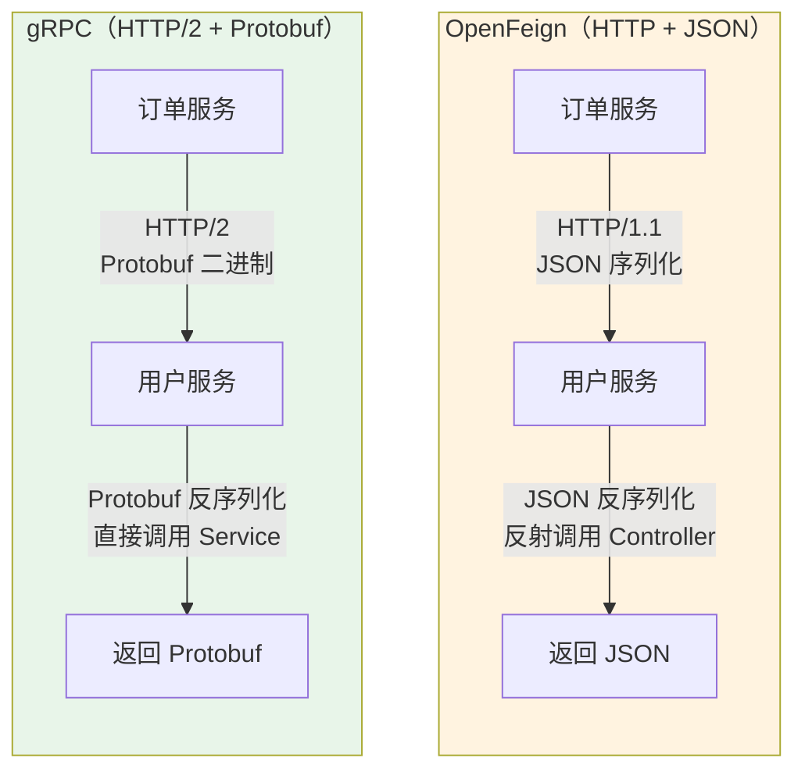

| 维度 | OpenFeign | gRPC |
|------|-----------|------|
| 协议 | HTTP/1.1 | HTTP/2（多路复用） |
| 序列化 | JSON（文本，可读） | Protobuf（二进制，快 5-10 倍） |
| 接口定义 | 无（或 Swagger） | `.proto` 文件强类型定义 |
| 流式调用 | ❌ 不支持 | ✅ 支持 Server/Client/Bidirectional Streaming |
| 代码生成 | 不需要 | 编译 `.proto` 生成 Stub |
| 生态 | Spring Cloud 生态 | 语言无关，跨平台 |
| 调试 | 浏览器/curl 可直接测 | 需要 gRPC 工具 |

::: tip 选择建议
- **业务内部调用**、对性能有要求 → **gRPC**
- **对外 API**、需要浏览器/curl 调试、第三方对接 → **OpenFeign / REST**
- 不要纠结选哪个，**两者可以共存**：对外 REST + 对内 gRPC，网关做协议转换
:::

### 异步通信：事件驱动架构

微服务之间的异步通信不是"发个 MQ 消息"这么简单，它涉及**事件设计、消息可靠性、幂等处理**等一系列问题。

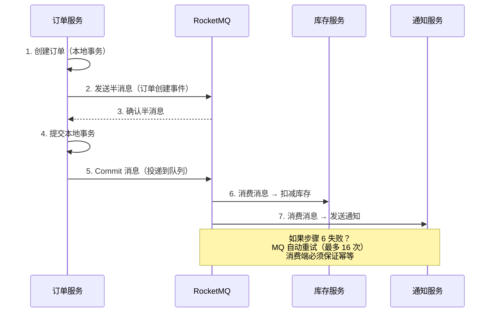

**事件设计最佳实践：**

| 原则 | 说明 | 示例 |
|------|------|------|
| **事件即事实** | 事件名用过去时态，表示"已发生" | `OrderCreated`、`PaymentCompleted` |
| **事件携带上下文** | 消费方不应该回调生产方获取信息 | 事件中带上 `orderId`、`userId`、`amount` |
| **事件不可变** | 发出后不能修改 | 需要修正时发一个新事件（如 `OrderCancelled`） |
| **消费者幂等** | 同一事件消费多次结果一致 | 用 `eventId` 做去重 |

::: details 领域事件 vs 集成事件
- **领域事件**（Domain Event）：在微服务内部使用，由领域模型发出，如 `OrderCreatedEvent`
- **集成事件**（Integration Event）：跨微服务使用，通过 MQ 传输，如 `OrderCreatedIntegrationEvent`

两者可以是一对多的关系：一个领域事件可以触发多个集成事件。比如 `OrderCreatedEvent` 可以触发发送 `OrderCreatedIntegrationEvent`（通知库存服务）和 `OrderBonusIntegrationEvent`（通知积分服务）。
:::

---

## 分布式系统的 CAP 定理

理解 CAP 是理解微服务很多设计决策的基础。

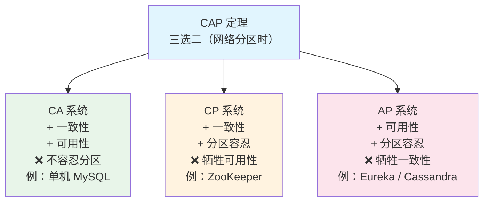

::: warning CAP 误解纠正
CAP 定理说的是**在网络分区（P）发生时**，只能在 C 和 A 之间二选一。不是说正常情况下 C 和 A 不能兼得。大多数系统在正常运行时都是 CA，只有在网络故障时才面临选择。
:::

| 系统 | CAP 选择 | 说明 |
|------|---------|------|
| ZooKeeper | CP | Leader 选举期间不可用，但数据一致 |
| Eureka | AP | 节点间数据可能不一致，但始终可用 |
| Nacos | CP/AP 可切换 | 默认 AP（临时实例），可切换 CP |
| Redis Cluster | AP | 主节点故障期间可能有写入丢失 |
| MySQL 主从 | CP | 主从切换期间不可用 |

---

## 微服务部署架构

### 容器化 + Kubernetes

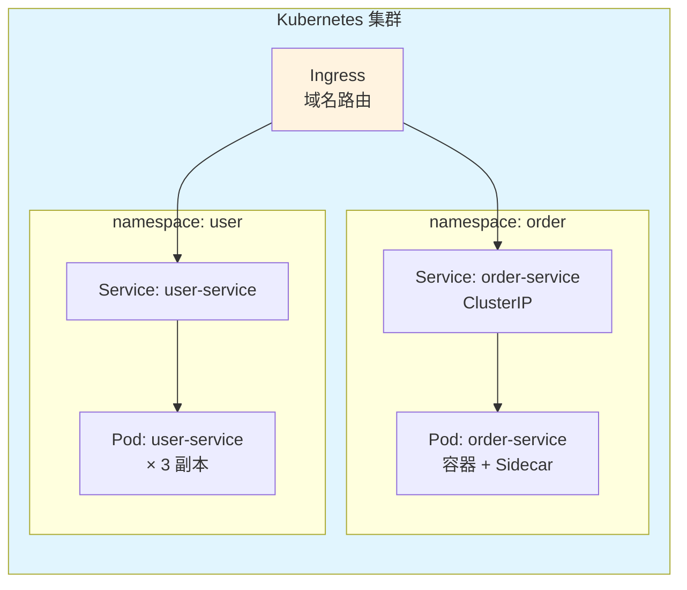

**K8s 核心概念映射到微服务：**

| K8s 概念 | 微服务中的作用 |
|---------|--------------|
| **Deployment** | 定义服务副本数、滚动更新策略 |
| **Service** | 服务发现 + 负载均衡（ClusterIP） |
| **Ingress** | 对外暴露 API（类似 Nginx） |
| **ConfigMap/Secret** | 配置管理（类似 Nacos Config） |
| **HPA** | 自动扩缩容（CPU > 70% 时扩容） |
| **Pod** | 最小部署单元，一个或多个容器 |

### CI/CD 流水线

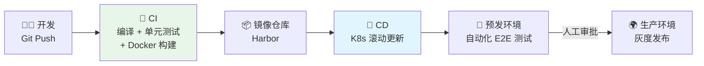

::: tip 灰度发布的实现
灰度发布（Canary Release）让新版本只接收少量流量，观察没问题后逐步放大。

实现方式：
1. **网关层灰度**：Spring Cloud Gateway 根据请求头/Cookie/IP 路由到不同版本
2. **K8s 层灰度**：部署两个 Deployment（v1 + v2），通过 Ingress 权重控制流量比例
3. **Feature Flag**：代码中通过配置开关控制新功能是否启用（最灵活，不需要部署两个版本）
:::

---

## 微服务监控体系

微服务的监控必须是全方位的，不能只看 CPU 和内存。

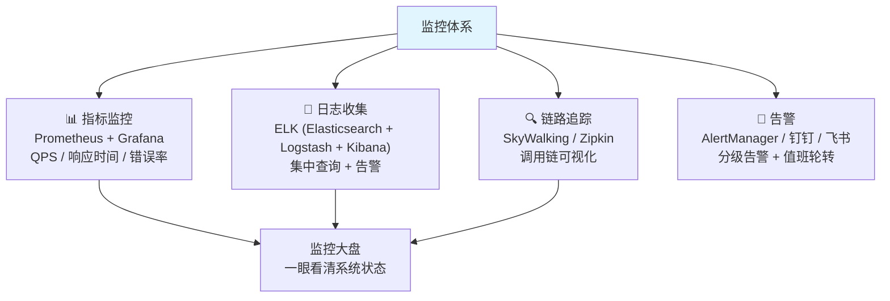

::: details 三大支柱的联动
1. **告警触发**：Prometheus 发现某服务错误率 > 5%，触发告警
2. **日志定位**：点击告警跳转到 Kibana，按 TraceId 查看该请求的完整日志
3. **链路分析**：点击 TraceId 跳转到 SkyWalking，看到调用链中哪个 Span 耗时最长

这就是**指标 → 日志 → 链路**的黄金三角，三者通过 TraceId 串联。
:::

---

## 面试高频题

**Q1：微服务之间怎么通信？**

同步：HTTP/REST（OpenFeign）、gRPC（高性能、适合服务间调用）。异步：消息队列（RocketMQ、Kafka）。选型建议：内部同步调用用 gRPC，对外用 REST，非核心链路用 MQ。关键原则：**不要在同步链路上串太多服务**，超过 3 层就考虑异步化。

**Q2：服务拆分太细有什么问题？**

调用链路过长（A → B → C → D，延迟叠加）、运维复杂度暴增、分布式事务困难、测试困难（需要同时启动多个服务）、网络开销增加。建议从粗粒度开始，按需拆分，不要一开始就拆得太细。一个服务 = 一个数据库 = 一个团队。

**Q3：微服务的数据一致性怎么保证？**

核心原则：每个服务拥有自己的数据库，不跨库访问。数据一致性通过分布式事务（Seata）或最终一致性（MQ 事务消息 / 本地消息表）保证。大部分场景推荐最终一致性，强一致性只在金融场景使用。

**Q4：如果微服务 A 调用 B 超时了，怎么办？**

分三步：① **重试**：对幂等接口自动重试 2-3 次（注意：非幂等接口不能重试）；② **熔断**：如果 B 持续超时，Sentinel 熔断保护 A；③ **降级**：A 返回兜底数据（如默认值、缓存数据），保证 A 自己的核心功能不受影响。

**Q5：如何设计一个高可用的微服务架构？**

核心原则：**无单点故障**。每个服务至少 2 个实例 + 负载均衡。数据库主从复制 + 自动故障转移。Redis 哨兵或 Cluster。网关多实例。配置中心集群。所有组件跨可用区部署。关键数据异步双写或使用多活方案。

## 延伸阅读

- [高并发架构](high-concurrency.md) — 缓存、限流、降级
- [Spring Cloud](../spring/cloud.md) — 微服务技术栈实战
- [分布式事务](../distributed/transaction.md) — Seata、TCC、Saga
- [消息队列](../distributed/mq.md) — 事件驱动架构、消息可靠性
