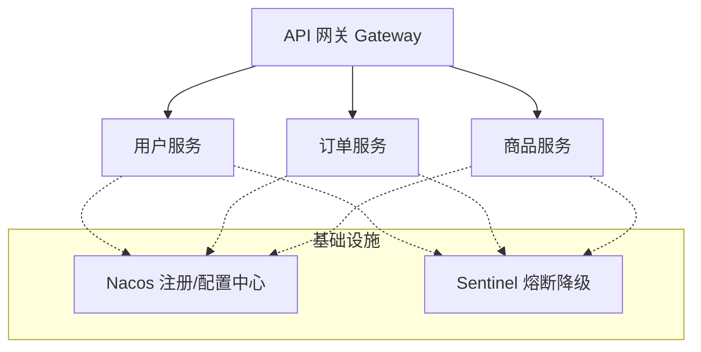

# 微服务架构

> 微服务不是"把单体拆成很多小服务"就叫微服务。拆分后带来的分布式复杂性——服务发现、配置管理、链路追踪、分布式事务、灰度发布——远超单体。这篇文章帮你理清微服务的核心挑战和应对策略。

## 基础入门：单体 vs 微服务

### 单体架构

```
所有功能在一个应用里（一个 War/Jar）
├── 用户模块
├── 订单模块
├── 支付模块
└── 库存模块

优点：简单、好调试、部署方便
缺点：代码量大、发布慢、扩展困难
```

### 微服务架构

```
每个模块独立部署（多个 Jar）
├── 用户服务（独立数据库）
├── 订单服务（独立数据库）
├── 支付服务（独立数据库）
└── 库存服务（独立数据库）

优点：独立开发、独立部署、独立扩展
缺点：分布式复杂性（服务发现、配置、链路追踪...）
```

### 什么时候拆微服务？

- 团队 > 10 人，单体协作困难
- 某些模块需要独立扩容
- 模块间发布节奏差异大

---


## 什么时候该拆微服务？

```
不该拆的情况：
  - 团队 < 10 人
  - 业务还在快速变化（频繁拆分和合并）
  - 单体应用运行良好，没有明显的扩展瓶颈

该拆的情况：
  - 团队 > 20 人，单体开发效率严重下降
  - 某些模块需要独立扩容（如支付模块流量大）
  - 不同模块的发布节奏差异大
  - 团队组织结构已经是按业务划分的（康威定律）

康威定律：系统的架构会趋同于组织的沟通结构
→ 如果团队按业务线划分，架构也应该按业务拆分
```

## 服务拆分原则

```
1. 单一职责：每个服务只做一件事
   ✅ 订单服务、用户服务、支付服务
   ❌ 订单+支付服务（职责不清）

2. 高内聚低耦合：服务内部紧密相关，服务之间松散关联
   - 领域驱动设计（DDD）来划定服务边界

3. 数据隔离：每个服务有自己的数据库
   - 不要跨服务直接访问对方的数据库
   - 通过 API 或消息队列通信

4. 独立部署：每个服务可以独立发布
   - 不需要所有服务一起发布

5. 治理独立：每个服务有自己的配置、监控、日志
```

## 微服务的核心挑战



| 挑战 | 解决方案 |
|------|----------|
| 服务发现 | Nacos / Consul / Eureka |
| 配置管理 | Nacos Config / Apollo |
| API 网关 | Spring Cloud Gateway |
| 服务调用 | OpenFeign / gRPC |
| 负载均衡 | Ribbon / LoadBalancer |
| 熔断降级 | Sentinel / Resilience4j |
| 链路追踪 | SkyWalking / Zipkin |
| 分布式事务 | Seata / 本地消息表 |
| 统一日志 | ELK / Loki |
| 灰度发布 | 网关路由规则 + Feature Flag |

## 面试高频题

**Q1：微服务之间怎么通信？**

同步：HTTP/REST（OpenFeign）、gRPC（高性能、适合服务间调用）。异步：消息队列（RocketMQ、Kafka）。选型建议：业务服务间同步调用用 gRPC（性能好、强类型），与外部系统对接用 REST（通用性好），非核心链路用 MQ（解耦、削峰）。

**Q2：服务拆分太细有什么问题？**

调用链路过长（A → B → C → D，延迟叠加）、运维复杂度暴增、分布式事务困难、测试困难（需要同时启动多个服务）。建议从粗粒度开始，按需拆分，不要一开始就拆得太细。

## 延伸阅读

- 上一篇：[高并发架构](high-concurrency.md) — 缓存、限流、降级
- [Spring Cloud](../spring/cloud.md) — 微服务技术栈实战
- [分布式事务](../distributed/transaction.md) — Seata、TCC、Saga
