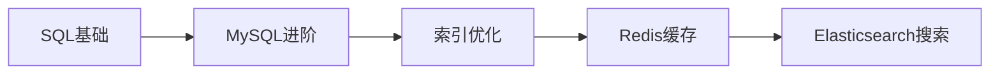

# 数据库技术

数据库是应用系统的核心组件，本模块涵盖关系型数据库和NoSQL数据库。

## 模块概览

| 章节 | 描述 |
|------|------|
| [MySQL](./mysql.md) | 关系型数据库，SQL优化 |
| [Redis](./redis.md) | 内存数据库，缓存技术 |
| [Elasticsearch](./es.md) | 搜索引擎，日志分析 |

## 数据库分类

```
┌─────────────────────────────────────────────────────────────┐
│                      数据库分类                              │
├─────────────────────────────────────────────────────────────┤
│  ┌─────────────────┐  ┌─────────────────────────────────┐  │
│  │   关系型数据库   │  │        NoSQL数据库              │  │
│  │  ┌───────────┐  │  │  ┌─────────┐  ┌─────────────┐  │  │
│  │  │  MySQL    │  │  │  │  Redis  │  │ Elasticsearch│  │  │
│  │  │  Oracle   │  │  │  │ 键值存储 │  │  文档搜索   │  │  │
│  │  │ PostgreSQL│  │  │  └─────────┘  └─────────────┘  │  │
│  │  └───────────┘  │  │  ┌─────────┐  ┌─────────────┐  │  │
│  └─────────────────┘  │  │ MongoDB │  │   Neo4j     │  │  │
│                       │  │  文档型  │  │   图数据库  │  │  │
│                       │  └─────────┘  └─────────────┘  │  │
│                       └─────────────────────────────────┘  │
└─────────────────────────────────────────────────────────────┘
```

## 学习路径


