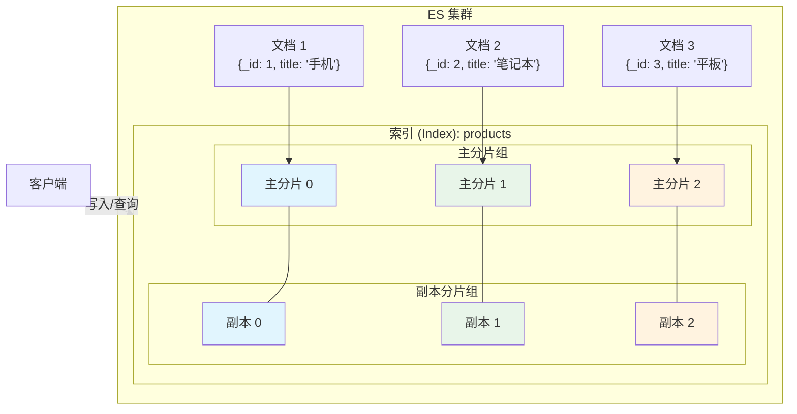
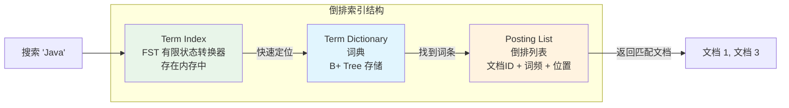
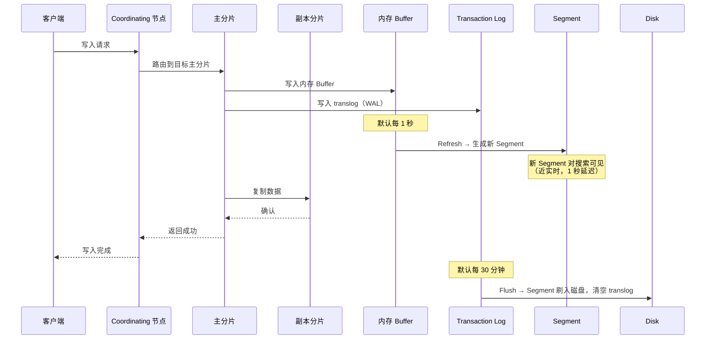
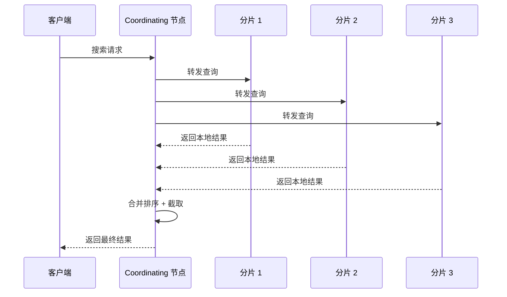
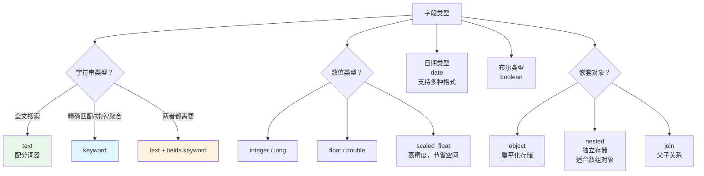
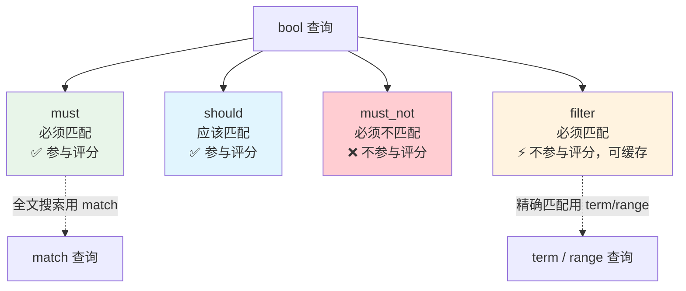
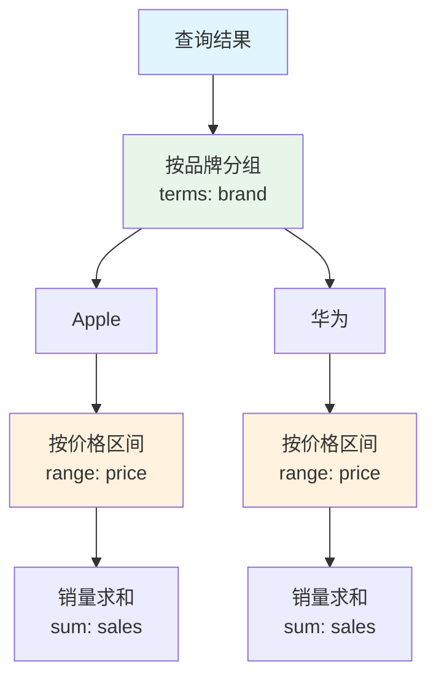
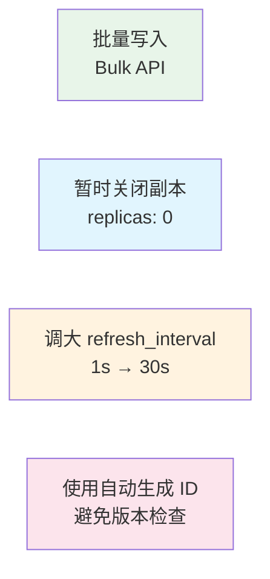
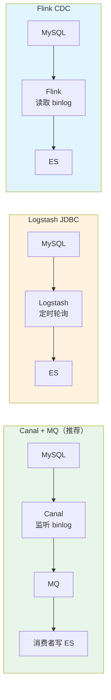
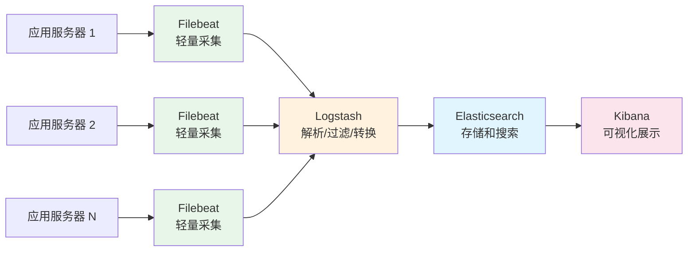

# Elasticsearch

> Elasticsearch（ES）不是数据库的替代品，而是解决"搜索"和"分析"问题的专用工具。全文搜索、日志分析、指标聚合——这些是 MySQL 做不好或不该做的事情。这篇文章帮你理解 ES 的核心概念、索引设计、查询优化和实战用法。

## 基础入门：Elasticsearch 是什么？

### 为什么不用 MySQL 做搜索？

| 对比项 | MySQL `LIKE '%关键词%'` | Elasticsearch |
|--------|----------------------|---------------|
| 搜索方式 | 全表扫描 | 倒排索引，毫秒级 |
| 分词支持 | ❌ 不支持 | ✅ 内置分词器，支持中文分词 |
| 相关性排序 | ❌ 不支持 | ✅ TF-IDF / BM25 评分 |
| 大数据量 | 百万级基本不可用 | 分布式，天然水平扩展 |

### 基本概念

ES 的概念和 MySQL 有一一对应关系，但底层实现完全不同：

| MySQL | Elasticsearch | 说明 |
|-------|--------------|------|
| 数据库 (Database) | 索引 (Index) | 数据的逻辑命名空间 |
| 表 (Table) | — | ES 7.x 后废弃 Type，一个 Index 就是一种类型 |
| 行 (Row) | 文档 (Document) | JSON 格式的数据记录 |
| 列 (Column) | 字段 (Field) | 文档中的属性 |
| 表结构 | 映射 (Mapping) | 定义字段类型和分析规则 |

### 核心概念详解



**索引（Index）**：ES 中数据的逻辑命名空间，类比 MySQL 的数据库。实际存储在分片（Shard）中，索引名必须小写。

**文档（Document）**：JSON 格式的数据记录，每个文档有唯一 `_id`。文档是 Schema-free 的（可以动态添加字段），但建议定义 Mapping 来明确字段类型。

**映射（Mapping）**：定义文档中字段的类型和属性，类比 MySQL 的表结构。

**分片（Shard）**：索引的物理存储单元。主分片数在创建索引时确定不可更改，副本分片数可以随时调整。

**节点（Node）**：一个 ES 进程就是一个节点，分为 Master 节点（管理集群状态）、Data 节点（存储数据）、Coordinating 节点（转发请求、合并结果）。

---

## 核心原理

### 倒排索引

倒排索引是 ES 搜索快的根本原因。MySQL 的正排索引是"通过文档找词"，而倒排索引是"通过词找文档"——搜索时直接查词典，不需要遍历所有文档。

**举个例子**，假设有三篇文档：

| 文档 | 内容 |
|------|------|
| 文档 1 | Java 是最好的编程语言 |
| 文档 2 | Python 编程也很棒 |
| 文档 3 | Java 和 Python 都是好语言 |

ES 会建立这样的倒排索引：

| 词（Term） | 包含的文档 |
|-----------|-----------|
| Java | 文档 1, 文档 3 |
| Python | 文档 2, 文档 3 |
| 编程 | 文档 1, 文档 2 |
| 语言 | 文档 1, 文档 3 |
| 棒 | 文档 2 |

搜索 **"Java 编程"** 时：
- "Java" → 文档 1, 文档 3
- "编程" → 文档 1, 文档 2
- **交集** → 文档 1（且包含两个词，评分更高）



倒排索引的三个核心组件：
- **Term Index**：词典的索引，使用 FST（有限状态转换器）存储在内存中，用于快速定位词条
- **Term Dictionary**：词典，使用 B+ Tree 存储，包含所有经过分词后的词条
- **Posting List**：倒排列表，包含匹配的文档 ID、词频、位置等信息。使用 Frame of Reference 压缩文档 ID，Roaring Bitmap 加速交集运算

### 分词器

分词器（Analyzer）是 ES 处理文本的核心组件，决定了文本如何被拆分成词条。


**内置分词器**：

| 分词器 | 行为 | 适用场景 |
|--------|------|---------|
| standard | 默认，按 Unicode 字符分割 | 通用 |
| whitespace | 按空格分割 | 英文 |
| simple | 按非字母分割，转小写 | 简单英文 |
| keyword | 不分词，整体作为一个词 | 精确匹配 |

**IK 中文分词器**（最常用）：

| 模式 | 示例输入 | 输出 |
|------|---------|------|
| `ik_max_word` | 中华人民共和国 | 中华/中华人民/中华/华人/人民共和国/人民/共和国/共和/国 |
| `ik_smart` | 中华人民共和国 | 中华人民共和国 |

- `ik_max_word`：最细粒度分词，适合**索引时**使用（尽可能多的组合）
- `ik_smart`：最粗粒度分词，适合**搜索时**使用（更精准）

### 写入与读取流程

ES 的写入流程是理解"近实时搜索"的关键。数据写入后不会立即对搜索可见，而是需要经过 Refresh 操作。



ES 写入流程中的几个关键概念：

| 概念 | 说明 | 延迟 |
|------|------|------|
| Refresh | 内存 Buffer → 新 Segment（可搜索） | 默认 1 秒 |
| Flush | Segment → 磁盘（持久化） | 默认 30 分钟 |
| Merge | 后台合并小 Segment 为大 Segment | 异步执行 |

**读取流程**：



---

## 索引设计

### Mapping 设计

Mapping 定义了文档的字段类型和属性，类比 MySQL 的建表语句。设计好 Mapping 是 ES 性能优化的第一步。

```json
PUT /products
{
  "settings": {
    "number_of_shards": 3,
    "number_of_replicas": 1,
    "analysis": {
      "analyzer": {
        "ik_search_analyzer": {
          "type": "custom",
          "tokenizer": "ik_smart",
          "filter": ["lowercase"]
        },
        "ik_index_analyzer": {
          "type": "custom",
          "tokenizer": "ik_max_word",
          "filter": ["lowercase"]
        }
      }
    }
  },
  "mappings": {
    "properties": {
      "id": { "type": "long" },
      "title": {
        "type": "text",
        "analyzer": "ik_index_analyzer",
        "search_analyzer": "ik_search_analyzer",
        "fields": {
          "keyword": { "type": "keyword" }
        }
      },
      "description": {
        "type": "text",
        "analyzer": "ik_index_analyzer",
        "search_analyzer": "ik_search_analyzer"
      },
      "category": { "type": "keyword" },
      "brand": { "type": "keyword" },
      "price": { "type": "double" },
      "stock": { "type": "integer" },
      "status": { "type": "keyword" },
      "created_at": { "type": "date", "format": "yyyy-MM-dd HH:mm:ss" },
      "updated_at": { "type": "date" },
      "is_on_sale": { "type": "boolean" }
    }
  }
}
```

::: tip text vs keyword
- `text`：用于全文搜索，会分词，不能用于排序和聚合
- `keyword`：用于精确匹配、排序、聚合，不分词
- 同一字段需要两种用途时，用 `fields` 定义多字段（如 `title.text` 和 `title.keyword`）
:::

### 字段类型选择指南



---

## 查询 DSL

### 基础查询

```json
// 1. 全文搜索（match）—— "Java编程" 会被分词为 "Java" 和 "编程"
GET /products/_search
{
  "query": {
    "match": {
      "title": "Java编程"
    }
  }
}

// 2. 精确匹配（term）—— 不分词，精确匹配
GET /products/_search
{
  "query": {
    "term": {
      "category": "手机"
    }
  }
}

// 3. 多字段搜索（multi_match）—— ^3 表示权重
GET /products/_search
{
  "query": {
    "multi_match": {
      "query": "iPhone",
      "fields": ["title^3", "description", "brand^2"],
      "type": "best_fields"
    }
  }
}

// 4. 短语匹配（match_phrase）—— "Java编程" 必须连续出现
GET /products/_search
{
  "query": {
    "match_phrase": {
      "title": "Java编程"
    }
  }
}
```

### 组合查询（bool query）

`bool` 查询是 ES 中最常用的组合查询，通过 `must`、`should`、`must_not`、`filter` 四个子句组合条件。



```json
GET /products/_search
{
  "query": {
    "bool": {
      "must": [
        { "match": { "title": "手机" } }
      ],
      "should": [
        { "term": { "brand": "Apple" } },
        { "term": { "brand": "华为" } }
      ],
      "must_not": [
        { "term": { "status": "下架" } }
      ],
      "filter": [
        { "range": { "price": { "gte": 1000, "lte": 5000 } } },
        { "term": { "category": "手机" } }
      ],
      "minimum_should_match": 1
    }
  }
}
```

::: tip 用 filter 替代 must
精确匹配场景（term/range）应该用 `filter` 而不是 `must`。`filter` 不计算评分且结果可缓存，性能更好。只有全文搜索（match）才需要评分。
:::

### 聚合查询

ES 的聚合功能类似 SQL 的 `GROUP BY` + 聚合函数，但更强大，支持嵌套聚合和多种聚合类型。

```json
// 1. 分组聚合（类似 SQL 的 GROUP BY）
GET /products/_search
{
  "size": 0,
  "aggs": {
    "by_category": {
      "terms": { "field": "category", "size": 10 },
      "aggs": {
        "avg_price": { "avg": { "field": "price" } },
        "total_sales": { "sum": { "field": "sales" } }
      }
    }
  }
}

// 2. 范围聚合
GET /products/_search
{
  "size": 0,
  "aggs": {
    "price_ranges": {
      "range": {
        "field": "price",
        "ranges": [
          { "to": 1000, "key": "1000以下" },
          { "from": 1000, "to": 5000, "key": "1000-5000" },
          { "from": 5000, "key": "5000以上" }
        ]
      }
    }
  }
}

// 3. 时间序列聚合（按月统计）
GET /orders/_search
{
  "size": 0,
  "aggs": {
    "sales_over_time": {
      "date_histogram": {
        "field": "created_at",
        "calendar_interval": "month",
        "format": "yyyy-MM"
      },
      "aggs": {
        "total_amount": { "sum": { "field": "amount" } }
      }
    }
  }
}
```

聚合查询的嵌套结构如下，可以在每个分组内继续聚合：



### 高级查询

```json
// 1. 高亮显示
GET /products/_search
{
  "query": { "match": { "title": "Java" } },
  "highlight": {
    "fields": {
      "title": { "pre_tags": ["<em>"], "post_tags": ["</em>"] }
    }
  }
}

// 2. 排序 + 分页
GET /products/_search
{
  "query": { "match": { "title": "手机" } },
  "sort": [
    { "price": { "order": "asc" } },
    { "_score": { "order": "desc" } }
  ],
  "from": 0,
  "size": 10
}

// 3. 深度分页解决方案：search_after（推荐）
GET /products/_search
{
  "query": { "match_all": {} },
  "size": 10,
  "sort": [
    { "price": "asc" },
    { "_id": "asc" }
  ],
  "search_after": [2999, "product_123"]
}

// 4. 滚动查询（大批量导出）
GET /products/_search?scroll=1m
{
  "query": { "match_all": {} },
  "size": 1000
}
```

---

## 性能优化

### 索引优化

**1. 分片数量选择**

分片不是越多越好。每个分片都有开销（内存、文件句柄、线程），分片过多反而降低性能。建议单分片大小保持在 **10-50GB**，起步 3 主分片，按数据量调整。

**2. Mapping 优化**

| 优化项 | 说明 |
|--------|------|
| 不搜索的字段设 `"index": false` | 减少索引体积 |
| 不需要评分的字段用 `filter` 查询 | 避免评分计算开销 |
| keyword 类型不需要分词 | 减少索引构建时间 |
| 数值类型用最小够用的类型 | 用 `integer` 不用 `long` |

**3. 写入优化**



写入密集场景可以暂时牺牲一些安全性换取性能：关闭副本、调大 refresh_interval、使用自动生成 ID。写完后再恢复副本数。

### 查询优化

| 优化项 | 说明 | 原因 |
|--------|------|------|
| 用 `filter` 替代 `must` | 精确匹配场景 | 不计算评分，结果可缓存 |
| 避免 `wildcard` 查询 | `*Java*` 性能极差 | 需要遍历所有词条 |
| 避免深分页 | `from + size`，from 越大越慢 | 每个分片返回 from + size 条 |
| `_source` 过滤 | 只返回需要的字段 | 减少网络传输量 |
| `force_merge` 只读索引 | 合并为 1 个 Segment | 减少 Segment 数量 |

**深度分页解决方案对比**：

| 方案 | 原理 | 适用场景 |
|------|------|---------|
| `from + size` | 每个分片返回 from + size 条，协调节点排序截取 | 前 100 页内 |
| `search_after` | 基于排序值的翻页，不需要 from | **推荐**，无限翻页 |
| `scroll` | 游标，保持上下文 | 大批量导出 |
| 限制最大页码 | 产品层面限制 | 简单粗暴 |

---

## 数据同步

### MySQL → ES 同步方案



| 方案 | 延迟 | 对业务侵入 | 复杂度 | 适用场景 |
|------|------|-----------|--------|---------|
| **Canal + MQ** | 近实时（几百 ms） | 零侵入 | 中等 | **推荐，通用方案** |
| Logstash JDBC | 分钟级 | 零侵入 | 低 | 数据量小、实时性要求不高 |
| 应用层双写 | 实时 | 侵入大 | 低 | 不推荐（一致性难保证） |
| Flink CDC | 近实时 | 零侵入 | 高 | 大数据量，Exactly-Once 语义 |

::: tip 数据一致性
ES 和 MySQL 之间是**最终一致**的。写入 MySQL 后通过 Canal/MQ 异步同步到 ES，存在短暂延迟（通常几百毫秒）。
:::

---

## ELK 日志体系

ELK 是日志收集、存储、可视化的标准方案：



**日志索引设计建议**：
- **按天分索引**：`logs-app-2024.04.01`，便于管理和清理
- **ILM（Index Lifecycle Management）**：自动管理索引生命周期


---

## 面试高频题

**Q1：ES 为什么搜索快？**

倒排索引 + 分词 + 分布式。倒排索引让搜索变成"查字典"，O(1) 或 O(log n) 找到包含关键词的文档。分布式让查询在多个分片上并行执行。聚合分析则是利用列式存储的优势。

**Q2：ES 的深度分页问题怎么解决？**

`from + size` 在 ES 中如果 `from` 很大（如 10000），每个分片都要返回 `from + size` 条数据给协调节点再排序截取——非常浪费。解决方案：1) `scroll`（游标，适合大批量导出）；2) `search_after`（基于排序值的翻页，推荐）；3) 限制最大页码（产品层面，如最多 100 页）。

**Q3：ES 和 MySQL 的数据如何保持一致？**

推荐 Canal 监听 MySQL binlog → MQ → 消费者写 ES。这是对业务零侵入的方案，延迟通常在几百毫秒。也可以用 Flink CDC 做 Exactly-Once 同步。需要注意：ES 是最终一致的，写入 MySQL 后到 ES 可搜索有短暂延迟。

**Q4：ES 集群脑裂问题？**

ES 7.0 之前：`minimum_master_nodes` 配置不当可能导致多个 Master 节点（脑裂）。ES 7.0+ 自动管理集群状态，不再需要手动配置，脑裂问题基本解决。

## 延伸阅读

- 上一篇：[Redis](redis.md) — 缓存实战、数据结构
- [MySQL](mysql.md) — 索引、事务、MVCC
- [消息队列](../distributed/mq.md) — RocketMQ/Kafka
