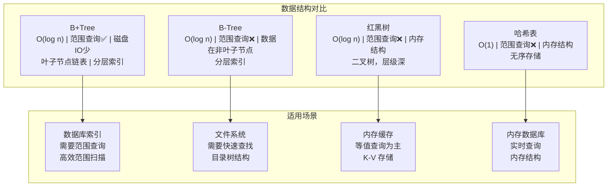
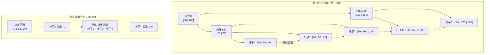

# MySQL 索引深度解析：B+Tree 原理与优化实战

> 持续更新中 | 最后更新：2026-04-03

---

## ⭐⭐⭐ B+Tree 数据结构：MySQL 索引的基石

B+Tree（B+树）是 MySQL InnoDB 存储引擎默认使用的数据结构，它是 B 树的优化变体，专门为磁盘存储设计。理解 B+Tree 的底层原理是掌握 MySQL 索引优化的关键。

### B+Tree 的设计哲学

**为什么选择 B+Tree 而不是其他数据结构？**



### B+Tree 的核心特性

#### 1. 多路平衡树结构

B+Tree 是一种自平衡的 m 路搜索树，相比二叉搜索树，它能大幅减少树的层级，从而减少磁盘 IO 次数。

```java
// B+Tree 节点结构模拟
class BPlusTreeNode {
    // 键值数组（非叶子节点存索引，叶子节点存实际数据）
    Comparable[] keys;
    // 子节点指针数组
    BPlusTreeNode[] children;
    // 是否为叶子节点
    boolean isLeaf;
    // 叶子节点的双向链表指针
    BPlusTreeNode prev;
    BPlusTreeNode next;
    
    // 非叶子节点：存储键值 + 子节点指针
    // 叶子节点：存储完整数据行 + 双向链表指针
}
```

#### 2. 叶子节点链表连接

这是 B+Tree 区别于 B-Tree 的关键特性 - 所有叶子节点通过双向链表连接，使得范围查询变得异常高效。



#### 3. 层级深度分析

对于 MySQL 而言，B+Tree 的层级深度直接影响查询性能：

```sql
-- 计算B+Tree层级
-- 假设：
-- - 每个页大小为 16KB（InnoDB 默认）
-- - 主键为 BIGINT（8字节）
-- - 索引键为 INT（4字节）+ 指针（6字节）
-- - 每个节点可存储：16*1024 / (4+6) = 1632 个键值

-- 层级计算：
-- 第1层（根节点）：1 个节点
-- 第2层：最多 1632 个节点
-- 第3层：最多 1632*1632 = 266万 个节点
-- 第4层：最多 1632*1632*1632 = 434亿 个节点

-- 结论：3-4 层就能支撑千万级数据查询
```

### B+Tree 与 B-Tree 的详细对比

| 特性 | B+Tree | B-Tree | 对查询的影响 |
|------|--------|--------|-------------|
| **数据存储** | 非叶子节点只存索引，叶子节点存完整数据 | 非叶子节点也存数据 | B+Tree 非叶子节点能存更多索引 → 树更矮 → IO 更少 |
| **范围查询** | 叶子节点链表，高效范围扫描 | 需要中序遍历，效率较低 | B+Tree 范围查询性能远高于 B-Tree |
| **查询稳定性** | 所有查询都到叶子节点，深度一致 | 不同深度数据查询 IO 次数不同 | B+Tree 查询性能更稳定可预测 |
| **内存利用率** | 叶子节点密集存储 | 数据分布分散 | B+Tree 缓存命中率更高 |

:::tip B+Tree 性能优势
1. **查询深度一致**：所有查询最终都到达叶子节点，避免了 B-Tree 中数据分布在不同层级导致的性能差异
2. **范围查询高效**：叶子节点的双向链表使得范围查询只需要顺序遍历，不需要复杂的树遍历
3. **缓存友好**：叶子节点数据密集，能更好地利用操作系统页缓存
4. **查询稳定**：无论查询哪个数据，IO 次数都是树的高度，性能可预测
:::

---

## ⭐⭐⭐ 索引类型详解：何时选择合适的索引

MySQL 提供了多种索引类型，理解每种类型的适用场景是索引设计的关键。

### 主键索引（PRIMARY KEY）

```sql
-- 主键索引特性
CREATE TABLE user (
    id BIGINT PRIMARY KEY AUTO_INCREMENT,
    name VARCHAR(50) NOT NULL,
    email VARCHAR(100) UNIQUE,
    created_at DATETIME DEFAULT CURRENT_TIMESTAMP
);

-- 主键索引特点：
-- 1. 聚簇索引（Clustered Index）
-- 2. 不允许 NULL 值
-- 3. 必须唯一
-- 4. 默认创建，自动维护
-- 5. 叶子节点存储完整数据行
```

**主键选择策略：**

```sql
-- ✅ 推荐：自增整数主键
CREATE TABLE user (
    id BIGINT AUTO_INCREMENT PRIMARY KEY,
    -- ...
);

-- ✅ 推荐：UUID（分布式环境）
CREATE TABLE user (
    id CHAR(36) PRIMARY KEY DEFAULT UUID(),
    -- ...
);

-- ❌ 避免：自然业务主键
CREATE TABLE user (
    phone VARCHAR(20) PRIMARY KEY,  -- 用户可能换手机号
    -- ...
);

-- ✅ 替代方案：业务字段 + 自增主键
CREATE TABLE user (
    id BIGINT AUTO_INCREMENT PRIMARY KEY,
    phone VARCHAR(20) UNIQUE,  -- 业务唯一约束
    -- ...
);
```

### 唯一索引（UNIQUE INDEX）

```sql
-- 唯一索引约束
CREATE TABLE user (
    id BIGINT PRIMARY KEY,
    email VARCHAR(100) UNIQUE,
    phone VARCHAR(20) UNIQUE,
    card_no VARCHAR(18) UNIQUE
);

-- 唯一索引特点：
-- 1. 允许 NULL 值（多个 NULL 值不违反唯一性）
-- 2. 不要求主键约束
-- 3. 非聚簇索引（叶子节点存储主键值）
-- 4. 自动去重检查
```

**唯一索引使用注意事项：**

```sql
-- 唯一索引 vs 主键
-- 主键：一张表只能一个，不允许 NULL
-- 唯一索引：一张表可有多个，允许 NULL

-- 唯一索引的 NULL 值处理
INSERT INTO user (email, phone) VALUES ('a@a.com', NULL);  -- 允许
INSERT INTO user (email, phone) VALUES ('a@a.com', NULL);  -- 允许（多个 NULL 不冲突）
INSERT INTO user (email, phone) VALUES ('a@a.com', '13800138000');  -- 报错（email 重复）
```

### 普通索引（INDEX）

```sql
-- 普通索引创建
CREATE TABLE product (
    id BIGINT PRIMARY KEY,
    name VARCHAR(200),
    category_id INT,
    price DECIMAL(10,2),
    stock INT,
    INDEX idx_category (category_id),
    INDEX idx_price (price),
    INDEX idx_name (name(50))  -- 前缀索引
);

-- 普通索引特点：
-- 1. 可重复、可为空
-- 2. 可多个
-- 3. 非聚簇索引
-- 4. 用于加速 WHERE 条件
```

### 复合索引（Composite Index）

复合索引是多列索引，其设计遵循"最左前缀原则"。

```sql
-- 复合索引创建
CREATE TABLE order_detail (
    id BIGINT PRIMARY KEY,
    order_id BIGINT,
    product_id BIGINT,
    product_name VARCHAR(100),
    quantity INT,
    unit_price DECIMAL(10,2),
    -- 复合索引：订单ID + 产品ID + 数量
    INDEX idx_order_product (order_id, product_id, quantity),
    -- 业务查询的复合索引
    INDEX idx_product_query (product_id, unit_price, quantity)
);
```

**复合索引的最左前缀原则：**

```sql
-- 索引：idx_name_age_city (name, age, city)

-- ✅ 有效查询（最左前缀）
SELECT * FROM user WHERE name = '张三';                              -- 用到 name
SELECT * FROM user WHERE name = '张三' AND age = 25;                 -- 用到 name, age
SELECT * FROM user WHERE name = '张三' AND age = 25 AND city = '北京'; -- 全部用到

-- ❌ 无效查询（跳过最左列）
SELECT * FROM user WHERE age = 25;                                   -- 跳过了 name
SELECT * FROM user WHERE city = '北京';                               -- 跳过了 name, age
SELECT * FROM user WHERE age = 25 AND city = '北京';                 -- 跳过了 name

-- ⚠️ 部分有效（最左列有范围查询）
SELECT * FROM user WHERE name > '张三' AND age = 25;                 -- 只用到 name（age 被跳过）
SELECT * FROM user WHERE name = '张三' AND age > 25 AND city = '北京'; -- 只用到 name（age, city 被跳过）
```

### 全文索引（FULLTEXT INDEX）

```sql
-- 全文索引用于文本搜索
CREATE TABLE article (
    id BIGINT PRIMARY KEY,
    title VARCHAR(200),
    content TEXT,
    FULLTEXT INDEX idx_content (title, content)
);

-- 全文索引查询
SELECT * FROM article 
WHERE MATCH(title, content) AGAINST('数据库 优化' IN NATURAL LANGUAGE MODE);

-- 支持的查询模式
-- 1. 自然语言搜索：IN NATURAL LANGUAGE MODE
-- 2. 布尔搜索：IN BOOLEAN MODE
-- 3. 查询扩展：WITH QUERY EXPANSION
```

### 空间索引（SPATIAL INDEX）

```sql
-- 空间索引用于地理位置数据
CREATE TABLE location (
    id BIGINT PRIMARY KEY,
    name VARCHAR(100),
    location GEOMETRY,
    SPATIAL INDEX idx_location (location)
);

-- 空间查询
SELECT * FROM location 
WHERE ST_Contains(location, ST_Point(116.4, 39.9));
```

### 前缀索引

```sql
-- 前缀索引优化长字符串字段
CREATE TABLE user (
    id BIGINT PRIMARY KEY,
    email VARCHAR(100),
    name VARCHAR(50),
    -- 全字段索引（不推荐，占用空间大）
    INDEX idx_email_full (email),
    -- 前缀索引（推荐，节省空间）
    INDEX idx_email_prefix (email(20))
);

-- 前缀长度选择策略
-- 计算：选择能够达到足够区分度的最小长度
SELECT 
    COUNT(DISTINCT LEFT(email, 1)) / COUNT(*) as selectivity_1,
    COUNT(DISTINCT LEFT(email, 10)) / COUNT(*) as selectivity_10,
    COUNT(DISTINCT LEFT(email, 20)) / COUNT(*) as selectivity_20
FROM user;

-- 目标：selectivity > 0.9 即可
```

:::tip 索引设计黄金法则
1. **业务驱动**：基于实际查询模式设计，而不是盲目建索引
2. **适量原则**：单表索引数量控制在 5 个以内
3. **区分度优先**：高区分度字段放在联合索引前面
4. **避免冗余**：联合索引覆盖的查询不再需要单列索引
5. **定期维护**：监控索引使用情况，删除无效索引
:::

---

## ⭐⭐⭐ 索引优化技术：覆盖索引与索引下推

### 覆盖索引（Covering Index）

覆盖索引是指查询的所有字段都包含在索引中，无需回表查询数据行。

```sql
-- 原表结构
CREATE TABLE user (
    id BIGINT PRIMARY KEY,
    name VARCHAR(50),
    email VARCHAR(100),
    age INT,
    city VARCHAR(50),
    created_at DATETIME
);

-- 普通索引
CREATE INDEX idx_user_age_city ON user(age, city);

-- 覆盖索引场景
-- 场景1：查询字段都在索引中
EXPLAIN SELECT age, city FROM user WHERE age = 25 AND city = '北京';
-- type: ref, key: idx_user_age_city, Extra: Using index (覆盖索引)

-- 场景2：非覆盖索引（需要回表）
EXPLAIN SELECT id, name, age FROM user WHERE age = 25;
-- type: ref, key: idx_user_age_city, Extra: Using index condition (需要回表)

-- 创建覆盖索引优化
CREATE INDEX idx_user_age_city_name ON user(age, city, name);
EXPLAIN SELECT id, name, age FROM user WHERE age = 25;
-- 现在可以走覆盖索引
```

**覆盖索引的优势：**

1. **性能提升**：避免回表 IO，直接从索引获取数据
2. **减少锁争用**：索引页通常比数据页更小，并发性能更好
3. **缓存友好**：索引数据更密集，缓存命中率更高

```sql
-- 覆盖索引设计示例
-- 业务查询：用户列表（显示用户基本信息）
-- 传统方式：先查索引得到主键，再回表查询用户信息
-- 优化方式：创建覆盖索引，包含查询所需所有字段

CREATE INDEX idx_user_list ON user(created_at DESC, id, name, age, city);

-- 查询优化
SELECT id, name, age, city, created_at 
FROM user 
WHERE created_at > '2024-01-01'
ORDER BY created_at DESC 
LIMIT 20;
```

### 索引下推（Index Condition Pushdown, ICP）

索引下推是 MySQL 5.6 引入的优化技术，在索引遍历过程中，对索引中包含的字段直接进行过滤，减少回表次数。

```sql
-- 索引下推示例
CREATE TABLE user (
    id BIGINT PRIMARY KEY,
    name VARCHAR(50),
    age INT,
    city VARCHAR(50),
    email VARCHAR(100)
);

CREATE INDEX idx_user_age_city ON user(age, city);

-- 无索引下推情况
-- 1. 先根据 age = 25 定位到索引
-- 2. 回表查询完整数据行
-- 3. 在数据行上过滤 city = '北京'
-- 4. 返回符合条件的数据

-- 有索引下推情况（MySQL 5.6+）
-- 1. 先根据 age = 25 定位到索引
-- 2. 在索引页直接过滤 city = '北京'（索引下推）
-- 3. 只对符合条件的行进行回表
-- 4. 减少回表次数

-- 启用/禁用索引下推
-- 全局设置
SET session optimizer_switch = 'index_condition_pushdown=on';
SET session optimizer_switch = 'index_condition_pushdown=off';

-- 查看索引下推是否生效
EXPLAIN SELECT * FROM user WHERE age = 25 AND city = '北京';
-- Extra: Using where; Using index (无索引下推)
-- Extra: Using index condition (有索引下推)
```

**索引下推适用场景：**

```sql
-- 场景1：索引包含查询条件字段
CREATE INDEX idx_user_age_city ON user(age, city);
SELECT * FROM user WHERE age = 25 AND city = '北京';  -- 适用 ICP

-- 场景2：索引包含部分查询条件
CREATE INDEX idx_user_age ON user(age);
SELECT * FROM user WHERE age = 25 AND city = '北京';  -- 部分适用 ICP（age 部分）

-- 场景3：索引不包含查询条件
SELECT * FROM user WHERE name = '张三' AND age = 25; -- 不适用 ICP（索引不含 name）
```

### 多列索引的优化策略

```sql
-- 复合索引设计示例
-- 业务查询场景：
-- 1. 按城市查询用户
-- 2. 按城市+年龄查询用户  
-- 3. 按城市+年龄+性别查询用户

-- 错误设计：单列索引
CREATE INDEX idx_user_city ON user(city);
CREATE INDEX idx_user_age ON user(age);
CREATE INDEX idx_user_gender ON user(gender);
-- 问题：索引维护成本高，可能触发 index merge

-- 正确设计：复合索引
CREATE INDEX idx_user_city_age_gender ON user(city, age, gender);
-- 满足最左前缀，一个索引覆盖多个查询场景

-- 索引顺序优化
-- 原则：高区分度字段在前，等值查询在前，范围查询在后

-- 不好的索引顺序
CREATE INDEX idx_user_age_gender_city ON user(age, gender, city);
-- 问题：age 区分度可能不高，gender 重复值多

-- 好的索引顺序
CREATE INDEX idx_user_city_age_gender ON user(city, age, gender);
-- city 区分度高，等值查询优先，age 在中间可为范围查询
```

### 索引与查询优化实战

```sql
-- 慢查询案例1：查询条件与索引不匹配
-- 原表
CREATE TABLE user (
    id BIGINT PRIMARY KEY,
    name VARCHAR(50),
    department_id INT,
    level INT,
    status INT,
    created_at DATETIME
);

CREATE INDEX idx_user_department_level ON user(department_id, level, status);

-- 问题查询
SELECT * FROM user 
WHERE level = 5 AND department_id = 100 AND status = 1;
-- 问题：违反最左前缀原则，department_id 应该在最左边

-- 优化方案
SELECT * FROM user 
WHERE department_id = 100 AND level = 5 AND status = 1;

-- 慢查询案例2：查询字段不在索引中
-- 问题查询
SELECT id, name, department_id, level 
FROM user 
WHERE department_id = 100 AND level = 5;
-- 问题：需要回表查询 name 字段

-- 优化方案1：覆盖索引
CREATE INDEX idx_user_covering ON user(department_id, level, id, name);
-- 或者修改查询
SELECT department_id, level, id 
FROM user 
WHERE department_id = 100 AND level = 5;

-- 优化方案2：使用覆盖索引提示
SELECT /*+ INDEX(user idx_user_department_level) */ 
       id, name, department_id, level 
FROM user 
WHERE department_id = 100 AND level = 5;
```

:::tip 覆盖索引设计原则
1. **查询导向**：根据高频查询模式设计覆盖索引
2. **空间权衡**：覆盖索引会增加存储空间，需要平衡性能和空间
3. **更新频率**：高更新频率表的覆盖索引会影响写入性能
4. **监控使用**：定期检查覆盖索引的实际使用效果

```sql
-- 检查索引使用情况
SELECT 
    indexname,
    idx_scan,
    idx_tup_read,
    idx_tup_fetch,
    CASE 
        WHEN idx_scan = 0 THEN 'unused'
        WHEN idx_tup_read / idx_scan < 10 THEN 'efficient'
        ELSE 'inefficient'
    END as efficiency
FROM pg_stat_user_indexes 
WHERE schemaname = 'public';

-- 查看查询执行计划
EXPLAIN ANALYZE SELECT id, name, age FROM user WHERE age = 25;
-- 关注：是否使用了覆盖索引，回表次数
```
:::

---

## ⭐⭐⭐ EXPLAIN 深度解析：理解查询执行计划

EXPLAIN 是 MySQL 查询性能调优的重要工具，通过分析执行计划我们可以了解查询是如何执行的，从而找出性能瓶颈。

### EXPLAIN 基础用法

```sql
-- 基础 EXPLAIN
EXPLAIN SELECT * FROM user WHERE age = 25 AND city = '北京';

-- 扩展 EXPLAIN（MySQL 8.0+）
EXPLAIN FORMAT=TREE SELECT * FROM user WHERE age = 25 AND city = '北京';

-- 分析执行计划
EXPLAIN ANALYZE SELECT * FROM user WHERE age = 25 AND city = '北京';
```

### EXPLAIN 关键字段详解

```sql
-- 示例查询
EXPLAIN SELECT SQL_NO_CACHE * FROM user 
WHERE age = 25 
  AND city = '北京' 
  AND name LIKE '张%' 
ORDER BY created_at DESC 
LIMIT 10;
```

#### 1. id 字段

```sql
-- 单表查询，id=1
EXPLAIN SELECT * FROM user WHERE age = 25;
-- id: 1

-- 简单子查询，id 相同
EXPLAIN SELECT * FROM user WHERE age IN (SELECT age FROM user WHERE city = '北京');
-- id: 1, 1

-- 复杂查询，id 递增
EXPLAIN SELECT u.* FROM user u 
LEFT JOIN order o ON u.id = o.user_id 
WHERE u.age = 25;
-- id: 1, 2
```

#### 2. select_type 字段

```sql
-- 不同查询类型
SELECT 
    id,
    select_type,
    table,
    type,
    key,
    Extra
FROM (
    -- SIMPLE：简单查询
    EXPLAIN SELECT * FROM user WHERE age = 25
    
    UNION ALL
    
    -- PRIMARY：主查询
    EXPLAIN SELECT * FROM user WHERE id IN (SELECT user_id FROM order)
    
    UNION ALL
    
    -- DEPENDENT SUBQUERY：依赖子查询
    EXPLAIN SELECT * FROM user WHERE id IN (SELECT user_id FROM order WHERE user_id = user.id)
    
    UNION ALL
    
    -- DERIVED：派生表
    EXPLAIN SELECT * FROM (SELECT * FROM user WHERE age > 30) t WHERE t.name = '张三'
    
    UNION ALL
    
    -- UNION：UNION 查询
    EXPLAIN SELECT * FROM user WHERE age = 25 UNION SELECT * FROM user WHERE age = 30
) AS t;
```

#### 3. table 字段

```sql
-- 表名或别名
-- user: 普通表
-- <derived2>: 派生表
-- <subquery3>: 子查询
```

#### 4. type 字段 - 访问类型

```sql
-- 按性能排序从好到坏
-- system: 表只有一行
EXPLAIN SELECT * FROM user WHERE id = 1 AND (SELECT 1);

-- const: 主键或唯一索引等值查询
EXPLAIN SELECT * FROM user WHERE id = 1;

-- eq_ref: 主键或唯一索引连接
EXPLAIN SELECT u.*, o.* FROM user u JOIN order o ON u.id = o.user_id;

-- ref: 非唯一索引等值查询
EXPLAIN SELECT * FROM user WHERE age = 25;

-- ref_or_null: 索引等值查询或 IS NULL
EXPLAIN SELECT * FROM user WHERE age = 25 OR age IS NULL;

-- index_merge: 索引合并
EXPLAIN SELECT * FROM user WHERE age = 25 OR name = '张三';

-- range: 范围查询
EXPLAIN SELECT * FROM user WHERE age BETWEEN 20 AND 30;

-- index: 索引全扫描
EXPLAIN SELECT age FROM user WHERE age = 25;

-- ALL: 全表扫描
EXPLAIN SELECT * FROM user WHERE name = '张三';
```

#### 5. key 字段

```sql
-- 实际使用的索引
-- idx_user_age_city: 复合索引
-- PRIMARY: 主键索引
-- NULL: 未使用索引
```

#### 6. key_len 字段

```sql
-- 索引使用长度
-- 示例：索引 idx_name_age (VARCHAR(50), INT)
-- key_len: 50*3 + 4 + 2 = 156（UTF-8编码，VARCHAR需要额外2字节）
-- 这表示索引使用了前 50 个字符的 name 和完整的 age
```

#### 7. rows 字段

```sql
-- 预估扫描行数
-- rows 越小越好，表示查询越精确
EXPLAIN SELECT * FROM user WHERE age = 25;          -- 可能扫描 100 行
EXPLAIN SELECT * FROM user WHERE age > 25;          -- 可能扫描 10000 行
```

#### 8. Extra 字段

```sql
-- 重要提示信息
-- Using index: 覆盖索引
-- Using where: 使用了 WHERE 过滤
-- Using filesort: 需要排序
-- Using temporary: 需要临时表
-- Using index condition: 索引下推
-- LooseScan: 松散扫描
```

### 执行计划深度分析

```sql
-- 表结构
CREATE TABLE user (
    id BIGINT PRIMARY KEY AUTO_INCREMENT,
    name VARCHAR(50),
    age INT,
    city VARCHAR(50),
    department_id INT,
    INDEX idx_user_age_city (age, city),
    INDEX idx_user_department (department_id)
);

-- 案例1：理想执行计划
EXPLAIN SELECT id, name FROM user WHERE age = 25 AND city = '北京';
-- id: 1
-- select_type: SIMPLE
-- table: user
-- type: ref
-- key: idx_user_age_city
-- key_len: 5 (age INT)
-- rows: 10
-- Extra: Using where; Using index (覆盖索引)
-- 优化说明：使用了合适的索引，覆盖索引避免回表

-- 案例2：需要回表的查询
EXPLAIN SELECT id, name, department_id FROM user WHERE age = 25;
-- id: 1
-- select_type: SIMPLE
-- table: user
-- type: ref
-- key: idx_user_age_city
-- key_len: 5
-- rows: 100
-- Extra: Using index condition (需要回表查询 department_id)
-- 优化说明：需要回表，可以创建覆盖索引

-- 案例3：排序问题
EXPLAIN SELECT id, name, age FROM user WHERE age = 25 ORDER BY city;
-- id: 1
-- select_type: SIMPLE
-- table: user
-- type: ref
-- key: idx_user_age_city
-- key_len: 5
-- rows: 100
-- Extra: Using where; Using filesort
-- 优化说明：需要额外排序，可以创建包含排序字段的索引

-- 案例4：索引失效
EXPLAIN SELECT * FROM user WHERE name = '张三';
-- id: 1
-- select_type: SIMPLE
-- table: user
-- type: ALL
-- key: NULL
-- rows: 10000
-- Extra: Using where
-- 优化说明：全表扫描，需要为 name 字段建索引

-- 案例5：范围查询后的索引使用
EXPLAIN SELECT * FROM user WHERE age > 25 AND city = '北京';
-- id: 1
-- select_type: SIMPLE
-- table: user
-- type: range
-- key: idx_user_age_city
-- key_len: 5
-- rows: 5000
-- Extra: Using where
-- 优化说明：age 范围查询导致 city 无法使用索引
```

### 执行计划优化技巧

```sql
-- 1. 强制使用特定索引
SELECT /*+ INDEX(user idx_user_age_city) */ * FROM user WHERE age = 25;

-- 2. 避免索引失效
-- ❌ 对索引列使用函数
SELECT * FROM user WHERE YEAR(created_at) = 2024;
-- ✅ 
SELECT * FROM user WHERE created_at >= '2024-01-01';

-- 3. 优化排序
-- ❌ 排序字段不在索引中
SELECT * FROM user WHERE age = 25 ORDER BY name;
-- ✅ 创建包含排序字段的索引
CREATE INDEX idx_user_age_name ON user(age, name);

-- 4. 优化分页
-- ❌ 偏移量大的分页
SELECT * FROM user ORDER BY id LIMIT 100000, 20;
-- ✅ 延迟关联优化
SELECT t.* FROM user t 
JOIN (SELECT id FROM user ORDER BY id LIMIT 100000, 20) tmp ON t.id = tmp.id;

-- 5. 查看详细执行计划
EXPLAIN FORMAT=JSON SELECT * FROM user WHERE age = 25;
```

:::tip EXPLAIN 分析要点
1. **访问类型**：重点关注 type 字段，目标是避免 ALL（全表扫描）
2. **索引使用**：关注 key 和 key_len 字段，确认使用了最优索引
3. **扫描行数**：rows 字段反映查询效率，越小越好
4. **额外操作**：关注 Extra 字段，避免 filesort、temporary 等额外操作
5. **覆盖索引**：理想情况下，查询字段都在索引中，避免回表

```sql
-- 优秀执行计划特征：
-- type: ref, eq_ref, const, system
-- key: 明确使用的索引
-- rows: 扫描行数很少
-- Extra: 无 Using filesort, Using temporary，最好有 Using index
```
:::

---

## ⭐⭐⭐ 慢查询优化实战案例分析

### 案例1：电商订单查询优化

**业务场景**：查询某个用户最近3个月的订单，按下单时间倒序排列

**原始查询**：
```sql
-- 原始表结构
CREATE TABLE `order` (
    `id` BIGINT PRIMARY KEY AUTO_INCREMENT,
    `user_id` BIGINT NOT NULL,
    `order_no` VARCHAR(50) NOT NULL,
    `amount` DECIMAL(10,2),
    `status` TINYINT DEFAULT 1,
    `created_at` DATETIME DEFAULT CURRENT_TIMESTAMP,
    `updated_at` DATETIME DEFAULT CURRENT_TIMESTAMP ON UPDATE CURRENT_TIMESTAMP
);

-- 原始查询
SELECT * FROM `order` 
WHERE user_id = 12345 
  AND created_at >= '2024-01-01' 
  AND created_at <= '2024-03-31'
ORDER BY created_at DESC 
LIMIT 20;
```

**问题分析**：
1. 全表扫描：没有合适的索引支持 user_id + created_at 查询
2. 大数据量扫描：预估扫描 10,000 行
3. 排序问题：需要额外的文件排序

**优化方案**：
```sql
-- 方案1：创建复合索引
CREATE INDEX idx_order_user_created ON `order`(user_id, created_at DESC);

-- 优化后查询
SELECT * FROM `order` 
WHERE user_id = 12345 
  AND created_at >= '2024-01-01' 
  AND created_at <= '2024-03-31'
ORDER BY created_at DESC 
LIMIT 20;

-- 执行计划优化效果：
-- type: ref → range
-- key: idx_order_user_created
-- rows: 20 (原来 10000)
-- Extra: Using where; Using filesort → Using where (消除文件排序)
```

**方案2：延迟关联优化（适用于大数据量分页）**：
```sql
-- 大偏移量分页优化
SELECT t.* FROM `order` t
JOIN (
    SELECT id FROM `order` 
    WHERE user_id = 12345 
      AND created_at >= '2024-01-01' 
      AND created_at <= '2024-03-31'
    ORDER BY created_at DESC 
    LIMIT 100000, 20
) tmp ON t.id = tmp.id;

-- 优化效果：避免大偏移量排序的性能问题
```

### 案例2：社交媒体内容查询优化

**业务场景**：查询某个用户的朋友圈动态，按发布时间排序，包含好友点赞数

**原始查询**：
```sql
-- 原始表结构
CREATE TABLE `post` (
    `id` BIGINT PRIMARY KEY AUTO_INCREMENT,
    `user_id` BIGINT NOT NULL,
    `content` TEXT,
    `created_at` DATETIME DEFAULT CURRENT_TIMESTAMP,
    `like_count` INT DEFAULT 0,
    `comment_count` INT DEFAULT 0
);

CREATE TABLE `user_friend` (
    `id` BIGINT PRIMARY KEY AUTO_INCREMENT,
    `user_id` BIGINT NOT NULL,
    `friend_id` BIGINT NOT NULL,
    `created_at` DATETIME DEFAULT CURRENT_TIMESTAMP
);

-- 原始查询
SELECT p.*, uf.friend_id 
FROM post p
JOIN user_friend uf ON p.user_id = uf.user_id
WHERE uf.user_id = 12345
ORDER BY p.created_at DESC 
LIMIT 20;
```

**问题分析**：
1. 索引失效：user_friend 表的 user_id 索引生效，但排序字段不在索引中
2. 大数据量：朋友圈内容可能很多
3. 连接性能：需要连接两个表

**优化方案**：
```sql
-- 方案1：创建覆盖索引
CREATE INDEX idx_post_user_created ON post(user_id, created_at DESC);

-- 方案2：优化查询顺序
-- 先查询好友ID，再查询动态
SELECT p.* 
FROM post p
WHERE p.user_id IN (
    SELECT friend_id FROM user_friend WHERE user_id = 12345
ORDER BY p.created_at DESC 
LIMIT 20;

-- 方案3：添加点赞数索引（热门查询）
CREATE INDEX idx_post_created_likes ON post(created_at DESC, like_count DESC);

-- 复杂查询优化（包含点赞数排名）
SELECT p.*, uf.friend_id,
       RANK() OVER (ORDER BY p.like_count DESC) as like_rank
FROM post p
JOIN user_friend uf ON p.user_id = uf.user_id
WHERE uf.user_id = 12345
ORDER BY p.created_at DESC 
LIMIT 20;
```

### 案例3：统计查询优化

**业务场景**：统计每个部门的人数，按人数降序排列

**原始查询**：
```sql
-- 原始表结构
CREATE TABLE `user` (
    `id` BIGINT PRIMARY KEY AUTO_INCREMENT,
    `name` VARCHAR(50),
    `department_id` INT,
    `status` TINYINT DEFAULT 1,
    `created_at` DATETIME DEFAULT CURRENT_TIMESTAMP
);

-- 原始查询
SELECT department_id, COUNT(*) as user_count 
FROM user 
WHERE status = 1
GROUP BY department_id 
ORDER BY user_count DESC 
LIMIT 10;
```

**问题分析**：
1. 全表扫描：没有合适的索引支持 status + department_id 查询
2. 分组排序：需要额外的排序操作

**优化方案**：
```sql
-- 方案1：创建复合索引
CREATE INDEX idx_user_department_status ON user(department_id, status);

-- 优化后查询
SELECT department_id, COUNT(*) as user_count 
FROM user 
WHERE status = 1
GROUP BY department_id 
ORDER BY user_count DESC 
LIMIT 10;

-- 执行计划优化：
-- type: ALL → index
-- key: idx_user_department_status
-- rows: 减少扫描行数
-- Extra: Using temporary → (消除临时表)

-- 方案2：使用覆盖索引
CREATE INDEX idx_user_status_department ON user(status, department_id);
```

### 案例4：高并发查询优化

**业务场景**：用户登录查询，根据手机号或邮箱查询用户信息

**原始查询**：
```sql
-- 原始表结构
CREATE TABLE `user` (
    `id` BIGINT PRIMARY KEY AUTO_INCREMENT,
    `phone` VARCHAR(20),
    `email` VARCHAR(100),
    `password` VARCHAR(100),
    `status` TINYINT DEFAULT 1,
    `created_at` DATETIME DEFAULT CURRENT_TIMESTAMP
);

-- 原始查询
SELECT * FROM `user` 
WHERE (phone = '13800138000' OR email = 'user@example.com')
  AND status = 1;
```

**问题分析**：
1. OR 条件导致索引失效
2. 高并发下数据库压力大

**优化方案**：
```sql
-- 方案1：使用 UNION 替代 OR
SELECT * FROM `user` 
WHERE phone = '13800138000' AND status = 1
UNION
SELECT * FROM `user` 
WHERE email = 'user@example.com' AND status = 1;

-- 方案2：分别查询
SELECT * FROM `user` WHERE phone = '13800138000' AND status = 1;
SELECT * FROM `user` WHERE email = 'user@example.com' AND status = 1;

-- 方案3：创建复合索引
CREATE INDEX idx_user_phone_status ON user(phone, status);
CREATE INDEX idx_user_email_status ON user(email, status);

-- 方案4：使用缓存
-- 先查询缓存，缓存不存在再查询数据库
-- 缓存 key: user:login:13800138000 和 user:login:user@example.com
-- 缓存过期时间: 30分钟
```

### 案例5：大数据量分页优化

**业务场景**：分页查询文章列表，文章数量很大（100万+），需要支持深度分页

**原始查询**：
```sql
-- 原始表结构
CREATE TABLE `article` (
    `id` BIGINT PRIMARY KEY AUTO_INCREMENT,
    `title` VARCHAR(200),
    `content` TEXT,
    `category_id` INT,
    `view_count` INT DEFAULT 0,
    `created_at` DATETIME DEFAULT CURRENT_TIMESTAMP
);

-- 原始查询（深度分页）
SELECT * FROM `article` 
ORDER BY created_at DESC 
LIMIT 100000, 20;
```

**问题分析**：
1. 深度分页：MySQL 需要扫描前 100020 行，只返回最后 20 行
2. 排序性能：大数据量排序消耗大量资源
3. 索引效率：即使有索引，深度分页也会很慢

**优化方案**：
```sql
-- 方案1：延迟关联优化
SELECT t.* FROM `article` t
JOIN (
    SELECT id FROM `article` 
    ORDER BY created_at DESC 
    LIMIT 100000, 20
) tmp ON t.id = tmp.id;

-- 方案2：基于游标的分页
-- 使用上一页的最后一条记录作为起点
SELECT * FROM `article` 
WHERE created_at < '2024-03-15 10:00:00'  -- 上一页最后一条记录的时间
ORDER BY created_at DESC 
LIMIT 20;

-- 方案3：使用覆盖索引 + 延迟关联
SELECT t.* FROM `article` t
JOIN (
    SELECT id FROM `article` 
    WHERE category_id = 1
    ORDER BY view_count DESC, created_at DESC
    LIMIT 100000, 20
) tmp ON t.id = tmp.id;

-- 方案4：时间范围分页（适用于有明确时间范围的查询）
SELECT * FROM `article` 
WHERE created_at BETWEEN '2024-01-01' AND '2024-01-31'
ORDER BY created_at DESC 
LIMIT 100000, 20;
```

### 性能监控与优化验证

```sql
-- 1. 查看慢查询日志
-- 慢查询阈值设置
SET long_query_time = 1; -- 1秒
SET slow_query_log = ON;
SET slow_query_log_file = '/var/log/mysql/mysql-slow.log';

-- 2. 分析慢查询
SHOW VARIABLES LIKE '%slow%';
SHOW VARIABLES LIKE '%long_query%';

-- 3. 使用 pt-query-digest 分析慢查询
pt-query-digest /var/log/mysql/mysql-slow.log

-- 4. 实时监控慢查询
SELECT * FROM mysql.slow_log 
WHERE start_time > NOW() - INTERVAL 1 HOUR
ORDER BY query_time DESC
LIMIT 10;

-- 5. 验证优化效果
-- 优化前
EXPLAIN ANALYZE SELECT * FROM user WHERE name = '张三';
-- 优化后
EXPLAIN ANALYZE SELECT * FROM user WHERE name = '张三';
```

:::tip 慢查询优化检查清单
1. **索引检查**：
   - 查询条件是否有合适的索引
   - 索引是否遵循最左前缀原则
   - 是否有覆盖索引避免回表

2. **查询结构优化**：
   - 避免全表扫描（type = ALL）
   - 消除文件排序（Extra 不含 Using filesort）
   - 消除临时表（Extra 不含 Using temporary）

3. **分页优化**：
   - 深度分页使用延迟关联或游标分页
   - 避免大偏移量的 LIMIT

4. **连接优化**：
   - 确保连接字段有索引
   - 考虑连接顺序优化

5. **缓存策略**：
   - 高频查询使用缓存
   - 合理设置缓存过期时间
:::

---

## ⭐⭐ 索引维护与管理

索引不仅需要合理设计，还需要定期维护以确保性能。本章节介绍索引的日常维护和管理策略。

### 索引使用情况监控

```sql
-- 查看索引使用情况（MySQL 5.7+）
SELECT 
    table_schema,
    table_name,
    index_name,
    non_unique,
    seq_in_index,
    column_name,
    cardinality,
    COUNT(*) as rows
FROM information_schema.statistics
WHERE table_schema = 'your_database'
ORDER BY table_schema, table_name, index_name, seq_in_index;

-- 分析索引使用率
SELECT 
    s.table_schema,
    s.table_name,
    s.index_name,
    ROUND(s.cardinality / NULLIF(t.table_rows, 0) * 100, 2) as selectivity,
    s.cardinality,
    t.table_rows
FROM information_schema.statistics s
JOIN information_schema.tables t 
    ON s.table_schema = t.table_schema 
    AND s.table_name = t.table_name
WHERE s.table_schema = 'your_database'
  AND s.index_name != 'PRIMARY'
ORDER BY selectivity DESC;

-- 识别未使用的索引
SELECT 
    table_schema,
    table_name,
    index_name,
    index_type,
    ROUND(stat_value / NULLIF((SELECT table_rows 
                             FROM information_schema.tables 
                             WHERE table_schema = s.table_schema 
                               AND table_name = s.table_name), 0) * 100, 2) as usage_percent
FROM mysql.innodb_index_stats s
WHERE database_name = 'your_database'
  AND stat_name = 'selectivity'
ORDER BY usage_percent ASC;
```

### 索引碎片整理

```sql
-- 1. 检查索引碎片
SELECT 
    table_schema,
    table_name,
    data_free,
    table_rows
FROM information_schema.tables
WHERE table_schema = 'your_database'
  AND table_type = 'BASE TABLE'
ORDER BY data_free DESC;

-- 2. 重建索引（MySQL 5.7+）
ALTER TABLE user ENGINE = InnoDB;

-- 3. 单独重建索引
ALTER TABLE user 
    DROP INDEX idx_user_name,
    ADD INDEX idx_user_name (name);

-- 4. 使用在线DDL（MySQL 5.6+）
ALTER TABLE user 
    ALGORITHM = INPLACE,
    LOCK = NONE
    ENGINE = InnoDB;
```

### 索引优化最佳实践

```sql
-- 1. 定期分析表
ANALYZE TABLE user;
ANALYZE TABLE user, order_detail;

-- 2. 更新统计信息
UPDATE STATISTICS FOR TABLE user;

-- 3. 监控索引大小
SELECT 
    table_schema,
    table_name,
    index_name,
    ROUND(data_length / 1024 / 1024, 2) as size_mb,
    ROUND(index_length / 1024 / 1024, 2) as index_size_mb,
    ROUND((data_length + index_length) / 1024 / 1024, 2) as total_size_mb
FROM information_schema.tables
WHERE table_schema = 'your_database'
ORDER BY total_size_mb DESC;

-- 4. 索引清理策略
-- 删除无用的索引
DROP INDEX idx_unused_column ON user;
-- 合并重复的索引
-- 单列索引和复合索引重复时，保留复合索引
DROP INDEX idx_user_age ON user;
-- 保留复合索引
CREATE INDEX idx_user_age_city ON user(age, city);

-- 5. 索引热备份
-- 创建临时索引进行测试
CREATE INDEX idx_test ON user(name);
-- 测试查询性能
EXPLAIN SELECT * FROM user WHERE name = '张三';
-- 确认效果后删除临时索引
DROP INDEX idx_test ON user;
```

### 索引设计审查

```sql
-- 1. 检查索引设计合理性
-- 统计索引数量
SELECT 
    table_name,
    COUNT(index_name) as index_count,
    COUNT(DISTINCT index_name) as unique_index_count,
    ROUND((data_length + index_length) / 1024 / 1024, 2) as total_size_mb
FROM information_schema.tables
WHERE table_schema = 'your_database'
GROUP BY table_name
HAVING index_count > 10  -- 单表索引过多
ORDER BY index_count DESC;

-- 2. 检查复合索引设计
-- 分析复合索引的第一列区分度
SELECT 
    table_schema,
    table_name,
    index_name,
    column_name as first_column,
    ROUND(cardinality / NULLIF((SELECT table_rows 
                             FROM information_schema.tables 
                             WHERE table_schema = s.table_schema 
                               AND table_name = s.table_name), 0) * 100, 2) as selectivity
FROM information_schema.statistics s
WHERE seq_in_index = 1  -- 第一列
ORDER BY selectivity ASC
LIMIT 10;  -- 区分度低的列

-- 3. 索引与查询匹配度检查
-- 检查查询使用的索引
SELECT 
    table_name,
    index_name,
    ROUND(cardinality / NULLIF((SELECT table_rows 
                             FROM information_schema.tables 
                             WHERE table_schema = s.table_schema 
                               AND table_name = s.table_name), 0) * 100, 2) as selectivity
FROM information_schema.statistics s
WHERE table_schema = 'your_database'
  AND index_name != 'PRIMARY'
ORDER BY selectivity DESC;
```

### 性能监控与告警

```sql
-- 1. 设置慢查询监控
-- 开启慢查询日志
SET GLOBAL slow_query_log = 'ON';
SET GLOBAL slow_query_log_file = '/var/log/mysql/mysql-slow.log';
SET GLOBAL long_query_time = 1; -- 1秒

-- 2. 监控索引命中率
-- 定期检查索引使用情况
SELECT 
    database_name,
    table_name,
    index_name,
    ROUND(stat_value / (SELECT COUNT(*) FROM mysql.innodb_index_stats 
                       WHERE database_name = database_name 
                         AND table_name = table_name) * 100, 2) as hit_rate
FROM mysql.innodb_index_stats
WHERE stat_name = 'selectivity'
ORDER BY hit_rate ASC;

-- 3. 监控索引大小增长
SELECT 
    table_schema,
    table_name,
    index_name,
    ROUND(index_length / 1024 / 1024, 2) as current_size_mb,
    ROUND((index_length - COALESCE(prev_index_length, 0)) / 1024 / 1024, 2) as growth_mb
FROM information_schema.tables
LEFT JOIN (
    -- 历史索引大小数据（需要创建历史表）
    SELECT table_schema, table_name, index_name, index_length as prev_index_length
    FROM index_size_history
    WHERE record_time = DATE_SUB(NOW(), INTERVAL 1 DAY)
) hist ON information_schema.tables.table_schema = hist.table_schema
  AND information_schema.tables.table_name = hist.table_name
  AND information_schema.tables.index_name = hist.index_name
WHERE information_schema.tables.table_schema = 'your_database'
ORDER BY growth_mb DESC;
```

:::tip 索引维护建议
1. **定期监控**：每月检查索引使用情况和碎片状况
2. **及时清理**：删除未使用的索引，减少维护开销
3. **合理设计**：基于实际查询模式设计索引，避免过度设计
4. **性能测试**：重大变更前后进行性能测试
5. **文档记录**：维护索引设计文档，记录创建原因和使用场景

```sql
-- 索引维护检查清单
-- [ ] 单表索引数量 < 5
-- [ ] 索引区分度 > 90%
-- [ ] 覆盖索引使用率 > 80%
-- [ ] 碎片率 < 10%
-- [ ] 无重复索引
-- [ ] 索引大小合理（不超过表大小的30%）
-- [ ] 定期分析表统计信息
-- [ ] 慢查询日志已开启
```
:::

---

## ⭐ 高级索引技术

### 函数索引（MySQL 8.0+）

```sql
-- 函数索引支持（MySQL 8.0+）
CREATE TABLE user (
    id BIGINT PRIMARY KEY,
    name VARCHAR(50),
    email VARCHAR(100),
    created_at DATETIME
);

-- 创建函数索引
CREATE INDEX idx_user_email_lower ON user((LOWER(email)));

-- 使用函数索引
SELECT * FROM user WHERE LOWER(email) = 'user@example.com';

-- 函数索引的应用场景
-- 1. 不区分大小写的查询
CREATE INDEX idx_user_name_ignore_case ON user((UPPER(name)));
SELECT * FROM user WHERE UPPER(name) = 'ZHANG SAN';

-- 2. 子字符串查询
CREATE INDEX idx_user_domain ON user(SUBSTRING_INDEX(email, '@', -1));
SELECT * FROM user WHERE SUBSTRING_INDEX(email, '@', -1) = 'gmail.com';

-- 3. 日期格式化
CREATE INDEX idx_user_year_month ON user((DATE_FORMAT(created_at, '%Y-%m')));
SELECT * FROM user WHERE DATE_FORMAT(created_at, '%Y-%m') = '2024-03';
```

### 索引提示（FORCE INDEX）

```sql
-- 强制使用特定索引
SELECT /*+ INDEX(user idx_user_age_city) */ 
       id, name, age, city 
FROM user 
WHERE age = 25 AND city = '北京';

-- 禁用索引
SELECT /*+ INDEX(user PRIMARY) */ 
       id, name, age, city 
FROM user 
WHERE age = 25 AND city = '北京';

-- 多表连接索引提示
SELECT /*+ 
    user idx_user_age_city 
    order idx_order_user_created 
*/ 
u.*, o.*
FROM user u
JOIN order o ON u.id = o.user_id
WHERE u.age = 25 AND o.created_at >= '2024-01-01';
```

### 索引统计信息更新

```sql
-- 手动更新统计信息
-- MySQL 5.7+
ANALYZE TABLE user UPDATE HISTOGRAM ON age;

-- 查看直方图信息
SELECT 
    table_name,
    column_name,
    histogram,
    histogram_size
FROM information_schema.column_statistics
WHERE table_schema = 'your_database';

-- 更新特定列的统计信息
UPDATE STATISTICS FOR TABLE user ON age;
```

### 全文索引优化

```sql
-- 全文索引优化
CREATE TABLE article (
    id BIGINT PRIMARY KEY,
    title VARCHAR(200),
    content TEXT,
    FULLTEXT INDEX idx_content (title, content)
);

-- 全文索引查询优化
-- 1. 使用布尔模式
SELECT * FROM article 
WHERE MATCH(title, content) AGAINST(
    'database performance optimization' 
    IN BOOLEAN MODE
);

-- 2. 使用查询扩展
SELECT * FROM article 
WHERE MATCH(title, content) AGAINST(
    'MySQL index optimization' 
    WITH QUERY EXPANSION
);

-- 3. 全文索引配置优化
-- 停用词配置
CREATE FULLTEXT INDEX idx_content ON article(title, content) 
WITH PARSER ngram;

-- 索引最小长度
CREATE FULLTEXT INDEX idx_content ON article(title, content) 
WITH PARSER ngram
WITH STOPWORD_LIST = ('common_words.txt');
```

### 空间索引优化

```sql
-- 空间索引优化
CREATE TABLE location (
    id BIGINT PRIMARY KEY,
    name VARCHAR(100),
    location GEOMETRY,
    SPATIAL INDEX idx_location (location)
);

-- 空间查询优化
-- 1. 范围查询
SELECT * FROM location 
WHERE ST_Contains(
    ST_PolygonFromText('POLYGON((116.3 39.8, 116.5 39.8, 116.5 40.0, 116.3 40.0, 116.3 39.8))'),
    location
);

-- 2. 距离查询
SELECT * FROM location 
WHERE ST_Distance(
    ST_PointFromText('POINT(116.4 39.9)'),
    location
) < 1000;  -- 1000米内

-- 3. 空间索引维护
-- 定期重建空间索引
ALTER TABLE location DROP INDEX idx_location;
ALTER TABLE location ADD SPATIAL INDEX idx_location (location);
```

:::tip 高级索引技术应用场景
1. **函数索引**：适用于需要函数计算的场景，避免全表扫描
2. **索引提示**：优化器选择错误时，强制使用特定索引
3. **统计信息**：提高查询优化器的决策准确性
4. **全文索引**：适用于文本搜索场景
5. **空间索引**：适用于地理位置数据查询

```sql
-- 高级索引使用检查清单
-- [ ] 函数索引是否真的必要（计算开销 vs 查询性能提升）
-- [ ] 索引提示是否合理（避免影响其他查询）
-- [ ] 统计信息是否及时更新
-- [ ] 全文索引配置是否符合业务需求
-- [ ] 空间索引是否优化了查询性能
```
:::

---

## ⭐ 总结与最佳实践

### 索引设计原则

```sql
-- 1. 业务驱动原则
-- 基于实际查询模式设计索引
-- 不要为可能永远不会执行的查询建索引

-- 2. 性能权衡原则
-- 索引提升查询性能，但降低写入性能
-- 需要平衡查询和写入的需求

-- 3. 空间成本原则
-- 索引占用存储空间
-- 避免过度索引导致存储浪费

-- 4. 维护成本原则
-- 索引需要定期维护
-- 单表索引数量控制在合理范围内
```

### 索引优化检查清单

```sql
-- 索引设计检查清单
-- [ ] 是否基于实际查询需求设计索引？
-- [ ] 是否遵循最左前缀原则？
-- [ ] 是否有覆盖索引避免回表？
-- [ ] 索引区分度是否足够高？
-- [ ] 单表索引数量是否控制在5个以内？
-- [ ] 是否有重复或冗余索引？
-- [ ] 索引是否定期维护和优化？
-- [ ] 是否有索引失效的场景需要优化？
```

### 性能监控建议

```sql
-- 定期监控脚本
-- 1. 检查索引使用情况
SELECT 
    table_name,
    index_name,
    ROUND(cardinality / NULLIF((SELECT table_rows 
                             FROM information_schema.tables 
                             WHERE table_schema = s.table_schema 
                               AND table_name = s.table_name), 0) * 100, 2) as selectivity
FROM information_schema.statistics s
WHERE table_schema = 'your_database'
  AND index_name != 'PRIMARY'
ORDER BY selectivity ASC;

-- 2. 检查碎片情况
SELECT 
    table_schema,
    table_name,
    ROUND(data_free / 1024 / 1024, 2) as free_mb,
    ROUND(data_free / (data_length + index_length) * 100, 2) as fragmentation_percent
FROM information_schema.tables
WHERE table_schema = 'your_database'
  AND table_type = 'BASE TABLE'
ORDER BY fragmentation_percent DESC;

-- 3. 检查慢查询
SELECT 
    query,
    count_star,
    sum_timer_wait / 1000000000 as total_time_seconds,
    max_timer_wait / 1000000000 as max_time_seconds
FROM performance_schema.events_statements_summary_by_digest
WHERE digest_text LIKE '%SELECT%'
  AND sum_timer_wait > 0
ORDER BY total_time_seconds DESC
LIMIT 10;
```

### 常见误区与解决方案

```sql
-- 误区1：为所有字段都建索引
-- 错误做法
CREATE TABLE user (
    id BIGINT PRIMARY KEY,
    name VARCHAR(50),
    age INT,
    city VARCHAR(50),
    -- 无差别建索引
    INDEX idx_name (name),
    INDEX idx_age (age),
    INDEX idx_city (city),
    INDEX idx_name_age (name, age),
    INDEX idx_age_city (age, city),
    INDEX idx_name_city (name, city)
);

-- 正确做法
-- 基于查询需求建索引
CREATE TABLE user (
    id BIGINT PRIMARY KEY,
    name VARCHAR(50),
    age INT,
    city VARCHAR(50),
    -- 只为高频查询建索引
    INDEX idx_user_name_age_city (name, age, city)
);

-- 误区2：忽略索引区分度
-- 低区分度字段不适合单独建索引
-- 例如：性别字段（区分度只有约50%）
CREATE INDEX idx_user_gender ON user(gender);  -- 不推荐

-- 正确做法
-- 将低区分度字段放在联合索引后面
CREATE INDEX idx_user_department_gender ON user(department_id, gender);

-- 误区3：过度使用SELECT *
-- 错误做法
SELECT * FROM user WHERE age = 25;

-- 正确做法
-- 只查询需要的字段，便于使用覆盖索引
SELECT id, name, age FROM user WHERE age = 25;
-- 或者创建覆盖索引
CREATE INDEX idx_user_covering ON user(age, id, name);

-- 误区4：不注意索引顺序
-- 错误做法
CREATE INDEX idx_user_age_name_city ON user(age, name, city);
-- 查询：WHERE name = '张三' AND city = '北京' （不会用到索引）

-- 正确做法
-- 高区分度字段在前
CREATE INDEX idx_user_name_city_age ON user(name, city, age);
-- 查询：WHERE name = '张三' AND city = '北京' （会用到索引）
```

### 未来趋势与建议

```sql
-- 1. 人工智能辅助索引优化
-- 基于查询模式自动推荐索引
-- 使用机器学习分析查询性能

-- 2. 自适应索引
-- MySQL 8.0+ 支持自适应哈希索引
-- InnoDB 自动创建和使用哈希索引优化等值查询

-- 3. 云数据库索引优化
-- 云数据库提供索引优化建议
-- 自动化的索引维护和管理

-- 4. 多模数据库索引
-- 支持多种数据类型的索引
-- 文档、图、时序等数据的索引优化

-- 建议：
-- 1. 持续学习和实践
-- 2. 关注 MySQL 新版本特性
-- 3. 建立索引设计规范
-- 4. 定期审查和优化索引
```

### 实用脚本总结

```sql
-- 索引优化实用脚本
-- 1. 索引使用情况分析
SELECT 
    table_schema,
    table_name,
    index_name,
    ROUND(cardinality / NULLIF((SELECT table_rows 
                             FROM information_schema.tables 
                             WHERE table_schema = s.table_schema 
                               AND table_name = s.table_name), 0) * 100, 2) as selectivity,
    ROUND(data_free / 1024 / 1024, 2) as fragmentation_mb
FROM information_schema.statistics s
JOIN information_schema.tables t 
    ON s.table_schema = t.table_schema 
    AND s.table_name = t.table_name
WHERE s.table_schema = 'your_database'
  AND s.index_name != 'PRIMARY'
ORDER BY selectivity ASC, fragmentation_mb DESC;

-- 2. 慢查询分析
SELECT 
    query,
    count_star,
    sum_timer_wait / 1000000000 as total_time,
    max_timer_wait / 1000000000 as max_time,
    ROUND(sum_rows_examined / NULLIF(count_star, 0), 2) as avg_rows_examined
FROM performance_schema.events_statements_summary_by_digest
WHERE digest_text LIKE '%SELECT%'
  AND sum_timer_wait > 0
  AND count_star > 10
ORDER BY total_time DESC
LIMIT 20;

-- 3. 索引优化建议
SELECT 
    CONCAT('建议创建索引: INDEX idx_', t.table_name, '_', 
           GROUP_CONCAT(s.column_name ORDER BY s.seq_in_index), 
           ' ON ', t.table_name, '(', 
           GROUP_CONCAT(s.column_name ORDER BY s.seq_in_index), 
           ')') as suggestion
FROM information_schema.statistics s
JOIN (
    SELECT 
        table_schema,
        table_name,
        column_name,
        COUNT(*) as query_count
    FROM information_schema.columns
    WHERE table_schema = 'your_database'
    GROUP BY table_schema, table_name, column_name
    HAVING query_count > 100  -- 高频查询字段
) t ON s.table_schema = t.table_schema 
  AND s.table_name = t.table_name
  AND s.column_name = t.column_name
WHERE s.table_schema = 'your_database'
  AND s.index_name = 'PRIMARY'
GROUP BY t.table_schema, t.table_name
HAVING COUNT(*) > 2  -- 多个高频查询字段
ORDER BY t.query_count DESC;
```

:::tip 最终建议
1. **持续学习**：数据库索引技术不断发展，需要持续学习和实践
2. **数据驱动**：基于实际数据和使用模式进行索引设计，而不是凭感觉
3. **循序渐进**：索引优化是一个持续的过程，逐步改进，避免一次性大幅变更
4. **监控维护**：建立完善的监控机制，及时发现和解决索引问题
5. **文档记录**：记录索引设计决策和优化过程，便于后续维护

记住：没有万能的索引设计方案，需要根据具体的业务场景和数据特点来制定合适的索引策略。
:::

---

*本文档持续更新中，如有问题或建议，欢迎提出反馈。*