# MySQL

> MySQL 是 Java 后端开发中最重要的数据库。但多数开发者对 MySQL 的理解停留在"写 SQL、加索引"的层面。为什么加了索引还是慢？为什么索引失效？事务隔离级别到底怎么选？锁机制怎么工作？如何做 SQL 优化？这篇文章从基础到进阶，系统讲解 MySQL 核心知识。

## 基础入门：SQL 速查

### CRUD 基本操作

```sql
-- 建表
CREATE TABLE users (
    id BIGINT PRIMARY KEY AUTO_INCREMENT,
    name VARCHAR(50) NOT NULL,
    email VARCHAR(100) UNIQUE,
    age INT DEFAULT 0,
    created_at DATETIME DEFAULT CURRENT_TIMESTAMP
);

-- 增
INSERT INTO users (name, email, age) VALUES ('张三', 'zhangsan@email.com', 25);

-- 批量插入（比逐条插入快很多）
INSERT INTO users (name, email, age) VALUES
('张三', 'zhangsan@email.com', 25),
('李四', 'lisi@email.com', 30),
('王五', 'wangwu@email.com', 28);

-- 查
SELECT * FROM users WHERE age > 20 ORDER BY created_at DESC LIMIT 10;

-- 改
UPDATE users SET age = 26 WHERE name = '张三';

-- 删
DELETE FROM users WHERE id = 1;

-- 安全删除（防误删）
DELETE FROM users WHERE id IN (1, 2, 3);  -- 先确认再执行
-- 或者用事务包裹
BEGIN;
DELETE FROM users WHERE age < 18;
-- 确认无误后 COMMIT，否则 ROLLBACK
COMMIT;
```

### 事务基础

```sql
-- ACID：原子性、一致性、隔离性、持久性
START TRANSACTION;
UPDATE accounts SET balance = balance - 100 WHERE id = 1;
UPDATE accounts SET balance = balance + 100 WHERE id = 2;
COMMIT;  -- 两个操作要么都成功，要么都失败

-- 保存点（部分回滚）
START TRANSACTION;
UPDATE accounts SET balance = balance - 100 WHERE id = 1;
SAVEPOINT after_deduct;
UPDATE accounts SET balance = balance + 100 WHERE id = 2;
-- 如果第二步出问题，只回滚到保存点
ROLLBACK TO after_deduct;
COMMIT;
```

---

## 高级查询

### JOIN 详解

```sql
-- 建表示例
CREATE TABLE orders (
    id BIGINT PRIMARY KEY AUTO_INCREMENT,
    user_id BIGINT NOT NULL,
    amount DECIMAL(10, 2) NOT NULL,
    status VARCHAR(20) DEFAULT 'pending',
    created_at DATETIME DEFAULT CURRENT_TIMESTAMP,
    INDEX idx_user_id (user_id)
);

CREATE TABLE order_items (
    id BIGINT PRIMARY KEY AUTO_INCREMENT,
    order_id BIGINT NOT NULL,
    product_name VARCHAR(100),
    quantity INT,
    price DECIMAL(10, 2),
    INDEX idx_order_id (order_id)
);

-- INNER JOIN：只返回两表都匹配的记录
SELECT u.name, o.id, o.amount
FROM users u
INNER JOIN orders o ON u.id = o.user_id
WHERE o.status = 'completed';

-- LEFT JOIN：返回左表所有记录，右表没有匹配则为 NULL
SELECT u.name, o.id, o.amount
FROM users u
LEFT JOIN orders o ON u.id = o.user_id;
-- 找出没有下过单的用户
SELECT u.name
FROM users u
LEFT JOIN orders o ON u.id = o.user_id
WHERE o.id IS NULL;

-- 多表 JOIN
SELECT u.name, o.id, oi.product_name, oi.quantity
FROM users u
INNER JOIN orders o ON u.id = o.user_id
INNER JOIN order_items oi ON o.id = oi.order_id
WHERE u.id = 1;

-- 自连接：处理层级关系
-- 查找员工及其直属领导
SELECT e.name AS employee, m.name AS manager
FROM employees e
LEFT JOIN employees m ON e.manager_id = m.id;
```

下面用图来直观理解各 JOIN 的区别：

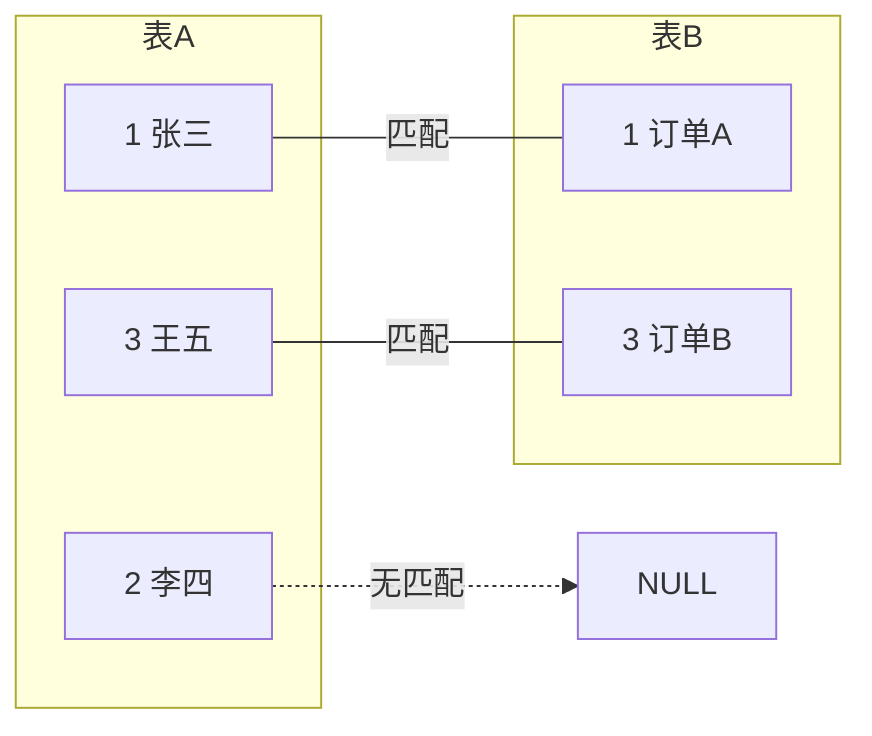

| JOIN 类型 | 特点 | 示意图 |
|-----------|------|--------|
| INNER JOIN | 只返回两表都匹配的记录 | A ∩ B |
| LEFT JOIN | 返回左表全部，右表无匹配填 NULL | A 全部 |
| RIGHT JOIN | 返回右表全部，左表无匹配填 NULL | B 全部 |
| FULL JOIN | 返回两表全部记录 | A ∪ B |

::: warning JOIN 性能注意事项
1. 小表驱动大表（LEFT JOIN 左表是小表，INNER JOIN 优化器会自动选择）
2. JOIN 的关联字段必须有索引
3. 避免 JOIN 超过 3 张表，考虑拆分查询
4. SELECT 中避免 `*`，只查需要的字段
:::

### 子查询

```sql
-- WHERE 子查询
SELECT * FROM users
WHERE id IN (SELECT user_id FROM orders WHERE amount > 1000);

-- FROM 子查询（派生表）
SELECT t.user_id, t.total_amount
FROM (
    SELECT user_id, SUM(amount) AS total_amount
    FROM orders
    GROUP BY user_id
) t
WHERE t.total_amount > 5000;

-- EXISTS（比 IN 效率更高，子查询找到匹配就停止）
SELECT * FROM users u
WHERE EXISTS (
    SELECT 1 FROM orders o
    WHERE o.user_id = u.id AND o.amount > 1000
);
```

EXISTS vs IN 的选择取决于数据分布：

| 场景 | 推荐方式 | 原因 |
|------|---------|------|
| 外表小、内表大 | EXISTS | 外表遍历，内表走索引快速匹配 |
| 外表大、内表小 | IN | 内表结果集小，全放入内存 |

### 窗口函数（MySQL 8.0+）

```sql
-- ROW_NUMBER：连续编号
SELECT
    id, name, department, salary,
    ROW_NUMBER() OVER (PARTITION BY department ORDER BY salary DESC) AS rank_num
FROM employees;

-- RANK：相同值相同排名，下一个排名跳号
-- DENSE_RANK：相同值相同排名，下一个排名不跳号
SELECT
    name, department, salary,
    RANK() OVER (PARTITION BY department ORDER BY salary DESC) AS rnk,
    DENSE_RANK() OVER (PARTITION BY department ORDER BY salary DESC) AS dense_rnk
FROM employees;

-- 累计求和
SELECT
    order_date, amount,
    SUM(amount) OVER (ORDER BY order_date) AS running_total
FROM orders;

-- 取上一行/下一行的值
SELECT
    order_date, amount,
    LAG(amount, 1) OVER (ORDER BY order_date) AS prev_day_amount,
    LEAD(amount, 1) OVER (ORDER BY order_date) AS next_day_amount
FROM orders;

-- 实际案例：求每个部门工资前三名
SELECT * FROM (
    SELECT
        name, department, salary,
        DENSE_RANK() OVER (PARTITION BY department ORDER BY salary DESC) AS rnk
    FROM employees
) t
WHERE rnk <= 3;
```

窗口函数的排序差异一目了然：

| 姓名 | 部门 | 薪资 | ROW_NUMBER | RANK | DENSE_RANK |
|------|------|------|-----------|------|-----------|
| 张三 | 研发 | 30K | 1 | 1 | 1 |
| 李四 | 研发 | 30K | 2 | 1 | 1 |
| 王五 | 研发 | 25K | 3 | 3 | 2 |
| 赵六 | 研发 | 20K | 4 | 4 | 3 |

### 分组与聚合

```sql
-- GROUP BY 基础
SELECT department, COUNT(*) AS cnt, AVG(salary) AS avg_salary
FROM employees
GROUP BY department
HAVING COUNT(*) > 5;

-- GROUP_CONCAT（把分组内的值拼成字符串）
SELECT department, GROUP_CONCAT(name ORDER BY salary DESC SEPARATOR ', ') AS members
FROM employees
GROUP BY department;

-- 多维度分组（GROUPING SETS，MySQL 8.0+）
SELECT
    COALESCE(department, '总计') AS department,
    COALESCE(gender, '总计') AS gender,
    COUNT(*) AS cnt
FROM employees
GROUP BY GROUPING SETS (department, gender, ());
-- 相当于 3 个 GROUP BY 的 UNION ALL
```

---

## 索引——MySQL 性能的核心

### 索引的底层结构：B+ Tree

InnoDB 使用 B+ Tree 作为索引的默认数据结构。它的核心优势在于：层级浅、范围查询快、磁盘 IO 次数少。

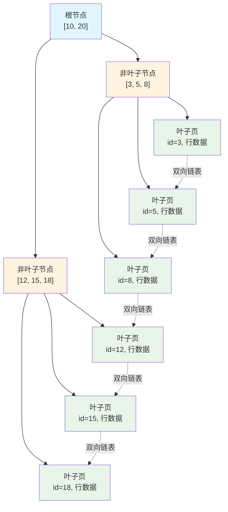

**为什么是 B+ Tree 而不是 B Tree 或红黑树？**

| 特性 | B+ Tree | B Tree | 红黑树 |
|------|---------|--------|--------|
| 非叶子节点存数据 | ❌ 只存键值 | ✅ 存数据 | ✅ 存数据 |
| 叶子节点链表 | ✅ 双向链表 | ❌ 无 | ❌ 无 |
| 树的高度 | 低（3 层可存 2000 万） | 较高 | 很高（内存数据结构） |
| 范围查询 | 高效（链表顺序扫描） | 需要中序遍历 | 需要中序遍历 |

**3 层 B+ Tree 能存多少数据？**

假设每个节点 16KB，主键 BIGINT（8B）+ 指针（6B）= 14B：
- 每个非叶子节点：16KB / 14B ≈ **1170** 个指针
- 每个叶子节点：16KB / (8B + 1KB 行数据) ≈ **16** 条记录
- 3 层总量：1170 × 1170 × 16 ≈ **2200 万**条记录

::: tip 结论
2000 万条数据只需要 **3 次 IO** 就能找到目标记录，这就是 InnoDB 查询通常很快的原因。
:::

### 聚簇索引 vs 非聚簇索引

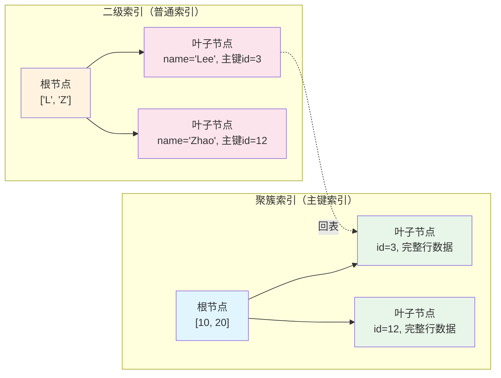

**聚簇索引（Clustered Index）**
- InnoDB 的主键索引就是聚簇索引
- 叶子节点存储**完整的行数据**
- 一个表只能有一个聚簇索引
- 主键建议用自增整型（避免页分裂）

**二级索引（Secondary Index / 非聚簇索引）**
- 叶子节点存储**主键值**（不是行数据）
- 查询需要**回表**：二级索引 → 主键 → 聚簇索引 → 行数据

**回表演示**：

```sql
SELECT * FROM users WHERE name = '张三';
-- name 有二级索引，查询流程：
-- 1. 在 name 索引的 B+ Tree 中找到 name='张三' → 得到主键 id=5
-- 2. 用 id=5 去聚簇索引的 B+ Tree 查找 → 得到完整行数据
-- 步骤 2 就是"回表"
```

### 索引什么时候会失效？

| 场景 | ❌ 索引失效写法 | ✅ 正确写法 |
|------|----------------|------------|
| 对索引列做函数操作 | `WHERE YEAR(create_time) = 2024` | `WHERE create_time >= '2024-01-01' AND create_time < '2025-01-01'` |
| 隐式类型转换 | `WHERE phone = 13800138000`（phone 是 varchar） | `WHERE phone = '13800138000'` |
| 左模糊匹配 | `WHERE name LIKE '%张三'` | `WHERE name LIKE '张三%'`（前缀匹配可用索引） |
| OR 条件中有一列无索引 | `WHERE name = '张三' OR age = 25`（age 无索引） | 给 age 也加索引，或用 `UNION` |
| 不等于 | `WHERE status != 0` | 尽量避免，或改用其他条件 |
| IS NOT NULL | `WHERE name IS NOT NULL` | 索引效率低，考虑覆盖索引 |
| 对索引列做运算 | `WHERE id + 1 = 10` | `WHERE id = 9` |

### 联合索引与最左前缀

联合索引 `(a, b, c)` 的 B+ Tree 按 **先 a → 再 b → 最后 c** 的顺序排列：

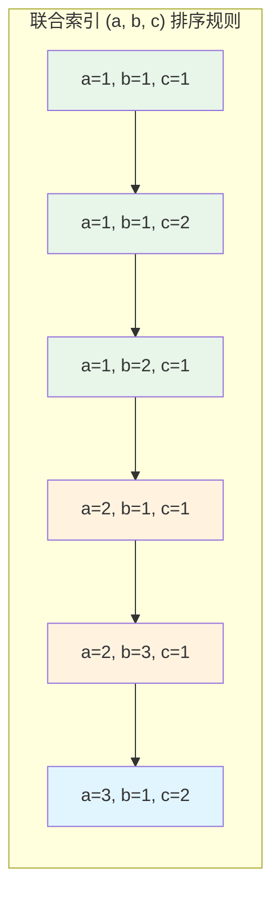

| 查询条件 | 能否用索引 | 说明 |
|---------|-----------|------|
| `WHERE a = 1` | ✅ | 匹配最左列 |
| `WHERE a = 1 AND b = 2` | ✅ | 匹配最左两列 |
| `WHERE a = 1 AND b = 2 AND c = 3` | ✅ | 全部匹配 |
| `WHERE a = 1 AND b > 2` | ✅ a、b | 范围查询后的 c 不能用索引 |
| `WHERE b = 2` | ❌ | 跳过了最左列 a |
| `WHERE c = 3` | ❌ | 跳过了最左列 a |
| `WHERE a = 1 AND c = 3` | ✅ 仅 a | 中间列 b 缺失，c 不能用 |
| `WHERE a > 1 AND b = 2` | ✅ 仅 a | a 范围后 b 不能用 |
| `WHERE a = 1 ORDER BY b` | ✅ 排序优化 | a 定值后 b 有序，避免 filesort |

**两个重要优化机制**：

::: info 索引下推（ICP，MySQL 5.6+）
联合索引 `(name, age)`，查询 `name LIKE '张%' AND age = 25`：
- **没有 ICP**：存储引擎通过索引找到 `name LIKE '张%'` 的所有主键 → 回表 → Server 层过滤 `age=25`
- **有 ICP**：存储引擎在索引中先过滤 `age=25` → 只回表匹配的记录
- **效果**：减少回表次数
:::

::: info 索引覆盖（Covering Index）
查询的字段都在索引中，不需要回表。例如联合索引 `(name, age, email)`：

```sql
SELECT name, age FROM users WHERE name = '张三';
-- Extra: Using index（不需要回表，性能好）
```
:::

### 索引设计原则

1. **选择性高的列优先** — 唯一值多 → 索引效果好（性别只有男/女不适合建索引，手机号几乎唯一适合）
2. **联合索引优于多个单列索引** — 一个联合索引 `(a, b)` 可以覆盖 `WHERE a=?` 和 `WHERE a=? AND b=?`
3. **覆盖索引减少回表** — SELECT 的字段尽量包含在索引中
4. **短索引更高效** — 区分度足够时可用前缀索引：`INDEX idx_name(name(10))`
5. **主键用自增整型** — 避免随机主键导致的页分裂，占用空间小，范围查询友好
6. **不要过度索引** — 索引占空间且降低写性能，单表索引建议不超过 5 个

---

## 锁机制

### 锁的分类

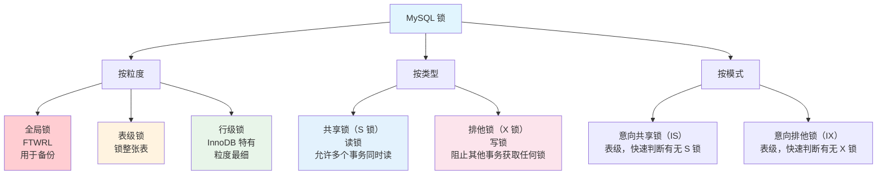

### InnoDB 行锁的 3 种实现

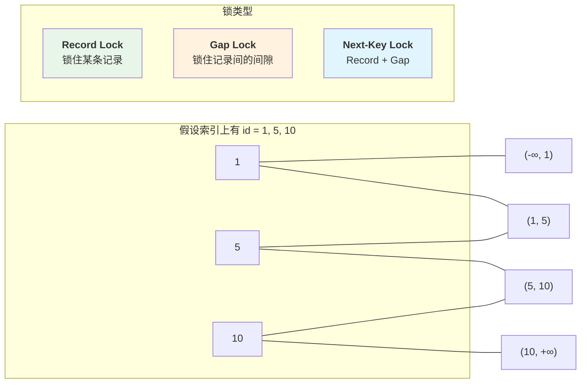

**Record Lock（记录锁）**：锁住索引上的某一条记录。

```sql
SELECT * FROM users WHERE id = 1 FOR UPDATE;
-- 锁住 id=1 这条记录
```

**Gap Lock（间隙锁）**：锁住索引记录之间的间隙，防止其他事务在间隙中插入数据（防幻读）。

```sql
-- 假设 id 有 1, 5, 10
SELECT * FROM users WHERE id = 3 FOR UPDATE;
-- 锁住 (1, 5) 这个间隙，防止插入 id=2/3/4
-- 注意：Gap Lock 只在 RR 隔离级别下生效
```

**Next-Key Lock = Record Lock + Gap Lock**：InnoDB 在 RR 级别的默认加锁方式，同时锁住记录本身及其左边的间隙。

```sql
-- 假设 id 有 1, 5, 10
SELECT * FROM users WHERE id > 5 FOR UPDATE;
-- Next-Key Lock 锁住 (5, 10] 和 (10, +∞)
```

::: tip Gap Lock 的作用
Gap Lock 的唯一目的是**防止其他事务在间隙中插入数据**，从而在 RR 级别下防止幻读。它不阻止其他事务对同一条记录加锁。
:::

### 加锁规则

**基本原则**：
1. 加锁的基本单位是 Next-Key Lock
2. 查找过程中访问到的对象才会加锁

**优化情况**：
- 等值查询命中唯一索引 → Next-Key Lock 退化为 Record Lock
- 等值查询未命中 → Next-Key Lock 退化为 Gap Lock

**案例说明**：表 t，id 是主键，c 有普通索引，数据如下：

| id | c |
|----|---|
| 1 | 10 |
| 3 | 20 |
| 5 | 30 |
| 7 | 40 |

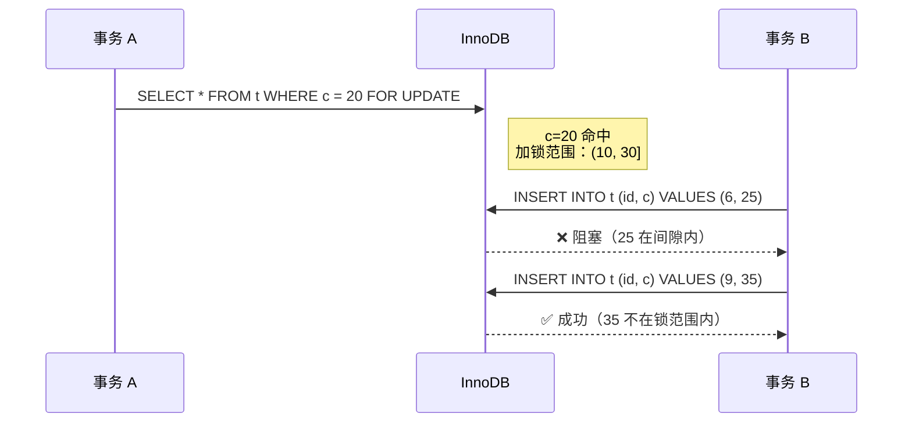

### 死锁

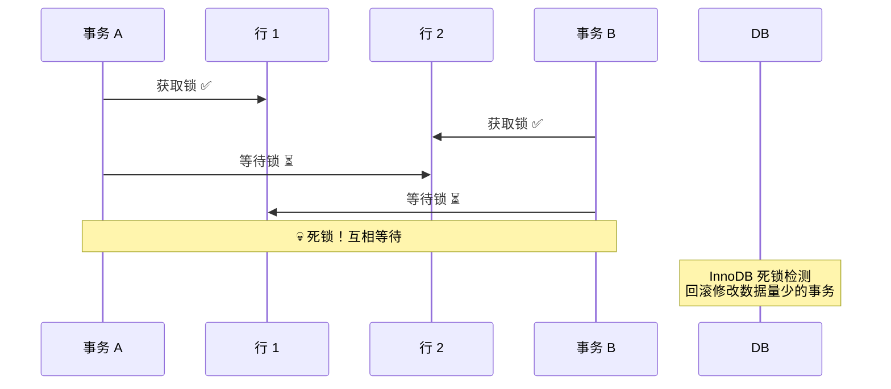

**常见死锁场景及解决方案**：

| 场景 | 原因 | 解决方案 |
|------|------|---------|
| 不同顺序更新同一组行 | A 先锁 1 再锁 2，B 先锁 2 再锁 1 | 确保所有事务以相同顺序操作 |
| 间隙锁冲突 | FOR UPDATE 锁了范围，INSERT 冲突 | 降低隔离级别到 RC，或缩小锁范围 |

**预防死锁的建议**：
1. 按固定顺序访问表和行
2. 大事务拆小事务
3. 合理使用索引，减少锁范围
4. 设置锁等待超时：`innodb_lock_wait_timeout = 50`（默认 50 秒）

### 悲观锁 vs 乐观锁

| 特性 | 悲观锁 | 乐观锁 |
|------|--------|--------|
| 思路 | 先加锁再操作 | 不加锁，提交时检测冲突 |
| 实现 | `SELECT ... FOR UPDATE` | 版本号 / 时间戳 |
| 适用场景 | 写多、冲突多 | 读多写少、冲突少 |
| 并发性能 | 低（阻塞等待） | 高（无阻塞，冲突时重试） |
| 死锁风险 | 有 | 无 |

```java
// 悲观锁：先加锁再操作
@Transactional
public void deductStock(Long productId, int quantity) {
    // 加排他锁，其他事务等待
    Product product = productMapper.selectForUpdate(productId);
    if (product.getStock() < quantity) {
        throw new RuntimeException("库存不足");
    }
    productMapper.updateStock(productId, product.getStock() - quantity);
}

// 乐观锁：不加锁，用版本号检测冲突
@Transactional
public void deductStock(Long productId, int quantity) {
    Product product = productMapper.selectById(productId);
    if (product.getStock() < quantity) {
        throw new RuntimeException("库存不足");
    }
    // UPDATE 时检查版本号
    int affected = productMapper.updateStockWithVersion(
        productId,
        product.getStock() - quantity,
        product.getVersion()
    );
    if (affected == 0) {
        throw new RuntimeException("并发冲突，请重试");
    }
}
```

乐观锁对应的 SQL：

```sql
UPDATE product
SET stock = stock - #{quantity}, version = version + 1
WHERE id = #{id} AND version = #{version}
```

---

## 事务与 MVCC

### 四个隔离级别

| 级别 | 脏读 | 不可重复读 | 幻读 | 性能 | MySQL 默认 |
|------|------|-----------|------|------|-----------|
| Read Uncommitted | ❌ | ❌ | ❌ | 最高 | |
| Read Committed | ✅ | ❌ | ❌ | 高 | Oracle 默认 |
| Repeatable Read | ✅ | ✅ | ⚠️ | 中 | ✅ InnoDB 默认 |
| Serializable | ✅ | ✅ | ✅ | 最低 | |

三种并发问题用下面的时序图来说明：

**脏读** — 读到其他事务未提交的数据：

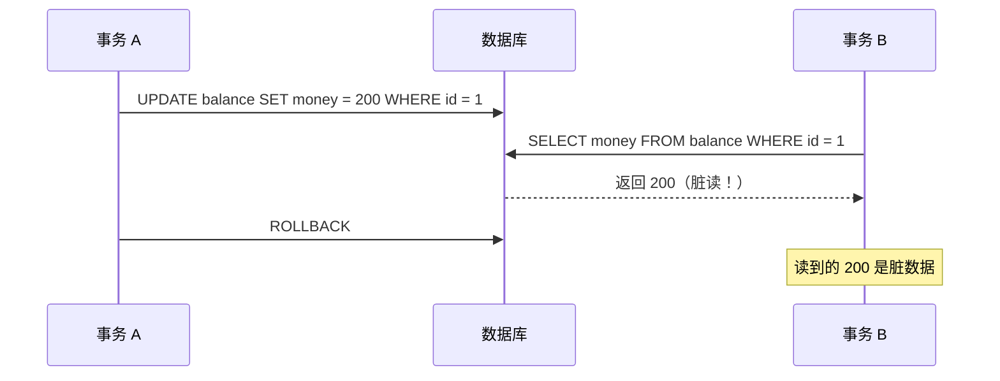

**不可重复读** — 同一事务内两次读取结果不同：

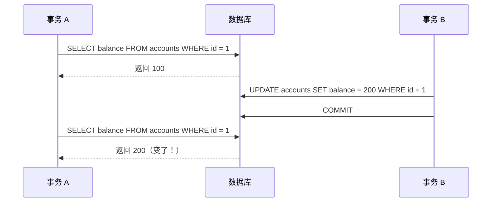

**幻读** — 同一事务内两次查询行数不同：

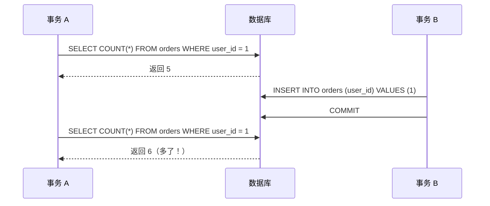

::: tip InnoDB 的 RR 级别真的能防幻读吗？
InnoDB 在 RR 级别通过 MVCC + Next-Key Lock（间隙锁）"基本"防止了幻读。但有一个场景：先执行普通 SELECT（快照读），再执行 INSERT（当前读），可能插入了一条幻行。MVCC 对快照读有效，但当前读（加锁的 SELECT）需要配合间隙锁才能真正防幻读。
:::

### MVCC——多版本并发控制

MVCC 的核心思想：**写操作加锁，读操作不加锁，读历史版本（快照）**。

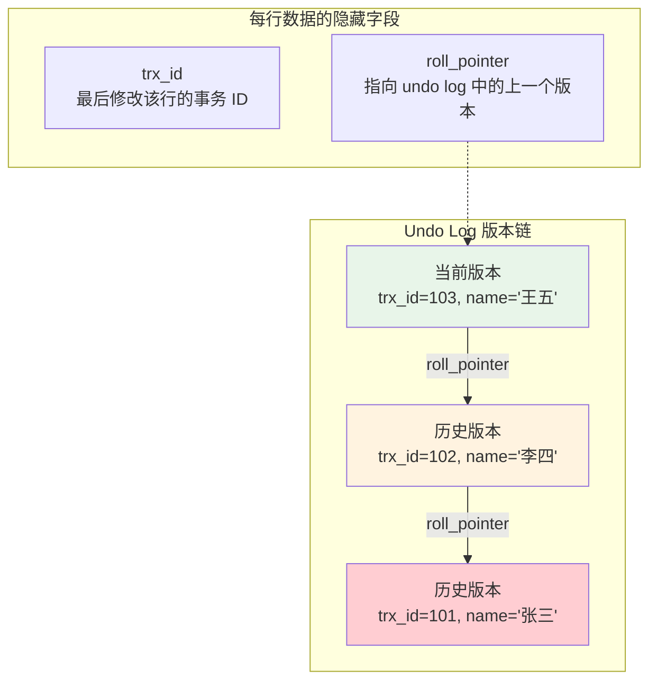

**Read View** — 事务启动时创建的"可见性判断快照"：

| 字段 | 含义 |
|------|------|
| `m_ids` | 当前活跃（未提交）的事务 ID 列表 |
| `min_trx_id` | m_ids 中的最小值 |
| `max_trx_id` | 下一个要分配的事务 ID（当前系统最大事务 ID + 1） |

**可见性判断规则**：

| 条件 | 结果 |
|------|------|
| `trx_id < min_trx_id` | ✅ 可见（事务已提交） |
| `trx_id >= max_trx_id` | ❌ 不可见（事务在 Read View 创建后才开始） |
| `trx_id` 在 `m_ids` 中 | ❌ 不可见（事务还在进行中） |
| `trx_id` 不在 `m_ids` 中 | ✅ 可见（事务已提交） |

**快照读 vs 当前读**：

| 类型 | 语法 | 特点 |
|------|------|------|
| 快照读 | 普通 `SELECT` | 读 MVCC 快照，不加锁 |
| 当前读 | `SELECT ... FOR UPDATE` / `LOCK IN SHARE MODE` | 读最新数据，加锁 |
| 当前写 | `UPDATE` / `DELETE` / `INSERT` | 读最新数据，加锁 |

### undo log 与 redo log

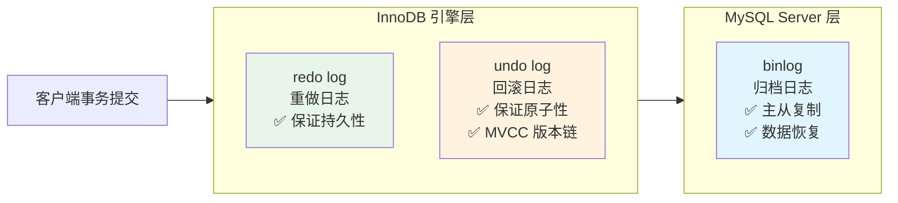

**redo log（重做日志）**
- 保证**持久性**（Durability）
- 先写日志再写磁盘（WAL，Write-Ahead Logging）
- 事务提交时，redo log 写入磁盘就 OK（不需要等数据页落盘）
- 崩溃恢复时用 redo log 重放未落盘的修改

**undo log（回滚日志）**
- 保证**原子性**（Atomicity）
- 记录数据修改前的值，事务回滚时恢复
- MVCC 用 undo log 构建版本链

**binlog（归档日志）**
- MySQL Server 层的日志
- 用于主从复制和基于时间点的恢复
- 三种格式：

| 格式 | 记录内容 | 优点 | 缺点 |
|------|---------|------|------|
| STATEMENT | SQL 语句 | 节省空间 | 函数可能不一致 |
| ROW | 行变更 | 最安全 | 空间大 |
| MIXED | 自动选择 | 折中 | — |

### 两阶段提交（2PC）

redo log 和 binlog 通过两阶段提交保证一致性：

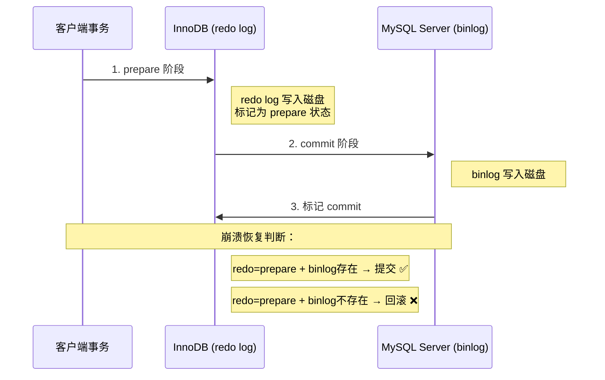

---

## SQL 优化

### EXPLAIN 执行计划

```sql
EXPLAIN SELECT * FROM users WHERE name = '张三' AND age = 25;
```

**关键字段解读**：

**type（访问类型，从好到差）**：

| type | 含义 | 说明 |
|------|------|------|
| system / const | 最多一条匹配 | 主键或唯一索引等值查询 |
| eq_ref | 主键/唯一索引等值匹配 | 多出现在 JOIN 中 |
| ref | 普通索引等值匹配 | 最常见的索引访问 |
| range | 索引范围扫描 | `>`、`<`、`BETWEEN`、`IN` |
| index | 索引全扫描 | 比全表扫描好，但仍然不好 |
| **ALL** | **全表扫描** | **最差，必须优化** |

**Extra（额外信息）**：

| 值 | 含义 | 好坏 |
|----|------|------|
| Using index | 覆盖索引，不需要回表 | ✅ 好 |
| Using index condition | 索引下推 | ✅ 好 |
| Using where | 存储引擎检索后 Server 层过滤 | ⚠️ 正常 |
| Using filesort | 需要额外排序（内存或磁盘） | ❌ 差 |
| Using temporary | 使用临时表 | ❌ 差 |

### 常见慢查询优化

**1. 避免 SELECT \***

```sql
-- ❌ 回表查询所有字段
SELECT * FROM users WHERE name = '张三';
-- ✅ 走覆盖索引，不需要回表
SELECT id, name, age FROM users WHERE name = '张三';
```

**2. 深分页优化**

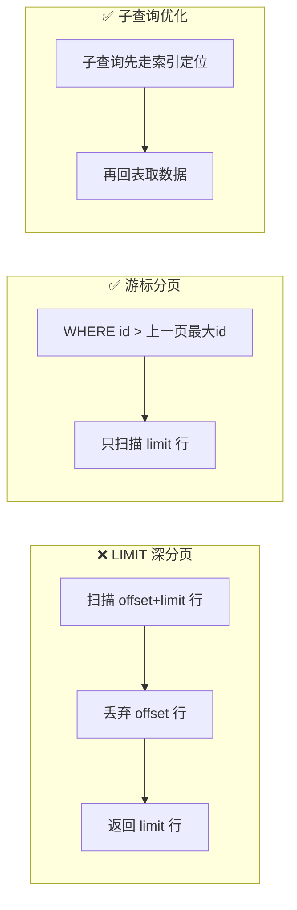

```sql
-- ❌ MySQL 扫描 offset + limit 行再丢弃 offset 行
SELECT * FROM orders ORDER BY id LIMIT 1000000, 10;

-- ✅ 方案1：游标分页（推荐）
SELECT * FROM orders WHERE id > 1000000 ORDER BY id LIMIT 10;

-- ✅ 方案2：子查询优化
SELECT * FROM orders
WHERE id >= (SELECT id FROM orders ORDER BY id LIMIT 1000000, 1)
ORDER BY id LIMIT 10;
```

**3. 大表 IN 优化**

```sql
-- ❌ IN 子句元素太多
SELECT * FROM users WHERE id IN (1, 2, ..., 10000);
-- ✅ 改用 JOIN
SELECT u.* FROM users u INNER JOIN temp_ids t ON u.id = t.id;
```

**4. OR 条件优化**

```sql
-- ❌ OR 导致索引失效
SELECT * FROM users WHERE name = '张三' OR email = 'zhangsan@email.com';
-- ✅ 用 UNION
SELECT * FROM users WHERE name = '张三'
UNION
SELECT * FROM users WHERE email = 'zhangsan@email.com';
```

### 批量操作优化

```java
// ❌ 逐条插入（10000 条需要 10000 次网络往返）
for (User user : users) {
    userMapper.insert(user);
}

// ✅ MyBatis 批量插入（网络往返减少到 N/1000 次）
@Insert("<script>" +
    "INSERT INTO users (name, email, age) VALUES " +
    "<foreach collection='list' item='u' separator=','>" +
    "(#{u.name}, #{u.email}, #{u.age})" +
    "</foreach>" +
    "</script>")
void batchInsert(@Param("list") List<User> users);

// ✅ JDBC 批处理（推荐大批量数据）
@Transactional
public void batchInsert(List<User> users) {
    SqlSession sqlSession = sqlSessionFactory.openSession(ExecutorType.BATCH);
    try {
        UserMapper mapper = sqlSession.getMapper(UserMapper.class);
        for (int i = 0; i < users.size(); i++) {
            mapper.insert(users.get(i));
            if (i % 1000 == 0) {
                sqlSession.flushStatements();  // 每 1000 条提交一次
            }
        }
        sqlSession.flushStatements();
        sqlSession.commit();
    } finally {
        sqlSession.close();
    }
}
```

---

## 日志系统

MySQL 的日志体系全景图：

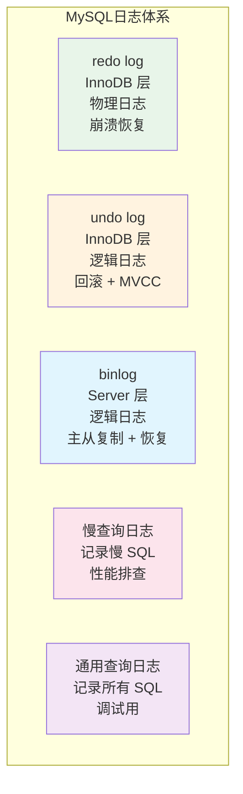

| 日志 | 层级 | 类型 | 作用 | 生产建议 |
|------|------|------|------|---------|
| redo log | InnoDB | 物理 | 崩溃恢复 | 自动管理，循环写 |
| undo log | InnoDB | 逻辑 | 回滚 + MVCC | 自动管理 |
| binlog | Server | 逻辑 | 主从复制、数据恢复 | 建议开 ROW 格式 |
| 慢查询日志 | Server | — | 记录慢 SQL，性能排查 | 建议开启，阈值 1 秒 |
| 通用查询日志 | Server | — | 记录所有 SQL | **生产环境关闭**，性能影响大 |

慢查询日志开启方式：

```sql
SET GLOBAL slow_query_log = ON;
SET GLOBAL long_query_time = 1;  -- 超过 1 秒记录
```

分析工具推荐：`mysqldumpslow`（MySQL 自带）、`pt-query-digest`（Percona Toolkit）。

---

## 主从复制与读写分离

### 主从复制原理

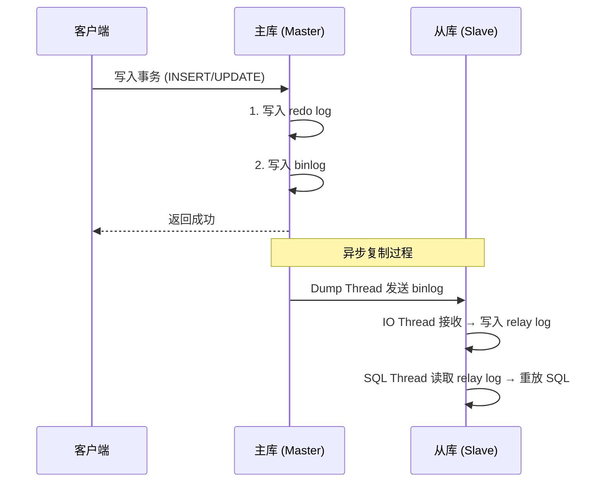

**复制延迟的常见原因**：
- 单 SQL Thread 重放（MySQL 5.6 前串行）
- MySQL 5.6+ 支持多线程重放（基于库级别的并行）
- 大事务、DDL 操作会阻塞复制

### 读写分离架构

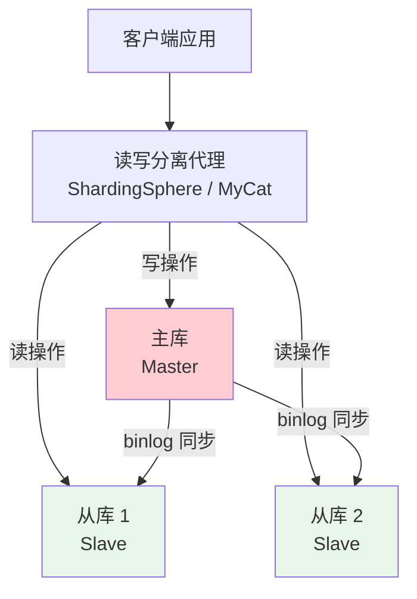

ShardingSphere 读写分离配置示例：

```yaml
spring:
  shardingsphere:
    datasource:
      names: master,slave0,slave1
      master:
        type: com.zaxxer.hikari.HikariDataSource
        jdbc-url: jdbc:mysql://master-host:3306/db
      slave0:
        type: com.zaxxer.hikari.HikariDataSource
        jdbc-url: jdbc:mysql://slave0-host:3306/db
      slave1:
        type: com.zaxxer.hikari.HikariDataSource
        jdbc-url: jdbc:mysql://slave1-host:3306/db
    rules:
      readwrite-splitting:
        data-sources:
          rw:
            write-data-source-name: master
            read-data-source-names: slave0,slave1
            load-balancer-name: round-robin
        load-balancers:
          round-robin:
            type: ROUND_ROBIN
```

::: warning 读写分离的数据一致性
主从复制有延迟（通常几十毫秒到几秒）。写入主库后立即从从库读取可能读到旧数据。解决方案：1) 关键读走主库（@Master 注解）；2) 读自己的写（sticky session）；3) 接受最终一致性。
:::

---

## 分库分表

### 什么时候需要分库分表？

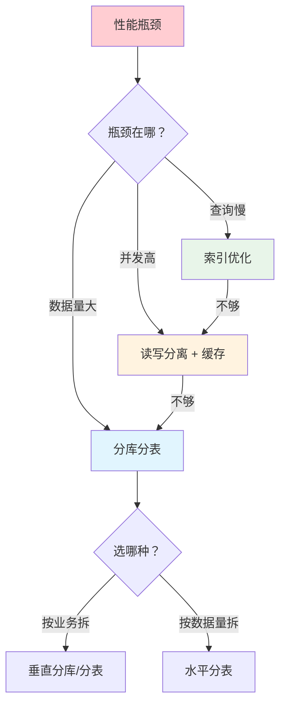

**单体 MySQL 的瓶颈**：
- 单表数据量 > 5000 万行 → 查询变慢
- 单库 QPS > 2000 → 连接池和 CPU 成为瓶颈
- 磁盘空间不足

**分库分表的代价**：
- 跨库 JOIN 变复杂
- 分布式事务问题
- 全局 ID 生成
- 数据迁移复杂
- 运维成本高

::: warning 建议
优先考虑：**索引优化 → 读写分离 → 缓存**，确实需要再考虑分库分表。垂直拆分优先于水平拆分。
:::

### 分库分表策略

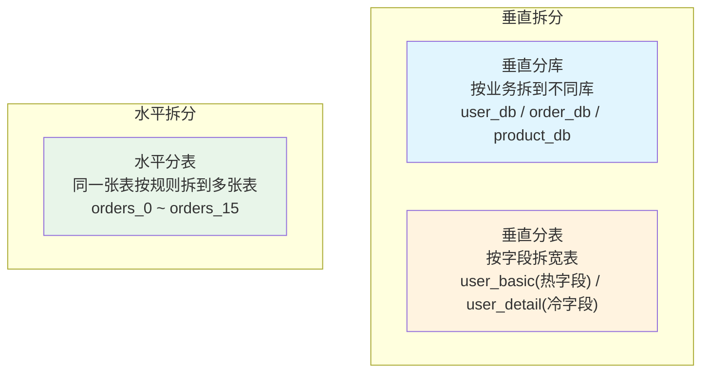

**分片键选择**：
- 尽量用查询条件中最常用的字段
- 数据分布均匀（避免热点）
- 不能修改（分片键决定了数据去哪个库/表）

**常见分片算法对比**：

| 算法 | 示例 | 优点 | 缺点 |
|------|------|------|------|
| Hash 取模 | `user_id % 16` | 简单、分布均匀 | 扩容需要数据迁移 |
| 范围分片 | `id 1~1000万 → db1` | 扩容方便 | 可能有热点 |
| 一致性 Hash | 环形 Hash 空间 | 扩容只需迁移部分数据 | 实现复杂 |

---

## 面试高频题

**Q1：什么是回表？怎么减少回表？**

通过二级索引找到主键值，再用主键值去聚簇索引查完整数据——这就是回表。减少回表：1) 覆盖索引（查询的字段都在索引中）；2) 减少用 `SELECT *`，只查需要的字段。

**Q2：EXPLAIN 的关键字段怎么看？**

`type`：访问类型（const > eq_ref > ref > range > index > all，至少到 range 级别）。`key`：实际使用的索引。`rows`：预估扫描行数。`Extra`：`Using index`（覆盖索引，好）、`Using filesort`（额外排序，差）、`Using temporary`（使用临时表，差）。

**Q3：为什么建议用自增主键？**

1) B+ Tree 叶子节点按主键顺序插入，避免页分裂（随机主键会导致频繁的页分裂和页搬运）；2) 自增整型占用空间小（8B），UUID 占 36B，二级索引存储主键值时空间差异巨大；3) 范围查询友好。

**Q4：MySQL 最多能存多少数据？**

理论上 InnoDB 单表没有行数限制，但性能会随数据量下降。经验值：单表 5000 万行以内性能可控。超过后考虑分区、分表或归档历史数据。

**Q5：redo log 和 binlog 的区别？**

redo log 是 InnoDB 层的物理日志，用于崩溃恢复，循环写，固定大小。binlog 是 Server 层的逻辑日志，用于主从复制和数据恢复，追加写，可以保留很久。两阶段提交保证两者一致性。

## 延伸阅读

- [MySQL 索引详解](mysql-index.md) — 索引原理、优化案例
- [Redis](redis.md) — 缓存实战、数据结构
- [Elasticsearch](es.md) — 全文搜索、日志分析
- [分布式事务](../distributed/transaction.md) — Seata、TCC、Saga
