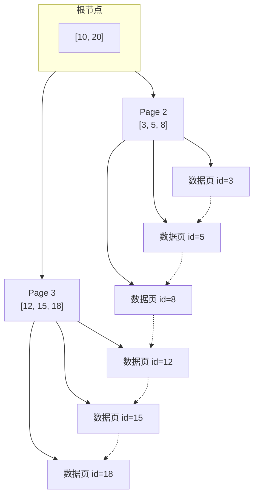

# MySQL

> MySQL 是 Java 后端开发中最重要的数据库。但多数开发者对 MySQL 的理解停留在"写 SQL、加索引"的层面。为什么加了索引还是慢？为什么索引失效？事务隔离级别到底怎么选？这些问题直接决定了系统的性能和数据安全。

## 基础入门：SQL 速查

### CRUD 基本操作

```sql
-- 建表
CREATE TABLE users (
    id BIGINT PRIMARY KEY AUTO_INCREMENT,
    name VARCHAR(50) NOT NULL,
    email VARCHAR(100) UNIQUE,
    age INT DEFAULT 0,
    created_at DATETIME DEFAULT CURRENT_TIMESTAMP
);

-- 增
INSERT INTO users (name, email, age) VALUES ('张三', 'zhangsan@email.com', 25);

-- 查
SELECT * FROM users WHERE age > 20 ORDER BY created_at DESC LIMIT 10;

-- 改
UPDATE users SET age = 26 WHERE name = '张三';

-- 删
DELETE FROM users WHERE id = 1;
```

### 事务基础

```sql
-- ACID：原子性、一致性、隔离性、持久性
START TRANSACTION;
UPDATE accounts SET balance = balance - 100 WHERE id = 1;
UPDATE accounts SET balance = balance + 100 WHERE id = 2;
COMMIT;  -- 两个操作要么都成功，要么都失败
```

---


## 索引——MySQL 性能的核心

### 索引的底层结构：B+ Tree




```
为什么用 B+ Tree 而不是 B Tree 或红黑树？

B+ Tree 的特点：
1. 非叶子节点只存键值，不存数据 → 每个节点能存更多键 → 树更矮
2. 所有数据都在叶子节点 → 查询路径一样长（稳定性能）
3. 叶子节点用链表连接 → 范围查询高效

一个 3 层 B+ Tree 可以存多少数据？
假设：每个节点 16KB，主键 8B + 指针 6B = 14B
每个非叶子节点：16KB / 14B ≈ 1170 个指针
每个叶子节点：16KB / (8B + 1KB数据) ≈ 16 条记录
3 层：1170 × 1170 × 16 ≈ 2200 万条记录

→ 2000 万条数据只需要 3 次 IO 就能找到
→ 这就是为什么 InnoDB 的查询通常很快
```

### 索引什么时候会失效？

```sql
-- 1. 对索引列做函数操作
-- ❌ 索引失效
SELECT * FROM users WHERE YEAR(create_time) = 2024;
-- ✅ 用范围查询
SELECT * FROM users WHERE create_time >= '2024-01-01' AND create_time < '2025-01-01';

-- 2. 隐式类型转换
-- ❌ phone 是 varchar，传入数字导致隐式转换
SELECT * FROM users WHERE phone = 13800138000;
-- ✅ 传字符串
SELECT * FROM users WHERE phone = '13800138000';

-- 3. 左模糊匹配
-- ❌ 索引失效
SELECT * FROM users WHERE name LIKE '%张三';
-- ✅ 前缀匹配可以用索引
SELECT * FROM users WHERE name LIKE '张三%';

-- 4. OR 条件中有一列没有索引
-- ❌ 全表扫描
SELECT * FROM users WHERE name = '张三' OR age = 25;  -- age 没索引
-- ✅ 给 age 也加索引，或用 UNION

-- 5. 不等于（!=、<>）
-- ❌ 索引效率很低（优化器可能选择全表扫描）
SELECT * FROM users WHERE status != 0;
```

### 联合索引与最左前缀

```sql
-- 联合索引 (a, b, c) 的 B+ Tree 排序规则：
-- 先按 a 排 → a 相同按 b 排 → a、b 相同按 c 排

-- ✅ 能用索引
WHERE a = 1
WHERE a = 1 AND b = 2
WHERE a = 1 AND b = 2 AND c = 3
WHERE a = 1 AND b > 2  -- 范围查询后的列不能用索引

-- ❌ 不能用索引（跳过了 a）
WHERE b = 2
WHERE c = 3
WHERE b = 2 AND c = 3

-- 索引下推（ICP，MySQL 5.6+）
-- 联合索引 (name, age)，查询 name LIKE '张%' AND age = 25
-- 存储引擎在索引中先过滤 age=25，再回表 → 减少回表次数
```

## 事务——数据安全的基石

### 四个隔离级别

| 级别 | 脏读 | 不可重复读 | 幻读 | 性能 | MySQL 默认 |
|------|------|-----------|------|------|-----------|
| Read Uncommitted | ❌ | ❌ | ❌ | 最高 | |
| Read Committed | ✅ | ❌ | ❌ | 高 | Oracle 默认 |
| Repeatable Read | ✅ | ✅ | ⚠️ | 中 | ✅ InnoDB 默认 |
| Serializable | ✅ | ✅ | ✅ | 最低 | |

::: tip InnoDB 的 RR 级别真的能防幻读吗？
InnoDB 在 RR 级别通过 MVCC + Next-Key Lock（间隙锁）"基本"防止了幻读。但有一个场景：先执行普通 SELECT（快照读），再执行 INSERT（当前读），可能插入了一条幻行。MVCC 对快照读有效，但当前读（加锁的 SELECT）需要配合间隙锁才能真正防幻读。
:::

### MVCC——多版本并发控制

```
MVCC 让读写不冲突：
- 写操作加锁
- 读操作不加锁，读历史版本（快照）
- 通过 undo log 实现版本链

每行数据有两个隐藏字段：
- trx_id：最后修改该行的事务 ID
- roll_pointer：指向 undo log 中的上一个版本

Read View：事务启动时创建的"可见性判断快照"
- m_ids：活跃事务 ID 列表
- min_trx_id：最小活跃事务 ID
- max_trx_id：下一个要分配的事务 ID

判断规则：
- trx_id < min_trx_id → 可见（事务已提交）
- trx_id >= max_trx_id → 不可见（事务在 Read View 创建后才开始）
- trx_id 在 m_ids 中 → 不可见（事务还在进行中）
- trx_id 不在 m_ids 中 → 可见（事务已提交）
```

## 面试高频题

**Q1：什么是回表？怎么减少回表？**

通过二级索引找到主键值，再用主键值去聚簇索引查完整数据——这就是回表。减少回表：1) 覆盖索引（查询的字段都在索引中）；2) 减少用 `SELECT *`，只查需要的字段。

**Q2：EXPLAIN 的关键字段怎么看？**

`type`：访问类型（const > eq_ref > ref > range > index > all，至少到 range 级别）。`key`：实际使用的索引。`rows`：预估扫描行数。`Extra`：`Using index`（覆盖索引，好）、`Using filesort`（额外排序，差）、`Using temporary`（使用临时表，差）。

## 延伸阅读

- [Redis](redis.md) — 缓存实战、数据结构
- [Elasticsearch](es.md) — 全文搜索、日志分析
- [分布式事务](../distributed/transaction.md) — Seata、TCC、Saga
