# Redis

> Redis 是 Java 后端开发中用得最多的中间件，没有之一。但多数人对 Redis 的理解停留在 `SET` / `GET` / `DEL`。Redis 为什么这么快？持久化会不会丢数据？集群怎么工作？分布式锁怎么实现？缓存穿透/击穿/雪崩怎么解决？这篇文章系统讲解 Redis 核心知识。

## 基础入门：Redis 5 分钟上手

### 为什么用 Redis？

Redis 将数据存储在内存中，读写延迟约 **100ns**，而 MySQL 磁盘 IO 约 **10ms**，快了 100-1000 倍。正因如此，Redis 被广泛用于以下场景：

| 场景 | 数据结构 | 说明 |
|------|---------|------|
| 热点数据缓存 | String | 减少数据库压力 |
| 排行榜 | ZSet | 按分数排序，O(log N) 操作 |
| 计数器 | String (INCR) | 原子自增，适合 PV/UV 统计 |
| 分布式锁 | String (SETNX) | 互斥访问共享资源 |
| 消息队列 | List / Stream | 异步解耦 |
| 会话管理 | String / Hash | 分布式 Session |
| 限流 | ZSet / String | 滑动窗口 / 令牌桶 |
| 地理位置 | GEO | 附近的人、距离计算 |

### 基本操作

```bash
# 启动 Redis
redis-server

# 连接
redis-cli

# 基本命令
SET key value           # 设置值
GET key                 # 获取值
DEL key                 # 删除
EXPIRE key 3600         # 设置过期时间（秒）
TTL key                 # 查看剩余过期时间
INCR counter            # 计数器 +1
DECR counter            # 计数器 -1

# 批量操作（减少网络往返）
MGET key1 key2 key3     # 批量获取
MSET key1 v1 key2 v2    # 批量设置

# 查看所有 key（生产环境慎用！）
KEYS *                  # 遍历所有 key，O(N) 复杂度
SCAN 0 MATCH user:* COUNT 100  # 渐进式遍历，推荐
```

---

## 为什么 Redis 这么快？

Redis 的高性能来自四个关键设计：

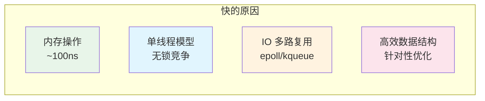

1. **内存操作**：数据存在内存中，读写延迟 ~100ns（磁盘 ~10ms），这是最根本的原因
2. **单线程模型**：没有线程切换和锁竞争的开销，代码简洁且线程安全
3. **IO 多路复用**：一个线程通过 epoll/kqueue 处理大量并发连接
4. **高效的数据结构**：每种数据结构都针对特定场景做了底层优化

::: tip Redis 6.0 的多线程
Redis 6.0 引入了多线程 IO（网络读写多线程），但**命令执行仍然是单线程**。网络读写多线程解决的是网络 IO 瓶颈，命令执行单线程保证操作原子性，无需加锁。
:::

---

## 核心数据结构

Redis 提供了 5 种基本数据结构和 4 种高级数据结构，每种都有其最佳使用场景。

### String（字符串）

String 是最基本的数据类型，一个 Key 对应一个 Value，能存文本、数字甚至二进制数据（图片、序列化对象）。

```bash
# 基本操作
SET user:1:name "张三"
GET user:1:name
APPEND user:1:name "（Java工程师）"   # 追加
STRLEN user:1:name                    # 长度

# 数值操作
SET counter 0
INCR counter           # +1
INCRBY counter 10      # +10
DECR counter           # -1

# 过期时间
SETNX lock:order:1 "locked"    # 不存在才设置（分布式锁基础）
SETEX session:abc 1800 "data"  # 设置值并指定过期时间（秒）

# 批量操作
MSET user:1:name "张三" user:1:age "25"
MGET user:1:name user:1:age
```

**底层实现 — SDS（Simple Dynamic String）**：Redis 没有直接用 C 语言的字符串，而是自己实现了 SDS，相比 C 字符串有三个优势：
- **二进制安全**：用 len 字段记录长度，可以存储图片、序列化数据等任意二进制内容
- **O(1) 获取长度**：直接读 len 字段，不需要遍历
- **预分配空间**：减少内存重分配次数

**编码优化**：Redis 会根据值的类型和大小自动选择编码——int（整数）、embstr（≤44 字节的短字符串，一次分配）、raw（长字符串，两次分配）。

### Hash（哈希）

Hash 是一个键值对集合，适合存储**对象属性**，比如用户信息、商品信息。

```bash
# 基本操作
HSET user:1 name "张三" age 25 email "zhangsan@email.com"
HGET user:1 name
HMGET user:1 name age email
HGETALL user:1

# 字段操作
HEXISTS user:1 name       # 字段是否存在
HDEL user:1 email         # 删除字段
HLEN user:1               # 字段数量

# 计数器
HINCRBY user:1 login_count 1
```

**典型应用场景**：

| 场景 | Key 设计 | 说明 |
|------|---------|------|
| 用户信息缓存 | `user:{id}` | field 为属性名，value 为属性值 |
| 购物车 | `cart:{userId}` | field 为商品 ID，value 为数量 |

::: warning Hash 不支持字段级过期
只能对整个 Key 设置过期时间，不能给 Hash 中的某个字段单独设过期。如果需要字段级过期，可以把 Hash 拆成多个 String Key。
:::

### List（列表）

List 是一个有序的字符串列表，按插入顺序排序，支持从两端推入和弹出。底层使用 quicklist（双向链表 + 压缩列表的混合结构），元素少时用压缩列表省内存，元素多时分段存储。

```bash
# 基本操作
LPUSH mylist a b c         # 左边插入 [c, b, a]
RPUSH mylist x y z         # 右边插入 [c, b, a, x, y, z]
LPOP mylist                # 左边弹出 → c
RPOP mylist                # 右边弹出 → z
LRANGE mylist 0 -1         # 获取全部 [b, a, x, y]
LLEN mylist                # 长度

# 阻塞操作（消息队列核心）
BLPOP queue 30             # 阻塞 30 秒等待数据
BRPOP queue 30             # 右边阻塞弹出

# 其他操作
LINDEX mylist 0            # 按索引获取
LINSERT mylist BEFORE "b" "new"  # 在 b 之前插入
LTRIM mylist 0 99          # 只保留前 100 个元素
```

**List 的使用模式**：

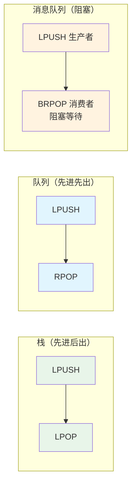

- **栈**：LPUSH + LPOP
- **队列**：LPUSH + RPOP
- **消息队列**：LPUSH + BRPOP（消费者阻塞等待）
- **最新列表**：LPUSH + LTRIM（保留最新 N 条）

### Set（集合）

Set 是一个无序的、不重复的字符串集合，支持集合间的交、并、差运算，底层使用 intset（整数集合）或 hashtable。

```bash
# 基本操作
SADD tags:1 java spring redis
SMEMBERS tags:1             # 所有成员
SISMEMBER tags:1 java       # 是否存在
SCARD tags:1                # 成员数量
SPOP tags:1 2               # 随机弹出 2 个

# 集合运算
SADD set1 a b c d
SADD set2 c d e f
SINTER set1 set2            # 交集 → {c, d}
SUNION set1 set2            # 并集 → {a, b, c, d, e, f}
SDIFF set1 set2             # 差集 → {a, b}
```

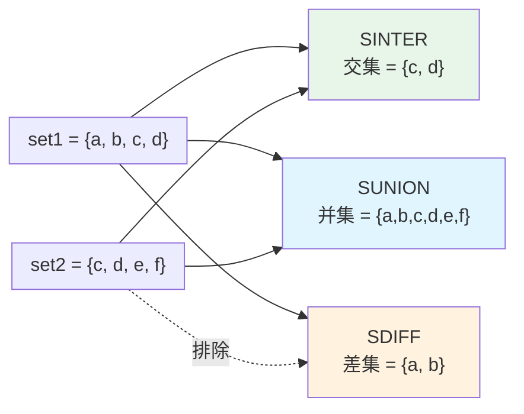

**典型应用场景**：

| 场景 | 命令 | 说明 |
|------|------|------|
| 共同好友 | `SINTER user:1:friends user:2:friends` | 两个用户的交集 |
| 标签系统 | `SADD` / `SINTER` | 用户标签、内容标签 |
| 随机抽奖 | `SRANDMEMBER` / `SPOP` | 随机获取/弹出中奖者 |
| 去重统计 | `SADD` + `SCARD` | UV 统计（数据量小时） |

### ZSet（有序集合）

ZSet（Sorted Set）是 Redis 中最强大的数据结构。每个成员关联一个分数（score），按分数自动排序。底层使用**跳表（Skip List）+ 哈希表**——跳表支持 O(log N) 的查找、插入、删除和范围查询，哈希表支持 O(1) 的分数查找。

```bash
# 基本操作
ZADD leaderboard 100 "user1" 200 "user2" 150 "user3"
ZSCORE leaderboard "user1"    # 获取分数 → 100
ZRANK leaderboard "user1"     # 升序排名 → 1
ZREVRANK leaderboard "user1"  # 降序排名 → 2
ZCARD leaderboard             # 成员数量

# 范围查询
ZREVRANGE leaderboard 0 9 WITHSCORES        # 降序前 10 名（排行榜常用）
ZRANGEBYSCORE leaderboard 100 200 WITHSCORES # 分数在 100-200 之间

# 分数操作
ZINCRBY leaderboard 50 "user1"  # 加 50 分
ZREM leaderboard "user1"        # 删除成员
```

**为什么用跳表而不是平衡树？**

| 对比项 | 跳表 | 红黑树 / AVL |
|--------|------|-------------|
| 实现复杂度 | 简单（约 200 行代码） | 复杂（约 500+ 行） |
| 范围查询 | 天然支持（链表顺序遍历） | 需要中序遍历 |
| 查找/插入/删除 | O(log N) | O(log N) |
| 内存占用 | 每层有指针，略多 | 每节点存颜色+指针 |

**典型应用场景**：

| 场景 | 说明 |
|------|------|
| 排行榜 | `ZREVRANGE` 降序取前 N 名 |
| 延时队列 | 分数存执行时间戳，定时扫描 |
| 滑动窗口限流 | 分数存时间戳，删除窗口外的记录 |
| 区间查询 | 按分数范围筛选（如价格区间） |

### 高级数据结构

Redis 还提供了 4 种高级数据结构，用于特定场景：

**HyperLogLog — 基数统计（UV 计数）**

HyperLogLog 用于估算集合中不同元素的数量（基数），固定占用 **12KB** 内存，可以统计 2^64 个元素，标准误差约 0.81%。适合不需要精确值的 UV 统计场景。

```bash
PFADD uv:page:1 user1 user2 user3    # 添加
PFCOUNT uv:page:1                     # 估算基数
PFMERGE uv:all uv:page:1 uv:page:2   # 合并多个 HyperLogLog
```

**Bitmap — 位图**

Bitmap 将一个字符串看作一个 bit 数组，每个 bit 代表一个状态。适合签到、在线状态、特征标记等场景。

```bash
SETBIT sign:202404:1 0 1   # 第 1 天签到
SETBIT sign:202404:1 15 1  # 第 15 天签到
GETBIT sign:202404:1 0     # 查询第 1 天是否签到
BITCOUNT sign:202404:1     # 签到总天数
```

**GEO — 地理位置**

GEO 基于ZSet 实现（使用 GEOHASH 编码），支持距离计算和附近的人搜索。

```bash
GEOADD locations 116.40 39.90 "北京" 121.47 31.23 "上海"
GEODIST locations "北京" "上海" km     # 距离
GEORADIUS locations 116.40 39.90 100 km WITHCOORD  # 附近 100km
```

**Stream — 消息队列（Redis 5.0+）**

Stream 是 Redis 官方的消息队列方案，比 List 更完善：支持消费组、消息确认（ACK）、阻塞读取、消息回溯。适合轻量级消息队列场景。

```bash
XADD mystream * field1 value1 field2 value2  # 添加消息（* 自动生成 ID）
XREAD COUNT 10 STREAMS mystream $            # 读取最新消息
XREAD GROUP mygroup consumer1 STREAMS mystream >  # 消费组模式
XACK mystream mygroup 1234567890-0           # 确认消息
```

---

## 缓存实战

### 缓存与数据库一致性

常用的缓存策略是 **Cache Aside（旁路缓存）**，其核心思想是：缓存由调用方维护，而不是由数据库或缓存系统自动维护。

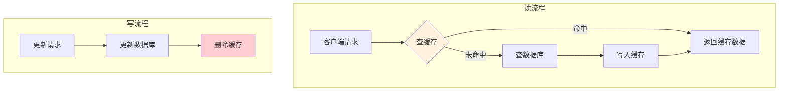

**写操作为什么删除缓存而不是更新缓存？**

1. 如果先更新缓存、后更新数据库失败 → 缓存与数据库不一致
2. 如果频繁更新的数据（写多读少），更新缓存大部分是浪费
3. 删除缓存后，下次读取时自然回填 → **最终一致性**

**极端情况**：数据库更新成功，但删除缓存失败了怎么办？

| 方案 | 原理 | 优点 | 缺点 |
|------|------|------|------|
| 消息队列重试 | 更新 DB → 发 MQ → 消费者删缓存 | 可靠 | 引入 MQ 复杂度 |
| Canal 监听 binlog | Canal 监听 MySQL binlog → 发 MQ → 删缓存 | 对业务代码无侵入 | 需要部署 Canal |
| 延迟双删 | 删缓存 → 更新 DB → 延迟 500ms → 再删缓存 | 简单 | 第二次删除仍可能失败 |

### 缓存穿透

**问题**：查询一个**不存在的数据**，缓存永远不命中，每次请求都打到数据库。恶意攻击者可以利用这个特性，用大量不存在的 key 压垮数据库。

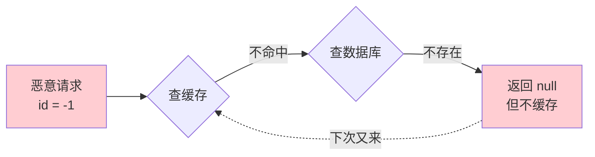

| 解决方案 | 原理 | 优点 | 缺点 |
|---------|------|------|------|
| 缓存空值 | 查 DB 发现不存在 → 缓存 null（短 TTL） | 简单 | 浪费缓存空间 |
| 布隆过滤器 | 请求先过布隆过滤器 → 不存在直接返回 | 空间效率高 | 有误判率 |
| 参数校验 | 拦截明显非法的请求参数 | 简单 | 只能防简单攻击 |

**推荐组合**：布隆过滤器 + 缓存空值。布隆过滤器挡住绝大多数非法请求，漏网的用缓存空值兜底。

```java
// Guava 布隆过滤器示例
BloomFilter<Long> bloomFilter = BloomFilter.create(
    Funnels.longFunnel(), 1000000, 0.01  // 100万容量，1% 误判率
);
// 初始化：将所有合法的商品 ID 放入布隆过滤器
for (Long productId : allProductIds) {
    bloomFilter.put(productId);
}
// 查询时先检查
if (!bloomFilter.mightContain(productId)) {
    return null;  // 一定不存在，直接返回
}
```

### 缓存击穿

**问题**：某个**热点 key 过期的瞬间**，大量并发请求同时穿透到数据库，可能导致数据库瞬间压力过大甚至崩溃。

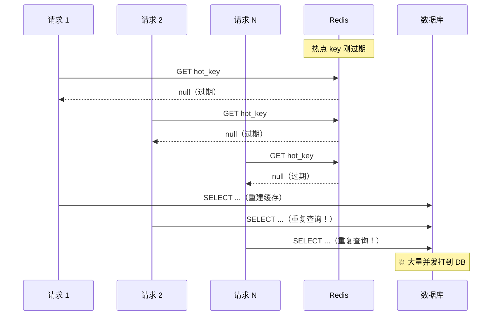

| 解决方案 | 原理 | 优点 | 缺点 |
|---------|------|------|------|
| 互斥锁 | 缓存未命中 → SETNX 加锁 → 成功才查 DB 写缓存 | 保证只有一个线程查 DB | 其他线程阻塞等待 |
| 逻辑过期 | 缓存不设 TTL，数据中存逻辑过期时间 → 异步更新 | 不阻塞其他线程 | 短时间返回旧数据 |
| 热点永不过期 | 后台定时任务刷新，缓存只做逻辑过期检查 | 最简单 | 需要维护刷新任务 |

### 缓存雪崩

**问题**：**大量 key 同时过期**，或者 **Redis 宕机**，导致请求全部打到数据库。

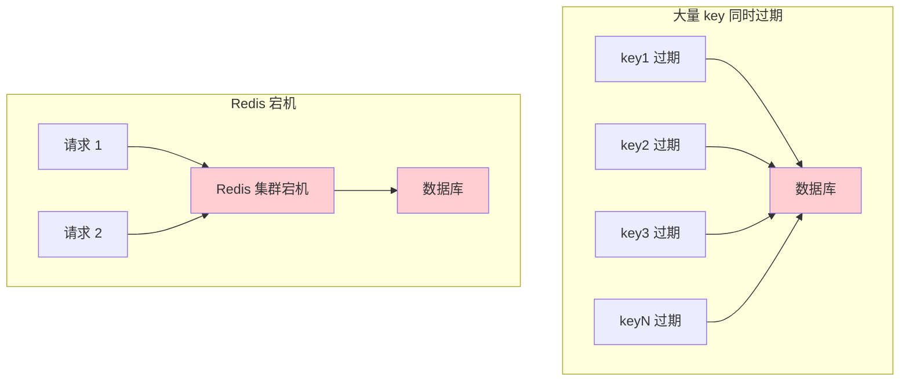

| 解决方案 | 说明 |
|---------|------|
| 过期时间加随机值 | `TTL = 基础时间 + random(0, 300)`，打散过期时间 |
| 多级缓存 | 本地缓存（Caffeine）+ Redis，本地缓存做兜底 |
| 熔断降级 | 数据库压力大时触发 Sentinel/Hystrix 降级 |
| Redis 高可用 | 主从 + 哨兵 / Cluster 模式，减少单点故障 |
| 缓存预热 | 系统启动或大促前主动加载热点数据到缓存 |

::: tip 三者对比速记
- **穿透**：查不存在的数据 → 布隆过滤器 + 缓存空值
- **击穿**：热点 key 过期 → 互斥锁 + 逻辑过期
- **雪崩**：大量 key 过期 / Redis 宕机 → 随机 TTL + 多级缓存 + 高可用
:::

---

## 分布式锁

### 基础实现

分布式锁的核心要求是三个：**互斥性**（同一时刻只有一个客户端持有锁）、**防死锁**（持有锁的客户端崩溃后锁能自动释放）、**防误删**（只能释放自己加的锁）。

```bash
# 加锁（原子操作）
SET lock:order:1 "unique_value" NX EX 30
# NX：不存在才设置（互斥性）
# EX 30：30 秒自动过期（防死锁）
# unique_value：唯一标识（防误删）

# 解锁（Lua 脚本保证原子性：先比较 value，匹配才删除）
if redis.call("get", KEYS[1]) == ARGV[1] then
    return redis.call("del", KEYS[1])
else
    return 0
end
```

### Redisson 实现（推荐）

生产环境推荐使用 Redisson，它封装了分布式锁的所有细节，包括看门狗自动续期、锁的可重入、公平锁等高级特性。

```java
// Redisson 分布式锁
RLock lock = redisson.getLock("order:lock:" + orderId);
try {
    // tryLock(等待时间, 锁过期时间, 时间单位)
    if (lock.tryLock(5, 30, TimeUnit.SECONDS)) {
        // 执行业务逻辑
    } else {
        throw new RuntimeException("获取锁失败");
    }
} finally {
    if (lock.isHeldByCurrentThread()) {
        lock.unlock();
    }
}
```

**Redisson 的看门狗（Watchdog）机制**：

如果不指定 `leaseTime`（锁过期时间），Redisson 默认启用看门狗自动续期，防止业务未执行完锁就过期。

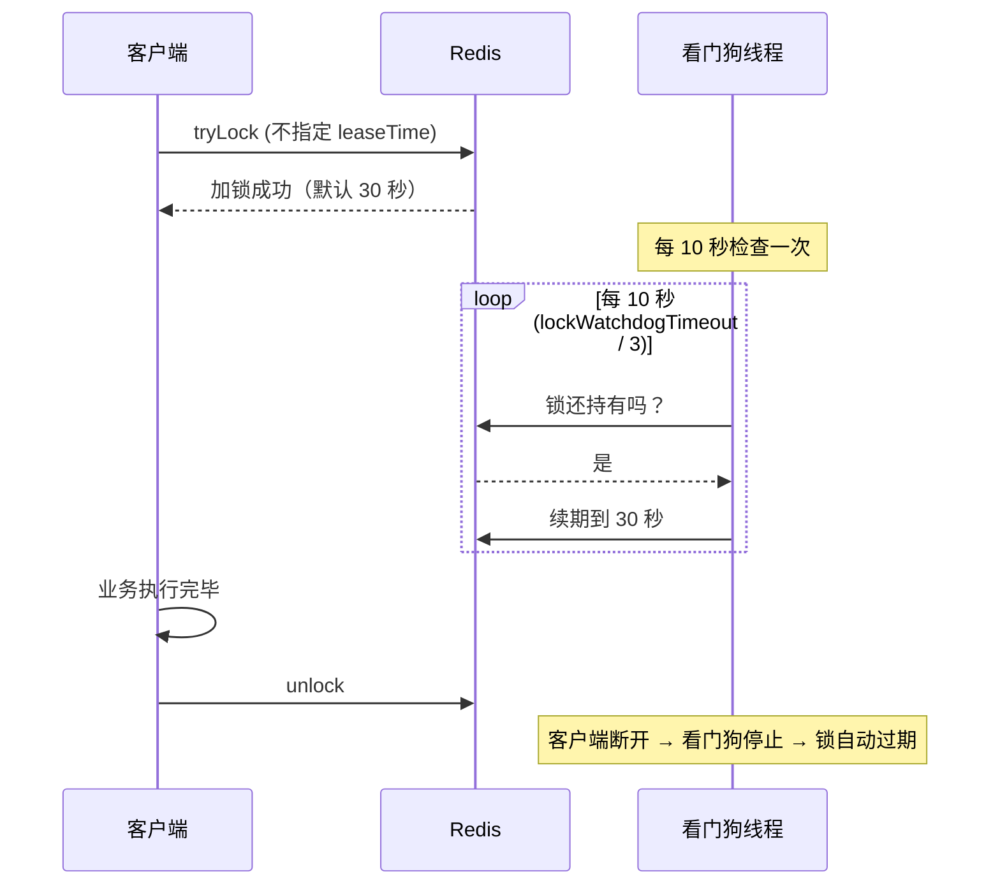

看门狗每 **10 秒**（`lockWatchdogTimeout / 3`）检查一次锁是否还持有，如果持有则自动续期到 30 秒。如果持有锁的进程崩溃，看门狗停止续期，锁在 30 秒后自动释放。

### 分布式锁的常见问题

| 问题 | 场景 | 解决方案 |
|------|------|---------|
| 锁超时 | 业务执行时间 > 锁过期时间 → 锁自动释放 → 其他线程拿到锁 | 看门狗自动续期（Redisson） |
| 锁误删 | 线程 A 的锁过期 → 线程 B 拿到锁 → A 执行完删除了 B 的锁 | 每个锁存唯一 value，释放时先比较（Lua 脚本） |
| 主从切换 | A 在主节点加锁 → 主宕机 → 锁未同步到从 → 从升主 → B 也能加锁 | RedLock（多节点加锁，多数成功才算成功） |

::: warning RedLock 的争议
RedLock 算法由 Redis 作者 Antirez 提出，在多个独立 Redis 节点上同时加锁，超过半数成功才算获取锁。但 Martin Kleppmann（DDIA 作者）对其提出过批评，认为在极端情况下仍有安全问题。实际使用中需要根据场景权衡，对于强一致性要求的场景建议使用 ZooKeeper。
:::

---

## 持久化——会不会丢数据？

Redis 提供了两种持久化方式：RDB（快照）和 AOF（追加日志），以及两者的混合方案。

### RDB（快照）

RDB 通过 fork 子进程将某一时刻的内存数据以二进制形式写入磁盘（dump.rdb 文件）。fork 使用 COW（Copy On Write）技术，子进程复制父进程的页表，实际内存按需复制，因此不阻塞主线程。

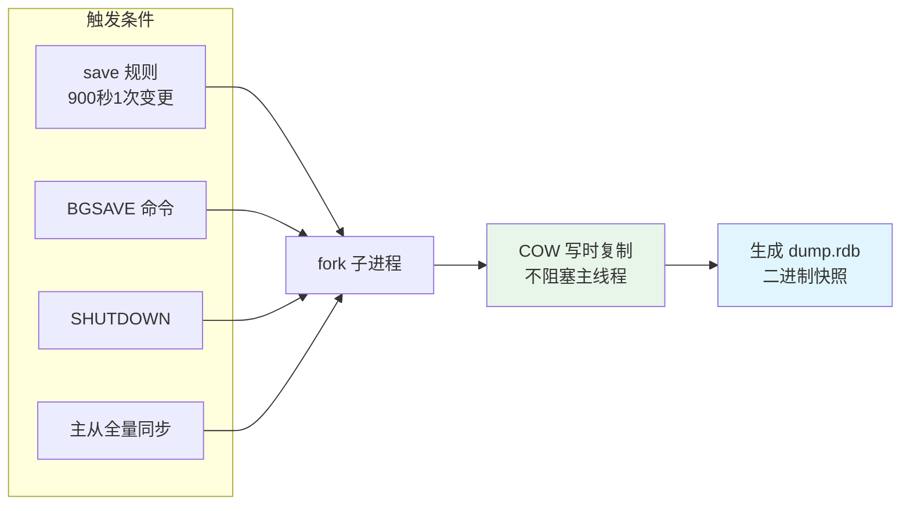

| 项目 | 说明 |
|------|------|
| 优点 | 文件紧凑、恢复速度快、适合做备份 |
| 缺点 | 不是实时的，两次快照之间的数据可能丢失 |
| 配置 | `save 900 1` / `save 300 10` / `save 60 10000` |

### AOF（追加日志）

AOF（Append Only File）记录每一条写命令，以追加方式写入 appendonly.aof 文件。

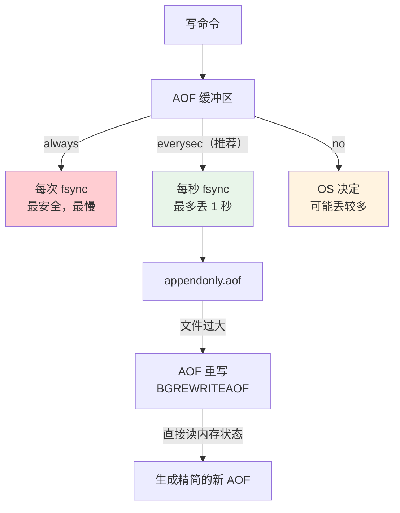

**AOF 重写**：当 AOF 文件过大时，Redis 会 fork 子进程直接读取当前内存状态，用最少的命令重建数据集，生成精简的新 AOF 文件。重写期间的新命令会同时写入旧 AOF 和重写缓冲区，重写完成后主进程将缓冲区内容追加到新 AOF 并替换旧文件。

### 混合持久化（Redis 4.0+）

混合持久化结合了 RDB 和 AOF 的优点：AOF 重写时先写入 RDB 格式的快照（体积小、恢复快），快照后面的增量数据用 AOF 格式追加。

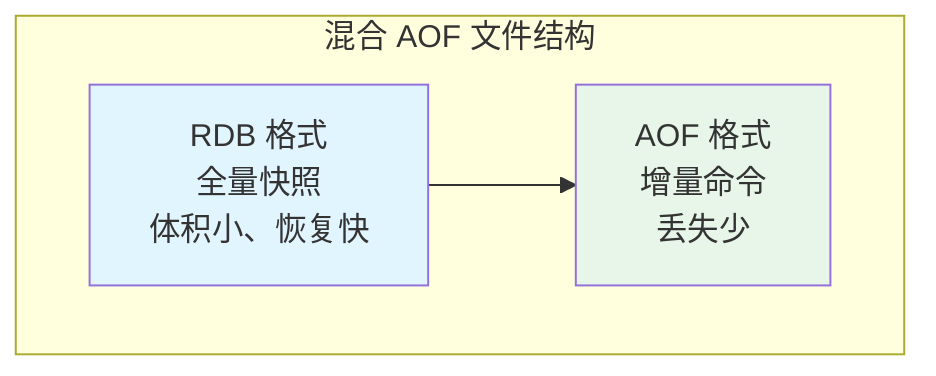

| 持久化方案 | 数据丢失量 | 恢复速度 | 文件大小 | 推荐场景 |
|-----------|-----------|---------|---------|---------|
| 仅 RDB | 可能丢失数分钟 | 快 | 小 | 可容忍丢失、做备份 |
| 仅 AOF (everysec) | 最多 1 秒 | 较慢 | 大 | 需要少丢失 |
| **混合持久化** | **最多 1 秒** | **快** | **适中** | **推荐方案** |

::: tip 推荐配置
- 开启混合持久化：`aof-use-rdb-preamble yes`
- AOF 刷盘策略：`everysec`
- 定期 RDB 快照做异地备份
:::

---

## 高可用方案

### 主从复制

主从复制是 Redis 高可用的基础，Master 负责读写，Slave 负责只读，通过异步复制保持数据一致。

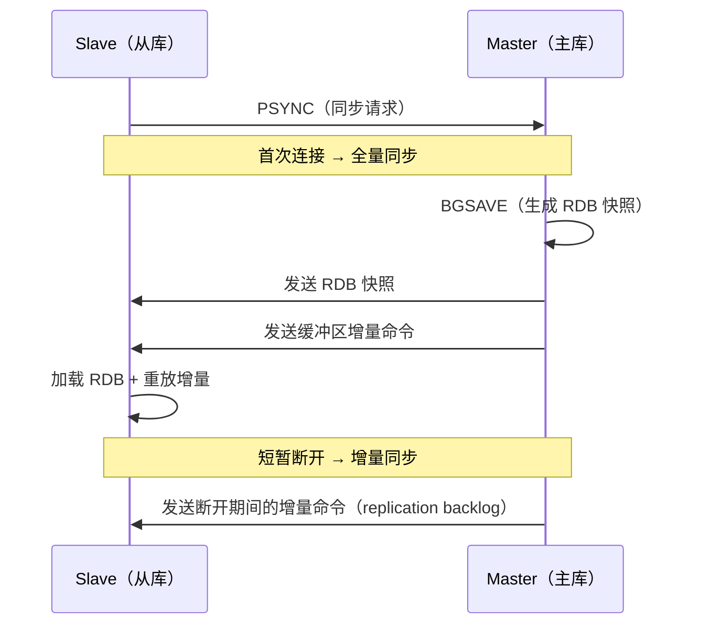

| 类型 | 触发条件 | 过程 |
|------|---------|------|
| 全量同步 | 首次连接或断开太久 | Master BGSAVE → 发送 RDB → 发送增量 |
| 增量同步 | 短暂断开后重连 | 发送 replication backlog 中的增量命令 |

### 哨兵模式（Sentinel）

哨兵模式在主从复制的基础上增加了**自动故障转移**能力。Sentinel 持续监控 Master 和 Slave 的健康状态，当 Master 宕机时自动将从节点提升为新 Master。

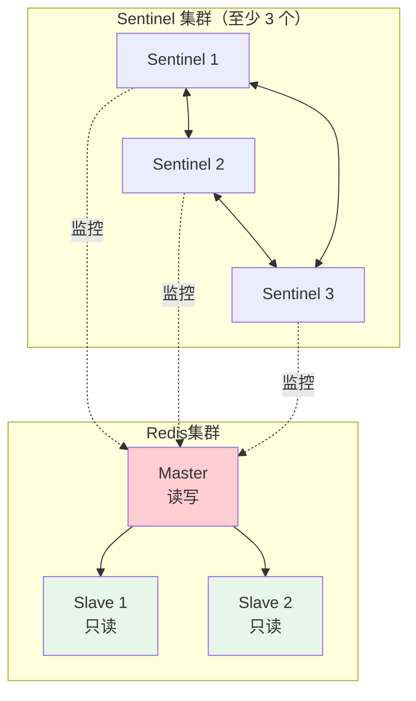

**故障转移流程**：

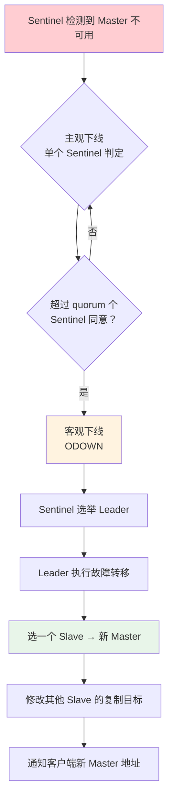

### Cluster 模式

Cluster 是 Redis 官方的分布式解决方案，同时解决**数据分片**和**高可用**两个问题。最少需要 6 个节点（3 主 3 从）。

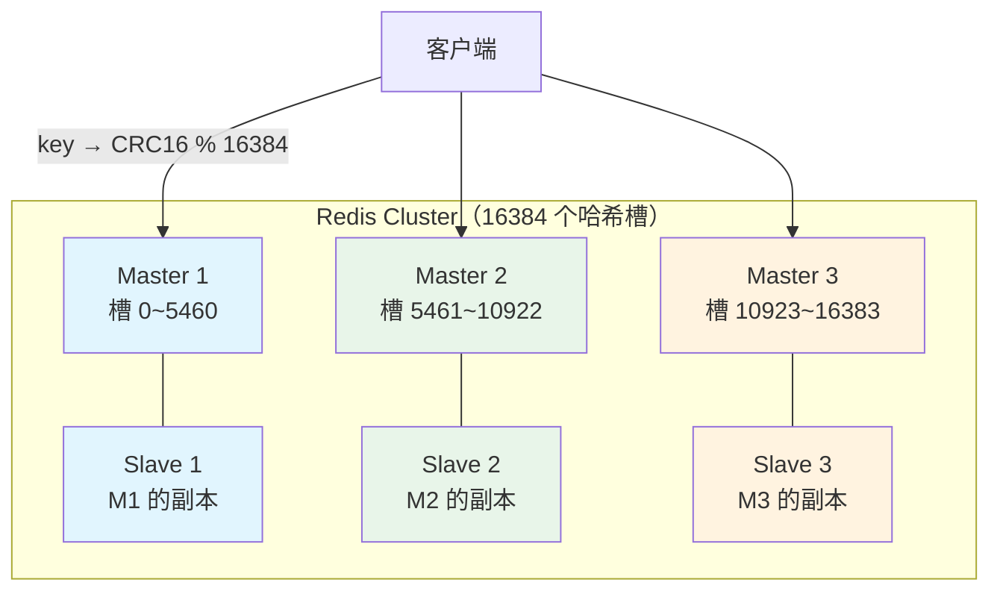

**数据分片原理**：Redis Cluster 将所有数据划分为 **16384 个哈希槽**，每个 Master 负责一部分槽。当客户端发送请求时：
1. 计算 `CRC16(key) % 16384` 得到槽编号
2. 如果该槽在本节点 → 直接处理
3. 如果不在 → 返回 `MOVED` 重定向到正确节点

**Cluster 的限制**：

| 限制 | 说明 | 解决方案 |
|------|------|---------|
| 不支持多 key 跨槽操作 | 如 `MGET` 多个不同槽的 key | Hash Tag：`{user:1}:name` 和 `{user:1}:age` 用 `{}` 内的部分计算 hash |
| 只能用 db 0 | 不支持 `SELECT` 切换数据库 | 应用层拆分 |
| 事务限制 | 事务只能操作同一个槽的 key | Hash Tag |
| 发布订阅广播 | 消息会广播到所有节点 | 注意性能影响 |

---

## 内存管理与淘汰策略

### 内存碎片

Redis 实际占用的内存可能远大于存储的数据量，因为频繁的修改和删除操作会产生内存碎片。

| 检查方式 | 命令 |
|---------|------|
| 查看碎片率 | `INFO memory` → `mem_fragmentation_ratio` |
| 查看单个 key 占用 | `MEMORY USAGE key` |

碎片率解读：
- **> 1.5**：碎片严重，需要整理
- **≈ 1.0**：正常
- **< 1.0**：使用了 swap（比碎片更严重！）

**解决方案**：`CONFIG SET activedefrag yes`（Redis 4.0+ 自动碎片整理），或者定期重启 Redis。

### 内存淘汰策略

当 Redis 内存使用达到 `maxmemory` 限制时，需要淘汰一些数据。Redis 提供了 8 种淘汰策略：

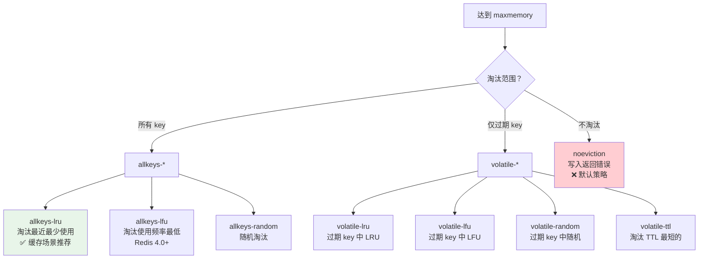

| 策略 | 说明 | 推荐场景 |
|------|------|---------|
| `allkeys-lru` | 所有 key 中淘汰最近最少使用的 | **缓存场景推荐** |
| `allkeys-lfu` | 所有 key 中淘汰使用频率最低的 | 热点数据明显的场景 |
| `volatile-lru` | 过期 key 中淘汰最近最少使用的 | 部分数据需持久化 |
| `noeviction` | 不淘汰，写入返回错误 | 纯缓存之外的数据存储 |

### 大 Key 问题

**什么是大 Key？**

| 数据类型 | 大 Key 阈值 |
|---------|-----------|
| String | Value > 10KB |
| Hash / List / Set / ZSet | 元素数量 > 5000 |

**大 Key 的危害**：

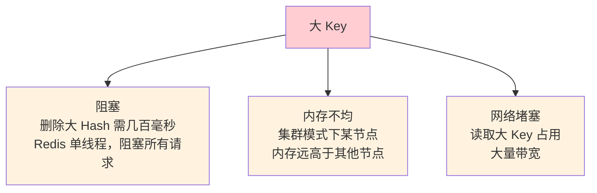

**发现大 Key**：

```bash
redis-cli --bigkeys                           # 扫描所有 key（线上慎用）
redis-cli memory usage mykey                  # 查看单个 key 的内存占用
SCAN 0 COUNT 100 | xargs redis-cli memory usage  # 批量检查
```

**处理方案**：

| 方案 | 说明 |
|------|------|
| 拆分 | 大 Hash → 多个小 Hash（按字段前缀分） |
| 压缩 | Value 用 Snappy / GZIP 压缩 |
| 异步删除 | `UNLINK` 替代 `DEL`（Redis 4.0+，后台线程删除） |
| 本地缓存 | 大且不常变的数据放本地缓存（Caffeine） |

---

## 面试高频题

**Q1：Redis 和 Memcached 的区别？**

Redis 支持丰富数据结构（String/Hash/List/Set/ZSet），支持持久化（RDB/AOF），支持主从复制和集群，单线程（6.0 多线程 IO）。Memcached 只支持 String，不支持持久化，不支持集群，多线程模型。实际开发中几乎都用 Redis。

**Q2：Redis 集群方案有哪些？**

主从复制（读写分离）、哨兵模式（Sentinel，自动故障转移）、Cluster 模式（官方集群方案，数据分片，水平扩展）。小规模用主从+哨兵，大规模用 Cluster。

**Q3：缓存穿透、击穿、雪崩的区别？**

穿透：查询不存在的数据，缓存永远不命中（用布隆过滤器/缓存空值）。击穿：热点 key 过期瞬间大量并发打到数据库（用互斥锁/逻辑过期）。雪崩：大量 key 同时过期或 Redis 宕机（过期时间加随机值/多级缓存/Redis 高可用）。

**Q4：Redis 如何保证高可用？**

数据层面：RDB + AOF 混合持久化，减少数据丢失。架构层面：主从复制 + 哨兵（自动故障转移）或 Cluster（数据分片 + 高可用）。客户端层面：连接池、重试机制、降级策略。

**Q5：Redis 的过期策略？**

Redis 使用**惰性删除 + 定期删除**。惰性删除：访问 key 时检查是否过期，过期则删除。定期删除：每 100ms 随机检查一批 key，删除过期的。两者结合：大部分过期 key 被定期删除清理，漏网的被惰性删除兜底。

## 延伸阅读

- 上一篇：[MySQL](mysql.md) — 索引、事务、MVCC
- 下一篇：[Elasticsearch](es.md) — 全文搜索、日志分析
- [高并发架构](../architecture/high-concurrency.md) — 缓存策略、限流降级
