# Kafka 架构与实战：分布式消息队列深度解析

> 持续更新中 | 最后更新：2026-04-03

---

## ⭐⭐⭐ Kafka 架构核心：分布式流处理平台

Kafka 由 Apache 开发，是一个高吞吐、低延迟、分布式的流处理平台。最初 LinkedIn 开发，现已成为大数据领域的核心组件，广泛应用于日志收集、事件流处理、消息队列等场景。

### Kafka 的设计理念

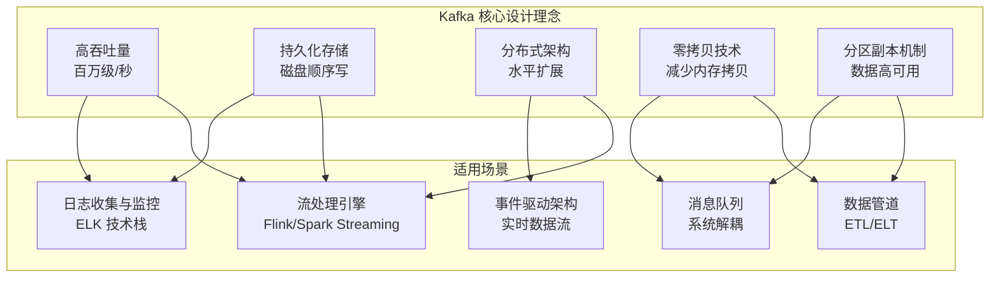

### Kafka 与传统消息队列的对比

| 特性 | Kafka | RabbitMQ | RocketMQ | ActiveMQ |
|------|-------|----------|----------|----------|
| **吞吐量** | 百万级/秒 | 万级/秒 | 十万级/秒 | 万级/秒 |
| **持久化** | 磁盘持久化 | 内存+磁盘 | 磁盘持久化 | 内存+磁盘 |
| **消息顺序** | 分区内有序 | 单队列有序 | 严格顺序 | 单队列有序 |
| **消息回溯** | 支持 | 不支持 | 支持 | 不支持 |
| **分布式架构** | 原生分布式 | 代理模式 | 原生分布式 | 支持集群 |
| **延迟** | ms 级 | μs 级 | ms 级 | ms 级 |
| **功能特性** | 流处理生态丰富 | 路由灵活 | 事务消息 | JMS 规范完整 |

### Kafka 的应用场景分析

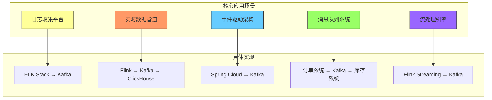

:::tip Kafka 选择指南
**选择 Kafka 的场景：**
- 大数据量、高吞吐需求（日志、监控数据）
- 需要数据回溯和历史数据分析
- 实时流处理管道构建
- 多个系统间的事件解耦

**不推荐 Kafka 的场景：**
- 小规模系统（RabbitMQ 更简单）
- 严格事务要求的场景
- 低延迟实时计算（μs 级）
- 消息路由需求复杂的场景
:::

---

## ⭐⭐⭐ Kafka 核心组件详解

Kafka 由多个组件协同工作，理解每个组件的作用是掌握 Kafka 的关键。

### Kafka 架构图

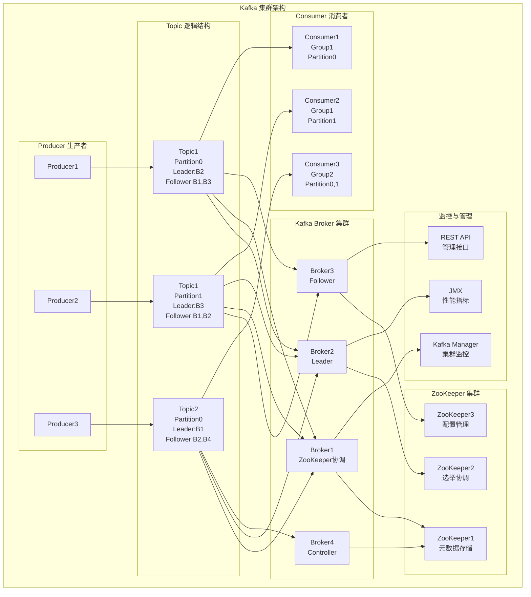

### 1. Kafka Broker

Kafka Broker 是 Kafka 集群中的服务器节点，负责存储消息和处理客户端请求。

```yaml
# broker 配置示例 (server.properties)
# 基础配置
broker.id=1
listeners=PLAINTEXT://:9092
num.network.threads=8
num.io.threads=16

# 存储配置
log.dirs=/var/lib/kafka/logs
log.segment.bytes=1073741824  # 1GB
log.retention.hours=168      # 7天
log.retention.bytes=107374182400  # 100GB

# ZK 配置
zookeeper.connect=localhost:2181
zookeeper.connection.timeout.ms=60000

# 副本配置
default.replication.factor=3
min.insync.replicas=2
unclean.leader.election.enable=false

# JVM 配置
jvm.heap.size=4G
```

**Broker 关键配置解析：**

```properties
# Broker ID 唯一标识每个节点
broker.id=1

# 监听配置
listeners=PLAINTEXT://:9092,SSL://:9093,EXTERNAL://:9094

# 网络线程数
num.network.threads=8

# IO 线程数（处理磁盘读写）
num.io.threads=16

# Socket 发送缓冲区大小
socket.send.buffer.bytes=102400

# Socket 接收缓冲区大小
socket.receive.buffer.bytes=102400

# Socket 请求最大大小
socket.request.max.bytes=104857600

# 日志目录（可配置多个，实现数据分散）
log.dirs=/data/kafka-logs-1,/data/kafka-logs-2

# Topic 默认配置
default.replication.factor=3

# 副本同步配置
min.insync.replicas=2

# 不允许选举不完整的副本（保证数据不丢失）
unclean.leader.election.enable=false
```

### 2. ZooKeeper 协调服务

ZooKeeper 是 Kafka 集群的协调服务，负责管理集群元数据、选举 Leader、处理配置等。

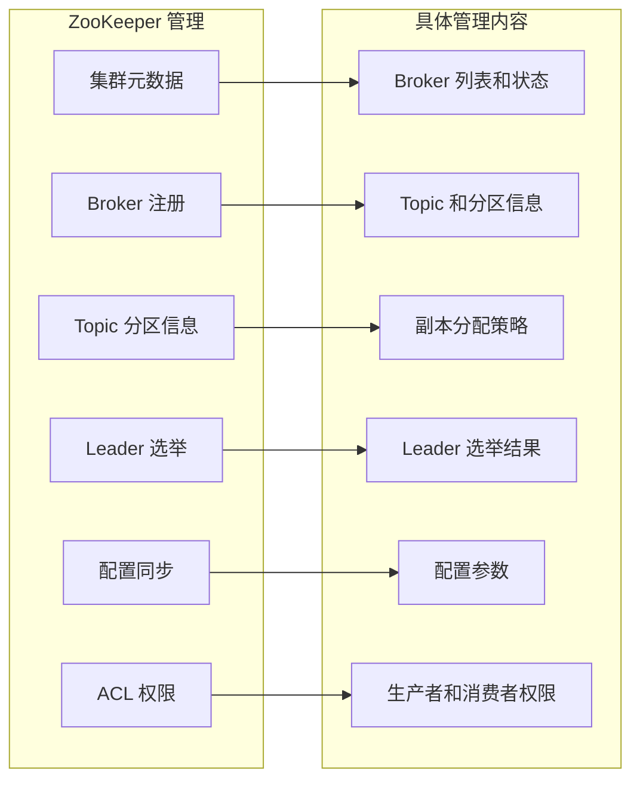

**ZooKeeper 关键配置：**

```properties
# 数据目录
dataDir=/var/lib/zookeeper/data
dataLogDir=/var/lib/zookeeper/log

# 端口配置
clientPort=2181
tickTime=2000

# 集群配置
initLimit=5
syncLimit=2
server.1=192.168.1.100:2888:3888
server.2=192.168.1.101:2888:3888
server.3=192.168.1.102:2888:3888

# JVM 配置
jvm.heap.size=2G
```

### 3. Topic 与 Partition

Topic 是 Kafka 中消息的逻辑分类，Partition 是 Topic 的物理分区，实现水平扩展。

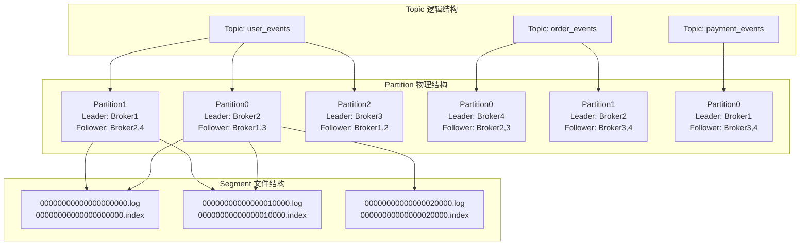

**Topic 配置管理：**

```bash
# 创建 Topic
kafka-topics.sh --bootstrap-server localhost:9092 \
    --create --topic user_events \
    --partitions 3 \
    --replication-factor 3 \
    --config retention.ms=604800000 \
    --config max.message.bytes=1048576

# 查看 Topic 信息
kafka-topics.sh --bootstrap-server localhost:9092 \
    --describe --topic user_events

# 修改 Topic 配置
kafka-topics.sh --bootstrap-server localhost:9092 \
    --alter --topic user_events \
    --config retention.ms=864000000

# 分区扩展（需要集群有足够 Broker）
kafka-topics.sh --bootstrap-server localhost:9092 \
    --alter --topic user_events \
    --partitions 6

# 删除 Topic
kafka-topics.sh --bootstrap-server localhost:9092 \
    --delete --topic old_topic
```

### 4. Producer 生产者

Producer 是 Kafka 消息的生产者，负责向 Kafka 发送消息。

```java
// 生产者配置
Properties props = new Properties();
props.put("bootstrap.servers", "localhost:9092");
props.put("key.serializer", "org.apache.kafka.common.serialization.StringSerializer");
props.put("value.serializer", "org.apache.kafka.common.serialization.StringSerializer");

// 高级配置
props.put("acks", "all");  // 所有副本同步
props.put("retries", 3);   // 重试次数
props.put("batch.size", 16384);  // 批量发送大小
props.put("linger.ms", 5);    // 批量等待时间
props.put("buffer.memory", 33554432);  // 发送缓冲区大小
props.put("max.in.flight.requests.per.connection", 5);  // 并发请求数
props.put("enable.idempotence", true);  // 幂等性

// 创建生产者
KafkaProducer<String, String> producer = new KafkaProducer<>(props);

// 发送消息
ProducerRecord<String, String> record = 
    new ProducerRecord<>("user_events", "user_123", "login");
producer.send(record, new Callback() {
    @Override
    public void onCompletion(RecordMetadata metadata, Exception exception) {
        if (exception != null) {
            // 处理发送失败
            log.error("消息发送失败", exception);
        } else {
            // 处理发送成功
            log.info("消息发送成功: partition={}, offset={}", 
                    metadata.partition(), metadata.offset());
        }
    }
});

// 关闭生产者
producer.close();
```

**生产者核心配置解析：**

```properties
# Bootstrap Servers
bootstrap.servers=localhost:9092,node2:9092,node3:9092

# 序列化器
key.serializer=org.apache.kafka.common.serialization.StringSerializer
value.serializer=org.apache.kafka.common.serialization.StringSerializer

# 可靠性配置
acks=all              # 所有副本同步确认
retries=3             # 失败重试次数
enable.idempotence=true  # 启用幂等性

# 性能配置
batch.size=16384       # 批量发送大小（字节）
linger.ms=5           # 批量等待时间（毫秒）
buffer.memory=33554432 # 发送缓冲区大小
max.in.flight.requests.per.connection=5  # 单连接最大并发请求数

# 压缩配置
compression.type=snappy  # 消息压缩类型

# 分区器配置
partitioner.class=org.apache.kafka.clients.producer.internals.DefaultPartitioner
```

### 5. Consumer 消费者

Consumer 是 Kafka 消息的消费者，负责从 Kafka 拉取消息进行处理。

```java
// 消费者配置
Properties props = new Properties();
props.put("bootstrap.servers", "localhost:9092");
props.put("group.id", "user_events_consumer_group");
props.put("key.deserializer", "org.apache.kafka.common.serialization.StringDeserializer");
props.put("value.deserializer", "org.apache.kafka.common.serialization.StringDeserializer");

// 消费偏移量配置
props.put("enable.auto.commit", false);  // 手动提交偏移量
props.put("auto.commit.interval.ms", "1000");
props.put("auto.offset.reset", "earliest");  // 最早偏移量

// 高级配置
props.put("max.poll.records", 500);    // 每次拉取消息数量
props.put("session.timeout.ms", "30000"); # 会话超时
props.put("heartbeat.interval.ms", "3000"); # 心跳间隔

// 创建消费者
KafkaConsumer<String, String> consumer = new KafkaConsumer<>(props);
consumer.subscribe(Collections.singletonList("user_events"));

// 消费消息
while (true) {
    ConsumerRecords<String, String> records = consumer.poll(Duration.ofMillis(100));
    
    for (ConsumerRecord<String, String> record : records) {
        try {
            // 处理消息
            processMessage(record.key(), record.value());
            
            // 手动提交偏移量
            consumer.commitSync();
        } catch (Exception e) {
            log.error("处理消息失败", e);
            // 可以选择重试或死信队列
        }
    }
}
```

**消费者核心配置解析：**

```properties
# Bootstrap Servers
bootstrap.servers=localhost:9092,node2:9092,node3:9092

# 消费者组配置
group.id=user_events_consumer_group
client.id=consumer-1

# 序列化器
key.deserializer=org.apache.kafka.common.serialization.StringDeserializer
value.deserializer=org.apache.kafka.common.serialization.StringDeserializer

# 偏移量管理
enable.auto.commit=false
auto.commit.interval.ms=1000
auto.offset.reset=earliest  # earliest/latest/none

# 会话配置
session.timeout.ms=30000
heartbeat.interval.ms=3000

# 性能配置
max.poll.records=500
fetch.max.bytes=1048576
fetch.min.bytes=1
fetch.max.wait.ms=500

# 重平衡配置
max.poll.interval.ms=300000
partition.assignment.strategy=org.apache.kafka.clients.consumer.RangeAssignor
```

### 6. Consumer Group 与 Rebalance

Consumer Group 是 Kafka 消费者的组织方式，Rebalance 是分区重新分配的过程。

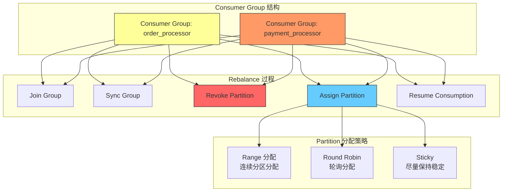

**Consumer Group 管理：**

```bash
# 查看消费者组信息
kafka-consumer-groups.sh --bootstrap-server localhost:9092 \
    --describe --group user_events_consumer_group

# 重置消费者组偏移量
kafka-consumer-groups.sh --bootstrap-server localhost:9092 \
    --group user_events_consumer_group \
    --reset-offsets --to-earliest \
    --execute --topic user_events

# 删除消费者组
kafka-consumer-groups.sh --bootstrap-server localhost:9092 \
    --delete --group old_consumer_group

# 强制触发重平衡
kafka-consumer-groups.sh --bootstrap-server localhost:9092 \
    --describe --group user_events_consumer_group \
    --members
```

:::tip Consumer Group 最佳实践
1. **避免单一消费者**：单个消费者会限制并行处理能力
2. **合理设置分区数**：分区数应 >= 消费者数，避免资源闲置
3. **处理重平衡**：实现 `RebalanceListener` 优雅处理分区变化
4. **监控消费者延迟**：监控 lag 指标，及时发现消费积压
5. **合理设置超时**：避免 max.poll.interval.ms 过短导致频繁重平衡
:::

---

## ⭐⭐⭐ Kafka 消息可靠性机制

Kafka 提供了多种机制保证消息的可靠传递，包括副本同步、生产者确认、消费者偏移量管理等。

### 副本同步机制

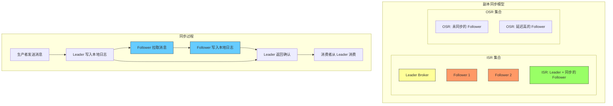

**副本配置：**

```properties
# 副本配置
default.replication.factor=3  # 默认副本数
min.insync.replicas=2        # 最少同步副本数
replica.lag.time.max.ms=30000  # Follower 同步延迟时间阈值
replica.lag.max.requests=10000 # Follower 允许的延迟请求数
unclean.leader.election.enable=false  # 不允许不完整的 Leader 选举

# 选举配置
controller.socket.timeout.ms=30000
controller.rate.limit.window.ms=30000
controller.rate.limit.num=10
leader.imbalance.check.interval.seconds=300
leader.imbalance.per.broker.percentage=10
```

### 生产者确认机制

```java
// 生产者acks配置示例
Properties props = new Properties();

// 1. acks=0 - 无确认（最快但不保证数据不丢失）
props.put("acks", "0");

// 2. acks=1 - Leader确认（默认，性能和可靠性平衡）
props.put("acks", "1");

// 3. acks=all - 所有副本确认（最高可靠性）
props.put("acks", "all");

// 完整的生产者配置示例（高可靠性）
Properties reliableProducerProps = new Properties();
reliableProducerProps.put("bootstrap.servers", "localhost:9092");
reliableProducerProps.put("key.serializer", "org.apache.kafka.common.serialization.StringSerializer");
reliableProducerProps.put("value.serializer", "org.apache.kafka.common.serialization.StringSerializer");

// 可靠性配置
reliableProducerProps.put("acks", "all");                     // 所有副本同步
reliableProducerProps.put("retries", Integer.MAX_VALUE);       // 无限重试
reliableProducerProps.put("max.in.flight.requests.per.connection", 1);  // 顺序保证
reliableProducerProps.put("enable.idempotence", true);        // 启用幂等性
reliableProducerProps.put("request.timeout.ms", 30000);      // 请求超时
reliableProducerProps.put("delivery.timeout.ms", 300000);    // 传递超时
```

**acks 配置对比：**

| 配置 | 可靠性 | 吞吐量 | 适用场景 |
|------|--------|--------|----------|
| `acks=0` | 最低 | 最高 | 允许数据丢失的场景 |
| `acks=1` | 中等 | 高 | 平衡性能和可靠性 |
| `acks=all` | 最高 | 最低 | 要求数据不丢失 |

### 消费者偏移量管理

```java
// 手动偏移量提交
KafkaConsumer<String, String> consumer = new KafkaConsumer<>(props);
consumer.subscribe(Collections.singletonList("user_events"));

while (true) {
    ConsumerRecords<String, String> records = consumer.poll(Duration.ofMillis(100));
    
    // 处理消息
    for (ConsumerRecord<String, String> record : records) {
        try {
            processMessage(record.key(), record.value());
        } catch (Exception e) {
            log.error("处理消息失败", e);
            // 可以选择不提交偏移量，重新消费
            continue;
        }
    }
    
    // 同步提交偏移量（阻塞直到提交成功）
    consumer.commitSync();
    
    // 异步提交偏移量（不阻塞）
    // consumer.commitAsync(new OffsetCommitCallback() {
    //     @Override
    //     public void onComplete(Map<TopicPartition, OffsetAndMetadata> offsets, Exception exception) {
    //         if (exception != null) {
    //             log.error("偏移量提交失败", exception);
    //         }
    //     }
    // });
}
```

**偏移量提交策略：**

```java
// 1. 自动提交（简单但可能有重复消费）
props.put("enable.auto.commit", true);
props.put("auto.commit.interval.ms", "1000");

// 2. 手动同步提交（确保提交成功，但有阻塞风险）
props.put("enable.auto.commit", false);
consumer.commitSync();

// 3. 手动异步提交（高性能，但有丢失少量偏移量的风险）
props.put("enable.auto.commit", false);
consumer.commitAsync(new OffsetCommitCallback() {
    @Override
    public void onComplete(Map<TopicPartition, OffsetAndMetadata> offsets, Exception exception) {
        if (exception != null) {
            log.error("异步提交失败", exception);
            // 可以重试或记录到日志
        }
    }
});

// 4. 精确提交（基于处理结果）
if (processSuccess) {
    consumer.commitSync(Collections.singletonMap(
        new TopicPartition("user_events", partition),
        new OffsetAndMetadata(offset + 1)
    ));
}
```

### Exactly-Once 语义实现

Kafka 通过多种机制支持 Exactly-Once 语义，确保消息不丢失、不重复。

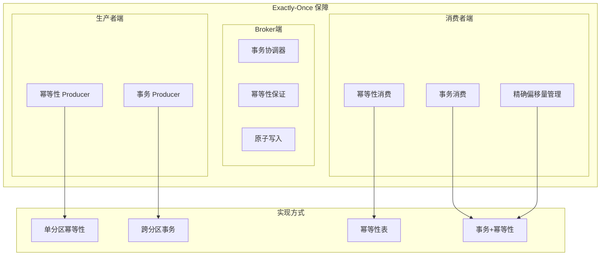

**Exactly-Once 实现方案：**

```java
// 1. 生产者幂等性
Properties idempotentProps = new Properties();
idempotentProps.put("bootstrap.servers", "localhost:9092");
idempotentProps.put("key.serializer", "org.apache.kafka.common.serialization.StringSerializer");
idempotentProps.put("value.serializer", "org.apache.kafka.common.serialization.StringSerializer");
idempotentProps.put("enable.idempotence", true);  // 启用幂等性
idempotentProps.put("acks", "all");
idempotentProps.put("retries", Integer.MAX_VALUE);

KafkaProducer<String, String> idempotentProducer = new KafkaProducer<>(idempotentProps);

// 2. 事务生产者
Properties transactionalProps = new Properties();
transactionalProps.put("bootstrap.servers", "localhost:9092");
transactionalProps.put("key.serializer", "org.apache.kafka.common.serialization.StringSerializer");
transactionalProps.put("value.serializer", "org.apache.kafka.common.serialization.StringSerializer");
transactionalProps.put("transactional.id", "order-transactional-id");

KafkaProducer<String, String> transactionalProducer = new KafkaProducer<>(transactionalProps);
// 初始化事务
transactionalProducer.initTransactions();

// 3. 事务消费者
Properties consumerProps = new Properties();
consumerProps.put("bootstrap.servers", "localhost:9092");
consumerProps.put("group.id", "order-processor-group");
consumerProps.put("key.deserializer", "org.apache.kafka.common.serialization.StringDeserializer");
consumerProps.put("value.deserializer", "org.apache.kafka.common.serialization.StringDeserializer");
consumerProps.put("isolation.level", "read_committed");  // 读取已提交消息

KafkaConsumer<String, String> transactionalConsumer = new KafkaConsumer<>(consumerProps);
```

**事务处理示例：**

```java
try {
    // 开始事务
    transactionalProducer.beginTransaction();
    
    // 发送订单创建消息
    ProducerRecord<String, String> orderRecord = 
        new ProducerRecord<>("orders", "order_123", "{\"id\":\"order_123\",\"amount\":100}");
    transactionalProducer.send(orderRecord);
    
    // 发送库存扣减消息
    ProducerRecord<String, String> inventoryRecord = 
        new ProducerRecord<>("inventory", "product_456", "{\"orderId\":\"order_123\",\"quantity\":1}");
    transactionalProducer.send(inventoryRecord);
    
    // 提交事务（原子性）
    transactionalProducer.commitTransaction();
    
} catch (Exception e) {
    // 回滚事务
    transactionalProducer.abortTransaction();
    log.error("事务执行失败", e);
}
```

### 消息可靠性与性能平衡

```yaml
# 可靠性配置模板
reliability:
  producer:
    acks: all                    # 最高可靠性
    retries: 3                   # 重试次数
    enable_idempotence: true     # 启用幂等性
    delivery_timeout_ms: 300000  # 传递超时
    request_timeout_ms: 30000     # 请求超时
  broker:
    default_replication_factor: 3
    min_insync_replicas: 2
    unclean_leader_election_enable: false
  consumer:
    enable_auto_commit: false     # 手动提交偏移量
    auto_commit_interval_ms: 1000
    isolation_level: read_committed  # 读取已提交消息

# 性能配置模板
performance:
  producer:
    acks: 1                      # 性能与可靠性平衡
    batch_size: 16384            # 批量发送
    linger_ms: 5                 # 批量等待
    compression_type: snappy    # 消息压缩
    max_in_flight_requests_per_connection: 5
  broker:
    num_io_threads: 16          # IO 线程数
    socket_send_buffer_bytes: 102400
    socket_receive_buffer_bytes: 102400
  consumer:
    max_poll_records: 500        # 每次拉取消息数
    fetch_max_bytes: 1048576     # 每次拉取字节数
    fetch_min_bytes: 1           # 最小拉取字节数
    fetch_max_wait_ms: 500       # 最大等待时间
```

:::tip 可靠性配置建议
**不同场景的配置选择：**

**场景1：金融交易系统（最高可靠性）**
- acks=all
- 重试次数=无限
- 事务+幂等性
- min.insync.replicas=3
- 不允许数据丢失

**场景2：实时日志收集（性能优先）**
- acks=1
- 批量发送+压缩
- 自动提交偏移量
- 允许少量数据丢失

**场景3：订单处理（平衡方案）**
- acks=all
- 有限重试
- 手动提交偏移量
- min.insync.replicas=2
:::

---

## ⭐⭐⭐ Kafka 性能优化实战

Kafka 的性能优化涉及生产者、消费者、Broker 配置等多个方面，本章节提供详细的优化策略。

### 生产者性能优化

```java
// 高性能生产者配置
Properties highPerformanceProps = new Properties();
highPerformanceProps.put("bootstrap.servers", "localhost:9092");
highPerformanceProps.put("key.serializer", "org.apache.kafka.common.serialization.StringSerializer");
highPerformanceProps.put("value.serializer", "org.apache.kafka.common.serialization.StringSerializer");

// 核心性能配置
highPerformanceProps.put("acks", "1");                     // Leader确认即可
highPerformanceProps.put("retries", 3);                   // 有限重试
highPerformanceProps.put("batch.size", 32768);           // 增大批量大小
highPerformanceProps.put("linger.ms", 10);               // 适当等待时间
highPerformanceProps.put("buffer.memory", 67108864);      // 增大缓冲区
highPerformanceProps.put("compression.type", "lz4");      // 使用高效压缩
highPerformanceProps.put("max.in.flight.requests.per.connection", 5);  // 并发发送
highPerformanceProps.put("enable.idempotence", false);     // 关闭幂等性

// 分区优化
highPerformanceProps.put("partitioner.class", "com.example.CustomPartitioner");

KafkaProducer<String, String> highPerformanceProducer = new KafkaProducer<>(highPerformanceProps);
```

**生产者性能监控：**

```java
// 生产者监控指标
KafkaProducer<String, String> producer = new KafkaProducer<>(props);

// 监控生产者指标
Map<MetricName, ? extends Metric> metrics = producer.metrics();
metrics.forEach((metricName, metric) -> {
    if (metricName.name().contains("record-send-rate")) {
        System.out.println("发送速率: " + metric.value());
    } else if (metricName.name().contains("record-error-rate")) {
        System.out.println("错误速率: " + metric.value());
    } else if (metricName.name().contains("record-retry-rate")) {
        System.out.println("重试速率: " + metric.value());
    } else if (metricName.name().contains("record-queue-time-avg")) {
        System.out.println("队列时间: " + metric.value());
    }
});
```

### 消费者性能优化

```java
// 高性能消费者配置
Properties highPerformanceConsumerProps = new Properties();
highPerformanceConsumerProps.put("bootstrap.servers", "localhost:9092");
highPerformanceConsumerProps.put("group.id", "high-performance-consumer");
highPerformanceConsumerProps.put("key.deserializer", "org.apache.kafka.common.serialization.StringDeserializer");
highPerformanceConsumerProps.put("value.deserializer", "org.apache.kafka.common.serialization.StringDeserializer");

// 核心性能配置
highPerformanceConsumerProps.put("enable.auto.commit", true);        // 自动提交减少阻塞
highPerformanceConsumerProps.put("auto.commit.interval.ms", "1000"); // 1秒提交间隔
highPerformanceConsumerProps.put("max.poll.records", 1000);          // 增大拉取数量
highPerformanceConsumerProps.put("fetch.max.bytes", 5242880);       // 5MB 拉取大小
highPerformanceConsumerProps.put("fetch.min.bytes", 1);             // 最小拉取大小
highPerformanceConsumerProps.put("fetch.max.wait.ms", 500);         // 最大等待时间
highPerformanceConsumerProps.put("session.timeout.ms", "30000");   // 会话超时
highPerformanceConsumerProps.put("heartbeat.interval.ms", "10000");  // 心跳间隔

// 并行处理配置
highPerformanceConsumerProps.put("max.poll.interval.ms", "300000");   // 最大轮询间隔
```

**消费者并行处理优化：**

```java
// 并行消费者实现
ExecutorService executorService = Executors.newFixedThreadPool(10);
KafkaConsumer<String, String> consumer = new KafkaConsumer<>(props);
consumer.subscribe(Collections.singletonList("user_events"));

while (true) {
    ConsumerRecords<String, String> records = consumer.poll(Duration.ofMillis(100));
    
    // 并行处理消息
    List<Future<?>> futures = new ArrayList<>();
    for (ConsumerRecord<String, String> record : records) {
        Future<?> future = executorService.submit(() -> {
            processMessage(record.key(), record.value());
        });
        futures.add(future);
    }
    
    // 等待所有任务完成
    for (Future<?> future : futures) {
        try {
            future.get();
        } catch (InterruptedException | ExecutionException e) {
            log.error("消息处理失败", e);
        }
    }
    
    // 提交偏移量
    consumer.commitAsync();
}
```

### Broker 性能优化

```yaml
# Broker 性能优化配置 (server.properties)
# JVM 配置
export KAFKA_HEAP_OPTS="-Xms4g -Xmx4g -XX:NewRatio=2 -XX:MetaspaceSize=128m -XX:+UseG1GC"

# 网络配置
num.network.threads=16          # 网络线程数
num.io.threads=32              # IO 线程数
socket.send.buffer.bytes=1048576 # 发送缓冲区
socket.receive.buffer.bytes=1048576 # 接收缓冲区
socket.request.max.bytes=104857600 # 请求最大大小

# 请求处理配置
num.replica.fetchers=4          # 副本获取线程数
replica.fetch.backoff.ms=1000   # 副本获取回退时间
replica.fetch.wait.max.ms=500   # 副本获取最大等待
replica.fetch.min.bytes=1      # 副本获取最小字节数

# 日志配置
log.segment.bytes=1073741824     # 1GB 段大小
log.index.interval.bytes=4096   # 索引间隔
num.partitions=8               # 默认分区数

# 磁盘配置
log.flush.interval.messages=100000  # 刷盘间隔
log.flush.interval.ms=1000        # 刷盘时间间隔
log.flush.scheduler.interval.ms=950  # 刷盘调度间隔
```

**Broker 磁盘优化：**

```properties
# 磁盘配置优化
# 1. 使用 SSD 硬盘
# 2. 分散多个磁盘
log.dirs=/data/kafka-logs-1,/data/kafka-logs-2,/data/kafka-logs-3

# 3. 文件系统优化
# ext4: noatime,nodiratime,barrier=0,data=writeback
# xfs: allocsize=64m,largeio,inode64

# 4. 系统级优化
vm.swappiness=1
vm.dirty_background_ratio=5
vm.dirty_ratio=10
vm.dirty_expire_centisecs=3000
vm.dirty_writeback_centisecs=500
```

### 集群扩容与负载均衡

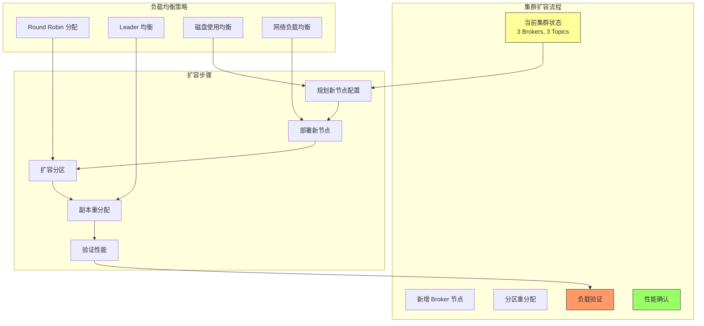

**集群扩容操作：**

```bash
# 1. 查看当前集群状态
kafka-topics.sh --bootstrap-server localhost:9092 --list
kafka-topics.sh --bootstrap-server localhost:9092 --describe

# 2. 扩容 Topic 分区
kafka-topics.sh --bootstrap-server localhost:9092 \
    --alter --topic user_events \
    --partitions 6

# 3. 分区重分配
# 创建重分配计划
cat > increase-replication-factor.json <<EOF
{"version":1,"partitions":[
    {"topic":"user_events","partition":0,"replicas":[0,1,2]},
    {"topic":"user_events","partition":1,"replicas":[1,2,0]},
    {"topic":"user_events","partition":2,"replicas":[2,0,1]}
]}
EOF

# 执行重分配
kafka-reassign-partitions.sh --bootstrap-server localhost:9092 \
    --reassignment-json-file increase-replication-factor.json \
    --execute

# 查看重分配状态
kafka-reassign-partitions.sh --bootstrap-server localhost:9092 \
    --reassignment-json-file increase-replication-factor.json \
    --verify

# 4. 验证集群负载
kafka-topics.sh --bootstrap-server localhost:9092 --describe --under-replicated-partitions
kafka-topics.sh --bootstrap-server localhost:9092 --describe --under-min-isr-partitions
```

### 监控与告警

```java
// Kafka 监控客户端
public class KafkaMonitor {
    
    private final KafkaConsumer<String, String> consumer;
    private final Metrics metrics;
    
    public KafkaMonitor(String bootstrapServers) {
        Properties props = new Properties();
        props.put("bootstrap.servers", bootstrapServers);
        props.put("key.deserializer", "org.apache.kafka.common.serialization.StringDeserializer");
        props.put("value.deserializer", "org.apache.kafka.common.serialization.StringDeserializer");
        props.put("group.id", "kafka-monitor");
        
        consumer = new KafkaConsumer<>(props);
        metrics = new KafkaClient().metrics();
    }
    
    public Map<String, Double> getClusterMetrics() {
        Map<String, Double> result = new HashMap<>();
        
        // Broker 指标
        metrics.forEach((metricName, metric) -> {
            String name = metricName.name();
            if (name.contains("request-latency-avg")) {
                result.put("avg_request_latency", metric.value());
            } else if (name.contains("network-io")) {
                result.put("network_io_rate", metric.value());
            } else if (name.contains("disk-io")) {
                result.put("disk_io_rate", metric.value());
            }
        });
        
        // Topic 指标
        List<String> topics = consumer.listTopics();
        topics.forEach(topic -> {
            Map<MetricName, ? extends Metric> topicMetrics = metrics;
            topicMetrics.forEach((metricName, metric) -> {
                if (metricName.name().contains("topic-" + topic)) {
                    result.put(topic + "_" + metricName.name(), metric.value());
                }
            });
        });
        
        return result;
    }
}
```

**常用监控指标：**

```yaml
# Kafka 监控指标清单
cluster:
  # Broker 指标
  broker_count: 6
  broker_uptime_avg: 30d
  broker_heap_usage: 75%
  disk_usage: 85%
  
  # 网络指标
  network_in_rate: 100MB/s
  network_out_rate: 80MB/s
  request_latency_avg: 2ms
  request_error_rate: 0.1%
  
  # 磁盘指标
  disk_read_rate: 50MB/s
  disk_write_rate: 30MB/s
  disk_usage_by_broker:
    broker1: 82%
    broker2: 78%
    broker3: 85%

topics:
  # Topic 指标
  topic_count: 50
  message_rate_in: 10000/s
  message_rate_out: 9500/s
  message_size_avg: 1KB
  retention_time_avg: 7d
  
  # 消费者指标
  consumer_group_count: 20
  consumer_lag:
    user_events: 0
    order_events: 1000
    payment_events: 500
  consumer_active_count: 15

# 告警阈值
alerts:
  disk_usage_warning: 80%
  disk_usage_critical: 90%
  consumer_lag_warning: 1000
  consumer_lag_critical: 5000
  request_latency_warning: 10ms
  request_latency_critical: 50ms
  error_rate_warning: 1%
  error_rate_critical: 5%
```

:::tip 性能优化检查清单
1. **生产者优化**：
   - 批量发送启用
   - 压缩算法选择
   - 缓冲区大小配置
   - 并发请求数设置

2. **消费者优化**：
   - 拉取批次大小
   - 并行处理线程数
   - 偏移量提交策略
   - 会话超时设置

3. **Broker 优化**：
   - JVM 内存配置
   - 网络和 IO 线程数
   - 磁盘配置
   - 日志段大小

4. **集群优化**：
   - 分区数量合理
   - 副本数配置
   - 负载均衡
   - 监控告警

5. **监控告警**：
   - 关键指标监控
   - 告警阈值设置
   - 自动化扩容
   - 性能基线建立
:::

---

## ⭐⭐ Kafka 与其他消息队列对比

### Kafka vs RocketMQ vs RabbitMQ 详细对比

| 特性维度 | Kafka | RocketMQ | RabbitMQ |
|----------|-------|----------|----------|
| **开发语言** | Scala/Java | Java | Erlang |
| **架构设计** | 分布式流处理平台 | 分布式消息中间件 | 传统消息队列 |
| **吞吐量** | 百万级/秒 | 十万级/秒 | 万级/秒 |
| **延迟** | ms 级 | ms 级 | μs 级 |
| **持久化** | 磁盘顺序写 | 磁盘随机写 | 内存+磁盘 |
| **消息顺序** | 分区内有序 | 严格顺序 | 单队列有序 |
| **消息回溯** | 支持完全回溯 | 支持时间回溯 | 不支持 |
| **事务消息** | 有限支持（幂等性） | 完整支持 | 不支持 |
| **延迟消息** | 不支持 | 支持18个级别 | 死信队列+插件 |
| **顺序消息** | 分区内有序 | 严格顺序 | 单队列有序 |
| **广播消费** | 支持 | 支持 | 支持 |
| **消息堆积** | 磁盘存储，PB级 | 磁盘存储，TB级 | 内存为主 |
| **复杂路由** | 简单主题 | 支持SQL过滤 | 复杂路由规则 |
| **协议支持** | 自定义协议 | 自定义协议 | AMQP, MQTT, STOMP |
| **管理界面** | Kafka Manager, Cruise Control | RocketMQ Console | RabbitMQ Management |
| **高可用** | 分区副本机制 | 主从+副本同步 | 镜像队列 |
| **水平扩展** | 原生支持 | 原生支持 | 集群模式 |

### 性能对比测试

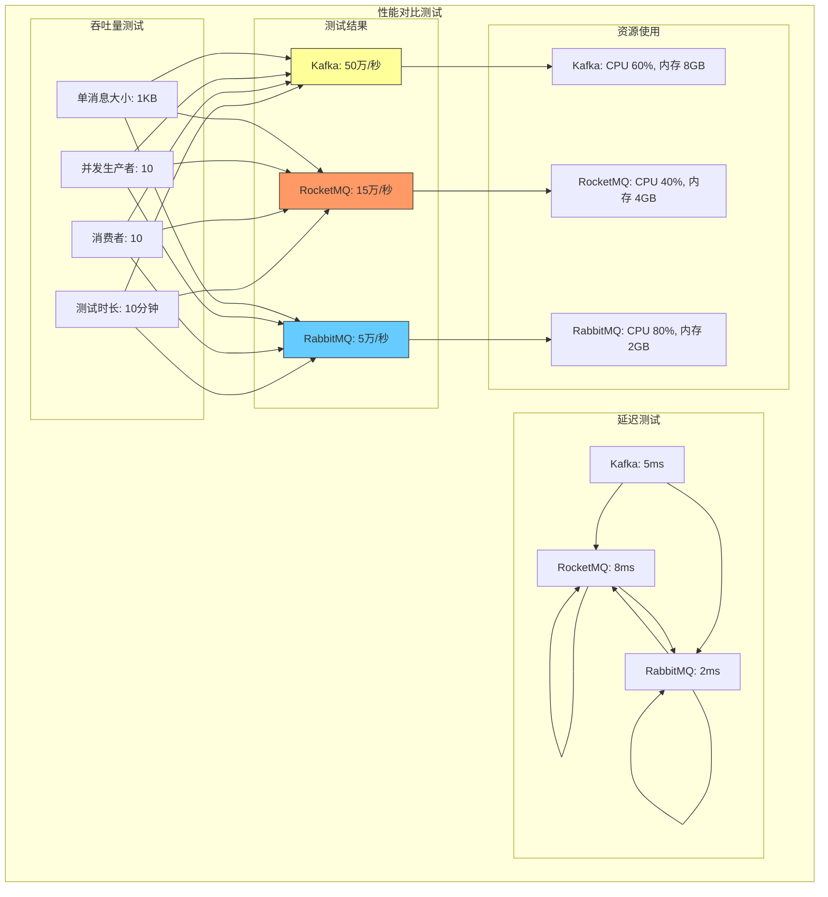

### 选型决策树

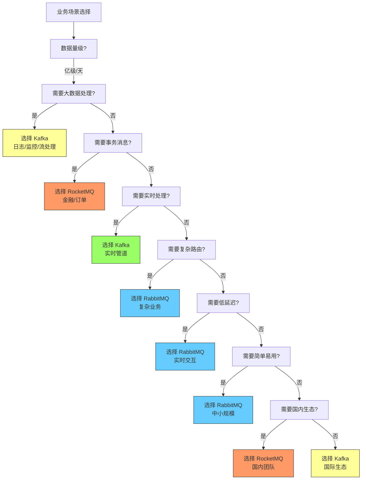

### 典型应用场景对比

#### Kafka 典型场景
```yaml
# 大数据日志收集
elk_stack:
  filebeat:
    output.kafka:
      brokers: ["kafka1:9092", "kafka2:9092"]
      topic: "logs"
      compression: "snappy"
  
# 实时数据管道
data_pipeline:
  source: ["mysql_binlog", "redis_pubsub", "kafka_source"]
  processing: ["flink_streaming", "spark_streaming"]
  sink: ["clickhouse", "elasticsearch", "hdfs"]
  
# 事件驱动架构
event_driven:
  services: ["order_service", "payment_service", "notification_service"]
  events: ["order_created", "payment_completed", "user_registered"]
  communication: "async_kafka"
```

#### RocketMQ 典型场景
```yaml
# 金融交易系统
finance_system:
  requirements: ["高可靠性", "事务一致性", "顺序处理"]
  services: ["trade_service", "risk_control", "settlement_service"]
  features:
    - "事务消息"
    - "顺序消息"
    - "延迟消息"
    - "消息回溯"
  
# 电商订单处理
ecommerce:
  workflows:
    - "订单创建"
    - "库存锁定"
    - "支付处理"
    - "物流通知"
  requirements:
    - "消息不丢失"
    - "顺序执行"
    - "重试机制"
```

#### RabbitMQ 典型场景
```yaml
# 企业应用集成
enterprise_integration:
  patterns: ["消息路由", "内容分发", "工作队列"]
  protocols: ["AMQP", "MQTT", "STOMP"]
  features:
    - "复杂路由规则"
    - "消息确认机制"
    - "死信队列"
    - "优先级队列"
  
# IoT 数据处理
iot_platform:
  devices: ["sensor_nodes", "gateways", "edge_devices"]
  protocols: ["MQTT", "CoAP"]
  features:
    - "低延迟"
    - "连接管理"
    - "消息去重"
    - "QoS 支持"
```

### 迁移指南

#### RabbitMQ → Kafka 迁移
```bash
# 1. 评估迁移影响
# - 消息丢失风险
# - 应用代码改动
# - 运维复杂度增加

# 2. 数据迁移策略
# - 使用 Kafka Connect
# - 或编写自定义迁移工具

# 3. 应用改造
# - 生产者改造
# - 消费者改造
# - 监控告警调整

# 4. 渐进式迁移
# - 双写模式
# - 逐步切换
# - 回滚方案
```

#### Kafka → RocketMQ 迁移
```bash
# 1. 评估迁移原因
# - 事务需求
# - 运维成本
# - 团队熟悉度

# 2. 数据迁移
# - 主题映射
# - 分区映射
# - 副本映射

# 3. 应用适配
# - 生产者配置调整
# - 消费者调整
# - 错误处理优化

# 4. 性能测试
# - 吞吐量验证
# - 延迟测试
# - 资源使用评估
```

### 混合架构方案

```yaml
# 混合架构模式
hybrid_architecture:
  # Kafka 用于大数据场景
  kafka:
    use_cases:
      - "日志收集"
      - "实时数据管道"
      - "流处理引擎"
    topics:
      - "application_logs"
      - "user_events"
      - "metrics_data"
  
  # RocketMQ 用于核心业务
  rocketmq:
    use_cases:
      - "订单处理"
      - "支付交易"
      - "金融风控"
    topics:
      - "order_created"
      - "payment_completed"
      - "risk_alert"
  
  # RabbitMQ 用于企业集成
  rabbitmq:
    use_cases:
      - "企业应用集成"
      - "IoT 数据处理"
      - "消息路由"
    queues:
      - "work_orders"
      - "device_messages"
      - "notifications"
  
  # 互通机制
  interoperability:
    protocols:
      - "Kafka → RocketMQ 桥接"
      - "RocketMQ → Kafka 转发"
      - "RabbitMQ → Kafka 转发"
```

:::tip 选型建议
**选择 Kafka 的场景：**
- 大数据量、高吞吐（>10万/秒）
- 需要数据回溯和历史分析
- 实时流处理管道
- 日志收集和监控

**选择 RocketMQ 的场景：**
- 金融、电商等核心业务
- 需要事务消息保证一致性
- 需要严格的顺序处理
- 国内开发团队熟悉度

**选择 RabbitMQ 的场景：**
- 中小规模业务系统
- 需要复杂消息路由
- 低延迟实时交互
- 异构系统集成

**混合使用策略：**
- Kafka + RocketMQ：大数据 + 核心业务
- Kafka + RabbitMQ：实时处理 + 企业集成
- 三者并存：最复杂场景，需要统一管理
:::

---

## ⭐ Kafka 部署与运维

### Kafka 集群部署方案

```yaml
# 集群部署规划
cluster_deployment:
  # 硬件要求
  hardware:
    broker:
      cpu: "16 cores"
      memory: "32GB"
      disk: "4x1TB SSD RAID10"
      network: "10Gbps"
    
    zookeeper:
      cpu: "8 cores"
      memory: "16GB"
      disk: "2x500GB SSD"
      network: "10Gbps"
  
  # 软件配置
  software:
    kafka: "3.5.0"
    zookeeper: "3.8.0"
    java: "OpenJDK 11"
    os: "CentOS 8"
  
  # 网络规划
  network:
    public_ip: "192.168.1.100-103"
    private_ip: "10.0.1.100-103"
    port:
      kafka: "9092"
      internal: "9093"
      jmx: "9999"
  
  # 存储规划
  storage:
    log_dirs:
      - "/data/kafka-logs-1"
      - "/data/kafka-logs-2"
      - "/data/kafka-logs-3"
    backup: "/backup/kafka-logs"
```

### Docker Compose 部署

```yaml
# docker-compose.yml
version: '3.8'

services:
  zookeeper1:
    image: confluentinc/cp-zookeeper:7.3.0
    environment:
      ZOOKEEPER_CLIENT_PORT: 2181
      ZOOKEEPER_TICK_TIME: 2000
    volumes:
      - zookeeper1-data:/var/lib/zookeeper/data
    ports:
      - "2181:2181"
    networks:
      - kafka-network

  zookeeper2:
    image: confluentinc/cp-zookeeper:7.3.0
    environment:
      ZOOKEEPER_CLIENT_PORT: 2181
      ZOOKEEPER_TICK_TIME: 2000
    volumes:
      - zookeeper2-data:/var/lib/zookeeper/data
    ports:
      - "2182:2181"
    networks:
      - kafka-network

  zookeeper3:
    image: confluentinc/cp-zookeeper:7.3.0
    environment:
      ZOOKEEPER_CLIENT_PORT: 2181
      ZOOKEEPER_TICK_TIME: 2000
    volumes:
      - zookeeper3-data:/var/lib/zookeeper/data
    ports:
      - "2183:2181"
    networks:
      - kafka-network

  kafka1:
    image: confluentinc/cp-kafka:7.3.0
    depends_on:
      - zookeeper1
      - zookeeper2
      - zookeeper3
    environment:
      KAFKA_BROKER_ID: 1
      KAFKA_ZOOKEEPER_CONNECT: "zookeeper1:2181,zookeeper2:2181,zookeeper3:2181"
      KAFKA_LISTENER_SECURITY_PROTOCOL_MAP: PLAINTEXT:PLAINTEXT,EXTERNAL:PLAINTEXT
      KAFKA_ADVERTISED_LISTENERS: PLAINTEXT://kafka1:9092,EXTERNAL://localhost:9092
      KAFKA_OFFSETS_TOPIC_REPLICATION_FACTOR: 3
      KAFKA_GROUP_INITIAL_REBALANCE_DELAY_MS: 0
    volumes:
      - kafka1-data:/var/lib/kafka/data
    ports:
      - "9092:9092"
      - "9999:9999"
    networks:
      - kafka-network

  kafka2:
    image: confluentinc/cp-kafka:7.3.0
    depends_on:
      - zookeeper1
      - zookeeper2
      - zookeeper3
    environment:
      KAFKA_BROKER_ID: 2
      KAFKA_ZOOKEEPER_CONNECT: "zookeeper1:2181,zookeeper2:2181,zookeeper3:2181"
      KAFKA_LISTENER_SECURITY_PROTOCOL_MAP: PLAINTEXT:PLAINTEXT,EXTERNAL:PLAINTEXT
      KAFKA_ADVERTISED_LISTENERS: PLAINTEXT://kafka2:9092,EXTERNAL://localhost:9093
      KAFKA_OFFSETS_TOPIC_REPLICATION_FACTOR: 3
      KAFKA_GROUP_INITIAL_REBALANCE_DELAY_MS: 0
    volumes:
      - kafka2-data:/var/lib/kafka/data
    ports:
      - "9093:9092"
      - "9998:9999"
    networks:
      - kafka-network

  kafka3:
    image: confluentinc/cp-kafka:7.3.0
    depends_on:
      - zookeeper1
      - zookeeper2
      - zookeeper3
    environment:
      KAFKA_BROKER_ID: 3
      KAFKA_ZOOKEEPER_CONNECT: "zookeeper1:2181,zookeeper2:2181,zookeeper3:2181"
      KAFKA_LISTENER_SECURITY_PROTOCOL_MAP: PLAINTEXT:PLAINTEXT,EXTERNAL:PLAINTEXT
      KAFKA_ADVERTISED_LISTENERS: PLAINTEXT://kafka3:9092,EXTERNAL://localhost:9094
      KAFKA_OFFSETS_TOPIC_REPLICATION_FACTOR: 3
      KAFKA_GROUP_INITIAL_REBALANCE_DELAY_MS: 0
    volumes:
      - kafka3-data:/var/lib/kafka/data
    ports:
      - "9094:9092"
      - "9997:9999"
    networks:
      - kafka-network

  kafka-manager:
    image: sheepkiller/kafka-manager:1.3.3.22
    depends_on:
      - kafka1
      - kafka2
      - kafka3
    environment:
      ZK_HOSTS: "zookeeper1:2181,zookeeper2:2181,zookeeper3:2181"
      APPLICATION_SECRET: "letmein"
    ports:
      - "9000:9000"
    networks:
      - kafka-network

volumes:
  zookeeper1-data:
  zookeeper2-data:
  zookeeper3-data:
  kafka1-data:
  kafka2-data:
  kafka3-data:

networks:
  kafka-network:
    driver: bridge
```

### Helm Chart 部署（Kubernetes）

```yaml
# values.yaml
kafka:
  replicas: 3
  config:
    offsets.topic.replication.factor: 3
    transaction.state.log.replication.factor: 3
    transaction.state.log.min.isr: 2
    default.replication.factor: 3
    min.insync.replicas: 2
    num.partitions: 1
    
  resources:
    requests:
      memory: "8Gi"
      cpu: "4"
    limits:
      memory: "16Gi"
      cpu: "8"
  
  storage:
    size: 100Gi
    class: "fast-ssd"
  
  listeners:
    plain: 
      port: 9092
    external:
      port: 9094
      tls: false

zookeeper:
  replicas: 3
  resources:
    requests:
      memory: "4Gi"
      cpu: "2"
    limits:
      memory: "8Gi"
      cpu: "4"
  
  storage:
    size: 50Gi
    class: "fast-ssd"

# deployment.yaml
apiVersion: apps/v1
kind: StatefulSet
metadata:
  name: kafka
spec:
  serviceName: kafka
  replicas: 3
  selector:
    matchLabels:
      app: kafka
  template:
    metadata:
      labels:
        app: kafka
    spec:
      containers:
      - name: kafka
        image: confluentinc/cp-kafka:7.3.0
        ports:
        - containerPort: 9092
        - containerPort: 9093
        env:
        - name: KAFKA_BROKER_ID
          valueFrom:
            fieldRef:
              fieldPath: metadata.name
        - name: KAFKA_ZOOKEEPER_CONNECT
          value: "zookeeper:2181"
        - name: KAFKA_ADVERTISED_LISTENERS
          value: "PLAINTEXT://$(HOSTNAME):9092"
        - name: KAFKA_LISTENER_SECURITY_PROTOCOL_MAP
          value: "PLAINTEXT:PLAINTEXT"
        - name: KAFKA_OFFSETS_TOPIC_REPLICATION_FACTOR
          value: "3"
        - name: KAFKA_GROUP_INITIAL_REBALANCE_DELAY_MS
          value: "0"
        volumeMounts:
        - name: data
          mountPath: /var/lib/kafka/data
  volumeClaimTemplates:
  - metadata:
      name: data
    spec:
      accessModes: [ "ReadWriteOnce" ]
      resources:
        requests:
          storage: 100Gi
```

### 监控与告警配置

```yaml
# Prometheus 监控配置
prometheus_kafka_rules:
  groups:
    - name: kafka_alerts
      rules:
        # Broker 可用性告警
        - alert: KafkaBrokerDown
          expr: up{job="kafka"} == 0
          for: 1m
          labels:
            severity: critical
          annotations:
            summary: "Kafka broker {{ $labels.instance }} is down"
            description: "Kafka broker {{ $labels.instance }} has been down for more than 1 minute"
        
        # 磁盘使用率告警
        - alert: KafkaDiskUsageHigh
          expr: (kafka_log_log_size_bytes / kafka_log_log_capacity_bytes) * 100 > 85
          for: 5m
          labels:
            severity: warning
          annotations:
            summary: "Kafka disk usage on {{ $labels.instance }} is high"
            description: "Kafka disk usage is {{ $value }}% on {{ $labels.instance }}"
        
        # 消费者延迟告警
        - alert: KafkaConsumerLagHigh
          expr: kafka_consumer_lag > 10000
          for: 5m
          labels:
            severity: warning
          annotations:
            summary: "Kafka consumer lag is high for {{ $labels.group }}"
            description: "Kafka consumer lag is {{ $value }} for group {{ $labels.group }}"
        
        # JVM 内存使用率告警
        - alert: KafkaJvmMemoryHigh
          expr: (kafka_jvm_memory_used_bytes / kafka_jvm_memory_max_bytes) * 100 > 85
          for: 5m
          labels:
            severity: warning
          annotations:
            summary: "Kafka JVM memory usage is high"
            description: "JVM memory usage is {{ $value }}%"
        
        # 请求延迟告警
        - alert: KafkaRequestLatencyHigh
          expr: histogram_quantile(0.95, sum(rate(kafka_request_latency_seconds_bucket[5m]))) by (broker) > 1
          for: 5m
          labels:
            severity: warning
          annotations:
            summary: "Kafka request latency is high on {{ $labels.broker }}"
            description: "95th percentile latency is {{ $value }}s on {{ $labels.broker }}"
```

### 运维自动化脚本

```bash
#!/bin/bash
# kafka_cluster_management.sh

KAFKA_HOME="/opt/kafka"
KAFKA_BIN="$KAFKA_HOME/bin"
KAFKA_CONFIG="/etc/kafka"

# 检查集群状态
check_cluster_status() {
    echo "=== 检查 Kafka 集群状态 ==="
    $KAFKA_BIN/kafka-broker-api-versions.sh --bootstrap-server localhost:9092
    echo ""
    
    echo "=== 检查 Topic 列表 ==="
    $KAFKA_BIN/kafka-topics.sh --bootstrap-server localhost:9092 --list
    echo ""
    
    echo "=== 检查消费者组状态 ==="
    $KAFKA_BIN/kafka-consumer-groups.sh --bootstrap-server localhost:9092 --list
}

# 检查 Broker 状态
check_broker_status() {
    echo "=== 检查 Broker 状态 ==="
    for broker in "localhost:9092" "localhost:9093" "localhost:9094"; do
        echo "Broker: $broker"
        $KAFKA_BIN/kafka-broker-api-versions.sh --bootstrap-server $broker
        echo ""
    done
}

# 检查磁盘使用
check_disk_usage() {
    echo "=== 检查磁盘使用情况 ==="
    df -h | grep -E "(kafka|zookeeper)"
    echo ""
    
    echo "=== 检查 Kafka 日志大小 ==="
    find /var/lib/kafka/logs -name "*.log" -exec du -sh {} \;
}

# 清理旧日志
cleanup_old_logs() {
    echo "=== 清理旧日志 ==="
    $KAFKA_BIN/kafka-log-dirs.sh --bootstrap-server localhost:9092 --describe | \
        grep -E "UnderReplicated|Offline" | \
        awk '{print $1}' | \
        xargs -I {} echo "发现异常分区: {}"
    
    # 删除超过30天的日志
    find /var/lib/kafka/logs -name "*.log" -mtime +30 -exec rm -f {} \;
    find /var/lib/kafka/logs -name "*.index" -mtime +30 -exec rm -f {} \;
    
    echo "旧日志清理完成"
}

# 备份配置
backup_config() {
    echo "=== 备份配置文件 ==="
    backup_dir="/backup/kafka-$(date +%Y%m%d-%H%M%S)"
    mkdir -p $backup_dir
    
    cp -r $KAFKA_CONFIG $backup_dir/
    cp -r /etc/zookeeper $backup_dir/
    
    echo "配置已备份到: $backup_dir"
}

# 恢复配置
restore_config() {
    local backup_dir=$1
    if [ -z "$backup_dir" ]; then
        echo "请指定备份目录"
        return 1
    fi
    
    echo "=== 恢复配置文件 ==="
    cp -r $backup_dir/kafka/* $KAFKA_CONFIG/
    cp -r $backup_dir/zookeeper/* /etc/zookeeper/
    
    echo "配置恢复完成，需要重启服务"
}

# 性能测试
performance_test() {
    echo "=== Kafka 性能测试 ==="
    
    # 创建测试 Topic
    $KAFKA_BIN/kafka-topics.sh --bootstrap-server localhost:9092 \
        --create --topic test-performance \
        --partitions 3 --replication-factor 1
    
    # 生产者性能测试
    echo "生产者性能测试:"
    $KAFKA_BIN/kafka-producer-perf-test.sh \
        --topic test-performance \
        --throughput 10000 \
        --record-size 1024 \
        --num-records 100000 \
        --producer-props bootstrap.server=localhost:9092
    
    # 消费者性能测试
    echo "消费者性能测试:"
    $KAFKA_BIN/kafka-consumer-perf-test.sh \
        --topic test-performance \
        --messages 100000 \
        --broker-list localhost:9092
}

# 主菜单
main() {
    echo "Kafka 集群管理工具"
    echo "1. 检查集群状态"
    echo "2. 检查 Broker 状态"
    echo "3. 检查磁盘使用"
    echo "4. 清理旧日志"
    echo "5. 备份配置"
    echo "6. 恢复配置"
    echo "7. 性能测试"
    echo "8. 退出"
    
    read -p "请选择操作 [1-8]: " choice
    
    case $choice in
        1) check_cluster_status ;;
        2) check_broker_status ;;
        3) check_disk_usage ;;
        4) cleanup_old_logs ;;
        5) backup_config ;;
        6) read -p "请输入备份目录: " backup_dir; restore_config $backup_dir ;;
        7) performance_test ;;
        8) exit ;;
        *) echo "无效选择" ;;
    esac
}

# 运行主菜单
main
```

### 故障排除指南

```yaml
# Kafka 常见问题排查
troubleshooting:
  # Broker 启动失败
  broker_startup_failure:
    symptoms:
      - "Broker 无法启动"
      - "ZooKeeper 连接失败"
      - "端口冲突"
    solutions:
      - "检查 ZooKeeper 连接状态"
      - "验证端口是否被占用"
      - "检查日志文件权限"
      - "确认 JVM 内存配置"
  
  # Topic 创建失败
  topic_creation_failure:
    symptoms:
      - "Topic 创建超时"
      - "权限错误"
      - "分区分配失败"
    solutions:
      - "检查 Broker 权限"
      - "确认 Broker 是否可用"
      - "验证分区数和副本数配置"
      - "检查磁盘空间"
  
  # 消费者停滞
  consumer_stagnation:
    symptoms:
      - "消费者不消费消息"
      - "偏移量不更新"
      - "重平衡频繁"
    solutions:
      - "检查消费者组状态"
      - "验证 Topic 是否有消息"
      - "检查网络连接"
      - "调整会话超时设置"
      - "检查消费者代码异常"
  
  # 性能下降
  performance_degradation:
    symptoms:
      - "消息延迟增加"
      - "吞吐量下降"
      - "CPU 使用率升高"
    solutions:
      - "检查磁盘 I/O 性能"
      - "监控 JVM 内存使用"
      - "调整批处理大小"
      - "优化生产者配置"
      - "检查网络带宽"
  
  # 数据丢失
  data_loss:
    symptoms:
      - "消息未到达消费者"
      - "偏移量重置"
      - "副本同步失败"
    solutions:
      - "检查 acks 配置"
      - "验证副本同步状态"
      - "确认 min.insync.replicas 设置"
      - "检查生产者重试配置"
      - "验证消费者提交策略"
```

:::tip 部署运维最佳实践
1. **高可用配置**：
   - 至少 3 个 Broker 节点
   - 副本数 >= 3
   - ZooKeeper 集群（奇数节点）
   - 监控和告警

2. **性能优化**：
   - SSD 硬盘
   - 合理的 JVM 内存配置
   - 网络带宽充足
   - 磁盘 I/O 优化

3. **监控告警**：
   - Broker 状态监控
   - 消费者延迟监控
   - 磁盘使用监控
   - 性能指标监控

4. **备份恢复**：
   - 定期备份配置
   - 灾难恢复预案
   - 数据恢复演练

5. **版本升级**：
   - 制定升级计划
   - 灰度发布策略
   - 回滚方案准备
:::

---

## ⭐ 总结与展望

### Kafka 核心优势总结

1. **高吞吐量**：百万级/秒的处理能力，适合大数据场景
2. **持久化存储**：磁盘顺序写，保证数据不丢失
3. **分布式架构**：水平扩展，支持大规模部署
4. **消息回溯**：支持历史数据重新消费
5. **流处理生态**：与 Flink、Spark Streaming 等完美集成

### 适用场景建议

```yaml
# 适用场景矩阵
use_cases:
  # 明确适合 Kafka 的场景
  strongly_suitable:
    - "大数据日志收集 (ELK Stack)"
    - "实时数据管道"
    - "事件驱动架构"
    - "流处理引擎输入源"
    - "监控指标收集"
  
  # 适合但有挑战的场景
  conditionally_suitable:
    - "订单处理系统" -> "需要事务消息"
    - "实时交互系统" -> "延迟需要优化"
    - "企业系统集成" -> "需要路由复杂度"
  
  # 不适合 Kafka 的场景
  not_suitable:
    - "低延迟实时计算 (<1ms)"
    - "复杂消息路由需求"
    - "小规模简单消息"
    - "强事务要求场景"
```

### 未来发展趋势

1. **云原生适配**：
   - Kubernetes 原生支持
   - Serverless 集成
   - 自动扩缩容

2. **流处理增强**：
   - Kafka Streams 功能增强
   - 与 Flink 深度集成
   - 事件溯源支持

3. **边缘计算**：
   - Kafka Lite
   - 边缘节点支持
   - 离线同步能力

4. **AI/ML 集成**：
   - 模型训练数据管道
   - 实时推理输入
   - 特征工程流水线

### 学习路径建议

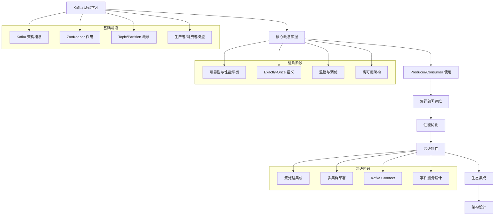

### 实践建议

1. **从小规模开始**：先从单机部署开始，理解基本概念
2. **逐步扩展**：根据业务需求逐步扩展集群规模
3. **监控先行**：建立完善的监控体系，及时发现性能问题
4. **文档记录**：记录架构决策和优化过程，便于后续维护
5. **团队培训**：培养团队对 Kafka 的理解和操作能力

### 与其他技术的集成

```yaml
# 技术集成矩阵
integrations:
  # 大数据生态
  big_data:
    flink:
      use_case: "实时流处理"
      benefit: "高吞吐、低延迟"
      integration: "Kafka Flink Connector"
    
    spark:
      use_case: "批处理 + 流处理"
      benefit: "统一数据处理框架"
      integration: "Kafka Spark Connector"
    
    hadoop:
      use_case: "数据存储分析"
      benefit: "大数据生态兼容"
      integration: "HDFS 集成"
  
  # 搜索引擎
  search:
    elasticsearch:
      use_case: "实时搜索"
      benefit: "快速检索能力"
      integration: "Logstash/ beats + Kafka"
    
    clickhouse:
      use_case: "实时分析"
      benefit: "高性能 OLAP"
      integration: "ClickHouse Kafka Connector"
  
  # 消息队列集成
  messaging:
    rocketmq:
      use_case: "事务消息"
      benefit: "强一致性保证"
      integration: "消息桥接"
    
    rabbitmq:
      use_case: "复杂路由"
      benefit: "灵活消息处理"
      integration: "消息路由网关"
```

### 最后建议

Kafka 是一个强大的分布式消息系统，但不是万能的。选择合适的工具来解决合适的问题才是架构设计的核心。建议在实际项目中：

1. **明确需求**：清楚业务对消息系统的具体要求
2. **技术调研**：对比多种消息队列的优缺点
3. **小范围试点**：在可控范围内进行技术验证
4. **逐步推广**：根据试点结果逐步扩大应用范围
5. **持续优化**：建立监控和优化机制，持续改进

记住：好的架构不是技术堆砌，而是对业务需求的准确理解和优雅的技术实现。

---

*本文档持续更新中，如有问题或建议，欢迎提出反馈。*