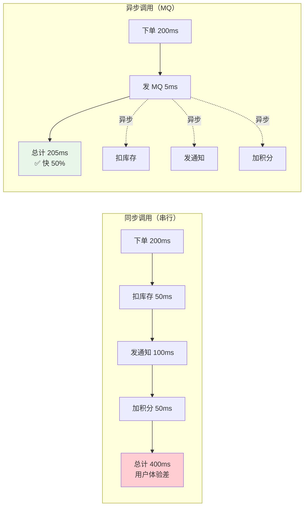
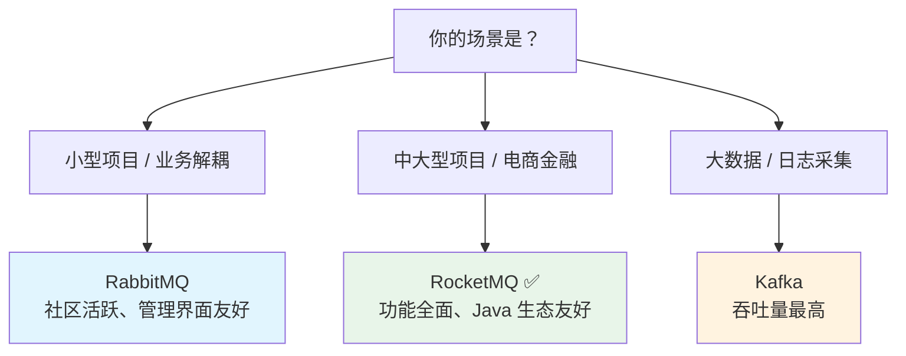
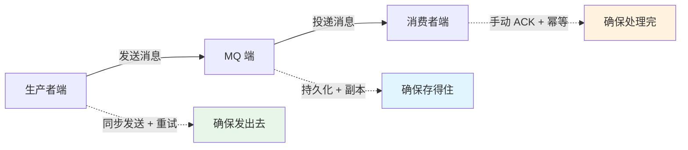
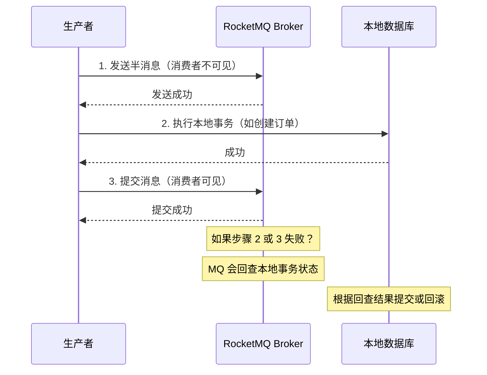
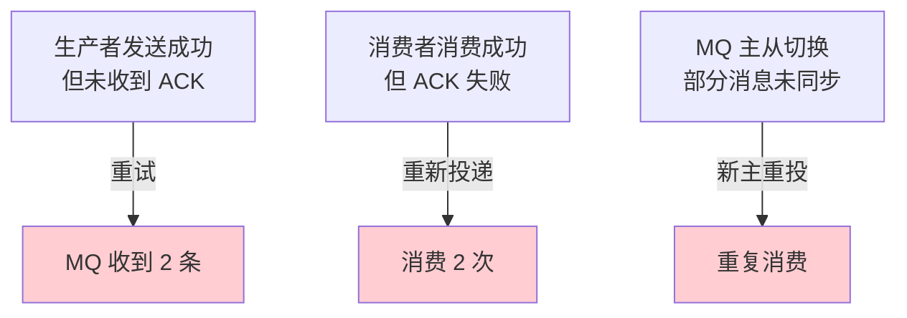
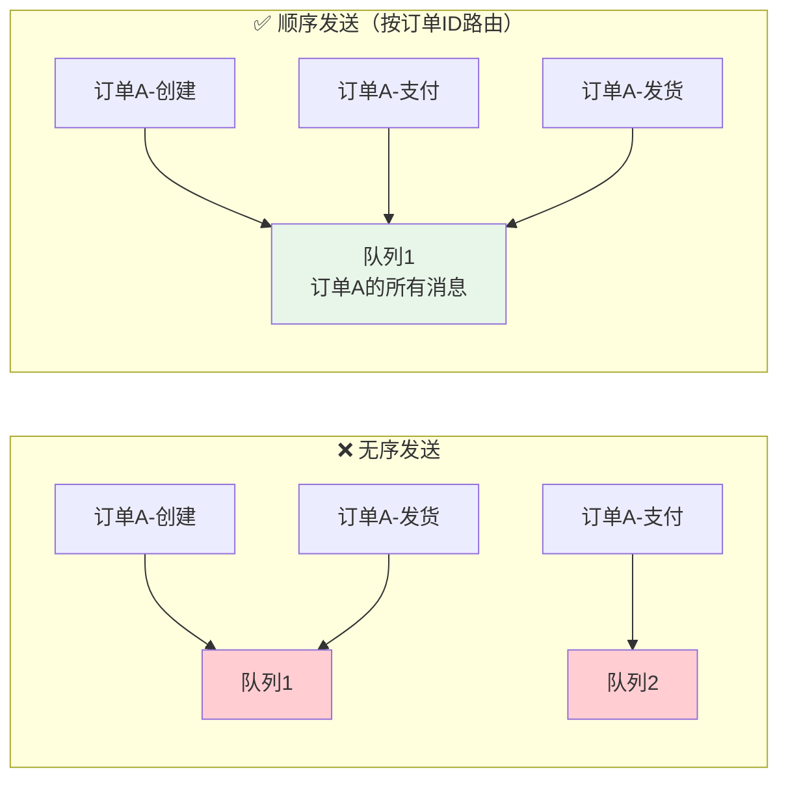
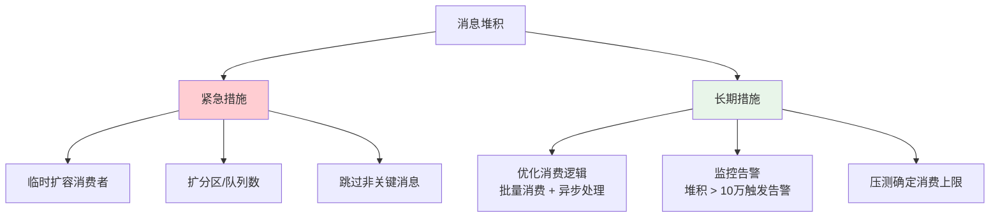

# 消息队列

> 消息队列（MQ）的核心价值就三个字：**解耦、异步、削峰**。但引入 MQ 也引入了复杂性——消息丢失、消息重复、消息顺序、消息堆积。这篇文章从核心概念到实战方案，帮你系统掌握消息队列。

## 基础入门：消息队列是什么？

### 一句话理解 MQ

MQ 就是一个**消息中转站**：生产者把消息放进去，消费者从里面取出来。就像快递柜——你把包裹放进去（生产），快递员取出来（消费），你不需要知道快递员是谁，快递员也不需要认识你，这就是**解耦**。

### 三大核心价值

| 价值 | 说明 | 典型场景 |
|------|------|---------|
| 解耦 | 生产者和消费者不直接调用 | 订单服务发 MQ → 通知/积分/日志服务各自消费 |
| 异步 | 非核心操作异步化 | 下单后发 MQ → 异步发邮件、加积分 |
| 削峰 | 缓冲突发流量 | 秒杀请求入 MQ → 消费者按能力处理 |

**异步带来的性能提升**：



**削峰的场景**：秒杀时 10 万 QPS 打到数据库会直接压垮，但请求先入 MQ，消费者按 5000 QPS 的能力慢慢处理，数据库压力可控。代价是用户需要等待（排队）。

---

## 主流 MQ 对比

### 核心差异

| 特性 | RabbitMQ | RocketMQ | Kafka |
|------|----------|----------|-------|
| 语言 | Erlang | Java | Scala/Java |
| 吞吐量 | 万级 | 十万级 | 百万级 |
| 延迟 | 微秒级 | 毫秒级 | 毫秒级 |
| 消息可靠性 | 高 | 高 | 高 |
| 消息顺序 | 支持 | 支持 | 分区内有序 |
| 事务消息 | 不支持 | ✅ 支持 | 支持 |
| 延迟消息 | 插件支持 | ✅ 原生支持 | 不支持（需改造） |
| 消息回溯 | 不支持 | ✅ 支持 | ✅ 支持（offset） |
| 消息堆积 | 一般 | 优秀 | 优秀 |
| 运维复杂度 | 低 | 中 | 中高 |

### 选型建议



::: tip Java 技术栈建议
优先 **RocketMQ**（功能全面 + Java 生态），大数据场景用 **Kafka**，已有 RabbitMQ 基础设施就继续用。
:::

---

## 消息可靠性

消息可靠性需要**三端保障**：生产者确保消息成功发送、MQ 确保消息不丢失、消费者确保消息成功处理。



### 生产者端：确保消息发送成功

RocketMQ 提供了**事务消息**机制，这是最可靠的发送方式。它通过两阶段提交 + 事务回查来保证本地事务和消息发送的一致性。



```java
// RocketMQ 事务消息
TransactionMQProducer producer = new TransactionMQProducer("tx_group");
producer.setTransactionListener(new TransactionListener() {
    // 执行本地事务
    @Override
    public LocalTransactionState executeLocalTransaction(Message msg, Object arg) {
        try {
            orderService.createOrder(order);
            return LocalTransactionState.COMMIT_MESSAGE;
        } catch (Exception e) {
            return LocalTransactionState.ROLLBACK_MESSAGE;
        }
    }

    // 回查本地事务状态（网络异常时触发）
    @Override
    public LocalTransactionState checkLocalTransaction(MessageExt msg) {
        Order order = orderService.queryByTransactionId(msg.getTransactionId());
        if (order != null) {
            return LocalTransactionState.COMMIT_MESSAGE;
        }
        return LocalTransactionState.ROLLBACK_MESSAGE;
    }
});
```

### MQ 端：确保消息不丢失

| MQ | 可靠性配置 | 说明 |
|----|-----------|------|
| **RocketMQ** | `flushDiskType=SYNC_FLUSH` | 同步刷盘（默认异步） |
| | 同步复制到从节点 | 至少 2 个副本写入成功 |
| **Kafka** | `acks=all` | 所有 ISR 副本写入成功 |
| | `min.insync.replicas=2` | 至少 2 个副本 |
| | `enable.idempotence=true` | 幂等生产者 |
| **RabbitMQ** | 生产者 confirm 模式 | 消息到达 Broker 后回调确认 |
| | exchange + queue + message 持久化 | 三者都持久化 |
| | 集群镜像队列 | 消息复制到多个节点 |

### 消费者端：确保消息处理成功

```java
// 手动 ACK：消费成功才确认
@RocketMQMessageListener(topic = "order_topic", consumerGroup = "order_consumer")
public class OrderConsumer implements RocketMQListener<OrderMessage> {
    @Override
    public RocketMQListener onMessage(OrderMessage message) {
        try {
            orderService.processOrder(message);
            return ConsumeConcurrentlyStatus.CONSUME_SUCCESS;
        } catch (Exception e) {
            return ConsumeConcurrentlyStatus.RECONSUME_LATER;  // 稍后重试
        }
    }
}
```

---

## 消息重复与幂等

### 为什么消息会重复？

MQ 只保证 **At-Least-Once**（至少投递一次），不保证 **Exactly-Once**（恰好一次）。以下场景会导致消息重复投递：



::: warning 核心原则
幂等性是**消费端的责任**，不是 MQ 的责任。无论用什么 MQ，消费端都必须做好幂等。
:::

### 常见幂等方案

| 方案 | 原理 | 优点 | 缺点 |
|------|------|------|------|
| 数据库唯一约束 | 插入消费记录，`UNIQUE KEY` 防重 | 最可靠 | 需要额外表 |
| Redis SETNX | `SETNX msg:lock:{msgId}` | 高性能 | 依赖 Redis 可用性 |
| 乐观锁（状态机） | 消费前检查业务状态，CAS 更新 | 不需要额外存储 | 需要状态字段 |
| 全局唯一 ID | 业务表用消息 ID 做幂等 | 适合新建记录 | 需要唯一 ID 生成器 |

```java
// 方案1：数据库唯一约束
INSERT INTO message_log (msg_id, topic, status) VALUES (?, ?, 'processed');
// UNIQUE KEY uk_msg_id (msg_id) 防止重复插入

// 方案2：Redis SETNX
String lockKey = "msg:lock:" + msgId;
Boolean acquired = redisTemplate.opsForValue()
    .setIfAbsent(lockKey, "1", 24, TimeUnit.HOURS);
if (Boolean.FALSE.equals(acquired)) {
    return;  // 已处理，跳过
}

// 方案3：乐观锁（状态机）
Order order = orderMapper.selectById(orderId);
if (order.getStatus() != OrderStatus.INIT) {
    return;  // 已处理
}
int affected = orderMapper.updateStatus(orderId, OrderStatus.INIT, OrderStatus.PROCESSED);
if (affected == 0) {
    return;  // 状态已变，被其他消费者处理了
}
```

---

## 消息顺序

### 为什么顺序消息重要？

考虑订单状态变更的场景：创建订单 → 支付成功 → 发货 → 确认收货，消费顺序必须是 1 → 2 → 3 → 4。如果先消费到"发货"再消费到"支付成功"，业务状态就会异常。

**顺序消息的前提条件**：
1. 同一业务的消息发送到**同一个分区/队列**
2. 同一个分区/队列只有**一个消费者**



### 实现顺序消息

```java
// RocketMQ：同一订单 ID 的消息发送到同一队列
Message msg = new Message("order_topic", "", orderId.toString(), body.getBytes());
SendResult result = producer.send(msg, (mqs, msg1, arg) -> {
    int index = orderId.hashCode() % mqs.size();
    return mqs.get(index);
}, orderId);

// 消费者：顺序消费（单线程消费一个队列）
@RocketMQMessageListener(
    topic = "order_topic",
    consumerGroup = "order_consumer",
    consumeMode = ConsumeMode.ORDERLY  // 顺序消费
)
public class OrderConsumer implements RocketMQListener<OrderMessage> {
    @Override
    public void onMessage(OrderMessage message) {
        orderService.processOrder(message);
    }
}
```

::: warning 顺序消费的代价
顺序消费 = 单线程消费 = 吞吐量降低。如果需要兼顾顺序和高吞吐，可以按业务维度分区（如按用户 ID 分区），同一用户的消息有序，不同用户的消息并行消费。
:::

---

## 消息堆积

### 原因分析

| 原因 | 说明 |
|------|------|
| 消费速度 < 生产速度 | 消费逻辑太重（调外部接口慢）、消费者数量不够 |
| 消费者宕机 | 进程挂了，消息无人消费 |
| 突发流量 | 大促活动，消息量暴增 |

### 解决方案



::: tip 注意
RocketMQ 一个队列只能被一个消费者消费，所以扩消费者前需要先增加队列数。Kafka 同理，扩消费者前需要先增加分区数。
:::

---

## 延迟消息

### 应用场景

| 场景 | 说明 |
|------|------|
| 订单超时取消 | 下单后 30 分钟未支付 → 自动取消 |
| 预约提醒 | 预约时间前 1 小时 → 发送提醒 |
| 重试机制 | 消费失败后阶梯延迟重试（10s → 30s → 1m → 5m） |

### 实现方案对比

| MQ | 方案 | 说明 |
|----|------|------|
| **RocketMQ** | ✅ 原生支持 | 延迟级别（18 级）或任意延迟时间（5.x） |
| **RabbitMQ** | 死信队列（DLX） | 消息过期 → 进入死信交换机 → 死信队列 → 消费 |
| **Kafka** | ❌ 无原生支持 | 定时任务扫描 / 每个延迟级别一个 Topic |

```java
// RocketMQ：原生延迟消息
Message msg = new Message("order_topic", "timeout_check", body.getBytes());
msg.setDelayTimeLevel(4);  // 30 秒后投递
// 延迟级别：1s 5s 10s 30s 1m 2m 3m 4m 5m 6m 7m 8m 9m 10m 20m 30m 1h 2h
producer.send(msg);

// RocketMQ 5.x：任意延迟时间
msg.setDelayTimeSec(1800);  // 30 分钟
```

---

## 面试高频题

**Q1：如何保证消息不丢失？**

三端保障：1) 生产者用同步发送 + 事务消息 + 重试；2) MQ 配置同步刷盘 + 同步复制；3) 消费者手动 ACK + 幂等消费。RocketMQ 的事务消息 + 同步刷盘 + 同步复制是最可靠的方案。

**Q2：如何保证消息顺序？**

生产者将同一业务 Key 的消息路由到同一分区（RocketMQ 选择队列 / Kafka 选择分区），消费者使用顺序消费模式（单线程消费同一分区）。代价是吞吐量降低。

**Q3：消息积压怎么处理？**

紧急措施：1) 临时扩容消费者；2) 如果分区数不够，先扩分区再扩消费者；3) 非关键消息跳过或降级。长期措施：优化消费逻辑、增加监控告警、做压测确定上限。

**Q4：如何实现延迟消息？**

RocketMQ 原生支持（延迟级别 / 任意延迟时间）。RabbitMQ 用死信队列 + TTL 实现。Kafka 没有原生支持，需要自己实现（定时任务扫描或多 Topic 方案）。

## 延伸阅读

- [Kafka 详解](kafka.md) — Kafka 原理、调优
- [RPC 框架](rpc.md) — gRPC、Dubbo
- [分布式事务](transaction.md) — Seata、TCC、Saga
