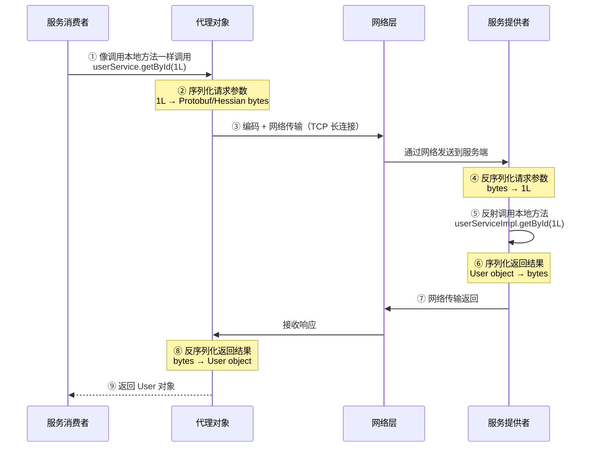
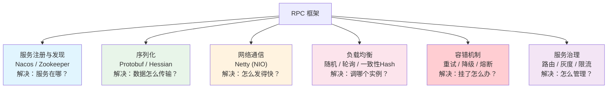
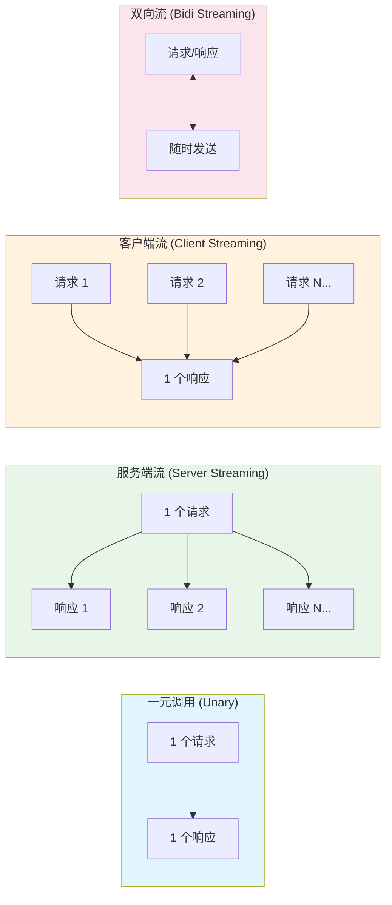
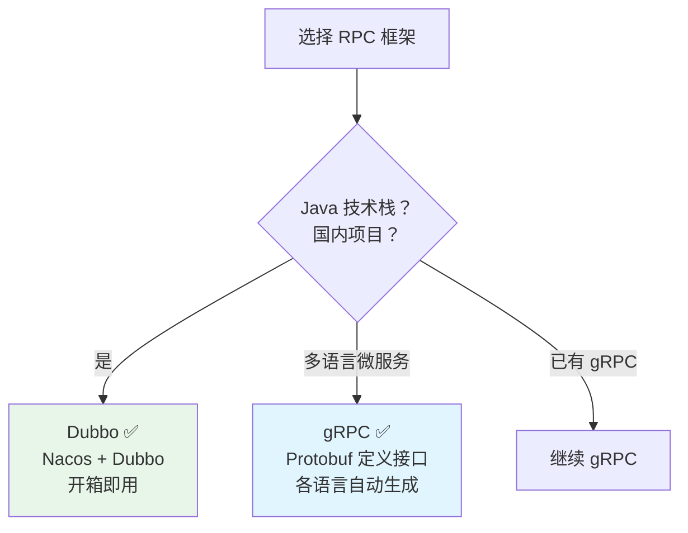

# RPC 框架

> RPC（Remote Procedure Call，远程过程调用）让调用远程服务像调用本地方法一样简单。你不需要关心网络通信、序列化、负载均衡——框架帮你做了。这篇文章从核心原理到主流框架，帮你系统掌握 RPC。

## 基础入门：RPC 是什么？

### 为什么需要 RPC？

在微服务架构中，服务 A 需要调用服务 B 的方法。最直观的方式是发 HTTP 请求，但 HTTP 有性能损耗（JSON 序列化慢、HTTP 头部大）。RPC 框架使用二进制协议和高效序列化，让远程调用像本地方法调用一样简单且高性能。

### RPC vs HTTP REST

| 维度 | HTTP REST | RPC (gRPC/Dubbo) |
|------|-----------|------------------|
| 协议 | HTTP/1.1 | HTTP/2 / 自定义 TCP |
| 序列化 | JSON（可读但慢） | Protobuf/Hessian（快但不可读） |
| 接口定义 | 无（靠文档） | IDL 文件（强类型） |
| 调用方式 | 请求-响应 | 请求-响应 / 流式 / 双向流 |
| 适用场景 | 对外 API | 服务间调用 |

::: tip 选型建议
对外 API（前端、第三方）→ HTTP REST（通用、调试方便）
内部服务间调用 → RPC（性能好、强类型）
不一定二选一，可以 REST + RPC 共存（API 网关对外 REST，内部 RPC）。
:::

---

## RPC 核心原理

### 一次 RPC 调用的完整流程

一次看起来简单的 `userService.getById(1L)` 调用，背后经历了 9 个步骤：



### 核心组件

RPC 框架由 6 个核心组件组成，每个组件解决一个特定的问题：



**1. 服务注册与发现**：服务提供者启动时注册到注册中心，消费者从注册中心获取服务列表。主流注册中心：Nacos、Zookeeper、Consul、Eureka。

**2. 序列化**：将对象转为二进制流以减小体积、提高速度。Protobuf（gRPC 默认，高性能、跨语言）、Hessian（Dubbo 默认，Java 生态）、Kryo、Fastjson。

**3. 网络通信**：底层基于 TCP，使用 Netty（NIO 事件驱动），长连接复用避免频繁建连。

**4. 负载均衡**：随机、轮询、一致性 Hash、最少连接、最短响应时间。

**5. 容错机制**：

| 策略 | 说明 | 适用场景 |
|------|------|---------|
| Failover | 失败重试其他实例 | 读操作（默认） |
| Failfast | 快速失败，抛异常 | 写操作 |
| Failsafe | 忽略异常，返回空 | 日志等非核心操作 |
| Failback | 记录失败，稍后定时重试 | 消息通知 |
| Forking | 并行调用多个实例，第一个成功返回 | 高并发读 |

**6. 服务治理**：路由规则（按参数、标签路由）、灰度发布（部分流量到新版本）、熔断降级（防止雪崩）、限流（保护服务不被打垮）。

---

## Dubbo

### 基本使用

Dubbo 是阿里开源的 Java RPC 框架，与 Spring 生态深度集成，国内使用最广泛。

**接口定义**（API 模块，生产者和消费者共用）：

```java
public interface UserService {
    User getById(Long id);
    void createUser(User user);
}
```

**服务提供者**：

```java
@Service  // Dubbo 的 @Service
public class UserServiceImpl implements UserService {
    @Autowired
    private UserMapper userMapper;

    @Override
    public User getById(Long id) {
        return userMapper.selectById(id);
    }

    @Override
    public void createUser(User user) {
        userMapper.insert(user);
    }
}
```

```yaml
# application.yml
dubbo:
  application:
    name: user-provider
  protocol:
    name: dubbo
    port: 20880
  registry:
    address: nacos://localhost:8848
```

**服务消费者**：

```java
@RestController
public class OrderController {

    @DubboReference  // 引用远程服务
    private UserService userService;

    @GetMapping("/order/{id}")
    public Order getOrder(@PathVariable Long id) {
        Order order = orderService.getById(id);
        User user = userService.getById(order.getUserId());  // 像本地调用一样
        order.setUser(user);
        return order;
    }
}
```

### Dubbo 3.x 新特性

| 特性 | Dubbo 2.x | Dubbo 3.x | 说明 |
|------|-----------|-----------|------|
| 协议 | Dubbo 协议 | Triple 协议（基于 gRPC） | 同时支持 RPC 和 REST，更好的跨语言 |
| 服务发现 | 接口级注册 | **应用级注册** | 一个应用一个服务实例，减少注册中心压力 |
| 流式调用 | 不支持 | ✅ 支持 | 一元、服务端流、客户端流、双向流 |
| 路由规则 | 条件路由 | 条件 + 标签 + 脚本路由 | 更灵活的流量管理 |

### Dubbo 负载均衡策略

| 策略 | 原理 | 适用场景 |
|------|------|---------|
| **RandomLoadBalance**（默认） | 加权随机，权重越大被选中概率越高 | 通用 |
| RoundRobinLoadBalance | 加权轮询，平滑轮询避免连续打到同一实例 | 需要均匀分配 |
| LeastActiveLoadBalance | 选择当前活跃调用数最少的实例 | 性能不均的服务器 |
| ConsistentHashLoadBalance | 相同参数的请求打到同一实例 | 有状态的服务（如缓存） |
| ShortestResponseLoadBalance | 选择响应时间最短的实例 | 3.x 新增 |

---

## gRPC

### 基本使用

gRPC 是 Google 开源的高性能跨语言 RPC 框架，使用 Protobuf 定义接口，基于 HTTP/2 传输。

**接口定义**（.proto 文件）：

```protobuf
syntax = "proto3";

package com.example.user;

option java_multiple_files = true;
option java_package = "com.example.user.grpc";

// 定义服务
service UserService {
  rpc GetUser (GetUserRequest) returns (UserResponse);
  rpc CreateUser (CreateUserRequest) returns (UserResponse);
  rpc ListUsers (ListUsersRequest) returns (stream UserResponse);  // 服务端流
}

// 定义消息
message GetUserRequest {
  int64 id = 1;
}

message UserResponse {
  int64 id = 1;
  string name = 2;
  string email = 3;
}

message CreateUserRequest {
  string name = 1;
  string email = 2;
}

message ListUsersRequest {
  int32 page_size = 1;
  string page_token = 2;
}
```

**服务端实现**：

```java
@GrpcService
public class UserGrpcService extends UserServiceGrpc.UserServiceImplBase {

    @Autowired
    private UserMapper userMapper;

    @Override
    public void getUser(GetUserRequest request, StreamObserver<UserResponse> responseObserver) {
        User user = userMapper.selectById(request.getId());
        UserResponse response = UserResponse.newBuilder()
            .setId(user.getId())
            .setName(user.getName())
            .setEmail(user.getEmail())
            .build();
        responseObserver.onNext(response);
        responseObserver.onCompleted();
    }
}
```

**客户端调用**：

```java
@Service
public class OrderService {

    @Autowired
    private UserServiceGrpc.UserServiceBlockingStub userStub;

    public OrderDTO getOrder(Long orderId) {
        Order order = orderMapper.selectById(orderId);
        // 像调用本地方法一样调用远程服务
        UserResponse userResponse = userStub.getUser(
            GetUserRequest.newBuilder().setId(order.getUserId()).build()
        );
        return OrderDTO.builder()
            .orderId(order.getId())
            .userName(userResponse.getName())
            .userEmail(userResponse.getEmail())
            .build();
    }
}
```

### gRPC 四种调用模式



| 模式 | 说明 | 典型场景 |
|------|------|---------|
| 一元调用 | 一个请求 → 一个响应 | 普通方法调用 |
| 服务端流 | 一个请求 → 多个响应（流式返回） | 导出大数据、实时推送 |
| 客户端流 | 多个请求 → 一个响应 | 批量上传、日志上报 |
| 双向流 | 双方都可以随时发送消息 | 聊天应用、实时协同 |

---

## Dubbo vs gRPC

| 维度 | Dubbo | gRPC |
|------|-------|------|
| 序列化 | Hessian2 / Protobuf | Protobuf |
| 协议 | Dubbo 协议 / Triple | HTTP/2 |
| 服务发现 | Nacos / Zookeeper | 自带 / 集成注册中心 |
| 生态 | Java 生态为主 | 跨语言（多语言 SDK） |
| 流式调用 | 3.x Triple 支持 | ✅ 原生支持 |
| 学习曲线 | Java 开发者友好 | 需要学习 Protobuf |
| 社区 | 阿里维护，国内活跃 | Google 维护，国际活跃 |



---

## 面试高频题

**Q1：RPC 和 HTTP 的区别？**

本质都是网络通信。区别在于：RPC 通常基于 TCP + 二进制协议，序列化效率高、传输体积小、性能好，适合内部服务间调用。HTTP 基于 HTTP/1.1 + JSON（或 HTTP/2），通用性强、调试方便，适合对外 API。gRPC 是基于 HTTP/2 的 RPC 框架，结合了两者的优势。

**Q2：RPC 如何实现服务发现？**

服务启动时将地址注册到注册中心（Nacos/Zookeeper），消费者从注册中心订阅服务列表并缓存在本地。注册中心变更时通知消费者更新。调用时从本地缓存中选择一个实例（负载均衡），如果该实例不可用则尝试下一个（容错）。

**Q3：RPC 调用失败了怎么办？**

容错策略：1) Failover（重试其他实例，适合读操作）；2) Failfast（快速失败，适合写操作）；3) Failsafe（忽略异常，适合日志等非核心操作）；4) Failback（记录失败稍后重试）；5) Forking（并行调用多个实例，第一个成功就返回）。配合熔断降级（Sentinel/Hystrix），保护下游服务不被拖垮。

## 延伸阅读

- [消息队列](mq.md) — RocketMQ/Kafka
- [分布式事务](transaction.md) — Seata、TCC、Saga
- [Spring Cloud](../spring/cloud.md) — 微服务框架
