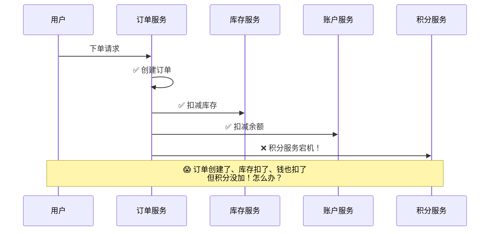
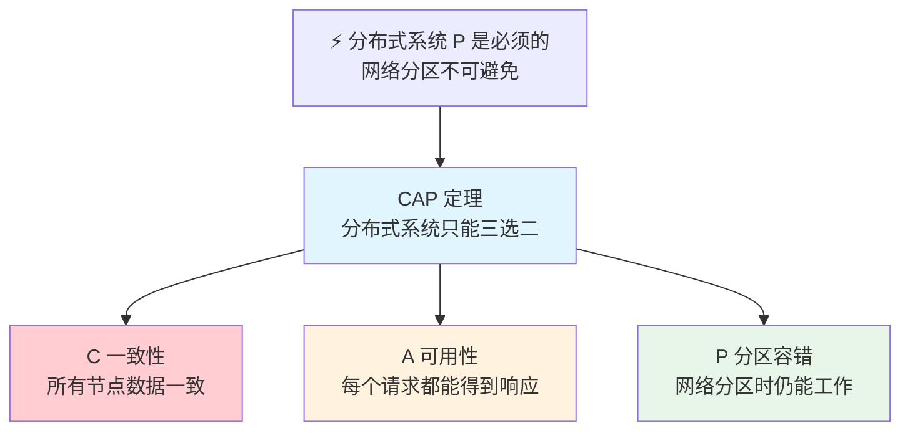
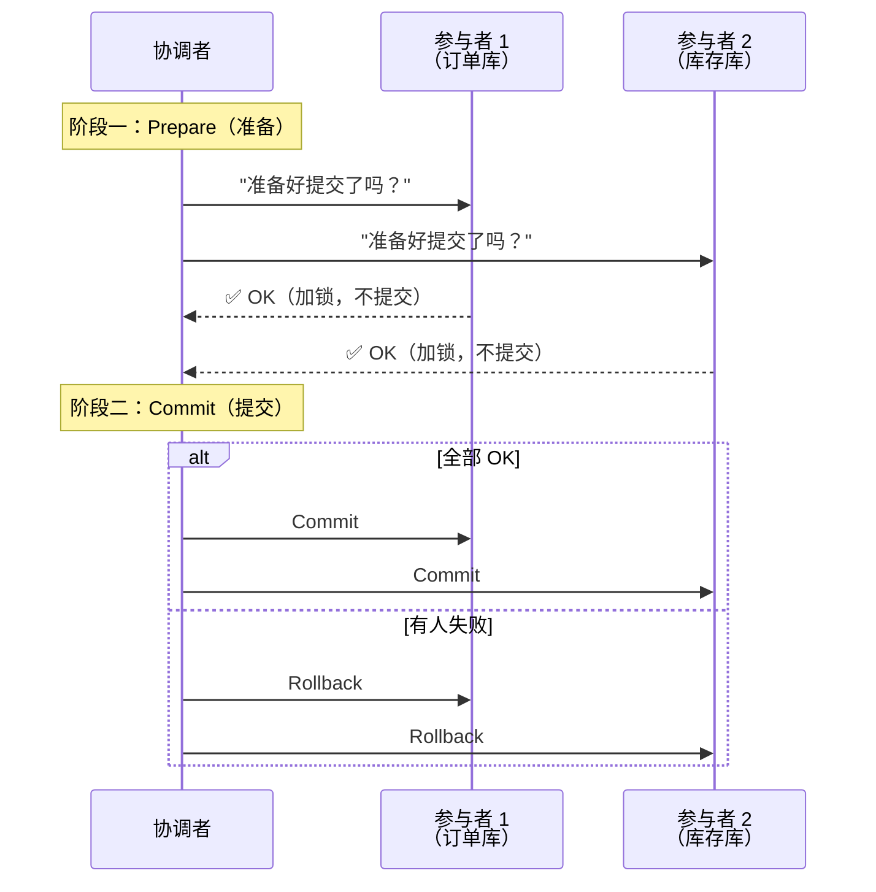
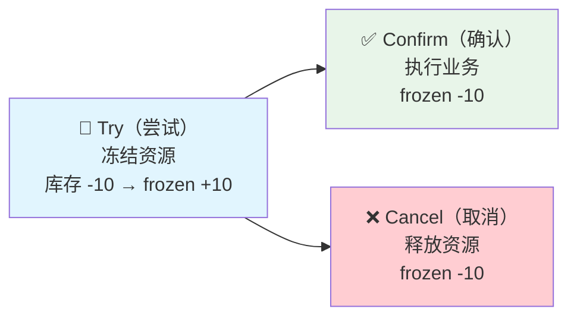
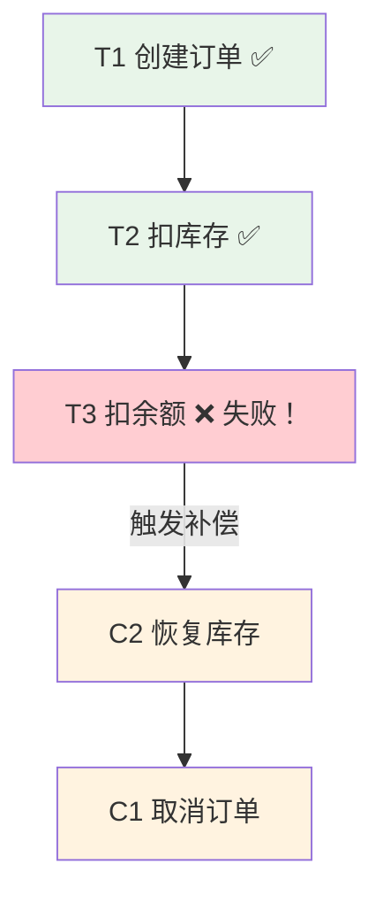
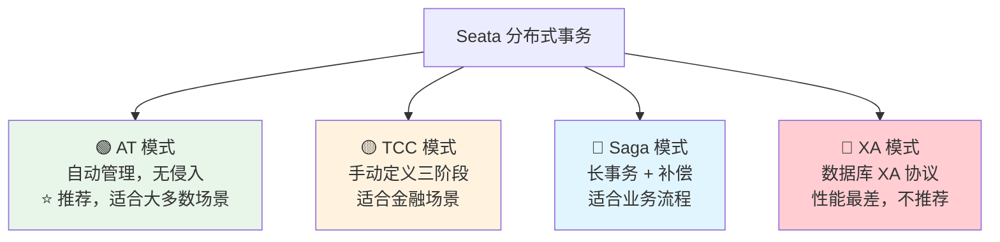
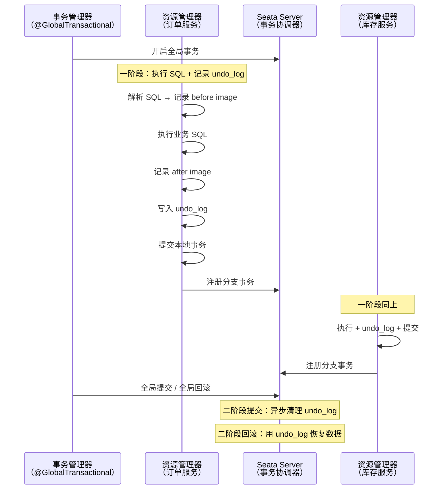
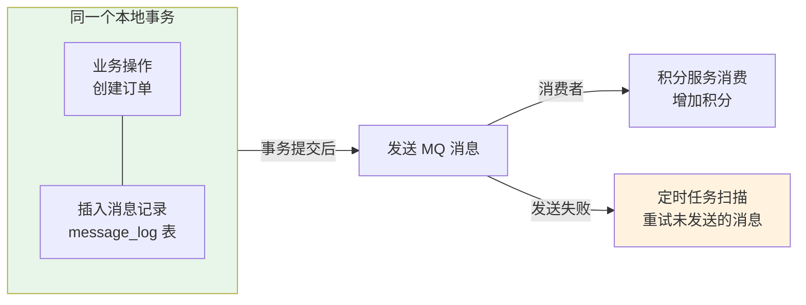
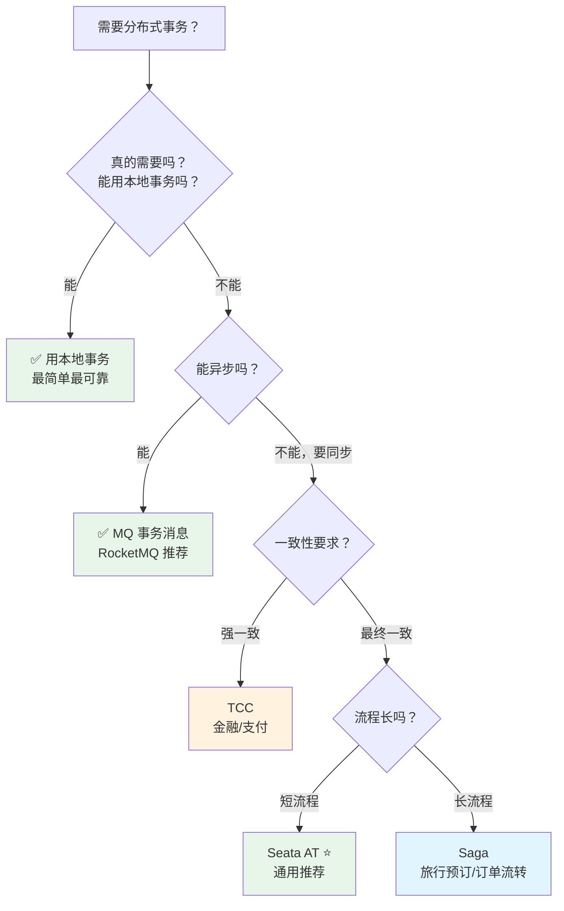

# 分布式事务

> 想象一下：你在线上买了一件商品，点了"下单"按钮。系统要做四件事——创建订单、扣库存、扣余额、加积分。如果前三步都成功了，加积分却失败了，怎么办？你的钱扣了，库存也少了，但积分没到账——你一定会投诉。这就是分布式事务要解决的核心问题：**跨服务、跨数据库，如何保证"要么全做，要么全不做"？**

## 问题从何而来？

### 一个下单请求的困境



单体应用中，一个 `@Transactional` 就能搞定所有操作。但微服务拆分后，订单、库存、账户、积分各在各的数据库里——**本地事务管不了跨库的事**。

### CAP 定理：鱼和熊掌不可兼得



::: tip 一句话理解 CAP
CP = 要一致性不要可用性（挂了也要等一致），AP = 要可用性不要一致性（先响应再说，数据以后再同步）。
:::

**BASE 理论**是对 AP 路线的实践指导：

| 原则 | 含义 | 通俗理解 |
|------|------|---------|
| Basically Available | 基本可用 | 允许偶尔慢一点、少一点 |
| Soft State | 软状态 | 允许数据有中间状态 |
| Eventually Consistent | 最终一致性 | 给点时间，数据总会一致 |

---

## 2PC（两阶段提交）— 最古老的方案

2PC（Two-Phase Commit）是分布式事务的鼻祖，由一个**事务协调者**指挥多个**事务参与者**完成提交或回滚。



::: danger 2PC 的三大问题
1. **同步阻塞**：Prepare 阶段所有参与者都加锁等待，其他事务被阻塞——性能杀手
2. **单点故障**：协调者挂了，参与者不知道该提交还是回滚，一直锁着资源
3. **数据不一致**：网络分区可能导致部分提交、部分回滚

**结论**：了解原理即可，**新项目不要用 2PC**。
:::

---

## TCC（Try-Confirm-Cancel）— 业务层面的两阶段提交

TCC 的核心思想是：**把锁从数据库层面移到业务层面**。不直接扣库存，而是先"冻结"库存——确认了再扣，取消了就解冻。

### 三个阶段



**以扣库存为例**：

| 阶段 | 操作 | 库存变化 | frozen_stock 变化 |
|------|------|---------|-------------------|
| Try | 检查库存 + 冻结 | 不变 | +10 |
| Confirm | 实际扣减 | -10 | -10 |
| Cancel | 解冻 | 不变 | -10 |

### 代码实现

```java
// TCC 接口定义
public interface InventoryTccService {

    @TwoPhaseBusinessAction(
        name = "deductStock",
        commitMethod = "confirm",
        rollbackMethod = "cancel"
    )
    boolean tryDeductStock(
        @BusinessActionContextParameter(paramName = "productId") Long productId,
        @BusinessActionContextParameter(paramName = "quantity") Integer quantity
    );

    boolean confirm(BusinessActionContext context);
    boolean cancel(BusinessActionContext context);
}

// TCC 实现
@Service
public class InventoryTccServiceImpl implements InventoryTccService {

    @Override
    @Transactional
    public boolean tryDeductStock(Long productId, Integer quantity) {
        Inventory inventory = inventoryMapper.selectById(productId);
        if (inventory.getStock() - inventory.getFrozenStock() < quantity) {
            throw new RuntimeException("库存不足");
        }
        return inventoryMapper.freezeStock(productId, quantity) > 0;
    }

    @Override
    @Transactional
    public boolean confirm(BusinessActionContext context) {
        Long productId = (Long) context.getActionContext("productId");
        Integer quantity = (Integer) context.getActionContext("quantity");
        inventoryMapper.confirmDeduct(productId, quantity);
        return true;
    }

    @Override
    @Transactional
    public boolean cancel(BusinessActionContext context) {
        Long productId = (Long) context.getActionContext("productId");
        Integer quantity = (Integer) context.getActionContext("quantity");
        inventoryMapper.unfreezeStock(productId, quantity);
        return true;
    }
}
```

### TCC 的"坑"与解法

::: warning 空回滚——Try 没跑，Cancel 却被调了
Try 阶段网络超时，协调者以为失败了，触发 Cancel。但 Cancel 执行时发现 Try 根本没执行过。
**解法**：Cancel 中先检查是否执行过 Try（用事务日志表记录状态），没有执行过就跳过。
:::

::: warning 悬挂——Cancel 比 Try 先到
Try 因网络延迟还在路上，Cancel 却先到达并执行了。等 Try 到达时，发现已经 Cancel 了，该怎么办？
**解法**：Cancel 中记录已回滚状态，Try 执行时发现已回滚则拒绝执行。
:::

::: tip 幂等性——Confirm/Cancel 可能被重复调用
网络抖动、重试机制都可能导致 Confirm 或 Cancel 被调用多次。每个方法都要检查执行状态，已执行则直接返回成功。
:::

---

## Saga 模式— 长流程的救星

Saga 的思路和 TCC 不同：**不做资源预留，直接执行，失败了再补偿**。就像网购退货——东西先寄给你，不满意再退货退款。



### Saga vs TCC 对比

| 维度 | TCC | Saga |
|------|-----|------|
| 思路 | 先冻结 → 确认/取消 | 直接执行 → 失败再补偿 |
| 一致性 | 较强（资源一直锁定） | 最终一致（中间状态可见） |
| 业务侵入 | 高（三个方法 + 冻结字段） | 中（正常业务 + 补偿方法） |
| 资源占用 | 长时间锁定 | 不锁定 |
| 适用场景 | 金融、支付（强一致性） | 长流程（旅行预订、订单流转） |

::: tip Saga 的两种编排方式
1. **编排式（Orchestration）**：由 Saga 协调器按顺序调用各服务，失败时协调器调用补偿——推荐，流程清晰
2. **协同式（Choreography）**：各服务自行监听事件、执行下一步、发补偿事件——松耦合但流程难追踪
:::

---

## Seata — 阿里开源的分布式事务框架

Seata 是目前 Java 生态中最流行的分布式事务解决方案，提供了 4 种模式，覆盖不同场景。

### 四种模式一览



### AT 模式——最常用，对业务零侵入

AT（Automatic Transaction）模式是 Seata 的杀手锏：**你只需要加一个注解 `@GlobalTransactional`，Seata 自动帮你管理分布式事务**。它是怎么做到的？



**使用方式极其简单**：

```java
@Service
public class OrderService {

    @GlobalTransactional(name = "create-order", rollbackFor = Exception.class)
    public void createOrder(OrderDTO orderDTO) {
        // 1. 创建订单（本地事务）
        orderMapper.insert(order);

        // 2. 扣减库存（远程调用，库存服务也有 @GlobalTransactional）
        inventoryClient.deductStock(orderDTO.getProductId(), orderDTO.getQuantity());

        // 3. 扣减余额（远程调用）
        accountClient.deductBalance(orderDTO.getUserId(), orderDTO.getAmount());

        // 任何一步失败 → Seata 自动回滚所有步骤 ✅
    }
}
```

::: warning AT 模式的代价
1. 每个 SQL 都记录 undo_log，undo_log 表需要**定期清理**
2. 全局锁可能导致**写冲突等待**（两个全局事务修改同一行时）
3. 需要数据库有**主键**
4. 不支持跨库 JOIN 和嵌套 SQL
:::

---

## 基于消息的最终一致性

不是所有分布式事务都需要同步解决。很多时候，**异步 + 最终一致性**是更好的选择——性能好、系统解耦。

### 本地消息表方案



核心思路：**业务操作和消息记录在同一个本地事务中**——要么都成功，要么都失败。事务提交后再发 MQ，发送失败有定时任务兜底。

```java
@Service
public class OrderService {

    @Transactional
    public void createOrder(OrderDTO orderDTO) {
        // 1. 创建订单
        orderMapper.insert(order);

        // 2. 同一事务中插入消息记录（保证原子性）
        MessageLog msgLog = new MessageLog();
        msgLog.setBizId(order.getId().toString());
        msgLog.setTopic("order-created");
        msgLog.setStatus(MessageStatus.PENDING);
        messageLogMapper.insert(msgLog);
    }

    // 事务提交后才发送 MQ（Spring 事件机制）
    @TransactionalEventListener(phase = TransactionPhase.AFTER_COMMIT)
    public void sendOrderMessage(OrderCreatedEvent event) {
        rocketMQTemplate.convertAndSend("order-created", event.getOrder());
    }
}
```

---

## 方案选型指南



| 方案 | 一致性 | 性能 | 复杂度 | 侵入性 | 一句话 |
|------|--------|------|--------|--------|--------|
| 2PC/XA | 强一致 | ❌ 低 | 低 | 低 | 别用 |
| TCC | 强一致 | 中 | ❌ 高 | ❌ 高 | 金融场景专用 |
| Saga | 最终一致 | 高 | 中 | 中 | 长流程救星 |
| **Seata AT** | 最终一致 | 中 | **低** | **低** | ⭐ 通用首选 |
| MQ 事务消息 | 最终一致 | ✅ 高 | 低 | 低 | 异步场景首选 |
| 本地消息表 | 最终一致 | 高 | 中 | 中 | 简单可靠 |

---

## 面试高频题

**Q1：分布式事务有哪些方案？**

2PC/XA（强一致但性能差，别用）、TCC（业务层面预留+确认+取消，适合金融）、Saga（直接执行+补偿，适合长流程）、Seata AT（自动管理，加个注解就行）、MQ 事务消息（异步最终一致，性能最好）。**实际推荐 Seata AT 或 MQ 事务消息。**

**Q2：Seata AT 模式的原理？**

一阶段：解析 SQL → 记录 before/after image → 执行 SQL → 保存 undo_log → 提交本地事务 → 向 TC 注册分支。二阶段提交：异步清理 undo_log。二阶段回滚：用 undo_log 的 before image 恢复数据。通过全局锁保证隔离性。

**Q3：TCC 的空回滚和悬挂怎么解决？**

空回滚：Cancel 中检查事务日志表，Try 没执行过就跳过。悬挂：Cancel 中标记已回滚，Try 执行时发现已回滚则拒绝执行。核心都是靠事务日志表记录状态。

## 延伸阅读

- [消息队列](mq.md) — RocketMQ/Kafka
- [Kafka 详解](kafka.md) — Kafka 原理、调优
- [RPC 框架](rpc.md) — gRPC、Dubbo
