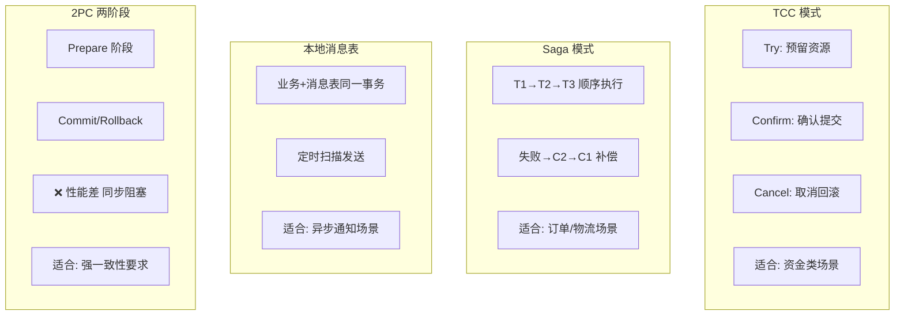

# 分布式事务

> 单体应用中，一个 `@Transactional` 就能保证事务。但微服务中，一个业务操作可能涉及多个服务的数据库操作——本地事务管不了。这篇文章讲清楚分布式事务的核心问题和主流解决方案。

## 基础入门：什么是分布式事务？

### 为什么本地事务不够用？

```java
// 单体应用：一个 @Transactional 搞定
@Transactional
public void createOrder(Order order) {
    orderDao.insert(order);        // 数据库 A
    inventoryDao.deduct(order);    // 数据库 A（同一个库，同一个事务）

// 微服务：跨服务、跨数据库
public void createOrder(Order order) {
    orderService.create(order);     // 服务 A，数据库 A
    inventoryService.deduct(order); // 服务 B，数据库 B
    // 如果 inventoryService.deduct() 失败了？
    // orderService.create() 已经提交了，无法回滚！
}
```

### 核心问题

```
CAP 定理：一致性(C)、可用性(A)、分区容错(P) 最多满足两个
分布式系统必须满足 P → 只能在 C 和 A 之间选择

BASE 理论：Basically Available（基本可用）
           Soft State（软状态）
           Eventually Consistent（最终一致性）
→ 大多数分布式事务选择最终一致性
```

---


## 为什么本地事务不够用？

```java
// 单体应用：一个事务搞定
@Transactional
public void createOrder(Order order) {
    orderDao.insert(order);           // 库1
    inventoryDao.deduct(order);       // 库1（同一个数据库，同一个事务）
}

// 微服务：跨服务，跨数据库
public void createOrder(Order order) {
    orderService.create(order);        // 服务A，数据库A
    inventoryService.deduct(order);    // 服务B，数据库B
    // 如果 inventoryService.deduct() 失败了？
    // orderService.create() 已经提交了，无法回滚！
}
```

## 四种解决方案



### 2PC（两阶段提交）

```
阶段1：Prepare（准备）—— 协调者问所有参与者"能提交吗？"
阶段2：Commit/Rollback（提交/回滚）—— 所有参与者说"能"才提交

问题：
- 同步阻塞：参与者一直锁住资源直到第二阶段
- 单点故障：协调者挂了就卡死
- 性能差：不适合高并发场景
```

### TCC（Try-Confirm-Cancel）

```
三个阶段：
Try：预留资源（冻结库存，不真正扣减）
Confirm：确认提交（真正扣减库存）
Cancel：取消（释放冻结的库存）

// 示例：转账
Try：A 扣 100（冻结），B 加 100（冻结）
Confirm：A 确认扣，B 确认加
Cancel：A 恢复，B 恢复

优点：性能好，不锁资源
缺点：每个业务都要写 Try/Confirm/Cancel 三个方法，侵入性强
```

### Saga

```
将长事务拆成一系列本地短事务
每个本地事务有对应的补偿操作

T1 → T2 → T3 → T4
如果 T3 失败：
  → 执行 C2（T2 的补偿）
  → 执行 C1（T1 的补偿）

优点：不需要锁资源，适合长事务
缺点：补偿操作可能失败（需要人工介入），最终一致性
```

### 本地消息表（最可靠）

```
1. 业务数据和消息在同一个本地事务中写入
   BEGIN;
   INSERT INTO order (...)
   INSERT INTO message (topic, payload, status='PENDING')
   COMMIT;

2. 定时任务扫描 PENDING 消息，发送到 MQ
   发送成功 → 更新 status='SENT'
   发送失败 → 重试

3. 消费者消费消息
   消费成功 → ACK
   消费失败 → 重试（MQ 自带重试）

优点：最可靠，不依赖第三方组件
缺点：需要额外建消息表，有轮询开销
```

## 选型建议

| 方案 | 一致性 | 性能 | 侵入性 | 推荐场景 |
|------|--------|------|--------|----------|
| 2PC | 强一致 | 差 | 低 | 几乎不用 |
| TCC | 最终一致 | 好 | 高 | 金融级场景 |
| Saga | 最终一致 | 好 | 中 | 长事务流程 |
| 本地消息表 | 最终一致 | 好 | 中 | 大多数场景 |
| Seata AT | 最终一致 | 好 | 低 | 推荐（自动补偿） |

::: tip 能不用分布式事务就不用
分布式事务是最后的手段。优先考虑：1) 本地事务（把相关操作放在同一个服务、同一个数据库中）；2) 最终一致性（MQ + 补偿机制）；3) 业务容错（幂等设计 + 重试）。
:::

## 面试高频题

**Q1：Seata AT 模式的原理？**

AT（Automatic Transaction）模式：一阶段提交本地事务，同时记录 undo log（回滚日志）。二阶段：如果所有分支都成功，异步删除 undo log。如果有分支失败，根据 undo log 回滚。Seata 的 AT 模式对业务代码零侵入——只需要加一个 `@GlobalTransactional` 注解。

## 延伸阅读

- 上一篇：[RPC框架](rpc.md) — gRPC、Dubbo
- [MySQL](../database/mysql.md) — 事务隔离级别、MVCC
- [消息队列](mq.md) — 最终一致性方案
