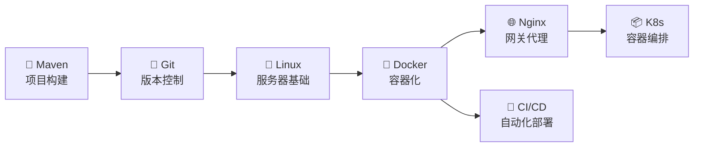

# 🛠️ 工程化

> 从代码构建到线上部署，Java 全栈工程师的效率工具箱

## 📚 内容导航

| 工具 | 说明 | 核心内容 |
|------|------|---------|
| 🔧 [Maven](./maven.md) | 项目构建与依赖管理 | POM 配置、生命周期、私服搭建、依赖冲突 |
| 🔀 [Git](./git.md) | 版本控制 | 分支策略、合并技巧、冲突解决、Git Flow |
| 🐧 [Linux](./linux.md) | 服务器运维 | 常用命令、文件管理、进程排查、网络调试 |
| 🌐 [Nginx](./nginx.md) | 反向代理与负载均衡 | 配置语法、反向代理、负载均衡、HTTPS |
| 🐳 [Docker & K8s](./docker.md) | 容器化与编排 | 镜像构建、Compose、Kubernetes 集群 |
| 🚀 [CI/CD](./cicd.md) | 持续集成与部署 | Jenkins、GitHub Actions、自动化流水线 |

## 🗺️ 学习路线

## 💡 学习建议

::: tip 建议顺序
Maven → Git → Linux → Docker → Nginx → CI/CD
:::

::: details 为什么这样排序？
1. **Maven** 是每天都要用的构建工具，优先掌握
2. **Git** 是团队协作基础，必须熟练
3. **Linux** 是服务器操作系统的基本功
4. **Docker** 让环境标准化，理解容器思想
5. **Nginx** 是线上部署的标配网关
6. **CI/CD** 是工程化闭环的最后一步
:::
