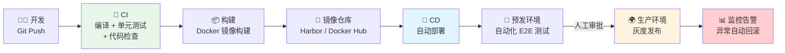
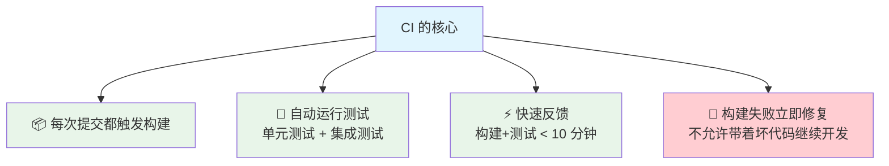
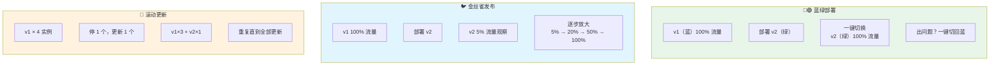
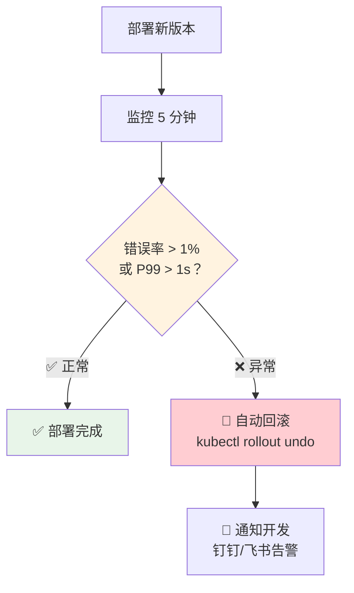

# CI/CD

> CI/CD 是从"代码提交"到"用户可用"的自动化流水线。CI（Continuous Integration，持续集成）确保每次提交都能自动构建和测试；CD（Continuous Deployment，持续部署/持续交付）确保通过测试的代码能自动部署到生产环境。目标是：**提交代码后，一切自动化完成，人只需要审批**。

## CI/CD 全景



::: tip CI/CD vs CD
两个 CD 的区别：
- **Continuous Delivery（持续交付）**：代码到预发环境自动完成，**生产环境需要人工点击部署**
- **Continuous Deployment（持续部署）**：代码到生产环境全自动，**不需要人工干预**

大多数团队用持续交付（安全可控），少数成熟团队用持续部署（需要极强的自动化测试覆盖）。
:::

---

## CI 阶段——持续集成

### CI 的核心原则



### Maven 构建优化

```bash
# 快速构建（跳过测试）
mvn clean package -DskipTests

# 只运行单元测试
mvn test

# 并行构建（加速 CI）
mvn clean package -T 4  # 4 个线程并行编译

# 只编译变更的模块（多模块项目）
mvn clean package -pl affected-module -am
```

::: info 代码质量检查
CI 中通常会集成以下工具：
- **SonarQube**：代码质量门禁（圈复杂度、重复率、覆盖率）
- **Checkstyle**：Java 代码风格检查
- **SpotBugs**：静态 Bug 检测
- **Dependency-Check**：依赖漏洞扫描（CVE）
:::

---

## CD 阶段——持续部署

### 部署策略对比



| 策略 | 优点 | 缺点 | 适用场景 |
|------|------|------|---------|
| **滚动更新** | 简单，资源利用率高 | 回滚慢，新旧版本共存期间行为不确定 | 大多数场景（K8s 默认） |
| **蓝绿部署** | 秒级切换，回滚快 | 需要双倍资源 | 关键服务、大版本升级 |
| **金丝雀发布** | 风险最小，逐步放量 | 发布慢，需要流量控制 | 核心业务、重大变更 |

::: tip 生产环境推荐
- **K8s 原生**：滚动更新（简单够用）
- **关键服务**：金丝雀发布（如 Istio 灰度）
- **大版本升级**：蓝绿部署（如数据库迁移 + 应用升级）
- 最小化风险的方式：**金丝雀 + 自动化监控 + 自动回滚**
:::

---

## GitHub Actions 实战

GitHub Actions 是目前最流行的 CI/CD 工具（对 GitHub 项目免费），比 Jenkins 配置更简单。

### Java 项目 CI/CD 完整配置

```yaml
# .github/workflows/ci-cd.yml
name: CI/CD Pipeline

on:
  push:
    branches: [main, develop]
  pull_request:
    branches: [main]

env:
  DOCKER_REGISTRY: registry.example.com
  IMAGE_NAME: myapp

jobs:
  # Job 1: CI - 构建和测试
  build-and-test:
    runs-on: ubuntu-latest

    steps:
    - name: 📥 Checkout 代码
      uses: actions/checkout@v4

    - name: ☕ 设置 JDK 17
      uses: actions/setup-java@v4
      with:
        java-version: '17'
        distribution: 'temurin'
        cache: maven

    - name: 🧪 运行测试
      run: mvn clean test

    - name: 📦 打包
      run: mvn clean package -DskipTests

    - name: 📤 上传构建产物
      uses: actions/upload-artifact@v4
      with:
        name: jar-file
        path: target/*.jar

  # Job 2: 构建镜像并推送
  docker-build:
    needs: build-and-test
    runs-on: ubuntu-latest
    if: github.ref == 'refs/heads/main'

    steps:
    - name: 📥 Checkout 代码
      uses: actions/checkout@v4

    - name: 📥 下载构建产物
      uses: actions/download-artifact@v4
      with:
        name: jar-file
        path: target/

    - name: 🔐 登录镜像仓库
      uses: docker/login-action@v3
      with:
        registry: ${{ env.DOCKER_REGISTRY }}
        username: ${{ secrets.DOCKER_USERNAME }}
        password: ${{ secrets.DOCKER_PASSWORD }}

    - name: 📦 构建并推送镜像
      uses: docker/build-push-action@v5
      with:
        context: .
        push: true
        tags: |
          ${{ env.DOCKER_REGISTRY }}/${{ env.IMAGE_NAME }}:${{ github.sha }}
          ${{ env.DOCKER_REGISTRY }}/${{ env.IMAGE_NAME }}:latest

  # Job 3: 部署到预发环境
  deploy-staging:
    needs: docker-build
    runs-on: ubuntu-latest
    environment: staging

    steps:
    - name: 🚀 部署到预发环境
      run: |
        kubectl set image deployment/myapp \
          myapp=${{ env.DOCKER_REGISTRY }}/${{ env.IMAGE_NAME }}:${{ github.sha }} \
          --namespace=staging
        kubectl rollout status deployment/myapp --namespace=staging --timeout=300s

    - name: 🧪 E2E 测试
      run: |
        curl -f https://staging.example.com/actuator/health || exit 1

  # Job 4: 部署到生产环境（需手动审批）
  deploy-production:
    needs: deploy-staging
    runs-on: ubuntu-latest
    environment: production  # 在 GitHub 设置中配置审批

    steps:
    - name: 🚀 部署到生产环境
      run: |
        kubectl set image deployment/myapp \
          myapp=${{ env.DOCKER_REGISTRY }}/${{ env.IMAGE_NAME }}:${{ github.sha }} \
          --namespace=production
        kubectl rollout status deployment/myapp --namespace=production --timeout=300s
```

### GitHub Actions 核心概念

| 概念 | 说明 |
|------|------|
| **Workflow** | 一个自动化流程，定义在 `.github/workflows/` 下 |
| **Event** | 触发条件（push、PR、定时、手动） |
| **Job** | 一个 Workflow 中的任务单元，可并行或串行 |
| **Step** | Job 中的单个步骤，可以是命令或 Action |
| **Action** | 可复用的操作单元（社区有大量现成 Action） |
| **Runner** | 执行 Job 的服务器（GitHub 提供或自建） |
| **Secret** | 加密的环境变量（密码、Token 等） |

---

## Jenkins vs GitHub Actions

| 维度 | Jenkins | GitHub Actions |
|------|---------|---------------|
| 部署方式 | 自建服务器 | GitHub 托管 |
| 配置方式 | Jenkinsfile（Groovy） | YAML |
| 插件生态 | 1800+ 插件 | 16000+ Actions |
| 学习曲线 | 较高 | 较低 |
| 维护成本 | 高（服务器、插件更新） | 低（免维护） |
| 私有部署 | ✅ 完全私有 | ❌ 需要自建 Runner |
| 免费额度 | 自建无限制 | 公开仓库无限，私有仓库 2000 分钟/月 |
| 适用场景 | 企业级、代码不在 GitHub | GitHub 项目、快速上手 |

::: tip 选型建议
- **个人项目 / 小团队 + GitHub**：GitHub Actions（免费、简单、开箱即用）
- **企业级 / 代码不在 GitHub / 需要完全私有**：Jenkins 或 GitLab CI
- **云原生团队**：GitLab CI（代码和 CI 在同一个平台）
:::

---

## 自动回滚

部署到生产环境后，如果发现异常，需要能快速回滚。

### K8s 回滚

```bash
# 查看部署历史
kubectl rollout history deployment/myapp

# 回滚到上一版本
kubectl rollout undo deployment/myapp

# 回滚到指定版本
kubectl rollout undo deployment/myapp --to-revision=2

# 查看回滚状态
kubectl rollout status deployment/myapp
```

### 基于监控的自动回滚



::: warning 自动回滚的前提
1. **完善的监控**：必须有错误率、响应时间、CPU/内存等监控指标
2. **明确的阈值**：错误率 > 1% 或 P99 > 1s 就回滚
3. **快速检测**：新版本上线后 5-10 分钟内就要判断是否正常
4. **金丝雀发布**：先放量 5% 观察，异常只影响 5% 用户
5. **日志可追溯**：回滚后能快速定位问题
:::

---

## 面试高频题

**Q1：CI 和 CD 的区别？**

CI（持续集成）是开发阶段的实践：每次提交自动构建和测试，确保代码质量。CD（持续部署/交付）是部署阶段的实践：将通过测试的代码自动部署到生产环境。CI 关注"代码能不能合"，CD 关注"代码能不能上"。

**Q2：蓝绿部署和金丝雀发布有什么区别？**

蓝绿部署维护两套完全相同的环境（蓝和绿），部署新版本到空闲环境，验证后一键切换流量。优点是秒级切换和回滚，缺点是需要双倍资源。金丝雀发布是在生产环境中逐步放量（如 5% → 20% → 50% → 100%），优点是风险最小，缺点是发布周期长。

**Q3：GitHub Actions 和 Jenkins 怎么选？**

GitHub 项目推荐 GitHub Actions（免费、配置简单、与 GitHub 深度集成）。企业级项目或代码不在 GitHub 上用 Jenkins 或 GitLab CI。Jenkins 插件生态最丰富但维护成本高，GitHub Actions 适合快速上手。

**Q4：如何实现零停机部署？**

滚动更新：K8s Deployment 逐步替换旧 Pod，新 Pod 通过就绪探针后才接收流量，旧 Pod 在新 Pod 就绪后才被终止。关键配置：`readinessProbe` + `minReadySeconds` + `maxUnavailable: 0`。

## 延伸阅读

- [Docker & K8s](docker.md) — 容器化部署
- [Nginx](nginx.md) — 反向代理、负载均衡
- [Linux 常用命令](linux.md) — 服务器日常操作
