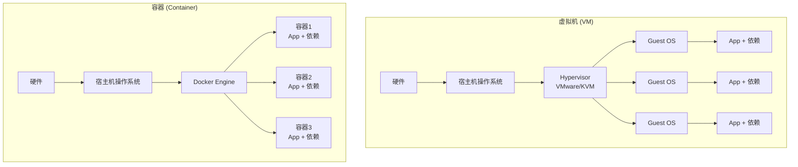
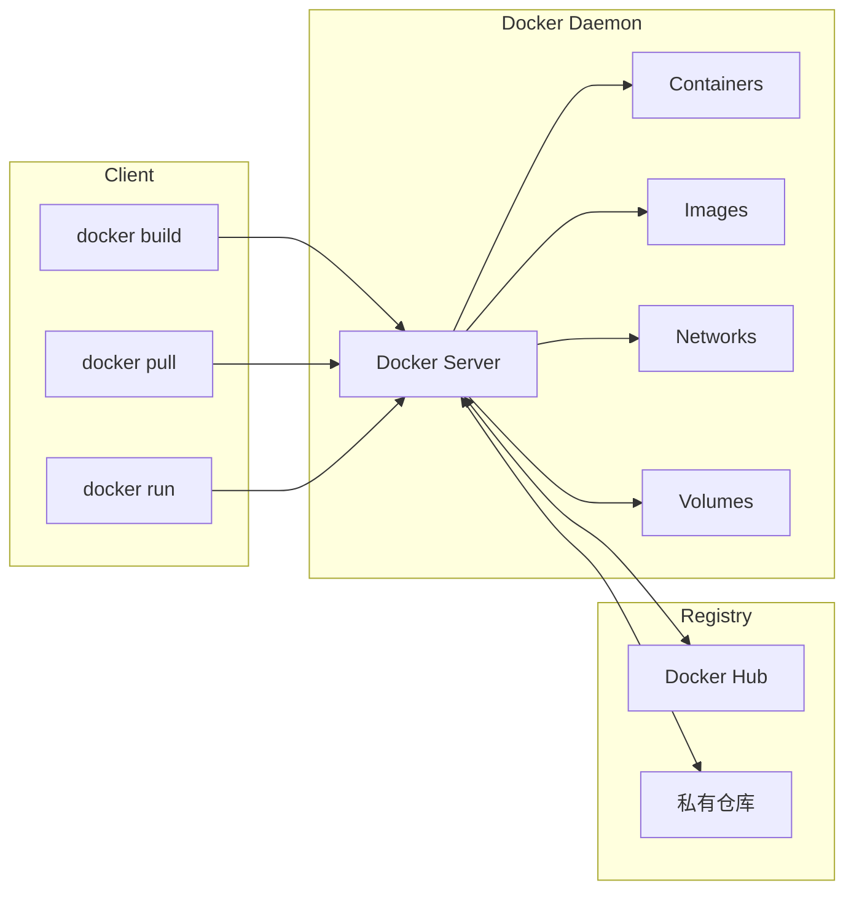
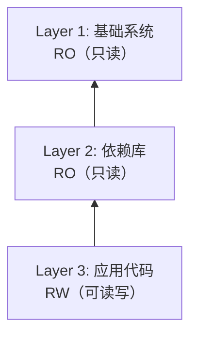
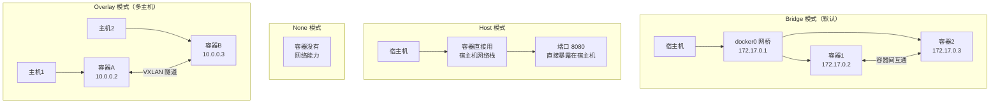
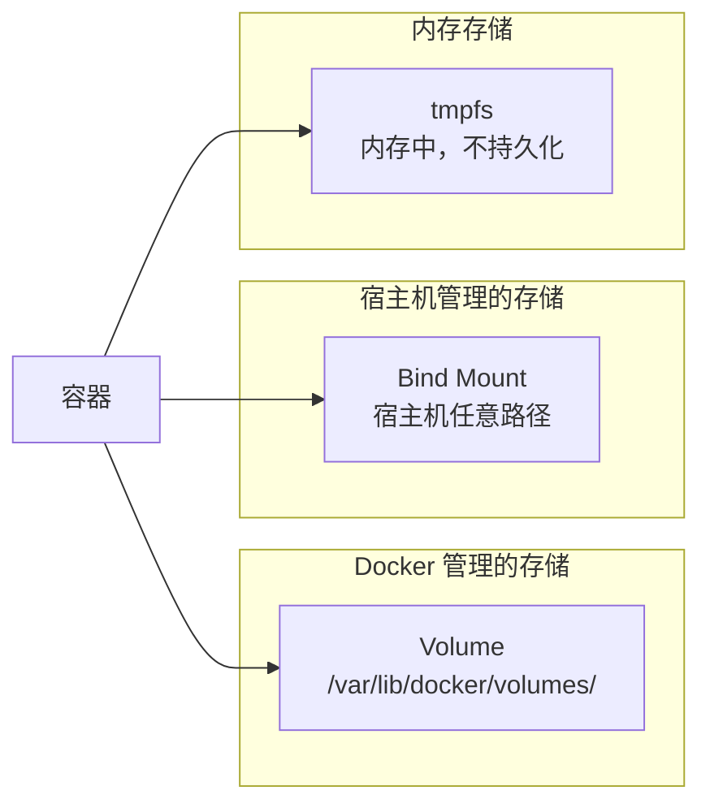
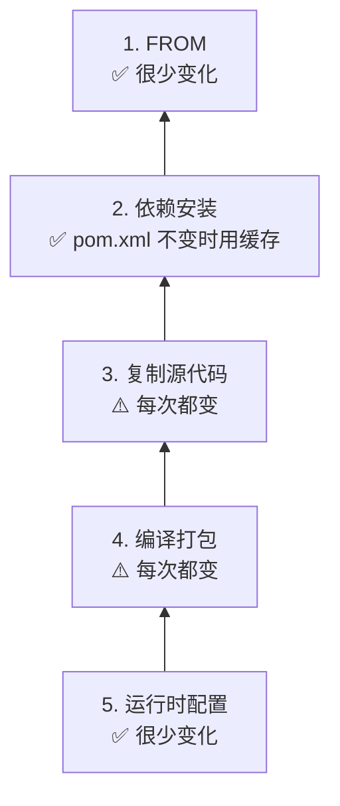
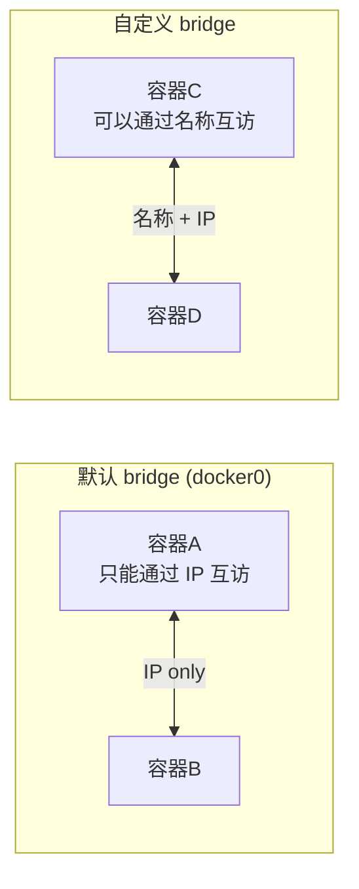
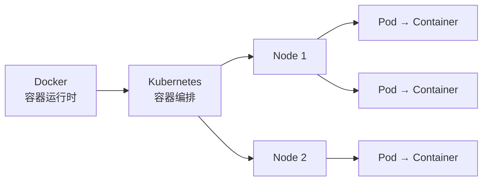

# Docker 容器化技术

> Docker 解决的是那个经典的 "在我电脑上能跑啊" 的问题。环境不一致、依赖冲突、部署困难——Docker 通过容器化让这一切标准化。这篇文章聚焦 Java 后端开发中最常用的 Docker 知识，从入门到实战，涵盖 Dockerfile 编写、Java 应用容器化、Docker Compose 编排、镜像优化等核心内容。

## 一、基础入门

### 1.1 Docker 是什么？解决了什么问题？

::: tip 一句话理解 Docker
Docker 就是一个把「应用 + 运行环境」打包成标准单元的工具，这个标准单元叫**容器**。容器在任何机器上运行都一样，彻底告别环境不一致的噩梦。
:::

每个 Java 开发者都经历过这些场景：

```
开发环境：Java 17 + MySQL 8.0 + Redis 7 ✅
测试环境：Java 11 + MySQL 5.7 + Redis 6 ❌ 部署炸了
生产环境：Java 8 + MySQL 8.0 + Redis 7  ❌ 又炸了

"在我的电脑上能跑啊！" —— 最经典的甩锅台词
```

Docker 的思路很简单：**把运行环境也一起打包**。

```
传统部署：
  应用代码 → 手动配环境 → 各种依赖 → 各种配置 → 祈祷能跑

Docker 部署：
  应用代码 + 环境配置 → 打成镜像 → docker run → 稳定运行
```

### 1.2 容器 vs 虚拟机

这俩经常被拿来比较，但本质上是不同层面的技术：



| 对比项 | 容器 | 虚拟机 |
|--------|------|--------|
| 启动速度 | 秒级 | 分钟级 |
| 资源占用 | MB 级 | GB 级 |
| 性能 | 接近原生 | 有虚拟化损耗 |
| 隔离级别 | 进程级隔离 | 系统级隔离 |
| 操作系统 | 共享宿主机内核 | 每个 VM 独立 OS |
| 镜像大小 | 几十 MB ~ 几百 MB | 几 GB ~ 几十 GB |
| 适用场景 | 微服务、CI/CD、开发环境 | 需要完整 OS 隔离的场景 |

::: warning 关键区别
容器共享宿主机内核，所以你不能在 Linux 宿主机上跑 Windows 容器（除非用 WSL2 或特殊配置）。虚拟机可以跑任何操作系统，因为它有自己的内核。
:::

### 1.3 Docker 架构

Docker 采用 Client-Server 架构：



三个核心概念：

- **镜像（Image）**：只读模板，包含运行应用所需的一切（代码、运行时、库、配置）。类似面向对象中的「类」。
- **容器（Container）**：镜像的运行实例。类似面向对象中的「对象」。可以创建、启动、停止、删除。
- **仓库（Registry）**：存储和分发镜像的服务。Docker Hub 是最常用的公共仓库。

::: details Docker 的技术栈
Docker 底层依赖 Linux 内核的几项关键技术：
- **Namespaces**：提供隔离（PID、NET、MNT、UTS、IPC、USER）
- **Cgroups**：限制和分配资源（CPU、内存、IO）
- **UnionFS**：分层文件系统（OverlayFS、AUFS 等）
- **libnetwork**：网络功能
- **libcontainer**：容器管理（后来捐给了 runc）
:::

### 1.4 安装与配置

#### macOS

```bash
# 方式一：Docker Desktop（推荐，带 GUI）
brew install --cask docker
# 安装后启动 Docker Desktop，会自动创建 docker context

# 方式二：OrbStack（更轻量的替代方案）
brew install orbstack
```

#### Windows

```powershell
# 方式一：Docker Desktop（需要 WSL2）
# 1. 启用 WSL2
wsl --install
# 2. 安装 Docker Desktop
winget install Docker.DockerDesktop

# 方式二：WSL2 + Docker Engine（无 GUI）
wsl --install -d Ubuntu
# 进入 WSL2 后
curl -fsSL https://get.docker.com | sh
```

#### Linux（Ubuntu/Debian）

```bash
# 卸载旧版本（如果有）
sudo apt-get remove docker docker-engine docker.io containerd runc

# 安装依赖
sudo apt-get update
sudo apt-get install -y ca-certificates curl gnupg

# 添加 Docker 官方 GPG 密钥
sudo install -m 0755 -d /etc/apt/keyrings
curl -fsSL https://download.docker.com/linux/ubuntu/gpg | sudo gpg --dearmor -o /etc/apt/keyrings/docker.gpg
sudo chmod a+r /etc/apt/keyrings/docker.gpg

# 添加仓库
echo \
  "deb [arch=$(dpkg --print-architecture) signed-by=/etc/apt/keyrings/docker.gpg] https://download.docker.com/linux/ubuntu \
  $(. /etc/os-release && echo "$VERSION_CODENAME") stable" | \
  sudo tee /etc/apt/sources.list.d/docker.list > /dev/null

# 安装 Docker Engine
sudo apt-get update
sudo apt-get install -y docker-ce docker-ce-cli containerd.io docker-buildx-plugin docker-compose-plugin

# 将当前用户加入 docker 组（免 sudo）
sudo usermod -aG docker $USER
newgrp docker

# 验证安装
docker --version
docker run hello-world
```

#### 配置 Docker daemon

```json
// /etc/docker/daemon.json
{
  "registry-mirrors": [
    "https://mirror.ccs.tencentyun.com"
  ],
  "log-driver": "json-file",
  "log-opts": {
    "max-size": "10m",
    "max-file": "3"
  },
  "storage-driver": "overlay2",
  "dns": ["8.8.8.8", "114.114.114.114"],
  "insecure-registries": ["192.168.1.100:5000"]
}
```

::: tip 国内镜像加速
国内拉 Docker Hub 镜像经常超时，配置 `registry-mirrors` 可以加速。常见的国内镜像源：
- 腾讯云：`https://mirror.ccs.tencentyun.com`
- 网易云：`https://hub-mirror.c.163.com`
- 中科大：`https://docker.mirrors.ustc.edu.cn`
:::

### 1.5 Docker vs Docker Desktop vs Podman

| 特性 | Docker Engine | Docker Desktop | Podman |
|------|--------------|----------------|--------|
| 运行平台 | Linux | macOS / Windows | Linux / macOS / Windows |
| GUI | 无 | 有 | 无（有 Web UI 插件） |
| 守护进程 | 需要 dockerd | 内置 dockerd | **无守护进程** |
| Root 权限 | 需要 root | 隐藏了 root | 支持 rootless |
| 兼容性 | 标准 | 标准 | Docker 兼容（大部分） |
| 商业许可 | Apache 2.0 | **需要订阅（大公司）** | Apache 2.0 |
| K8s 集成 | 需手动 | 内置 | 无 |
| 资源占用 | 低 | 较高 | 低 |

::: warning Docker Desktop 的许可问题
从 2021 年开始，Docker Desktop 对大公司（250+ 人）需要付费订阅。如果公司规模较大，可以考虑：
1. **OrbStack**（macOS 推荐，轻量快速）
2. **Podman**（完全开源，无守护进程）
3. **Colima**（macOS 上的轻量 Docker 运行环境）
:::

### 1.6 Docker 底层原理

Docker 容器的本质是**受限制的 Linux 进程**。

#### Namespaces —— 隔离

```bash
# 创建一个 PID 隔离的容器
docker run --rm alpine ps aux
# 你会发现容器内的进程 PID 从 1 开始，和宿主机完全不同

# 查看容器的 namespace 信息
docker run --rm alpine ls -la /proc/self/ns/
```

Docker 使用 6 种 Namespace：

| Namespace | 隔离内容 | 作用 |
|-----------|---------|------|
| PID | 进程 ID | 容器内 PID 从 1 开始 |
| NET | 网络 | 容器有独立的网络栈 |
| MNT | 挂载点 | 容器有独立的文件系统视图 |
| UTS | 主机名 | 容器可以有自己的 hostname |
| IPC | 进程间通信 | 隔离信号量、消息队列 |
| USER | 用户 | 容器内可以有独立的用户空间 |

#### Cgroups —— 资源限制

```bash
# 限制容器最多使用 512MB 内存和 1 个 CPU
docker run --rm -m 512m --cpus=1 stress --vm 1 --vm-bytes 256M --timeout 5s

# 查看容器的 cgroup 配置
docker run --rm alpine cat /sys/fs/cgroup/memory/memory.limit_in_bytes
```

#### UnionFS —— 分层文件系统

```bash
# 查看镜像的分层
docker pull alpine
docker history alpine
```

Docker 镜像不是一个大文件，而是由多层文件系统叠加而成：



容器启动时，在镜像层之上加一层可读写层（Container Layer），容器对文件的所有修改都在这一层。删除容器后，可读写层也会被删除，这就是为什么容器重启后修改会丢失。

## 二、核心概念与命令

### 2.1 镜像（Image）

镜像是容器的模板，是只读的。

#### 拉取镜像

```bash
# 从 Docker Hub 拉取
docker pull nginx:latest
docker pull openjdk:17-jdk-slim
docker pull mysql:8.0

# 从私有仓库拉取
docker pull registry.example.com/myapp:v1.0.0

# 查看镜像的详细信息
docker inspect nginx:latest
```

#### 查看本地镜像

```bash
# 列出本地所有镜像
docker images
docker image ls

# 过滤
docker images "nginx*"
docker images --filter "dangling=true"    # 查看悬空镜像（没有标签的）
docker images --filter "label=com.example.version=1.0"

# 格式化输出
docker images --format "{{.Repository}}:{{.Tag}} => {{.Size}}"
```

#### 删除镜像

```bash
# 删除指定镜像
docker rmi nginx:latest
docker image rm nginx:latest

# 删除所有悬空镜像
docker image prune

# 删除所有未被容器使用的镜像
docker image prune -a

# 强制删除（即使有容器在用）
docker rmi -f nginx:latest
```

#### 标签管理

```bash
# 给镜像打标签
docker tag nginx:latest myregistry.com/mynginx:v1.0
docker tag nginx:latest myregistry.com/mynginx:latest

# 推送到私有仓库
docker push myregistry.com/mynginx:v1.0
```

#### 镜像分层原理

```bash
# 查看镜像构建历史（每一层的大小和命令）
docker history openjdk:17-jdk-slim

# 输出示例：
# IMAGE          CREATED       CREATED BY                                SIZE
# a1b2c3d4e5f6   2 weeks ago   /bin/sh -c #(nop) CMD ["jshell"]         0B
# f6e5d4c3b2a1   2 weeks ago   /bin/sh -c set -eux; ...                 12MB
# 1a2b3c4d5e6f   3 weeks ago   /bin/sh -c #(nop) ADD file:abc123...     77MB
```

::: tip 分层的好处
1. **共享层**：多个镜像如果基于相同的基础镜像，底层只需要存一份
2. **缓存加速**：构建时，如果某一层没变，直接用缓存
3. **并行下载**：拉取镜像时，多层可以并行下载
:::

### 2.2 容器（Container）

容器是镜像的运行实例。

#### 创建与运行

```bash
# 基本运行
docker run nginx:latest

# 后台运行
docker run -d nginx:latest

# 后台运行 + 端口映射 + 自定义名称
docker run -d -p 8080:80 --name my-nginx nginx:latest

# 交互式运行
docker run -it ubuntu:22.04 /bin/bash

# 运行完自动删除
docker run --rm alpine echo "Hello Docker"

# 设置环境变量
docker run -d -e SPRING_PROFILES_ACTIVE=dev -e SERVER_PORT=8080 myapp:latest

# 挂载数据卷
docker run -d -v /host/data:/container/data myapp:latest

# 挂载命名卷
docker run -d -v mydata:/app/data myapp:latest

# 指定工作目录
docker run -w /app myapp:latest ls -la

# 指定用户
docker run -u 1000:1000 myapp:latest
```

#### 常用 docker run 参数

| 参数 | 说明 | 示例 |
|------|------|------|
| `-d` | 后台运行 | `docker run -d nginx` |
| `-p` | 端口映射 | `-p 8080:80` |
| `-P` | 随机端口映射 | `-P` |
| `-v` | 挂载数据卷 | `-v /data:/app/data` |
| `-e` | 环境变量 | `-e KEY=VALUE` |
| `--name` | 容器名称 | `--name myapp` |
| `--rm` | 运行完自动删除 | `--rm` |
| `-it` | 交互模式 | `-it ubuntu bash` |
| `--network` | 指定网络 | `--network my-net` |
| `-m` | 内存限制 | `-m 512m` |
| `--cpus` | CPU 限制 | `--cpus 1.5` |
| `--restart` | 重启策略 | `--restart=always` |
| `--env-file` | 环境变量文件 | `--env-file .env` |
| `-w` | 工作目录 | `-w /app` |
| `--link` | 容器链接（已不推荐） | `--link db:mysql` |
| `--read-only` | 只读文件系统 | `--read-only` |

#### 容器生命周期管理

```bash
# 查看运行中的容器
docker ps
docker container ls

# 查看所有容器（包括停止的）
docker ps -a

# 停止容器
docker stop my-nginx
docker stop $(docker ps -q)  # 停止所有容器

# 启动已停止的容器
docker start my-nginx

# 重启容器
docker restart my-nginx

# 暂停/恢复容器
docker pause my-nginx
docker unpause my-nginx

# 强制终止容器
docker kill my-nginx

# 删除容器（必须先停止）
docker rm my-nginx

# 删除运行中的容器（强制）
docker rm -f my-nginx

# 删除所有已停止的容器
docker container prune
```

#### 查看容器日志

```bash
# 查看日志
docker logs my-nginx

# 实时跟踪日志
docker logs -f my-nginx

# 查看最后 100 行
docker logs --tail 100 my-nginx

# 带时间戳
docker logs -t my-nginx

# 查看最近 10 分钟的日志
docker logs --since 10m my-nginx

# 组合使用
docker logs -f --tail 50 -t my-nginx
```

#### 进入容器

```bash
# 方式一：docker exec（推荐，容器不需要有交互模式）
docker exec -it my-nginx /bin/bash
docker exec -it my-nginx /bin/sh   # alpine 没有 bash，用 sh

# 方式二：docker attach（会 attach 到容器的主进程，exit 会停止容器）
docker attach my-nginx

# 在容器中执行单个命令
docker exec my-nginx cat /etc/nginx/nginx.conf
docker exec my-nginx ls -la /usr/share/nginx/html

# 以 root 身份进入容器
docker exec -it -u root my-nginx /bin/bash
```

::: warning docker exec vs docker attach
- `docker exec`：在容器中启动新进程，exit 不会影响容器
- `docker attach`：连接到容器主进程的 stdin/stdout，`Ctrl+C` 会停止容器。除非你需要调试容器主进程，否则优先用 `exec`
:::

#### 查看容器详细信息

```bash
# 查看容器详细信息（JSON 格式）
docker inspect my-nginx

# 查看容器 IP 地址
docker inspect --format '{{range .NetworkSettings.Networks}}{{.IPAddress}}{{end}}' my-nginx

# 查看容器端口映射
docker port my-nginx

# 查看容器资源使用
docker stats my-nginx
docker stats --no-stream  # 只显示一次
```

#### 容器和主机之间拷贝文件

```bash
# 从容器拷到主机
docker cp my-nginx:/etc/nginx/nginx.conf ./nginx.conf

# 从主机拷到容器
docker cp ./index.html my-nginx:/usr/share/nginx/html/index.html
```

### 2.3 仓库（Registry）

#### Docker Hub

```bash
# 登录 Docker Hub
docker login
# Username: yourname
# Password: ****

# 推送镜像
docker tag myapp:v1.0 yourname/myapp:v1.0
docker push yourname/myapp:v1.0

# 推送所有标签
docker push --all-tags yourname/myapp

# 搜索镜像
docker search nginx
docker search --filter stars=100 nginx
```

#### 私有仓库

```bash
# 启动本地私有仓库
docker run -d -p 5000:5000 --name registry registry:2

# 推送到私有仓库
docker tag myapp:v1.0 localhost:5000/myapp:v1.0
docker push localhost:5000/myapp:v1.0

# 从私有仓库拉取
docker pull localhost:5000/myapp:v1.0

# 查看仓库中的镜像
curl http://localhost:5000/v2/_catalog
curl http://localhost:5000/v2/myapp/tags/list
```

::: danger 私有仓库安全
生产环境的私有仓库**必须**配置认证和 HTTPS。使用 HTTP 访问需要在 daemon.json 中配置 `insecure-registries`，这在生产环境是不可接受的。
:::

#### 阿里云容器镜像服务（ACR）

```bash
# 登录阿里云镜像仓库
docker login --username=yourname registry.cn-hangzhou.aliyuncs.com

# 推送
docker tag myapp:v1.0 registry.cn-hangzhou.aliyuncs.com/namespace/myapp:v1.0
docker push registry.cn-hangzhou.aliyuncs.com/namespace/myapp:v1.0
```

### 2.4 网络（Network）

#### 四种网络模式



```bash
# 查看所有网络
docker network ls

# 创建自定义 bridge 网络（推荐）
docker network create my-network

# 创建指定网段的网络
docker network create --subnet 172.20.0.0/16 --gateway 172.20.0.1 my-network

# 运行容器并指定网络
docker run -d --network my-network --name app1 myapp:latest
docker run -d --network my-network --name app2 myapp:latest

# 容器可以通过名称互相访问（DNS 自动解析）
docker exec app1 ping app2  # ✅ 可以 ping 通

# host 模式
docker run -d --network host --name myapp myapp:latest

# none 模式
docker run -d --network none --name isolated myapp:latest

# 连接已有容器到网络
docker network connect my-network app1

# 断开容器与网络的连接
docker network disconnect my-network app1

# 删除网络
docker network rm my-network

# 查看网络详情
docker network inspect my-network
```

::: tip 为什么推荐自定义 bridge 网络？
默认的 bridge 网络（docker0）只能通过 IP 地址互相访问，**不支持容器名 DNS 解析**。自定义 bridge 网络支持通过容器名互相访问，更方便。
:::

#### 端口映射详解

```bash
# 指定端口映射
docker run -d -p 8080:80 nginx        # 宿主机 8080 → 容器 80
docker run -d -p 8080:80 -p 8443:443 nginx  # 多个端口

# 随机端口
docker run -d -P nginx                 # 宿主机随机端口 → 容器暴露端口

# 绑定到指定 IP
docker run -d -p 127.0.0.1:8080:80 nginx    # 只允许本地访问
docker run -d -p 192.168.1.100:8080:80 nginx # 绑定到指定网卡

# 指定协议
docker run -d -p 8080:80/tcp nginx
docker run -d -p 53:53/udp bind9
```

### 2.5 数据卷（Volume）

数据卷解决的是容器数据持久化的问题。容器删除后，容器内的数据就没了，数据卷可以让数据独立于容器存在。

#### Volume vs Bind Mount vs tmpfs



| 类型 | 存储位置 | 管理方式 | 适用场景 |
|------|---------|---------|---------|
| Volume | `/var/lib/docker/volumes/` | Docker 管理 | 数据库数据、配置文件 |
| Bind Mount | 宿主机任意路径 | 开发者管理 | 源代码挂载、开发环境 |
| tmpfs | 内存 | 临时数据 | 敏感数据、临时缓存 |

#### 数据卷操作

```bash
# 创建数据卷
docker volume create my-data

# 查看所有数据卷
docker volume ls

# 查看数据卷详情
docker volume inspect my-data

# 使用数据卷
docker run -d -v my-data:/var/lib/mysql --name mysql-db mysql:8.0

# 使用 bind mount
docker run -d -v /home/user/app:/app --name myapp myapp:latest

# 使用 tmpfs
docker run -d --tmpfs /tmp:rw,noexec --name myapp myapp:latest

# 只读挂载
docker run -d -v my-data:/var/lib/mysql:ro --name mysql-db mysql:8.0

# 删除数据卷
docker volume rm my-data

# 删除未使用的数据卷
docker volume prune

# 查看数据卷使用情况
docker system df -v
```

#### 数据卷备份与恢复

```bash
# 备份数据卷
docker run --rm \
  -v my-data:/source:ro \
  -v $(pwd):/backup \
  alpine tar czf /backup/my-data-backup.tar.gz -C /source .

# 恢复数据卷
docker run --rm \
  -v my-data:/target \
  -v $(pwd):/backup \
  alpine tar xzf /backup/my-data-backup.tar.gz -C /target
```

#### 容器间共享数据

```bash
# 方式一：使用同一个 volume
docker volume create shared-data
docker run -d -v shared-data:/data --name app1 myapp:latest
docker run -d -v shared-data:/data --name app2 myapp:latest

# 方式二：使用 --volumes-from（已不推荐，但了解一下）
docker create -v /data --name data-container alpine
docker run --volumes-from data-container --name app1 myapp:latest
docker run --volumes-from data-container --name app2 myapp:latest
```

::: details 关于 --volumes-from
`--volumes-from` 是早期的数据共享方式，现在推荐直接使用命名卷。多个容器挂载同一个 volume 就能共享数据，更直观也更灵活。
:::

## 三、Dockerfile 详解

Dockerfile 是构建镜像的「配方」，每一行指令都会在镜像中创建一层。

### 3.1 指令大全

#### FROM —— 指定基础镜像

```dockerfile
# FROM 是 Dockerfile 的第一条指令（除了 ARG）
FROM openjdk:17-jdk-slim
FROM eclipse-temurin:17-jre-alpine
FROM nginx:1.25-alpine
FROM ubuntu:22.04

# 多阶段构建时可以有多个 FROM
FROM maven:3.9-eclipse-temurin-17 AS builder
FROM eclipse-temurin:17-jre-alpine AS runtime
```

::: tip 基础镜像选择建议
| 场景 | 推荐基础镜像 | 大小 |
|------|------------|------|
| Java 应用 | `eclipse-temurin:17-jre-alpine` | ~85MB |
| Java 开发 | `maven:3.9-eclipse-temurin-17` | ~500MB |
| Node.js | `node:20-alpine` | ~130MB |
| Python | `python:3.11-slim` | ~150MB |
| Nginx | `nginx:1.25-alpine` | ~40MB |
| 通用最小 | `alpine:3.19` | ~7MB |
:::

#### RUN —— 执行命令

```dockerfile
# Shell 格式（通过 /bin/sh -c 执行）
RUN apt-get update && apt-get install -y curl

# Exec 格式（直接执行，不经过 shell）
RUN ["apt-get", "update"]

# ✅ 推荐：合并多条 RUN 指令，减少层数
RUN apt-get update \
    && apt-get install -y --no-install-recommends \
        curl \
        wget \
        vim \
    && rm -rf /var/lib/apt/lists/*

# ❌ 不推荐：每条 RUN 都创建一层
RUN apt-get update
RUN apt-get install -y curl
RUN apt-get install -y wget
```

::: warning RUN 指令的缓存问题
Docker 构建时，如果某一层没变，就使用缓存。这意味着如果 `RUN apt-get update` 没变，即使软件源已经更新了，Docker 也会用缓存。解决方法：
1. 经常变化的指令放在后面
2. 需要更新时使用 `--no-cache` 参数：`docker build --no-cache -t myapp .`
:::

#### COPY vs ADD

```dockerfile
# COPY：复制文件到镜像
COPY target/app.jar /app/app.jar
COPY config/ /app/config/
COPY *.txt /app/

# ADD：复制 + 自动解压 + 支持 URL
ADD app.tar.gz /app/          # 自动解压 tar.gz
ADD http://example.com/file /app/  # 从 URL 下载

# ✅ 推荐：复制本地文件用 COPY
COPY target/app.jar /app/app.jar

# ADD 只在需要自动解压时使用
ADD app.tar.gz /app/
```

::: tip COPY vs ADD
能用 COPY 就用 COPY。ADD 的「自动解压」功能在大多数场景下并不需要，而且从 URL 下载的文件不在 Docker 构建缓存中，会导致构建变慢。如果需要下载文件，在 RUN 指令中用 `curl` 或 `wget` 更好。
:::

#### WORKDIR —— 工作目录

```dockerfile
WORKDIR /app
# 后续的 RUN、CMD、COPY 都基于 /app 目录

WORKDIR /app
RUN mkdir logs
COPY app.jar .
# app.jar 会被复制到 /app/app.jar

# WORKDIR 会自动创建不存在的目录
WORKDIR /app/build/output  # 自动创建这一串目录
```

#### ENV —— 环境变量

```dockerfile
# 设置环境变量
ENV JAVA_HOME=/usr/lib/jvm/java-17
ENV APP_PORT=8080
ENV SPRING_PROFILES_ACTIVE=prod

# ENV 可以在后续指令中使用
ENV APP_HOME=/app
WORKDIR $APP_HOME

# 多个变量
ENV APP_VERSION=1.0.0 \
    APP_ENV=production \
    TZ=Asia/Shanghai
```

::: warning ENV vs ARG
- `ENV`：构建时和运行时都可用，会保留在镜像中
- `ARG`：只在构建时可用，不会保留在最终镜像中
- 敏感信息（密码、密钥）不要用 ENV，应该用运行时环境变量或 secrets 管理
:::

#### EXPOSE —— 声明端口

```dockerfile
# 声明容器监听的端口（只是文档作用，不会自动发布端口）
EXPOSE 8080
EXPOSE 8080/tcp
EXPOSE 8080/udp
EXPOSE 8080 8443
```

::: details EXPOSE 的真正作用
`EXPOSE` 不会自动把端口发布到宿主机，`docker run` 时还需要 `-p` 参数。它的作用是：
1. **文档作用**：告诉使用者这个容器监听哪些端口
2. **`docker run -P`**：随机端口映射时会映射 EXPOSE 的端口
3. **容器间通信**：在同一个网络中，EXPOSE 的端口可以自动被其他容器访问
:::

#### CMD —— 容器启动命令

```dockerfile
# Exec 格式（推荐）
CMD ["java", "-jar", "app.jar"]

# Shell 格式
CMD java -jar app.jar

# 提供 ENTRYPOINT 的默认参数
CMD ["--spring.profiles.active=prod"]
```

#### ENTRYPOINT —— 容器入口点

```dockerfile
# Exec 格式
ENTRYPOINT ["java", "-jar", "app.jar"]

# 配合 CMD 使用
ENTRYPOINT ["java", "-jar", "app.jar"]
CMD ["--spring.profiles.active=prod"]

# docker run 时可以追加参数
# docker run myapp --spring.profiles.active=dev
# 实际执行：java -jar app.jar --spring.profiles.active=dev
```

::: warning CMD vs ENTRYPOINT（面试高频）
- **CMD**：容器启动的默认命令，`docker run` 后面的参数会**替换** CMD
- **ENTRYPOINT**：容器的入口点，`docker run` 后面的参数会**追加**到 ENTRYPOINT 后面
- 两者可以配合使用：ENTRYPOINT 定义主命令，CMD 提供默认参数
- `docker run --entrypoint` 可以覆盖 ENTRYPOINT

示例：
```dockerfile
# 只有 CMD
FROM alpine
CMD ["echo", "hello"]
# docker run myimage → echo hello
# docker run myimage world → world（CMD 被替换）

# ENTRYPOINT + CMD
FROM alpine
ENTRYPOINT ["echo"]
CMD ["hello"]
# docker run myimage → echo hello
# docker run myimage world → echo world（CMD 被替换）
```
:::

#### ARG —— 构建参数

```dockerfile
# 定义构建参数
ARG JAVA_VERSION=17
ARG APP_VERSION=1.0.0

# 在 FROM 中使用 ARG（必须在 FROM 之前定义）
ARG BASE_IMAGE=eclipse-temurin
FROM ${BASE_IMAGE}:${JAVA_VERSION}-jre-alpine

# 在构建过程中使用
ARG APP_VERSION
LABEL version=${APP_VERSION}

# docker build 时传入参数
# docker build --build-arg JAVA_VERSION=21 -t myapp .
```

#### LABEL —— 元数据

```dockerfile
LABEL maintainer="developer@example.com"
LABEL version="1.0.0"
LABEL description="My Spring Boot Application"

# 多个标签
LABEL maintainer="developer@example.com" \
      version="1.0.0" \
      description="My Spring Boot Application"
```

#### USER —— 运行用户

```dockerfile
# 创建非 root 用户
RUN addgroup --system appgroup && adduser --system --ingroup appgroup appuser

# 切换到非 root 用户
USER appuser

# 后续的 RUN、CMD、ENTRYPOINT 都以 appuser 身份运行
```

::: danger 安全最佳实践
**永远不要以 root 用户运行容器**。创建专用用户，用 `USER` 指令切换。如果应用需要监听 80 端口，改用非特权端口（如 8080），然后通过端口映射解决。
:::

#### HEALTHCHECK —— 健康检查

```dockerfile
# HTTP 健康检查
HEALTHCHECK --interval=30s --timeout=3s --start-period=40s --retries=3 \
  CMD curl -f http://localhost:8080/actuator/health || exit 1

# TCP 健康检查
HEALTHCHECK --interval=30s --timeout=3s \
  CMD nc -z localhost 8080 || exit 1

# 命令健康检查
HEALTHCHECK CMD pg_isready -U postgres || exit 1
```

| 参数 | 说明 | 默认值 |
|------|------|--------|
| `--interval` | 检查间隔 | 30s |
| `--timeout` | 超时时间 | 30s |
| `--start-period` | 容器启动后等待多久开始检查 | 0s |
| `--retries` | 连续失败几次标记为 unhealthy | 3 |

```bash
# 查看容器健康状态
docker ps --format "table {{.Names}}\t{{.Status}}"
# 输出：myapp   Up 2 hours (healthy)
```

### 3.2 .dockerignore

`.dockerignore` 类似 `.gitignore`，指定构建时忽略的文件。

```
# .dockerignore 示例
.git
.gitignore
.idea
*.iml
target/
!target/*.jar
node_modules/
npm-debug.log
docker-compose*.yml
Dockerfile*
README.md
LICENSE
.env
.env.*
*.md
```

::: tip .dockerignore 的好处
1. **减小构建上下文大小**：加速 `docker build` 和 `docker send` 过程
2. **避免敏感信息泄漏**：排除 .env、密钥文件
3. **避免构建缓存失效**：排除频繁变化的文件（如日志、IDE 配置）
:::

### 3.3 多阶段构建

多阶段构建是 Docker 镜像优化的核心手段，特别适合编译型语言。

```dockerfile
# ========== 阶段一：构建 ==========
FROM maven:3.9-eclipse-temurin-17 AS builder

WORKDIR /build

# 先复制 pom.xml，利用 Docker 缓存加速依赖下载
COPY pom.xml .
RUN mvn dependency:go-offline -B

# 再复制源代码
COPY src ./src

# 编译打包
RUN mvn package -DskipTests -B

# ========== 阶段二：运行 ==========
FROM eclipse-temurin:17-jre-alpine

LABEL maintainer="developer@example.com"

# 创建非 root 用户
RUN addgroup --system appgroup && adduser --system --ingroup appgroup appuser

WORKDIR /app

# 从构建阶段复制 jar 包
COPY --from=builder /build/target/*.jar app.jar

# 创建日志目录
RUN mkdir -p /app/logs && chown -R appuser:appgroup /app

USER appuser

EXPOSE 8080

HEALTHCHECK --interval=30s --timeout=3s --start-period=40s --retries=3 \
  CMD wget -q --spider http://localhost:8080/actuator/health || exit 1

ENTRYPOINT ["java", "-jar"]
CMD ["app.jar"]
```

::: tip 多阶段构建的优势
1. **镜像大幅缩小**：最终镜像不包含 Maven、JDK（只要 JRE）、源代码
2. **更安全**：攻击者无法从镜像中获取源代码
3. **构建缓存优化**：pom.xml 单独复制，依赖不变时直接用缓存
:::

Gradle 版本：

```dockerfile
# ========== 阶段一：构建 ==========
FROM gradle:8.5-jdk17 AS builder

WORKDIR /build

# 先复制构建配置，利用缓存
COPY build.gradle settings.gradle ./
COPY gradle ./gradle
RUN gradle dependencies --no-daemon || true

# 再复制源代码并构建
COPY src ./src
RUN gradle bootJar --no-daemon -x test

# ========== 阶段二：运行 ==========
FROM eclipse-temurin:17-jre-alpine

WORKDIR /app

COPY --from=builder /build/build/libs/*.jar app.jar

RUN addgroup --system appgroup && adduser --system --ingroup appgroup appuser \
    && mkdir -p /app/logs \
    && chown -R appuser:appgroup /app

USER appuser

EXPOSE 8080

ENTRYPOINT ["java", "-jar", "app.jar"]
```

### 3.4 镜像分层与缓存优化



::: details 缓存优化原则
1. **变化频率低的放前面**：基础镜像 → 系统依赖 → 语言依赖 → 源代码
2. **利用构建缓存**：把依赖安装和代码编译分开，pom.xml 单独复制
3. **合并 RUN 指令**：减少镜像层数
4. **COPY 时排除不必要的文件**：使用 .dockerignore
5. **多阶段构建**：构建阶段和运行阶段分离
:::

## 四、Java 应用 Docker 化实战

### 4.1 Spring Boot 应用 Docker 化

一个典型的 Spring Boot 项目结构：

```
my-spring-boot-app/
├── src/
├── pom.xml
├── Dockerfile
├── .dockerignore
└── docker-compose.yml
```

#### Dockerfile

```dockerfile
# ============================================
# Spring Boot 应用 Dockerfile
# ============================================

# ---- 构建阶段 ----
FROM maven:3.9-eclipse-temurin-17 AS builder

WORKDIR /build

# 1. 先复制 pom.xml，单独下载依赖（利用缓存）
COPY pom.xml .
RUN mvn dependency:go-offline -B

# 2. 复制源代码并编译
COPY src ./src
RUN mvn package -DskipTests -B \
    && mv target/*.jar target/app.jar

# ---- 运行阶段 ----
FROM eclipse-temurin:17-jre-alpine

# 元数据
LABEL maintainer="developer@example.com" \
      version="1.0.0" \
      description="Spring Boot Application"

# 时区设置
RUN apk add --no-cache tzdata \
    && cp /usr/share/zoneinfo/Asia/Shanghai /etc/localtime \
    && echo "Asia/Shanghai" > /etc/timezone \
    && apk del tzdata

# 创建用户
RUN addgroup --system appgroup \
    && adduser --system -G appgroup -s /bin/sh appuser

WORKDIR /app

# 从构建阶段复制 jar 包
COPY --from=builder /build/target/app.jar app.jar

# 创建目录并设置权限
RUN mkdir -p /app/logs && chown -R appuser:appgroup /app

# 切换用户
USER appuser

EXPOSE 8080

# JVM 参数
ENV JAVA_OPTS="-Xms256m -Xmx512m -XX:+UseContainerSupport -XX:MaxRAMPercentage=75.0"

HEALTHCHECK --interval=30s --timeout=3s --start-period=60s --retries=3 \
  CMD wget -q --spider http://localhost:8080/actuator/health || exit 1

ENTRYPOINT ["sh", "-c", "java ${JAVA_OPTS} -jar app.jar"]
```

#### .dockerignore

```
# Git
.git
.gitignore

# IDE
.idea
*.iml
.vscode

# Build
target/
!target/*.jar

# Docker
docker-compose*.yml
Dockerfile*
.dockerignore

# Docs
*.md
LICENSE

# Environment
.env
.env.*

# Misc
*.log
.DS_Store
node_modules/
```

#### 构建和运行

```bash
# 构建镜像
docker build -t my-spring-boot:1.0.0 .

# 运行容器
docker run -d \
  --name myapp \
  -p 8080:8080 \
  -e SPRING_PROFILES_ACTIVE=prod \
  -e SPRING_DATASOURCE_URL=jdbc:mysql://mysql:3306/mydb \
  -v app-logs:/app/logs \
  --restart unless-stopped \
  my-spring-boot:1.0.0

# 查看日志
docker logs -f myapp

# 查看健康状态
docker inspect --format='{{.State.Health.Status}}' myapp
```

### 4.2 JVM 参数在容器中的调优

容器中的 JVM 需要感知容器的资源限制，否则会出问题。

#### 常见问题

```bash
# ❌ 错误做法：硬编码内存
# 容器限制 512MB 内存，但 JVM 还是按宿主机内存来分配
docker run -m 512m myapp java -Xmx2g -jar app.jar
# 结果：容器被 OOM Kill

# ✅ 正确做法：让 JVM 感知容器限制
docker run -m 512m myapp java -XX:+UseContainerSupport -jar app.jar
```

#### 推荐 JVM 参数

```dockerfile
# 推荐的 JVM 参数（适用于容器环境）
ENV JAVA_OPTS="\
  -XX:+UseContainerSupport \
  -XX:MaxRAMPercentage=75.0 \
  -XX:InitialRAMPercentage=50.0 \
  -XX:+UseG1GC \
  -XX:+ExitOnOutOfMemoryError \
  -XX:+HeapDumpOnOutOfMemoryError \
  -XX:HeapDumpPath=/app/logs/ \
  -Xlog:gc*:file=/app/logs/gc.log:time,uptime:filecount=5,filesize=20m \
  -Djava.security.egd=file:/dev/./urandom"
```

| 参数 | 说明 |
|------|------|
| `-XX:+UseContainerSupport` | 让 JVM 感知容器内存限制（JDK 8u191+ 默认开启） |
| `-XX:MaxRAMPercentage=75.0` | 最大堆内存为容器限制的 75% |
| `-XX:InitialRAMPercentage=50.0` | 初始堆内存为容器限制的 50% |
| `-XX:+UseG1GC` | 使用 G1 垃圾回收器 |
| `-XX:+ExitOnOutOfMemoryError` | OOM 时退出容器（让 orchestrator 重启） |
| `-XX:+HeapDumpOnOutOfMemoryError` | OOM 时生成 heap dump |
| `-Djava.security.egd=file:/dev/./urandom` | 解决 Alpine 下随机数生成慢的问题 |

::: warning 内存计算公式
容器内存分配建议：
- **堆内存**：容器限制的 50%-75%
- **非堆内存**（Metaspace、线程栈、直接内存等）：约占 25%-30%
- **操作系统预留**：至少留 10%

例如容器限制 1GB：
- 堆内存：750MB（`-XX:MaxRAMPercentage=75.0`）
- 非堆：~200MB
- 预留：~50MB
:::

### 4.3 Docker Compose 编排 Java 应用

一个完整的 Spring Boot + MySQL + Redis 的编排示例：

```yaml
# docker-compose.yml
version: '3.8'

services:
  # MySQL
  mysql:
    image: mysql:8.0
    container_name: app-mysql
    restart: unless-stopped
    environment:
      MYSQL_ROOT_PASSWORD: rootpassword
      MYSQL_DATABASE: myapp
      MYSQL_USER: appuser
      MYSQL_PASSWORD: apppassword
      TZ: Asia/Shanghai
    ports:
      - "3306:3306"
    volumes:
      - mysql-data:/var/lib/mysql
    command: >
      --default-authentication-plugin=mysql_native_password
      --character-set-server=utf8mb4
      --collation-server=utf8mb4_unicode_ci
      --max-connections=200
      --innodb-buffer-pool-size=256M
    healthcheck:
      test: ["CMD", "mysqladmin", "ping", "-h", "localhost", "-u", "root", "-prootpassword"]
      interval: 10s
      timeout: 3s
      retries: 5
      start_period: 30s
    networks:
      - app-network

  # Redis
  redis:
    image: redis:7-alpine
    container_name: app-redis
    restart: unless-stopped
    ports:
      - "6379:6379"
    volumes:
      - redis-data:/data
    command: redis-server --appendonly yes --maxmemory 128mb --maxmemory-policy allkeys-lru
    healthcheck:
      test: ["CMD", "redis-cli", "ping"]
      interval: 10s
      timeout: 3s
      retries: 3
    networks:
      - app-network

  # Spring Boot 应用
  app:
    build:
      context: .
      dockerfile: Dockerfile
    container_name: app-server
    restart: unless-stopped
    ports:
      - "8080:8080"
    environment:
      SPRING_PROFILES_ACTIVE: prod
      SPRING_DATASOURCE_URL: jdbc:mysql://mysql:3306/myapp?useSSL=false&allowPublicKeyRetrieval=true&serverTimezone=Asia/Shanghai
      SPRING_DATASOURCE_USERNAME: appuser
      SPRING_DATASOURCE_PASSWORD: apppassword
      SPRING_REDIS_HOST: redis
      SPRING_REDIS_PORT: 6379
      TZ: Asia/Shanghai
    volumes:
      - app-logs:/app/logs
    depends_on:
      mysql:
        condition: service_healthy
      redis:
        condition: service_healthy
    healthcheck:
      test: ["CMD", "wget", "-q", "--spider", "http://localhost:8080/actuator/health"]
      interval: 30s
      timeout: 5s
      retries: 3
      start_period: 60s
    networks:
      - app-network

volumes:
  mysql-data:
    driver: local
  redis-data:
    driver: local
  app-logs:
    driver: local

networks:
  app-network:
    driver: bridge
```

```bash
# 启动所有服务
docker compose up -d

# 查看服务状态
docker compose ps

# 查看日志
docker compose logs -f app
docker compose logs -f mysql

# 停止所有服务
docker compose down

# 停止并删除数据卷
docker compose down -v

# 重新构建并启动
docker compose up -d --build
```

### 4.4 开发环境 vs 生产环境

#### 开发环境 Dockerfile

```dockerfile
# Dockerfile.dev - 开发环境
FROM maven:3.9-eclipse-temurin-17

WORKDIR /app

# 复制源代码（开发时直接挂载）
COPY pom.xml .
RUN mvn dependency:go-offline -B

EXPOSE 8080

# 开发时用 spring-boot:run，支持热重载
CMD ["mvn", "spring-boot:run", "-Dspring-boot.run.profiles=dev"]
```

```yaml
# docker-compose.dev.yml
version: '3.8'

services:
  app:
    build:
      context: .
      dockerfile: Dockerfile.dev
    ports:
      - "8080:8080"
      - "5005:5005"  # Debug 端口
    volumes:
      - .:/app           # 挂载源代码
      - maven-cache:/root/.m2  # 缓存 Maven 依赖
    environment:
      SPRING_PROFILES_ACTIVE: dev
      JAVA_TOOL_OPTIONS: "-agentlib:jdwp=transport=dt_socket,server=y,suspend=n,address=*:5005"

  mysql:
    image: mysql:8.0
    ports:
      - "3306:3306"
    environment:
      MYSQL_ROOT_PASSWORD: root
      MYSQL_DATABASE: myapp_dev
    volumes:
      - mysql-dev-data:/var/lib/mysql

volumes:
  maven-cache:
  mysql-dev-data:
```

#### 生产环境 Dockerfile

```dockerfile
# Dockerfile.prod - 生产环境
FROM maven:3.9-eclipse-temurin-17 AS builder

WORKDIR /build
COPY pom.xml .
RUN mvn dependency:go-offline -B
COPY src ./src
RUN mvn package -DskipTests -B && mv target/*.jar target/app.jar

FROM eclipse-temurin:17-jre-alpine

RUN addgroup --system appgroup && adduser --system -G appgroup -s /bin/sh appuser

WORKDIR /app
COPY --from=builder /build/target/app.jar app.jar

RUN mkdir -p /app/logs && chown -R appuser:appgroup /app

USER appuser

ENV JAVA_OPTS="-XX:+UseContainerSupport -XX:MaxRAMPercentage=75.0 -XX:+UseG1GC -XX:+ExitOnOutOfMemoryError"

EXPOSE 8080

HEALTHCHECK --interval=30s --timeout=3s --start-period=60s --retries=3 \
  CMD wget -q --spider http://localhost:8080/actuator/health || exit 1

ENTRYPOINT ["sh", "-c", "java ${JAVA_OPTS} -jar app.jar"]
```

::: details 开发 vs 生产的关键差异
| 项目 | 开发环境 | 生产环境 |
|------|---------|---------|
| 基础镜像 | JDK（支持编译） | JRE（更小） |
| 构建方式 | 挂载源代码 + spring-boot:run | 多阶段构建打包 JAR |
| 日志 | 控制台输出 | 文件 + rotation |
| 热重载 | spring-boot-devtools | 无 |
| Debug | 开启 JDWP 端口 | 关闭 |
| 用户 | root（方便调试） | 非 root 用户 |
| 资源限制 | 无 | 限制 CPU/内存 |
| 健康检查 | 可选 | 必须 |
| 网络隔离 | 简单 bridge | 自定义网络 |
:::

## 五、Docker Compose 详解

### 5.1 docker-compose.yml 完整语法

```yaml
# docker-compose.yml
version: '3.8'   # Compose 文件格式版本（最新已不需要这个字段）

services:
  web:
    image: nginx:alpine
    container_name: my-web
    restart: always          # no | always | on-failure | unless-stopped
    ports:
      - "80:80"
      - "443:443"
    volumes:
      - ./html:/usr/share/nginx/html    # bind mount
      - nginx-config:/etc/nginx/conf.d  # named volume
      - /app/data:/data:ro              # 只读挂载
    environment:
      - NGINX_PORT=80
    env_file:
      - .env.web
    networks:
      - frontend
      - backend
    depends_on:
      - api
    healthcheck:
      test: ["CMD", "curl", "-f", "http://localhost"]
      interval: 30s
      timeout: 3s
      retries: 3
      start_period: 10s
    deploy:
      resources:
        limits:
          cpus: '0.5'
          memory: 256M
        reservations:
          cpus: '0.25'
          memory: 128M
    logging:
      driver: json-file
      options:
        max-size: "10m"
        max-file: "3"

  api:
    build:
      context: ./api
      dockerfile: Dockerfile
      args:
        - BUILD_ENV=production
    container_name: my-api
    restart: unless-stopped
    expose:
      - "8080"    # 只在容器网络中暴露，不映射到宿主机
    networks:
      - backend
    depends_on:
      db:
        condition: service_healthy    # 等待 db 健康后才启动
    secrets:
      - db_password

  db:
    image: postgres:15-alpine
    container_name: my-db
    restart: unless-stopped
    volumes:
      - postgres-data:/var/lib/postgresql/data
    networks:
      - backend
    environment:
      POSTGRES_PASSWORD_FILE: /run/secrets/db_password
    secrets:
      - db_password

networks:
  frontend:
    driver: bridge
  backend:
    driver: bridge
    internal: true   # 内部网络，不允许外部访问

volumes:
  nginx-config:
    driver: local
  postgres-data:
    driver: local

secrets:
  db_password:
    file: ./secrets/db_password.txt
```

### 5.2 服务依赖管理

```yaml
services:
  api:
    depends_on:
      db:
        condition: service_healthy    # 等待健康检查通过
      redis:
        condition: service_started    # 等待容器启动（默认）
      mq:
        condition: service_completed_successfully  # 等待容器成功退出
```

::: warning depends_on 的局限
`depends_on` 只控制**启动顺序**，不控制应用是否就绪。比如 MySQL 容器启动了，但数据库初始化还没完成，应用连不上还是会报错。解决方法：
1. 使用 `condition: service_healthy` 等待健康检查通过
2. 在应用代码中加重试逻辑（Spring Boot 的 `spring.datasource.hikari.connection-timeout`）
3. 使用 wait-for-it.sh 或 dockerize 等工具
:::

### 5.3 环境变量管理

#### env_file

```bash
# .env
SPRING_PROFILES_ACTIVE=prod
SPRING_DATASOURCE_URL=jdbc:mysql://mysql:3306/mydb
SPRING_DATASOURCE_USERNAME=appuser
SPRING_DATASOURCE_PASSWORD=apppassword
SPRING_REDIS_HOST=redis
SPRING_REDIS_PORT=6379
```

```yaml
# docker-compose.yml
services:
  app:
    env_file:
      - .env          # 从文件加载环境变量
      - .env.local    # 可以指定多个文件（后面的覆盖前面的）
```

#### .env 中的变量替换

```bash
# .env（放在 docker-compose.yml 同级目录）
COMPOSE_PROJECT_NAME=myapp
IMAGE_TAG=v1.0.0
MYSQL_PORT=3306
```

```yaml
# docker-compose.yml
services:
  app:
    image: myapp:${IMAGE_TAG}    # 变量替换
    ports:
      - "${MYSQL_PORT}:3306"
```

::: tip 环境变量优先级
1. `docker compose run -e` 命令行参数（最高）
2. `environment` 字段
3. `env_file` 文件
4. `.env` 文件
5. Dockerfile 中的 `ENV`（最低）
:::

### 5.4 完整实战：Spring Boot + MySQL + Redis + Nginx

```yaml
# docker-compose.yml
version: '3.8'

services:
  nginx:
    image: nginx:1.25-alpine
    container_name: app-nginx
    restart: unless-stopped
    ports:
      - "80:80"
      - "443:443"
    volumes:
      - ./nginx/nginx.conf:/etc/nginx/nginx.conf:ro
      - ./nginx/conf.d:/etc/nginx/conf.d:ro
      - ./nginx/ssl:/etc/nginx/ssl:ro
      - static-files:/usr/share/nginx/html
    depends_on:
      app:
        condition: service_healthy
    networks:
      - frontend

  app:
    build:
      context: .
      dockerfile: Dockerfile
    container_name: app-server
    restart: unless-stopped
    expose:
      - "8080"
    env_file:
      - .env
    volumes:
      - app-logs:/app/logs
    depends_on:
      mysql:
        condition: service_healthy
      redis:
        condition: service_healthy
    healthcheck:
      test: ["CMD", "wget", "-q", "--spider", "http://localhost:8080/actuator/health"]
      interval: 30s
      timeout: 5s
      retries: 3
      start_period: 60s
    networks:
      - frontend
      - backend
    deploy:
      resources:
        limits:
          cpus: '1.0'
          memory: 1G

  mysql:
    image: mysql:8.0
    container_name: app-mysql
    restart: unless-stopped
    ports:
      - "3306:3306"
    environment:
      MYSQL_ROOT_PASSWORD: ${MYSQL_ROOT_PASSWORD:-rootpassword}
      MYSQL_DATABASE: ${MYSQL_DATABASE:-myapp}
      MYSQL_USER: ${MYSQL_USER:-appuser}
      MYSQL_PASSWORD: ${MYSQL_PASSWORD:-apppassword}
    volumes:
      - mysql-data:/var/lib/mysql
      - ./mysql/init:/docker-entrypoint-initdb.d:ro
    command: >
      --default-authentication-plugin=mysql_native_password
      --character-set-server=utf8mb4
      --collation-server=utf8mb4_unicode_ci
      --max-connections=200
      --innodb-buffer-pool-size=256M
    healthcheck:
      test: ["CMD", "mysqladmin", "ping", "-h", "localhost"]
      interval: 10s
      timeout: 3s
      retries: 5
      start_period: 30s
    networks:
      - backend

  redis:
    image: redis:7-alpine
    container_name: app-redis
    restart: unless-stopped
    ports:
      - "6379:6379"
    volumes:
      - redis-data:/data
    command: redis-server --appendonly yes --maxmemory 128mb --maxmemory-policy allkeys-lru
    healthcheck:
      test: ["CMD", "redis-cli", "ping"]
      interval: 10s
      timeout: 3s
      retries: 3
    networks:
      - backend

volumes:
  mysql-data:
  redis-data:
  app-logs:
  static-files:

networks:
  frontend:
    driver: bridge
  backend:
    driver: bridge
    internal: true
```

Nginx 配置示例：

```nginx
# nginx/conf.d/default.conf
upstream app_server {
    server app:8080;
}

server {
    listen 80;
    server_name example.com;

    location / {
        proxy_pass http://app_server;
        proxy_set_header Host $host;
        proxy_set_header X-Real-IP $remote_addr;
        proxy_set_header X-Forwarded-For $proxy_add_x_forwarded_for;
        proxy_set_header X-Forwarded-Proto $scheme;
    }

    location /actuator {
        deny all;
    }
}
```

## 六、Docker 网络

### 6.1 四种网络模式详解

#### Bridge 模式（默认）

```bash
# Docker 默认创建的 bridge 网络（docker0）
# 所有未指定网络的容器默认连接到 docker0

# 查看默认 bridge
docker network inspect bridge

# ❌ 默认 bridge 的限制
docker run -d --name container-a nginx
docker run -d --name container-b nginx
docker exec container-a ping container-b  # ❌ 不通！只能用 IP
docker exec container-a ping 172.17.0.3   # ✅ 可以
```

#### 自定义 Bridge 网络（推荐）

```bash
# 创建自定义 bridge 网络
docker network create my-app-net

# 在自定义网络中，容器可以通过名称互通
docker run -d --network my-app-net --name web nginx
docker run -d --network my-app-net --name api myapp
docker exec web ping api  # ✅ 可以！
```



#### Host 模式

```bash
# 容器直接使用宿主机的网络栈，不进行网络隔离
docker run -d --network host --name myapp myapp:latest

# 注意：
# - 容器中的端口直接暴露在宿主机上，不需要 -p 映射
# - 端口冲突风险：如果宿主机已占用 8080，容器也无法使用
# - 网络性能最好（无 NAT 转换开销）
```

#### None 模式

```bash
# 容器没有网络功能（没有网卡、IP、路由）
# 适用于安全性要求高的场景，比如数据处理任务
docker run -d --network none --name isolated myapp:latest
```

#### Overlay 网络（多主机）

```bash
# 需要初始化 Docker Swarm
docker swarm init

# 创建 overlay 网络
docker network create -d overlay my-overlay

# 在 Swarm 服务中使用
docker service create --network my-overlay --name myapp myapp:latest
```

### 6.2 容器间通信

```bash
# 方式一：同一自定义网络（推荐）
docker network create app-net
docker run -d --network app-net --name api myapp-api
docker run -d --network app-net --name web myapp-web
# web 可以通过 http://api:8080 访问 api

# 方式二：link（已不推荐，仅了解）
docker run -d --name api myapp-api
docker run -d --link api:api-server myapp-web
# web 可以通过 api-server 这个别名访问 api

# 方式三：连接到同一网络
docker run -d --name api --network net-a myapp-api
docker run -d --name web --network net-b myapp-web
docker network connect net-a web
# web 现在可以访问 net-a 中的 api
```

### 6.3 DNS 解析

Docker 内置 DNS 服务，容器可以通过名称解析同一网络中的其他容器：

```bash
# 在自定义 bridge 网络中
docker exec web ping api          # 容器名
docker exec web ping api.app-net  # 容器名.网络名

# 查看容器的 DNS 配置
docker exec web cat /etc/resolv.conf
```

::: details Docker DNS 优先级
1. 容器名称（同一网络）
2. 容器名称.网络名称
3. 容器别名（--network-alias）
4. 外部域名（通过宿主机的 DNS 解析）
:::

### 6.4 网络 Troubleshooting

```bash
# 查看容器 IP
docker inspect --format='{{range .NetworkSettings.Networks}}{{.IPAddress}}{{end}}' myapp

# 查看网络详情
docker network inspect my-network

# 测试容器间连通性
docker exec container-a ping -c 3 container-b
docker exec container-a curl -v http://container-b:8080/health

# 查看容器端口监听
docker exec myapp netstat -tlnp

# 检查防火墙
sudo iptables -L -n
sudo ufw status

# 常见问题排查清单
# 1. 容器是否在同一个网络？
docker inspect container-a --format='{{json .NetworkSettings.Networks}}'
# 2. 容器是否正在运行？
docker ps -a
# 3. 端口是否正确映射？
docker port container-a
# 4. 防火墙是否放行？
```

## 七、数据管理

### 7.1 Volume vs Bind Mount vs tmpfs

```bash
# ========== Volume（Docker 管理）==========
# 创建
docker volume create my-data

# 使用
docker run -d -v my-data:/var/lib/mysql mysql:8.0

# 特点：
# - 存储在 /var/lib/docker/volumes/ 下
# - Docker 统一管理
# - 跨平台路径一致
# - 支持驱动（local、nfs 等）
# - 推荐用于生产环境


# ========== Bind Mount（宿主机管理）==========
# 使用
docker run -d -v /home/user/mysql-data:/var/lib/mysql mysql:8.0

# 特点：
# - 可以挂载宿主机任意目录
# - 路径写法不同（Linux/Mac vs Windows）
# - 性能略好（跳过 Docker 存储层）
# - 推荐用于开发环境（挂载源代码）


# ========== tmpfs（内存存储）==========
# 使用
docker run -d --tmpfs /tmp:rw,noexec,size=100m myapp

# 特点：
# - 数据存储在内存中
# - 容器停止后数据消失
# - 性能最好
# - 适合存储敏感临时数据
```

### 7.2 数据卷高级操作

```bash
# 创建指定驱动的 volume
docker volume create --driver local \
  --opt type=nfs \
  --opt o=addr=192.168.1.100,rw \
  --opt device=:/data/nfs \
  my-nfs-volume

# 查看 volume 使用情况
docker system df -v

# 查看 volume 详细信息
docker volume inspect my-data

# 清理未使用的 volumes
docker volume prune
docker volume prune --filter "label!=keep"

# 匿名 volume（不给名字，用完即弃）
docker run -d -v /var/lib/mysql mysql:8.0
# 查看：会显示一串随机字符的名字
docker volume ls
```

### 7.3 数据卷备份与恢复

```bash
# ========== 备份 ==========
# 方式一：tar 打包
docker run --rm \
  -v my-data:/source:ro \
  -v $(pwd):/backup \
  alpine tar czf /backup/backup-$(date +%Y%m%d).tar.gz -C /source .

# 方式二：使用 --volumes-from
docker run --rm \
  --volumes-from my-mysql-container \
  -v $(pwd):/backup \
  alpine tar czf /backup/mysql-backup.tar.gz /var/lib/mysql


# ========== 恢复 ==========
# 方式一：解压到已有 volume
docker run --rm \
  -v my-data:/target \
  -v $(pwd):/backup \
  alpine tar xzf /backup/backup-20240101.tar.gz -C /target

# 方式二：创建新容器并恢复
docker run -d \
  -v my-data:/var/lib/mysql \
  --name mysql-restored \
  mysql:8.0
```

### 7.4 容器间共享数据

```bash
# 方式一：共享同一个 volume（推荐）
docker volume create shared-config
docker run -d -v shared-config:/config --name app1 myapp
docker run -d -v shared-config:/config --name app2 myapp
# app1 和 app2 共享 /config 目录

# 方式二：一个容器写入，另一个读取
docker run -d -v shared-config:/config --name config-writer myapp-writer
docker run -d -v shared-config:/config:ro --name config-reader myapp-reader

# 方式三：Docker Compose 中共享
# docker-compose.yml
# services:
#   app1:
#     volumes:
#       - shared-data:/data
#   app2:
#     volumes:
#       - shared-data:/data
# volumes:
#   shared-data:
```

## 八、镜像优化

### 8.1 选择合适的基础镜像

```bash
# 对比不同基础镜像的大小
docker pull openjdk:17                  # ~471MB
docker pull openjdk:17-slim             # ~225MB
docker pull eclipse-temurin:17-jdk      # ~471MB
docker pull eclipse-temurin:17-jre      # ~224MB
docker pull eclipse-temurin:17-jre-alpine  # ~85MB
docker pull eclipse-temurin:17-jre-jammy  # ~221MB
```

| 基础镜像 | 大小 | 说明 |
|---------|------|------|
| `openjdk:17` | ~471MB | 完整 Debian + JDK，**不推荐** |
| `openjdk:17-slim` | ~225MB | 精简 Debian + JDK |
| `eclipse-temurin:17-jre-alpine` | ~85MB | Alpine + JRE，**推荐** |
| `eclipse-temurin:17-jre-jammy` | ~221MB | Ubuntu Jammy + JRE |

::: tip Alpine 的注意事项
Alpine 使用 musl libc 而不是 glibc，极少数 Java 应用可能会有兼容问题。如果遇到 `ClassNotFoundException` 或 JNI 相关错误，考虑用 `eclipse-temurin:17-jre`（基于 Ubuntu）。
:::

### 8.2 减少镜像层数

```dockerfile
# ❌ 不好：每条 RUN 都是一层
RUN apt-get update
RUN apt-get install -y curl
RUN apt-get install -y wget
RUN rm -rf /var/lib/apt/lists/*

# ✅ 好：合并成一条 RUN
RUN apt-get update \
    && apt-get install -y --no-install-recommends curl wget \
    && rm -rf /var/lib/apt/lists/*
```

### 8.3 利用构建缓存

```dockerfile
# ❌ 不好：每次代码变动都会重新下载依赖
COPY . /app
RUN mvn package

# ✅ 好：先复制 pom.xml，依赖不变时用缓存
COPY pom.xml /app/pom.xml
RUN mvn dependency:go-offline -B
COPY src /app/src
RUN mvn package -DskipTests -B
```

### 8.4 .dockerignore 优化

```
# 精简的 .dockerignore
.git
.gitignore
.idea
*.iml
*.iws
*.ipr
.vscode
node_modules/
target/
!target/*.jar
*.md
README.md
LICENSE
docker-compose*.yml
Dockerfile*
.dockerignore
.env
.env.*
*.log
*.tmp
.DS_Store
```

### 8.5 镜像安全扫描

```bash
# 使用 docker scout 扫描镜像（Docker Desktop 自带）
docker scout cves myapp:latest

# 查看镜像建议
docker scout recommendations myapp:latest

# 查看镜像快速分析
docker scout quickview myapp:latest

# 使用 Trivy 扫描（开源替代）
# 安装
brew install trivy

# 扫描镜像
trivy image myapp:latest

# 只显示高危漏洞
trivy image --severity HIGH,CRITICAL myapp:latest

# 扫描并生成报告
trivy image --format json --output report.json myapp:latest
trivy image --format table --output report.txt myapp:latest
```

### 8.6 镜像大小优化案例

```dockerfile
# ========== 案例：优化前的 Dockerfile ==========
FROM openjdk:17
WORKDIR /app
COPY . .
RUN apt-get update && apt-get install -y curl vim
RUN mvn package
EXPOSE 8080
CMD ["java", "-jar", "target/app.jar"]
# 镜像大小：~900MB 😱


# ========== 案例：优化后的 Dockerfile ==========
FROM maven:3.9-eclipse-temurin-17 AS builder
WORKDIR /build
COPY pom.xml .
RUN mvn dependency:go-offline -B
COPY src ./src
RUN mvn package -DskipTests -B && mv target/*.jar target/app.jar

FROM eclipse-temurin:17-jre-alpine
RUN addgroup --system appgroup && adduser --system -G appgroup -s /bin/sh appuser
WORKDIR /app
COPY --from=builder /build/target/app.jar app.jar
RUN mkdir -p /app/logs && chown -R appuser:appgroup /app
USER appuser
EXPOSE 8080
ENTRYPOINT ["java", "-jar", "app.jar"]
# 镜像大小：~150MB 🎉（缩小 83%）
```

## 九、日志与监控

### 9.1 容器日志管理

```bash
# 查看容器日志
docker logs myapp
docker logs -f myapp                    # 实时跟踪
docker logs --tail 100 myapp            # 最后 100 行
docker logs --since 30m myapp           # 最近 30 分钟
docker logs --since "2024-01-01T00:00:00" myapp  # 指定时间
docker logs -t myapp                    # 显示时间戳
docker logs --until 10m myapp           # 10 分钟之前的日志

# 组合使用
docker logs -f --tail 50 -t --since 30m myapp
```

### 9.2 日志驱动配置

```json
// daemon.json 中配置全局日志驱动
{
  "log-driver": "json-file",
  "log-opts": {
    "max-size": "10m",
    "max-file": "3"
  }
}
```

```yaml
# docker-compose.yml 中配置单个服务的日志
services:
  app:
    image: myapp:latest
    logging:
      driver: json-file
      options:
        max-size: "10m"
        max-file: "3"
        tag: "{{.Name}}"
```

::: details 支持的日志驱动
| 驱动 | 说明 | 适用场景 |
|------|------|---------|
| `json-file` | JSON 格式文件（默认） | 开发、单机 |
| `local` | 自定义格式文件 | 生产单机 |
| `syslog` | 发送到 syslog | 集中式日志 |
| `journald` | 发送到 systemd journal | systemd 系统 |
| `fluentd` | 发送到 Fluentd | 日志收集平台 |
| `awslogs` | 发送到 CloudWatch | AWS 环境 |
| `gcplogs` | 发送到 Stackdriver | GCP 环境 |
| `none` | 禁用日志 | 临时容器 |
:::

### 9.3 轻量监控方案

#### cAdvisor + Prometheus + Grafana

```yaml
# docker-compose.monitoring.yml
version: '3.8'

services:
  cadvisor:
    image: gcr.io/cadvisor/cadvisor:latest
    container_name: cadvisor
    restart: unless-stopped
    ports:
      - "8081:8080"
    volumes:
      - /:/rootfs:ro
      - /var/run:/var/run:ro
      - /sys:/sys:ro
      - /var/lib/docker:/var/lib/docker:ro
    networks:
      - monitoring

  prometheus:
    image: prom/prometheus:latest
    container_name: prometheus
    restart: unless-stopped
    ports:
      - "9090:9090"
    volumes:
      - ./prometheus/prometheus.yml:/etc/prometheus/prometheus.yml:ro
      - prometheus-data:/prometheus
    networks:
      - monitoring

  grafana:
    image: grafana/grafana:latest
    container_name: grafana
    restart: unless-stopped
    ports:
      - "3000:3000"
    environment:
      GF_SECURITY_ADMIN_PASSWORD: admin123
    volumes:
      - grafana-data:/var/lib/grafana
    depends_on:
      - prometheus
    networks:
      - monitoring

volumes:
  prometheus-data:
  grafana-data:

networks:
  monitoring:
    driver: bridge
```

Prometheus 配置：

```yaml
# prometheus/prometheus.yml
global:
  scrape_interval: 15s

scrape_configs:
  - job_name: 'cadvisor'
    static_configs:
      - targets: ['cadvisor:8080']

  - job_name: 'spring-boot'
    metrics_path: '/actuator/prometheus'
    static_configs:
      - targets: ['app:8080']
```

::: tip 更简单的方案
如果不需要完整的监控平台：
1. **`docker stats`**：内置的实时资源监控
2. **`ctop`**：终端里的容器监控 UI（`brew install ctop`）
3. **`lazydocker`**：终端里的 Docker 管理 UI（`brew install lazydocker`）
:::

## 十、常用技巧与排错

### 10.1 容器启动失败排查

```bash
# 第一步：查看容器状态
docker ps -a
# 看退出码：
# 0    → 正常退出
# 1    → 应用错误
# 137  → 被 SIGKILL（内存不足？）
# 139  → 段错误
# 143  → 被 SIGTERM

# 第二步：查看容器日志
docker logs myapp
docker logs --tail 50 myapp

# 第三步：查看容器详情
docker inspect myapp
docker inspect --format='{{.State.ExitCode}}' myapp
docker inspect --format='{{.State.Error}}' myapp

# 第四步：进入容器排查
docker run --rm -it myapp sh
# 手动执行启动命令看报错

# 第五步：查看事件
docker events --since 10m
```

::: danger 常见启动失败原因
1. **端口冲突**：宿主机端口已被占用 → 换一个端口
2. **配置错误**：环境变量不对、配置文件缺失 → 检查 env_file
3. **依赖未就绪**：数据库还没启动完成 → 加健康检查 + depends_on
4. **权限问题**：文件权限不对 → 检查 USER 指令和文件权限
5. **OOM Kill**：内存不足 → 检查 `-m` 限制和 JVM 参数
6. **镜像不存在**：build 失败或镜像名写错 → `docker images` 检查
:::

### 10.2 网络不通排查

```bash
# 检查容器 IP
docker inspect --format='{{range .NetworkSettings.Networks}}{{.IPAddress}}{{end}}' myapp

# 检查端口映射
docker port myapp

# 测试容器间连通性
docker exec web ping -c 3 api
docker exec web wget -qO- http://api:8080/actuator/health

# 检查防火墙
sudo iptables -L -n | grep 8080
sudo ufw status

# 检查 Docker 网络
docker network ls
docker network inspect my-network

# 重置 Docker 网络（最后手段）
sudo systemctl restart docker
```

### 10.3 权限问题

```bash
# 问题：容器内写入文件报 Permission denied
# 原因：容器内用户和宿主机文件所有者不匹配

# 方案一：在 Dockerfile 中创建相同 UID 的用户
RUN adduser --system --uid 1000 appuser
USER appuser

# 方案二：使用 --user 参数
docker run -u 1000:1000 myapp

# 方案三：修改宿主机文件权限
sudo chown -R 1000:1000 /host/data

# 方案四：使用匿名卷（Docker 管理权限）
docker run -v /app/data myapp  # 匿名卷，Docker 自动管理权限
```

### 10.4 资源限制

```bash
# 内存限制
docker run -m 512m myapp              # 最多 512MB
docker run -m 1g myapp                # 最多 1GB
docker run --memory-reservation 256m myapp  # 软限制（内存紧张时回收）

# CPU 限制
docker run --cpus=1 myapp             # 最多使用 1 个 CPU
docker run --cpus=0.5 myapp           # 最多使用 50% 的 CPU
docker run --cpuset-cpus=0,1 myapp    # 只使用 CPU 0 和 1

# 组合限制
docker run -d \
  --name myapp \
  -m 1g \
  --memory-reservation 512m \
  --cpus=1 \
  --restart unless-stopped \
  myapp:latest

# 查看容器资源使用
docker stats myapp
docker stats --no-stream --format "table {{.Name}}\t{{.CPUPerc}}\t{{.MemUsage}}"

# Docker Compose 中限制资源
# deploy:
#   resources:
#     limits:
#       cpus: '1.0'
#       memory: 1G
#     reservations:
#       cpus: '0.5'
#       memory: 512M
```

### 10.5 清理无用资源

```bash
# 查看磁盘使用
docker system df

# 清理未使用的资源（交互式确认）
docker system prune

# 清理所有未使用的资源（包括镜像）
docker system prune -a

# 清理未使用的 volumes
docker volume prune

# 清理未使用的网络
docker network prune

# 清理未使用的镜像
docker image prune -a

# 一键清理所有
docker system prune -a --volumes

# 查看悬空镜像
docker images -f "dangling=true"
docker rmi $(docker images -f "dangling=true" -q)

# 查看悬空 volume
docker volume ls -f "dangling=true"
```

::: warning prune 操作不可逆
`docker system prune -a --volumes` 会删除所有未使用的容器、镜像、网络和数据卷。执行前务必确认，特别是 volumes 包含数据库数据。
:::

### 10.6 实用单行命令

```bash
# 停止所有容器
docker stop $(docker ps -q)

# 删除所有已停止的容器
docker rm $(docker ps -aq)

# 删除所有悬空镜像
docker rmi $(docker images -f "dangling=true" -q)

# 查看所有容器的 IP
docker inspect --format='{{.Name}} => {{range .NetworkSettings.Networks}}{{.IPAddress}}{{end}}' $(docker ps -aq)

# 查看容器日志大小
docker ps -q | xargs docker inspect --format='{{.LogPath}}' | xargs ls -lh

# 清理所有容器日志
truncate -s 0 $(docker inspect --format='{{.LogPath}}' $(docker ps -aq))

# 一键重启所有服务
docker restart $(docker ps -q)

# 查看最占空间的镜像
docker images --format "{{.Repository}}:{{.Tag}} => {{.Size}}" | sort -t '>' -k2 -h -r | head -10

# 根据 Dockerfile 快速构建并运行
docker build -t tmp . && docker run --rm tmp

# 查看容器中进程
docker top myapp

# 查看容器端口映射
docker port myapp

# 查看容器文件系统变化
docker diff myapp
```

## 十一、Docker in 实际开发工作流

### 11.1 本地开发环境搭建

```bash
# 一键启动开发环境（MySQL + Redis + MongoDB + RabbitMQ）
# docker-compose.dev.yml
# version: '3.8'
# services:
#   mysql:
#     image: mysql:8.0
#     ports: ["3306:3306"]
#     environment:
#       MYSQL_ROOT_PASSWORD: root
#       MYSQL_DATABASE: myapp_dev
#     volumes: [mysql-dev:/var/lib/mysql]
#   redis:
#     image: redis:7-alpine
#     ports: ["6379:6379"]
#   mongo:
#     image: mongo:7
#     ports: ["27017:27017"]
#   rabbitmq:
#     image: rabbitmq:3-management-alpine
#     ports: ["5672:5672", "15672:15672"]
# volumes:
#   mysql-dev:

# 启动
docker compose -f docker-compose.dev.yml up -d

# 应用直接在 IDE 中运行，通过 localhost 连接中间件
# 优点：不用在本机安装任何中间件
```

### 11.2 CI/CD 中的 Docker

#### GitHub Actions 示例

```yaml
# .github/workflows/docker.yml
name: Build and Push Docker Image

on:
  push:
    branches: [main]
  pull_request:
    branches: [main]

jobs:
  build:
    runs-on: ubuntu-latest
    steps:
      - name: Checkout
        uses: actions/checkout@v4

      - name: Set up JDK 17
        uses: actions/setup-java@v4
        with:
          java-version: '17'
          distribution: 'temurin'

      - name: Build with Maven
        run: mvn clean package -DskipTests

      - name: Build Docker Image
        run: docker build -t myapp:${{ github.sha }} .

      - name: Run Tests
        run: docker run myapp:${{ github.sha }} mvn test

      - name: Push to Registry
        if: github.ref == 'refs/heads/main'
        run: |
          echo "${{ secrets.REGISTRY_PASSWORD }}" | docker login registry.example.com -u ${{ secrets.REGISTRY_USERNAME }} --password-stdin
          docker tag myapp:${{ github.sha }} registry.example.com/myapp:latest
          docker push registry.example.com/myapp:latest
```

#### Jenkins Pipeline 示例

```groovy
// Jenkinsfile
pipeline {
    agent any

    environment {
        REGISTRY = 'registry.example.com'
        IMAGE_NAME = 'myapp'
    }

    stages {
        stage('Build') {
            steps {
                sh 'mvn clean package -DskipTests'
            }
        }

        stage('Docker Build') {
            steps {
                sh "docker build -t ${REGISTRY}/${IMAGE_NAME}:${BUILD_NUMBER} ."
            }
        }

        stage('Test') {
            steps {
                sh "docker run --rm ${REGISTRY}/${IMAGE_NAME}:${BUILD_NUMBER} mvn test"
            }
        }

        stage('Push') {
            steps {
                withDockerRegistry([credentialsId: 'registry-credentials', url: "https://${REGISTRY}"]) {
                    sh "docker push ${REGISTRY}/${IMAGE_NAME}:${BUILD_NUMBER}"
                    sh "docker tag ${REGISTRY}/${IMAGE_NAME}:${BUILD_NUMBER} ${REGISTRY}/${IMAGE_NAME}:latest"
                    sh "docker push ${REGISTRY}/${IMAGE_NAME}:latest"
                }
            }
        }

        stage('Deploy') {
            steps {
                sh "ssh deploy@server 'docker pull ${REGISTRY}/${IMAGE_NAME}:latest && docker-compose up -d'"
            }
        }
    }
}
```

### 11.3 Docker 与 Kubernetes 的关系



| 对比项 | Docker Compose | Kubernetes |
|--------|---------------|------------|
| 定位 | 单机多容器编排 | 多机容器编排 |
| 规模 | 单机 | 集群（几十到几万节点） |
| 学习曲线 | 低 | 高 |
| 功能 | 基本编排 | 服务发现、负载均衡、自动扩缩容、滚动更新、自愈等 |
| 生产就绪 | 小规模可以 | 专门为生产设计 |
| 配置 | YAML | YAML（CRD + API） |
| 存储 | volumes | PV/PVC/StorageClass |
| 网络 | bridge/overlay | CNI 插件 |

::: tip 学习路径建议
1. 先学好 Docker（本文内容）
2. 用 Docker Compose 编排多服务
3. 学习 Kubernetes 基础概念（Pod、Service、Deployment、ConfigMap、Secret）
4. 在本地用 minikube 或 kind 搭 K8s 环境练习
5. 了解 Helm、Istio 等生态工具

Docker 是基础，Kubernetes 是进阶。掌握 Docker 后学 K8s 会轻松很多。
:::

::: details containerd vs Docker
Kubernetes 从 v1.24 开始不再内置 dockerd，直接使用 containerd 作为运行时。但 Docker 构建的镜像仍然兼容，因为镜像格式是标准的（OCI）。日常开发中用 Docker 构建镜像，K8s 用 containerd 运行容器，两者不冲突。
:::

## 十二、面试高频题

### 1. Docker 和虚拟机的区别？

**核心区别**：容器共享宿主机内核，虚拟机有独立内核。

- **容器**：进程级隔离，秒级启动，MB 级资源，通过 Namespace + Cgroup + UnionFS 实现
- **虚拟机**：系统级隔离，分钟级启动，GB 级资源，通过 Hypervisor 实现
- 容器适合微服务、CI/CD、快速部署；虚拟机适合需要完整 OS 隔离的场景
- 容器的隔离性不如虚拟机，但性能更好、资源开销更小

### 2. Docker 镜像的分层原理？

Docker 镜像由多层只读文件系统叠加而成（UnionFS）。每条 Dockerfile 指令创建一层。

- 多个镜像可以共享相同的基础层
- 构建时，某一层没变就使用缓存
- 容器运行时在镜像层之上加一层可读写层（Container Layer）
- 删除容器后可读写层被删除，但镜像层保留
- 这就是为什么容器内修改不影响镜像

### 3. Dockerfile 中 CMD 和 ENTRYPOINT 的区别？

- **CMD**：容器启动的默认命令，`docker run` 的参数会**替换** CMD
- **ENTRYPOINT**：容器的入口点，`docker run` 的参数会**追加**到 ENTRYPOINT 后面
- 两者可以配合使用：ENTRYPOINT 定义主命令，CMD 提供默认参数
- `docker run --entrypoint` 可以覆盖 ENTRYPOINT

### 4. 容器的网络模式有哪些？

- **bridge**（默认）：通过 docker0 网桥连接，有独立 IP，通过 NAT 访问外部
- **host**：直接使用宿主机网络栈，无隔离，性能最好
- **none**：没有网络功能
- **overlay**：多主机通信，用于 Swarm 或 Kubernetes 集群
- 推荐使用自定义 bridge 网络，支持容器名 DNS 解析

### 5. 数据卷（Volume）和绑定挂载（Bind Mount）的区别？

- **Volume**：存储在 `/var/lib/docker/volumes/`，Docker 管理，跨平台路径一致，推荐生产使用
- **Bind Mount**：可以挂载宿主机任意目录，路径写法因 OS 而异，推荐开发使用
- **tmpfs**：存储在内存中，不持久化

### 6. 如何优化 Docker 镜像大小？

1. 使用 Alpine 或 slim 基础镜像
2. 多阶段构建（构建阶段和运行阶段分离）
3. 合并 RUN 指令，减少层数
4. .dockerignore 排除不必要的文件
5. 多阶段构建中只复制最终产物（如 JAR 包）
6. 使用 `--no-install-recommends` 避免安装不必要的包
7. 构建完成后清理缓存（`rm -rf /var/lib/apt/lists/*`）

### 7. Docker 的存储驱动有哪些？

- **overlay2**（推荐，Linux 默认）：性能好，inode 使用少
- **fuse-overlayfs**：适用于 rootless 模式
- **btrfs**：支持快照，但需要 btrfs 文件系统
- **zfs**：支持快照和压缩，但需要 zfs 文件系统
- **vfs**：最简单但性能最差，不支持写时复制
- macOS/Windows 使用 `virtiofs`（新）或 `osxfs`（旧）

### 8. 容器退出后数据会丢失吗？

分情况：

- **容器文件系统中的数据**：会丢失（Container Layer 被删除）
- **Volume 中的数据**：不会丢失（Volume 独立于容器存在）
- **Bind Mount 的数据**：不会丢失（数据在宿主机上）
- `docker rm -v` 会同时删除关联的匿名 Volume，但命名 Volume 不会被删除
- `docker compose down -v` 会删除命名 Volume

### 9. 如何查看容器日志？

```bash
docker logs <container>           # 全部日志
docker logs -f <container>        # 实时跟踪
docker logs --tail 100 <container> # 最后 100 行
docker logs --since 30m <container> # 最近 30 分钟
```

生产环境建议配置日志驱动（json-file + rotation）或集中式日志收集（Fluentd/ELK）。

### 10. Docker Compose 和 Kubernetes 的区别？

- **Docker Compose**：单机编排，适合开发和小规模部署
- **Kubernetes**：集群编排，支持自动扩缩容、服务发现、滚动更新、自愈等
- Compose 学习成本低，K8s 功能强大但复杂
- 很多项目先用 Compose 开发，再用 K8s 部署生产

### 11. 什么情况下容器会被 OOM Kill？

- 容器使用的内存超过 `-m` 限制
- 宿主机内存不足，内核 OOM Killer 选择杀掉容器
- JVM 堆内存设置不当（超过容器限制）
- 解决方法：合理设置内存限制和 JVM 参数（`-XX:MaxRAMPercentage`）

### 12. Docker 如何实现资源隔离？

- **CPU**：通过 Cgroups 的 `cpu.cfs_quota_us` 和 `cpu.cfs_period_us` 实现
- **内存**：通过 Cgroups 的 `memory.limit_in_bytes` 实现
- **磁盘 IO**：通过 Cgroups 的 `blkio` 子系统实现
- **网络**：通过 Network Namespace + TC（Traffic Control）实现
- 使用 `docker run -m`、`--cpus`、`--device-read-bps` 等参数设置限制

### 13. 如何实现 Docker 容器的自动重启？

```bash
# restart 策略
docker run --restart no ...           # 不自动重启（默认）
docker run --restart always ...       # 总是重启
docker run --restart on-failure:5 ... # 失败时重启，最多 5 次
docker run --restart unless-stopped ... # 除非手动停止，否则总是重启
```

### 14. Dockerfile 中 COPY 和 ADD 的区别？

- **COPY**：只能复制本地文件到镜像
- **ADD**：可以复制 + 自动解压 tar 包 + 从 URL 下载
- 推荐用 COPY（更明确），只在需要自动解压时用 ADD
- 从 URL 下载文件推荐在 RUN 中用 `curl`/`wget`（可以利用缓存）

### 15. 如何查看容器的资源使用情况？

```bash
docker stats              # 所有容器的实时资源使用
docker stats myapp        # 指定容器
docker stats --no-stream  # 只显示一次（不持续刷新）
```

也可以用 cAdvisor + Prometheus + Grafana 搭建监控平台。

### 16. 多个容器如何共享数据？

- 使用同一个命名 Volume
- 使用 `--volumes-from`（已不推荐）
- Docker Compose 中多个 service 挂载同一个 volume

### 17. Docker 构建缓存是如何工作的？

- Docker 按照从上到下的顺序构建
- 每一层如果指令和输入文件都没变，就直接用缓存
- 一旦某一层变化，后续所有层都重新构建
- 优化策略：把变化频率低的指令放前面，变化频率高的放后面
- `docker build --no-cache` 可以强制不使用缓存

### 18. 什么是 Docker 的健康检查？

- `HEALTHCHECK` 指令定义容器的健康状态检查
- 支持三种状态：`starting` → `healthy` → `unhealthy`
- 可以检查 HTTP 接口、TCP 端口、执行命令
- `docker ps` 可以看到健康状态
- Docker Compose 的 `depends_on` 可以等待健康检查通过后再启动依赖服务

### 19. 如何调试一个启动就退出的容器？

```bash
# 查看退出码和日志
docker ps -a
docker logs myapp

# 用交互模式手动运行
docker run -it myapp sh

# 临时覆盖入口点
docker run -it --entrypoint sh myapp

# 查看之前容器的文件系统变化
docker diff myapp
```

### 20. Docker 在 Java 应用中的最佳实践？

1. 使用多阶段构建（Maven/Gradle 构建 + JRE 运行）
2. 选择 `eclipse-temurin:jre-alpine` 作为基础镜像
3. 使用 `-XX:+UseContainerSupport` 和 `-XX:MaxRAMPercentage` 调整 JVM 内存
4. 不以 root 用户运行容器
5. 配置 HEALTHCHECK 健康检查
6. 配置日志 rotation 或集中式日志收集
7. 使用 `.dockerignore` 排除不必要文件
8. 敏感信息通过环境变量或 secrets 传递，不写入镜像
9. Docker Compose 管理多服务依赖
10. CI/CD 中构建镜像并推送到私有仓库