# Git 版本控制

> Git 是每个开发者的吃饭工具。但多数人只会 `add`、`commit`、`push`，遇到冲突就懵，回滚操作不敢执行，分支管理一团糟。这篇文章从基础到进阶，覆盖 Git 在实际开发中最核心的使用场景、高级技巧和面试高频考点。

## 基础入门

### Git 是什么？为什么需要版本控制？

::: tip 一句话总结
Git 是一个**分布式版本控制系统**（Distributed Version Control System），用来追踪和管理代码的变更历史。它的核心思想是：**每一次修改都是一次快照**，而不是简单的差异记录。
:::

想象一下你写毕业论文的场景——

```
论文_v1.docx
论文_v2.docx
论文_v3_最终版.docx
论文_v3_最终版_改.docx
论文_v3_最终版_打死不改.docx
```

::: warning 这种命名方式的问题
- 不知道两个版本之间到底改了什么
- 不小心覆盖了之前的版本，找不回来
- 多人协作时，你改你的、我改我的，最后合并简直灾难
:::

版本控制系统（VCS）就是为了解决这些问题而诞生的。它能：

1. **记录每一次变更**：谁、什么时候、改了什么，一清二楚
2. **随时回退**：改崩了？一条命令回到上一个能跑的版本
3. **并行开发**：你做功能 A、我做功能 B，互不干扰，最后合并
4. **多人协作**：团队共享代码，有条不紊

### Git vs SVN 对比

| 特性 | Git | SVN |
|------|-----|-----|
| 架构 | 分布式（每个人本地都有完整仓库） | 集中式（依赖中央服务器） |
| 离线工作 | ✅ 完全支持 | ❌ 大部分操作需要联网 |
| 分支成本 | 极低（只是指针移动） | 高（目录拷贝） |
| 性能 | 快（本地操作为主） | 较慢（依赖网络） |
| 学习曲线 | 较陡 | 相对平缓 |
| 存储方式 | 快照（Snapshot） | 差异（Delta） |
| 社区生态 | GitHub、GitLab、Gitee 等 | 逐渐被 Git 替代 |

::: tip 为什么 Git 能取代 SVN？
核心原因是**分支模型**。Git 的分支就是创建一个指针，成本几乎为零；SVN 的分支是完整的目录拷贝，又慢又笨重。在现代软件开发中，feature branch 是基本操作，Git 天然适合这种工作方式。
:::

### 安装与初始配置

```bash
# macOS（推荐 Homebrew）
brew install git

# Ubuntu / Debian
sudo apt install git

# CentOS / RHEL
sudo yum install git

# Windows
# 下载安装包：https://git-scm.com/download/win
# 或者用 scoop：scoop install git

# 验证安装
git --version
```

安装完第一件事——**配置身份信息**。每个 commit 都会记录是谁提交的：

```bash
# 全局配置（对所有仓库生效）
git config --global user.name "张三"
git config --global user.email "zhangsan@example.com"

# 查看当前配置
git config --list

# 针对某个仓库单独配置（覆盖全局配置）
cd my-project
git config user.name "张三-工作"
git config user.email "zhangsan@company.com"
```

::: details 常用 git config 配置项

```bash
# 设置默认分支名为 main（而不是 master）
git config --global init.defaultBranch main

# 设置默认编辑器
git config --global core.editor "vim"
# 或者用 VS Code
git config --global core.editor "code --wait"

# 设置 pull 默认使用 rebase
git config --global pull.rebase true

# 开启颜色显示
git config --global color.ui auto

# 设置别名（超级实用！）
git config --global alias.st status
git config --global alias.co checkout
git config --global alias.br branch
git config --global alias.ci commit
git config --global alias.lg "log --oneline --graph --all --decorate"

# 查看某个配置项的值
git config user.name
```

:::

### Git 工作区域

Git 有三个工作区域，理解它们是掌握 Git 的基础：

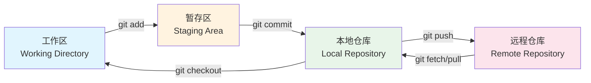

::: tip 三大区域详解
- **工作区（Working Directory）**：你实际编辑代码的地方，就是项目目录里的文件
- **暂存区（Staging Area / Index）**：一个中间状态，标记了哪些修改会被包含在下次 commit 中。你可以选择性提交，不用一次性提交所有修改
- **本地仓库（Repository）**：`.git` 目录，存储了所有的 commit 历史和元数据
- **远程仓库（Remote Repository）**：托管在 GitHub/GitLab 等平台上的仓库，用于团队协作
:::

### 文件状态生命周期

Git 中的文件有四种状态：

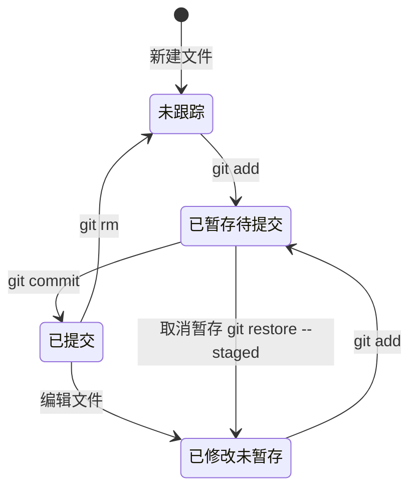

```bash
# 查看文件状态
git status

# 输出示例：
# On branch main
# Changes not staged for commit:    ← 已修改，未暂存
#   modified:   src/UserService.java
#
# Untracked files:                   ← 未跟踪
#   src/UserDTO.java
#
# Changes to be committed:           ← 已暂存，待提交
#   new file:   README.md
```

::: tip 实用技巧
- `git status -s`（简短模式）：`??` 表示未跟踪，`M` 表示已修改，`A` 表示已添加，`D` 表示已删除
- `git status -sb`：显示分支名 + 简短状态
:::

### .gitignore 详解

`.gitignore` 文件告诉 Git 哪些文件不需要被版本控制。

```bash
# 创建 .gitignore
touch .gitignore
```

**语法规则**：

```gitignore
# 1. 注释以 # 开头
# 这是注释

# 2. 忽略所有 .class 文件
*.class

# 3. 但不忽略 MainActivity.class（! 表示取反）
!MainActivity.class

# 4. 忽略 build/ 目录下的所有文件
build/

# 5. 只忽略当前目录下的 TODO 文件，不递归
/TODO

# 6. 忽略 doc 目录下所有 .pdf 文件
doc/**/*.pdf

# 7. 忽略所有 .log 文件
*.log

# 8. 忽略所有以 ~ 结尾的临时文件
*~

# 9. 忽略 .idea 目录（IntelliJ IDEA 配置）
.idea/

# 10. 忽略 target 目录（Maven 构建产物）
target/
```

::: details Java 项目通用 .gitignore 模板

```gitignore
# Compiled class files
*.class

# Log files
*.log

# Package files
*.jar
*.war
*.ear
*.zip
*.tar.gz

# Maven
target/

# Gradle
.gradle/
build/

# IDE - IntelliJ IDEA
.idea/
*.iml
out/

# IDE - Eclipse
.classpath
.project
.settings/
bin/

# IDE - VS Code
.vscode/

# OS - macOS
.DS_Store

# OS - Windows
Thumbs.db
ehthumbs.db

# Env files
.env
.env.local
.env.*.local

# Node (if full-stack)
node_modules/
```

:::

::: warning .gitignore 不生效怎么办？
如果一个文件已经被 Git 跟踪了，再把它加到 `.gitignore` 中是**不会生效**的。你需要先从 Git 的跟踪列表中移除：

```bash
# 从 Git 跟踪中移除，但保留本地文件
git rm --cached <file>

# 移除整个目录
git rm -r --cached target/

# 然后提交
git commit -m "chore: remove target/ from tracking"
```

:::

## 核心命令详解

### git init / git clone

```bash
# 在当前目录初始化一个 Git 仓库
git init
# 会创建一个 .git 隐藏目录，里面存储了所有版本控制信息

# 克隆远程仓库（最常用）
git clone https://github.com/user/repo.git

# 克隆到指定目录
git clone https://github.com/user/repo.git my-project

# 浅克隆（只拉取最近 N 次提交，速度快、省空间）
git clone --depth 1 https://github.com/user/repo.git

# 克隆指定分支
git clone -b develop https://github.com/user/repo.git
```

::: tip git init vs git clone 的区别
- `git init`：从零开始创建仓库，适合新项目
- `git clone`：从远程仓库复制一份到本地，包含所有历史记录
:::

### git add

```bash
# 添加指定文件到暂存区
git add README.md

# 添加所有修改的文件
git add .

# 添加所有修改和删除的文件（不包含新文件）
git add -u

# 添加所有变更（等同于 git add . && git add -u）
git add -A

# 交互式暂存（超级实用！可以逐个 hunk 选择）
git add -p
```

::: details git add -p 交互式暂存详解

`git add -p`（patch 模式）让你逐块（hunk）选择要暂存的修改。当你的一个文件里既有功能修改又有调试代码时，这个功能特别有用。

```bash
$ git add -p src/UserService.java

# Git 会显示类似这样的提示：
# (1/2) Stage this hunk [y,n,q,a,d,/,s,e,?]?
#
# y - 暂存这个 hunk
# n - 不暂存这个 hunk
# q - 退出，不暂存剩余的
# a - 暂存这个及后续所有
# d - 不暂存这个及后续所有
# s - 拆分这个 hunk 为更小的部分
# e - 手动编辑这个 hunk
# ? - 显示帮助
```

:::

### git commit

```bash
# 基本提交
git commit -m "feat: add user login feature"

# 跳过暂存区，直接提交所有已跟踪文件的修改
git commit -am "fix: fix null pointer in UserService"

# 修改上一次提交（不新增 commit）
# 场景：commit 之后发现有个小 bug 或者 commit message 写错了
git commit --amend -m "feat: add user login feature with validation"

# 允许创建空提交（有时 CI/CD 需要）
git commit --allow-empty -m "chore: trigger CI build"
```

::: warning git commit --amend 的注意事项
- `--amend` 会**修改最近一次 commit**（包括 message 和暂存内容）
- 如果你已经 push 到远程了，再 amend 会导致历史不一致，需要 `git push --force`
- **团队协作时慎用**，除非你确定没有其他人基于这个 commit 工作
:::

### git status / git diff

```bash
# 查看工作区和暂存区的状态
git status

# 查看工作区和暂存区的差异（即还未 add 的修改）
git diff

# 查看暂存区和上次 commit 的差异（即已 add 但未 commit 的修改）
git diff --staged
# 等同于
git diff --cached

# 查看两次 commit 之间的差异
git diff commit1 commit2

# 查看某个文件的修改
git diff src/UserService.java

# 查看某次 commit 修改了什么
git show <commit-hash>

# 只显示修改了哪些文件（不看具体内容）
git diff --stat
git diff --name-only
```

::: tip git diff 的输出格式
```
diff --git a/src/UserService.java b/src/UserService.java
index abc1234..def5678 100644
--- a/src/UserService.java      ← 修改前的文件
+++ b/src/UserService.java      ← 修改后的文件
@@ -10,6 +10,8 @@               ← 位置信息：从第 10 行开始
 public class UserService {
     private UserRepository repo;
 
+    private EmailService emailService;  ← 新增行（+开头）
+
     public User findById(Long id) {
-        return repo.findOne(id);        ← 删除行（-开头）
+        return repo.findById(id).orElse(null);  ← 修改行
     }
```

:::

### git log

```bash
# 基本日志
git log

# 单行显示（最常用）
git log --oneline

# 图形化显示分支历史
git log --oneline --graph --all

# 显示最近 N 条
git log -5

# 显示每次 commit 的具体修改
git log -p

# 显示每次 commit 修改了哪些文件
git log --stat

# 自定义格式化输出
git log --pretty=format:"%h - %an, %ar : %s"
# 输出示例：a1b2c3d - 张三, 3 hours ago : feat: add login

# 按作者过滤
git log --author="张三"

# 按提交信息过滤（正则匹配）
git log --grep="fix"

# 按文件过滤（查看某个文件的修改历史）
git log -- src/UserService.java

# 查看某个文件的每一行最后是谁修改的
git blame src/UserService.java
```

::: details git log 格式化占位符

| 占位符 | 说明 |
|--------|------|
| `%H` | 完整 commit hash |
| `%h` | 短 commit hash |
| `%an` | 作者名 |
| `%ae` | 作者邮箱 |
| `%ar` | 相对时间（如 "2 hours ago"） |
| `%ad` | 提交日期 |
| `%s` | 提交信息 |
| `%d` | 引用名称（分支、标签） |

:::

### git show / git blame

```bash
# 查看某次 commit 的详细信息
git show a1b2c3d

# 查看某次 commit 修改了哪些文件
git show --stat a1b2c3d

# 查看某个标签的详细信息
git show v1.0.0

# 查看某行代码是谁写的、什么时候写的、对应的 commit
git blame src/UserService.java

# 查看指定行范围
git blame -L 10,20 src/UserService.java
```

::: tip git blame 实战场景
线上出 bug 了，你想知道 `if (user == null)` 这行是谁加的：

```bash
git blame -L 42,42 src/UserService.java
# 输出：^a1b2c3d (张三 2024-03-15 14:30:22 +0800 42) if (user == null) {
```

然后 `git show a1b2c3d` 就能看完整的修改上下文，直接找当事人对质（划掉）沟通。
:::

### git rm / git mv

```bash
# 删除文件（同时从工作区和 Git 跟踪中移除）
git rm README.md

# 只从 Git 跟踪中移除，保留本地文件
git rm --cached README.md

# 删除整个目录
git rm -r src/test/

# 重命名文件
git mv OldName.java NewName.java
# 等同于：
# mv OldName.java NewName.java
# git rm OldName.java
# git add NewName.java
```

### git restore / git reset

::: danger 这两个命令经常混淆，搞清楚很重要
- `git restore`：只影响**工作区**和**暂存区**，不动 commit 历史
- `git reset`：会**回退 commit 历史**，慎用！
:::

```bash
# ---- git restore（安全的，不影响历史）----

# 撤销工作区的修改（恢复到暂存区的状态）
git restore src/UserService.java

# 撤销暂存（恢复到 HEAD 的状态，文件内容不变）
git restore --staged src/UserService.java

# 从某个 commit 恢复文件到工作区
git restore --source=HEAD~2 src/UserService.java

# ---- git reset（会影响历史）----

# --soft：回退 commit，但保留暂存区（修改还在 staging area）
git reset --soft HEAD~1

# --mixed（默认）：回退 commit + 取消暂存（修改还在工作区）
git reset --mixed HEAD~1
git reset HEAD~1  # 等同于上面

# --hard：回退 commit + 取消暂存 + 丢弃工作区修改（⚠️ 不可恢复！）
git reset --hard HEAD~1
```

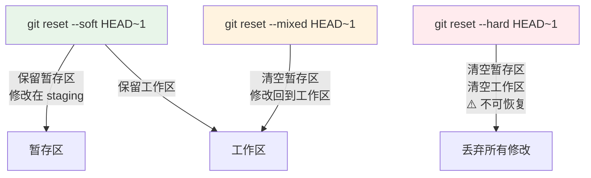

::: warning git reset --hard 的危险性
`git reset --hard` 会**永久丢失**工作区的修改，无法通过 Git 命令恢复。除非你用 `git reflog` 找到之前的 commit hash 再 reset 回去（后面会讲 reflog）。所以执行前一定要确认！
:::

### git checkout

```bash
# 切换分支
git checkout feature/login

# 基于当前分支创建新分支并切换
git checkout -b feature/register

# 撤销工作区文件的修改（恢复到最近一次 commit 的状态）
git checkout -- src/UserService.java
# ⚠️ 推荐用 git restore 替代：git restore src/UserService.java

# 切换到上一次所在的分支
git checkout -
```

::: tip git checkout 的替代命令
Git 2.23+ 引入了更明确的命令：
- `git switch` 替代 `git checkout` 的分支切换功能
- `git restore` 替代 `git checkout` 的文件恢复功能

```bash
# 新写法
git switch feature/login        # 替代 git checkout feature/login
git switch -c feature/register  # 替代 git checkout -b feature/register
git restore src/UserService.java # 替代 git checkout -- src/UserService.java
```

:::

### git stash

::: tip 什么时候用 stash？
你正在 feature 分支上开发，突然要切到 main 修个紧急 bug。但当前修改还没写完，不想 commit 一个半成品。`git stash` 就是你的"临时存档"。
:::

```bash
# 保存当前修改到 stash 栈
git stash
# 或者带消息
git stash save "feature/login: 完成了登录页面，还差接口对接"

# 查看 stash 列表
git stash list
# stash@{0}: On feature/login: feature/login: 完成了登录页面，还差接口对接
# stash@{1}: WIP on main: abc1234 fix typo

# 恢复最近的 stash（stash 内容仍然保留在列表中）
git stash apply

# 恢复指定的 stash
git stash apply stash@{1}

# 恢复并删除 stash 记录
git stash pop

# 删除 stash
git stash drop stash@{0}

# 清空所有 stash
git stash clear

# 查看 stash 的具体修改内容
git stash show -p stash@{0}
```

::: details stash 冲突处理

如果 stash 的修改和当前分支有冲突，`git stash apply` 会提示冲突：

```bash
$ git stash apply
Auto-merging src/UserService.java
CONFLICT (content): Merge conflict in src/UserService.java

# 手动解决冲突后：
git add src/UserService.java
git stash drop  # 解决完冲突后删除 stash
```

:::

## 分支管理

### 分支概念与原理

::: tip Git 的分支本质
Git 的分支本质上就是一个**指向某个 commit 的可移动指针**。创建分支就是创建一个新指针，切换分支就是移动 HEAD 指针。这就是为什么 Git 的分支操作如此之快——没有任何文件拷贝，只是指针的移动。
:::

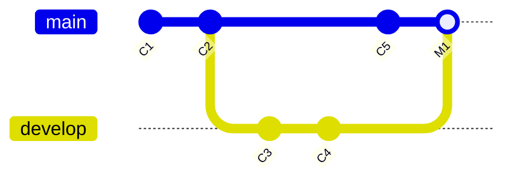

几个关键概念：

- **HEAD**：指向当前所在分支（或直接指向某个 commit，即 detached HEAD 状态）
- **分支指针**：如 `main`、`develop`，指向某个 commit
- **commit**：每次提交都会创建一个 commit 对象，包含快照、作者、时间、parent 等信息

### git branch / git switch

```bash
# 查看所有本地分支
git branch

# 查看所有分支（包括远程分支）
git branch -a

# 创建新分支（不切换）
git branch feature/login

# 创建新分支并切换（推荐用 switch）
git switch -c feature/login

# 切换分支
git switch feature/login

# 切换到上一次的分支
git switch -

# 删除分支（已合并的）
git branch -d feature/login

# 强制删除分支（未合并的也可以删）
git branch -D feature/login

# 重命名当前分支
git branch -m new-name

# 重命名指定分支
git branch -m old-name new-name
```

### git merge

Git 有两种合并方式：

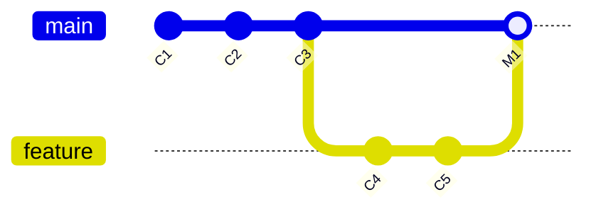

**1. 快进合并（Fast-Forward）**

当目标分支没有新的 commit 时，Git 只需要把分支指针往前移动：

```bash
# main: C1 -> C2
# feature: C1 -> C2 -> C3 -> C4

git checkout main
git merge feature
# main 直接指向 C4，没有产生新的 merge commit
```

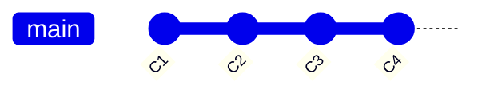

**2. 三方合并（Three-Way Merge）**

当两个分支都有新的 commit 时，Git 会创建一个新的 merge commit：

```bash
# main: C1 -> C2 -> C5
# feature: C1 -> C2 -> C3 -> C4

git checkout main
git merge feature
# 会创建一个新的 merge commit，有两个 parent
```

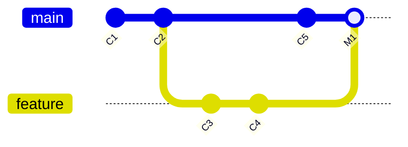

```bash
# 禁止快进合并（强制创建 merge commit，保留分支历史）
git merge --no-ff feature
```

::: tip 合并策略选择
- `--ff`（默认）：能快进就快进，历史更简洁
- `--no-ff`：强制创建 merge commit，能清楚看到功能分支的历史
- 团队协作推荐 `--no-ff`，因为能更好地追踪每个功能的完整历史
:::

### git rebase

::: warning rebase 的黄金法则
**不要对已经 push 到远程的公共分支执行 rebase！** rebase 会改写 commit 历史，如果其他人基于这个分支工作，会导致他们的历史和你的不一致。
:::

```bash
# 将当前分支的 commit 变基到 main 之上
git checkout feature
git rebase main

# 交互式 rebase（修改最近 3 次 commit）
git rebase -i HEAD~3
```

**rebase 的原理**：把当前分支的 commit "摘下来"，然后在目标分支的最新 commit 上重新"播放"：

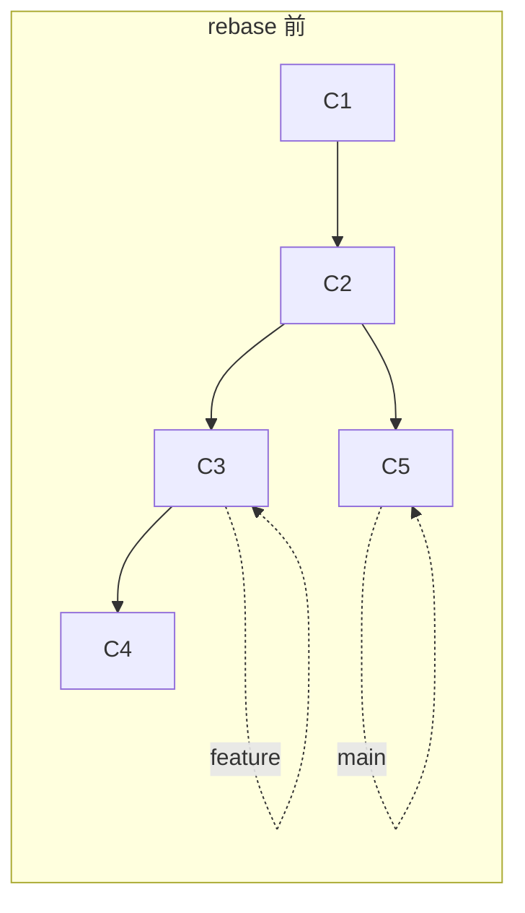

rebase 后：

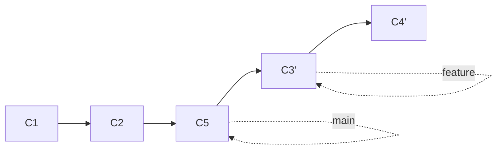

::: details rebase vs merge 对比

| 对比项 | merge | rebase |
|--------|-------|--------|
| 历史记录 | 保留完整分支历史 | 线性历史，更简洁 |
| 是否产生新 commit | 是（merge commit） | 否（改写 commit hash） |
| 冲突处理 | 一次性解决 | 可能需要多次解决 |
| 安全性 | 安全，不改写历史 | **改写历史**，慎用 |
| 适用场景 | 合并功能分支到 main | 保持 feature 分支与 main 同步 |

**一句话总结**：merge 是"两个人坐下来协商"，rebase 是"我一个人重新整理一遍"。

:::

### 合并冲突解决

当两个分支修改了同一个文件的同一位置时，就会产生冲突：

```bash
$ git merge feature
Auto-merging src/UserService.java
CONFLICT (content): Merge conflict in src/UserService.java
Automatic merge failed; fix conflicts and then commit the result.
```

冲突文件的内容会变成这样：

```java
public class UserService {
<<<<<<< HEAD
    private String username;    // ← main 分支的内容
    private String password;
=======
    private String email;       // ← feature 分支的内容
    private String phone;
>>>>>>> feature
    
    // ... 其他代码
}
```

**解决冲突的流程**：

```bash
# 1. 打开冲突文件，手动编辑（保留需要的代码）
# 2. 删除 <<<<<<< HEAD、=======、>>>>>>> feature 这些标记
# 3. 标记冲突已解决
git add src/UserService.java

# 4. 完成合并
git commit
```

::: tip 冲突解决工具推荐
- **IntelliJ IDEA**：内置冲突解决器，三栏对比，非常直观
- **VS Code**：内置冲突解决，点击 "Accept Current Change" / "Accept Incoming Change" / "Accept Both Changes"
- **Beyond Compare**：专业文件对比工具
- **vimdiff**：终端党的选择
- **`git mergetool`**：配置默认工具后，一条命令打开

```bash
# 配置默认合并工具
git config --global merge.tool vscode
```

:::

### git cherry-pick

```bash
# 从其他分支挑一个 commit 到当前分支
git cherry-pick <commit-hash>

# 挑选多个 commit
git cherry-pick hash1 hash2 hash3

# 挑选一个范围内的 commit（不含 hash1）
git cherry-pick hash1..hash2

# cherry-pick 时遇到冲突，解决后继续
git cherry-pick --continue

# 放弃 cherry-pick
git cherry-pick --abort
```

::: tip cherry-pick 实战场景
main 分支上有个紧急修复的 commit `abc1234`（修了个安全漏洞），你想把这个修复也应用到 develop 分支：

```bash
git checkout develop
git cherry-pick abc1234
git push origin develop
```

:::

### git tag

```bash
# 列出所有标签
git tag

# 创建轻量标签（只是一个指针，没有额外信息）
git tag v1.0.0

# 创建附注标签（推荐！有作者、日期、消息）
git tag -a v1.0.0 -m "Release version 1.0.0"

# 给历史 commit 打标签
git tag -a v0.9.0 abc1234 -m "Backport patch"

# 查看标签详情
git show v1.0.0

# 推送标签到远程
git push origin v1.0.0

# 推送所有标签
git push origin --tags

# 删除本地标签
git tag -d v1.0.0

# 删除远程标签
git push origin --delete v1.0.0
# 或者
git push origin :refs/tags/v1.0.0

# 基于标签创建分支
git checkout -b release/v1.0 v1.0.0
```

::: tip tag 命名规范
推荐使用**语义化版本**（Semantic Versioning）：
- `v1.0.0` → `v主版本.次版本.修订号`
- 主版本：不兼容的 API 变更
- 次版本：向下兼容的功能新增
- 修订号：向下兼容的问题修复
:::

### 分支命名规范

::: tip 推荐的分支命名约定

| 分支类型 | 命名格式 | 示例 |
|----------|----------|------|
| 主分支 | `main` 或 `master` | `main` |
| 开发分支 | `develop` | `develop` |
| 功能分支 | `feature/描述` | `feature/user-login` |
| 修复分支 | `fix/描述` | `fix/null-pointer-exception` |
| 热修复分支 | `hotfix/描述` | `hotfix/security-vulnerability` |
| 发布分支 | `release/版本号` | `release/v1.2.0` |

命名规则：
- 用 `-` 分隔单词，不用下划线 `_`
- 全小写
- 简短但有意义
- 可以加 issue 编号：`feature/USER-123-login`
:::

## 远程操作

### git remote

```bash
# 查看远程仓库
git remote -v

# 添加远程仓库
git remote add origin https://github.com/user/repo.git

# 修改远程仓库 URL
git remote set-url origin https://github.com/user/new-repo.git

# 重命名远程仓库
git remote rename origin upstream

# 删除远程仓库
git remote remove origin

# 查看远程仓库详情
git remote show origin
```

### git push

```bash
# 推送到远程（需要指定分支）
git push origin main

# 首次推送并设置上游分支（之后直接 git push 就行）
git push -u origin main

# 强制推送（⚠️ 危险！会覆盖远程历史）
git push --force origin main

# 安全的强制推送（如果远程没有被别人更新过才允许）
git push --force-with-lease origin main

# 删除远程分支
git push origin --delete feature/login

# 推送标签
git push origin v1.0.0
git push origin --tags
```

::: danger --force vs --force-with-lease
- `--force`：**无条件**覆盖远程分支，不管远程有什么新提交
- `--force-with-lease`：只有当远程分支和你预期的状态一致时才覆盖。如果别人在你之前 push 了新内容，会被拒绝

**永远优先使用 `--force-with-lease`**，除非你确定要覆盖远程。
:::

### git fetch / git pull

```bash
# 获取远程更新（不合并，只下载）
git fetch origin

# 获取所有远程分支的更新
git fetch --all

# 获取并自动合并到当前分支
git pull origin main

# pull 时使用 rebase 而不是 merge（推荐）
git pull --rebase origin main

# 全局配置 pull 默认使用 rebase
git config --global pull.rebase true
```

::: tip fetch vs pull 的区别

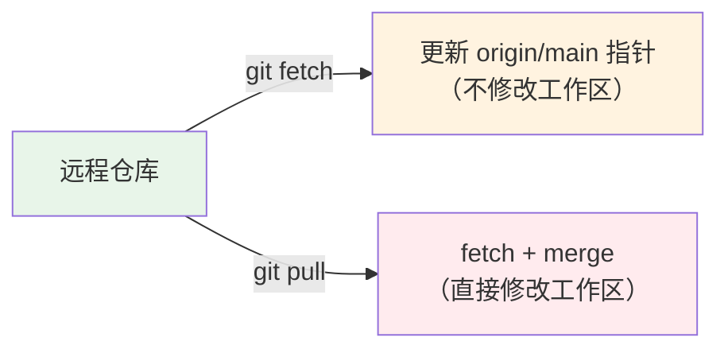

- `git fetch`：只下载远程的更新，不修改工作区。你可以在检查之后再决定是否 merge
- `git pull`：`git fetch` + `git merge` 的组合

**推荐使用 `git fetch` + `git merge`**，这样你可以先看看远程有什么更新，再决定怎么合并。
:::

### git remote prune

```bash
# 清理本地已不存在的远程分支引用
git remote prune origin

# 比如：同事删除了远程的 feature/login 分支
# 你的本地还能看到 origin/feature/login
# git fetch -p 会自动清理
git fetch -p
```

### 多远程仓库配置

::: details Fork + Pull Request 工作流

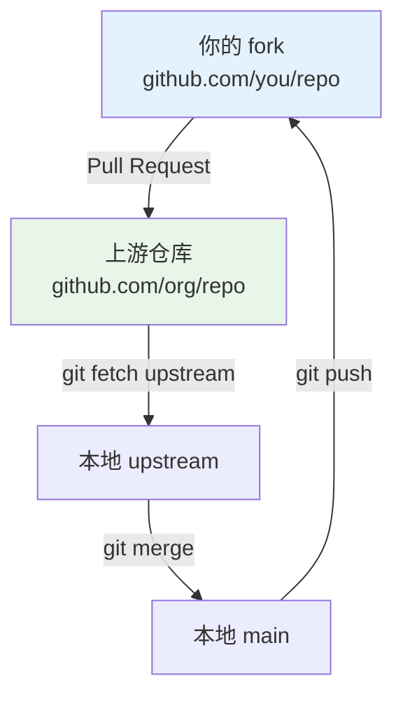

```bash
# 1. Fork 仓库到自己的 GitHub 账号

# 2. 克隆自己的 fork
git clone https://github.com/you/repo.git
cd repo

# 3. 添加上游仓库
git remote add upstream https://github.com/org/repo.git

# 4. 创建功能分支
git checkout -b feature/new-feature

# 5. 开发、提交
git add .
git commit -m "feat: add new feature"

# 6. 推送到自己的 fork
git push origin feature/new-feature

# 7. 在 GitHub 上创建 Pull Request

# 8. 同步上游仓库的最新代码
git fetch upstream
git checkout main
git merge upstream/main
# 或者用 rebase
git rebase upstream/main

# 9. 推送同步后的 main
git push origin main
```

:::

### SSH vs HTTPS 认证

| 对比项 | SSH | HTTPS |
|--------|-----|-------|
| URL 格式 | `git@github.com:user/repo.git` | `https://github.com/user/repo.git` |
| 认证方式 | SSH 密钥对 | 用户名 + Token（或密码） |
| 首次配置 | 需要生成 SSH 密钥 | 无需额外配置 |
| 安全性 | 更高（公钥加密） | 取决于 Token 管理 |
| 公司网络 | 可能被防火墙拦截 | 通常可以 |
| 推荐场景 | 个人开发者、长期使用 | CI/CD、临时使用 |

```bash
# 生成 SSH 密钥
ssh-keygen -t ed25519 -C "your-email@example.com"
# 一路回车（或设置 passphrase）

# 查看公钥
cat ~/.ssh/id_ed25519.pub
# 复制公钥，添加到 GitHub/GitLab 的 SSH Keys 设置中

# 测试连接
ssh -T git@github.com
# Hi username! You've successfully authenticated...
```

## 分支策略

### Git Flow

Git Flow 是最经典的分支管理模型，由 Vincent Driessen 在 2010 年提出：

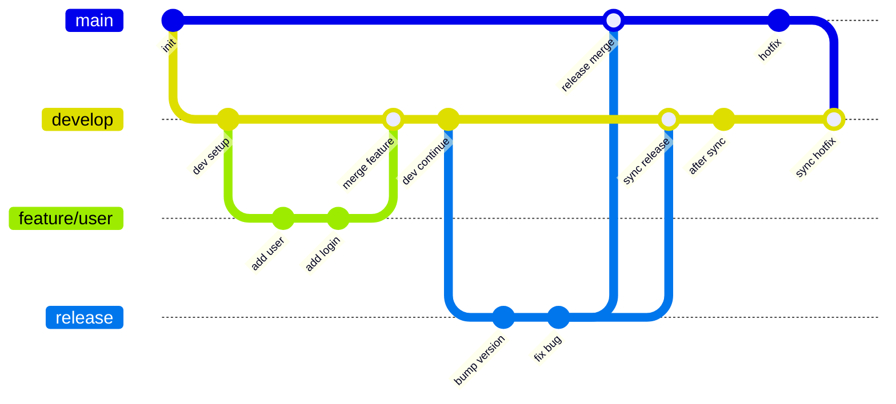

| 分支 | 用途 | 生命周期 |
|------|------|----------|
| `main` | 生产环境代码，每次合并都是可发布的 | 永久 |
| `develop` | 开发主线，集成最新开发进度 | 永久 |
| `feature/*` | 功能开发 | 临时，完成后合并到 develop |
| `release/*` | 发布准备，只修 bug，不改功能 | 临时，完成后合并到 main + develop |
| `hotfix/*` | 线上紧急修复 | 临时，完成后合并到 main + develop |

```bash
# 开发新功能
git checkout -b feature/user-login develop
# ... 开发 ...
git checkout develop
git merge --no-ff feature/user-login
git branch -d feature/user-login

# 准备发布
git checkout -b release/v1.0 develop
# ... 修 bug、更新版本号 ...
git checkout main
git merge --no-ff release/v1.0
git tag -a v1.0.0
git checkout develop
git merge --no-ff release/v1.0
git branch -d release/v1.0

# 线上紧急修复
git checkout -b hotfix/security main
# ... 修复 ...
git checkout main
git merge --no-ff hotfix/security
git tag -a v1.0.1
git checkout develop
git merge --no-ff hotfix/security
git branch -d hotfix/security
```

::: details Git Flow 的优缺点
**优点**：
- 分支职责清晰，流程规范
- 适合有明确版本发布计划的项目
- 支持并行开发和紧急修复

**缺点**：
- 分支太多，对新手不友好
- 流程较重，频繁的 merge 操作
- feature 分支可能长期不合并，集成风险大
:::

### GitHub Flow

GitHub Flow 是更简洁的分支策略，适合持续部署的项目：

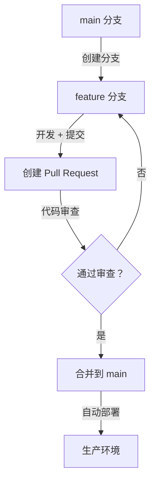

::: tip GitHub Flow 核心原则
1. `main` 分支始终是可部署的
2. 从 `main` 创建分支进行开发
3. 开发完成后创建 Pull Request
4. 代码审查通过后合并到 `main`
5. 合并后立即部署

适合：Web 应用、SaaS 产品、小团队
:::

### GitLab Flow

GitLab Flow 结合了 Git Flow 和 GitHub Flow 的优点，增加了环境分支的概念：

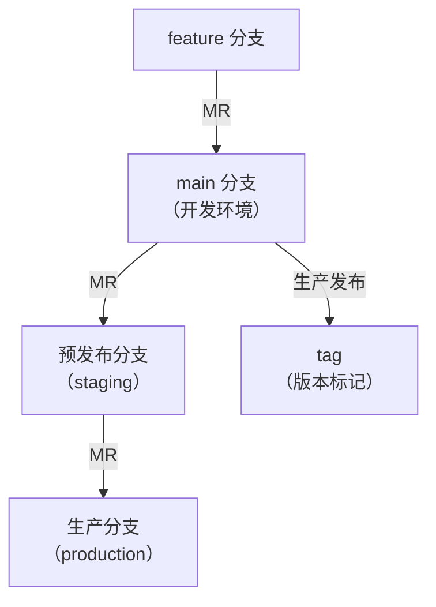

- **基于环境**：`main` → `staging` → `production`
- **基于版本**：`main` → `release/v1` → `release/v2`

### Trunk-Based Development

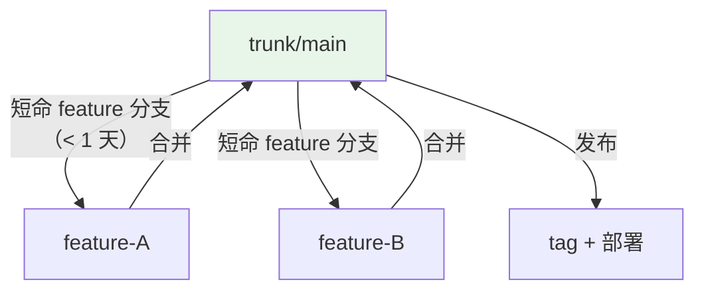

::: tip Trunk-Based Development 核心原则
1. 所有开发者直接在 `trunk`（main）上提交，或使用**短命分支**（不超过 1-2 天）
2. 使用 Feature Flag 控制未完成功能的可见性
3. 频繁提交、频繁集成、持续部署
4. 自动化测试覆盖要高

适合：Google、Facebook 等大型互联网公司，需要高度自动化的 CI/CD
:::

### 各策略对比与选择建议

| 策略 | 复杂度 | 适合团队 | 发布节奏 | 学习成本 |
|------|--------|----------|----------|----------|
| Git Flow | 高 | 中大型、有版本规划 | 定期发布 | 高 |
| GitHub Flow | 低 | 小型、Web/SaaS | 持续部署 | 低 |
| GitLab Flow | 中 | 需要多环境部署 | 灵活 | 中 |
| Trunk-Based | 中 | 高度自动化的大团队 | 持续部署 | 高 |

::: tip 选择建议
- **项目刚开始 / 小团队**：GitHub Flow
- **有明确版本计划（如 App 发布）**：Git Flow
- **需要多环境（开发、测试、生产）**：GitLab Flow
- **CI/CD 成熟、自动化测试充分**：Trunk-Based Development

没有银弹，选择最适合团队当前阶段的策略就好。
:::

## 高级技巧

### git bisect（二分法定位 bug）

::: tip 适用场景
"某个功能突然不工作了，但不知道是哪次提交导致的。" 用 `git bisect` 可以快速定位引入 bug 的 commit。
:::

```bash
# 1. 开始二分查找
git bisect start

# 2. 标记当前版本有 bug
git bisect bad

# 3. 标记一个正常的版本（比如上一个 release）
git bisect good v1.0.0

# Git 会自动 checkout 到中间的 commit，你测试后标记：
git bisect good  # 这次没问题
git bisect bad   # 这次有问题
# 重复以上步骤，直到定位到引入 bug 的 commit

# 4. 找到后结束
git bisect reset
```

::: details 自动化 bisect

如果测试可以通过脚本运行：

```bash
git bisect start HEAD v1.0.0
git bisect run ./run-test.sh
# Git 会自动运行脚本，帮你定位到引入 bug 的 commit
```

:::

### git reflog（撤销一切操作）

::: danger reflog 是 Git 的"后悔药"
几乎所有"误操作"都可以通过 `git reflog` 恢复！只要 commit 曾经存在过（即使被 reset --hard 删了），reflog 都会记录。
:::

```bash
# 查看 HEAD 的移动历史
git reflog

# 输出示例：
# a1b2c3d HEAD@{0}: reset: moving to HEAD~1
# e5f6g7h HEAD@{1}: commit: fix: resolve null pointer
# abc1234 HEAD@{2}: commit: feat: add login
# def5678 HEAD@{3}: checkout: moving from feature to main

# 回退到某个历史状态
git reset --hard e5f6g7h
# 或者用 checkout（不修改分支指针）
git checkout e5f6g7h

# reflog 默认保留 90 天，可以调整
git config --global gc.reflogExpire 180
```

### git revert

```bash
# 撤销某次 commit（创建一个新的 commit 来"反向"操作）
git revert <commit-hash>

# 撤销最近一次 commit
git revert HEAD

# 撤销多个 commit
git revert hash1 hash2

# 撤销一个范围内的 commit
git revert hash1..hash2

# 不自动创建 commit（先看看反向修改是否正确）
git revert -n <commit-hash>
```

::: tip revert vs reset 的区别
- `git revert`：**创建新 commit** 来撤销之前的修改，不影响历史。适合已 push 的 commit
- `git reset`：**删除 commit**，回退历史。适合还没 push 的 commit

**团队协作中，要撤销已 push 的 commit，永远用 `git revert`！**
:::

### git rebase -i（交互式变基）

::: tip 交互式 rebase 的威力
交互式 rebase 可以让你**重新整理 commit 历史**：合并、修改、删除、排序 commit。提交前整理一下，代码历史会干净很多。
:::

```bash
# 整理最近 3 次 commit
git rebase -i HEAD~3
```

会打开编辑器，显示：

```
pick abc1234 feat: add user login
pick def5678 fix: typo in login page
pick ghi9012 refactor: extract validation logic
pick jkl3456 style: format code

# 可用命令：
# p, pick = 保留这个 commit
# r, reword = 保留 commit，修改 commit message
# e, edit = 保留 commit，暂停以便修改内容
# s, squash = 保留 commit，合并到上一个 commit
# f, fixup = 类似 squash，但丢弃 commit message
# d, drop = 删除这个 commit
```

```bash
# 把 fix 和 style 合并到 feat 中：
pick abc1234 feat: add user login
f def5678 fix: typo in login page
s ghi9012 refactor: extract validation logic
f jkl3456 style: format code
```

保存后会让你编辑合并后的 commit message。

::: details 交互式 rebase 常用操作

**1. 修改 commit message**：
```
reword abc1234 feat: add user login
```

**2. 合并多个 commit 为一个**：
```
pick abc1234 feat: add user login
squash def5678 fix: typo
squash ghi9012 refactor: extract validation
```

**3. 删除某个 commit**：
```
pick abc1234 feat: add user login
drop def5678 fix: typo
pick ghi9012 refactor: extract validation
```

**4. 调整 commit 顺序**（直接上下移动行即可）。

**5. 编辑 commit 内容**：
```
edit abc1234 feat: add user login
# 会停在这个 commit，你可以修改文件后：
git add .
git rebase --continue
```

:::

### git clean

```bash
# 查看会被清理的文件（不实际删除）
git clean -n

# 清理未跟踪的文件
git clean -f

# 清理未跟踪的文件和目录
git clean -fd

# 清理未跟踪的文件 + 忽略 .gitignore 中的规则
git clean -fdx

# 交互式清理
git clean -i
```

::: danger git clean 是不可逆的！
`git clean -f` 会**永久删除**未跟踪的文件，无法恢复。建议先 `git clean -n` 看看会删除什么。
:::

### git archive

```bash
# 导出项目为压缩包（不包含 .git 目录）
git archive --format=zip -o project.zip HEAD

# 导出某个 tag
git archive --format=tar.gz -o v1.0.0.tar.gz v1.0.0

# 只导出某个目录
git archive --format=zip -o src.zip HEAD:src
```

### git submodule

::: tip 什么时候用 submodule？
当你需要在项目中引用另一个 Git 仓库时（比如公共组件库、第三方 SDK）。submodule 把外部仓库作为子目录引入，但保持独立的 Git 历史。
:::

```bash
# 添加 submodule
git submodule add https://github.com/user/common-lib.git libs/common-lib

# 初始化 submodule（克隆项目后需要执行）
git submodule init
git submodule update
# 或者一步到位
git submodule update --init --recursive

# 拉取 submodule 的最新代码
git submodule update --remote

# 克隆包含 submodule 的项目
git clone --recursive https://github.com/user/repo.git
```

::: details submodule 的痛点与替代方案

**submodule 的常见问题**：
1. 忘记 `git submodule update`，导致代码不一致
2. submodule 在某个 commit 上锁定了，需要手动更新
3. `git diff` 不显示 submodule 内部的修改
4. 删除 submodule 很麻烦

**替代方案：git subtree**

```bash
# 添加 subtree（把外部仓库的代码直接合并进来）
git subtree add --prefix=libs/common-lib https://github.com/user/common-lib.git main

# 拉取 subtree 的最新代码
git subtree pull --prefix=libs/common-lib https://github.com/user/common-lib.git main

# 推送 subtree 的修改
git subtree push --prefix=libs/common-lib https://github.com/user/common-lib.git main
```

subtree 的优点：不依赖 `.gitmodules`，代码直接在仓库中，更简单。
:::

### git worktree

::: tip worktree 解决的痛点
你正在 feature 分支上开发，突然要切到 hotfix 分支修个紧急 bug。但当前修改还没写完，stash 又嫌麻烦。`git worktree` 让你同时 checkout 多个分支到不同目录！
:::

```bash
# 为 feature 分支创建一个新的工作目录
git worktree add ../my-project-feature feature/login

# 查看所有 worktree
git worktree list

# 删除 worktree
git worktree remove ../my-project-feature

# 清理已删除的 worktree 记录
git worktree prune
```

::: details worktree 的使用场景

```bash
# 场景：同时在两个分支上工作
# 主工作目录：main 分支
cd ~/projects/my-project

# 为 feature 分支创建 worktree
git worktree add ~/projects/my-project-feature feature/user-login

# 现在你有两个目录，可以同时打开两个 IDE 窗口
# ~/projects/my-project        → main 分支
# ~/projects/my-project-feature → feature/user-login 分支

# 在 feature 目录中开发、提交，完全独立
cd ~/projects/my-project-feature
# ... 开发 ...
git add .
git commit -m "feat: add user login"

# 完成后合并
cd ~/projects/my-project
git merge feature/user-login
git worktree remove ~/projects/my-project-feature
```

:::

### git filter-branch / git filter-repo

::: danger 警告：修改历史会影响所有协作者！
以下操作会**重写 Git 历史**，执行后所有协作者需要重新 clone 仓库。仅用于个人项目或紧急清理。
:::

```bash
# 从历史中彻底删除某个文件（如误提交的密码文件）
git filter-branch --force --index-filter \
  'git rm --cached --ignore-unmatch config/passwords.properties' \
  --prune-empty --tag-name-filter cat -- --all

# 替代方案：git filter-repo（更推荐，更快更安全）
# 安装
pip install git-filter-repo

# 删除某个文件
git filter-repo --path config/passwords.properties --invert-paths

# 删除所有大文件（> 10MB）
git filter-repo --strip-blobs-bigger-than 10M
```

## Git Hooks

### Hook 类型

Git Hooks 是 Git 在特定事件发生时自动执行的脚本，放在 `.git/hooks/` 目录下。

| Hook | 触发时机 | 常见用途 |
|------|----------|----------|
| `pre-commit` | commit 之前 | 代码检查、格式化 |
| `commit-msg` | 编写 commit message 之后 | 校验提交信息格式 |
| `pre-push` | push 之前 | 运行测试 |
| `post-receive` | 服务器收到 push 后 | 自动部署 |
| `pre-rebase` | rebase 之前 | 防止 rebase 某些 commit |

```bash
# 查看可用的 hook 模板
ls .git/hooks/
# pre-commit.sample  commit-msg.sample  pre-push.sample  ...

# 启用一个 hook（去掉 .sample 后缀）
cp .git/hooks/pre-commit.sample .git/hooks/pre-commit
chmod +x .git/hooks/pre-commit
```

### 实战：pre-commit 运行代码检查

```bash
#!/bin/bash
# .git/hooks/pre-commit

echo "Running pre-commit checks..."

# 1. 运行 Java 代码检查（Checkstyle）
if command -v mvn &> /dev/null; then
    echo "Running Checkstyle..."
    mvn checkstyle:check -q
    if [ $? -ne 0 ]; then
        echo "❌ Checkstyle failed! Please fix code style issues."
        exit 1
    fi
fi

# 2. 运行 ESLint（前端项目）
if [ -f "node_modules/.bin/eslint" ]; then
    echo "Running ESLint..."
    npx eslint src/ --max-warnings 0
    if [ $? -ne 0 ]; then
        echo "❌ ESLint failed! Please fix linting issues."
        exit 1
    fi
fi

# 3. 检查是否有调试代码
if git diff --cached | grep -q "System.out.println\|console.log\|debugger"; then
    echo "❌ Found debug print statements! Please remove them."
    exit 1
fi

echo "✅ All checks passed!"
```

### 实战：commit-msg 校验提交格式

```bash
#!/bin/bash
# .git/hooks/commit-msg

# 读取 commit message
MSG=$(cat "$1")

# 校验格式：type(scope): description
# 例如：feat(user): add login page
if ! echo "$MSG" | grep -qE "^(feat|fix|docs|style|refactor|perf|test|chore|build|ci)(\(.+\))?: .+"; then
    echo "❌ Invalid commit message format!"
    echo ""
    echo "Expected format: type(scope): description"
    echo "Types: feat, fix, docs, style, refactor, perf, test, chore, build, ci"
    echo "Example: feat(user): add login page"
    echo ""
    echo "Your message: $MSG"
    exit 1
fi

# 检查 commit message 长度（第一行不超过 72 字符）
FIRST_LINE=$(echo "$MSG" | head -1)
if [ ${#FIRST_LINE} -gt 72 ]; then
    echo "❌ Commit message first line is too long (${#FIRST_LINE} chars, max 72)."
    exit 1
fi

echo "✅ Commit message format is valid!"
```

### Husky + lint-staged（前端项目）

::: tip 前端项目的最佳实践
Husky 让 Git Hooks 的管理更简单，lint-staged 只检查暂存的文件（不是整个项目），速度更快。
:::

```bash
# 安装
npm install husky lint-staged --save-dev

# 初始化 Husky
npx husky init

# 配置 lint-staged
```

```json
// package.json
{
  "lint-staged": {
    "*.{js,ts,jsx,tsx}": [
      "eslint --fix",
      "prettier --write"
    ],
    "*.{java}": [
      "google-java-format --replace"
    ],
    "*.{md,json,yml}": [
      "prettier --write"
    ]
  }
}
```

```bash
# .husky/pre-commit
#!/usr/bin/env sh
. "$(dirname -- "$0")/_/husky.sh"

npx lint-staged
```

```bash
# .husky/commit-msg
#!/usr/bin/env sh
. "$(dirname -- "$0")/_/husky.sh"

npx --no -- commitlint --edit "$1"
```

## 提交规范

### Conventional Commits

::: tip 为什么需要提交规范？
规范的 commit message 可以：
1. 自动生成 CHANGELOG
2. 语义化版本控制（自动决定版本号递增）
3. 快速过滤和搜索历史
4. 代码审查时快速了解改动意图
:::

| Type | 说明 | 版本影响 |
|------|------|----------|
| `feat` | 新功能 | Minor 版本 |
| `fix` | 修复 bug | Patch 版本 |
| `docs` | 文档变更 | 无 |
| `style` | 代码格式（不影响逻辑） | 无 |
| `refactor` | 重构（不是新功能也不是修 bug） | 无 |
| `perf` | 性能优化 | Patch 版本 |
| `test` | 测试相关 | 无 |
| `chore` | 构建工具、依赖更新等 | 无 |
| `build` | 构建系统或外部依赖 | 无 |
| `ci` | CI/CD 配置 | 无 |

**格式**：

```
<type>(<scope>): <subject>

<body>

<footer>
```

**示例**：

```
feat(user): add login and registration

- Implement JWT-based authentication
- Add login/register API endpoints
- Add input validation

Closes #123
```

### commitlint 配置

```bash
# 安装
npm install --save-dev @commitlint/cli @commitlint/config-conventional

# 创建配置文件
```

```javascript
// commitlint.config.js
module.exports = {
  extends: ['@commitlint/config-conventional'],
  rules: {
    // type 必须是以下之一
    'type-enum': [2, 'always', [
      'feat', 'fix', 'docs', 'style', 'refactor',
      'perf', 'test', 'chore', 'build', 'ci'
    ]],
    // subject 不能为空
    'subject-empty': [2, 'never'],
    // subject 不能以句号结尾
    'subject-full-stop': [2, 'never', '.'],
    // type 不能为空
    'type-empty': [2, 'never'],
    // header 最大长度 100
    'header-max-length': [2, 'always', 100],
  },
};
```

### CHANGELOG 自动生成

```bash
# 安装 standard-version
npm install --save-dev standard-version

# 生成 CHANGELOG + 自动打 tag + 更新版本号
npx standard-version

# 指定 release type
npx standard-version --release-as major  # 1.0.0 -> 2.0.0
npx standard-version --release-as minor  # 1.0.0 -> 1.1.0
npx standard-version --release-as patch  # 1.0.0 -> 1.0.1

# 首次发布
npx standard-version --first-release
```

```json
// package.json 中添加 npm script
{
  "scripts": {
    "release": "standard-version"
  }
}
```

::: details 生成的 CHANGELOG 示例

```markdown
# Changelog

## [1.1.0](https://github.com/user/repo/compare/v1.0.0...v1.1.0) (2024-03-15)

### Features

* **user**: add login and registration ([abc1234](https://github.com/user/repo/commit/abc1234))
* **order**: add order management page ([def5678](https://github.com/user/repo/commit/def5678))

### Bug Fixes

* resolve null pointer in UserService ([ghi9012](https://github.com/user/repo/commit/ghi9012))
```

:::

## Git 常见问题与排错

### 误删分支恢复

```bash
# 查看所有操作历史（找到被删分支的最后一次 commit）
git reflog

# 输出示例：
# abc1234 HEAD@{2}: checkout: moving from feature/login to main
# def5678 HEAD@{3}: commit: feat: add login page

# 恢复分支
git branch feature/login def5678
```

### 误 commit 敏感信息

::: danger 场景
不小心把数据库密码、API Key 等敏感信息提交到了 Git 仓库中。即使删除文件并 commit，敏感信息仍然存在于 Git 历史中！

:::

```bash
# 1. 立即撤销 commit（如果还没 push）
git reset --soft HEAD~1
# 从暂存区移除敏感文件
git restore --staged config/application-prod.yml
# 把敏感文件加入 .gitignore
echo "config/application-prod.yml" >> .gitignore
git commit -m "chore: remove sensitive config from tracking"

# 2. 如果已经 push 了，用 BFG Repo-Cleaner 清理历史
# 下载 BFG：https://rtyley.github.io/bfg-repo-cleaner/
java -jar bfg.jar --delete-files application-prod.yml repo.git
cd repo
git reflog expire --expire=now --all
git gc --prune=now --aggressive
git push --force

# 3. 或者用 git filter-repo（推荐）
git filter-repo --path config/application-prod.yml --invert-paths
git push --force
```

::: warning 清理历史后的注意事项
1. **所有协作者必须重新 clone** 仓库，否则他们的本地历史和远程不一致
2. 清理历史后，相关的 commit hash 全部改变
3. **最重要的是：泄露的密码/Token 要立刻更换**，即使从 Git 中删除了，可能已经被人看到了
:::

### 合并冲突复杂场景

::: details 场景：merge 时多个文件冲突

```bash
# 查看所有冲突文件
git diff --name-only --diff-filter=U

# 只接受当前分支的修改
git checkout --ours src/File1.java
git add src/File1.java

# 只接受合并分支的修改
git checkout --theirs src/File2.java
git add src/File2.java

# 放弃合并
git merge --abort
```

:::

### rebase 中断恢复

```bash
# rebase 过程中遇到冲突，解决后：
git add .
git rebase --continue

# 放弃 rebase，回到之前的状态
git rebase --abort

# rebase 过程中想跳过某个 commit
git rebase --skip
```

::: tip rebase 中断后的恢复技巧
如果 rebase 过程中你搞砸了（比如解决了冲突但解错了），别慌：

```bash
# 1. 先放弃当前 rebase
git rebase --abort

# 2. 用 reflog 确认回到安全状态
git reflog | head -5

# 3. 重新开始
git rebase -i HEAD~3
```

:::

### push 被拒绝

```bash
# 场景：你 push 时被拒绝，因为远程有新的 commit
$ git push origin main
# To https://github.com/user/repo.git
#  ! [rejected]        main -> main (fetch first)
# error: failed to push some refs to 'github.com/user/repo.git'

# 解决方案 1：先 pull 再 push（推荐）
git pull --rebase origin main
git push origin main

# 解决方案 2：如果确定要用本地覆盖远程（谨慎！）
git push --force-with-lease origin main
```

### 大文件管理（Git LFS）

::: warning Git 不适合管理大文件
Git 仓库中每个文件的每个版本都会被完整保存。如果你提交了 500MB 的视频文件，每次修改都会让仓库膨胀 500MB。
:::

```bash
# 安装 Git LFS
brew install git-lfs
# 或
apt install git-lfs

# 初始化
git lfs install

# 跟踪大文件类型
git lfs track "*.psd"
git lfs track "*.zip"
git lfs track "binaries/*"

# 查看跟踪规则
cat .gitattributes
# *.psd filter=lfs diff=lfs merge=lfs -text
# *.zip filter=lfs diff=lfs merge=lfs -text

# 正常 add/commit/push
git add .gitattributes
git commit -m "chore: configure Git LFS"
git push

# 查看哪些文件被 LFS 管理
git lfs ls-files
```

## IDE 集成

### IntelliJ IDEA 中的 Git 操作

IntelliJ IDEA 内置了强大的 Git 支持，日常操作基本不需要命令行：

::: details IDEA Git 常用操作

1. **查看 Git 状态**：左下角 Git 面板（Alt+9）
2. **提交**：`Ctrl+K`（Mac: `Cmd+K`）
3. **推送**：`Ctrl+Shift+K`（Mac: `Cmd+Shift+K`）
4. **切换分支**：右下角分支选择器
5. **查看历史**：`Alt+9` 打开 Git 面板 → Log 标签
6. **解决冲突**：合并冲突时，文件会有红色/蓝色标记，点击冲突文件会弹出合并工具
7. **Cherry-pick**：在 Log 中右键某个 commit → Cherry-Pick
8. **Revert**：在 Log 中右键某个 commit → Revert Commit
9. **Stash**：Git → Stash Changes
10. **Annotate（blame）**：左行号区域右键 → Annotate with Git Blame

**推荐插件**：
- `.ignore`：`.gitignore` 文件语法高亮和自动补全
- `GitToolBox`：增强 Git 功能（inline blame、commit 状态显示等）

:::

### VS Code 中的 Git 操作

VS Code 内置了 Git 支持，配合 GitLens 插件体验更好：

::: details VS Code Git 常用操作

1. **查看修改**：左侧 Source Control 面板（Ctrl+Shift+G）
2. **提交**：Source Control 面板顶部的输入框，`Ctrl+Enter` 提交
3. **查看历史**：安装 GitLens → 文件中右键 → Open File History
4. **解决冲突**：冲突文件会出现 (Conflict) 标记，点击打开合并工具
5. **Stash**：Source Control 面板 → `...` → Stash
6. **Blame**：安装 GitLens → 行内显示 blame 信息

**推荐扩展**：
- **GitLens**：查看 blame、commit 历史、分支对比（必备！）
- **Git Graph**：可视化分支图
- **Git History**：查看文件修改历史
- **Conventional Commits**：辅助编写规范的 commit message

:::

### 常用 GUI 工具

| 工具 | 平台 | 特点 |
|------|------|------|
| **SourceTree** | Win/Mac | 免费易用，适合新手，支持 Git Flow |
| **GitKraken** | Win/Mac/Linux | 界面精美，可视化分支图强大 |
| **lazygit** | 终端 | 终端 UI，高效，适合 vim 用户 |
| **Tig** | 终端 | 轻量级终端 Git 浏览器 |
| **Tower** | Win/Mac | 付费，专业级 Git 客户端 |
| **GitHub Desktop** | Win/Mac | 简单直观，GitHub 官方出品 |

::: tip 工具选择建议
- **新手**：SourceTree 或 GitHub Desktop
- **追求效率**：命令行为主 + lazygit 辅助查看
- **Java 开发者**：IntelliJ IDEA 内置功能基本够用
- **前端开发者**：VS Code + GitLens

:::

## 面试高频题

::: tip 面试准备建议
Git 的面试题主要考察**理解深度**，不是死记硬背命令。要理解每个操作背后的原理，能用实际场景解释。
:::

### 1. Git 的工作区域有哪些？

**答**：Git 有三个工作区域：

1. **工作区（Working Directory）**：实际编辑代码的地方
2. **暂存区（Staging Area / Index）**：标记下次 commit 要包含的修改
3. **本地仓库（Repository）**：`.git` 目录，存储所有 commit 历史

还有一个**远程仓库（Remote Repository）**，托管在 GitHub/GitLab 等平台上。

工作流程：工作区 → `git add` → 暂存区 → `git commit` → 本地仓库 → `git push` → 远程仓库。

### 2. git reset --soft/--mixed/--hard 的区别？

**答**：

| 参数 | 撤销 commit | 撤销暂存 | 丢弃工作区修改 |
|------|:-----------:|:--------:|:------------:|
| `--soft` | ✅ | ❌ | ❌ |
| `--mixed`（默认） | ✅ | ✅ | ❌ |
| `--hard` | ✅ | ✅ | ✅ |

- `--soft`：只回退 commit 指针，暂存区和工作区不变。适合想重新组织 commit message
- `--mixed`：回退 commit + 清空暂存区，工作区修改保留。最常用
- `--hard`：全部回退，工作区修改也丢失。**慎用**，除非你确定不要那些修改

### 3. git merge 和 git rebase 的区别？

**答**：

- **merge**：创建一个新的 merge commit，保留两个分支的完整历史。优点是安全不改写历史；缺点是历史可能比较乱
- **rebase**：把当前分支的 commit "摘下来"，在目标分支上重新播放，生成线性历史。优点是历史简洁；缺点是改写了 commit hash

**使用原则**：
- 合并 feature 分支到 main：用 merge
- 同步 main 的更新到 feature 分支：用 rebase（保持 feature 分支历史简洁）
- **绝对不要对已 push 的公共分支做 rebase**

### 4. 什么是 Git Flow？

**答**：Git Flow 是一种分支管理模型，定义了以下分支：

- `main`：生产代码，只接受 release 和 hotfix 的合并
- `develop`：开发主线，集成所有功能
- `feature/*`：功能分支，从 develop 创建，完成后合并回 develop
- `release/*`：发布分支，从 develop 创建，只修 bug，完成后合并到 main 和 develop
- `hotfix/*`：热修复分支，从 main 创建，完成后合并到 main 和 develop

适合有明确版本发布计划的项目。缺点是分支太多、流程较重。

### 5. 如何撤销一次 commit？

**答**：取决于是否已 push：

- **未 push**：
  - `git reset --soft HEAD~1`：撤销 commit，保留暂存区
  - `git reset --mixed HEAD~1`：撤销 commit + 取消暂存
  - `git commit --amend`：修改最近的 commit message 或内容

- **已 push**：
  - `git revert <commit-hash>`：创建一个新的 commit 来撤销（推荐，不影响历史）
  - `git reset --hard HEAD~1` + `git push --force`：强制覆盖远程（危险，团队协作慎用）

### 6. git stash 的作用？

**答**：`git stash` 用于临时保存当前工作区和暂存区的修改，让你可以切换分支做其他事情，之后回来再恢复。

常用命令：
- `git stash`：保存修改
- `git stash list`：查看所有 stash
- `git stash pop`：恢复最近的 stash 并删除记录
- `git stash apply`：恢复 stash 但保留记录
- `git stash drop`：删除 stash

### 7. git fetch 和 git pull 的区别？

**答**：

- `git fetch`：只下载远程的更新（commit、分支等），不修改工作区和当前分支。你可以在查看之后决定是否 merge
- `git pull`：`git fetch` + `git merge` 的组合，自动将远程更新合并到当前分支

**推荐**：优先使用 `git fetch`，手动 merge。这样更安全，你能先看看远程有什么变化。

`git pull --rebase` 等于 `git fetch` + `git rebase`，能保持线性历史。

### 8. 如何恢复误删的分支？

**答**：使用 `git reflog` 查找被删分支最后一次 commit 的 hash，然后重新创建分支：

```bash
git reflog                    # 找到 commit hash
git branch feature/login def5678  # 重新创建分支
```

`git reflog` 记录了 HEAD 的所有移动历史，包括被删除的分支。只要 commit 曾经存在过，就能找到。

### 9. .gitignore 不生效怎么办？

**答**：`.gitignore` 只对**未跟踪的文件**生效。如果文件已经被 Git 跟踪了，需要先从跟踪列表中移除：

```bash
git rm --cached <file>        # 移除跟踪但保留本地文件
git rm -r --cached target/    # 移除目录
git commit -m "chore: remove from tracking"
```

### 10. 如何查看某行代码是谁写的？

**答**：使用 `git blame`：

```bash
git blame src/UserService.java        # 查看整个文件
git blame -L 10,20 src/UserService.java  # 查看第 10-20 行
```

输出会显示每一行最后是谁修改的、什么时候修改的、对应的 commit hash。IntelliJ IDEA 和 VS Code（GitLens）都有可视化 blame 功能。

### 11. 什么是 Git 的 detached HEAD 状态？

**答**：正常情况下 HEAD 指向一个分支名（如 `main`），而分支名指向某个 commit。当你直接 checkout 到某个 commit 而不是分支时，HEAD 就直接指向那个 commit，这就是 detached HEAD 状态。

```bash
# 进入 detached HEAD
git checkout abc1234

# 在这个状态下做的 commit 会"悬空"，一旦切换到其他分支就会被垃圾回收

# 如果你想保留这些修改，创建一个新分支
git checkout -b feature/fix
```

### 12. git push --force 和 --force-with-lease 的区别？

**答**：

- `--force`：无条件覆盖远程分支，不管远程有什么新提交
- `--force-with-lease`：只有当远程分支和你上次 fetch 的状态一致时才覆盖。如果别人在你之后 push 了新内容，会被拒绝

**永远优先使用 `--force-with-lease`**，它能防止意外覆盖别人的代码。

### 13. 如何把一个 commit 从一个分支移到另一个分支？

**答**：使用 `git cherry-pick`：

```bash
# 1. 在源分支找到要移动的 commit hash
git log  # 假设是 abc1234

# 2. 切换到目标分支
git checkout target-branch

# 3. cherry-pick 那个 commit
git cherry-pick abc1234

# 4. 回到源分支，删除那个 commit（如果需要）
git checkout source-branch
git rebase -i HEAD~3  # 在交互式 rebase 中 drop 那个 commit
```

### 14. Git 中的 HEAD 是什么？

**答**：HEAD 是一个指向当前所在分支（或直接指向某个 commit）的**指针**。它告诉你"你现在在哪里"。

- `HEAD`：当前 commit
- `HEAD~1`：上一个 commit（parent）
- `HEAD~3`：往上第 3 个 commit
- `HEAD@{1}`：reflog 中 HEAD 的上一次位置

### 15. 如何在 Git 中暂存部分文件的修改？

**答**：使用 `git add -p`（patch 模式）：

```bash
git add -p src/UserService.java
# Git 会逐块（hunk）询问你要不要暂存：
# y - 暂存这个 hunk
# n - 跳过
# s - 拆分为更小的 hunk
# e - 手动编辑
```

这样你可以选择性地暂存一个文件中的部分修改，而不是整个文件。

### 16. git merge 和 git rebase 分别在什么场景下使用？

**答**：

- **merge 的场景**：
  - 将 feature 分支合并到 main（保留完整的分支历史）
  - 合并 release/hotfix 分支
  - 任何涉及公共分支的操作

- **rebase 的场景**：
  - 在 feature 分支上同步 main 的最新更新（保持 feature 线性历史）
  - 整理自己的 commit 历史（交互式 rebase）

**核心原则**：不要 rebase 已经 push 到远程的公共分支。

### 17. 什么是 Git LFS？解决什么问题？

**答**：Git LFS（Large File Storage）是 Git 的大文件扩展。它用**指针文件**替代大文件存储在 Git 中，大文件本身存储在 LFS 服务器上。

解决的问题：Git 仓库中每个文件的每个版本都会完整保存，大文件（图片、视频、模型文件等）会导致仓库迅速膨胀。LFS 让大文件只占当前版本的存储空间。

使用方式：
```bash
git lfs install
git lfs track "*.psd"
```

### 18. 如何比较两个分支的差异？

**答**：

```bash
# 查看两个分支的文件差异列表
git diff --name-only branch1 branch2

# 查看具体差异
git diff branch1 branch2

# 只看某个文件的差异
git diff branch1 branch2 -- src/UserService.java

# 查看某个分支领先另一个分支多少个 commit
git log branch1..branch2 --oneline
```

### 19. 如何把多个 commit 合并为一个？

**答**：使用交互式 rebase：

```bash
# 合并最近 3 个 commit
git rebase -i HEAD~3
# 编辑器中：
#   pick abc1234 feat: step 1
#   squash def5678 feat: step 2
#   squash ghi9012 feat: step 3
# 保存后编辑合并后的 commit message
```

### 20. 什么是 Git 的对象模型？

**答**：Git 内部是一个**内容寻址的文件系统**，有四种对象：

1. **Blob**：存储文件内容
2. **Tree**：存储目录结构（文件名 + blob/tree 引用）
3. **Commit**：存储提交信息（tree + parent + author + message）
4. **Tag**：存储标签信息（指向某个 commit）

每个对象通过 SHA-1 hash 唯一标识，内容相同 hash 就相同，所以 Git 的存储非常高效。

---

> 这篇文章涵盖了 Git 从入门到进阶的核心知识。Git 是个"易学难精"的工具，日常开发用到的可能只有 20% 的命令，但掌握那 80% 的高级技巧，能在关键时刻救你一命。多练、多用、多踩坑，自然就熟了。
