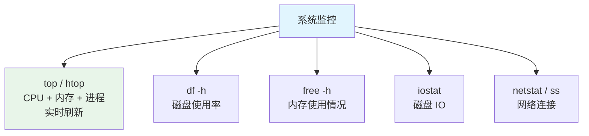
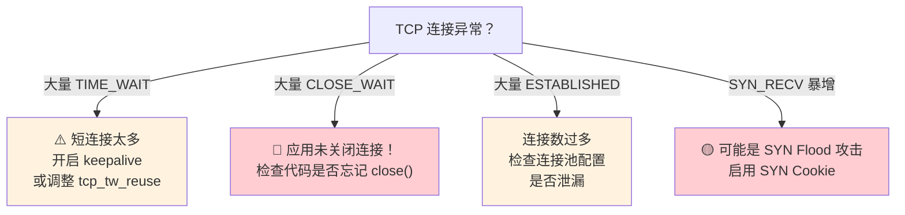

# Linux 常用命令

> 作为 Java 开发者，Linux 是你绕不过去的一道坎。服务器部署、日志查看、性能排查、进程管理——这些日常操作都需要 Linux 命令。这篇文章按场景分类整理了最常用的命令，不需要背，用多了自然就熟了。

## 文件与目录操作

### 基础命令速查

| 命令 | 说明 | 常用示例 |
|------|------|---------|
| `ls` | 列出目录内容 | `ls -la`（显示隐藏文件+详情） |
| `cd` | 切换目录 | `cd -`（回到上一个目录） |
| `pwd` | 显示当前路径 | `pwd` |
| `mkdir` | 创建目录 | `mkdir -p a/b/c`（递归创建） |
| `cp` | 复制 | `cp -r dir/ backup/`（递归复制目录） |
| `mv` | 移动/重命名 | `mv old.txt new.txt` |
| `rm` | 删除 | `rm -rf dir/`（⚠️ 递归强制删除，不可恢复） |
| `touch` | 创建空文件 | `touch a.txt b.txt` |
| `find` | 查找文件 | `find / -name "*.log" -mtime +7` |
| `ln` | 创建链接 | `ln -s target link`（软链接） |

### 高频查找场景

```bash
# 按名称查找
find /var/log -name "*.log"

# 按大小查找（大于 100MB 的文件）
find / -size +100M

# 按时间查找（7 天前修改过的文件）
find /tmp -mtime +7 -name "*.tmp"

# 按类型查找（d=目录, f=文件, l=链接）
find /opt -type d -name "java*"

# 查找后执行操作（删除 30 天前的日志）
find /var/log -name "*.log.gz" -mtime +30 -delete
```

---

## 文本处理三剑客

### grep — 文本搜索

```bash
# 基本搜索
grep "ERROR" app.log

# 忽略大小写
grep -i "error" app.log

# 显示行号
grep -n "Exception" app.log

# 显示匹配行及上下文（各 3 行）
grep -C 3 "NullPointerException" app.log

# 递归搜索目录
grep -r "spring.datasource" /etc/

# 排除某些文件
grep -r "TODO" --include="*.java" --exclude-dir="target" .

# 统计匹配行数
grep -c "ERROR" app.log

# 只显示匹配的部分（不显示整行）
grep -o "耗时: [0-9]*ms" app.log
```

### awk — 文本分析

```bash
# 打印指定列（默认空格/Tab 分隔）
awk '{print $1, $3}' access.log

# 指定分隔符
awk -F',' '{print $1, $2}' data.csv

# 条件过滤
awk '$9 >= 400 {print $1, $7, $9}' access.log   # 状态码 >= 400 的请求

# 统计
awk '{sum += $NF} END {print "Total: " sum}' numbers.txt

# 统计每个 IP 的访问次数
awk '{count[$1]++} END {for (ip in count) print ip, count[ip]}' access.log | sort -rn | head -10
```

### sed — 文本替换

```bash
# 替换（默认只替换每行第一个匹配）
sed 's/old/new/' file.txt

# 全局替换（每行所有匹配）
sed 's/old/new/g' file.txt

# 直接修改文件
sed -i 's/old/new/g' file.txt

# 删除匹配行
sed '/DEBUG/d' app.log

# 打印匹配行
sed -n '/ERROR/p' app.log

# 替换配置文件中的值
sed -i 's/server.port=8080/server.port=8081/' application.properties
```

::: tip 实战：分析日志的黄金组合
```bash
# 统计今天 ERROR 日志的数量
grep "ERROR" app.log | wc -l

# 查看今天最耗时的 10 个请求
grep "耗时" app.log | sort -t':' -k3 -rn | head -10

# 查看某个时间段内的日志
awk '$0 >= "10:00:00" && $0 <= "11:00:00"' app.log | grep "ERROR"

# 实时查看日志（类似 tail -f 但只看 ERROR）
tail -f app.log | grep --line-buffered "ERROR"
```
:::

---

## 进程管理

### ps — 查看进程

```bash
# 查看所有 Java 进程
ps -ef | grep java

# 查看某个端口被哪个进程占用
lsof -i :8080

# 或者用 ss
ss -tlnp | grep 8080

# 树形显示进程关系
pstree -p

# 按内存/CPU 排序查看进程
ps aux --sort=-%mem | head -10   # 内存 Top 10
ps aux --sort=-%cpu | head -10   # CPU Top 10
```

### 系统资源监控



| 命令 | 说明 | 常用示例 |
|------|------|---------|
| `top` | 实时进程监控 | `top -H`（显示线程） |
| `htop` | 增强版 top（需安装） | `htop` |
| `free` | 内存使用 | `free -h`（人类可读） |
| `df` | 磁盘使用 | `df -h`（人类可读） |
| `du` | 目录大小 | `du -sh /var/log/*` |
| `iostat` | 磁盘 IO | `iostat -x 1`（每秒刷新） |
| `vmstat` | 虚拟内存 | `vmstat 1`（每秒刷新） |
| `netstat` | 网络连接 | `netstat -tlnp`（监听端口） |

### kill — 终止进程

```bash
# 优雅终止（发送 SIGTERM，允许进程清理资源）
kill <pid>

# 强制终止（发送 SIGKILL，进程无法拒绝）
kill -9 <pid>

# 终止所有 Java 进程
killall java

# 终止指定名称的进程
pkill -f "my-app.jar"
```

::: warning 先 kill 再 kill -9
`kill -9` 是"强制杀死"，进程来不及清理资源（临时文件、数据库连接等），可能导致数据不一致。**永远先尝试 `kill`（SIGTERM）**，等几秒如果进程还在，再用 `kill -9`。
:::

---

## 网络排查

### 连接与端口

```bash
# 查看所有监听端口
ss -tlnp

# 查看某个端口的连接数
ss -tn state established '( dport = :8080 or sport = :8080 )' | wc -l

# 测试网络连通性
curl -v http://localhost:8080/actuator/health

# 跟踪路由
traceroute google.com

# DNS 查询
nslookup api.example.com

# 查看 TCP 连接状态分布
ss -s
```

### 网络连接状态排查



| 状态 | 含义 | 正常/异常 |
|------|------|----------|
| ESTABLISHED | 已建立连接 | 多了检查连接池 |
| TIME_WAIT | 主动关闭方等待 2MSL | 短时间大量出现需优化 |
| CLOSE_WAIT | 被动关闭方未关闭 | **异常！应用代码问题** |
| SYN_RECV | 收到 SYN 等待完成握手 | 大量出现可能是攻击 |

::: danger CLOSE_WAIT 是应用层的锅
CLOSE_WAIT 表示对方已关闭连接，但本地应用没有调用 `close()`。这几乎 100% 是**代码 Bug**：忘记关闭连接、连接池配置不当、异常分支没有释放资源。大量 CLOSE_WAIT 会导致文件描述符耗尽，服务无法建立新连接。
:::

---

## 磁盘与文件系统

### 磁盘空间排查

```bash
# 查看磁盘使用率
df -h

# 查看某个目录下各子目录大小
du -sh /var/log/*
du -sh /opt/*

# 查看 inode 使用情况（文件数上限）
df -i

# 查找大文件（Top 10）
find / -type f -size +100M -exec ls -lh {} \; | awk '{print $5, $9}' | sort -rh | head -10

# 查找被删除但仍被进程占用的文件（磁盘空间不释放的常见原因）
lsof +L1
```

::: warning 磁盘满了但 du 显示没用满？
常见原因：文件被 `rm` 删除了，但还有进程持有文件句柄，空间没释放。用 `lsof +L1` 找到这些文件，重启对应进程即可释放。这也是为什么建议用 `kill` 而不是直接删日志文件来清理空间。
:::

---

## 压缩与解压

| 命令 | 压缩 | 解压 |
|------|------|------|
| **tar.gz** | `tar -zcvf file.tar.gz dir/` | `tar -zxvf file.tar.gz` |
| **tar.bz2** | `tar -jcvf file.tar.bz2 dir/` | `tar -jxvf file.tar.bz2` |
| **zip** | `zip -r file.zip dir/` | `unzip file.zip` |

::: tip 参数速记
- `c` = create（创建）
- `x` = extract（解压）
- `v` = verbose（显示过程）
- `f` = file（指定文件名）
- `z` = gzip
- `j` = bzip2
- `r` = recursive（递归）
:::

---

## Shell 脚本基础

### 变量与条件判断

```bash
#!/bin/bash

# 变量（等号两边不能有空格）
APP_NAME="my-app"
JAR_PATH="/opt/app/${APP_NAME}.jar"
LOG_PATH="/var/log/${APP_NAME}.log"

# 条件判断
if [ -f "$JAR_PATH" ]; then
    echo "✅ 应用文件存在"
else
    echo "❌ 应用文件不存在"
    exit 1
fi

# 判断端口是否被占用
if ss -tlnp | grep -q ":8080 "; then
    echo "⚠️ 端口 8080 已被占用"
    exit 1
fi
```

### 常用运维脚本

::: details 应用启停脚本
```bash
#!/bin/bash
APP_NAME="my-app"
JAR_PATH="/opt/app/${APP_NAME}.jar"
PID_FILE="/var/run/${APP_NAME}.pid"
LOG_PATH="/var/log/${APP_NAME}.log"

# 获取 PID
get_pid() {
    if [ -f "$PID_FILE" ]; then
        cat "$PID_FILE"
    else
        pgrep -f "$JAR_PATH"
    fi
}

# 启动
start() {
    pid=$(get_pid)
    if [ -n "$pid" ]; then
        echo "⚠️ 应用已在运行，PID: $pid"
        return 1
    fi
    echo "🚀 启动应用..."
    nohup java -jar "$JAR_PATH" --spring.profiles.active=prod \
        > "$LOG_PATH" 2>&1 &
    echo $! > "$PID_FILE"
    echo "✅ 启动成功，PID: $(get_pid)"
}

# 停止
stop() {
    pid=$(get_pid)
    if [ -z "$pid" ]; then
        echo "⚠️ 应用未运行"
        return 1
    fi
    echo "🛑 停止应用，PID: $pid"
    kill "$pid"
    for i in {1..30}; do
        if ! kill -0 "$pid" 2>/dev/null; then
            echo "✅ 已停止"
            rm -f "$PID_FILE"
            return 0
        fi
        sleep 1
    done
    echo "⚠️ 优雅停止超时，强制终止"
    kill -9 "$pid"
    rm -f "$PID_FILE"
}

case "$1" in
    start)   start ;;
    stop)    stop ;;
    restart) stop; sleep 2; start ;;
    status)
        pid=$(get_pid)
        if [ -n "$pid" ]; then echo "✅ 运行中，PID: $pid"
        else echo "❌ 未运行"; fi
        ;;
    *) echo "Usage: $0 {start|stop|restart|status}" ;;
esac
```
:::

---

## 面试高频题

**Q1：如何查看某个端口被哪个进程占用？**

`lsof -i :8080` 或 `ss -tlnp | grep 8080`。`lsof` 更直观，会显示进程名和 PID。`ss` 更快，推荐在大量连接的环境中使用。

**Q2：服务器磁盘满了怎么办？**

`df -h` 确认哪个分区满了 → `du -sh /*` 找到大目录 → `du -sh /var/log/*` 继续缩小范围 → 清理日志/临时文件。注意：`rm` 删除的文件如果还被进程占用，空间不会释放，需要用 `lsof +L1` 找到并重启进程。

**Q3：如何实时查看日志？**

`tail -f app.log`（实时追加）。`tail -f app.log | grep ERROR`（只看 ERROR）。`tail -200f app.log`（先看最后 200 行再实时追加）。生产环境推荐用 ELK（Elasticsearch + Logstash + Kibana）做集中日志管理。

**Q4：CLOSE_WAIT 大量出现怎么办？**

CLOSE_WAIT 表示应用没有正确关闭连接。排查方向：① 检查代码是否有未关闭的连接（数据库连接、HTTP 连接） ② 检查连接池配置 ③ 使用 try-with-resources 确保资源释放 ④ 升级框架版本（某些旧版本有连接泄漏 Bug）。

## 延伸阅读

- [Nginx](nginx.md) — 反向代理、负载均衡
- [Docker & K8s](docker.md) — 容器化部署
- [CI/CD](cicd.md) — 自动化流水线
