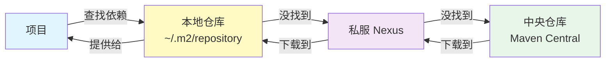
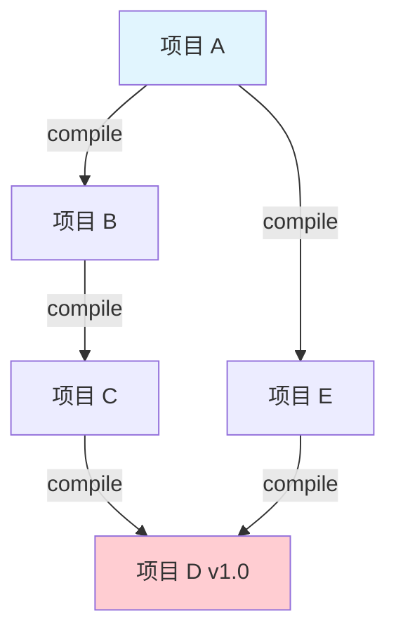
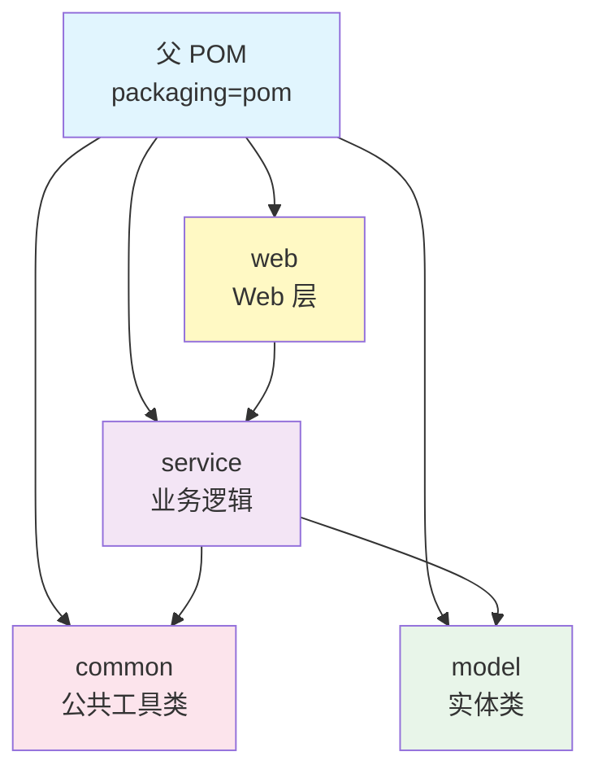
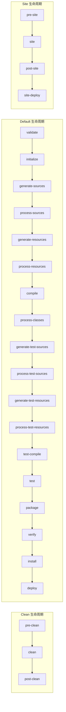

# Maven 项目管理

> Maven 不只是"用来下载 jar 包的"。理解 Maven 的生命周期、依赖传递、冲突解决机制，才能避免"为什么加了依赖还是报错"这种问题。这篇文章从基础到实战，把 Maven 讲透。

## 基础入门

### Maven 是什么？解决了什么问题？

在 Maven 出现之前，Java 项目的构建管理基本靠手动——去官网下载 jar 包、手动放到 `lib` 目录、处理依赖冲突、写 Ant 脚本打包。每个项目都有自己的"野路子"，换个人接手就一脸懵。

Maven 的核心定位是一个**项目管理和构建自动化工具**，它解决了三个核心问题：

```
Maven 解决的三大问题：
┌─────────────────────────────────────────────────┐
│  1. 依赖管理 → pom.xml 声明依赖，自动下载传递依赖  │
│  2. 统一构建 → 一条命令 mvn clean package 搞定    │
│  3. 项目规范 → 约定大于配置，目录结构标准化        │
└─────────────────────────────────────────────────┘
```

Maven 的设计哲学是**约定优于配置（Convention over Configuration）**，也就是说你不需要告诉它源码在哪、编译输出在哪，它有一套默认的约定。当然，你也可以覆盖这些约定，但大多数时候用默认的就够了。

### Maven vs Gradle 对比

先聊一个最常见的问题：**Maven 和 Gradle 到底选哪个？**

| 对比项 | Maven | Gradle |
|--------|-------|--------|
| 配置语言 | XML | Groovy / Kotlin DSL |
| 学习曲线 | 低，XML 直观 | 中等，需要学 DSL |
| 构建速度 | 较慢（全量构建） | 快（增量构建 + 构建缓存） |
| 依赖管理 | 稳定成熟 | 灵活强大 |
| 多模块支持 | 完善 | 完善 |
| 生态 | 大量插件，文档丰富 | 插件生态在增长 |
| Android 开发 | 不支持 | 官方推荐 |
| Spring Boot | 官方支持 | 官方支持 |

::: tip 选择建议
- **企业后端项目、团队规范要求高** → Maven，稳定可靠，新人上手快
- **微服务项目、构建速度敏感、需要灵活定制** → Gradle，性能优势明显
- **Android 开发** → 没得选，Gradle
- **新项目从零开始** → 如果团队没有历史包袱，可以试试 Gradle；如果团队习惯 Maven，就别折腾了
:::

### 安装与配置

#### 安装 Maven

```bash
# macOS（Homebrew）
brew install maven

# Linux（Ubuntu/Debian）
sudo apt install maven

# 手动安装
# 1. 下载 https://maven.apache.org/download.cgi
# 2. 解压到 /opt/maven
# 3. 配置环境变量
```

#### 环境变量配置

```bash
# ~/.zshrc 或 ~/.bash_profile
export MAVEN_HOME=/opt/maven/apache-maven-3.9.6
export PATH=$MAVEN_HOME/bin:$PATH

# 验证安装
mvn -v
# Apache Maven 3.9.6 (bc0240f3c744dd6b6ec2920b3cd08dcc295161ae)
# Maven home: /opt/maven/apache-maven-3.9.6
# Java version: 17.0.9, vendor: Oracle Corporation
```

::: warning JDK 版本注意
Maven 本身需要 JDK 来运行。Maven 3.9+ 需要 JDK 8+，但建议使用 JDK 11 或 17。如果你的项目用 JDK 21，也没问题——Maven 版本和项目 JDK 版本是独立的。
:::

#### settings.xml 配置

settings.xml 有两个位置：
- **全局**：`$MAVEN_HOME/conf/settings.xml`（影响所有用户）
- **用户**：`~/.m2/settings.xml`（只影响当前用户，推荐）

```xml
<?xml version="1.0" encoding="UTF-8"?>
<settings xmlns="http://maven.apache.org/SETTINGS/1.2.0"
          xmlns:xsi="http://www.w3.org/2001/XMLSchema-instance"
          xsi:schemaLocation="http://maven.apache.org/SETTINGS/1.2.0
          https://maven.apache.org/xsd/settings-1.2.0.xsd">

    <!-- 本地仓库路径，默认 ~/.m2/repository -->
    <localRepository>${user.home}/.m2/repository</localRepository>

    <!-- 镜像源配置 -->
    <mirrors>
        <mirror>
            <id>aliyunmaven</id>
            <mirrorOf>*</mirrorOf>
            <name>阿里云公共仓库</name>
            <url>https://maven.aliyun.com/repository/public</url>
        </mirror>
    </mirrors>

    <!-- 发布到私服的认证信息 -->
    <servers>
        <server>
            <id>nexus-releases</id>
            <username>admin</username>
            <password>admin123</password>
        </server>
        <server>
            <id>nexus-snapshots</id>
            <username>admin</username>
            <password>admin123</password>
        </server>
    </servers>

    <!-- 全局 profile -->
    <profiles>
        <profile>
            <id>jdk-17</id>
            <activation>
                <activeByDefault>true</activeByDefault>
            </activation>
            <properties>
                <maven.compiler.source>17</maven.compiler.source>
                <maven.compiler.target>17</maven.compiler.target>
            </properties>
        </profile>
    </profiles>
</settings>
```

::: details 阿里云镜像推荐配置
阿里云 Maven 镜像提供了多个仓库，推荐配置 `public` 聚合仓库，它包含了 central、jcenter、google 等多个仓库的代理：

```xml
<mirror>
    <id>aliyunmaven</id>
    <mirrorOf>*</mirrorOf>
    <name>阿里云公共仓库</name>
    <url>https://maven.aliyun.com/repository/public</url>
</mirror>
```

`mirrorOf` 的值：
- `*`：代理所有仓库
- `central`：只代理 Maven Central
- `repo1,repo2`：代理指定的多个仓库
- `*,!repo1`：代理除 repo1 外的所有仓库

国内用阿里云镜像，依赖下载速度能提升 10 倍以上，别犹豫，直接配。
:::

### Maven 坐标（GAV）

Maven 用**坐标（Coordinates）** 来唯一标识一个项目或依赖，也叫 GAV：

```xml
<groupId>com.example</groupId>      <!-- 组织/公司标识，通常是域名反写 -->
<artifactId>my-project</artifactId> <!-- 项目名称 -->
<version>1.0.0</version>            <!-- 版本号 -->
```

版本号命名规范：

```
1.0.0         → 正式发布版本（Release）
1.0.0-SNAPSHOT → 快照版本（开发中，可变）
1.0.0-RC1     → 发布候选版本（Release Candidate）
1.0.0-BETA1   → 测试版本
1.0.0-ALPHA1  → 内测版本
```

::: tip SNAPSHOT vs Release
- **SNAPSHOT**：每次构建都会检查远程仓库是否有更新，开发阶段用
- **Release**：版本固定不变，发布阶段用
- 从 SNAPSHOT 升级到 Release 就是"发布"，之后这个版本就不能再被覆盖
:::

### Maven 仓库



- **本地仓库**：默认 `~/.m2/repository`，本地缓存所有下载过的依赖
- **私服（Nexus）**：公司内部搭建，缓存公共依赖 + 存放公司内部 jar 包
- **中央仓库（Maven Central）**：Maven 官方维护的公共仓库，包含绝大多数开源库

### 目录结构约定

Maven 有一套标准的目录结构，几乎所有 Java 项目都遵循这个约定：

```
my-project/
├── pom.xml                          # 项目配置文件
├── src/
│   ├── main/
│   │   ├── java/                    # Java 源码
│   │   │   └── com/example/
│   │   │       └── Application.java
│   │   └── resources/               # 资源文件（配置文件等）
│   │       ├── application.yml
│   │       └── mapper/
│   │           └── UserMapper.xml
│   └── test/
│       ├── java/                    # 测试代码
│       │   └── com/example/
│       │       └── ApplicationTest.java
│       └── resources/               # 测试资源文件
│           └── application-test.yml
└── target/                          # 编译输出目录（自动生成）
    ├── classes/                     # 编译后的 class 文件
    ├── test-classes/                # 编译后的测试 class 文件
    └── my-project-1.0.0.jar         # 打包结果
```

::: warning 不要修改默认目录
Maven 的编译插件、打包插件、IDE 导入都依赖这套目录结构。如果你非要改（比如把源码放到 `src/java`），那就要在 pom.xml 里额外配置 `<sourceDirectory>`，还得让所有团队成员的 IDE 也跟着改。别给自己找麻烦。
:::

## POM 文件详解

### pom.xml 完整结构

POM（Project Object Model）是 Maven 的核心，一个完整的 pom.xml 长这样：

```xml
<?xml version="1.0" encoding="UTF-8"?>
<project xmlns="http://maven.apache.org/POM/4.0.0"
         xmlns:xsi="http://www.w3.org/2001/XMLSchema-instance"
         xsi:schemaLocation="http://maven.apache.org/POM/4.0.0
         https://maven.apache.org/xsd/maven-4.0.0.xsd">

    <modelVersion>4.0.0</modelVersion>

    <!-- 继承父 POM -->
    <parent>
        <groupId>org.springframework.boot</groupId>
        <artifactId>spring-boot-starter-parent</artifactId>
        <version>3.2.0</version>
        <relativePath/>  <!-- 从中央仓库查找，不从本地查找 -->
    </parent>

    <!-- 项目坐标 -->
    <groupId>com.example</groupId>
    <artifactId>my-project</artifactId>
    <version>1.0.0-SNAPSHOT</version>
    <packaging>jar</packaging>

    <!-- 项目描述 -->
    <name>My Project</name>
    <description>A sample Spring Boot project</description>

    <!-- 属性定义 -->
    <properties>
        <java.version>17</java.version>
        <project.build.sourceEncoding>UTF-8</project.build.sourceEncoding>
        <mybatis-spring-boot.version>3.0.3</mybatis-spring-boot.version>
    </properties>

    <!-- 依赖声明 -->
    <dependencies>
        <dependency>
            <groupId>org.springframework.boot</groupId>
            <artifactId>spring-boot-starter-web</artifactId>
        </dependency>
        <dependency>
            <groupId>org.springframework.boot</groupId>
            <artifactId>spring-boot-starter-test</artifactId>
            <scope>test</scope>
        </dependency>
    </dependencies>

    <!-- 依赖版本管理（不实际引入） -->
    <dependencyManagement>
        <dependencies>
            <dependency>
                <groupId>com.baomidou</groupId>
                <artifactId>mybatis-plus-boot-starter</artifactId>
                <version>${mybatis-spring-boot.version}</version>
            </dependency>
        </dependencies>
    </dependencyManagement>

    <!-- 构建配置 -->
    <build>
        <finalName>${project.artifactId}</finalName>
        <plugins>
            <plugin>
                <groupId>org.springframework.boot</groupId>
                <artifactId>spring-boot-maven-plugin</artifactId>
            </plugin>
        </plugins>
    </build>

    <!-- 仓库配置 -->
    <repositories>
        <repository>
            <id>central</id>
            <url>https://maven.aliyun.com/repository/public</url>
        </repository>
    </repositories>

    <!-- 发布配置 -->
    <distributionManagement>
        <repository>
            <id>nexus-releases</id>
            <url>http://nexus.example.com/repository/maven-releases/</url>
        </repository>
        <snapshotRepository>
            <id>nexus-snapshots</id>
            <url>http://nexus.example.com/repository/maven-snapshots/</url>
        </snapshotRepository>
    </distributionManagement>
</project>
```

### 各元素详解

#### packaging（打包方式）

```xml
<packaging>jar</packaging>
```

| 打包类型 | 说明 |
|---------|------|
| `jar` | 默认值，打包为 jar 文件 |
| `war` | 打包为 war 文件，用于传统 Web 项目 |
| `pom` | 父 POM 或聚合 POM，不产生构建产物 |
| `ear` | Java EE 企业应用 |
| `maven-plugin` | Maven 插件项目 |

#### Maven 属性分类

Maven 中可以用 `${}` 引用属性，属性有四类：

```xml
<properties>
    <!-- 1. 自定义属性 -->
    <java.version>17</java.version>
    <spring-boot.version>3.2.0</spring-boot.version>
</properties>

<!-- 使用 -->
<dependency>
    <version>${spring-boot.version}</version>
</dependency>
```

```xml
<!-- 2. 内置属性 -->
${basedir}                  <!-- 项目根目录 -->
${project.basedir}          <!-- 同上 -->
${project.build.directory}  <!-- target 目录 -->
${project.build.sourceDirectory}  <!-- src/main/java -->
${project.name}             <!-- 项目名称 -->
${project.version}          <!-- 项目版本 -->
${project.groupId}          <!-- 项目 groupId -->
${project.artifactId}       <!-- 项目 artifactId -->

<!-- 3. POM 属性（以 project. 开头） -->
${project.dependencies[0].version}  <!-- 第一个依赖的版本 -->

<!-- 4. Settings 属性（以 settings. 开头） -->
${settings.localRepository}         <!-- 本地仓库路径 -->
```

::: tip 属性引用的最佳实践
版本号统一用 `<properties>` 管理，别在多个地方硬编码版本号。改一个版本要改 10 个地方，那种痛谁经历过谁知道。
:::

### Profile 多环境配置

实际项目中，开发、测试、生产环境的配置往往不同。Maven Profile 就是干这个的：

```xml
<profiles>
    <!-- 开发环境 -->
    <profile>
        <id>dev</id>
        <activation>
            <activeByDefault>true</activeByDefault>
        </activation>
        <properties>
            <env>dev</env>
            <spring.profiles.active>dev</spring.profiles.active>
        </properties>
    </profile>

    <!-- 测试环境 -->
    <profile>
        <id>test</id>
        <properties>
            <env>test</env>
            <spring.profiles.active>test</spring.profiles.active>
        </properties>
    </profile>

    <!-- 生产环境 -->
    <profile>
        <id>prod</id>
        <properties>
            <env>prod</env>
            <spring.profiles.active>prod</spring.profiles.active>
        </properties>
        <build>
            <resources>
                <resource>
                    <directory>src/main/resources</directory>
                    <filtering>true</filtering>
                    <excludes>
                        <exclude>application-dev.yml</exclude>
                        <exclude>application-test.yml</exclude>
                    </excludes>
                </resource>
                <resource>
                    <directory>src/main/resources-${env}</directory>
                    <filtering>true</filtering>
                </resource>
            </resources>
        </build>
    </profile>
</profiles>
```

```bash
# 使用指定 profile 打包
mvn clean package -P prod
mvn clean package -P test
mvn clean package              # 默认使用 dev（activeByDefault）
```

### Resource 资源过滤

Maven 默认不会替换资源文件中的 `${}` 占位符，但开启资源过滤后就会：

```xml
<build>
    <resources>
        <resource>
            <directory>src/main/resources</directory>
            <filtering>true</filtering>  <!-- 开启过滤 -->
            <includes>
                <include>**/*.yml</include>
                <include>**/*.properties</include>
            </includes>
        </resource>
        <resource>
            <directory>src/main/resources</directory>
            <filtering>false</filtering> <!-- 不过滤的文件 -->
            <excludes>
                <exclude>**/*.yml</exclude>
                <exclude>**/*.properties</exclude>
            </excludes>
        </resource>
    </resources>
</build>
```

```yaml
# application.yml 中使用 Maven 属性
spring:
  profiles:
    active: @spring.profiles.active@
  datasource:
    url: jdbc:mysql://localhost:3306/mydb_${env}
```

::: warning Maven 资源过滤 vs Spring Profile
这两个是不同层面的东西：
- **Maven 资源过滤**：构建时替换占位符，打包后文件内容就固定了
- **Spring Profile**：运行时根据 `spring.profiles.active` 加载不同的配置文件

两者可以结合使用，也可以只用其中一个。大多数 Spring Boot 项目只用 Spring Profile 就够了，Maven Profile 用于打包不同环境部署包的场景。
:::

## 依赖管理

### 依赖声明

```xml
<dependency>
    <groupId>org.springframework.boot</groupId>
    <artifactId>spring-boot-starter-web</artifactId>
    <version>3.2.0</version>
    <scope>compile</scope>       <!-- 依赖范围 -->
    <optional>true</optional>     <!-- 可选依赖 -->
    <exclusions>                  <!-- 排除传递依赖 -->
        <exclusion>
            <groupId>org.springframework.boot</groupId>
            <artifactId>spring-boot-starter-tomcat</artifactId>
        </exclusion>
    </exclusions>
</dependency>
```

### 依赖范围（Scope）

Scope 决定了依赖在什么阶段可用，以及是否会被传递给依赖此项目的其他模块：

| Scope | 编译 | 测试 | 运行 | 打包 | 是否传递 | 典型场景 |
|-------|:----:|:----:|:----:|:----:|:------:|---------|
| compile（默认） | ✅ | ✅ | ✅ | ✅ | ✅ | spring-boot-starter-web |
| provided | ✅ | ✅ | ❌ | ❌ | ❌ | javax.servlet-api |
| runtime | ❌ | ✅ | ✅ | ✅ | ✅ | MySQL 驱动、SLF4J 实现 |
| test | ❌ | ✅ | ❌ | ❌ | ❌ | JUnit、Mockito |
| system | ✅ | ✅ | ❌ | ❌ | ❌ | 本地 jar 包（不推荐） |
| import | — | — | — | — | — | BOM 依赖管理 |

```mermaid
graph TD
    subgraph compile
        A1[编译时可用] --> A2[测试时可用]
        A2 --> A3[运行时可用]
        A3 --> A4[会被打包]
        A4 --> A5[会传递]
    end

    subgraph provided
        B1[编译时可用] --> B2[测试时可用]
        B2 -.->|❌| B3[运行时不可用]
        B3 -.->|❌| B4[不会被打包]
        B4 -.->|❌| B5[不会传递]
    end

    subgraph runtime
        C1[编译时不可用] -.->|❌| C2[测试时可用]
        C2 --> C3[运行时可用]
        C3 --> C4[会被打包]
        C4 --> C5[会传递]
    end

    subgraph test
        D1[编译时不可用] -.->|❌| D2[测试时可用]
        D2 -.->|❌| D3[运行时不可用]
        D3 -.->|❌| D4[不会被打包]
        D4 -.->|❌| D5[不会传递]
    end
```



::: details 各 Scope 的传递性依赖规则
当项目 A 依赖 B（scope 为 X），B 依赖 C（scope 为 Y），C 是否会传递到 A 取决于 X 和 Y 的组合：

| B→C 的 scope ↓ \ A→B 的 scope → | compile | provided | runtime | test |
|:---:|:---:|:---:|:---:|:---:|
| **compile** | ✅ compile | ❌ | ✅ runtime | ❌ |
| **provided** | ❌ | ❌ | ❌ | ❌ |
| **runtime** | ✅ runtime | ❌ | ✅ runtime | ❌ |
| **test** | ❌ | ❌ | ❌ | ❌ |

规则总结：
- `provided` 和 `test` scope 的依赖永远不会被传递
- `compile` 传递过去保持 `compile`
- `runtime` 传递过去变成 `runtime`
:::

### 依赖传递

依赖传递是 Maven 最方便也最容易出问题的地方：



上图中，项目 A 通过 B→C→D 依赖了 D 2.0，通过 E→D 依赖了 D 1.0，这就产生了**依赖冲突**。

### 依赖冲突与解决

Maven 解决依赖冲突有两条规则：

**规则一：最短路径优先**

```
A → B → C → D(2.0)    路径长度 3
A → E → D(1.0)         路径长度 2  ← 胜出！
结果：D 1.0 被使用
```

**规则二：路径相同，先声明优先**

```
A → B → D(2.0)    先声明
A → C → D(1.0)    后声明
结果：D 2.0 被使用
```

::: tip 排查依赖冲突的方法
1. `mvn dependency:tree` 查看完整依赖树
2. IDEA 安装 **Maven Helper** 插件，可视化查看冲突
3. 用 `mvn dependency:tree -Dverbose -Dincludes=groupId:artifactId` 精确查找某个依赖
4. 在 IDEA 中打开 pom.xml 的 **Dependency Analyzer** 视图
:::

### 排除依赖（exclusions）

当你需要排除某个传递依赖时，用 `<exclusions>`：

```xml
<dependency>
    <groupId>org.springframework.boot</groupId>
    <artifactId>spring-boot-starter-web</artifactId>
    <exclusions>
        <!-- 排除内嵌 Tomcat，改用 Undertow -->
        <exclusion>
            <groupId>org.springframework.boot</groupId>
            <artifactId>spring-boot-starter-tomcat</artifactId>
        </exclusion>
    </exclusions>
</dependency>

<!-- 手动引入 Undertow -->
<dependency>
    <groupId>org.springframework.boot</groupId>
    <artifactId>spring-boot-starter-undertow</artifactId>
</dependency>
```

### 可选依赖（optional）

```xml
<dependency>
    <groupId>org.projectlombok</groupId>
    <artifactId>lombok</artifactId>
    <version>1.18.30</version>
    <optional>true</optional>
</dependency>
```

::: warning optional 不等于 scope=test
- `optional=true`：编译和运行时都可用，但**不会传递**给依赖此项目的模块
- `scope=test`：只在测试时可用

典型场景：你的库内部用了 Lombok，但使用你库的项目不一定需要 Lombok。设为 optional，让使用者自己决定要不要引入。
:::

### 依赖版本锁定（BOM）

BOM（Bill of Materials）是一种集中管理依赖版本的方式，Spring Boot 就大量使用：

```xml
<dependencyManagement>
    <dependencies>
        <!-- 导入 Spring Boot BOM，统一管理所有 Spring Boot 组件版本 -->
        <dependency>
            <groupId>org.springframework.boot</groupId>
            <artifactId>spring-boot-dependencies</artifactId>
            <version>3.2.0</version>
            <type>pom</type>
            <scope>import</scope>
        </dependency>

        <!-- 导入自定义 BOM -->
        <dependency>
            <groupId>com.example</groupId>
            <artifactId>my-bom</artifactId>
            <version>1.0.0</version>
            <type>pom</type>
            <scope>import</scope>
        </dependency>
    </dependencies>
</dependencyManagement>

<!-- 子模块中使用时不需要写版本号 -->
<dependencies>
    <dependency>
        <groupId>org.springframework.boot</groupId>
        <artifactId>spring-boot-starter-web</artifactId>
        <!-- 版本号由 BOM 管理，不用写 -->
    </dependency>
</dependencies>
```

::: tip dependencyManagement + BOM import 的好处
1. **版本统一**：一个地方改版本，所有模块同步生效
2. **避免版本冲突**：由 BOM 保证各依赖版本兼容
3. **简化 pom.xml**：子模块不用写版本号
4. **升级方便**：升级 Spring Boot 只需改 BOM 版本
:::

### 查看依赖树

```bash
# 查看完整依赖树
mvn dependency:tree

# 查看指定模块的依赖树
mvn dependency:tree -pl service

# 查找某个特定依赖的来源
mvn dependency:tree -Dincludes=com.fasterxml.jackson.core:jackson-databind

# 查看详细依赖树（包含冲突信息）
mvn dependency:tree -Dverbose

# 输出到文件
mvn dependency:tree -DoutputFile=deps.txt
```

输出示例：

```
com.example:my-project:jar:1.0.0
├─ org.springframework.boot:spring-boot-starter-web:jar:3.2.0:compile
│  ├─ org.springframework.boot:spring-boot-starter-json:jar:3.2.0:compile
│  │  ├─ com.fasterxml.jackson.core:jackson-databind:jar:2.15.3:compile
│  │  │  ├─ com.fasterxml.jackson.core:jackson-annotations:jar:2.15.3:compile
│  │  │  └─ com.fasterxml.jackson.core:jackson-core:jar:2.15.3:compile
│  ├─ org.springframework:spring-web:jar:6.1.1:compile
│  └─ org.springframework:spring-webmvc:jar:6.1.1:compile
└─ org.springframework.boot:spring-boot-starter-test:jar:3.2.0:test
```

### mvn dependency:analyze

这个命令能帮你发现两个问题：

```bash
mvn dependency:analyze
```

输出：

```
[WARNING] Used undeclared dependencies found:
   org.springframework:spring-web     ← 用了但没声明
   com.fasterxml.jackson.core:jackson-databind

[WARNING] Unused declared dependencies found:
   commons-io:commons-io              ← 声明了但没用
   org.apache.commons:commons-lang3
```

::: danger 关于 "Used undeclared dependencies"
这种情况更危险——你的代码直接用了一个依赖，但没有在 pom.xml 里声明。它之所以能用，是因为某个传递依赖把它带了进来。一旦那个传递依赖变了，你的代码就编译不过了。**一定要显式声明你直接使用的依赖。**
:::

::: tip 关于 "Unused declared dependencies"
这种情况不一定需要处理。有些依赖是运行时才用到的（比如 JDBC 驱动），静态分析检测不到。删之前确认一下是不是运行时依赖。
:::

### 依赖范围实战案例

一个典型的 Spring Boot 项目中，各种 scope 的使用：

```xml
<dependencies>
    <!-- compile（默认）：核心业务依赖 -->
    <dependency>
        <groupId>org.springframework.boot</groupId>
        <artifactId>spring-boot-starter-web</artifactId>
    </dependency>

    <!-- provided：容器已提供，打包时排除 -->
    <dependency>
        <groupId>jakarta.servlet</groupId>
        <artifactId>jakarta.servlet-api</artifactId>
        <scope>provided</scope>
    </dependency>

    <!-- runtime：编译不需要，运行需要 -->
    <dependency>
        <groupId>com.mysql</groupId>
        <artifactId>mysql-connector-j</artifactId>
        <scope>runtime</scope>
    </dependency>

    <!-- test：只在测试时使用 -->
    <dependency>
        <groupId>org.springframework.boot</groupId>
        <artifactId>spring-boot-starter-test</artifactId>
        <scope>test</scope>
    </dependency>

    <!-- optional：不传递给使用者 -->
    <dependency>
        <groupId>org.projectlombok</groupId>
        <artifactId>lombok</artifactId>
        <optional>true</optional>
    </dependency>
</dependencies>
```

## 多模块项目

### 父 POM + 子模块结构

当一个项目变得复杂时，通常会拆分成多个模块。Maven 的多模块机制通过**继承（parent）**和**聚合（modules）**来实现：



### 继承（parent）与聚合（modules）

**继承**：子模块继承父 POM 的配置（版本号、插件配置等）
**聚合**：父 POM 通过 `<modules>` 把子模块关联起来，一次构建所有模块

```xml
<!-- 父 POM：同时实现继承和聚合 -->
<project>
    <groupId>com.example</groupId>
    <artifactId>parent</artifactId>
    <version>1.0.0-SNAPSHOT</version>
    <packaging>pom</packaging>

    <!-- 聚合：列出所有子模块 -->
    <modules>
        <module>common</module>
        <module>model</module>
        <module>service</module>
        <module>web</module>
    </modules>

    <!-- 依赖版本管理 -->
    <dependencyManagement>
        <dependencies>
            <!-- 所有子模块的版本号在这里统一管理 -->
        </dependencies>
    </dependencyManagement>
</project>
```

### dependencyManagement vs dependencies

这是面试高频题，也是实际开发中最容易搞混的地方：

| | dependencyManagement | dependencies |
|--|---------------------|-------------|
| **作用** | 声明版本，不实际引入 | 实际引入依赖 |
| **子模块是否自动继承** | ❌ 不会 | ✅ 会 |
| **子模块需要写版本号** | 不需要（已声明版本） | 不需要（已实际引入） |
| **典型用途** | 版本号统一管理 | 所有模块都需要的基础依赖 |

::: tip 什么时候用 dependencyManagement？什么时候用 dependencies？
- **dependencyManagement**：不是所有模块都需要这个依赖，但需要统一版本（比如数据库驱动，common 模块不需要，但 service 模块需要）
- **dependencies**：所有模块都需要这个依赖（比如 Lombok、SLF4J、JUnit），放在父 POM 的 dependencies 里，子模块自动继承
:::

### 实战：完整的 Spring Boot 多模块项目

#### 项目结构

```
my-project/
├── pom.xml                    # 父 POM
├── common/                    # 公共模块
│   ├── pom.xml
│   └── src/main/java/com/example/common/
├── model/                     # 实体模块
│   ├── pom.xml
│   └── src/main/java/com/example/model/
├── service/                   # 业务模块
│   ├── pom.xml
│   └── src/main/java/com/example/service/
└── web/                       # Web 模块（启动类在这里）
    ├── pom.xml
    └── src/main/java/com/example/
```

#### 父 POM

```xml
<?xml version="1.0" encoding="UTF-8"?>
<project xmlns="http://maven.apache.org/POM/4.0.0"
         xmlns:xsi="http://www.w3.org/2001/XMLSchema-instance"
         xsi:schemaLocation="http://maven.apache.org/POM/4.0.0
         https://maven.apache.org/xsd/maven-4.0.0.xsd">

    <modelVersion>4.0.0</modelVersion>

    <groupId>com.example</groupId>
    <artifactId>parent</artifactId>
    <version>1.0.0-SNAPSHOT</version>
    <packaging>pom</packaging>

    <modules>
        <module>common</module>
        <module>model</module>
        <module>service</module>
        <module>web</module>
    </modules>

    <properties>
        <java.version>17</java.version>
        <spring-boot.version>3.2.0</spring-boot.version>
        <mybatis-plus.version>3.5.5</mybatis-plus.version>
        <hutool.version>5.8.25</hutool.version>
    </properties>

    <dependencyManagement>
        <dependencies>
            <!-- Spring Boot BOM -->
            <dependency>
                <groupId>org.springframework.boot</groupId>
                <artifactId>spring-boot-dependencies</artifactId>
                <version>${spring-boot.version}</version>
                <type>pom</type>
                <scope>import</scope>
            </dependency>

            <!-- 子模块依赖 -->
            <dependency>
                <groupId>com.example</groupId>
                <artifactId>common</artifactId>
                <version>${project.version}</version>
            </dependency>
            <dependency>
                <groupId>com.example</groupId>
                <artifactId>model</artifactId>
                <version>${project.version}</version>
            </dependency>
            <dependency>
                <groupId>com.example</groupId>
                <artifactId>service</artifactId>
                <version>${project.version}</version>
            </dependency>

            <!-- 第三方依赖版本管理 -->
            <dependency>
                <groupId>com.baomidou</groupId>
                <artifactId>mybatis-plus-spring-boot3-starter</artifactId>
                <version>${mybatis-plus.version}</version>
            </dependency>
            <dependency>
                <groupId>cn.hutool</groupId>
                <artifactId>hutool-all</artifactId>
                <version>${hutool.version}</version>
            </dependency>
        </dependencies>
    </dependencyManagement>

    <!-- 所有子模块都需要的依赖 -->
    <dependencies>
        <dependency>
            <groupId>org.projectlombok</groupId>
            <artifactId>lombok</artifactId>
            <optional>true</optional>
        </dependency>
    </dependencies>

    <build>
        <pluginManagement>
            <plugins>
                <plugin>
                    <groupId>org.springframework.boot</groupId>
                    <artifactId>spring-boot-maven-plugin</artifactId>
                    <version>${spring-boot.version}</version>
                    <configuration>
                        <excludes>
                            <exclude>
                                <groupId>org.projectlombok</groupId>
                                <artifactId>lombok</artifactId>
                            </exclude>
                        </excludes>
                    </configuration>
                </plugin>
            </plugins>
        </pluginManagement>
    </build>
</project>
```

#### common 模块

```xml
<?xml version="1.0" encoding="UTF-8"?>
<project xmlns="http://maven.apache.org/POM/4.0.0"
         xmlns:xsi="http://www.w3.org/2001/XMLSchema-instance"
         xsi:schemaLocation="http://maven.apache.org/POM/4.0.0
         https://maven.apache.org/xsd/maven-4.0.0.xsd">

    <modelVersion>4.0.0</modelVersion>

    <parent>
        <groupId>com.example</groupId>
        <artifactId>parent</artifactId>
        <version>1.0.0-SNAPSHOT</version>
    </parent>

    <artifactId>common</artifactId>
    <description>公共工具模块</description>

    <dependencies>
        <dependency>
            <groupId>cn.hutool</groupId>
            <artifactId>hutool-all</artifactId>
        </dependency>
        <dependency>
            <groupId>org.springframework.boot</groupId>
            <artifactId>spring-boot-starter-web</artifactId>
        </dependency>
    </dependencies>
</project>
```

#### model 模块

```xml
<?xml version="1.0" encoding="UTF-8"?>
<project xmlns="http://maven.apache.org/POM/4.0.0"
         xmlns:xsi="http://www.w3.org/2001/XMLSchema-instance"
         xsi:schemaLocation="http://maven.apache.org/POM/4.0.0
         https://maven.apache.org/xsd/maven-4.0.0.xsd">

    <modelVersion>4.0.0</modelVersion>

    <parent>
        <groupId>com.example</groupId>
        <artifactId>parent</artifactId>
        <version>1.0.0-SNAPSHOT</version>
    </parent>

    <artifactId>model</artifactId>
    <description>实体类模块</description>

    <dependencies>
        <dependency>
            <groupId>com.example</groupId>
            <artifactId>common</artifactId>
        </dependency>
        <dependency>
            <groupId>com.baomidou</groupId>
            <artifactId>mybatis-plus-spring-boot3-starter</artifactId>
        </dependency>
    </dependencies>
</project>
```

#### service 模块

```xml
<?xml version="1.0" encoding="UTF-8"?>
<project xmlns="http://maven.apache.org/POM/4.0.0"
         xmlns:xsi="http://www.w3.org/2001/XMLSchema-instance"
         xsi:schemaLocation="http://maven.apache.org/POM/4.0.0
         https://maven.apache.org/xsd/maven-4.0.0.xsd">

    <modelVersion>4.0.0</modelVersion>

    <parent>
        <groupId>com.example</groupId>
        <artifactId>parent</artifactId>
        <version>1.0.0-SNAPSHOT</version>
    </parent>

    <artifactId>service</artifactId>
    <description>业务逻辑模块</description>

    <dependencies>
        <dependency>
            <groupId>com.example</groupId>
            <artifactId>model</artifactId>
        </dependency>
        <dependency>
            <groupId>com.example</groupId>
            <artifactId>common</artifactId>
        </dependency>
        <dependency>
            <groupId>com.baomidou</groupId>
            <artifactId>mybatis-plus-spring-boot3-starter</artifactId>
        </dependency>
        <dependency>
            <groupId>com.mysql</groupId>
            <artifactId>mysql-connector-j</artifactId>
            <scope>runtime</scope>
        </dependency>
        <dependency>
            <groupId>org.springframework.boot</groupId>
            <artifactId>spring-boot-starter-test</artifactId>
            <scope>test</scope>
        </dependency>
    </dependencies>
</project>
```

#### web 模块

```xml
<?xml version="1.0" encoding="UTF-8"?>
<project xmlns="http://maven.apache.org/POM/4.0.0"
         xmlns:xsi="http://www.w3.org/2001/XMLSchema-instance"
         xsi:schemaLocation="http://maven.apache.org/POM/4.0.0
         https://maven.apache.org/xsd/maven-4.0.0.xsd">

    <modelVersion>4.0.0</modelVersion>

    <parent>
        <groupId>com.example</groupId>
        <artifactId>parent</artifactId>
        <version>1.0.0-SNAPSHOT</version>
    </parent>

    <artifactId>web</artifactId>
    <description>Web 层模块</description>

    <dependencies>
        <dependency>
            <groupId>com.example</groupId>
            <artifactId>service</artifactId>
        </dependency>
        <dependency>
            <groupId>org.springframework.boot</groupId>
            <artifactId>spring-boot-starter-web</artifactId>
        </dependency>
    </dependencies>

    <build>
        <plugins>
            <plugin>
                <groupId>org.springframework.boot</groupId>
                <artifactId>spring-boot-maven-plugin</artifactId>
            </plugin>
        </plugins>
    </build>
</project>
```

::: tip 多模块构建顺序
Maven 会根据模块间的依赖关系自动计算构建顺序：
1. common（无依赖）
2. model（依赖 common）
3. service（依赖 model + common）
4. web（依赖 service）

也可以手动指定：`mvn clean install -pl web -am`
- `-pl web`：只构建 web 模块
- `-am`：同时构建 web 依赖的模块（also-make）
:::

## 构建生命周期

### 三套生命周期

Maven 有三套独立的生命周期，它们互不影响：



::: details 各阶段详解
**Clean 生命周期**：
- `pre-clean`：清理前执行
- `clean`：删除 target 目录
- `post-clean`：清理后执行

**Default 生命周期**（核心阶段）：
- `validate`：验证项目结构是否正确
- `initialize`：初始化构建状态
- `generate-sources`：生成源代码
- `process-sources`：处理源代码
- `generate-resources`：生成资源文件
- `process-resources`：复制并处理资源文件到 target/classes
- `compile`：编译 Java 源码
- `process-classes`：处理编译后的 class 文件
- `generate-test-sources`：生成测试源代码
- `process-test-sources`：处理测试源代码
- `generate-test-resources`：生成测试资源文件
- `process-test-resources`：复制并处理测试资源到 target/test-classes
- `test-compile`：编译测试代码
- `test`：运行单元测试
- `package`：打包（jar/war）
- `verify`：运行集成测试验证
- `install`：安装到本地仓库
- `deploy`：发布到远程仓库

**Site 生命周期**：生成项目文档站点，现在用得少了。
:::

### 关键点：执行某个阶段会执行之前的所有阶段

```bash
mvn compile    # 执行 validate → ... → compile
mvn package    # 执行 validate → ... → compile → ... → package
mvn install    # 执行 validate → ... → package → install
mvn deploy     # 执行 validate → ... → install → deploy
```

### 常用命令

```bash
# 基础命令
mvn clean                    # 清理 target 目录
mvn compile                  # 编译
mvn test                     # 运行测试
mvn package                  # 打包
mvn install                  # 安装到本地仓库
mvn deploy                   # 发布到远程仓库

# 组合命令
mvn clean package            # 清理后打包（最常用）
mvn clean install            # 清理后打包并安装到本地仓库

# 跳过测试
mvn clean package -DskipTests           # 跳过测试执行（但会编译测试代码）
mvn clean package -Dmaven.test.skip=true # 完全跳过测试（不编译也不执行）

# 多模块
mvn clean install -pl web               # 只构建 web 模块
mvn clean install -pl web -am           # 构建 web 及其依赖的模块
mvn clean install -pl service -amd      # 构建 service 及依赖它的模块
```

### mvn 命令行参数详解

| 参数 | 说明 | 示例 |
|------|------|------|
| `-D` | 定义系统属性 | `-DskipTests`、`-Denv=prod` |
| `-P` | 激活 profile | `-P prod`、`-P dev,test` |
| `-pl` | 指定构建模块 | `-pl web`、`-pl service,web` |
| `-am` | 构建指定模块的依赖模块 | `-pl web -am` |
| `-amd` | 构建依赖指定模块的模块 | `-pl common -amd` |
| `-T` | 多线程构建 | `-T 1C`（每核一个线程）|
| `-o` | 离线模式 | `-o`（使用本地缓存）|
| `-U` | 强制更新快照 | `-U`（忽略本地缓存）|
| `-e` | 显示详细错误信息 | `-e` |
| `-X` | Debug 模式 | `-X`（输出超详细日志）|
| `-V` | 显示版本信息 | `-V` |
| `-f` | 指定 pom.xml 文件 | `-f sub-module/pom.xml` |

### 多线程构建

```bash
# 每个核心分配一个线程
mvn clean install -T 1C

# 使用 4 个线程
mvn clean install -T 4

# 无限线程（模块数量）
mvn clean install -T 1.5C
```

::: warning 多线程构建的前提
多模块项目才能利用多线程构建。单模块项目只有一个线程能干活。另外，如果模块间存在循环依赖（这本身就是设计问题），多线程构建可能出问题。
:::

## 插件管理

### 插件配置详解

Maven 的构建过程完全由插件驱动。每个生命周期阶段都绑定了一个或多个插件目标（goal）。

```xml
<build>
    <plugins>
        <plugin>
            <groupId>org.apache.maven.plugins</groupId>
            <artifactId>maven-compiler-plugin</artifactId>
            <version>3.11.0</version>
            <configuration>
                <!-- 编译器配置 -->
                <source>17</source>
                <target>17</target>
                <encoding>UTF-8</encoding>
                <compilerArgs>
                    <arg>-parameters</arg>
                </compilerArgs>
            </configuration>
            <executions>
                <!-- 绑定到特定生命周期阶段 -->
                <execution>
                    <id>default-compile</id>
                    <phase>compile</phase>
                    <goals>
                        <goal>compile</goal>
                    </goals>
                </execution>
            </executions>
        </plugin>
    </plugins>
</build>
```

### 常用插件详解

#### maven-compiler-plugin

```xml
<plugin>
    <groupId>org.apache.maven.plugins</groupId>
    <artifactId>maven-compiler-plugin</artifactId>
    <version>3.11.0</version>
    <configuration>
        <source>17</source>                  <!-- 源码版本 -->
        <target>17</target>                  <!-- 编译目标版本 -->
        <encoding>UTF-8</encoding>
        <compilerArgs>
            <arg>-parameters</arg>           <!-- 保留参数名（Spring MVC 需要） -->
        </compilerArgs>
        <annotationProcessorPaths>
            <!-- Lombok 注解处理器 -->
            <path>
                <groupId>org.projectlombok</groupId>
                <artifactId>lombok</artifactId>
                <version>1.18.30</version>
            </path>
            <!-- MapStruct 注解处理器 -->
            <path>
                <groupId>org.mapstruct</groupId>
                <artifactId>mapstruct-processor</artifactId>
                <version>1.5.5.Final</version>
            </path>
        </annotationProcessorPaths>
    </configuration>
</plugin>
```

::: tip -parameters 参数
加上 `-parameters` 后，编译后的 class 文件会保留方法参数名。这样 Spring MVC 的 `@RequestParam` 就不需要手动指定 `value` 了。Spring Boot 的父 POM 默认已经配置了这个参数。
:::

#### maven-surefire-plugin

```xml
<plugin>
    <groupId>org.apache.maven.plugins</groupId>
    <artifactId>maven-surefire-plugin</artifactId>
    <version>3.2.2</version>
    <configuration>
        <!-- 跳过测试 -->
        <skipTests>false</skipTests>

        <!-- 并行测试 -->
        <parallel>methods</parallel>
        <threadCount>4</threadCount>

        <!-- 包含/排除测试 -->
        <includes>
            <include>**/*Test.java</include>
            <include>**/*Tests.java</include>
        </includes>
        <excludes>
            <exclude>**/IntegrationTest.java</exclude>
        </excludes>

        <!-- 测试失败时不中断构建 -->
        <testFailureIgnore>false</testFailureIgnore>
    </configuration>
</plugin>
```

#### maven-shade-plugin（Fat JAR）

```xml
<plugin>
    <groupId>org.apache.maven.plugins</groupId>
    <artifactId>maven-shade-plugin</artifactId>
    <version>3.5.1</version>
    <executions>
        <execution>
            <phase>package</phase>
            <goals>
                <goal>shade</goal>
            </goals>
            <configuration>
                <transformers>
                    <!-- 合并 spring.handlers 和 spring.schemas -->
                    <transformer implementation="org.apache.maven.plugins.shade.resource.AppendingTransformer">
                        <resource>META-INF/spring.handlers</resource>
                    </transformer>
                    <transformer implementation="org.apache.maven.plugins.shade.resource.AppendingTransformer">
                        <resource>META-INF/spring.schemas</resource>
                    </transformer>
                    <!-- 设置 Main-Class -->
                    <transformer implementation="org.apache.maven.plugins.shade.resource.ManifestResourceTransformer">
                        <mainClass>com.example.Application</mainClass>
                    </transformer>
                    <!-- 合并 services 文件（SPI） -->
                    <transformer implementation="org.apache.maven.plugins.shade.resource.ServicesResourceTransformer"/>
                </transformers>
                <filters>
                    <filter>
                        <artifact>*:*</artifact>
                        <excludes>
                            <exclude>META-INF/*.SF</exclude>
                            <exclude>META-INF/*.DSA</exclude>
                            <exclude>META-INF/*.RSA</exclude>
                        </excludes>
                    </filter>
                </filters>
            </configuration>
        </execution>
    </executions>
</plugin>
```

::: tip Spring Boot 打包
Spring Boot 项目通常用 `spring-boot-maven-plugin` 而不是 `maven-shade-plugin`。`spring-boot-maven-plugin` 的 `repackage` 目标会在原始 jar 基础上创建一个可执行的 Fat JAR。两者的区别在于内部结构不同——Spring Boot 的 Fat JAR 用 `BOOT-INF/lib/` 目录存放依赖 jar，而 shade 插件会把所有 class 文件解压后合并到一个 jar 中。
:::

#### maven-assembly-plugin

```xml
<plugin>
    <groupId>org.apache.maven.plugins</groupId>
    <artifactId>maven-assembly-plugin</artifactId>
    <version>3.6.0</version>
    <configuration>
        <descriptors>
            <descriptor>src/main/assembly/assembly.xml</descriptor>
        </descriptors>
        <finalName>${project.artifactId}-${project.version}</finalName>
        <appendAssemblyId>false</appendAssemblyId>
    </configuration>
    <executions>
        <execution>
            <id>make-assembly</id>
            <phase>package</phase>
            <goals>
                <goal>single</goal>
            </goals>
        </execution>
    </executions>
</plugin>
```

```xml
<!-- src/main/assembly/assembly.xml -->
<assembly>
    <id>distribution</id>
    <formats>
        <format>zip</format>
        <format>tar.gz</format>
    </formats>
    <fileSets>
        <fileSet>
            <directory>src/main/bin</directory>
            <outputDirectory>/bin</outputDirectory>
            <fileMode>0755</fileMode>
        </fileSet>
        <fileSet>
            <directory>src/main/config</directory>
            <outputDirectory>/config</outputDirectory>
        </fileSet>
    </fileSets>
    <dependencySets>
        <dependencySet>
            <outputDirectory>/lib</outputDirectory>
        </dependencySet>
    </dependencySets>
</assembly>
```

#### maven-resources-plugin

```xml
<plugin>
    <groupId>org.apache.maven.plugins</groupId>
    <artifactId>maven-resources-plugin</artifactId>
    <version>3.3.1</version>
    <configuration>
        <encoding>UTF-8</encoding>
        <!-- 使用 ${} 替换资源文件中的占位符 -->
        <delimiters>
            <delimiter>@</delimiter>    <!-- 支持 @xxx@ 格式的占位符 -->
        </delimiters>
        <useDefaultDelimiters>false</useDefaultDelimiters>
    </configuration>
</plugin>
```

#### maven-source-plugin / maven-javadoc-plugin

```xml
<plugins>
    <!-- 生成源码 jar -->
    <plugin>
        <groupId>org.apache.maven.plugins</groupId>
        <artifactId>maven-source-plugin</artifactId>
        <version>3.3.0</version>
        <executions>
            <execution>
                <id>attach-sources</id>
                <phase>verify</phase>
                <goals>
                    <goal>jar-no-fork</goal>
                </goals>
            </execution>
        </executions>
    </plugin>

    <!-- 生成 javadoc jar -->
    <plugin>
        <groupId>org.apache.maven.plugins</groupId>
        <artifactId>maven-javadoc-plugin</artifactId>
        <version>3.6.3</version>
        <configuration>
            <encoding>UTF-8</encoding>
            <charset>UTF-8</charset>
            <docencoding>UTF-8</docencoding>
            <failOnError>false</failOnError>  <!-- javadoc 警告不中断构建 -->
        </configuration>
        <executions>
            <execution>
                <id>attach-javadocs</id>
                <goals>
                    <goal>jar</goal>
                </goals>
            </execution>
        </executions>
    </plugin>
</plugins>
```

#### maven-deploy-plugin

```xml
<plugin>
    <groupId>org.apache.maven.plugins</groupId>
    <artifactId>maven-deploy-plugin</artifactId>
    <version>3.1.1</version>
    <configuration>
        <updateReleaseInfo>true</updateReleaseInfo>
        <skip>false</skip>
    </configuration>
</plugin>
```

### pluginManagement

`pluginManagement` 和 `dependencyManagement` 类似——在父 POM 中声明插件的版本和配置，子模块按需引用：

```xml
<!-- 父 POM -->
<build>
    <pluginManagement>
        <plugins>
            <plugin>
                <groupId>org.apache.maven.plugins</groupId>
                <artifactId>maven-compiler-plugin</artifactId>
                <version>3.11.0</version>
                <configuration>
                    <source>17</source>
                    <target>17</target>
                </configuration>
            </plugin>
        </plugins>
    </pluginManagement>
</build>

<!-- 子模块（不需要写版本号和配置，直接引用） -->
<build>
    <plugins>
        <plugin>
            <groupId>org.apache.maven.plugins</groupId>
            <artifactId>maven-compiler-plugin</artifactId>
            <!-- 版本和配置继承自父 POM -->
        </plugin>
    </plugins>
</build>
```

### 自定义插件入门

Maven 插件用 Java 编写，核心概念是 **Mojo（Maven Plain Old Java Object）**：

```java
package com.example.maven.plugins;

import org.apache.maven.plugin.AbstractMojo;
import org.apache.maven.plugin.MojoExecutionException;
import org.apache.maven.plugins.annotations.Mojo;
import org.apache.maven.plugins.annotations.Parameter;

/**
 * 自定义 Maven 插件示例
 */
@Mojo(name = "hello")  // 插件目标名称：mvn com.example:my-plugin:hello
public class HelloMojo extends AbstractMojo {

    /**
     * 通过 -Dname=xxx 传入的参数
     */
    @Parameter(property = "name", defaultValue = "Maven")
    private String name;

    public void execute() throws MojoExecutionException {
        getLog().info("Hello, " + name + "!");
    }
}
```

```xml
<!-- pom.xml（插件项目的 pom） -->
<project>
    <groupId>com.example</groupId>
    <artifactId>my-maven-plugin</artifactId>
    <version>1.0.0</version>
    <packaging>maven-plugin</packaging>

    <dependencies>
        <dependency>
            <groupId>org.apache.maven</groupId>
            <artifactId>maven-plugin-api</artifactId>
            <version>3.9.6</version>
        </dependency>
        <dependency>
            <groupId>org.apache.maven.plugin-tools</groupId>
            <artifactId>maven-plugin-annotations</artifactId>
            <version>3.10.2</version>
            <scope>provided</scope>
        </dependency>
    </dependencies>
</project>
```

```bash
# 使用自定义插件
mvn com.example:my-maven-plugin:1.0.0:hello -Dname=World
# 输出：[INFO] Hello, World!
```

## 私服与发布

### Nexus Repository 搭建

Nexus 是最常用的 Maven 私服，支持 Docker 部署：

```bash
# Docker 部署 Nexus
docker run -d \
  --name nexus \
  -p 8081:8081 \
  -v nexus-data:/nexus-data \
  sonatype/nexus3:3.68.0

# 默认管理员密码在容器内的 /nexus-data/admin.password
docker exec nexus cat /nexus-data/admin.password
```

Nexus 提供以下仓库类型：

| 仓库类型 | 说明 |
|---------|------|
| hosted（宿主） | 存放公司内部发布的 jar 包 |
| proxy（代理） | 代理 Maven Central 等外部仓库 |
| group（组合） | 将多个仓库组合成一个地址 |

### settings.xml 完整配置

```xml
<settings>
    <!-- 镜像：拦截所有仓库请求，转发到 Nexus -->
    <mirrors>
        <mirror>
            <id>nexus</id>
            <mirrorOf>*</mirrorOf>
            <url>http://nexus.example.com:8081/repository/maven-public/</url>
        </mirror>
    </mirrors>

    <!-- 认证信息 -->
    <servers>
        <server>
            <id>nexus-releases</id>
            <username>deployment</username>
            <password>deployment123</password>
        </server>
        <server>
            <id>nexus-snapshots</id>
            <username>deployment</username>
            <password>deployment123</password>
        </server>
    </servers>

    <!-- 默认激活的 profile -->
    <profiles>
        <profile>
            <id>nexus</id>
            <repositories>
                <repository>
                    <id>nexus</id>
                    <url>http://nexus.example.com:8081/repository/maven-public/</url>
                    <releases><enabled>true</enabled></releases>
                    <snapshots><enabled>true</enabled></snapshots>
                </repository>
            </repositories>
        </profile>
    </profiles>

    <activeProfiles>
        <activeProfile>nexus</activeProfile>
    </activeProfiles>
</settings>
```

### distributionManagement 配置

在 pom.xml 中配置发布目标：

```xml
<distributionManagement>
    <repository>
        <id>nexus-releases</id>
        <name>Releases Repository</name>
        <url>http://nexus.example.com:8081/repository/maven-releases/</url>
    </repository>
    <snapshotRepository>
        <id>nexus-snapshots</id>
        <name>Snapshots Repository</name>
        <url>http://nexus.example.com:8081/repository/maven-snapshots/</url>
    </snapshotRepository>
</distributionManagement>
```

::: warning id 必须匹配
`distributionManagement` 中 `<repository>` 的 `<id>` 必须和 `settings.xml` 中 `<server>` 的 `<id>` 一致，Maven 才能找到对应的认证信息。
:::

### mvn deploy 发布流程

```bash
# 发布到私服
mvn clean deploy

# 跳过测试发布
mvn clean deploy -DskipTests

# 只发布源码和文档
mvn clean deploy -P release
```

### 快照版本 vs 发布版本

| 特性 | SNAPSHOT | Release |
|------|----------|---------|
| 版本号 | 1.0.0-SNAPSHOT | 1.0.0 |
| 是否可覆盖 | ✅ 可以 | ❌ 不可以 |
| 远程检查 | 每次构建都会检查更新 | 下载一次，永久缓存 |
| 使用场景 | 开发阶段 | 正式发布 |

```bash
# 强制更新 SNAPSHOT 依赖
mvn clean install -U
```

## Maven Wrapper

### mvnw 的作用

Maven Wrapper 的作用和 Gradle Wrapper 类似——**不需要预先安装 Maven 就能构建项目**。它会自动下载指定版本的 Maven。

### 添加 Maven Wrapper

```bash
# 方式一：用 Maven 生成（需要已安装 Maven）
mvn wrapper:wrapper -Dmaven=3.9.6

# 方式二：手动创建
# 1. 创建 .mvn/wrapper/ 目录
# 2. 下载 maven-wrapper.jar 和 maven-wrapper.properties
```

### 目录结构

```
.mvn/
└── wrapper/
    ├── maven-wrapper.jar           # Wrapper 执行文件
    ├── maven-wrapper.properties    # 配置文件
    └── maven-wrapper.jar.sha256    # 校验文件
mvnw                                # Linux/macOS 启动脚本
mvnw.cmd                            # Windows 启动脚本
```

```properties
# maven-wrapper.properties
distributionUrl=https://repo.maven.apache.org/maven2/org/apache/maven/apache-maven/3.9.6/apache-maven-3.9.6-bin.zip
wrapperUrl=https://repo.maven.apache.org/maven2/org/apache/maven/wrapper/maven-wrapper/3.2.0/maven-wrapper-3.2.0.jar
```

```bash
# 使用 Maven Wrapper 构建（和 mvn 命令一样）
./mvnw clean package
./mvnw clean install -DskipTests
```

::: tip 为什么推荐用 Maven Wrapper？
1. 团队成员不需要手动安装 Maven，clone 下来就能构建
2. 保证所有人用同一个 Maven 版本，避免"我这里能构建，你那里不行"
3. CI/CD 环境也不需要安装 Maven
4. Spring Boot 项目默认就带 Maven Wrapper
:::

## 常见问题与排错

### 依赖下载失败

::: danger 最常见的原因
1. **镜像配置错误**：检查 settings.xml 的 mirror 配置
2. **网络问题**：尝试 `mvn clean install -U` 强制更新
3. **私服不可用**：检查 Nexus 是否正常运行
4. **依赖不存在**：检查坐标是否正确
:::

```bash
# 排查步骤

# 1. 开启 Debug 模式查看详细下载日志
mvn clean install -X

# 2. 强制更新
mvn clean install -U

# 3. 离线模式（使用本地缓存）
mvn clean install -o

# 4. 查看本地仓库中的缓存
ls ~/.m2/repository/org/springframework/boot/spring-boot-starter-web/3.2.0/
```

### 依赖冲突排错

```bash
# 1. 查看完整依赖树
mvn dependency:tree

# 2. 查找特定依赖的来源
mvn dependency:tree -Dincludes=com.google.guava:guava

# 3. 查看详细冲突信息
mvn dependency:tree -Dverbose | grep "omitted for conflict"

# 4. 使用 IDEA Maven Helper 插件（推荐）
# 安装后在 pom.xml 底部打开 "Dependency Analyzer" 标签页
# 红色高亮 = 冲突依赖
```

### 编译报错处理

```bash
# 常见编译报错及解决方案

# 1. 找不到符号
# → 检查依赖是否正确引入
# → mvn dependency:tree 确认依赖存在

# 2. 版本不兼容
# → mvn dependency:tree -Dverbose 查看实际使用的版本

# 3. 编译参数错误
# → 检查 maven-compiler-plugin 配置

# 4. Lombok 不生效
# → 确保 IDE 安装了 Lombok 插件
# → 确保 pom.xml 中 Lombok 的 scope 不是 test
# → 确保 annotationProcessorPaths 配置正确
```

### 打包体积过大分析

```bash
# 查看打包体积
ls -lh target/*.jar

# 使用 Maven 插件分析 jar 包大小
mvn org.apache.maven.plugins:maven-dependency-plugin:3.6.1:analyze -DignoreNonCompile=true

# 列出所有依赖的大小
mvn dependency:tree -DoutputType=dot | dot -Tpng -o deps.png
```

::: tip 减小打包体积的方法
1. 排除不需要的传递依赖（`<exclusions>`）
2. 使用 `provided` scope 排除容器已提供的依赖
3. 用 `maven-shade-plugin` 的 `minimizeJar` 配置排除未使用的类
4. 启用 ProGuard 混淆和压缩
5. 升级依赖版本（新版本可能修复了体积膨胀问题）
:::

### Maven 缓存清理

```bash
# 清理本地仓库中某个特定依赖
rm -rf ~/.m2/repository/com/example/my-module/

# 清理所有 SNAPSHOT 缓存
find ~/.m2/repository -name "*-SNAPSHOT" -type d -exec rm -rf {} +

# 清理整个本地仓库（慎用！会重新下载所有依赖）
rm -rf ~/.m2/repository/

# 清理但保留 settings.xml
rm -rf ~/.m2/repository/ ~/.m2/wrapper/
```

::: danger 不要轻易删除整个本地仓库
删了之后所有依赖都要重新下载，国内网络还好，国外网络可能要等很久。建议只删除出问题的特定依赖。
:::

### settings.xml vs pom.xml 中的 repository

| | settings.xml | pom.xml |
|--|-------------|---------|
| **作用范围** | 全局（所有项目） | 当前项目 |
| **镜像（mirror）** | ✅ 支持 | ❌ 不支持 |
| **认证（server）** | ✅ 支持 | ❌ 不支持 |
| **仓库（repository）** | ✅ 支持 | ✅ 支持 |
| **推荐用途** | 镜像、认证、全局 profile | 项目特定的仓库 |

::: warning 优先级
settings.xml 中的 mirror 会拦截 pom.xml 中 repository 的请求。如果配置了 `<mirrorOf>*</mirrorOf>`，所有仓库请求都会被转发到镜像地址。这在公司用私服时很常见——所有人的仓库请求都走 Nexus 代理。
:::

## Maven vs Gradle 深度对比

### 语法对比

**Maven（XML）：**
```xml
<dependencies>
    <dependency>
        <groupId>org.springframework.boot</groupId>
        <artifactId>spring-boot-starter-web</artifactId>
        <version>3.2.0</version>
    </dependency>
</dependencies>
```

**Gradle（Groovy DSL）：**
```groovy
dependencies {
    implementation 'org.springframework.boot:spring-boot-starter-web:3.2.0'
}
```

**Gradle（Kotlin DSL）：**
```kotlin
dependencies {
    implementation("org.springframework.boot:spring-boot-starter-web:3.2.0")
}
```

::: details 语法对比详细分析
- **XML**：冗长但结构清晰，IDE 支持好，不容易写错
- **Groovy DSL**：简洁灵活，但动态语言缺少类型检查
- **Kotlin DSL**：兼顾简洁和类型安全，但学习成本最高

XML 虽然啰嗦，但对于大型企业项目来说，**可读性和可维护性反而更好**。Gradle DSL 写起来爽，但复杂构建脚本的调试体验不如 XML 直观。
:::

### 性能对比

| 特性 | Maven | Gradle |
|------|-------|--------|
| 增量构建 | 有限支持 | 完善支持 |
| 构建缓存 | ❌ 无 | ✅ 本地 + 远程缓存 |
| Daemon | ❌ 每次启动新 JVM | ✅ 后台常驻进程 |
| 并行构建 | 多模块支持 | 模块 + 任务级并行 |
| 配置缓存 | ❌ | ✅ Gradle 7+ |
| 大型项目构建速度 | 慢 | 快 2-10 倍 |

::: tip Gradle 为什么快？
1. **构建缓存**：相同输入不重新执行，直接用缓存
2. **Daemon**：JVM 常驻，避免每次启动的预热开销
3. **增量编译**：只编译修改过的文件
4. **配置缓存**：构建脚本本身也有缓存
5. **任务执行图**：精确计算哪些任务需要执行
:::

### 依赖管理对比

| 特性 | Maven | Gradle |
|------|-------|--------|
| 版本声明 | dependencyManagement | platforms / BOM |
| 传递依赖 | 自动管理 | 自动管理 |
| 冲突解决 | 最短路径 / 先声明 | 最新版本 / 严格模式 |
| 版本锁定 | versions-maven-plugin | 依赖锁文件（dependency lock） |
| 排除依赖 | exclusions | exclude group:module |

### 多模块对比

**Maven：**
```xml
<!-- 父 POM -->
<modules>
    <module>common</module>
    <module>service</module>
    <module>web</module>
</modules>
```

**Gradle：**
```groovy
// settings.gradle
include 'common', 'service', 'web'
```

### 迁移建议

::: warning 不要盲目迁移
如果你的 Maven 项目运行良好，团队也没有构建速度的痛点，**不要迁移**。迁移的成本远大于收益。以下情况可以考虑：
1. 新项目从零开始
2. 构建速度成为严重瓶颈（CI 耗时过长）
3. 需要 Android 支持
4. 需要更灵活的构建逻辑（动态版本、条件构建等）
:::

## 面试高频题

### Q1：Maven 的生命周期有哪些？

Maven 有三套独立的生命周期：

1. **Clean**：`pre-clean → clean → post-clean`
2. **Default**：`validate → initialize → generate-sources → process-sources → generate-resources → process-resources → compile → process-classes → generate-test-sources → process-test-sources → generate-test-resources → process-test-resources → test-compile → test → package → verify → install → deploy`
3. **Site**：`pre-site → site → post-site → site-deploy`

关键点：执行某个阶段会从该生命周期的第一个阶段开始执行到指定阶段。三套生命周期互不影响。

---

### Q2：scope 的几种类型？区别？

六种 scope：

| scope | 编译 | 测试 | 运行 | 打包 | 传递 |
|-------|:----:|:----:|:----:|:----:|:----:|
| compile | ✅ | ✅ | ✅ | ✅ | ✅ |
| provided | ✅ | ✅ | ❌ | ❌ | ❌ |
| runtime | ❌ | ✅ | ✅ | ✅ | ✅ |
| test | ❌ | ✅ | ❌ | ❌ | ❌ |
| system | ✅ | ✅ | ❌ | ❌ | ❌ |
| import | — | — | — | — | — |

`provided` 典型场景是 Servlet API（Tomcat 已提供），`runtime` 典型场景是 JDBC 驱动，`test` 典型场景是 JUnit，`import` 专门用于 BOM。

---

### Q3：依赖冲突怎么解决？

Maven 解决依赖冲突的两条规则：
1. **最短路径优先**：A→B→C→D(2.0) vs A→E→D(1.0)，D 1.0 胜出（路径长度 2 < 3）
2. **路径相同，先声明优先**：pom.xml 中靠前的依赖胜出

解决方式：
- 使用 `<exclusions>` 排除冲突版本
- 使用 `<dependencyManagement>` 锁定版本
- `mvn dependency:tree` 查看依赖树排查

---

### Q4：dependencyManagement 和 dependencies 的区别？

| | dependencyManagement | dependencies |
|--|---------------------|-------------|
| 作用 | 声明版本号，不实际引入 | 实际引入依赖 |
| 子模块是否自动继承 | ❌ 不继承 | ✅ 自动继承 |
| 子模块是否需要写版本号 | 不需要 | 不需要（已引入） |
| 适用场景 | 版本号统一管理 | 所有模块都需要的基础依赖 |

---

### Q5：Maven 的常用命令？

```bash
mvn clean              # 清理 target 目录
mvn compile            # 编译
mvn test               # 运行测试
mvn package            # 打包
mvn install            # 安装到本地仓库
mvn deploy             # 发布到远程仓库
mvn dependency:tree    # 查看依赖树
mvn clean package -DskipTests  # 跳过测试打包
mvn clean install -pl web -am  # 构建指定模块及其依赖
```

---

### Q6：什么是传递依赖？

Maven 会自动引入间接依赖。比如 A 依赖 B，B 依赖 C，那么 A 会自动获得 C 的依赖。这就是传递依赖。

传递依赖的规则：
- `compile` scope 的依赖会传递
- `provided` 和 `test` scope 的依赖不会传递
- `runtime` scope 的依赖会传递（传递后变为 runtime）

传递依赖带来了便利，但也可能导致版本冲突，需要用 `exclusions` 或 `dependencyManagement` 来管理。

---

### Q7：Maven 多模块怎么配置？

核心是父 POM 的 `<modules>` 和子模块的 `<parent>`：

```xml
<!-- 父 POM -->
<packaging>pom</packaging>
<modules>
    <module>common</module>
    <module>service</module>
    <module>web</module>
</modules>
<dependencyManagement>
    <!-- 统一版本管理 -->
</dependencyManagement>
```

```xml
<!-- 子模块 -->
<parent>
    <groupId>com.example</groupId>
    <artifactId>parent</artifactId>
    <version>1.0.0</version>
</parent>
<artifactId>web</artifactId>
```

---

### Q8：Maven 和 Gradle 的区别？

| 对比项 | Maven | Gradle |
|--------|-------|--------|
| 配置语言 | XML | Groovy / Kotlin DSL |
| 构建速度 | 较慢 | 快（增量构建 + Daemon + 缓存） |
| 学习曲线 | 低 | 中 |
| 灵活性 | 固定生命周期 | 灵活的任务模型 |
| 生态 | 成熟丰富 | 快速增长 |
| Android | 不支持 | 官方推荐 |

---

### Q9：mvn clean install 做了什么？

1. 执行 `clean` 生命周期的 `clean` 阶段 → 删除 target 目录
2. 执行 `default` 生命周期的 `validate → ... → compile → test → package → install`
   - 编译源码
   - 编译测试代码
   - 运行测试
   - 打包成 jar/war
   - 安装到本地仓库（`~/.m2/repository`）

---

### Q10：什么是 BOM？怎么使用？

BOM（Bill of Materials）是一种集中管理依赖版本的方式，本质是一个特殊的 POM 文件，用 `<scope>import</scope>` 导入：

```xml
<dependencyManagement>
    <dependencies>
        <dependency>
            <groupId>org.springframework.boot</groupId>
            <artifactId>spring-boot-dependencies</artifactId>
            <version>3.2.0</version>
            <type>pom</type>
            <scope>import</scope>
        </dependency>
    </dependencies>
</dependencyManagement>
```

好处：统一管理版本，子模块不需要写版本号，升级只需改一个地方。

---

### Q11：Maven 的仓库有哪些类型？

三种仓库：
1. **本地仓库**：`~/.m2/repository`，缓存下载过的依赖
2. **远程仓库**：Maven Central、阿里云镜像等公共仓库
3. **私服**：Nexus、Artifactory 等公司内部搭建的仓库

查找顺序：本地仓库 → 私服 → 远程仓库

---

### Q12：SNAPSHOT 版本和 RELEASE 版本的区别？

| | SNAPSHOT | RELEASE |
|--|----------|---------|
| 是否可覆盖 | ✅ 可以覆盖 | ❌ 不可以 |
| 更新检查 | 每次构建都检查 | 下载一次后永久缓存 |
| 使用场景 | 开发阶段 | 正式发布 |
| 版本号格式 | 1.0.0-SNAPSHOT | 1.0.0 |

`-U` 参数可以强制更新 SNAPSHOT 依赖。

---

### Q13：settings.xml 中 mirror 的 mirrorOf 配置？

- `*`：代理所有仓库请求
- `central`：只代理 Maven Central
- `repo1,repo2`：代理指定仓库
- `*,!repo1`：代理除 repo1 外的所有仓库

---

### Q14：如何跳过测试？

两种方式：

```bash
# 方式一：跳过测试执行（推荐，仍会编译测试代码）
mvn clean package -DskipTests

# 方式二：完全跳过测试（不编译也不执行）
mvn clean package -Dmaven.test.skip=true
```

```xml
<!-- pom.xml 中配置 -->
<properties>
    <skipTests>true</skipTests>
</properties>
```

---

### Q15：Maven 的打包类型有哪些？

| 类型 | 说明 |
|------|------|
| jar | 默认，Java 应用 |
| war | 传统 Web 应用 |
| pom | 父 POM / 聚合 POM |
| ear | Java EE 企业应用 |
| maven-plugin | Maven 插件 |
| rar | 资源适配器 |