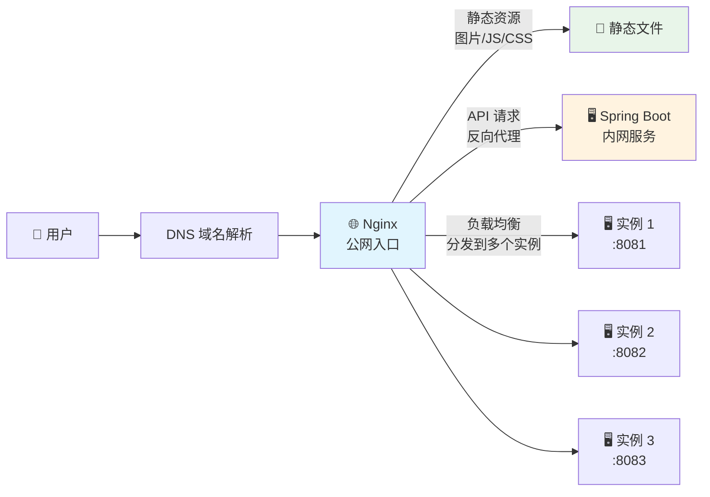
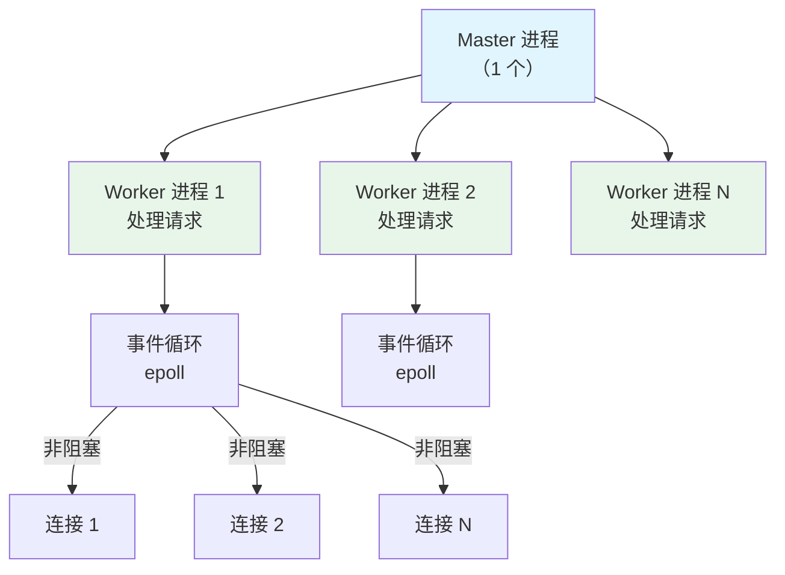
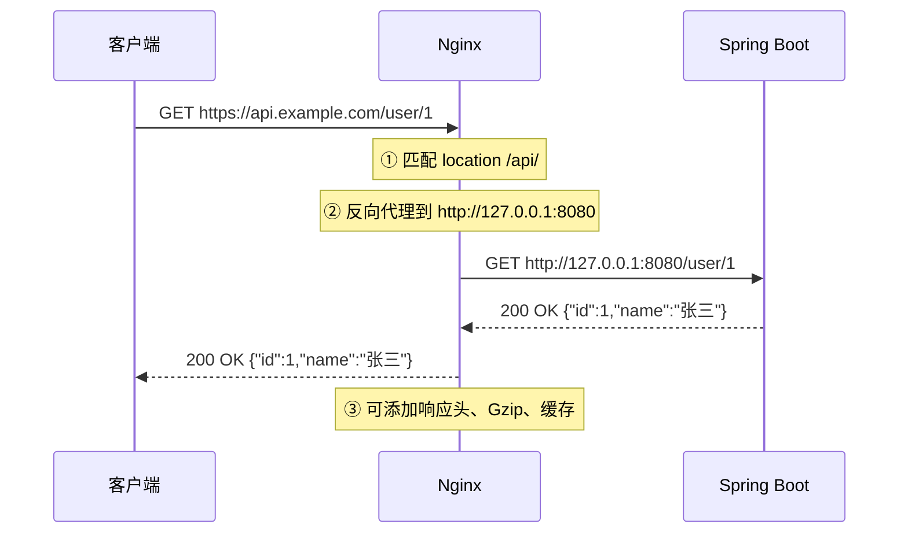
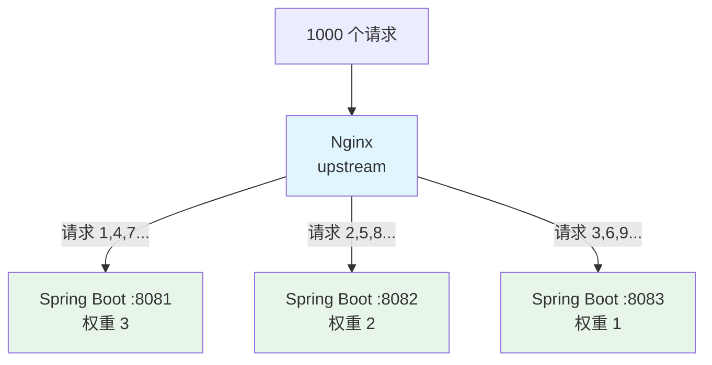

# Nginx

> Nginx 是全球使用最广泛的 Web 服务器和反向代理服务器，以**高并发、低内存占用、高可靠性**著称。在 Java 后端架构中，Nginx 通常承担四个角色：静态资源服务器、反向代理、负载均衡、HTTPS 终端。

## Nginx 的位置



::: tip Nginx vs Tomcat
| 维度 | Nginx | Tomcat |
|------|-------|--------|
| 定位 | Web 服务器 + 反向代理 | Java 应用服务器（Servlet 容器） |
| 处理静态资源 | ⭐ 非常快（C 语言，事件驱动） | 较慢（Java 线程模型） |
| 处理动态请求 | 不处理，转发给后端 | 直接处理 Java Servlet |
| 并发能力 | 10 万+ | 几千（受限于线程池） |
| 最佳实践 | Nginx 放前面做代理，Tomcat 只处理 Java 请求 | 不要用 Tomcat 直接暴露到公网 |
:::

---

## 核心概念

### Nginx 的进程模型



| 进程 | 数量 | 职责 |
|------|------|------|
| **Master** | 1 个 | 管理配置加载、Worker 进程管理、平滑重启 |
| **Worker** | 通常 = CPU 核数 | 实际处理请求，每个 Worker 独立的事件循环 |

::: info Nginx 为什么快？
1. **事件驱动 + epoll**：一个 Worker 可以处理数万个连接，不像 Apache/Tomcat 一个连接一个线程
2. **非阻塞 IO**：连接空闲时不占用线程资源
3. **多进程**：Worker 之间互相隔离，一个挂了不影响其他
4. **Master 管理**：平滑重启/升级不中断服务
:::

---

## 反向代理

反向代理是 Nginx 最常用的功能：客户端不直接访问后端服务，而是通过 Nginx 转发。



### 基本配置

```nginx
server {
    listen 80;
    server_name api.example.com;

    # 反向代理
    location /api/ {
        proxy_pass http://127.0.0.1:8080/;  # 末尾 / 会去掉 /api/ 前缀
    }

    # 静态资源
    location /static/ {
        alias /opt/app/static/;  # 直接返回静态文件
        expires 30d;              # 浏览器缓存 30 天
    }
}
```

### proxy_pass 的路径问题

这是最容易踩的坑：

```nginx
# 场景 1：有尾斜杠
location /api/ {
    proxy_pass http://127.0.0.1:8080/;
    # 请求 /api/user/1 → 转发到 http://127.0.0.1:8080/user/1（去掉了 /api/）
}

# 场景 2：无尾斜杠
location /api/ {
    proxy_pass http://127.0.0.1:8080;
    # 请求 /api/user/1 → 转发到 http://127.0.0.1:8080/api/user/1（保留了 /api/）
}

# 场景 3：带路径
location /api/ {
    proxy_pass http://127.0.0.1:8080/backend/;
    # 请求 /api/user/1 → 转发到 http://127.0.0.1:8080/backend/user/1
}
```

::: warning 记住规则
- `proxy_pass` **有** `/` → location 的路径会被**替换**
- `proxy_pass` **无** `/` → location 的路径会被**保留**
- 这个规则只对带 URI 的 `proxy_pass` 生效（如 `http://ip:port/path/`），纯域名+端口的不受影响
:::

### 常用代理配置

```nginx
location /api/ {
    proxy_pass http://127.0.0.1:8080/;

    # 传递客户端真实信息
    proxy_set_header Host $host;
    proxy_set_header X-Real-IP $remote_addr;
    proxy_set_header X-Forwarded-For $proxy_add_x_forwarded_for;
    proxy_set_header X-Forwarded-Proto $scheme;

    # 超时设置
    proxy_connect_timeout 5s;     # 连接后端超时
    proxy_read_timeout 60s;       # 读取后端响应超时
    proxy_send_timeout 60s;       # 发送请求到后端超时

    # WebSocket 支持
    proxy_http_version 1.1;
    proxy_set_header Upgrade $http_upgrade;
    proxy_set_header Connection "upgrade";
}
```

---

## 负载均衡

当后端有多个服务实例时，Nginx 可以做负载均衡分发请求。



### 配置示例

```nginx
upstream backend {
    # 轮询（默认）
    server 127.0.0.1:8081 weight=3;  # 权重 3
    server 127.0.0.1:8082 weight=2;  # 权重 2
    server 127.0.0.1:8083 weight=1;  # 权重 1

    # 健康检查（商业版功能，开源版需要额外模块）
    # health_check interval=10s fails=3 passes=2;
}

server {
    listen 80;
    location / {
        proxy_pass http://backend;
    }
}
```

### 四种负载均衡策略

| 策略 | 指令 | 说明 | 适用场景 |
|------|------|------|---------|
| **轮询**（默认） | 不配置 | 按顺序轮流分配 | 服务器性能一致 |
| **加权轮询** | `weight=3` | 按权重比例分配 | 服务器性能不一致 |
| **IP Hash** | `ip_hash` | 同一 IP 固定到同一台服务器 | 需要 Session 保持 |
| **最少连接** | `least_conn` | 请求发给连接数最少的服务器 | 请求处理时间差异大 |

::: tip Session 保持的问题
如果使用 Spring Cloud 微服务 + JWT，不需要 IP Hash（无状态）。如果使用 Session，推荐用 **Spring Session + Redis** 共享 Session，而不是 IP Hash（因为 IP Hash 在扩缩容时会导致 Session 丢失）。
:::

---

## HTTPS 配置

```nginx
server {
    listen 443 ssl;
    server_name api.example.com;

    ssl_certificate     /etc/nginx/ssl/cert.pem;
    ssl_certificate_key /etc/nginx/ssl/key.pem;

    # SSL 安全配置
    ssl_protocols TLSv1.2 TLSv1.3;
    ssl_ciphers HIGH:!aNULL:!MD5;
    ssl_prefer_server_ciphers on;

    # HSTS（强制 HTTPS）
    add_header Strict-Transport-Security "max-age=31536000" always;

    location / {
        proxy_pass http://127.0.0.1:8080/;
    }
}

# HTTP 自动跳转 HTTPS
server {
    listen 80;
    server_name api.example.com;
    return 301 https://$host$request_uri;
}
```

::: tip 证书管理
- 开发环境用 **mkcert** 生成本地可信证书
- 生产环境用 **Let's Encrypt** 免费证书（`certbot` 自动续期）
- 企业环境用商业证书（如 DigiCert）
- 证书有效期：Let's Encrypt 90 天，商业证书 1 年
:::

---

## 性能优化

| 优化项 | 配置 | 效果 |
|--------|------|------|
| **开启 Gzip** | `gzip on;` | 文本资源压缩 60-70% |
| **静态资源缓存** | `expires 30d;` | 减少重复请求 |
| **Worker 进程数** | `worker_processes auto;` | 自动匹配 CPU 核数 |
| **连接数** | `worker_connections 10240;` | 每个 Worker 最大连接数 |
| **文件描述符** | `worker_rlimit_nofile 65535;` | 增加最大文件描述符 |
| **KeepAlive** | `keepalive_timeout 65;` | 复用 TCP 连接 |
| **缓冲区** | `proxy_buffer_size 16k;` | 避免频繁 IO |

::: warning 系统参数也要调
Nginx 的性能优化不只是改配置文件，还需要调整操作系统参数：

```bash
# /etc/sysctl.conf
net.core.somaxconn = 65535           # TCP 连接队列大小
net.ipv4.tcp_max_syn_backlog = 65535 # SYN 队列大小
net.ipv4.tcp_tw_reuse = 1            # TIME_WAIT 状态复用
fs.file-max = 65535                  # 最大文件描述符
```

修改后执行 `sysctl -p` 生效。
:::

---

## 面试高频题

**Q1：Nginx 和 Tomcat 的区别？**

Nginx 是 Web 服务器/反向代理，用 C 语言编写，基于事件驱动的 epoll 模型，擅长处理静态资源和高并发转发。Tomcat 是 Java Servlet 容器，擅长处理 Java 动态请求。最佳实践：Nginx 做前置代理处理静态资源和负载均衡，Tomcat 只处理 Java 请求。

**Q2：Nginx 的负载均衡策略有哪些？**

轮询（默认，按顺序）、加权轮询（按权重比例）、IP Hash（同一 IP 固定到同一台）、最少连接（发给连接数最少的服务器）。微服务架构推荐默认轮询 + Spring Session Redis 共享 Session。

**Q3：proxy_pass 末尾斜杠有什么影响？**

有 `/`（如 `proxy_pass http://backend/`）会替换 location 路径，无 `/`（如 `proxy_pass http://backend`）会保留 location 路径。例如 `location /api/` + `proxy_pass http://backend/` → 请求 `/api/user` 被转发到 `/user`。

**Q4：Nginx 如何实现高可用？**

两台 Nginx + Keepalived 组成高可用：Keepalived 提供 VIP（虚拟 IP），主 Nginx 挂了自动切换到备 Nginx。监控脚本检测 Nginx 健康状态，故障自动转移。架构：客户端 → VIP → 主 Nginx/备 Nginx → 后端服务。

## 延伸阅读

- [Linux 常用命令](linux.md) — 服务器日常操作
- [Docker & K8s](docker.md) — 容器化部署
- [CI/CD](cicd.md) — 自动化流水线
