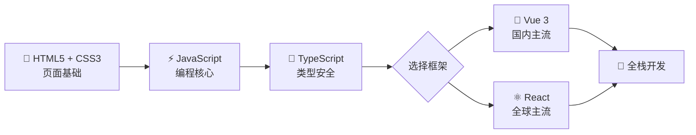

# 🌐 前端基础

> 后端工程师也要懂前端，全栈不是说说而已

作为 Java 全栈工程师，掌握前端技术能让你独立完成完整项目，理解前后端协作中的各种"坑"。

## 📚 内容导航

### 🔰 基础三件套

| 章节 | 描述 | 核心内容 |
|------|------|---------|
| [HTML5 + CSS3](./html-css.md) | 网页的骨架与皮肤 | 语义化标签、Flex/Grid 布局、响应式设计、CSS 动画 |
| [JavaScript](./javascript.md) | 网页的灵魂 | ES6+ 语法、异步编程、DOM/BOM、模块化、Promise/async |
| [TypeScript](./typescript.md) | JS 的超集，类型安全 | 类型系统、接口、泛型、装饰器、工具类型 |

### ⚡ 框架篇

| 框架 | 描述 | 核心内容 |
|------|------|---------|
| [Vue 3](./vue/vue3-basics.md) | 渐进式框架，国内最火 | 组合式 API、响应式原理、Pinia、Vue Router |
| [Vue 3 进阶](./vue/vue3-advanced.md) | Vue 深入实战 | 源码解析、性能优化、SSR、组件库开发 |
| [React](./react/react-basics.md) | Meta 出品，全球最火 | JSX、Hooks、状态管理、React Router |
| [React 进阶](./react/react-advanced.md) | React 深入实战 | 源码机制、性能优化、Next.js、服务端渲染 |

## 🗺️ 学习路线

## 💡 学习建议

::: tip 后端学前端的优势
你已经会 Java，学 JS 会很快！很多概念是相通的：
- Java 接口 ↔ TypeScript Interface
- Java 泛型 ↔ TypeScript 泛型
- Spring DI ↔ Vue 依赖注入
- Java Stream ↔ JS 数组方法
:::

::: warning 别踩的坑
1. **不要用后端思维写前端** — 前端是事件驱动 + 响应式，不是请求-响应
2. **CSS 布局是必修课** — Flex 和 Grid 必须熟练，别全靠 UI 库
3. **调试能力很重要** — 学会用浏览器 DevTools，比搜索引擎效率高
:::

::: details 为什么 Java 全栈要学前端？
1. **独立交付** — 小项目自己就能搞定前后端
2. **协作效率** — 理解前端才能更好地设计 API
3. **技术视野** — 了解前端生态有助于架构决策（如 SSR vs SPA）
4. **竞争力** — 全栈工程师在市场上更有优势
:::
