# 📝 HTML5 + CSS3

> HTML 是骨架，CSS 是皮肤。没有好骨架，皮肤再美也撑不起来

## 🏗️ HTML5 语义化

### 为什么语义化很重要？

语义化标签让浏览器、搜索引擎、屏幕阅读器都能更好地理解页面结构。别再全篇 `<div>` 了！

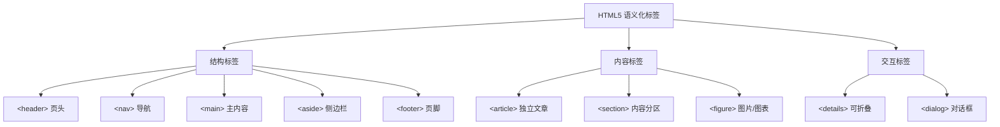

### 常见语义化标签

| 标签 | 含义 | 使用场景 |
|------|------|---------|
| `<header>` | 页面或区块的头部 | 网站顶部栏、文章标题区 |
| `<nav>` | 导航链接 | 主导航、面包屑、侧边栏导航 |
| `<main>` | 页面主体内容 | 每个页面只有一个 |
| `<article>` | 独立完整的内容 | 博客文章、新闻、评论 |
| `<section>` | 内容的主题分组 | 文章的章节、功能区域 |
| `<aside>` | 与主内容间接相关 | 侧边栏、广告、相关推荐 |
| `<footer>` | 页面或区块的底部 | 版权信息、联系方式 |
| `<figure>` / `<figcaption>` | 独立引用内容 | 图片、图表、代码片段 |
| `<time>` | 时间日期 | 发布时间、日程安排 |
| `<mark>` | 高亮文本 | 搜索结果高亮 |

::: tip 语义化的好处
1. **SEO 友好** — 搜索引擎能更好地理解页面结构，提升排名
2. **可访问性** — 屏幕阅读器能正确导航，帮助视障用户
3. **可维护性** — 代码可读性更高，团队协作更顺畅
4. **开发效率** — 看标签就知道是什么区域，不用到处找注释
:::

### HTML5 新增表单特性

HTML5 为表单带来了许多实用的新特性，减少了大量 JS 验证代码：

| 新增类型 | 说明 | 验证行为 |
|---------|------|---------|
| `type="email"` | 邮箱 | 自动验证 @ 符号 |
| `type="url"` | URL | 自动验证协议格式 |
| `type="number"` | 数字 | 自动验证非数字输入 |
| `type="range"` | 滑块 | 返回数字值 |
| `type="date"` | 日期选择器 | 浏览器原生日期控件 |
| `type="color"` | 颜色选择器 | 返回十六进制颜色值 |
| `type="search"` | 搜索框 | 部分浏览器带清除按钮 |

| 新增属性 | 说明 |
|---------|------|
| `placeholder` | 输入提示文字 |
| `required` | 必填验证 |
| `pattern` | 正则验证（如 `pattern="[0-9]{6}"`） |
| `autofocus` | 自动聚焦 |
| `autocomplete` | 自动补全（`on` / `off`） |
| `min` / `max` / `step` | 数值范围和步长 |

::: details 表单验证 API
```javascript
// 原生表单验证 — 无需额外 JS 库
const form = document.querySelector('form');

// 自定义验证错误信息
form.addEventListener('submit', (e) => {
  e.preventDefault();
  if (!form.checkValidity()) {
    // 显示第一个无效字段的错误
    const firstInvalid = form.querySelector(':invalid');
    firstInvalid.focus();
    firstInvalid.reportValidity(); // 弹出浏览器原生提示
  }
});

// 自定义验证逻辑
input.addEventListener('invalid', () => {
  input.setCustomValidity('请输入 6 位数字验证码');
});

// 验证通过后清除自定义信息
input.addEventListener('input', () => {
  input.setCustomValidity('');
});
```
:::

## 🎨 CSS 选择器与优先级

### 选择器分类

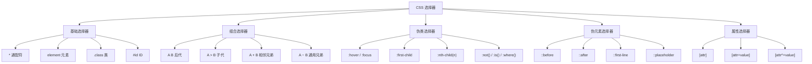

### 优先级计算

选择器优先级从低到高：`元素 < 类 < ID < 内联 < !important`

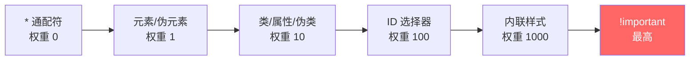

::: warning 避免滥用 !important
`!important` 会破坏 CSS 的层叠规则，一旦用了就可能需要更多 `!important` 来覆盖，形成恶性循环。**优先通过提高选择器权重来解决冲突**。

只有在使用第三方库且无法修改源码时，才考虑用 `!important` 覆盖样式。
:::

### 伪元素与伪类

伪类选择元素的特殊**状态**，伪元素创建元素的**虚拟部分**：

| 类型 | 语法 | 说明 | 示例 |
|------|------|------|------|
| 伪类 | `:` 单冒号 | 选中元素的某种状态 | `:hover`、`:first-child`、`:nth-child(2)` |
| 伪元素 | `::` 双冒号 | 创建虚拟元素 | `::before`、`::after`、`::placeholder` |

::: details 常用伪类详解
```css
/* 结构伪类 */
li:first-child { }          /* 第一个子元素 */
li:last-child { }           /* 最后一个子元素 */
li:nth-child(3) { }         /* 第 3 个子元素 */
li:nth-child(odd) { }       /* 奇数行 */
li:nth-child(even) { }      /* 偶数行 */
li:nth-child(3n+1) { }      /* 每 3 个的第 1 个 */
li:only-child { }           /* 唯一子元素 */
li:not(.active) { }         /* 不包含 active 类 */

/* 表单伪类 */
input:focus { }             /* 聚焦状态 */
input:disabled { }          /* 禁用状态 */
input:checked { }           /* 选中状态 */
input:valid { }             /* 验证通过 */
input:invalid { }           /* 验证失败 */
input:required { }          /* 必填字段 */

/* 现代伪类 */
div:is(.a, .b) { }          /* 匹配 .a 或 .b（权重为 0！） */
div:where(.a, .b) { }       /* 同 is()，但权重始终为 0 */
div:has(> img) { }          /* 🆕 父选择器！包含 img 子元素 */
```

**`:has()` 是 CSS 史上最重要的新选择器之一**，终于能根据子元素选择父元素了！
:::

::: details 伪元素实战
```css
/* 清除浮动 — clearfix */
.clearfix::after {
  content: '';
  display: block;
  clear: both;
}

/* 自定义列表符号 */
ul.custom li::before {
  content: '→ ';
  color: #409eff;
}

/* 首字下沉效果 */
p::first-letter {
  font-size: 3em;
  font-weight: bold;
  float: left;
  margin-right: 8px;
}

/* 美化占位符 */
input::placeholder {
  color: #999;
  font-style: italic;
}

/* 选中文字的样式 */
::selection {
  background: #409eff;
  color: white;
}
```
:::

## 📐 CSS 定位（Position）

定位是 CSS 布局的核心基础，必须彻底搞清楚每种定位的区别：

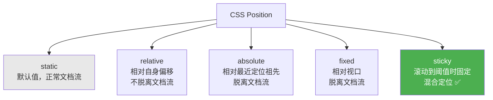

| 定位方式 | 参照物 | 是否脱离文档流 | 典型应用 |
|---------|--------|-------------|---------|
| `static` | 正常流 | ❌ | 默认 |
| `relative` | 自身原位置 | ❌ | 微调位置、为 absolute 提供参照 |
| `absolute` | 最近非 static 祖先 | ✅ | 弹窗、下拉菜单、tooltip |
| `fixed` | 视口（viewport） | ✅ | 固定导航栏、回到顶部按钮 |
| `sticky` | 滚动容器 + 阈值 | 视情况 | 吸顶导航、表格固定表头 |

::: tip 子绝父相
`absolute` 定位会向上查找最近的非 `static` 定位祖先。所以**让父元素 `relative`，子元素 `absolute`**，子元素就会相对父元素定位。这是最常用的定位组合！

```css
.parent {
  position: relative;  /* 父元素相对定位 */
}
.child {
  position: absolute;  /* 子元素绝对定位 */
  top: 10px;
  right: 10px;
}
```
:::

::: details sticky 定位详解
`sticky` 是 `relative` 和 `fixed` 的结合体。元素在正常流中，滚动到指定阈值后"粘"住：

```css
/* 吸顶导航 — 滚动到顶部 60px 时固定 */
.navbar {
  position: sticky;
  top: 0;
  z-index: 100;
  background: white;
  box-shadow: 0 2px 8px rgba(0,0,0,0.1);
}

/* 表格固定表头 */
thead th {
  position: sticky;
  top: 0;
  background: #f5f5f5;
}
```

**sticky 生效条件**：
1. 父容器不能有 `overflow: hidden / auto`
2. 必须指定 `top` / `bottom` 之一
3. 只在父容器范围内生效（不会超出父容器）
:::

## 📦 盒模型

### 标准盒模型 vs IE 盒模型

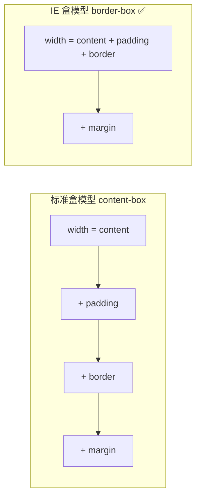

| 对比 | `content-box` | `border-box` |
|------|--------------|-------------|
| width 含义 | 只含 content | content + padding + border |
| 实际宽度 | width + padding + border | 就是 width |
| 推荐度 | ❌ | ✅ 推荐 |

::: tip 全局推荐 border-box
```css
*, *::before, *::after {
  box-sizing: border-box;
}
```
使用 `border-box` 后，你设置的 width 就是元素最终占的宽度，不用再手动计算 padding 和 border，**开发效率直接翻倍**。
:::

### margin 塌陷问题

两个相邻的块级元素，**上下 margin 会合并**（取较大值而非相加），这就是 margin 塌陷：

::: details 解决 margin 塌陷的方案
```css
/* 方案 1：用 padding 代替 margin */
.parent { padding-top: 20px; }

/* 方案 2：BFC 隔离 */
.parent { overflow: hidden; }

/* 方案 3：使用 border */
.parent { border-top: 1px solid transparent; }

/* 方案 4：使用 flex 布局（flex 容器内无 margin 塌陷） */
.parent { display: flex; flex-direction: column; }
```
:::

## 🔄 BFC — 块级格式化上下文

BFC 是 CSS 布局中非常重要的概念，理解它能解决很多"诡异"的布局问题。

### 触发条件

| 触发条件 | 示例 |
|---------|------|
| `overflow` 不为 visible | `overflow: hidden / auto / scroll` |
| 浮动元素 | `float: left / right` |
| 绝对/固定定位 | `position: absolute / fixed` |
| `display` 为特定值 | `display: inline-block / flex / grid / flow-root` |

### BFC 的特性

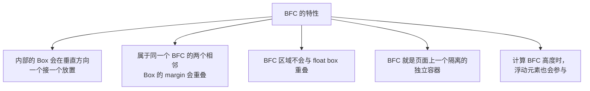

::: details BFC 实际应用场景
1. **清除浮动** — 父元素设置 `overflow: hidden` 触发 BFC，包含浮动子元素
2. **避免 margin 重叠** — 给元素包裹一个 BFC 容器
3. **自适应布局** — 左侧浮动，右侧触发 BFC 实现自适应（两栏布局）

```css
/* 推荐触发方式 — flow-root（专为 BFC 设计，无副作用） */
.container {
  display: flow-root;
}
```
:::

## 📍 CSS 定位详解

CSS 定位是布局的基石，五种定位模式各有适用场景，面试必问！

### 五种定位模式

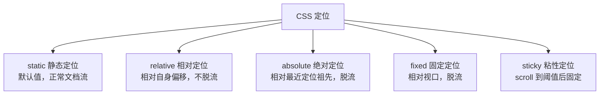

| 定位方式 | 是否脱流 | 参考点 | 常见用途 |
|---------|---------|--------|---------|
| `static` | ❌ 否 | 正常文档流 | 默认值 |
| `relative` | ❌ 否 | 自身原始位置 | 微调位置、作为 absolute 的参考 |
| `absolute` | ✅ 是 | 最近非 static 祖先 | 弹窗、下拉菜单、徽标 |
| `fixed` | ✅ 是 | 视口（viewport） | 固定导航栏、回到顶部按钮 |
| `sticky` | ❌ 否 | 滚动容器 + 阈值 | 吸顶导航、表格固定表头 |

### relative + absolute 黄金组合

这是前端最常用的定位组合：**子绝父相**。

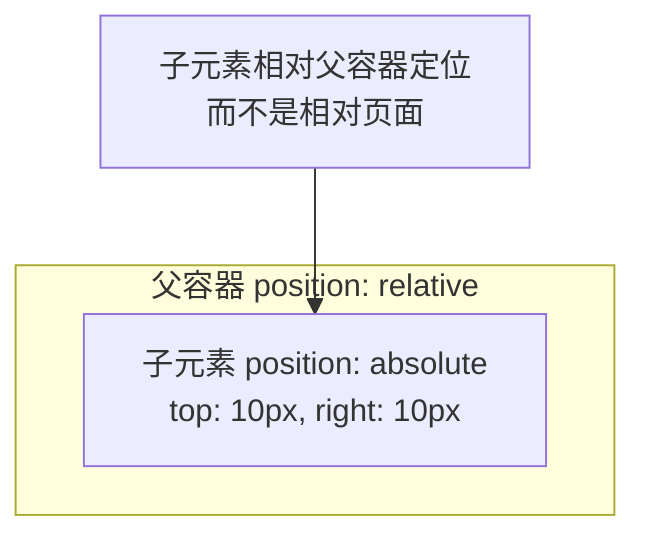

::: tip 为什么用「子绝父相」？
`absolute` 的参考点是最近的非 `static` 祖先。给父元素设 `relative` 不影响父元素本身的布局（不脱流），但为子元素提供了一个定位参考容器。

实际开发中，**悬浮徽标、下拉菜单、图片上的遮罩层** 都是这个套路。
:::

### sticky 定位原理

`sticky` 是 `relative` 和 `fixed` 的结合体——元素在滚动到阈值前按正常流排列，到达阈值后"粘住"。

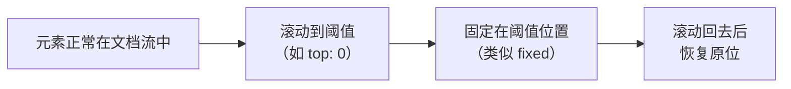

::: details sticky 使用注意事项
1. **父元素不能有 `overflow: hidden`** — 会导致 sticky 失效
2. **必须指定 `top/bottom/left/right` 至少一个** — 否则等同于 relative
3. **只在父容器范围内生效** — 滚出父容器就跟着走了
4. **父容器高度要大于 sticky 元素** — 否则没有滚动空间
:::

### z-index 层叠上下文

当多个定位元素重叠时，`z-index` 决定谁在上面。但 `z-index` 不是简单的数字比较，它受**层叠上下文**影响。

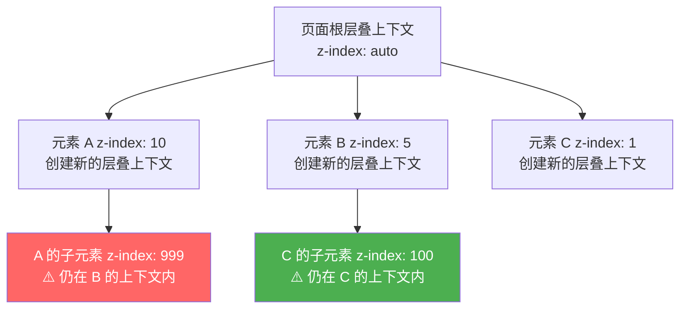

::: warning 核心规则
1. **`z-index` 只对定位元素生效**（`position` 非 `static`）
2. **每个层叠上下文是独立的** — 子元素的 `z-index` 只在父级上下文内比较
3. **以下属性会创建层叠上下文**：`position` 非 static + `z-index` 非 auto、`opacity < 1`、`transform`、`filter`、`will-change`、`isolation: isolate`
4. **同上下文内，z-index 大的在上**；不同上下文之间，后创建的在上
:::

## 🎨 CSS 变量与预处理器

### CSS 自定义属性（CSS Variables）

CSS 变量让样式可以复用和动态修改，主题切换就是靠它实现的。

```css
:root {
  --color-primary: #1890ff;
  --color-success: #52c41a;
  --color-danger: #ff4d4f;
  --font-size-base: 14px;
  --border-radius: 8px;
}

/* 使用 */
.button {
  color: var(--color-primary);
  font-size: var(--font-size-base);
  border-radius: var(--border-radius);
}

/* 暗色主题 — 只需覆盖变量值！ */
[data-theme="dark"] {
  --color-primary: #177ddc;
  --font-size-base: 14px;
}
```

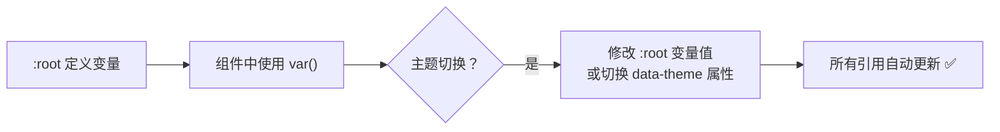

::: tip CSS 变量 vs SCSS 变量
| 对比 | CSS 变量 `--var` | SCSS 变量 `$var` |
|------|------------------|-----------------|
| 运行时 | ✅ 可动态修改 | ❌ 编译时确定 |
| 作用域 | DOM 层级继承 | 文件层级 |
| JS 交互 | ✅ `el.style.setProperty()` | ❌ 不支持 |
| 浏览器兼容 | 现代浏览器全支持 | 需要编译 |
| 适用 | 主题切换、动态样式 | 颜色/尺寸复用 |

**结论**：主题相关用 CSS 变量，纯开发时复用用 SCSS 变量。
:::

### CSS 预处理器对比

| 特性 | Sass/SCSS | Less | Stylus |
|------|----------|------|--------|
| 语法 | `.scss` 类 CSS | `.less` 类 CSS | 缩进式，灵活 |
| 变量 | `$var` | `@var` | 无前缀 |
| 嵌套 | ✅ | ✅ | ✅ |
| 混入 Mixin | ✅ `@mixin` | ✅ `.mixin()` | ✅ |
| 函数 | ✅ 丰富 | ✅ 基础 | ✅ 丰富 |
| 循环 | `@for` / `@each` | `.loop()` | `for/in` |
| 生态 | ✅ 最成熟 | Bootstrap 使用 | 逐渐少用 |

::: details SCSS 实用技巧
```scss
// 1. Mixin — 响应式断点
@mixin respond-to($breakpoint) {
  @if $breakpoint == mobile { @media (max-width: 767px) { @content; } }
  @if $breakpoint == tablet { @media (max-width: 1023px) { @content; } }
  @if $breakpoint == desktop { @media (min-width: 1024px) { @content; } }
}

.card {
  padding: 16px;
  @include respond-to(mobile) { padding: 12px; }
}

// 2. 占位选择器 % — 不生成 CSS，只在 @extend 时生成
%flex-center {
  display: flex;
  justify-content: center;
  align-items: center;
}

.header { @extend %flex-center; }
.footer { @extend %flex-center; }
// 编译后只生成一份 CSS 规则 ✅
```
:::

## 📐 Flex 弹性布局

Flex 是现代 CSS 布局的基石，**必须熟练掌握**！

### 核心概念

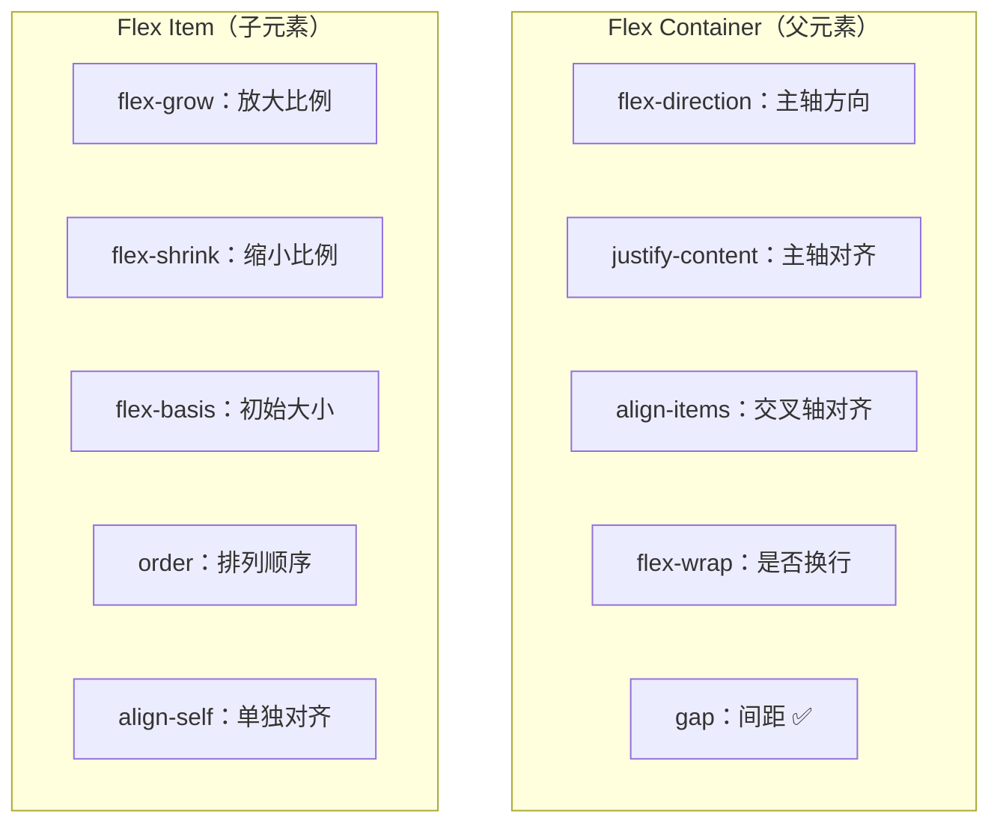

### flex-direction — 主轴方向

| 值 | 主轴方向 | 说明 |
|----|---------|------|
| `row` | → 水平从左到右 | **默认值** |
| `row-reverse` | ← 水平从右到左 |
| `column` | ↓ 垂直从上到下 | 适合移动端布局 |
| `column-reverse` | ↑ 垂直从下到上 |

### justify-content — 主轴对齐

| 值 | 效果 | 适用场景 |
|----|------|---------|
| `flex-start` | 左对齐 | 默认 |
| `center` | 居中 | 水平居中 |
| `flex-end` | 右对齐 | 操作按钮靠右 |
| `space-between` | 两端对齐，中间等分 | 导航栏、工具栏 |
| `space-around` | 两侧间距是中间一半 | 标签组 |
| `space-evenly` | 完全等分间距 | 图标组 |

### align-items — 交叉轴对齐

| 值 | 效果 |
|----|------|
| `stretch` | 拉伸填满（默认） |
| `flex-start` | 顶部对齐 |
| `center` | 垂直居中 |
| `flex-end` | 底部对齐 |
| `baseline` | 基线对齐（文字对齐时有用） |

### 常用布局模式

| 布局需求 | 关键属性 | 值 |
|---------|---------|-----|
| 水平居中 | `justify-content` | `center` |
| 垂直居中 | `align-items` | `center` |
| 完美居中 | 两者组合 | `justify-content: center; align-items: center` |
| 两端对齐 | `justify-content` | `space-between` |
| 等间距 | `justify-content` | `space-evenly` |
| 左右固定中间自适应 | `flex: 0 0 200px` + `flex: 1` | 固定宽度 + 自动填充 |

### flex: 1 到底是什么？

`flex: 1` 是 `flex: 1 1 0%` 的简写：

| 属性 | 值 | 含义 |
|------|-----|------|
| `flex-grow` | 1 | 有剩余空间时放大 |
| `flex-shrink` | 1 | 空间不足时缩小 |
| `flex-basis` | 0% | 初始大小为 0（按比例分配） |

::: tip 常见 flex 值
```css
flex: 1;        /* flex: 1 1 0% — 等分剩余空间 */
flex: auto;     /* flex: 1 1 auto — 按内容大小分配 */
flex: none;     /* flex: 0 0 auto — 不放大不缩小，固定大小 */
flex: 0 0 200px; /* 固定 200px，不放大不缩小 */
```
:::

::: tip 一行代码实现垂直居中
```css
.container {
  display: flex;
  justify-content: center;
  align-items: center;
}
```
这可能是你用得最多的 Flex 布局！
:::

## 📏 Grid 网格布局

Grid 适合**二维布局**（行和列同时控制），Flex 适合**一维布局**（行或列）。

### Grid vs Flex

| 对比维度 | Flex | Grid |
|---------|------|------|
| 维度 | 一维（行或列） | 二维（行和列） |
| 适用场景 | 导航栏、工具栏、卡片列表 | 整体页面布局、仪表盘 |
| 对齐方式 | 主轴 + 交叉轴 | 行轴 + 列轴 + 网格区域 |
| 学习成本 | 低 | 中 |

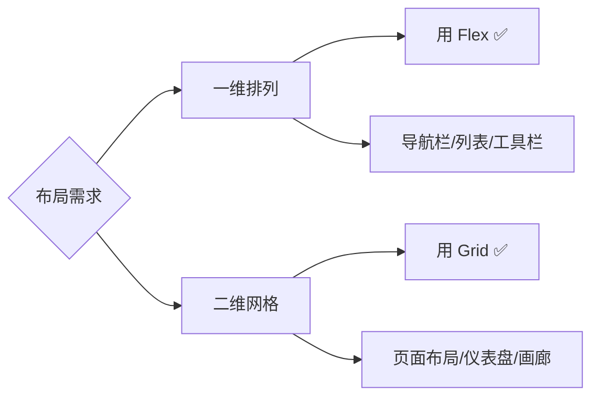

### Grid 核心属性

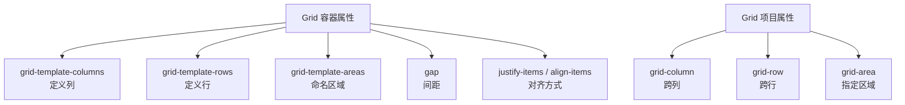

::: details Grid 实战布局
```css
/* 经典圣杯布局 */
.layout {
  display: grid;
  grid-template-areas:
    "header  header  header"
    "sidebar content aside"
    "footer  footer  footer";
  grid-template-columns: 200px 1fr 200px;
  grid-template-rows: 60px 1fr 40px;
  min-height: 100vh;
  gap: 8px;
}

.header  { grid-area: header; }
.sidebar { grid-area: sidebar; }
.content { grid-area: content; }
.aside   { grid-area: aside; }
.footer  { grid-area: footer; }

/* 自适应列数 — auto-fill vs auto-fit */
/* auto-fill：保留空列轨道 */
/* auto-fit：空列轨道折叠为 0 */
.grid-auto {
  display: grid;
  grid-template-columns: repeat(auto-fit, minmax(250px, 1fr));
  gap: 16px;
}
```

**auto-fill vs auto-fit 区别**：当子元素不够填满一行时，`auto-fill` 会保留空位，`auto-fit` 会把空位折叠，子元素拉伸填满。
:::

## 📱 响应式设计

### 媒体查询

媒体查询是响应式设计的核心工具，根据不同屏幕尺寸应用不同样式。

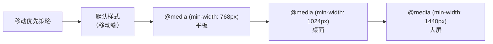

| 断点 | 设备 | 典型宽度 |
|------|------|---------|
| `< 768px` | 手机 | 375px ~ 428px |
| `768px ~ 1023px` | 平板 | 768px ~ 1024px |
| `1024px ~ 1439px` | 笔记本/小桌面 | 1024px ~ 1366px |
| `≥ 1440px` | 大桌面 | 1440px ~ 1920px |

::: tip 移动优先
**永远从移动端开始设计**，然后逐步增强。这样代码更简洁，默认样式就是最简单的。

```css
/* 默认：移动端 */
.container { padding: 16px; flex-direction: column; }

/* 平板及以上 */
@media (min-width: 768px) {
  .container { padding: 24px; flex-direction: row; }
}

/* 桌面及以上 */
@media (min-width: 1024px) {
  .container { padding: 32px; max-width: 1200px; margin: 0 auto; }
}
```
:::

### 现代 CSS 响应式方案

| 方案 | 说明 | 适用场景 |
|------|------|---------|
| `clamp()` | `font-size: clamp(14px, 2vw, 18px)` | 流式字体大小，最小值/首选值/最大值 |
| `min()` / `max()` | `width: min(90%, 1200px)` | 自适应宽度，不用写媒体查询 |
| Container Query | 根据容器尺寸而非视口响应 | 组件级响应式 🆕 |
| `aspect-ratio` | `aspect-ratio: 16 / 9` | 固定比例容器（视频、图片） |

::: details Container Query — 组件级响应式
```css
/* 根据父容器宽度响应，而非视口宽度 */
.card-container {
  container-type: inline-size;
  container-name: card;
}

/* 当容器宽度 ≥ 400px 时切换布局 */
@container card (min-width: 400px) {
  .card {
    display: grid;
    grid-template-columns: 150px 1fr;
  }
}
```

Container Query 解决了一个长期痛点：**组件应该根据自己所在的容器来适配，而不是根据整个视口**。在卡片、侧边栏等可复用组件中特别有用。
:::

## 🎨 CSS 变量（Custom Properties）

CSS 变量让你可以在一个地方定义值，然后在任何地方引用，是主题切换的基础：

```css
/* 定义变量 — 必须在 :root 或选择器内 */
:root {
  --color-primary: #409eff;
  --color-danger: #f56c6c;
  --font-size-base: 14px;
  --border-radius: 4px;
  --header-height: 60px;
}

/* 使用变量 */
.button {
  background: var(--color-primary);
  font-size: var(--font-size-base);
  border-radius: var(--border-radius);
}

/* 变量可以继承和覆盖 */
.dark-theme {
  --color-primary: #64b5f6;
  --color-bg: #1a1a2e;
  --color-text: #e0e0e0;
}
```

::: details CSS 变量的高级用法
```css
/* 变量配合 calc() — 设计系统的比例尺 */
:root {
  --spacing-unit: 8px;
}

.card {
  padding: calc(var(--spacing-unit) * 2);     /* 16px */
  margin-bottom: calc(var(--spacing-unit) * 3); /* 24px */
  gap: var(--spacing-unit);                     /* 8px */
}

/* 变量默认值 */
.button {
  color: var(--color-text, #333); /* 如果 --color-text 未定义，使用 #333 */
}

/* JS 动态修改变量 — 实现主题切换 */
document.documentElement.style.setProperty('--color-primary', '#ff6600');
```
:::

## 🎭 CSS3 动画

### Transition vs Animation

| 特性 | Transition | Animation |
|------|-----------|-----------|
| 触发方式 | 需要触发（hover、click 等） | 自动播放或触发 |
| 次数 | 一次 | 可循环 |
| 关键帧 | 不支持 | 支持 `@keyframes` |
| 复杂度 | 简单过渡 | 复杂多步动画 |
| JS 控制 | 难 | 可通过 API 控制 |

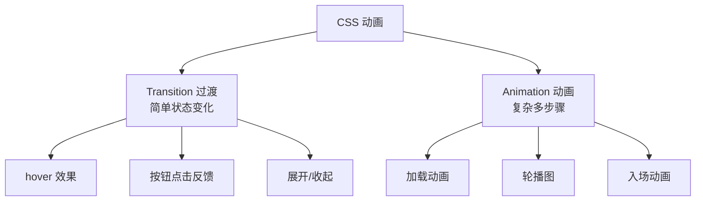

### Transition 详解

```css
/* transition 简写：property duration timing-function delay */
.button {
  transition: background-color 0.3s ease, transform 0.2s ease;
}

/* 常用缓动函数 */
/* ease        — 先快后慢（默认） */
/* ease-in     — 慢入快出 */
/* ease-out    — 快入慢出（推荐，体验好） */
/* ease-in-out — 慢入慢出 */
/* linear      — 匀速 */
/* cubic-bezier(n,n,n,n) — 自定义曲线 */
```

### Animation 详解

```css
/* 定义关键帧 */
@keyframes fadeInUp {
  from {
    opacity: 0;
    transform: translateY(20px);
  }
  to {
    opacity: 1;
    transform: translateY(0);
  }
}

/* 使用动画 */
.card {
  animation: fadeInUp 0.6s ease-out forwards;
}

/* animation 简写：name duration timing-function delay iteration-count direction fill-mode play-state */
.loading {
  animation: spin 1s linear infinite;
}

@keyframes spin {
  to { transform: rotate(360deg); }
}
```

::: details 性能优化建议
1. **只动画 `transform` 和 `opacity`** — 这两个属性不会触发重排（reflow），由 GPU 合成层处理
2. **避免动画 `width`、`height`、`top`、`left`** — 会触发重排，性能差
3. **使用 `will-change` 提示浏览器** — `will-change: transform, opacity`（不要滥用！）
4. **动画元素脱离文档流** — 用 `position: absolute` 或 `transform: translateZ(0)` 创建独立合成层

```css
/* ✅ 高性能动画 */
.element {
  transition: transform 0.3s ease, opacity 0.3s ease;
  will-change: transform;
}

/* ❌ 低性能动画 */
.element {
  transition: width 0.3s ease, height 0.3s ease; /* 触发重排 */
}
```
:::

## 🛠️ CSS 预处理器（Sass / Less）

预处理器让 CSS 拥有了变量、嵌套、函数、混入等编程能力：

### Sass 核心特性

| 特性 | 说明 | 示例 |
|------|------|------|
| 变量 | 存储可复用值 | `$primary: #409eff;` |
| 嵌套 | 选择器嵌套书写 | `.card { &-title { } }` |
| 混入（Mixin） | 可复用的样式块 | `@include flex-center;` |
| 继承 | 继承已有样式 | `@extend .btn-base;` |
| 函数 | 内置计算函数 | `darken($color, 10%)` |
| 导入 | 拆分文件 | `@import 'variables';` |

::: details Sass 实战示例
```scss
// variables.scss
$colors: (
  primary: #409eff,
  success: #67c23a,
  warning: #e6a23c,
  danger: #f56c6c,
);

$breakpoints: (
  sm: 576px,
  md: 768px,
  lg: 1024px,
  xl: 1440px,
);

// mixins.scss
@mixin flex-center {
  display: flex;
  justify-content: center;
  align-items: center;
}

@mixin responsive($breakpoint) {
  @media (min-width: map-get($breakpoints, $breakpoint)) {
    @content;
  }
}

// 组件中使用
.card {
  padding: 16px;
  background: map-get($colors, primary);
  
  &-title {
    font-size: 18px;
    font-weight: bold;
  }
  
  &-body {
    @include flex-center;
    min-height: 100px;
  }
  
  // 响应式
  @include responsive(md) {
    padding: 24px;
    max-width: 600px;
  }
}
```
:::

::: info Sass vs Less
| 对比 | Sass (SCSS) | Less |
|------|------------|------|
| 语法 | `.scss` 文件，类 CSS | `.less` 文件，类 CSS |
| 变量 | `$var` | `@var` |
| 条件语句 | `@if / @else` | `when` 守卫 |
| 循环 | `@for / @each / @while` | `loop` mixin |
| 生态 | 更活跃，Dart Sass 官方推荐 | Bootstrap 早期使用 |
| 推荐 | ✅ 新项目首选 | 已有 Less 项目维护即可 |

**新项目直接用 Sass (Dart Sass)**，它是官方推荐的实现，也是 npm 上最流行的预处理器。
:::

## 🌟 HTML5 新特性

HTML5 不只是新标签，还带来了大量实用的 Web API，大幅扩展了浏览器的能力。

### 本地存储

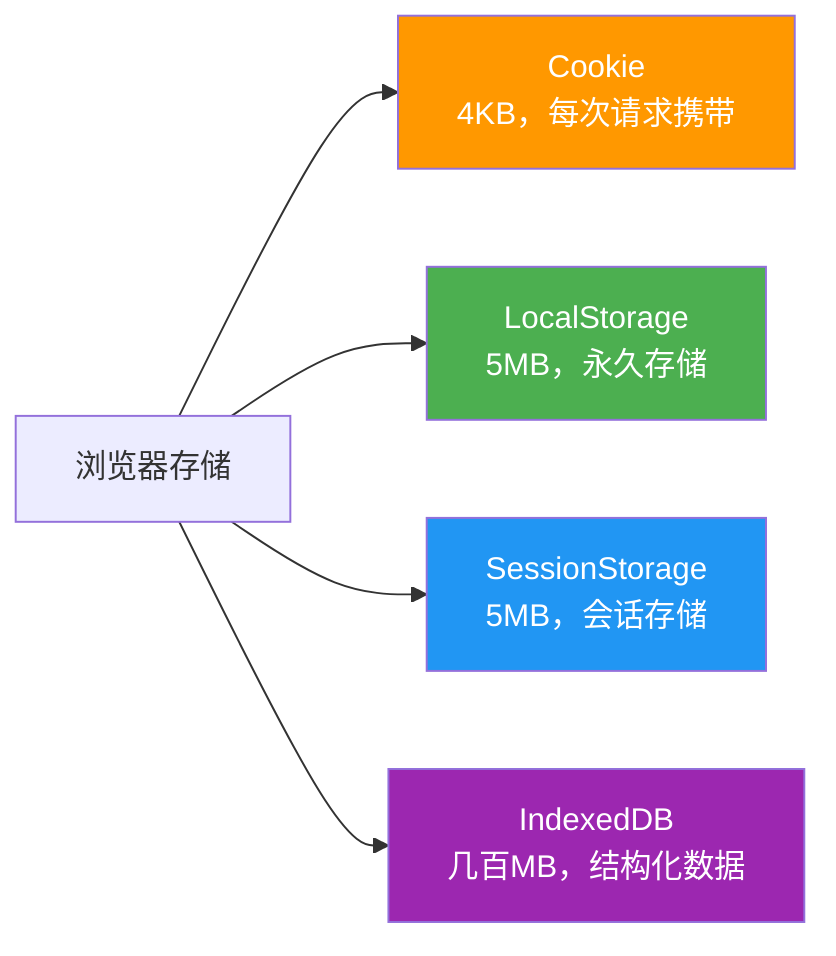

| 存储 | 容量 | 生命周期 | 作用域 | API | 适用场景 |
|------|------|---------|--------|-----|---------|
| Cookie | 4KB | 可设过期时间 | 同源 + 路径 | `document.cookie` | 登录 Token、用户偏好 |
| LocalStorage | 5MB | 永久（手动清除） | 同源 | `localStorage` ✅ | 主题设置、缓存数据 |
| SessionStorage | 5MB | 标签页关闭 | 同源 + 标签页 | `sessionStorage` | 表单临时数据 |
| IndexedDB | 数百MB+ | 永久 | 同源 | `indexedDB` | 离线应用、大文件 |

::: danger Cookie 的坑
1. **每次 HTTP 请求自动携带** — 不相关的请求也会带上，浪费带宽
2. **只有 4KB** — 存不了多少东西
3. **安全风险** — 默认不设 `HttpOnly` 就能被 JS 读取，容易受 XSS 攻击
4. **最佳实践**：登录 Token 放 Cookie（设 `HttpOnly` + `Secure` + `SameSite`），业务数据放 LocalStorage
:::

### 常用 Web API

| API | 用途 | Java 全栈开发者的使用场景 |
|-----|------|----------------------|
| `Fetch API` | 网络请求 | 前后端分离时的 HTTP 调用 |
| `Intersection Observer` | 懒加载、无限滚动 | 图片懒加载、触底加载更多 |
| `Resize Observer` | 监听元素尺寸变化 | 响应式图表、自适应布局 |
| `Mutation Observer` | 监听 DOM 变化 | 第三方组件集成、自动埋点 |
| `Web Worker` | 多线程计算 | 大数据处理、复杂计算不卡 UI |
| `WebSocket` | 全双工通信 | 实时聊天、在线协同、推送通知 |
| `Service Worker` | 离线缓存 | PWA 离线应用 |
| `Drag and Drop` | 拖放 | 文件上传、看板拖拽 |

::: tip Fetch vs Axios 对比
| 对比 | Fetch（原生） | Axios |
|------|-------------|-------|
| 安装 | 无需安装 | `npm install axios` |
| 请求/响应拦截 | ❌ 需手动封装 | ✅ 内置拦截器 |
| JSON 转换 | 需手动 `.then(r => r.json())` | ✅ 自动 |
| 错误处理 | HTTP 错误不 reject，需手动判断 | ✅ 状态码非 2xx 自动 reject |
| 取消请求 | `AbortController` | `CancelToken` |
| CSRF | 无 | ✅ 内置 |
| 进度 | ❌ | ✅ `onUploadProgress` |

**实际项目推荐用 Axios**，封装成本低、功能全面。但面试要懂 Fetch 的原理。
:::

## 🏗️ 常见布局实战

这些布局方案在实际项目中反复出现，必须做到肌肉记忆级别。

### 圣杯布局 / 双飞翼布局

经典的三栏布局：中间自适应，两侧固定宽度。

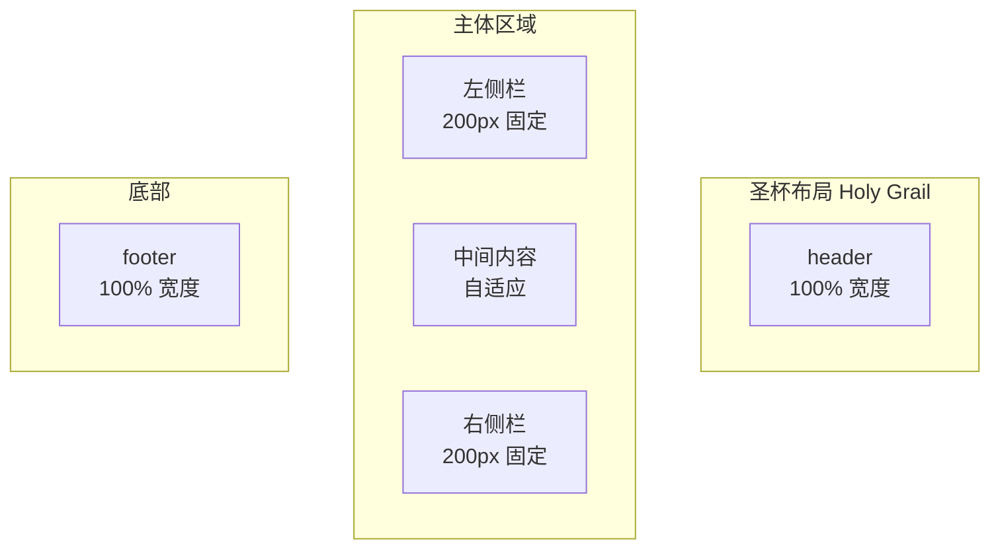

| 实现方案 | 优点 | 缺点 |
|---------|------|------|
| **Flex** | ✅ 代码简洁，推荐 | IE 不支持 |
| **Grid** | ✅ 最简洁 | IE 不支持 |
| **Float + 负 margin** | 兼容性好 | 代码复杂，有坑 |

::: details Flex 实现圣杯布局
```css
.container {
  display: flex;
  flex-direction: column;
  min-height: 100vh;
}

.main-area {
  display: flex;
  flex: 1;
}

.sidebar-left {
  flex: 0 0 200px; /* 固定 200px */
}

.content {
  flex: 1; /* 自适应 */
  min-width: 0; /* 防止内容撑开 */
}

.sidebar-right {
  flex: 0 0 200px;
}
```
:::

### 粘性底部（Sticky Footer）

页面内容不够一屏时，footer 仍然固定在页面底部（不是 `position: fixed`）。

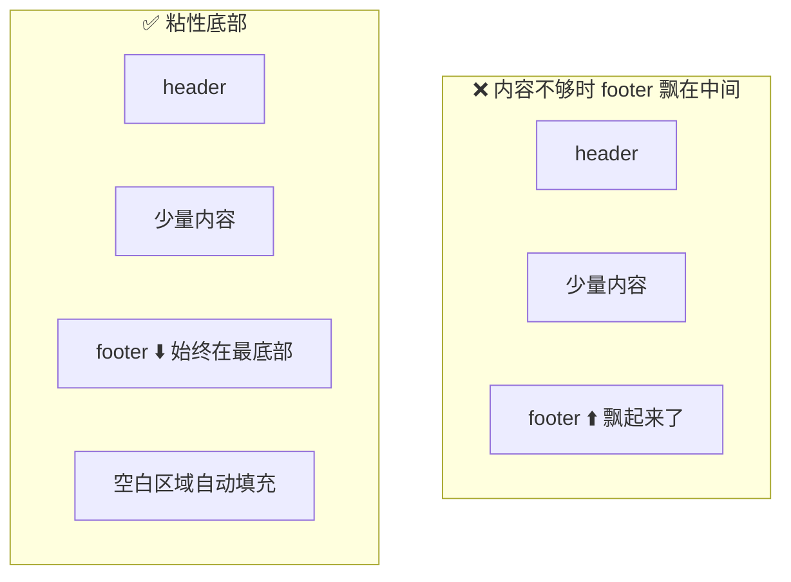

::: details 三种实现方式
```css
/* 方案1：Flex（推荐 ✅） */
body {
  display: flex;
  flex-direction: column;
  min-height: 100vh;
}
main { flex: 1; } /* 自动填充剩余空间 */

/* 方案2：Grid */
body {
  display: grid;
  min-height: 100vh;
  grid-template-rows: auto 1fr auto;
}

/* 方案3：calc */
main {
  min-height: calc(100vh - header高度 - footer高度);
}
```
:::

### 等高布局

多栏布局中，各栏高度不一致时，让所有栏保持相同高度。

| 方案 | 原理 | 推荐度 |
|------|------|--------|
| Flex `align-items: stretch` | 默认行为，子元素拉伸到容器高度 | ✅ 最推荐 |
| Grid 同行自动等高 | Grid 的特性，同行等高 | ✅ 推荐 |
| `display: table-cell` | 模拟表格单元格 | 兼容老浏览器 |
| 负 margin + padding | 经典 hack | 不推荐 |

## 🎯 面试高频题

::: details 1. 水平垂直居中有几种方式？
1. **Flex** — `display: flex; justify-content: center; align-items: center` ✅ 最常用
2. **Grid** — `display: grid; place-items: center` ✅ 最简洁
3. **绝对定位 + transform** — `position: absolute; top: 50%; left: 50%; transform: translate(-50%, -50%)`
4. **绝对定位 + margin: auto** — 需要设宽高：`position: absolute; inset: 0; margin: auto; width: 200px; height: 200px;`
5. **line-height** — 仅限单行文字：`line-height` 等于容器 `height`

**推荐**：日常用 Flex/Grid，特殊场景用绝对定位。
:::

::: details 2. 清除浮动的方法？
1. **clearfix 伪元素** ✅ 推荐 — `.clearfix::after { content: ''; display: block; clear: both; }`
2. **父元素 overflow: hidden** — 触发 BFC（注意溢出内容会被裁剪）
3. **父元素 display: flow-root** — ✅ 专为 BFC 设计，无副作用
4. **额外空标签** — `<div style="clear: both"></div>` — ❌ 不推荐，增加无语义标签

::: details 3. 重绘（Repaint）和重排（Reflow）的区别？
- **重排**：元素的位置、大小发生变化，需要重新计算布局。**开销大**。
  - 触发：修改 width、height、padding、margin、position、display 等
- **重绘**：元素外观变化但位置大小不变。**开销较小**。
  - 触发：修改 color、background、visibility、box-shadow 等

**优化策略**：
1. 批量修改 DOM（使用 DocumentFragment 或一次性修改 className）
2. 避免频繁读取布局属性（offsetWidth、scrollTop 等会强制同步布局）
3. 对需要频繁变化的元素使用 `transform` 代替位置属性

::: details 4. CSS Sprites、Base64、SVG 图标方案对比？
| 方案 | 优点 | 缺点 | 适用场景 |
|------|------|------|---------|
| CSS Sprites | 减少请求次数 | 维护困难，不能缩放 | 已逐渐淘汰 |
| Base64 | 无额外请求 | 体积增大 33%，不可缓存 | 小图标（< 2KB） |
| SVG | 矢量不失真，体积小 | 兼容性（IE 不支持） | ✅ 推荐，现代项目首选 |
| Icon Font | 使用方便 | 颜色/大小受限，有 FOIT 问题 | 兼容旧浏览器 |
| Symbol SVG | 支持多色，语义好 | 需要构建工具 | ✅ 大型项目推荐 |
:::
