# ⚡ JavaScript

> JS 是前端工程师的吃饭家伙，也是全栈工程师的必备武器

## 🧠 JS 核心概念全景

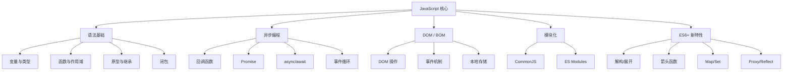

## 📦 数据类型

### 8 种数据类型

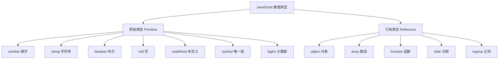

### typeof 的坑

| 表达式 | 结果 | 说明 |
|--------|------|------|
| `typeof null` | `"object"` | ⚠️ 历史遗留 bug |
| `typeof undefined` | `"undefined"` | ✅ 正确 |
| `typeof NaN` | `"number"` | ⚠️ NaN 是 number 类型 |
| `typeof function(){}` | `"function"` | ✅ 函数是特殊对象 |
| `typeof []` | `"object"` | ⚠️ 数组也是 object |

::: danger 准确判断类型的方法
```javascript
// ❌ typeof 不能区分数组和对象
typeof []      // "object"
typeof {}      // "object"

// ✅ 最准确的方式
Object.prototype.toString.call([])       // "[object Array]"
Object.prototype.toString.call({})       // "[object Object]"
Object.prototype.toString.call(null)     // "[object Null]"
Object.prototype.toString.call(undefined)// "[object Undefined]"

// ✅ 更简洁的替代方案
Array.isArray([])      // true
Array.isArray({})      // false
Number.isNaN(NaN)       // true（比全局 isNaN 更准确）
```
:::

### 隐式类型转换

JS 的隐式类型转换是 Bug 的重灾区，必须搞清楚转换规则：

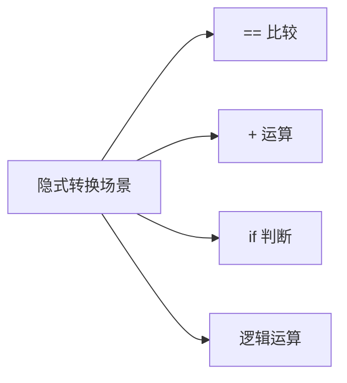

| 规则 | 转换为 | 说明 |
|------|--------|------|
| `if (value)` | Boolean | `0`、`""`、`null`、`undefined`、`NaN` 为 false |
| `+ value` | Number | `""` → `0`，`"1"` → `1`，`true` → `1` |
| `value + ""` | String | 任何类型 + 字符串 = 字符串拼接 |
| `==` 比较 | 自动转换 | ⚠️ 不同类型会隐式转换 |

::: warning 经典面试题：[] == ![] 为什么是 true？
```javascript
[] == ![]  // true

// 拆解过程：
// 1. ![] → false（数组是 truthy）
// 2. [] == false → 比较双方都转为 Number
// 3. Number([]) → 0
// 4. Number(false) → 0
// 5. 0 == 0 → true

// 其他经典坑
0 == false          // true
1 == true           // true
"" == false         // true
null == undefined   // true（特殊规则）
null == 0           // false（null 只等于 undefined）
NaN == NaN          // false（NaN 不等于任何值，包括自己！）
```

**最佳实践**：永远用 `===` 严格相等，避免 `==` 的隐式转换。
:::

### 变量声明：var vs let vs const

| 特性 | `var` | `let` | `const` |
|------|-------|-------|---------|
| 作用域 | 函数作用域 | 块级作用域 | 块级作用域 |
| 变量提升 | ✅ 提升（值为 undefined） | ❌ 不提升（TDZ） | ❌ 不提升（TDZ） |
| 重复声明 | ✅ 允许 | ❌ 报错 | ❌ 报错 |
| 重新赋值 | ✅ 允许 | ✅ 允许 | ❌ 不允许 |
| 暂时性死区 | ❌ | ✅ | ✅ |

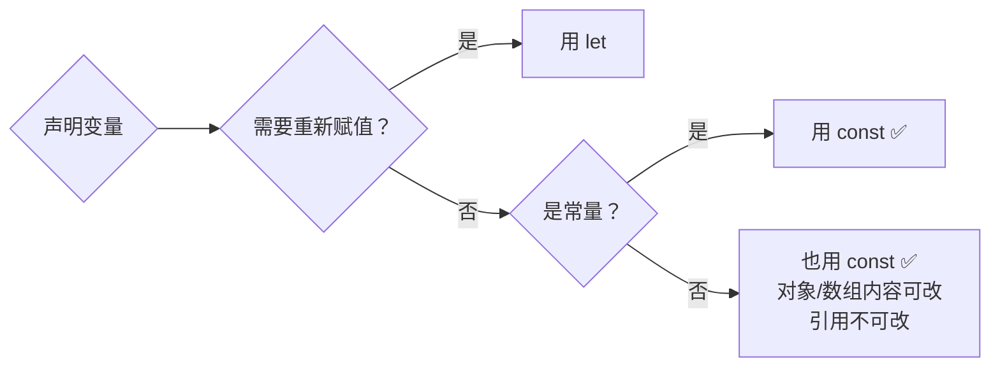

::: tip 开发规范
**默认用 `const`，需要重新赋值时用 `let`，永远不要用 `var`**。这是前端社区的共识。

```javascript
const API_URL = 'https://api.example.com';  // 常量
let count = 0;                                // 需要重新赋值
const user = { name: '张三' };                // 对象引用不变
user.name = '李四';                           // ✅ 修改属性可以
// user = { name: '李四' };                   // ❌ 不能重新赋值
```
:::

## 🧬 执行上下文与作用域链

### 执行上下文

每次函数调用都会创建一个新的执行上下文，包含三个重要组成部分：

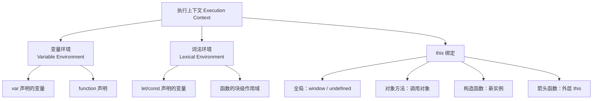

### 作用域链

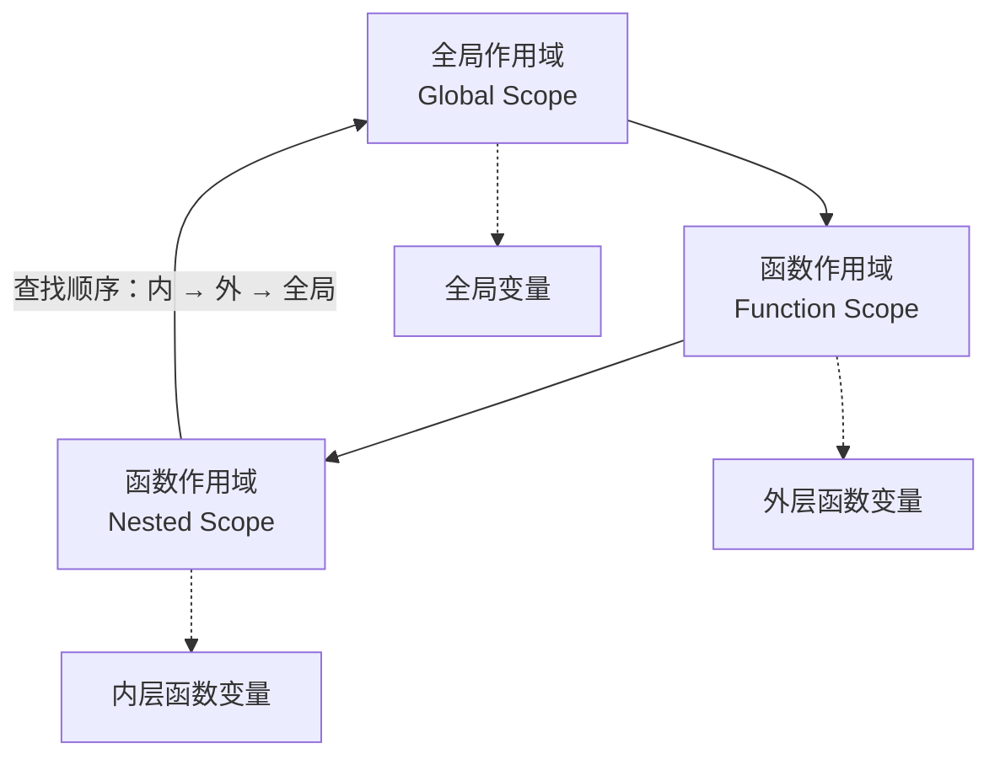

::: details 变量查找过程
```javascript
const globalVar = 'global';

function outer() {
  const outerVar = 'outer';
  
  function inner() {
    const innerVar = 'inner';
    console.log(innerVar);   // 1. 先在当前作用域找 → 找到
    console.log(outerVar);   // 2. 当前没有，向上找 → outer 找到
    console.log(globalVar);  // 3. 继续向上 → 全局找到
    console.log(missingVar); // 4. 全局也没有 → ReferenceError
  }
  
  inner();
}
```

**关键点**：作用域链在**定义时**确定（词法作用域），不是在调用时确定。这和 `this` 的动态绑定不同！
:::

## 🔒 闭包（Closure）

### 什么是闭包？

闭包是**函数与其词法环境的组合**。简单说：内部函数引用了外部函数的变量，外部函数执行完后变量不会被垃圾回收。

```mermaid
sequenceDiagram
    participant 全局 as 全局作用域
    participant 外部 as outer 函数
    participant 内部 as inner 函数（闭包）
    participant 垃圾回收 as 垃圾回收器

    全局->>外部: 调用 outer()
    外部->>外部: 创建 count 变量
    外部->>内部: 定义 inner()（引用 count）
    外部-->>全局: 返回 inner 函数
    Note over 垃圾回收: outer 执行完毕<br/>但 count 被 inner 引用<br/>不会被回收 ✅
    全局->>内部: 调用 inner()
    内部->>内部: 访问 count（仍存活）
```

### 闭包的实际应用

::: details 1. 数据私有化
```javascript
// 模拟私有变量 — Java 开发者最熟悉的模式
function createCounter() {
  let count = 0; // 私有变量，外部无法直接访问
  
  return {
    increment() { return ++count; },
    decrement() { return --count; },
    getCount() { return count; },
  };
}

const counter = createCounter();
counter.increment(); // 1
counter.increment(); // 2
counter.getCount();  // 2
// counter.count;     // undefined — 无法直接访问
```

::: details 2. 函数柯里化（Currying）
```javascript
// 柯里化：将多参数函数转为一系列单参数函数
function curry(fn) {
  return function curried(...args) {
    if (args.length >= fn.length) {
      return fn.apply(this, args);
    }
    return function(...args2) {
      return curried.apply(this, args.concat(args2));
    };
  };
}

// 使用
const add = (a, b, c) => a + b + c;
const curriedAdd = curry(add);

curriedAdd(1)(2)(3);    // 6
curriedAdd(1, 2)(3);    // 6
curriedAdd(1)(2, 3);    // 6
```

::: details 3. 防抖和节流
```javascript
// 防抖：事件触发后等待 n 秒再执行，n 秒内又触发则重新计时
function debounce(fn, delay = 300) {
  let timer = null;
  return function(...args) {
    clearTimeout(timer);
    timer = setTimeout(() => fn.apply(this, args), delay);
  };
}

// 节流：事件触发后立即执行，然后 n 秒内不再执行
function throttle(fn, interval = 300) {
  let lastTime = 0;
  return function(...args) {
    const now = Date.now();
    if (now - lastTime >= interval) {
      lastTime = now;
      fn.apply(this, args);
    }
  };
}

// 使用场景
input.addEventListener('input', debounce(search, 500));  // 搜索输入
window.addEventListener('scroll', throttle(handleScroll, 200)); // 滚动加载
```
:::

::: warning 闭包的陷阱
```javascript
// ❌ 经典坑：循环中的闭包
for (var i = 0; i < 3; i++) {
  setTimeout(() => console.log(i), 0); // 输出 3, 3, 3
}

// ✅ 修复 1：用 let（推荐）
for (let i = 0; i < 3; i++) {
  setTimeout(() => console.log(i), 0); // 输出 0, 1, 2
}

// ✅ 修复 2：IIFE 创建独立作用域
for (var i = 0; i < 3; i++) {
  (function(j) {
    setTimeout(() => console.log(j), 0);
  })(i);
}
```

**闭包会导致内存泄漏吗？** 理论上闭包会阻止变量被回收，但现代 JS 引擎（V8）已经很智能，能正确识别并回收不再被引用的闭包变量。只有**不小心持有大对象的引用**时才可能造成内存泄漏。
:::

## 🔄 异步编程

### 异步演进史

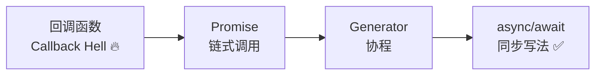

| 方案 | 优点 | 缺点 | 适用场景 |
|------|------|------|---------|
| 回调函数 | 简单直观 | 回调地狱、错误难处理 | 简单的一次性回调 |
| Promise | 链式调用、统一错误处理 | 链式过长可读性差 | 多个异步操作串联 |
| async/await | 同步写法、可读性好 | 需要 try-catch 包裹 | ✅ 日常开发首选 |
| Promise.all | 并行执行 | 一个失败全部失败 | 多个独立异步操作 |
| Promise.allSettled | 并行执行 | 成功失败都返回 | 需要全部结果的场景 |
| Promise.race | 取最快的结果 | 其他不会取消 | 超时控制、竞速 |

### Promise 详解

Promise 有三种状态，状态一旦改变就不可逆：

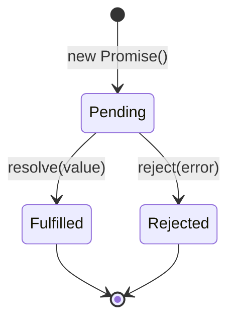

::: details Promise 静态方法
```javascript
// Promise.all — 全部成功才成功，一个失败就失败
const [users, posts] = await Promise.all([
  fetch('/api/users').then(r => r.json()),
  fetch('/api/posts').then(r => r.json()),
]);

// Promise.allSettled — 等待全部完成，不管成功失败
const results = await Promise.allSettled([
  fetch('/api/user/1'),
  fetch('/api/user/2'),
]);
results.forEach(r => {
  if (r.status === 'fulfilled') console.log('成功:', r.value);
  else console.log('失败:', r.reason);
});

// Promise.race — 取最快的结果（常用于超时控制）
const result = await Promise.race([
  fetch('/api/data'),
  new Promise((_, reject) => setTimeout(() => reject('超时'), 5000)),
]);

// Promise.any — 取第一个成功的结果（和 race 相反）
const first = await Promise.any([
  fetch('/api/primary').catch(() => null),
  fetch('/api/backup').catch(() => null),
]);
```
:::

## 🔄 事件循环（Event Loop）

事件循环是 JS 异步的核心机制，理解它才能理解 JS 的执行顺序。

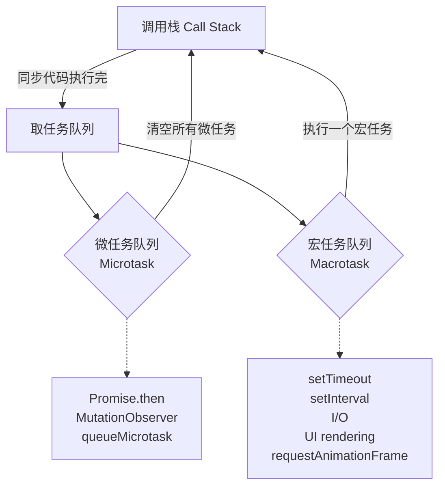

### 执行顺序规则

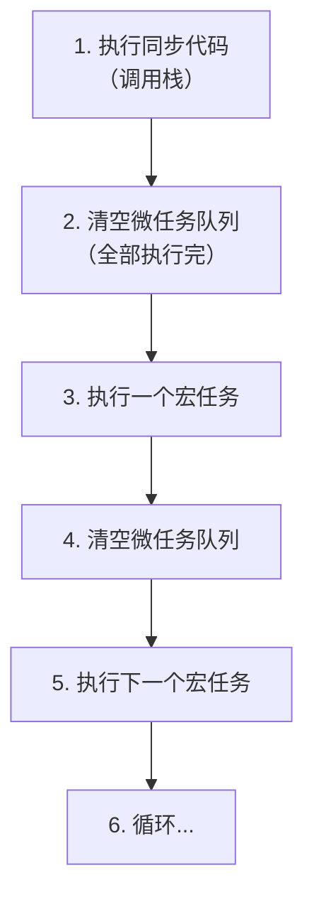

::: details 经典面试题
```javascript
console.log('1');                    // 同步

setTimeout(() => {
  console.log('2');                  // 宏任务
  Promise.resolve().then(() => {
    console.log('3');                // 微任务（在宏任务内）
  });
}, 0);

Promise.resolve().then(() => {
  console.log('4');                  // 微任务
  setTimeout(() => {
    console.log('5');                // 宏任务（在微任务内）
  }, 0);
});

console.log('6');                    // 同步

// 输出顺序：1 → 6 → 4 → 2 → 3 → 5
```

**解析**：
1. 执行同步代码：`1`、`6`（setTimeout 和 Promise.then 入队）
2. 清微任务：执行 `4`（setTimeout 入队）
3. 取宏任务：执行 `2`（Promise.then 入队）
4. 清微任务：执行 `3`
5. 取宏任务：执行 `5`

::: details 再来一题：宏任务和微任务的嵌套
```javascript
setTimeout(() => console.log('A'), 0);

new Promise((resolve) => {
  console.log('B');    // 同步执行！Promise 构造函数是同步的
  resolve();
}).then(() => {
  console.log('C');
  return new Promise((resolve) => {
    console.log('D');  // 同步执行
    resolve();
  });
}).then(() => {
  console.log('E');
});

console.log('F');

// 输出：B → F → C → D → E → A
```
:::

## 🧬 原型与原型链

原型链是 JS 实现继承的底层机制，也是面试高频考点。

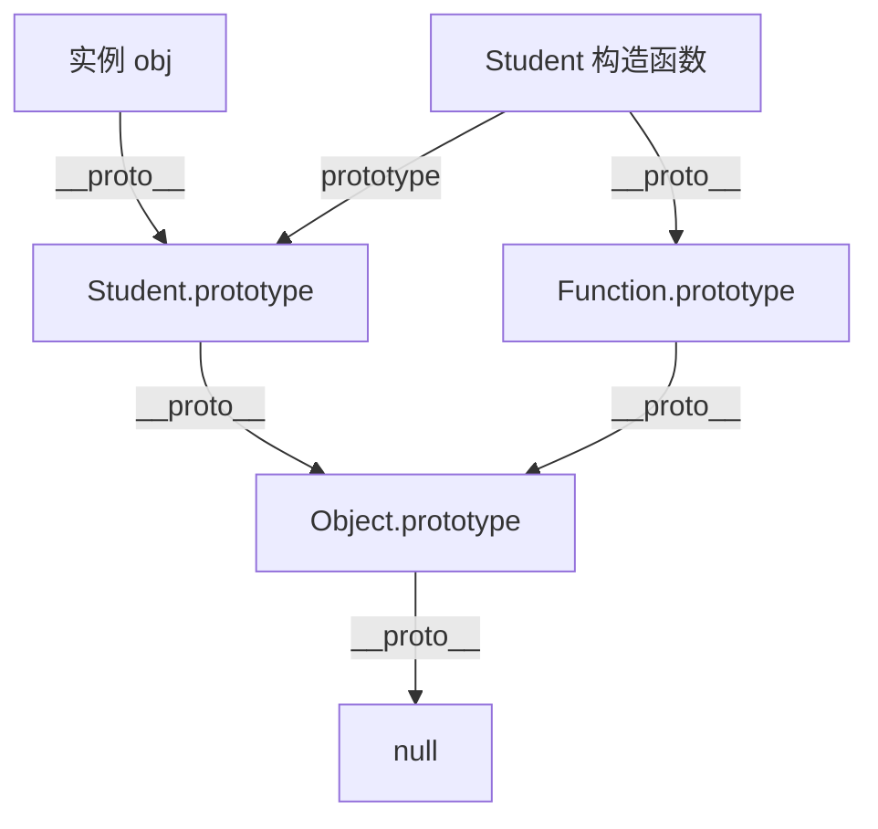

| 属性 | 含义 |
|------|------|
| `prototype` | 函数特有的属性，指向原型对象 |
| `__proto__` | 对象特有的属性，指向创建它的构造函数的 prototype |
| `constructor` | 原型对象上的属性，指回构造函数 |

::: tip 属性查找顺序
访问一个属性时，JS 引擎会沿着原型链向上查找：**实例自身 → 构造函数.prototype → Object.prototype → null**。找到就返回，找不到返回 undefined。

```javascript
function Person(name) {
  this.name = name; // 实例属性
}
Person.prototype.sayHi = function() { // 原型方法
  return `Hi, I'm ${this.name}`;
};

const p = new Person('张三');
p.name;       // '张三' → 实例自身找到
p.sayHi();    // 'Hi, I'm 张三' → 实例没有，原型链上找到
p.toString(); // '[object Object]' → 继续向上，Object.prototype 找到
p.fly();      // undefined → 原型链到顶（null）都没找到
```
:::

### ES6 class 语法

```javascript
class Student extends Person {
  constructor(name, grade) {
    super(name); // 调用父类构造函数
    this.grade = grade;
  }
  
  // 实例方法（挂在 prototype 上）
  study() {
    return `${this.name} 正在学习`;
  }
  
  // 静态方法（挂在类本身上，不通过实例调用）
  static create(name, grade) {
    return new Student(name, grade);
  }
}

// getter / setter
class Circle {
  constructor(radius) { this._radius = radius; }
  
  get area() { return Math.PI * this._radius ** 2; }  // 只读属性
  set radius(val) { this._radius = Math.max(0, val); } // 带验证的 setter
}
```

::: info class 和 Java 的对比
| 对比 | Java | JavaScript |
|------|------|-----------|
| 继承 | `extends`（单继承） | `extends`（单继承，原型链） |
| 接口 | `implements`（多实现） | ❌ 没有接口（用 TS） |
| 抽象类 | `abstract class` | ❌ 没有（用组合模式替代） |
| 方法重载 | ✅ 支持签名重载 | ❌ 不支持（用参数判断替代） |
| 访问修饰符 | `public/private/protected` | `#` 私有字段（ES2022） |
| 多态 | 方法重写 + 运行时绑定 | 方法重写 + 原型链查找 |
:::

## 📦 ES6+ 实用特性

### 解构赋值

```javascript
// 数组解构
const [a, b, ...rest] = [1, 2, 3, 4, 5];
// a=1, b=2, rest=[3,4,5]

// 对象解构 + 重命名 + 默认值
const { name: userName, age = 18 } = { name: '张三' };
// userName='张三', age=18

// 函数参数解构（非常常用！）
function createUser({ name, role = 'user' } = {}) {
  return { name, role, createdAt: Date.now() };
}

// 嵌套解构
const { address: { city, zip } } = user;
```

### 箭头函数 vs 普通函数

| 特性 | 普通函数 | 箭头函数 |
|------|---------|---------|
| `this` | 调用时确定（动态绑定） | 定义时确定（词法绑定） |
| `arguments` | ✅ 有 | ❌ 没有 |
| 构造函数 | ✅ 可以 new | ❌ 不能 new |
| `yield` | ✅ 可以 | ❌ 不能 |
| 箭头函数适用 | 对象方法、需要动态 this | 回调函数、数组方法 |

::: warning 箭头函数的 this 陷阱
```javascript
const obj = {
  name: '张三',
  sayHi() { console.log(this.name); },      // ✅ '张三'
  sayHiArrow: () => console.log(this.name), // ❌ undefined（指向外层 this）
};

// 定时器中的经典问题
class Timer {
  constructor() {
    this.seconds = 0;
  }
  
  start() {
    // ❌ 普通函数 this 指向 window/undefined
    // setInterval(function() { this.seconds++; }, 1000);
    
    // ✅ 箭头函数 this 继承外层
    setInterval(() => { this.seconds++; }, 1000);
  }
}
```
:::

### Map / Set / WeakMap / WeakSet

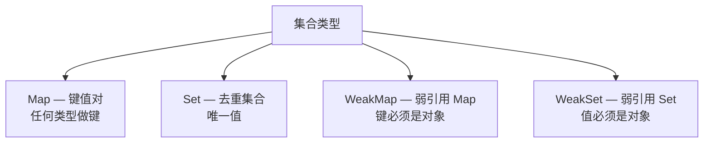

| 类型 | 键类型 | 可遍历 | 弱引用 | 适用场景 |
|------|--------|--------|--------|---------|
| `Map` | 任意类型 | ✅ | ❌ | 需要非字符串键的键值对 |
| `Set` | — | ✅ | ❌ | 数组去重、集合运算 |
| `WeakMap` | 仅对象 | ❌ | ✅ | 关联额外数据，不阻止垃圾回收 |
| `WeakSet` | 仅对象 | ❌ | ✅ | 标记对象（如标记已访问 DOM 节点） |

::: details Map 和 Set 的常用操作
```javascript
// Map
const map = new Map();
map.set('name', '张三');
map.set(42, 'answer');
map.set({ id: 1 }, 'object key'); // 对象也能做键！

map.get('name');    // '张三'
map.has('name');    // true
map.delete('name'); // true
map.size;           // 2

// Map 遍历
for (const [key, value] of map) { /* ... */ }
map.forEach((value, key) => { /* ... */ });

// Set 去重
const arr = [1, 2, 2, 3, 3, 3];
const unique = [...new Set(arr)]; // [1, 2, 3]

// Set 集合运算
const a = new Set([1, 2, 3]);
const b = new Set([2, 3, 4]);
const union = new Set([...a, ...b]);           // 并集 {1,2,3,4}
const intersect = new Set([...a].filter(x => b.has(x))); // 交集 {2,3}
```
:::

### Proxy 与 Reflect

Proxy 可以拦截对象的基本操作，Vue 3 的响应式就是基于 Proxy 实现的：

```javascript
const target = { name: '张三', age: 25 };

const proxy = new Proxy(target, {
  get(target, key, receiver) {
    console.log(`读取了 ${key}`);
    return Reflect.get(target, key, receiver);
  },
  set(target, key, value, receiver) {
    console.log(`设置了 ${key} = ${value}`);
    return Reflect.set(target, key, value, receiver);
  },
  deleteProperty(target, key) {
    console.log(`删除了 ${key}`);
    return Reflect.deleteProperty(target, key);
  },
});

proxy.name;  // 读取了 name → '张三'
proxy.age = 26; // 设置了 age = 26
```

| 拦截器 | 触发时机 |
|--------|---------|
| `get` | 读取属性 |
| `set` | 设置属性 |
| `has` | `in` 操作符 |
| `deleteProperty` | `delete` 操作 |
| `apply` | 函数调用（Proxy 包裹函数时） |
| `construct` | `new` 操作 |

::: tip Proxy vs Object.defineProperty
| 对比 | defineProperty | Proxy |
|------|---------------|-------|
| 新增属性 | ❌ 需要手动监听 | ✅ 自动拦截 |
| 数组变化 | ❌ 需要重写数组方法 | ✅ 自动拦截 |
| 性能 | 初始化时递归遍历 | 惰性代理，按需拦截 |
| 删除属性 | ❌ 无法监听 | ✅ deleteProperty |
:::

### 常用数组方法

| 方法 | 是否改变原数组 | 返回值 | 用途 |
|------|--------------|--------|------|
| `map()` | ❌ | 新数组 | 映射转换 |
| `filter()` | ❌ | 新数组 | 过滤筛选 |
| `reduce()` | ❌ | 累计值 | 汇总计算 |
| `find()` | ❌ | 第一个匹配项 | 查找单个 |
| `findIndex()` | ❌ | 第一个匹配索引 | 查找索引 |
| `some()` | ❌ | boolean | 是否有匹配 |
| `every()` | ❌ | boolean | 是否全匹配 |
| `flat()` | ❌ | 扁平化新数组 | 数组降维 |
| `sort()` | ✅ | 原数组 | 排序 |
| `splice()` | ✅ | 被删元素 | 增删改 |
| `forEach()` | ❌ | undefined | 遍历（无返回值） |

::: tip 和 Java Stream 对比
| Java Stream | JS Array | 说明 |
|-------------|----------|------|
| `.map()` | `.map()` | 一一对应 |
| `.filter()` | `.filter()` | 一一对应 |
| `.reduce()` | `.reduce()` | 一一对应 |
| `.findFirst()` | `.find()` | JS 找的是值不是 Optional |
| `.anyMatch()` | `.some()` | 一一对应 |
| `.allMatch()` | `.every()` | 一一对应 |
| `.collect(toList())` | 直接返回数组 | JS 方法链直接产出 |
| `.flatMap()` | `.flat()` + `.map()` 或 `.flatMap()` | 一一对应 |

**区别**：Java Stream 是惰性求值（需要 terminal operation），JS 数组方法是立即执行。
:::

## 🧩 模块化

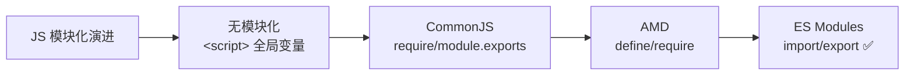

| 规范 | 环境 | 语法 | 特点 |
|------|------|------|------|
| CommonJS | Node.js | `require()` / `module.exports` | 同步加载，运行时 |
| ES Modules | 浏览器 + Node | `import` / `export` | 静态分析，编译时 |

::: details ES Modules 常用写法
```javascript
// 命名导出
export const API_URL = 'https://api.example.com';
export function fetchData() { /* ... */ }
export class UserService { /* ... */ }

// 默认导出（一个文件只能有一个）
export default class UserService { /* ... */ }

// 导入
import UserService, { API_URL, fetchData } from './service';

// 重命名导入
import { fetchData as fetchApi } from './service';

// 全部导入
import * as service from './service';

// 动态导入（按需加载 — 代码分割的基础）
const module = await import('./heavy-module.js');
```
:::

## 🌐 Web APIs

### Fetch API

```javascript
// GET 请求
const response = await fetch('/api/users');
const data = await response.json();

// POST 请求
const res = await fetch('/api/users', {
  method: 'POST',
  headers: { 'Content-Type': 'application/json' },
  body: JSON.stringify({ name: '张三', age: 25 }),
});

// 带超时的请求
async function fetchWithTimeout(url, timeout = 5000) {
  const controller = new AbortController();
  const timer = setTimeout(() => controller.abort(), timeout);
  
  try {
    const res = await fetch(url, { signal: controller.signal });
    return await res.json();
  } catch (error) {
    if (error.name === 'AbortError') throw new Error('请求超时');
    throw error;
  } finally {
    clearTimeout(timer);
  }
}
```

### 本地存储

| 方案 | 容量 | 生命周期 | 跨标签页 | API |
|------|------|---------|---------|-----|
| Cookie | 4KB | 可设置过期时间 | ✅ | `document.cookie` |
| localStorage | 5-10MB | 永久存储 | ✅ | `localStorage.setItem/getItem` |
| sessionStorage | 5-10MB | 标签页关闭即清除 | ❌ | 同上 |
| IndexedDB | 数百 MB+ | 永久存储 | ✅ | 异步 API |

::: details 存储方案对比与选型
```javascript
// Cookie — 主要用于 HTTP 请求携带身份凭证
document.cookie = 'token=abc123; path=/; max-age=3600; Secure; HttpOnly';

// localStorage — 持久化数据
localStorage.setItem('theme', 'dark');
const theme = localStorage.getItem('theme');

// sessionStorage — 临时数据（如表单草稿）
sessionStorage.setItem('draft', JSON.stringify(formData));

// IndexedDB — 大量结构化数据（如离线缓存）
const db = await idb.open('myDB', 1, {
  upgrade(db) {
    db.createObjectStore('users', { keyPath: 'id' });
  },
});
```

**选型建议**：
- 用户设置/主题偏好 → `localStorage`
- 表单临时数据/步骤状态 → `sessionStorage`
- 认证 token → `Cookie`（HttpOnly + Secure）
- 大量离线数据 → `IndexedDB`
:::

## 🎯 面试高频题

::: details 1. this 指向什么？
- **普通函数**：谁调用就指向谁（隐式绑定）
- **箭头函数**：定义时外层的 this（词法绑定）
- **new**：指向新创建的实例
- **call/apply/bind**：指向第一个参数（显式绑定）
- **事件回调**：指向绑定事件的元素
- **全局**：浏览器中指向 `window`，严格模式为 `undefined`

**优先级**：`new` > `call/apply/bind` > 隐式绑定 > 默认绑定
:::

::: details 2. 深拷贝 vs 浅拷贝？
| 方式 | 深浅 | 适用 | 注意事项 |
|------|------|------|---------|
| `Object.assign()` | 浅拷贝 | 一层对象 | 只拷贝可枚举属性 |
| `{ ...obj }` | 浅拷贝 | 一层对象 | 同上 |
| `JSON.parse(JSON.stringify())` | 深拷贝 | 简单对象 | ❌ 不能有函数/undefined/Symbol/循环引用 |
| `structuredClone()` | 深拷贝 | ✅ 推荐 | 现代浏览器原生支持 |
| `lodash.cloneDeep()` | 深拷贝 | 功能最全 | 需要引入库 |
:::

::: details 3. 事件冒泡和事件委托？
**事件流**：捕获阶段（从外到内）→ 目标阶段 → 冒泡阶段（从内到外）

**事件委托**：利用事件冒泡，将子元素的事件监听器绑定在父元素上。减少事件监听器数量，提升性能。

```javascript
// ❌ 每个按钮都绑定事件
document.querySelectorAll('.btn').forEach(btn => {
  btn.addEventListener('click', handleClick);
});

// ✅ 事件委托 — 只在父元素上绑定一个
document.querySelector('.btn-list').addEventListener('click', (e) => {
  const btn = e.target.closest('.btn'); // 找到最近的 .btn
  if (btn) handleClick(btn.dataset.id);
});
```
:::

::: details 4. Iterator 和 Generator 是什么？
**Iterator**：实现了 `next()` 方法的对象，通过 `for...of` 遍历。数组、Map、Set、String 都是可迭代对象。

**Generator**：用 `function*` 声明，通过 `yield` 暂停和恢复执行。可以手动控制迭代过程。

```javascript
// Generator 生成斐波那契数列
function* fibonacci() {
  let a = 0, b = 1;
  while (true) {
    yield a;
    [a, b] = [b, a + b];
  }
}

const gen = fibonacci();
gen.next().value; // 0
gen.next().value; // 1
gen.next().value; // 1
gen.next().value; // 2
gen.next().value; // 3
```
:::
