# 🚀 React 进阶

> 理解 React 的设计哲学，写出更高性能的应用

## 🧠 React 设计哲学

### 单向数据流

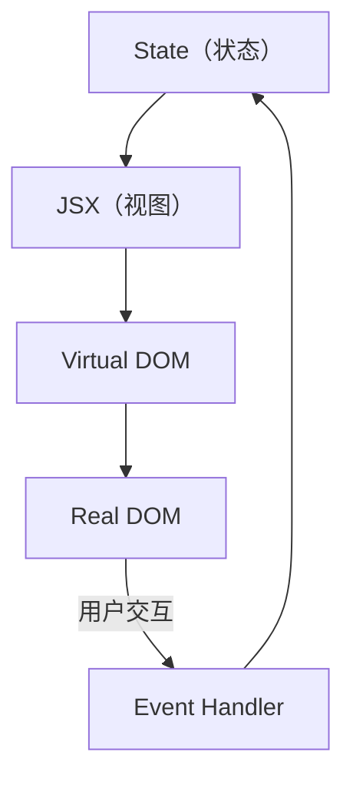

React 的核心理念：**UI = f(state)**。给定相同的状态，总是渲染相同的 UI。

### 不可变数据

| 操作 | ❌ 可变（不推荐） | ✅ 不可变（推荐） |
|------|-----------------|-----------------|
| 新增 | `arr.push(item)` | `[...arr, item]` |
| 删除 | `arr.splice(i, 1)` | `arr.filter((_, idx) => idx !== i)` |
| 修改 | `obj.name = 'new'` | `{ ...obj, name: 'new' }` |
| 嵌套修改 | `obj.a.b = 1` | `{ ...obj, a: { ...obj.a, b: 1 } }` |

::: warning 为什么必须不可变？
React 通过**引用比较（Object.is）**来判断状态是否变化。如果直接修改对象/数组，引用不变，React 不会重新渲染。

```typescript
// ❌ 引用没变，React 不会重新渲染
state.list.push(newItem);
setState(state);

// ✅ 新引用，React 会重新渲染
setState([...state.list, newItem]);
```

**性能提示**：浅拷贝（`...`、`Object.assign`）通常足够，不需要每次都深拷贝。只有嵌套层级深的对象需要逐层展开。
:::

## ⚡ 性能优化

### 优化全景图

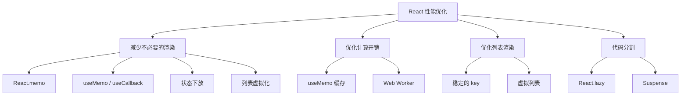

### React.memo — 避免子组件无效渲染

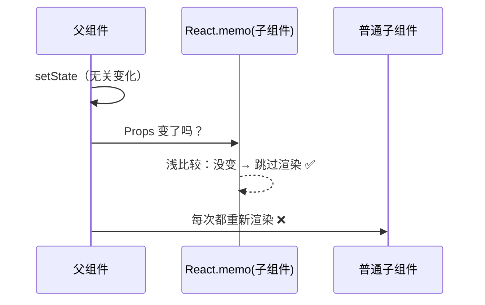

| 场景 | 是否需要 memo | 原因 |
|------|-------------|------|
| 子组件渲染开销大 | ✅ 需要 | 避免昂贵计算 |
| 子组件频繁收到相同 props | ✅ 需要 | 避免无效渲染 |
| 子组件渲染很快 | ❌ 不需要 | memo 本身也有比较开销 |
| 传递 children | ❌ 通常不需要 | children 引用一般稳定 |

```typescript
// React.memo — 浅比较 props
const UserCard = React.memo(function UserCard({ user }: { user: User }) {
  return <div>{user.name}</div>;
});

// 自定义比较函数 — 处理复杂 props
const UserCard = React.memo(
  function UserCard({ user, onSelect }) { /* ... */ },
  (prevProps, nextProps) => {
    return prevProps.user.id === nextProps.user.id; // 只比较 id
  }
);
```

::: tip 状态下放（State Colocation）
如果一个状态只在某个子树中使用，不要放在公共父组件中。**状态放得越低，重新渲染的范围越小**。

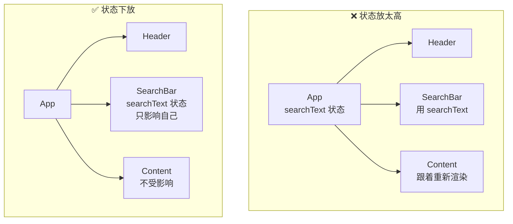
:::

### 代码分割

```typescript
import { lazy, Suspense } from 'react';

// React.lazy — 动态导入组件
const Dashboard = lazy(() => import('./views/Dashboard'));
const Settings = lazy(() => import('./views/Settings'));

function App() {
  return (
    <Suspense fallback={<div>加载中...</div>}>
      <Routes>
        <Route path="/dashboard" element={<Dashboard />} />
        <Route path="/settings" element={<Settings />} />
      </Routes>
    </Suspense>
  );
}
```

::: details 虚拟列表
```typescript
import { FixedSizeList } from 'react-window';

// 渲染 10000 条数据，只渲染可视区域的 DOM
function MyList({ items }) {
  const Row = ({ index, style }) => (
    <div style={style}>{items[index].name}</div>
  );
  
  return (
    <FixedSizeList
      height={600}
      itemCount={items.length}
      itemSize={50}
      width="100%"
    >
      {Row}
    </FixedSizeList>
  );
}
```
:::

## 🧬 Fiber 架构

### 什么是 Fiber？

Fiber 是 React 16 引入的**新的协调引擎**，解决的核心问题是：大型组件树的更新可能阻塞主线程导致页面卡顿。

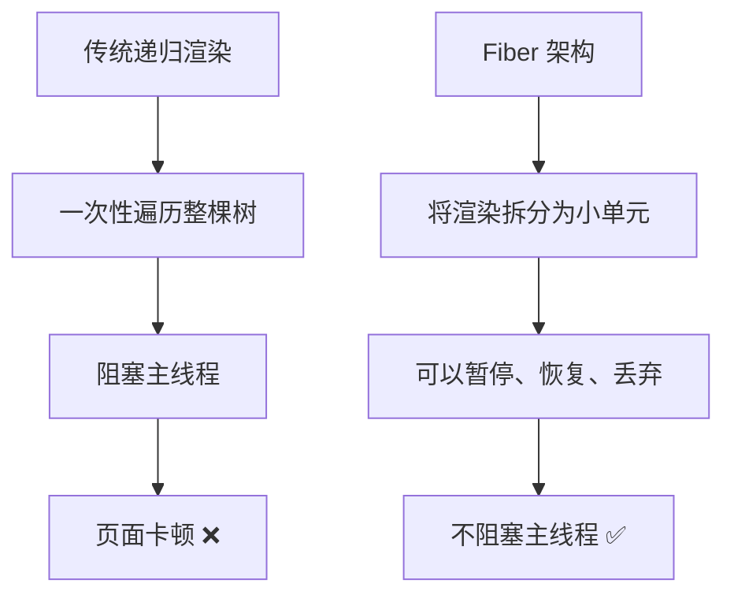

### Fiber 的工作原理

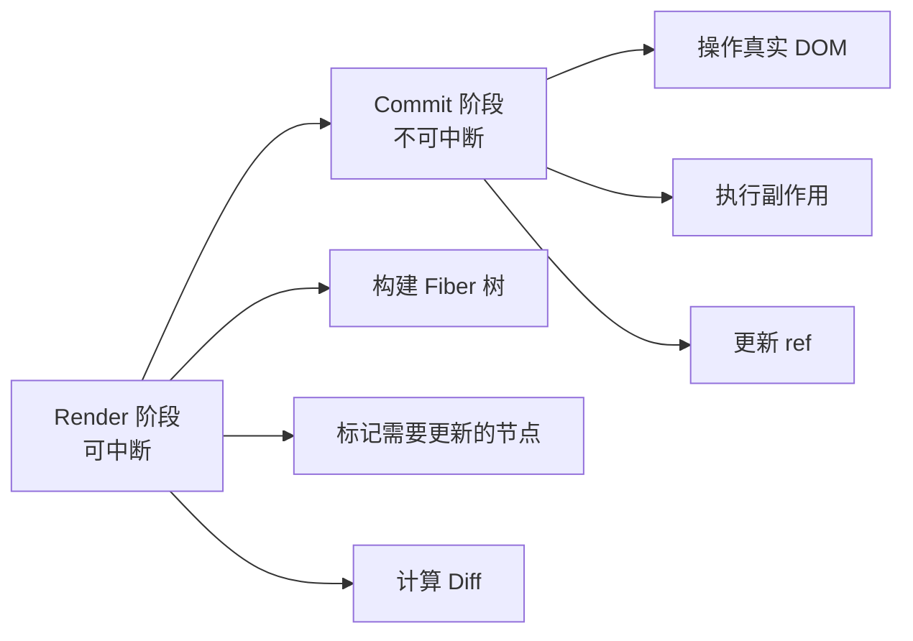

| 阶段 | 是否可中断 | 说明 |
|------|-----------|------|
| Render（调度） | ✅ 可中断 | 构建 Fiber 树、计算 Diff、标记更新 |
| Commit（提交） | ❌ 不可中断 | 操作真实 DOM、执行 useEffect、更新 ref |

### 双缓冲机制

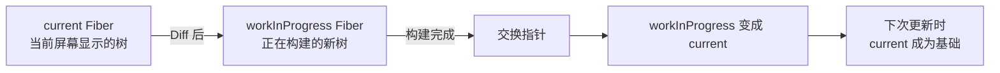

::: details Fiber 节点结构
```typescript
interface Fiber {
  // 静态结构
  tag: FunctionComponent | ClassComponent | HostComponent; // 组件类型
  type: Function | string; // 函数组件或 DOM 标签名
  key: string | null;
  
  // 树结构
  return: Fiber | null; // 父节点
  child: Fiber | null;  // 第一个子节点
  sibling: Fiber | null; // 下一个兄弟节点
  
  // 工作单元
  pendingProps: any;    // 待处理的 props
  memoizedProps: any;   // 上一次的 props
  memoizedState: any;   // 上一次的 state
  updateQueue: any;     // 更新队列
  
  // 副作用
  flags: number;        // 需要执行的操作（Placement、Update、Deletion）
}
```
:::

## 🔄 并发特性（React 18）

### 自动批处理

React 18 所有状态更新**自动批处理**，合并为一次渲染：

```typescript
// React 18：所有更新自动批处理
const handleClick = () => {
  setCount(1);      // 不会立即渲染
  setName('Vue');   // 不会立即渲染
  // 两个更新合并为一次渲染 ✅
};

// React 17：setTimeout 中的更新不会批处理
setTimeout(() => {
  setCount(1);  // 渲染一次
  setName('Vue'); // 再渲染一次 ❌
}, 0);
```

### Transitions — 区分紧急和非紧急更新

```typescript
import { startTransition, useTransition } from 'react';

// startTransition — 将更新标记为非紧急
function SearchBox() {
  const [query, setQuery] = useState('');
  const [results, setResults] = useState([]);
  
  function handleChange(e) {
    const value = e.target.value;
    
    // ✅ 紧急更新 — 立即响应输入
    setQuery(value);
    
    // ⏳ 非紧急更新 — 搜索结果可以延迟
    startTransition(() => {
      const filtered = filterResults(value); // 耗时计算
      setResults(filtered);
    });
  }
}

// useTransition — 带 pending 状态的 transition
function [isPending, startTransition] = useTransition();
// isPending 为 true 时可以显示加载状态
```

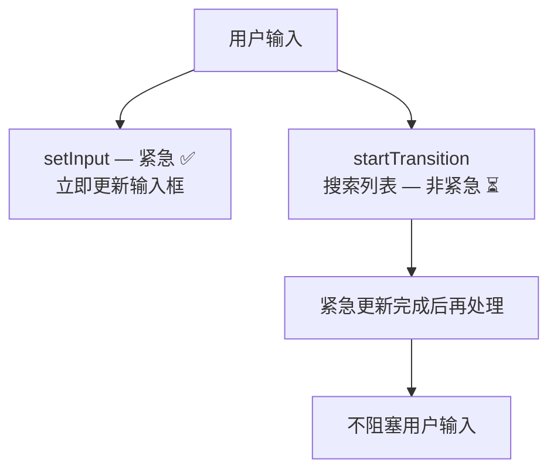

### useDeferredValue

```typescript
// 延迟值 — 类似 debounce 但由 React 调度
const [query, setQuery] = useState('');
const deferredQuery = useDeferredValue(query);

// query 立即更新（输入框）
// deferredQuery 延迟更新（搜索结果列表）
<SearchResults query={deferredQuery} />
```

### Suspense 改进

```typescript
// Suspense 用于数据获取
<Suspense fallback={<Skeleton />}>
  <UserProfile userId={id} />
</Suspense>

// UserProfile 内部用 use() 或数据获取库（SWR/React Query）
// 数据还没准备好时，自动显示 fallback
```

## 🌐 Next.js — React 的全栈框架

### 渲染模式

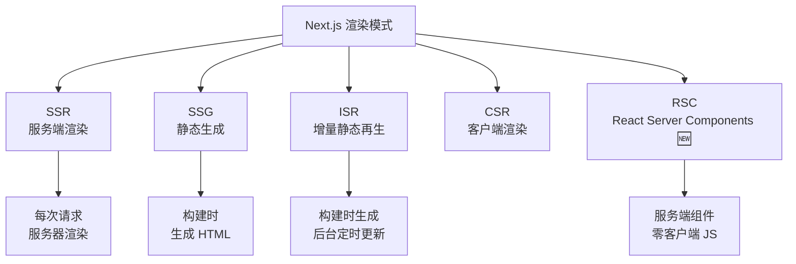

| 渲染模式 | 函数 | 适用场景 |
|---------|------|---------|
| SSR | `getServerSideProps` | 动态内容、个性化页面 |
| SSG | `getStaticProps` | 博客、文档、营销页 |
| ISR | `getStaticProps` + `revalidate` | 内容不常变但需要更新 |
| CSR | 默认 | 后台管理、SPA |
| RSC | `async` Server Component | 减少客户端 JS |

### React Server Components（RSC）

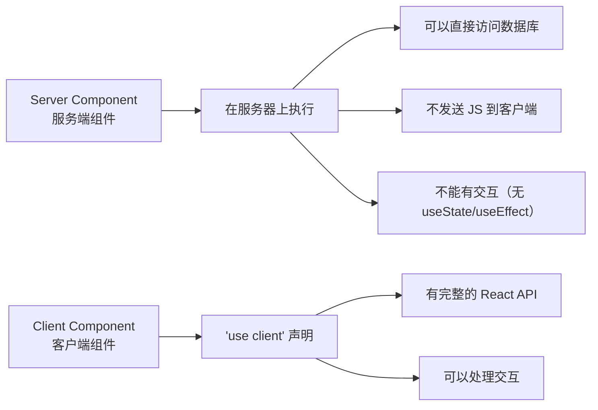

::: details RSC 实战
```typescript
// app/page.tsx — Server Component（默认）
// 直接在组件中访问数据库！不需要 API
async function Page() {
  const users = await db.user.findMany(); // 直接查询数据库
  
  return (
    <div>
      <h1>用户列表</h1>
      <UserTable users={users} /> {/* 传递给 Client Component */}
    </div>
  );
}

// UserTable.tsx — Client Component
'use client';
import { useState } from 'react';

function UserTable({ users }) {
  const [filter, setFilter] = useState('');
  const filtered = users.filter(u => u.name.includes(filter));
  
  return (
    <div>
      <input value={filter} onChange={e => setFilter(e.target.value)} />
      {filtered.map(u => <div key={u.id}>{u.name}</div>)}
    </div>
  );
}
```

**RSC 的优势**：
1. **零客户端 JS** — 服务端组件不会发送 JS 到浏览器
2. **直接访问后端** — 无需 API 层
3. **自动代码分割** — Client Component 自动按需加载
4. **流式渲染** — HTML 可以逐步发送，不需要等所有数据
:::

## 🔄 状态管理方案

### 方案对比

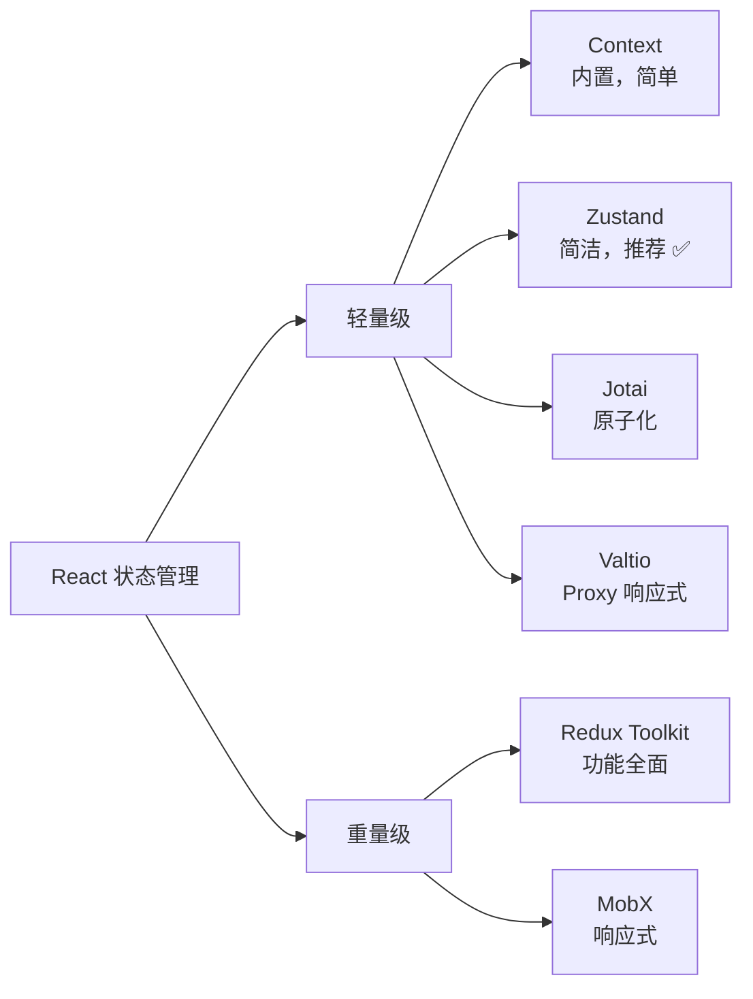

| 方案 | 体积 | 学习成本 | 适用场景 |
|------|------|---------|---------|
| Context | 0（内置） | 低 | 简单的跨层级数据（主题、语言） |
| Zustand | ~1KB | 极低 | ✅ 中小型项目首选 |
| Jotai | ~2KB | 低 | 原子化状态管理 |
| Redux Toolkit | ~11KB | 中 | 大型复杂项目 |
| MobX | ~16KB | 中 | 需要细粒度响应式 |

### Zustand 实战

```typescript
import { create } from 'zustand';

// 创建 Store
const useUserStore = create<UserState>((set) => ({
  token: '',
  userInfo: null as User | null,
  
  login: async (credentials) => {
    const res = await loginApi(credentials);
    set({ token: res.token, userInfo: res.user });
    localStorage.setItem('token', res.token);
  },
  
  logout: () => {
    set({ token: '', userInfo: null });
    localStorage.removeItem('token');
  },
}));

// 组件中使用 — 直接调用 Hook
function Header() {
  const { userInfo, logout } = useUserStore();
  return <div>{userInfo?.name} <button onClick={logout}>退出</button></div>;
}

// 选择性订阅 — 只在 token 变化时重新渲染
const token = useUserStore(state => state.token);
```

::: details Redux Toolkit 实战
```typescript
// store/userSlice.ts
import { createSlice, createAsyncThunk } from '@reduxjs/toolkit';

export const fetchUser = createAsyncThunk('user/fetch', async (id: number) => {
  const res = await api.getUser(id);
  return res.data;
});

const userSlice = createSlice({
  name: 'user',
  initialState: { data: null, loading: false, error: null },
  reducers: {
    clearUser: (state) => { state.data = null; },
  },
  extraReducers: (builder) => {
    builder
      .addCase(fetchUser.pending, (state) => { state.loading = true; })
      .addCase(fetchUser.fulfilled, (state, action) => {
        state.loading = false;
        state.data = action.payload;
      })
      .addCase(fetchUser.rejected, (state, action) => {
        state.loading = false;
        state.error = action.error.message;
      });
  },
});

export const { clearUser } = userSlice.actions;
export default userSlice.reducer;
```
:::

::: tip 实际项目怎么选？
- **小项目** → `useState` + `Context` 就够了
- **中项目** → **Zustand**（简单、轻量、TypeScript 友好、不需要 Provider）
- **大项目/多人协作** → Redux Toolkit（规范、DevTools 强大、中间件生态丰富）
- **服务端数据** → **TanStack Query（React Query）**（缓存、自动刷新、乐观更新）
:::

## 📡 服务端状态管理（TanStack Query）

### 为什么需要 TanStack Query？

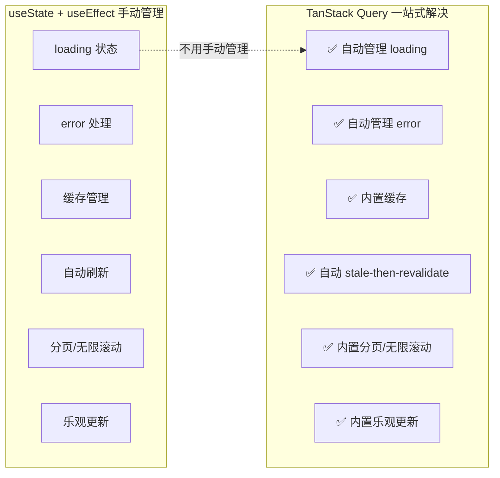

::: details TanStack Query 实战
```typescript
import { QueryClient, QueryClientProvider, useQuery, useMutation } from '@tanstack/react-query';

// 1. 创建 QueryClient
const queryClient = new QueryClient({
  defaultOptions: {
    queries: {
      staleTime: 5 * 60 * 1000,   // 5 分钟内不重新请求
      gcTime: 30 * 60 * 1000,     // 30 分钟后清除缓存
      retry: 2,                     // 失败重试 2 次
    },
  },
});

// 2. Provider 包裹
function App() {
  return (
    <QueryClientProvider client={queryClient}>
      <Routes />
    </QueryClientProvider>
  );
}

// 3. 查询数据 — useQuery
function UserList() {
  const { data, isLoading, error, refetch } = useQuery({
    queryKey: ['users', page],  // 缓存 key
    queryFn: () => api.getUsers(page), // 数据获取函数
  });
  
  if (isLoading) return <Skeleton />;
  if (error) return <Error message={error.message} onRetry={refetch} />;
  return <List data={data} />;
}

// 4. 修改数据 — useMutation
function CreateUser() {
  const queryClient = useQueryClient();
  
  const mutation = useMutation({
    mutationFn: api.createUser,
    onSuccess: () => {
      queryClient.invalidateQueries({ queryKey: ['users'] }); // 刷新列表
      toast.success('创建成功');
    },
    onError: (error) => {
      toast.error(error.message);
    },
  });
  
  return <button onClick={() => mutation.mutate(newUser)}>创建用户</button>;
}
```
:::

### TanStack Query 核心概念

| 概念 | 说明 | 类比 |
|------|------|------|
| `queryKey` | 缓存的唯一标识 | Map 的 key |
| `queryFn` | 数据获取函数 | API 请求 |
| `staleTime` | 数据多久算"过期" | 新鲜度时间 |
| `gcTime` | 缓存多久后被清除 | 垃圾回收时间 |
| `invalidateQueries` | 手动使缓存失效 | 刷新数据 |
| `useMutation` | 修改数据（POST/PUT/DELETE） | 写操作 |
| `useInfiniteQuery` | 无限滚动/分页 | 分页查询 |

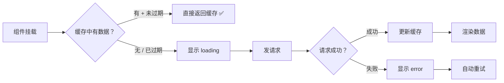

::: tip TanStack Query vs SWR
| 对比 | TanStack Query | SWR |
|------|---------------|-----|
| 出品 | Tanner Linsley（个人） | Vercel（公司） |
| 功能 | ✅ 更全面（无限查询、分页、乐观更新） | 更轻量、简单 |
| 缓存策略 | 可配置 staleTime + gcTime | 固定策略 |
| 学习成本 | 中 | 低 |
| 推荐 | ✅ 大型项目 | 小项目 |

**建议**：新项目直接用 **TanStack Query**，功能更全面，社区更活跃。
:::

## 🧪 测试

### 测试策略

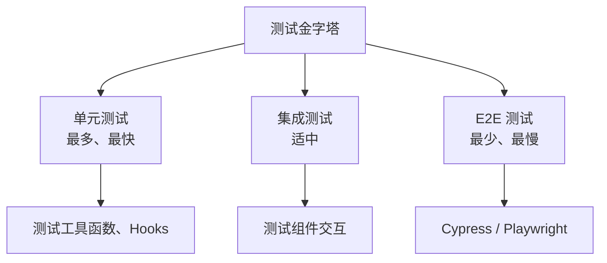

| 工具 | 用途 | 说明 |
|------|------|------|
| Vitest | 单元测试 | Vite 生态，速度快 |
| React Testing Library | 组件测试 | 测试用户行为，不测实现 |
| Playwright | E2E 测试 | 微软出品，跨浏览器 |
| MSW | API Mock | 拦截网络请求 |

::: details React Testing Library 核心理念
**测试用户行为，而不是实现细节**：

```typescript
import { render, screen, fireEvent, waitFor } from '@testing-library/react';
import UserList from './UserList';

// ✅ 测试用户能看到什么、做什么
test('用户列表渲染', async () => {
  render(<UserList />);
  
  // 等待数据加载
  await waitFor(() => {
    expect(screen.getByText('张三')).toBeInTheDocument();
  });
  
  // 测试交互
  fireEvent.click(screen.getByRole('button', { name: '删除' }));
  await waitFor(() => {
    expect(screen.queryByText('张三')).not.toBeInTheDocument();
  });
});

// ❌ 测试内部实现（脆弱！重构就挂）
expect(component.state('isOpen')).toBe(true);
expect(component.instance().handleClick).toHaveBeenCalled();
```

**常用查询方法**（按推荐顺序）：
1. `getByRole` — 按角色（button、heading、textbox）✅ 最推荐
2. `getByLabelText` — 按关联的 label
3. `getByPlaceholderText` — 按 placeholder
4. `getByText` — 按文本内容
5. `getByTestId` — 按 data-testid（最后手段）
:::

## 🎯 面试高频题

::: details 1. useEffect 和 useLayoutEffect 的区别？
| 特性 | useEffect | useLayoutEffect |
|------|-----------|----------------|
| 执行时机 | DOM 更新后异步执行（不阻塞绘制） | DOM 更新后同步执行（阻塞绘制） |
| 适用场景 | 数据请求、事件监听、日志 | 需要读取/修改 DOM 布局 |
| 性能 | 不阻塞 UI | 可能阻塞首次渲染 |

**规则**：90% 的情况用 `useEffect`。只有在需要**同步读取 DOM 布局信息并阻止闪烁**时才用 `useLayoutEffect`（如测量 DOM 尺寸后设置样式）。

::: details 2. React 18 有哪些新特性？
1. **自动批处理** — 所有状态更新自动合并，不再区分场景
2. **Transitions** — `startTransition` 标记低优先级更新
3. **useDeferredValue** — 延迟更新的值
4. **Suspense 改进** — 支持流式 SSR
5. **新 Hooks** — `useId`、`useTransition`、`useDeferredValue`、`useSyncExternalStore`
6. **React Server Components** — 服务端组件，减少客户端 JS
7. **Strict Mode 双重渲染** — 开发模式下每个组件渲染两次，帮助发现副作用问题

::: details 3. React 的调和（Reconciliation）过程？
1. **Render 阶段**（可中断）：
   - 触发状态更新 → 调度器安排工作
   - 遍历 Fiber 树，计算新旧 VNode 的 Diff
   - 标记需要更新的节点（Placement、Update、Deletion）
2. **Commit 阶段**（不可中断）：
   - 将标记的变更同步应用到真实 DOM
   - 执行 `useLayoutEffect`
   - 异步调度 `useEffect`

**关键点**：Render 阶段利用 Fiber 的可中断特性，将大任务拆分为小单元，配合时间切片在浏览器空闲时执行，不阻塞用户交互。

::: details 4. 高阶组件（HOC）是什么？
HOC 是一个**函数，接收组件作为参数，返回增强后的新组件**：

```typescript
// 基础 HOC — 注入 props
function withAuth(WrappedComponent) {
  return function AuthenticatedComponent(props) {
    const token = localStorage.getItem('token');
    if (!token) return <Navigate to="/login" />;
    return <WrappedComponent {...props} token={token} />;
  };
}

// 使用
const ProtectedPage = withAuth(Dashboard);
```

**HOC vs Hooks**：
- HOC 是 Class 组件时代的逻辑复用方案
- Hooks 是函数组件时代的替代方案，更灵活、无嵌套地狱
- 新项目直接用 Hooks，不需要 HOC

::: details 5. React 中如何处理跨域？
1. **开发环境** — Vite 的 `server.proxy` 配置
```typescript
// vite.config.ts
export default defineConfig({
  server: {
    proxy: {
      '/api': {
        target: 'http://localhost:8080',
        changeOrigin: true,
      },
    },
  },
});
```
2. **生产环境** — Nginx 反向代理
3. **CORS** — 后端配置 `Access-Control-Allow-Origin`

::: details 6. React 的 key 有什么用？为什么不能用 index？
key 是 React 用来**识别节点身份**的标识，用于 Diff 时判断节点是否可复用。

```typescript
// ❌ 用 index 作 key
// [A, B, C] → 在头部插入 D → [D, A, B, C]
// React 认为：key0 从 A→D（修改）、key1 从 B→A（修改）、key2 从 C→B（修改）
// 结果：3 次修改操作

// ✅ 用唯一 ID 作 key
// React 认为：D 是新增（创建），A/B/C 的 key 不变（复用）
// 结果：1 次创建操作
```

**index 作 key 的危害**：输入框内容错位、不必要的 DOM 操作、动画异常。

::: details 7. React 和 Vue 的核心区别？
| 对比 | React | Vue |
|------|-------|-----|
| 数据变化检测 | 不可变数据 + 引用比较 | Proxy 响应式拦截 |
| 模板 | JSX（JS 中写 HTML） | Template（HTML 中写指令） |
| 状态管理 | useState + 单向数据流 | ref/reactive + 双向绑定 |
| 更新粒度 | 组件级别（setState 整个组件 re-render） | 依赖追踪级别（只更新变化的 DOM） |
| 生态 | 大而全（Meta 维护） | 渐进式（尤雨溪维护） |
| 学习曲线 | 较陡（需要理解 Hooks 闭包） | 较平缓（Options API 入门容易） |

::: details 8. 什么是 React 的 Portals？
Portal 用于将子组件渲染到**父组件 DOM 层级之外的节点**，和 Vue 的 `<Teleport>` 一样：

```typescript
import { createPortal } from 'react-dom';

function Modal({ children }) {
  return createPortal(
    <div className="modal-overlay">{children}</div>,
    document.getElementById('modal-root')! // 渲染到 body 下的指定节点
  );
}
```

**使用场景**：模态框、全局通知、Tooltip（避免被父级 `overflow: hidden` 裁剪）。

::: details 9. React 18 的 useId 是做什么的？
`useId` 生成**服务端和客户端一致的唯一 ID**，用于表单 label 关联等场景：

```typescript
function FormField() {
  const id = useId(); // 生成如 ":r0:" 的稳定 ID
  return (
    <>
      <label htmlFor={id}>用户名</label>
      <input id={id} />
    </>
  );
}
```

**为什么不用 `Math.random()`？** SSR 时服务端和客户端的随机值不同，会导致 Hydration mismatch。`useId` 保证两端一致。

::: details 10. React 严格模式（StrictMode）的双重渲染？
React 18 开发模式下，StrictMode 会**故意渲染每个组件两次**，帮助发现副作用问题：

```typescript
// 如果你写了有副作用的代码（如直接修改 DOM），双重渲染会暴露问题
function UserList() {
  // ❌ 直接修改 DOM — 第二次渲染会创建两个 timer
  useEffect(() => {
    document.title = '用户列表';
    const timer = setInterval(() => {}, 1000);
    // 忘记清理了！第二个 timer 会泄漏
  }, []);
  
  // ✅ 清理副作用
  useEffect(() => {
    document.title = '用户列表';
    const timer = setInterval(() => {}, 1000);
    return () => clearInterval(timer); // 清理两次，最终只剩一个 ✅
  }, []);
}
```

**注意**：只在开发模式生效，生产构建不受影响。
:::
