# ⚛️ React 基础

> Learn once, write anywhere — 学一次 React，到处写应用

## 🧭 React 全景图

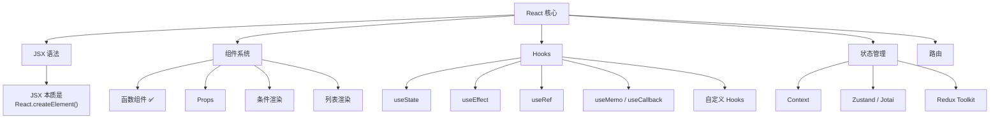

## ⚡ JSX 本质

JSX 看起来像 HTML，实际上是**语法糖**，编译后变成函数调用。

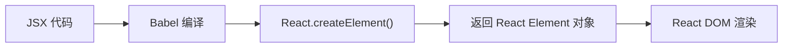

| JSX 写法 | 编译结果 |
|---------|---------|
| `<div className="app">Hello</div>` | `React.createElement('div', { className: 'app' }, 'Hello')` |
| `<User name="张三" />` | `React.createElement(User, { name: '张三' })` |
| `{isLoading && <Spinner />}` | `isLoading && React.createElement(Spinner)` |

### JSX 规则

| 规则 | 说明 |
|------|------|
| 必须有一个根元素 | 或用 `<></>` Fragment 包裹 |
| 使用 `className` | 不用 `class` |
| 使用 `htmlFor` | 不用 `for` |
| 样式用对象 | `style={{ color: 'red', fontSize: 16 }}` |
| 事件用驼峰 | `onClick`、`onChange`、`onKeyDown` |
| 花括号表达式 | `{expression}` 嵌入 JS 表达式 |

::: tip JSX 和 Vue 模板的区别
| 对比 | Vue Template | React JSX |
|------|-------------|-----------|
| 语法 | HTML 模板 + 指令（v-if/v-for） | JS 表达式 + HTML 混写 |
| 条件渲染 | `v-if` / `v-show` | `&&` / `? :` / 三元表达式 |
| 列表渲染 | `v-for` | `.map()` |
| 双向绑定 | `v-model` | `value` + `onChange` |
| 事件绑定 | `@click` | `onClick` |
| 样式绑定 | `:class` / `:style` | `className` / `style={{}}` |

```jsx
// React 条件渲染
{isLoading ? <Spinner /> : <Content />}

// React 列表渲染
{users.map(user => (
  <UserCard key={user.id} user={user} />
))}

// React 样式
<div className={`card ${isActive ? 'active' : ''}`}>
  <h2 style={{ color: theme === 'dark' ? '#fff' : '#333' }}>标题</h2>
</div>
```
:::

## 🪝 Hooks 详解

### 核心 Hooks

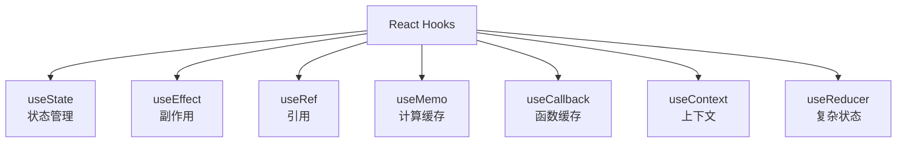

| Hook | 用途 | 类比 Vue |
|------|------|---------|
| `useState` | 声明状态 | `ref()` |
| `useEffect` | 副作用（请求、订阅、DOM） | `onMounted` + `watch` |
| `useRef` | 引用 DOM 或保存不触发渲染的值 | `ref()` + `shallowRef()` |
| `useMemo` | 缓存计算结果 | `computed()` |
| `useCallback` | 缓存函数引用 | 无直接对应 |
| `useContext` | 跨组件传递数据 | `provide/inject` |
| `useReducer` | 复杂状态管理 | Pinia（复杂场景） |

### useState 详解

```typescript
// 基本用法
const [count, setCount] = useState(0);

// 函数式更新 — 当新状态依赖旧状态时必须用函数式
setCount(prev => prev + 1); // ✅ 保证拿到最新值
// setCount(count + 1);     // ❌ 可能拿到旧值（批处理时）

// 惰性初始化 — 初始值需要复杂计算时
const [data, setData] = useState(() => expensiveComputation());

// 对象状态更新 — 必须创建新对象（不可变）
const [user, setUser] = useState({ name: '', age: 0 });
setUser(prev => ({ ...prev, name: '张三' })); // ✅ 展开再覆盖
```

::: warning useState 的坑
```typescript
// ❌ 直接修改对象 — 引用没变，不会触发重新渲染
const [user, setUser] = useState({ name: '张三' });
user.name = '李四'; // 直接修改
// 需要调用 setUser 才会触发更新

// ❌ 数组操作
const [list, setList] = useState([1, 2, 3]);
list.push(4);    // ❌ 直接修改
list.splice(0, 1); // ❌ 直接修改

// ✅ 正确的数组更新
setList(prev => [...prev, 4]);           // 新增
setList(prev => prev.filter(x => x !== 1)); // 删除
setList(prev => prev.map(x => x === 1 ? 10 : x)); // 修改
```
:::

### useEffect 完全指南

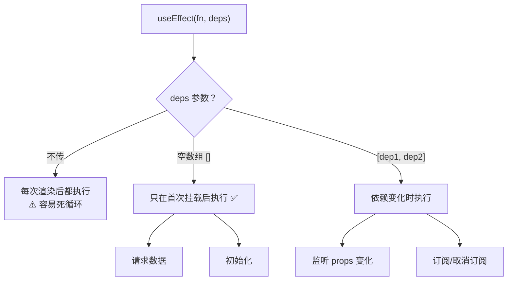

::: details useEffect 常见模式
```typescript
// 1. 组件挂载时请求（最常见的模式）
useEffect(() => {
  async function fetchData() {
    const res = await fetch('/api/users');
    setUsers(await res.json());
  }
  fetchData();
}, []); // 空依赖 = 只执行一次

// 2. 监听 props 变化
useEffect(() => {
  document.title = `当前页: ${page}`;
}, [page]);

// 3. 订阅 + 清理
useEffect(() => {
  const ws = new WebSocket('wss://...');
  ws.onmessage = (e) => setData(JSON.parse(e.data));
  
  return () => ws.close(); // ⚠️ 清理！组件卸载时关闭连接
}, []);

// 4. AbortController 取消请求
useEffect(() => {
  const controller = new AbortController();
  
  fetch('/api/data', { signal: controller.signal })
    .then(res => res.json())
    .then(setData)
    .catch(err => {
      if (err.name !== 'AbortError') setError(err);
    });
  
  return () => controller.abort(); // 组件卸载时取消请求
}, [page]);

// 5. 定时器清理
useEffect(() => {
  const timer = setInterval(() => setTick(t => t + 1), 1000);
  return () => clearInterval(timer);
}, []);
```
:::

::: danger useEffect 依赖数组规则
1. **不要对依赖撒谎** — 如果 useEffect 内用到了某个变量，就必须加入依赖数组
2. **ESLint 的 exhaustive-deps 规则** — 严格检查依赖数组完整性
3. **对象/数组作为依赖** — 每次渲染都是新引用，会导致无限循环，用 `useMemo` 包裹
4. **函数作为依赖** — 每次渲染都是新引用，用 `useCallback` 包裹
:::

### useRef

`useRef` 有两个主要用途：引用 DOM 元素、保存不触发渲染的值。

```typescript
// 1. 引用 DOM 元素
const inputRef = useRef<HTMLInputElement>(null);

function focusInput() {
  inputRef.current?.focus();
}

return <input ref={inputRef} />;

// 2. 保存跨渲染的值（不触发重新渲染）
const timerRef = useRef<number | null>(null);
const prevValueRef = useRef(value);

// 保存上一次的值
useEffect(() => {
  prevValueRef.current = value;
}, [value]);

// 3. 标记是否首次渲染
const isFirstRender = useRef(true);
useEffect(() => {
  if (isFirstRender.current) {
    isFirstRender.current = false;
    return; // 首次渲染跳过
  }
  // 后续渲染执行...
}, [value]);
```

### useMemo vs useCallback

| Hook | 缓存内容 | 使用场景 |
|------|---------|---------|
| `useMemo` | 计算结果（值） | 复杂计算、过滤大数据、作为其他 Hook 的依赖 |
| `useCallback` | 函数引用 | 传递给子组件的回调、作为 useEffect 的依赖 |

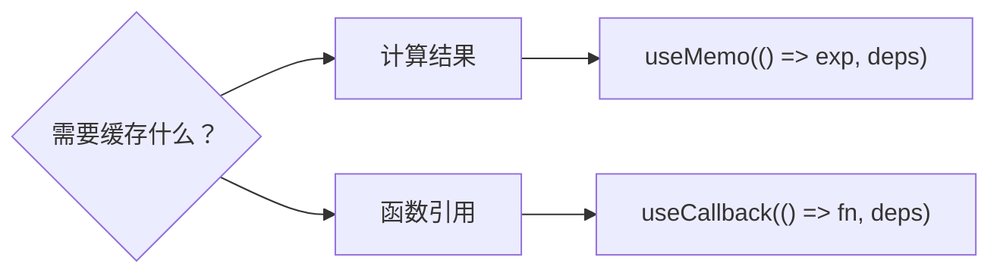

```typescript
// useMemo — 缓存计算结果
const sortedList = useMemo(() => {
  return list.sort((a, b) => a.name.localeCompare(b.name));
}, [list]); // 只有 list 变了才重新排序

// useCallback — 缓存函数引用
const handleClick = useCallback((id: number) => {
  setSelected(id);
}, []); // 空依赖 = 函数永远不变

// ✅ 两者配合使用
const items = useMemo(() => data.filter(d => d.active), [data]);
const handleSelect = useCallback((id: string) => {
  onSelect(id);
}, [onSelect]);
```

::: warning 不要过度使用 useMemo/useCallback
React 官方建议：**只在性能确实有问题时才用**。缓存本身也有开销（比较依赖数组），如果子组件没有用 `React.memo`，缓存回调没有意义。

**经验法则**：
- `useMemo`：计算开销大（排序、过滤大数据）→ 用
- `useCallback`：传递给 `React.memo` 包裹的子组件 → 用
- 其他场景 → 先不优化，有性能问题再考虑
:::

### useReducer — 复杂状态管理

当组件有多个相关联的状态、或者下一个状态依赖前一个状态时，用 `useReducer` 比 `useState` 更清晰。

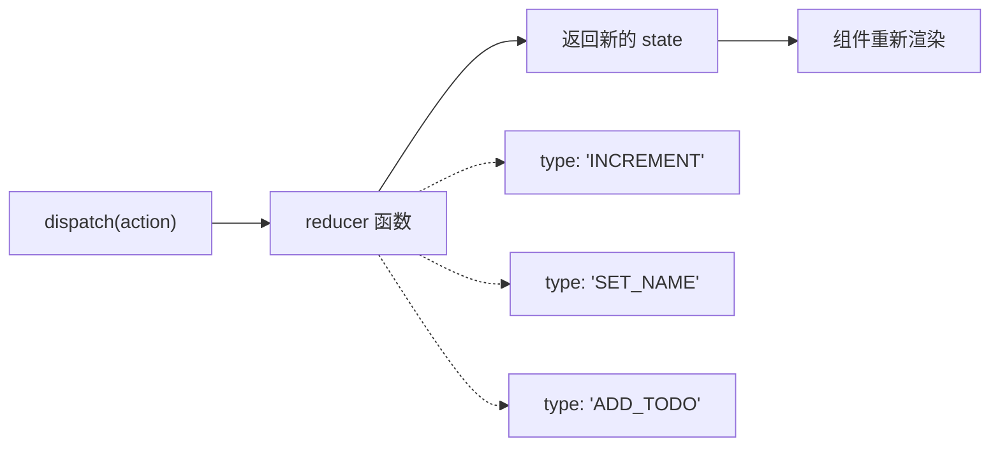

::: details useReducer 实战
```typescript
// 1. 定义 State 和 Action 类型
interface Todo {
  id: number;
  text: string;
  done: boolean;
}

type Action =
  | { type: 'ADD'; text: string }
  | { type: 'TOGGLE'; id: number }
  | { type: 'DELETE'; id: number }
  | { type: 'CLEAR_DONE' };

// 2. 定义 reducer（纯函数）
function todoReducer(state: Todo[], action: Action): Todo[] {
  switch (action.type) {
    case 'ADD':
      return [...state, { id: Date.now(), text: action.text, done: false }];
    case 'TOGGLE':
      return state.map(t => t.id === action.id ? { ...t, done: !t.done } : t);
    case 'DELETE':
      return state.filter(t => t.id !== action.id);
    case 'CLEAR_DONE':
      return state.filter(t => !t.done);
    default:
      return state;
  }
}

// 3. 使用
function TodoApp() {
  const [todos, dispatch] = useReducer(todoReducer, []);
  
  return (
    <div>
      <button onClick={() => dispatch({ type: 'ADD', text: '新任务' })}>添加</button>
      <button onClick={() => dispatch({ type: 'CLEAR_DONE' })}>清除已完成</button>
      {todos.map(todo => (
        <div key={todo.id} onClick={() => dispatch({ type: 'TOGGLE', id: todo.id })}>
          {todo.done ? '✅' : '⬜'} {todo.text}
        </div>
      ))}
    </div>
  );
}
```
:::

| 对比 | useState | useReducer |
|------|---------|-----------|
| 适用场景 | 简单独立的状态 | 多个相关联的状态 |
| 状态更新 | 直接调用 setter | 通过 dispatch action |
| 可读性 | 简单场景好 | 复杂逻辑好（集中管理） |
| 可测试性 | 一般 | ✅ reducer 是纯函数，容易单测 |
| 类比 Vue | `ref()` | Pinia store 的 action |

::: tip 什么时候用 useReducer？
- 状态有多个子值需要一起更新（如表单的多个字段）
- 下一个状态依赖前一个状态（如计数器、Todo 列表）
- 需要统一管理状态变更逻辑（便于测试和调试）
:::

## 🧩 组件设计

### 组件分类

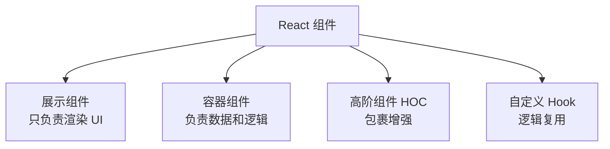

### 受控组件 vs 非受控组件

| 特性 | 受控组件 | 非受控组件 |
|------|---------|-----------|
| 数据源 | state | DOM / ref |
| 更新方式 | `onChange` + `setState` | `defaultValue` + `ref` |
| 适用场景 | 需要实时验证、格式化 | 简单表单、文件上传 |

```typescript
// 受控组件 — React 控制表单值
const [name, setName] = useState('');
<input value={name} onChange={e => setName(e.target.value)} />

// 非受控组件 — DOM 控制表单值
const inputRef = useRef(null);
<input defaultValue="初始值" ref={inputRef} />
// 获取值: inputRef.current.value
```

::: tip 对比 Vue
React 的**受控组件** ≈ Vue 的 `v-model`，都是通过状态驱动视图。但 React 需要手动写 `onChange`，Vue 的 `v-model` 是语法糖自动处理。
:::

### 复杂表单模式

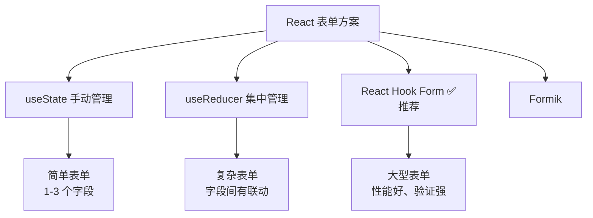

::: details React Hook Form 实战（推荐方案）
```typescript
import { useForm } from 'react-hook-form';
import { zodResolver } from '@hookform/resolvers/zod';
import { z } from 'zod';

// 1. 定义验证规则（Zod Schema）
const schema = z.object({
  username: z.string().min(2, '用户名至少2个字符'),
  email: z.string().email('邮箱格式不正确'),
  password: z.string().min(6, '密码至少6位'),
  confirmPassword: z.string(),
}).refine(data => data.password === data.confirmPassword, {
  message: '两次密码不一致',
  path: ['confirmPassword'],
});

type FormData = z.infer<typeof schema>;

// 2. 使用
function RegisterForm() {
  const { register, handleSubmit, formState: { errors }, reset } = useForm<FormData>({
    resolver: zodResolver(schema),
  });

  const onSubmit = async (data: FormData) => {
    await api.register(data);
    reset(); // 重置表单
  };

  return (
    <form onSubmit={handleSubmit(onSubmit)}>
      <input {...register('username')} />
      {errors.username && <span className="error">{errors.username.message}</span>}
      
      <input {...register('email')} type="email" />
      {errors.email && <span className="error">{errors.email.message}</span>}
      
      <input {...register('password')} type="password" />
      {errors.password && <span className="error">{errors.password.message}</span>}
      
      <input {...register('confirmPassword')} type="password" />
      {errors.confirmPassword && <span className="error">{errors.confirmPassword.message}</span>}
      
      <button type="submit">注册</button>
    </form>
  );
}
```

**为什么推荐 React Hook Form？**
- 非受控组件 — 不为每个字段创建 state，性能好
- 内置验证 — 支持 Zod/Yup/Joi
- 减少 re-render — 输入时不触发重渲染
:::

### 错误边界（Error Boundary）

```typescript
// React 的错误边界只能用 Class 组件实现！
class ErrorBoundary extends React.Component<
  { children: React.ReactNode, fallback: React.ReactNode },
  { hasError: boolean }
> {
  state = { hasError: false };
  
  static getDerivedStateFromError() {
    return { hasError: true };
  }
  
  componentDidCatch(error: Error, info: ErrorInfo) {
    // 上报错误
    errorReporter.capture(error, info);
  }
  
  render() {
    return this.state.hasError ? this.props.fallback : this.props.children;
  }
}

// 使用
<ErrorBoundary fallback={<div>出错了，请刷新页面</div>}>
  <MyComponent />
</ErrorBoundary>
```

::: warning 错误边界的限制
1. **只能捕获子组件的错误**，不能捕获自身、事件处理函数、异步代码中的错误
2. **只能用 Class 组件**，函数组件没有 `componentDidCatch`
3. React 18+ 没有计划为函数组件添加错误边界 API

**替代方案**：可以用 `react-error-boundary` 库，提供了 Hook 版本的错误边界。
:::

## 📦 Context API

### React 组件通信全览

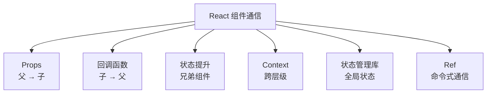

| 方式 | 方向 | 适用场景 | Vue 对应 |
|------|------|---------|---------|
| Props | 父 → 子 | 最基本的方式 | `props` |
| 回调函数 | 子 → 父 | 子组件通知父组件 | `emit` |
| 状态提升 | 兄弟 ← 父 | 兄弟组件共享状态 | `provide/inject` |
| Context | 跨层级 | 主题、用户信息等 | `provide/inject` |
| Redux/Zustand | 全局 | 复杂应用状态管理 | Pinia |
| useRef + forwardRef | 父 → 子（命令式） | 调用子组件方法 | `ref` + `defineExpose` |
| 自定义事件 | 任意 | 兄弟/跨组件通信 | mitt（事件总线） |

::: details useRef + forwardRef 命令式通信
```typescript
// 子组件 — 暴露方法给父组件
const ChildInput = forwardRef<HTMLInputElement, ChildInputProps>((props, ref) => {
  const inputRef = useRef<HTMLInputElement>(null);
  
  // 暴露内部方法
  useImperativeHandle(ref, () => ({
    focus: () => inputRef.current?.focus(),
    clear: () => { if (inputRef.current) inputRef.current.value = ''; },
    getValue: () => inputRef.current?.value ?? '',
  }));
  
  return <input ref={inputRef} />;
});

// 父组件
const childRef = useRef<{ focus: () => void; clear: () => void; getValue: () => string }>(null);

function handleClear() {
  childRef.current?.clear(); // 命令式调用子组件方法
}
```
:::

Context 用于**跨层级传递数据**，避免 props 逐层传递（prop drilling）：

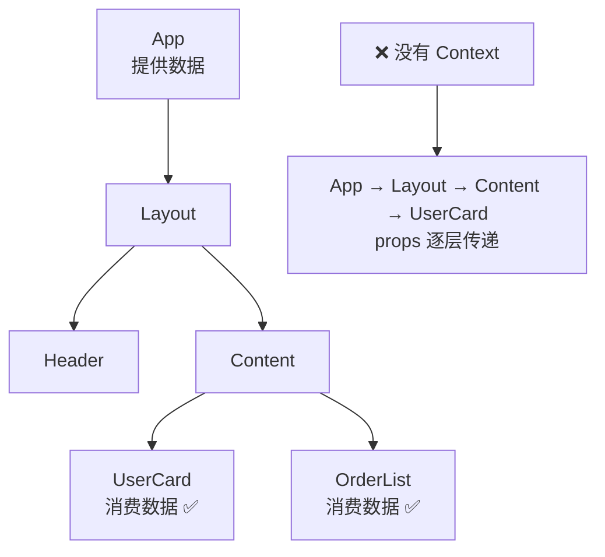

::: details Context 实战
```typescript
// 1. 创建 Context
const ThemeContext = createContext<'light' | 'dark'>('light');

// 2. 提供数据 — Provider
function App() {
  const [theme, setTheme] = useState<'light' | 'dark'>('light');
  
  return (
    <ThemeContext.Provider value={theme}>
      <Layout />
      <button onClick={() => setTheme(t => t === 'light' ? 'dark' : 'light')}>
        切换主题
      </button>
    </ThemeContext.Provider>
  );
}

// 3. 消费数据 — useContext
function UserCard() {
  const theme = useContext(ThemeContext);
  return <div className={theme}>内容</div>;
}

// 4. 自定义 Hook 封装（推荐）
function useTheme() {
  const context = useContext(ThemeContext);
  if (!context) throw new Error('useTheme must be used within ThemeProvider');
  return context;
}
```

**Context 的坑**：Context 值变化会导致所有消费组件重新渲染，即使子组件没用到变化的部分。解决方案：
1. **拆分 Context** — 将频繁变化的值和不常变化的值放在不同 Context
2. **配合 React.memo** — 子组件 memo 化减少不必要渲染
3. **用 Zustand 等状态管理库** — 替代 Context 处理复杂状态
:::

## 🪝 自定义 Hooks

自定义 Hooks 是 React 逻辑复用的核心机制：

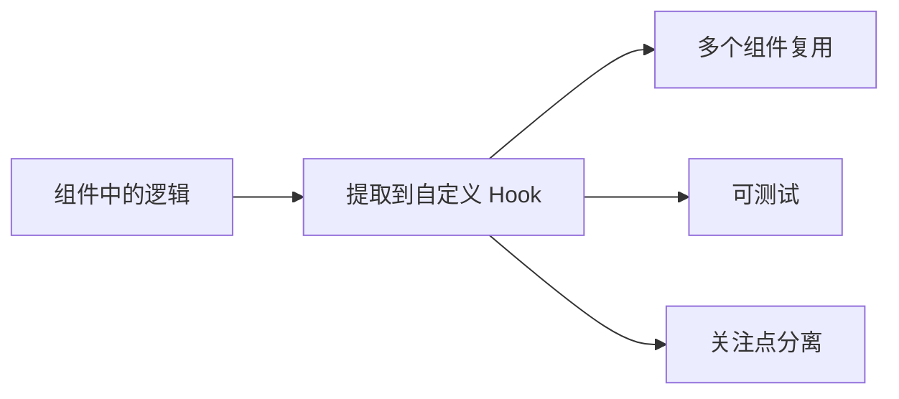

::: details 常用自定义 Hook 模式
```typescript
// useLocalStorage — 持久化状态
function useLocalStorage<T>(key: string, initialValue: T) {
  const [value, setValue] = useState<T>(() => {
    const stored = localStorage.getItem(key);
    return stored ? JSON.parse(stored) : initialValue;
  });
  
  useEffect(() => {
    localStorage.setItem(key, JSON.stringify(value));
  }, [key, value]);
  
  return [value, setValue] as const;
}

// 使用
const [theme, setTheme] = useLocalStorage('theme', 'light');

// useFetch — 数据请求
function useFetch<T>(url: string) {
  const [data, setData] = useState<T | null>(null);
  const [loading, setLoading] = useState(true);
  const [error, setError] = useState<Error | null>(null);
  
  useEffect(() => {
    const controller = new AbortController();
    setLoading(true);
    
    fetch(url, { signal: controller.signal })
      .then(res => res.json())
      .then(setData)
      .catch(err => { if (err.name !== 'AbortError') setError(err); })
      .finally(() => setLoading(false));
    
    return () => controller.abort();
  }, [url]);
  
  return { data, loading, error };
}

// 使用
const { data: users, loading, error } = useFetch<User[]>('/api/users');

// useToggle — 布尔值切换
function useToggle(initial = false) {
  const [value, setValue] = useState(initial);
  const toggle = useCallback(() => setValue(v => !v), []);
  return [value, toggle] as const;
}
```
:::

## 🛣️ React Router

### 路由配置

```typescript
import { BrowserRouter, Routes, Route, Link, Navigate, useParams, useNavigate } from 'react-router-dom';

function App() {
  return (
    <BrowserRouter>
      <Routes>
        <Route path="/" element={<Layout />}>
          <Route index element={<Home />} />
          <Route path="users" element={<Users />} />
          <Route path="users/:id" element={<UserDetail />} />
          <Route path="*" element={<NotFound />} />
        </Route>
      </Routes>
    </BrowserRouter>
  );
}

// 嵌套路由 — Layout 中放置 <Outlet />
function Layout() {
  return (
    <div>
      <nav><Link to="/">首页</Link> | <Link to="/users">用户</Link></nav>
      <Outlet /> {/* 子路由渲染位置 */}
    </div>
  );
}

// 路由参数
function UserDetail() {
  const { id } = useParams(); // 获取路由参数
  const navigate = useNavigate();
  
  return (
    <div>
      <h2>用户 {id}</h2>
      <button onClick={() => navigate(-1)}>返回</button>
    </div>
  );
}
```

### 路由守卫

```typescript
// React 没有全局路由守卫，用组件包裹实现
function RequireAuth({ children }: { children: React.ReactNode }) {
  const token = localStorage.getItem('token');
  if (!token) return <Navigate to="/login" replace />;
  return <>{children}</>;
}

// 使用
<Route path="/dashboard" element={
  <RequireAuth><Dashboard /></RequireAuth>
} />
```

| 功能 | Vue Router | React Router |
|------|-----------|-------------|
| 声明式路由 | `<router-view>` | `<Routes>` + `<Route>` |
| 导航 | `<router-link>` | `<Link>` |
| 编程式导航 | `router.push()` | `useNavigate()` |
| 路由参数 | `useRoute().params` | `useParams()` |
| 嵌套路由 | children 配置 | 嵌套 `<Route>` + `<Outlet>` |
| 路由守卫 | `beforeEach` | 组件包裹 + `useEffect` |

## 🎯 面试高频题

::: details 1. Virtual DOM 是什么？有什么优缺点？
**Virtual DOM** 是真实 DOM 的 JS 对象表示。数据变化时，先在 Virtual DOM 上计算差异（Diff），然后批量更新真实 DOM。

优点：减少直接操作 DOM、跨平台（React Native、SSR）、框架自动优化更新
缺点：内存占用（维护虚拟 DOM 树）、简单更新可能比直接操作 DOM 更慢

::: details 2. React 的 Diff 算法是怎样的？
React 使用**同层比较 + Key** 策略：
1. 只比较同一层级的节点（不跨层）
2. 不同类型的节点直接替换（不比较子节点）
3. 通过 `key` 标识节点，实现列表高效更新
4. Key 必须稳定唯一，**不要用 index**

::: details 3. setState 是同步还是异步？
- **React 18+**：**全部自动批处理**，无论在什么场景下 setState 都是异步批处理的。多次 setState 会合并为一次渲染。
- `flushSync` 可以强制同步渲染：`flushSync(() => { setA(1); setB(2); })` 会渲染两次。

::: details 4. useEffect 和 useLayoutEffect 的区别？
| 对比 | useEffect | useLayoutEffect |
|------|-----------|----------------|
| 执行时机 | 浏览器绘制**之后** | 浏览器绘制**之前** |
| 阻塞绘制 | ❌ 不阻塞 | ✅ 阻塞（DOM 更新后同步执行） |
| 适用场景 | 数据请求、事件监听 | DOM 测量、阻止闪烁 |

```typescript
// 场景：根据内容高度调整滚动位置
useLayoutEffect(() => {
  const height = ref.current?.scrollHeight;
  window.scrollTo(0, height); // 在绘制前调整，用户看不到跳动
});
```
:::

::: details 5. 为什么不能在循环/条件中使用 Hooks？
React 通过**调用顺序**来匹配每个 Hook 和对应的 state。如果在条件/循环中使用，调用顺序可能变化，导致 Hook 匹配错误。

```typescript
// ❌ 错误
if (condition) {
  const [a, setA] = useState(0); // 有时调用，有时不调用
}

// ✅ 正确 — 始终调用
const [a, setA] = useState(0);
const showA = condition;
```

**React 内部用链表存储 Hooks**：第一次渲染时 `useState` 在链表位置 0，第二次渲染必须也在位置 0，否则状态就乱了。
:::

::: details 6. React.memo 是什么？什么时候用？
`React.memo` 是高阶组件，对 props 进行浅比较，如果 props 没变就跳过重新渲染。

```typescript
const ExpensiveList = React.memo(function List({ items }: { items: Item[] }) {
  return items.map(item => <Card key={item.id} item={item} />);
});
```

**适用场景**：渲染开销大的子组件、相同 props 频繁传入的场景
**不适用场景**：大多数组件（浅比较有开销）、props 经常变化的组件
:::

::: details 7. React 中如何做性能优化？
1. **React.memo** — 子组件 props 不变时跳过渲染
2. **useMemo / useCallback** — 缓存计算结果和函数引用
3. **代码分割** — `React.lazy()` + `Suspense` 按需加载
4. **列表虚拟化** — 大列表用 `react-window` 或 `react-virtualized`
5. **避免不必要的 state** — 能推导的值用 `useMemo`，不存 state
6. **状态下放** — 把 state 放到最需要它的组件，避免大范围 re-render
:::

::: details 8. React 的事件机制和原生事件有什么区别？
| 对比 | React 合成事件 | 原生事件 |
|------|-------------|---------|
| 绑定方式 | JSX 中 `onClick` | `addEventListener` |
| 事件委托 | ✅ 根节点统一委托 | 每个元素单独绑定 |
| 跨浏览器 | 自动兼容 | 需要手动处理 |
| 阻止冒泡 | `e.stopPropagation()` | 同左（但不互通） |

React 17+ 事件委托到**容器节点**（`#root`），不再委托到 document。
:::
