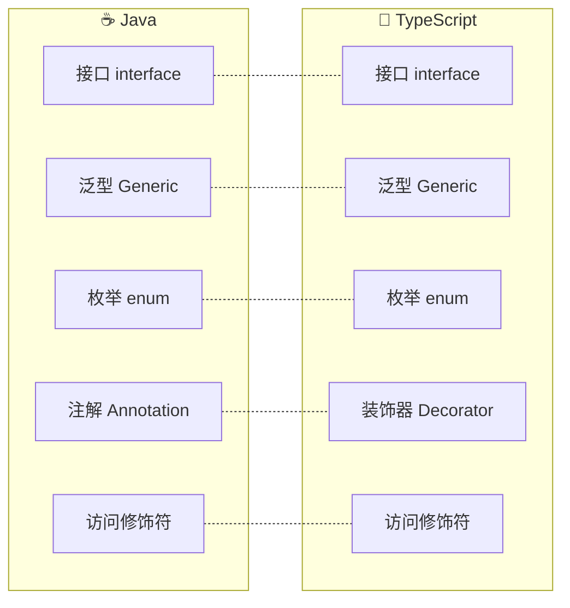
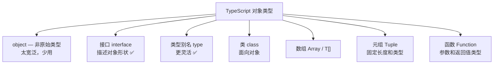
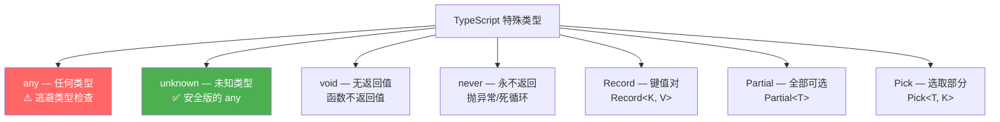
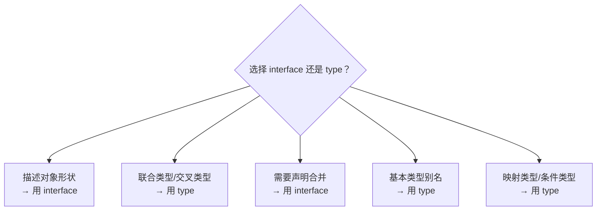
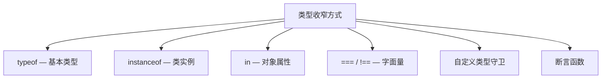
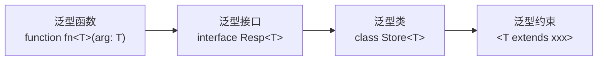
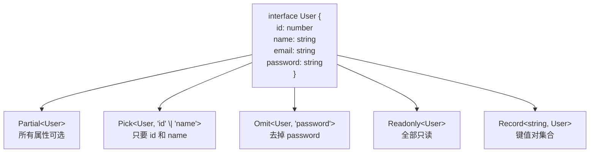

# 📘 TypeScript

> TypeScript = JavaScript + 类型系统。类型不是束缚，而是你的安全保障

作为 Java 开发者，学 TS 会非常亲切——很多概念直接对标 Java！

## 🆚 TS vs Java 类型对比



| 概念 | Java | TypeScript | 区别 |
|------|------|-----------|------|
| 基本类型 | `int`, `double`, `boolean` | `number`, `string`, `boolean` | TS 的 `number` 统一了 int/float/double |
| 数组 | `int[]`, `List<T>` | `number[]`, `Array<T>` | 相似 |
| 接口 | `interface` | `interface` | TS 接口可以描述对象形状，更像结构化类型 |
| 泛型 | `<T>` | `<T>` | 语法几乎一样 |
| 枚举 | `enum` | `enum` | TS 枚举有数字枚举、字符串枚举、const enum |
| 装饰器 | `@Annotation` | `@Decorator` | 语法相似，TS 装饰器更灵活 |
| 访问修饰符 | `public/private/protected` | `public/private/protected` | TS 默认 public，Java 默认 package-private |

## 📐 基础类型

### 原始类型

| 类型 | 说明 | 示例 |
|------|------|------|
| `number` | 所有数字（整数 + 浮点数） | `42`, `3.14`, `0xff` |
| `string` | 字符串 | `'hello'`, `` `template` `` |
| `boolean` | 布尔值 | `true`, `false` |
| `null` / `undefined` | 空值 | `null`, `undefined` |
| `symbol` | 唯一值 | `Symbol('id')` |
| `bigint` | 大整数 | `9007199254740991n` |

### 对象类型



### 数组与元组

```typescript
// 数组 — 所有元素类型相同
const numbers: number[] = [1, 2, 3];
const list: Array<number> = [1, 2, 3]; // 泛型写法

// 元组 — 固定长度、每个位置类型可不同
const pair: [string, number] = ['age', 25];
const rgb: [number, number, number] = [255, 128, 0];

// 可选元组元素
const row: [string, number, boolean?] = ['张三', 25]; // 第三项可选

// 标签元组（更好的可读性）
const user: [name: string, age: number, active: boolean] = ['张三', 25, true];
```

### 函数类型

```typescript
// 函数声明
function add(a: number, b: number): number {
  return a + b;
}

// 箭头函数
const multiply = (a: number, b: number): number => a * b;

// 函数类型别名
type Callback = (data: string) => void;

// 可选参数（必须在最后）
function greet(name: string, greeting?: string): string {
  return `${greeting || 'Hello'}, ${name}`;
}

// 默认参数
function createUser(name: string, role: string = 'user') {
  return { name, role };
}

// 函数重载（类似 Java 方法重载）
function parseInput(input: string): number;
function parseInput(input: number): string;
function parseInput(input: string | number): string | number {
  if (typeof input === 'string') return parseInt(input, 10);
  return input.toString();
}
```

### 特殊类型



::: danger 避免使用 any
`any` 会完全关闭类型检查，等于白写 TS。如果确实不知道类型，用 `unknown` 代替——它要求你先做类型检查才能使用。

```typescript
let a: any = 'hello';
let b: unknown = 'hello';

let s1: string = a;  // ✅ any 可以赋给任何类型（危险！）
let s2: string = b;  // ❌ unknown 不能直接赋值

// unknown 必须先进行类型收窄
if (typeof b === 'string') {
  let s3: string = b;  // ✅ 类型收窄后可以赋值
}
```
:::

## 🏗️ 接口与类型别名

### interface vs type

| 特性 | `interface` | `type` |
|------|------------|--------|
| 对象形状 | ✅ | ✅ |
| 继承/扩展 | `extends` | `&` 交叉 |
| 声明合并 | ✅ 自动合并 | ❌ |
| 联合类型 | ❌ | ✅ |
| 基本类型别名 | ❌ | ✅ |
| 元组 | ❌ | ✅ |
| 映射类型 | ❌ | ✅ |



::: tip 实际开发规范
- **定义对象结构** → 优先用 `interface`（可扩展性好）
- **定义联合类型、工具类型** → 用 `type`
- **定义函数签名** → 两者都可以
- **不确定时** → 用 `interface`，后续可以改成 `type`
:::

### 接口继承

```typescript
// 单继承
interface Animal {
  name: string;
  age: number;
}

interface Dog extends Animal {
  breed: string;
  bark(): void;
}

// 多继承（接口可以继承多个）
interface Serializable {
  toJSON(): string;
}

interface Loggable {
  log(): void;
}

class User implements Serializable, Loggable {
  toJSON() { return '{"name": "张三"}'; }
  log() { console.log('logging...'); }
}
```

## 🔍 类型收窄（Type Narrowing）

类型收窄是 TS 最重要的能力之一，通过条件判断让 TS 推断出更具体的类型：



::: details 类型收窄实战
```typescript
// typeof
function double(value: string | number) {
  if (typeof value === 'string') {
    return value.repeat(2); // ✅ 这里 value 是 string
  }
  return value * 2; // ✅ 这里 value 是 number
}

// instanceof
function getDate(value: Date | string): Date {
  if (value instanceof Date) {
    return value; // ✅ 这里 value 是 Date
  }
  return new Date(value); // ✅ 这里 value 是 string
}

// in 操作符 — 区分对象类型
interface Admin { role: 'admin'; permissions: string[]; }
interface User { role: 'user'; email: string; }

function handleAccount(account: Admin | User) {
  if ('permissions' in account) {
    console.log(account.permissions); // ✅ Admin
  } else {
    console.log(account.email); // ✅ User
  }
}

// 自定义类型守卫
function isString(value: unknown): value is string {
  return typeof value === 'string';
}

// 断言函数 — 类似 Java 的 assert
function assertDefined<T>(value: T): asserts value is NonNullable<T> {
  if (value == null) throw new Error('Value is not defined');
}

const user = users.find(u => u.id === 1);
assertDefined(user);
user.name; // ✅ TS 知道 user 不是 undefined
```
:::

## 🧩 泛型

泛型让代码更灵活、更复用，和 Java 泛型概念完全一致！

### 泛型基础



::: details 泛型实战示例
```typescript
// 泛型函数
function firstElement<T>(arr: T[]): T | undefined {
  return arr[0];
}
firstElement([1, 2, 3]);        // number
firstElement(['a', 'b']);       // string

// 泛型接口 — API 响应（非常常用！）
interface ApiResponse<T> {
  code: number;
  message: string;
  data: T;
}

type User = { id: number; name: string };
type PageData<T> = { list: T[]; total: number };

// 使用
const res: ApiResponse<PageData<User>> = await fetchUserList();
res.data.list[0].name; // ✅ 完整类型推导

// 泛型约束
interface HasId { id: number; }
function findById<T extends HasId>(items: T[], id: number): T | undefined {
  return items.find(item => item.id === id);
}

// 多个泛型参数
function map<T, U>(arr: T[], fn: (item: T) => U): U[] {
  return arr.map(fn);
}
map([1, 2, 3], n => n.toString()); // string[]
```
:::

### 常用泛型工具类型

TypeScript 内置了很多实用的工具类型，减少重复代码。

| 工具类型 | 作用 | 示例 |
|---------|------|------|
| `Partial<T>` | 所有属性变可选 | `{ id?: number, name?: string }` |
| `Required<T>` | 所有属性变必选 | 和 Partial 相反 |
| `Readonly<T>` | 所有属性变只读 | 不可修改 |
| `Pick<T, K>` | 选取部分属性 | `Pick<User, 'id' \| 'name'>` |
| `Omit<T, K>` | 排除部分属性 | `Omit<User, 'password'>` |
| `Record<K, V>` | 构造键值对类型 | `Record<string, number>` |
| `Exclude<T, U>` | 排除联合类型中的某些 | `Exclude<'a'\|'b'\|'c', 'a'>` → `'b'\|'c'` |
| `Extract<T, U>` | 提取联合类型中的交集 | `Extract<'a'\|'b', 'a'\|'c'>` → `'a'` |
| `ReturnType<T>` | 获取函数返回值类型 | `ReturnType<typeof fn>` |
| `Parameters<T>` | 获取函数参数类型 | `Parameters<typeof fn>` |
| `NonNullable<T>` | 排除 null 和 undefined | `NonNullable<string \| null>` → `string` |



::: tip 实际开发中最常用的
```typescript
// 1. API 创建时只传部分字段
function createUser(data: Partial<User>): Promise<User> { /* ... */ }

// 2. 列表接口返回时去掉敏感字段
type UserVO = Omit<User, 'password' | 'createdAt'>;

// 3. 更新时只传要改的字段
function updateUser(id: number, data: Partial<Omit<User, 'id'>>): Promise<void> { /* ... */ }

// 4. Props 类型 — 所有属性可选（适合组件默认值）
type ButtonProps = Partial<{
  type: 'primary' | 'danger' | 'default';
  size: 'small' | 'medium' | 'large';
  disabled: boolean;
  loading: boolean;
}>;
```
:::

## 🔧 条件类型与映射类型

### 条件类型

条件类型类似三元表达式，但操作的是类型：`T extends U ? X : Y`

```typescript
// 基本条件类型
type IsString<T> = T extends string ? true : false;
type A = IsString<'hello'>;  // true
type B = IsString<42>;       // false

// infer 关键字 — 在条件类型中推断类型
// 提取函数返回值类型
type ReturnType<T> = T extends (...args: any[]) => infer R ? R : never;

// 提取 Promise 内部类型
type UnwrapPromise<T> = T extends Promise<infer U> ? U : T;
type Result = UnwrapPromise<Promise<string>>; // string

// 提取数组元素类型
type ElementType<T> = T extends (infer E)[] ? E : never;
type Item = ElementType<string[]>; // string
```

### 映射类型

映射类型可以基于已有类型创建新类型，遍历其键：

```typescript
// 将所有属性变为只读
type Readonly<T> = {
  readonly [K in keyof T]: T[K];
};

// 将所有属性变为可选
type Partial<T> = {
  [K in keyof T]?: T[K];
};

// 自定义映射类型 — 将所有属性变为 getter
type Getter<T> = {
  readonly [K in keyof T as `get${Capitalize<string & K>}`]: () => T[K];
};

interface User { name: string; age: number; }
type UserGetter = Getter<User>;
// { readonly getName: () => string; readonly getAge: () => number }

// 移除某些键（as 重映射）
type RemoveMethods<T> = {
  [K in keyof T as T[K] extends Function ? never : K]: T[K];
};
```

### 模板字面量类型

```typescript
// 字符串模式匹配
type EventName = 'click' | 'focus' | 'blur';
type HandlerName = `on${Capitalize<EventName>}`;
// 'onClick' | 'onFocus' | 'onBlur'

// 字符串工具类型
type TrimLeft<S extends string> = S extends ` ${infer T}` ? TrimLeft<T> : S;

// CSS 属性类型
type CSSDirection = 'top' | 'right' | 'bottom' | 'left';
type CSSProperty = `margin-${CSSDirection}` | `padding-${CSSDirection}`;
// 'margin-top' | 'margin-right' | ... | 'padding-left'
```

## 🛡️ 类型声明文件（.d.ts）

当使用没有类型定义的第三方 JS 库时，需要声明文件：

```typescript
// types/global.d.ts — 声明全局变量
declare const API_BASE_URL: string;
declare function formatDate(date: Date): string;

// 声明第三方模块
declare module 'lodash' {
  export function cloneDeep<T>(value: T): T;
  export function debounce(fn: Function, wait?: number): Function;
}

// 声明文件扩展（模块增强）
declare module 'vue-router' {
  interface RouteMeta {
    requiresAuth?: boolean;
    title?: string;
  }
}
```

::: tip @types 生态
大多数流行库都有社区维护的类型定义：`@types/lodash`、`@types/node`、`@types/express` 等。

安装方式：`npm install -D @types/lodash`

如果库自带类型（如 Vue 3、React 18），则不需要额外安装 `@types`。
:::

## ⚙️ tsconfig.json 关键配置

```json
{
  "compilerOptions": {
    "target": "ES2020",           // 编译目标
    "module": "ESNext",           // 模块系统
    "moduleResolution": "bundler", // 模块解析策略
    "strict": true,               // 开启所有严格检查 ✅
    "noImplicitAny": true,        // 禁止隐式 any
    "strictNullChecks": true,     // 严格空值检查
    "noUnusedLocals": true,       // 未使用变量报错
    "paths": {                    // 路径别名
      "@/*": ["./src/*"]
    },
    "baseUrl": ".",               // 路径别名基准
    "jsx": "preserve",            // JSX 处理
    "esModuleInterop": true       // 允许 import CommonJS 模块
  },
  "include": ["src"],
  "exclude": ["node_modules", "dist"]
}
```

| 配置项 | 推荐值 | 说明 |
|--------|--------|------|
| `strict` | `true` | **必须开启！** 包含所有严格检查 |
| `strictNullChecks` | `true` | null/undefined 不能赋给其他类型 |
| `noImplicitAny` | `true` | 禁止隐式 any |
| `moduleResolution` | `bundler` | Vite/webpack 项目推荐 |

## 🎯 面试高频题

::: details 1. TypeScript 的 type 和 interface 有什么区别？
核心区别：
1. `interface` 支持**声明合并**（同名自动合并），`type` 不支持
2. `type` 支持**联合类型、交叉类型、元组、映射类型**，`interface` 不支持
3. `interface` 用 `extends` 继承，`type` 用 `&` 交叉
4. **选择原则**：对象结构用 `interface`，联合/映射/条件类型用 `type`

::: details 2. unknown 和 any 有什么区别？
- `any`：**跳过所有类型检查**，可以赋值给任何类型，非常不安全
- `unknown`：**类型安全的 any**，使用前必须进行类型检查（`typeof`、`instanceof`、类型守卫）

```typescript
let a: any = 'hello';
let b: unknown = 'hello';

let s1: string = a;  // ✅ any 可以赋给任何类型
let s2: string = b;  // ❌ unknown 不能直接赋值

if (typeof b === 'string') {
  let s3: string = b;  // ✅ 类型收窄后可以赋值
}
```
:::

::: details 3. 什么是类型守卫？
类型守卫是**在运行时检查类型**，同时帮助 TS 在编译时收窄类型的方式：

1. `typeof` — 检查基本类型
2. `instanceof` — 检查类实例
3. `in` — 检查对象属性
4. 自定义守卫 — `value is Type` 语法
5. 断言函数 — `asserts value is Type`

::: details 4. enum 有什么坑？
```typescript
// 数字枚举 — 会生成反向映射代码，增加包体积
enum Direction {
  Up = 0,
  Down,    // 自动 1
  Left,    // 自动 2
  Right,   // 自动 3
}

// 编译结果（反向映射）：
// { 0: "Up", 1: "Down", Up: 0, Down: 1, ... }

// ✅ 推荐：const enum 或 联合类型
const enum Direction {
  Up = 'UP',
  Down = 'DOWN',
}
// const enum 编译时内联，不生成额外代码

// 或者直接用联合类型（最轻量）
type Direction = 'UP' | 'DOWN' | 'LEFT' | 'RIGHT';
```
:::
