# 🚀 Vue 3 进阶

> 从"会用 Vue"到"精通 Vue"，中间隔着一个响应式原理的距离

## 📖 响应式原理深入

### Proxy 是怎么工作的？

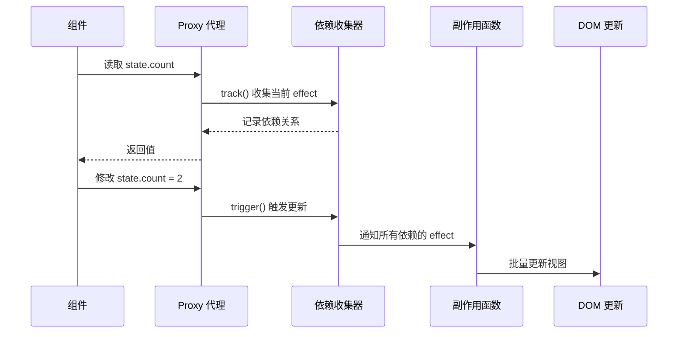

### 依赖收集与触发

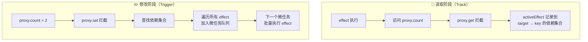

### reactive vs ref 的内部实现

```typescript
// reactive 简化实现 — 用 Proxy 代理整个对象
function reactive(target) {
  return new Proxy(target, {
    get(target, key, receiver) {
      track(target, key); // 收集依赖
      return Reflect.get(target, key, receiver);
    },
    set(target, key, value, receiver) {
      const oldValue = target[key];
      Reflect.set(target, key, value, receiver);
      trigger(target, key, value, oldValue); // 触发更新
      return true;
    },
  });
}

// ref 简化实现 — 用 getter/setter 拦截 .value
function ref(value) {
  const r = {
    _isRef: true,
    get value() { track(r, 'value'); return value; },
    set value(newVal) { trigger(r, 'value', newVal); value = newVal; },
  };
  return r;
}
```

::: details 为什么 Proxy 比 defineProperty 好？
```typescript
// Vue 2：Object.defineProperty — 需要递归遍历所有属性
function observe(obj) {
  Object.keys(obj).forEach(key => {
    let value = obj[key];
    Object.defineProperty(obj, key, {
      get() { /* 收集依赖 */ return value; },
      set(newVal) { /* 触发更新 */ value = newVal; },
    });
    if (typeof value === 'object') observe(value); // 递归！性能差
  });
}

// Vue 3：Proxy — 惰性代理
const proxy = new Proxy(target, {
  get(target, key, receiver) { /* 收集依赖 */ return Reflect.get(target, key); },
  set(target, key, value, receiver) { /* 触发更新 */ return Reflect.set(target, key, value); },
});
// 只有访问到的属性才会被代理，不需要初始化时递归遍历
```
:::

## ⚡ 编译时优化

Vue 3 不仅运行时更快，编译器也做了大量优化：

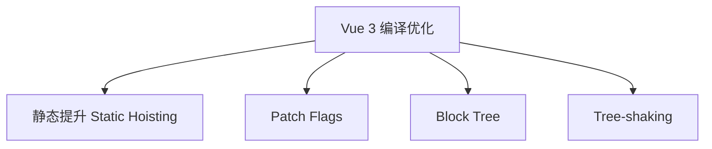

### 静态提升

编译器会将**不会变化的静态节点**提取到渲染函数外部，避免每次渲染都重新创建：

```javascript
// Vue 2 — 每次渲染都创建静态 VNode
render() {
  return h('div', null, [
    h('h1', null, '静态标题'),  // 每次都创建！
    h('p', null, this.message), // 动态内容
  ]);
}

// Vue 3 — 静态节点提升到外部
const _hoisted_1 = h('h1', null, '静态标题'); // 只创建一次

function render() {
  return h('div', null, [
    _hoisted_1,                   // 直接复用 ✅
    h('p', null, _ctx.message),   // 动态内容
  ]);
}
```

### Patch Flags

Vue 3 为动态节点打上**补丁标记**，Diff 时只比较标记了变化的内容：

| Patch Flag | 含义 | 只需要检查 |
|-----------|------|-----------|
| `TEXT` | 动态文本 | 文本内容 |
| `CLASS` | 动态 class | class 属性 |
| `STYLE` | 动态 style | style 属性 |
| `PROPS` | 动态 props | 指定的 props |
| `FULL_PROPS` | 动态 key 的 props | 所有 props |

```javascript
// 编译结果 — 带有 Patch Flag
_h('div', _ctx.show ? _hoisted_1 : _hoisted_2, _ctx.message, 1 /* TEXT */);
// 1 是 Patch Flag，表示只有 TEXT 需要检查
// 如果 class 变了 → 不需要重新比较文本
```

### Block Tree

Vue 3 将模板的**根节点**作为 Block，Block 收集所有动态子节点的引用。更新时只需遍历 Block 内的动态节点，跳过静态子树：

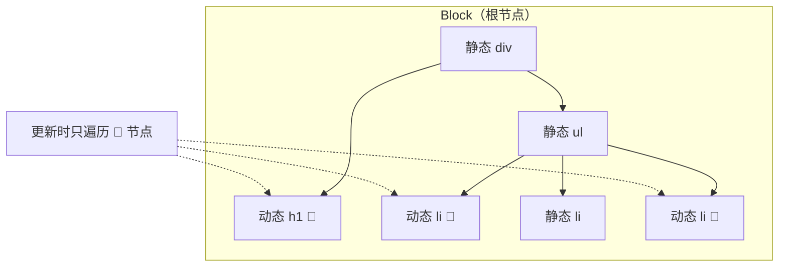

## 🔄 虚拟 DOM 与 Diff 算法

### 虚拟 DOM 是什么？

虚拟 DOM 是真实 DOM 的 JavaScript 对象表示，通过对比新旧 VNode 的差异，最小化真实 DOM 操作：

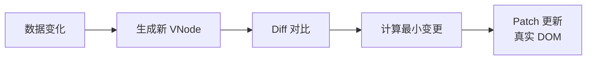

### Vue 3 Diff 算法

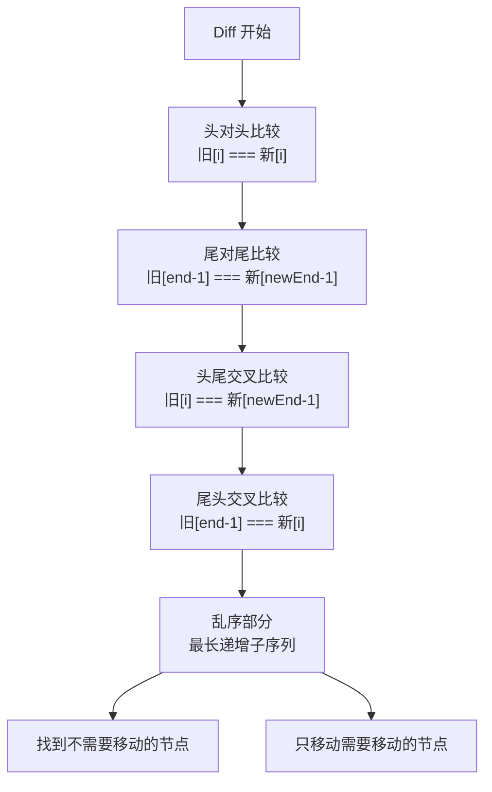

| 对比 | Vue 2 Diff | Vue 3 Diff |
|------|-----------|-----------|
| 算法 | 双端 Diff | 最长递增子序列 + 双端 Diff |
| 复杂度 | O(n) | O(n)（但常数更小） |
| 静态节点 | 需要对比 | 跳过（Patch Flag） |
| 列表更新 | 逐个对比 | 最长递增子序列优化 |

::: details 最长递增子序列优化
当列表中间部分节点乱序时，Vue 3 找到**最长递增子序列**（LIS），这些节点不需要移动，只需要移动非 LIS 节点。

例如旧序列 `[A, B, C, D, E]`，新序列 `[A, C, B, D, E]`：
- LIS 是 `[A, B, D, E]`（不需要移动）
- 只需要移动 `C` 到 `B` 前面

这比 Vue 2 逐个对比移动的效率高很多，尤其在长列表中优势明显。
:::

## 🔄 KeepAlive 原理

`<KeepAlive>` 是 Vue 3 内置组件，用于**缓存组件实例**，避免重复创建和销毁。常用于标签页、列表详情切换等场景。

### 工作原理

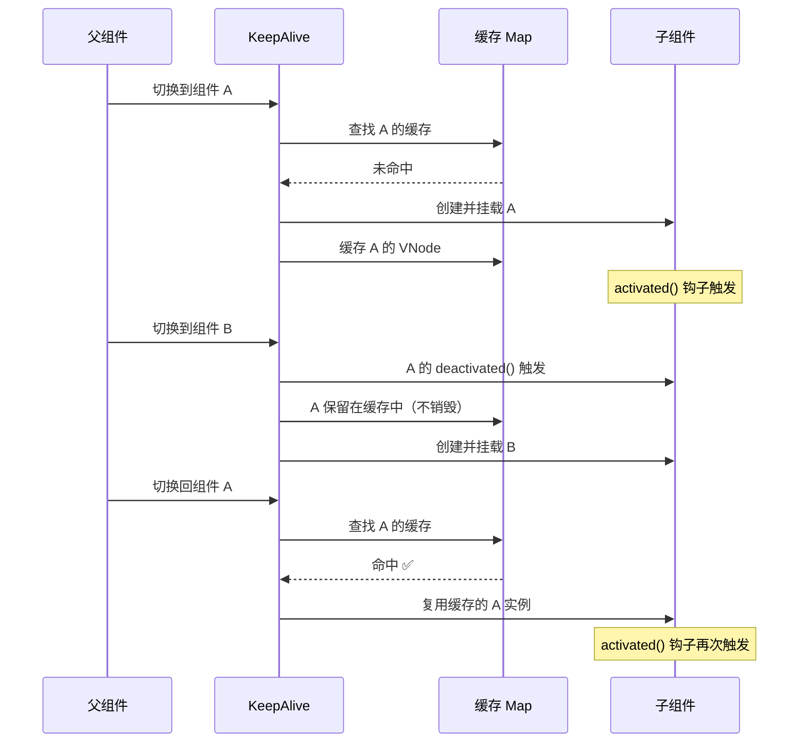

### LRU 缓存淘汰策略

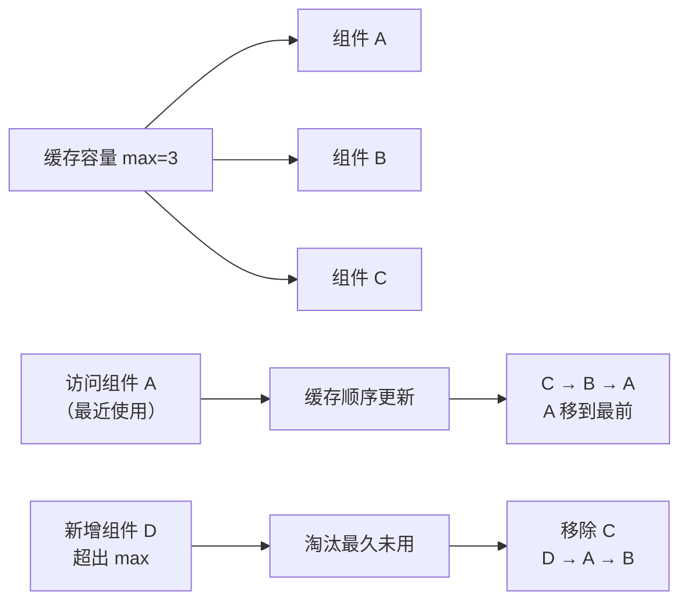

### 生命周期变化

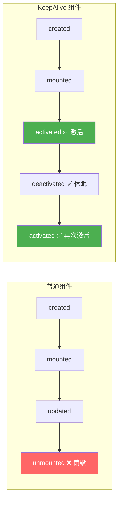

| 场景 | 触发钩子 | 说明 |
|------|---------|------|
| 首次渲染 | `created` → `mounted` → `activated` | 正常创建流程 |
| 被切走 | `deactivated` | 不触发 `unmounted`，实例保留 |
| 被切回 | `activated` | 不触发 `mounted`，直接复用 |
| 被淘汰（超出 max） | `deactivated` → `unmounted` | LRU 淘汰时才销毁 |

::: tip KeepAlive 实战技巧
```vue
<template>
  <!-- include：只缓存指定组件（按 name 匹配） -->
  <!-- exclude：排除指定组件 -->
  <!-- max：最大缓存数量（LRU 淘汰） -->
  <KeepAlive :include="['UserList', 'UserDetail']" :max="5">
    <component :is="currentTab" />
  </KeepAlive>
</template>

<script setup lang="ts">
// ⚠️ KeepAlive 匹配的是组件的 name 选项
// Vue 3 的 <script setup> 默认没有 name，需要 defineOptions
import { defineOptions } from 'vue';
defineOptions({ name: 'UserList' }); // KeepAlive include/exclude 依赖这个
</script>
```

**最佳实践：**
1. 始终设置 `max`，防止内存泄漏
2. 使用 `include`/`exclude` 精确控制缓存范围
3. 在 `activated` 中刷新数据（从缓存恢复时数据可能过时）
4. 在 `deactivated` 中清理定时器等副作用
:::

## 🏪 Pinia 状态管理

Pinia 是 Vue 3 的官方状态管理库，替代 Vuex，被称为"下一代 Vuex"。它更轻量、更符合 Composition API 风格、原生支持 TypeScript。

### 为什么用 Pinia？

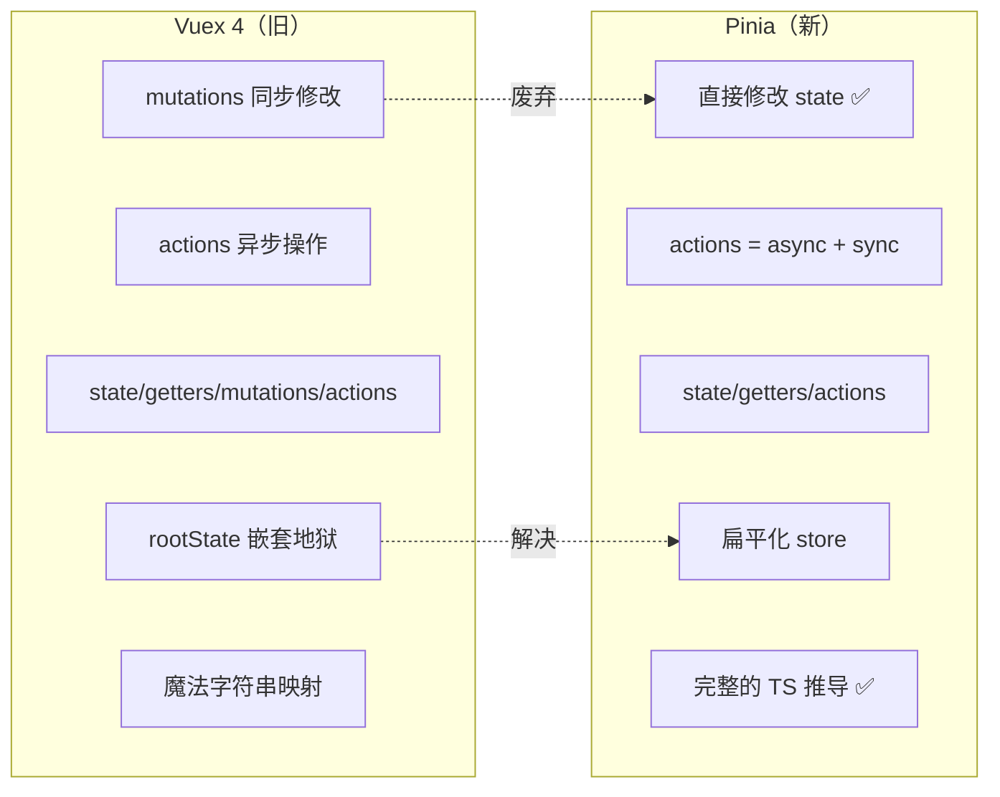

| 对比维度 | Vuex 4 | Pinia |
|---------|--------|-------|
| 修改状态 | 必须通过 `commit('mutation')` | 直接 `state.xxx = value` ✅ |
| 异步操作 | `dispatch('action')` → `commit('mutation')` | 直接在 `action` 里改 state |
| TypeScript | 类型推导差，需要泛型 | 完整的 TS 推导 ✅ |
| 代码量 | 多（state + getters + mutations + actions） | 少（state + getters + actions） |
| 模块化 | `modules` 嵌套 | 每个 store 独立文件，天然扁平 |
| DevTools | 支持 | 支持 |
| 体积 | ~23KB | ~1KB 🚀 |

### Pinia 三种写法

::: details 1. Setup Store（推荐，最灵活）
```typescript
// stores/user.ts
import { defineStore } from 'pinia';
import { ref, computed } from 'vue';
import { fetchUserInfo, login as loginApi } from '@/api/user';

export const useUserStore = defineStore('user', () => {
  // State
  const token = ref(localStorage.getItem('token') || '');
  const userInfo = ref<UserInfo | null>(null);
  
  // Getters（就是 computed）
  const isLoggedIn = computed(() => !!token.value);
  const username = computed(() => userInfo.value?.name ?? '游客');
  
  // Actions（就是普通函数，同步异步都行）
  async function login(username: string, password: string) {
    const res = await loginApi({ username, password });
    token.value = res.token;
    localStorage.setItem('token', res.token);
  }
  
  async function getUserInfo() {
    if (!token.value) return;
    userInfo.value = await fetchUserInfo();
  }
  
  function logout() {
    token.value = '';
    userInfo.value = null;
    localStorage.removeItem('token');
  }
  
  return { token, userInfo, isLoggedIn, username, login, getUserInfo, logout };
});
```
:::

::: details 2. Options Store（类似 Vuex 风格）
```typescript
// stores/cart.ts
export const useCartStore = defineStore('cart', {
  state: () => ({
    items: [] as CartItem[],
    checkoutStatus: null as string | null,
  }),
  getters: {
    totalPrice: (state) => state.items.reduce((sum, item) => sum + item.price * item.quantity, 0),
    itemCount: (state) => state.items.reduce((sum, item) => sum + item.quantity, 0),
    // 使用 this 访问其他 getter
    freeShipping: (state) => {
      // ⚠️ 不能用 this，要用箭头函数参数
      return state.items.reduce((sum, item) => sum + item.price * item.quantity, 0) >= 99;
    },
  },
  actions: {
    addItem(product: Product) {
      const existing = this.items.find(item => item.id === product.id);
      if (existing) {
        existing.quantity++;
      } else {
        this.items.push({ ...product, quantity: 1 });
      }
    },
    async checkout() {
      this.checkoutStatus = 'loading';
      try {
        await api.checkout(this.items);
        this.checkoutStatus = 'success';
        this.items = [];
      } catch (error) {
        this.checkoutStatus = 'fail';
      }
    },
  },
});
```
:::

### Pinia 数据持久化

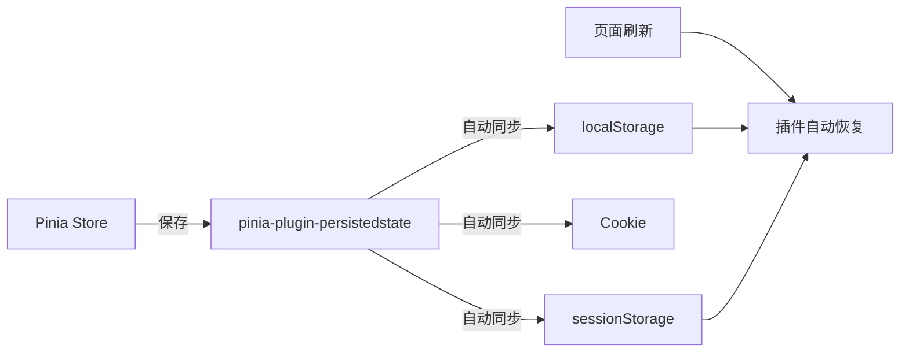

::: tip 持久化配置
```typescript
// main.ts
import { createPinia } from 'pinia';
import piniaPluginPersistedstate from 'pinia-plugin-persistedstate';

const pinia = createPinia();
pinia.use(piniaPluginPersistedstate);
app.use(pinia);

// 在 store 中启用（Options Store）
export const useUserStore = defineStore('user', {
  state: () => ({ token: '', userInfo: null }),
  persist: {
    key: 'user-store',          // 存储的 key
    storage: localStorage,       // 存储位置
    pick: ['token', 'userInfo'], // 只持久化指定字段
  },
});

// Setup Store 写法
export const useUserStore = defineStore('user', () => {
  const token = ref('');
  const userInfo = ref(null);
  return { token, userInfo };
}, {
  persist: {
    key: 'user-store',
    pick: ['token', 'userInfo'],
  },
});
```
:::

### Store 之间的互相调用

::: warning 跨 Store 调用注意事项
```typescript
// ✅ 在 action 中调用其他 store
const useCartStore = defineStore('cart', () => {
  const items = ref<CartItem[]>([]);
  
  function checkout() {
    const userStore = useUserStore(); // 在函数内部调用 ✅
    if (!userStore.isLoggedIn) {
      throw new Error('请先登录');
    }
    // ... 结算逻辑
  }
  
  return { items, checkout };
});

// ❌ 不要在 setup 顶层调用其他 store（可能循环依赖）
const userStore = useUserStore(); // ⚠️ 有循环依赖风险
```
:::

## ⚡ 性能优化

### 优化策略全景

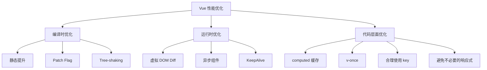

### 关键优化手段

| 优化手段 | 原理 | 效果 | 适用场景 |
|---------|------|------|---------|
| `v-once` | 只渲染一次 | 静态内容不再更新 | 不变化的标题、Logo |
| `shallowRef` / `shallowReactive` | 只追踪第一层 | 大对象性能提升 | 大型配置数据、表单数据 |
| `computed` | 基于依赖缓存 | 避免重复计算 | 派生数据 |
| `defineAsyncComponent` | 按需加载 | 减小首屏体积 | 大组件、弹窗组件 |
| `KeepAlive` | 缓存组件实例 | 避免重复创建/销毁 | 标签页、列表详情切换 |
| `v-memo` | 记住子树 | 条件不变跳过更新 | 长列表、复杂子树 |

::: details 异步组件与代码分割
```typescript
import { defineAsyncComponent } from 'vue';

// 基本用法 — 路由级别代码分割
const routes = [
  {
    path: '/dashboard',
    component: () => import('@/views/Dashboard.vue'),
  },
];

// 组件级别异步加载
const HeavyComponent = defineAsyncComponent(() => import('./HeavyComponent.vue'));

// 带加载状态和超时
const AsyncComp = defineAsyncComponent({
  loader: () => import('./Heavy.vue'),
  loadingComponent: LoadingSpinner,  // 加载中显示
  errorComponent: ErrorDisplay,      // 加载失败显示
  delay: 200,                        // 延迟显示 loading（避免闪烁）
  timeout: 3000,                     // 超时时间
});
```
:::

::: details v-memo 指令
```html
<!-- 只有 id 变化时才重新渲染该列表项 -->
<div v-for="item in list" :key="item.id" v-memo="[item.id, item.selected]">
  <span>{{ item.name }}</span>
  <span>{{ item.desc }}</span>
  <!-- 即使 item.name 变了，只要 id 和 selected 没变，就不重新渲染 -->
</div>
```

**注意**：`v-memo` 是高级优化，只在性能确实有问题时才用。滥用可能导致更新丢失。
:::

### 虚拟滚动

对于大列表（1000+ 项），即使只更新一小部分，Diff 的开销仍然很大：

```typescript
// 使用 vue-virtual-scroller
import { RecycleScroller } from 'vue-virtual-scroller';
import 'vue-virtual-scroller/dist/vue-virtual-scroller.css';
```

```html
<RecycleScroller
  class="scroller"
  :items="list"
  :item-size="50"
  key-field="id"
  v-slot="{ item }"
>
  <div class="item">{{ item.name }}</div>
</RecycleScroller>
```

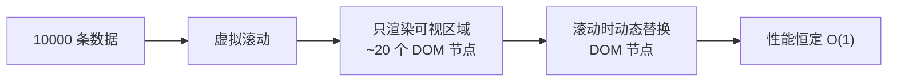

## 🌀 Teleport 与 Suspense

### Teleport — 传送到任意 DOM 节点

Teleport 解决了一个痛点：**组件逻辑属于当前组件，但 DOM 需要渲染到其他位置**。最典型的场景就是模态框。

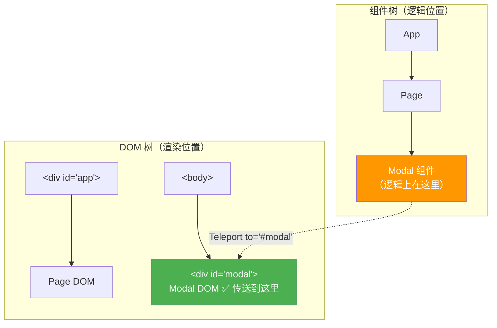

::: details Teleport 实战：全屏模态框
```vue
<!-- Modal.vue -->
<template>
  <!-- Teleport 将内容传送到 body 下的 #modal-container -->
  <Teleport to="#modal-container">
    <div v-if="visible" class="modal-overlay" @click.self="$emit('close')">
      <div class="modal-content">
        <h2>{{ title }}</h2>
        <slot /> <!-- 插槽内容正常工作 -->
        <button @click="$emit('close')">关闭</button>
      </div>
    </div>
  </Teleport>
</template>

<script setup lang="ts">
defineProps<{
  visible: boolean;
  title: string;
}>();

defineEmits<{
  close: [];
}>();
</script>
```

```html
<!-- index.html -->
<div id="app"></div>
<div id="modal-container"></div> <!-- Teleport 目标 -->
```

**为什么需要 Teleport？**
- 模态框在组件树深处，但 z-index 可能被父级 `overflow: hidden` 裁剪
- 传送到 body 层级，避免 CSS 层叠上下文冲突
- 父组件的 `transform`、`filter` 会创建新的层叠上下文，导致 `position: fixed` 失效
:::

### Suspense — 异步组件加载状态

Suspense 用于处理**异步依赖**（异步组件、带 `async setup()` 的组件），在等待期间展示 fallback 内容。

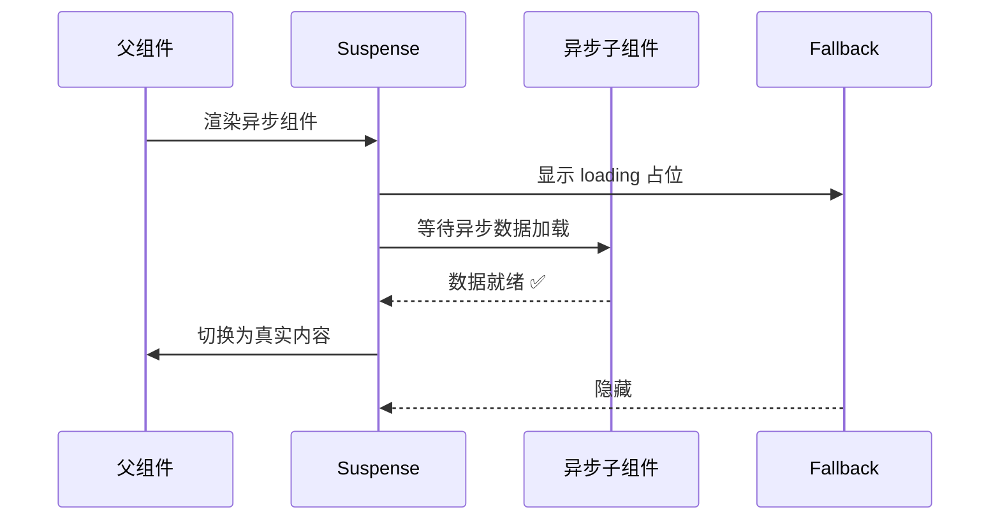

::: details Suspense 使用示例
```vue
<template>
  <Suspense>
    <!-- 默认插槽：异步组件 -->
    <template #default>
      <UserProfile />  <!-- 这个组件的 setup() 是 async 的 -->
    </template>
    
    <!-- fallback 插槽：加载中 -->
    <template #fallback>
      <div class="skeleton">
        <div class="skeleton-avatar"></div>
        <div class="skeleton-text"></div>
        <div class="skeleton-text short"></div>
      </div>
    </template>
  </Suspense>
</template>

<!-- UserProfile.vue — 异步组件 -->
<script setup lang="ts">
// ✅ 顶层 await！Suspense 会等待这个 Promise resolve
const user = await fetchUser(props.id);
const posts = await fetchPosts(props.id);
</script>
```

**Suspense 的注意事项：**
- `async setup()` 组件必须配合 `<Suspense>` 使用，否则会报警告
- `<Suspense>` 只处理直接子组件的异步依赖，不处理孙组件
- 多个异步子组件，等**全部** resolve 后才显示内容
:::

## 🧩 组件设计模式

### Props 设计原则

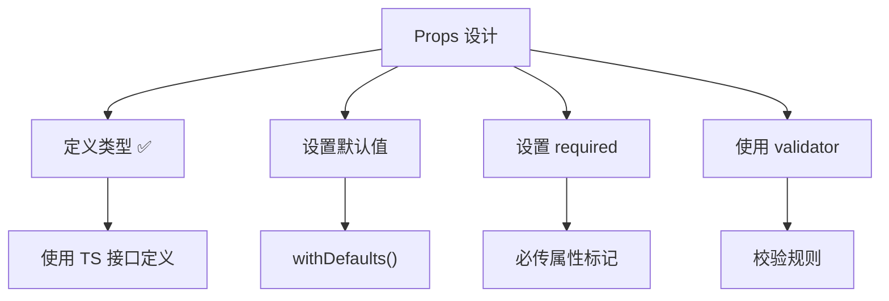

::: details Props 高级用法
```typescript
// 1. 基本定义 + 默认值
interface ButtonProps {
  type?: 'primary' | 'success' | 'danger';
  size?: 'small' | 'medium' | 'large';
  loading?: boolean;
  disabled?: boolean;
}

const props = withDefaults(defineProps<ButtonProps>(), {
  type: 'primary',
  size: 'medium',
  loading: false,
  disabled: false,
});

// 2. 运行时校验（TypeScript 类型在运行时不生效，需要 validator）
const props = defineProps({
  percentage: {
    type: Number,
    validator: (v: number) => v >= 0 && v <= 100, // 百分比必须在 0-100
  },
});

// 3. 响应式 Props（解构会丢失响应性！）
// ❌ 错误：解构后不再响应式
const { type, size } = props;

// ✅ 正确：用 toRefs 或 computed
const typeRef = toRef(props, 'type');
// 或在模板中直接用 props.type

// 4. Props 变更监听
watch(() => props.percentage, (newVal) => {
  console.log('percentage 变了', newVal);
});
```
:::

### 高级组件设计模式

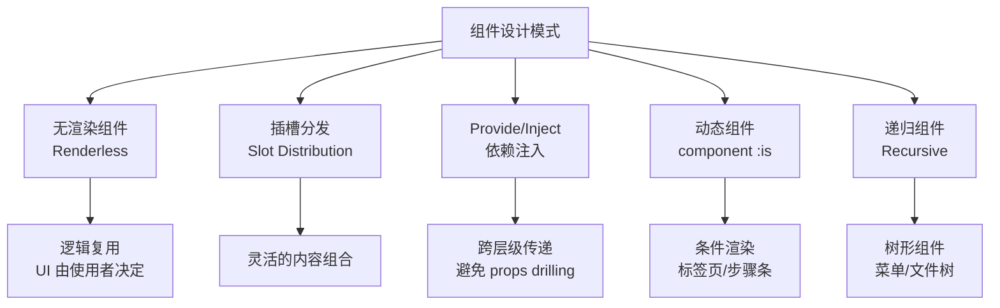

::: details 1. 无渲染组件（Renderless Component）
只提供逻辑，不提供 UI，通过插槽让使用者控制渲染。
```vue
<!-- RenderlessList.vue — 提供虚拟滚动逻辑 -->
<script setup lang="ts" generic="T">
const props = defineProps<{
  items: T[];
  itemHeight: number;
  containerHeight: number;
}>();

const scrollTop = ref(0);
const visibleCount = computed(() => Math.ceil(props.containerHeight / props.itemHeight) + 2);
const startIndex = computed(() => Math.floor(scrollTop.value / props.itemHeight));
const visibleItems = computed(() => 
  props.items.slice(startIndex.value, startIndex.value + visibleCount.value)
);

function onScroll(e: Event) {
  scrollTop.value = (e.target as HTMLElement).scrollTop;
}
</script>

<template>
  <!-- 通过作用域插槽暴露数据，UI 由使用者定义 -->
  <div class="scroll-container" :style="{ height: containerHeight + 'px' }" @scroll="onScroll">
    <div :style="{ height: items.length * itemHeight + 'px' }">
      <div :style="{ transform: `translateY(${startIndex * itemHeight}px)` }">
        <slot v-for="item in visibleItems" :key="item.id" :item="item" :index="startIndex + visibleItems.indexOf(item)" />
      </div>
    </div>
  </div>
</template>
```
:::

::: details 2. Provide/Inject 依赖注入
解决跨多层组件传递 Props 的问题（Props Drilling）。
```typescript
// 父组件：提供数据
// themes.ts
import { inject, provide, type InjectionKey } from 'vue';

// 用 Symbol 作 key，保证类型安全
export const ThemeKey: InjectionKey<Ref<string>> = Symbol('theme');

// 父组件
const theme = ref('dark');
provide(ThemeKey, theme);

// 任意深度的子组件
const theme = inject(ThemeKey); // 自动推导为 Ref<string>
```

**对比 Props Drilling：**
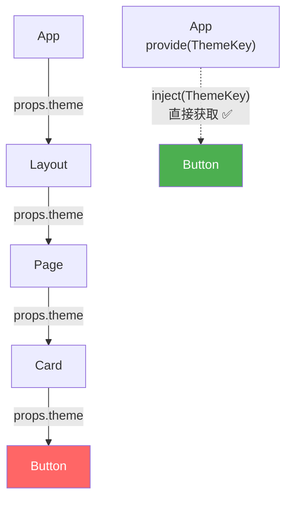

::: warning Provide/Inject 注意事项
1. **响应性** — provide 的是 `ref`，inject 后也是响应式的；provide 的是普通值，inject 后不是响应式的
2. **默认值** — `inject(key, defaultValue)` 可以设置默认值，推荐用工厂函数：`inject(key, () => 'default')`
3. **调试困难** — 数据来源不直观，建议配合 TypeScript 的 `InjectionKey` 增强可追溯性
:::
:::

::: details 3. 递归组件 — 树形结构
```vue
<!-- TreeNode.vue -->
<script setup lang="ts">
interface TreeNode {
  id: number;
  label: string;
  children?: TreeNode[];
}

defineProps<{ node: TreeNode; level?: number }>();
const emit = defineEmits<{ select: [node: TreeNode] }>();
</script>

<template>
  <div :style="{ paddingLeft: (level || 0) * 20 + 'px' }">
    <span @click="emit('select', node)">
      {{ node.children?.length ? '📁' : '📄' }} {{ node.label }}
    </span>
    <!-- 递归调用自身 -->
    <TreeNode
      v-for="child in node.children"
      :key="child.id"
      :node="child"
      :level="(level || 0) + 1"
      @select="emit('select', $event)"
    />
  </div>
</template>
```
:::

### Composables — 逻辑复用

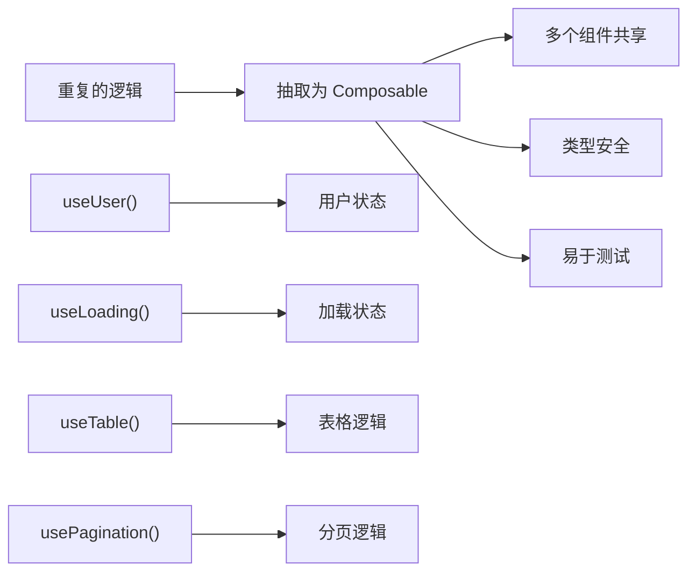

::: details 常用 Composable 模式
```typescript
// composables/useLoading.ts — 通用的加载状态管理
export function useLoading(initial = false) {
  const loading = ref(initial);
  const error = ref<Error | null>(null);
  
  async function withLoading<T>(fn: () => Promise<T>): Promise<T> {
    loading.value = true;
    error.value = null;
    try {
      return await fn();
    } catch (e) {
      error.value = e as Error;
      throw e;
    } finally {
      loading.value = false;
    }
  }
  
  return { loading, error, withLoading };
}

// composables/useTable.ts — 表格通用逻辑
export function useTable<T>(fetchFn: (params: any) => Promise<{ list: T[]; total: number }>) {
  const data = ref<T[]>([]) as Ref<T[]>;
  const total = ref(0);
  const page = ref(1);
  const pageSize = ref(10);
  const { loading, withLoading } = useLoading();
  
  async function loadData() {
    const res = await withLoading(() => fetchFn({ page: page.value, pageSize: pageSize.value }));
    data.value = res.list;
    total.value = res.total;
  }
  
  function handlePageChange(newPage: number) {
    page.value = newPage;
    loadData();
  }
  
  onMounted(loadData);
  
  return { data, total, page, pageSize, loading, loadData, handlePageChange };
}

// composables/useDebounceFn.ts — 防抖函数
export function useDebounceFn<T extends (...args: any[]) => any>(fn: T, delay = 300) {
  let timer: number | null = null;
  
  const debouncedFn = (...args: Parameters<T>) => {
    if (timer) clearTimeout(timer);
    timer = window.setTimeout(() => fn(...args), delay);
  };
  
  onUnmounted(() => { if (timer) clearTimeout(timer); });
  
  return debouncedFn;
}
```
:::

### 高级组件模式

::: details 无渲染组件（Renderless Component）
```vue
<!-- 不渲染任何 DOM，只提供逻辑 -->
<script setup lang="ts">
const { x, y } = useMousePosition();
defineSlots<{ default: (props: { x: number; y: number }) => void }>();
</script>

<template>
  <slot :x="x" :y="y" />
</template>

<!-- 使用 -->
<MouseTracker v-slot="{ x, y }">
  <p>鼠标位置: {{ x }}, {{ y }}</p>
</MouseTracker>
```

::: details 动态组件
```vue
<template>
  <!-- 动态组件切换 -->
  <component :is="currentTab" :data="tabData" />
  
  <!-- 等同于 -->
  <UserTab v-if="currentTab === 'UserTab'" :data="tabData" />
  <RoleTab v-else-if="currentTab === 'RoleTab'" :data="tabData" />
</template>

<script setup>
import { shallowRef } from 'vue';

// 用 shallowRef 避免深度代理组件对象
const currentTab = shallowRef(UserTab);
</script>
```

::: details Teleport — 传送到任意 DOM 节点
```html
<!-- Modal 组件传送到 body 下，避免被父元素的 overflow:hidden 裁剪 -->
<Teleport to="body">
  <div class="modal-overlay" v-if="show">
    <div class="modal">
      <h2>弹窗标题</h2>
      <p>内容</p>
      <button @click="show = false">关闭</button>
    </div>
  </div>
</Teleport>

<!-- 多个 Teleport 传送到同一目标 -->
<Teleport to="#modals">
  <A v-if="showA" />
  <B v-if="showB" />
</Teleport>
```
:::

## 🛡️ 错误处理

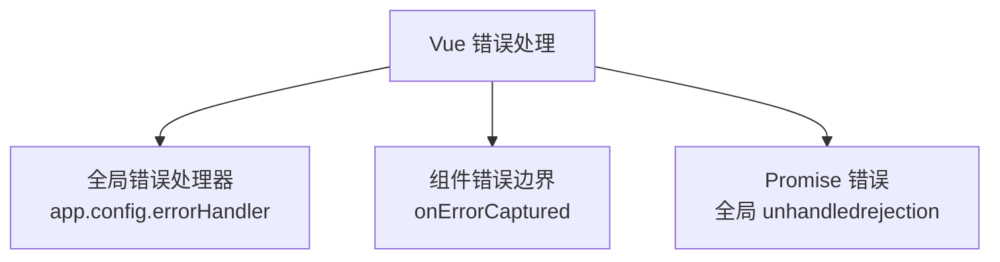

::: details 错误处理实战
```typescript
// 全局错误处理器 — 捕获所有组件中的错误
app.config.errorHandler = (err, instance, info) => {
  // 上报错误到监控平台
  errorReporter.capture(err, { component: instance?.$options.name, info });
  
  // 显示用户友好的错误提示
  ElMessage.error('操作失败，请稍后重试');
};

// 组件内错误边界 — 防止子组件错误导致整个页面崩溃
// ErrorBoundary.vue
<script setup>
const hasError = ref(false);
const error = ref(null);

onErrorCaptured((err, instance, info) => {
  hasError.value = true;
  error.value = err;
  return false; // 阻止错误继续向上传播
});
</script>

<template>
  <slot v-if="!hasError" />
  <div v-else class="error-fallback">
    <p>组件加载失败</p>
    <button @click="hasError = false">重试</button>
  </div>
</template>
```
:::

## 🌐 SSR 服务端渲染

### SPA vs SSR vs SSG

```mermaid
graph TB
    subgraph SPA["SPA 单页应用"]
        A1["浏览器请求 HTML"] --> A2["返回空壳 HTML"]
        A2 --> A3["下载 JS"]
        A3 --> A4["执行 JS 渲染页面"]
    end
    subgraph SSR["SSR 服务端渲染"]
        B1["浏览器请求 HTML"] --> B2["服务器执行 Vue"]
        B2 --> B3["返回完整 HTML ✅"]
        B3 --> B4["下载 JS（Hydration）"]
        B4 --> B5["绑定事件"]
    end
    subgraph SSG["SSG 静态生成"]
        C1["构建时生成 HTML"] --> C2["CDN 分发"]
        C2 --> C3["浏览器直接获取"]
    end
```

| 方案 | 首屏速度 | SEO | 服务器压力 | 适用场景 |
|------|---------|-----|-----------|---------|
| SPA | 慢（白屏） | ❌ 差 | 低 | 后台管理系统 |
| SSR | ✅ 快 | ✅ 好 | 高 | 内容网站、电商 |
| SSG | ✅ 最快 | ✅ 最好 | 无 | 博客、文档站 |
| Nuxt 3 | SSR + SSG 混合 | ✅ 好 | 中 | 通用 |

::: tip Nuxt 3 是 Vue 生态的 SSR 方案
类似 React 的 Next.js，Nuxt 3 提供了：
- 文件路由（基于目录自动生成路由）
- 自动导入（不用手动 import）
- 混合渲染（页面级别选择 SPA/SSR/SSG）
- Nitro 服务引擎（支持多种部署方式）
- 数据获取：`useFetch` / `useAsyncData`

```typescript
// Nuxt 3 页面 — 自动 SSR
<script setup>
// useFetch 在服务端执行时直接获取数据，嵌入 HTML
// 在客户端执行时复用数据，不会重复请求
const { data: posts } = await useFetch('/api/posts');
</script>
```
:::

### Hydration 水合问题

SSR 返回的 HTML 是静态的（没有事件），需要 JS 在客户端"激活"这些 DOM 元素，这个过程叫 **Hydration（水合）**。

```mermaid
sequenceDiagram
    participant 服务端
    participant 浏览器

    服务端->>浏览器: 返回完整 HTML（含数据）
    Note over 浏览器: 用户看到内容 ✅（但无法交互）
    
    浏览器->>浏览器: 下载 JS Bundle
    浏览器->>浏览器: 创建 Vue 实例
    浏览器->>浏览器: Hydration：对比 VNode 和 DOM
    Note over 浏览器: 匹配成功 → 绑定事件 ✅
    Note over 浏览器: 匹配失败 → 重新渲染 ⚠️
```

::: danger Hydration Mismatch（水合不匹配）
服务端渲染的 HTML 和客户端生成的 VNode 不一致时，Vue 会报 hydration mismatch 警告。

**常见原因和解决方案：**

| 原因 | 解决方案 |
|------|---------|
| 使用了 `Date.now()` / `Math.random()` | 用 `<ClientOnly>` 包裹，或用 `useId()` |
| 访问了 `window` / `document` | 用 `<ClientOnly>` 或 `onMounted` 中访问 |
| 第三方库在 SSR 时报错 | 用 `<ClientOnly>` 包裹 |
| 条件渲染依赖浏览器特征 | 统一在客户端判断 |

```vue
<template>
  <!-- 方案1：ClientOnly 组件 -->
  <ClientOnly>
    <BrowserOnlyComponent />
    <template #fallback>
      <div>加载中...</div>
    </template>
  </ClientOnly>
  
  <!-- 方案2：onMounted 守卫 -->
  <div v-if="isMounted">只在客户端渲染</div>
</template>

<script setup lang="ts">
const isMounted = ref(false);
onMounted(() => { isMounted.value = true; });
</script>
```
:::

## 🏗️ 大型应用架构

### 目录结构

```
src/
├── assets/           # 静态资源（CSS、图片）
├── components/       # 通用组件
│   ├── common/       # 基础组件（Button、Input）
│   └── business/     # 业务组件（UserCard、OrderList）
├── composables/      # 可组合函数（逻辑复用）
├── layouts/          # 布局组件
├── pages/            # 页面组件（路由对应）
├── plugins/          # 插件
├── router/           # 路由配置
├── stores/           # Pinia 状态管理
├── types/            # TypeScript 类型定义
├── utils/            # 工具函数
└── api/              # API 请求封装
```

::: details 插件开发
```typescript
// plugins/loading.ts — 全局 Loading 指令
import type { App, Directive } from 'vue';

const loadingDirective: Directive = {
  mounted(el, binding) {
    const mask = document.createElement('div');
    mask.className = 'loading-mask';
    mask.innerHTML = '<div class="spinner"></div>';
    el.style.position = 'relative';
    el.appendChild(mask);
    
    if (!binding.value) mask.style.display = 'none';
  },
  updated(el, binding) {
    const mask = el.querySelector('.loading-mask') as HTMLElement;
    mask.style.display = binding.value ? '' : 'none';
  },
};

export default {
  install(app: App) {
    app.directive('loading', loadingDirective);
  },
};

// 使用
<div v-loading="isLoading">内容</div>
```
:::

## 🎯 面试高频题

::: details 1. KeepAlive 的原理是什么？
`KeepAlive` 内部维护了一个缓存 Map（LRU 策略）：
1. **缓存命中** — 直接返回缓存的 VNode，跳过渲染
2. **缓存未命中** — 正常渲染，渲染后将 VNode 存入缓存
3. **超出 max** — 淘汰最久未访问的组件（LRU）
4. **activated/deactivated** — 缓存激活/失活的生命周期钩子

**原理简化**：内部用 `Map<type, VNode[]>` 存储缓存的 VNode，用 `key` 匹配组件实例。

::: details 2. Vue 3 为什么比 Vue 2 快？
1. **Proxy 响应式** — 惰性代理，不用初始化时递归遍历所有属性
2. **编译时优化** — 静态提升、Patch Flag、Block Tree
3. **Tree-shaking** — 按需打包，没用到的 API 不打包
4. **更高效的 Diff** — 基于 Patch Flag 的精准更新 + 最长递增子序列
5. **更小的包体积** — 全局 API 支持 Tree-shaking（`createApp` 而非 `new Vue`）

::: details 3. Vue 的模板编译过程？
```
模板 Template → 解析 Parse → AST（抽象语法树）
→ 优化 Optimize（标记静态节点、Patch Flag）
→ 生成代码 Generate → 渲染函数 render()
```

编译发生在**构建时**（Vite 的 vue-plugin），不是运行时。所以 Vue 运行时不需要包含编译器（可以用 `runtime-only` 版本减小体积）。

::: details 4. Vue 3 的 provide/inject 和 Pinia 怎么选？
| 场景 | 推荐方案 | 原因 |
|------|---------|------|
| 跨层级传递少量数据 | provide/inject | 轻量，不需要额外库 |
| 全局共享状态 | Pinia | 支持持久化、DevTools、TypeScript |
| 组件库内部通信 | provide/inject | 组件库不应依赖外部状态管理 |
| 复杂业务状态 | Pinia | 支持模块化、中间件、SSR |
:::

::: details 5. ref 和 reactive 怎么选？
| 特性 | ref | reactive |
|------|-----|---------|
| 适用类型 | 任意类型（基本 + 对象） | 仅对象/数组 |
| 访问方式 | 需要 `.value` | 直接访问 |
| 解构 | 不丢失响应性（ref 本身是对象） | ⚠️ 丢失响应性（需要 `toRefs`） |
| 重新赋值 | ✅ `ref.value = newValue` | ❌ 会丢失响应性 |
| 推荐 | 作为函数参数传递时 | 定义复杂对象状态时 |

**最佳实践**：`reactive` 用于复杂对象，`ref` 用于基本类型和需要重新赋值的场景。在 Composables 中优先用 `ref`（更灵活）。

::: details 6. Vue 3 的 watch 和 watchEffect 区别？
- `watch` — 显式指定监听源，可获取新旧值，默认懒执行
- `watchEffect` — 自动追踪回调中使用的响应式数据，立即执行，拿不到旧值

```typescript
// watch — 精确控制
watch(searchTerm, (newVal, oldVal) => {
  console.log(`搜索词从 "${oldVal}" 变为 "${newVal}"`);
  fetchResults(newVal);
}, { immediate: false }); // 默认不立即执行

// watchEffect — 自动追踪
watchEffect(() => {
  // 自动追踪 searchTerm 和 filterType
  fetchResults(searchTerm.value, filterType.value);
}); // 立即执行一次
```

::: details 7. Composition API 比 Options API 好在哪？
| 维度 | Options API | Composition API |
|------|------------|----------------|
| 代码组织 | 按选项分类（data/methods/watch） | 按逻辑关注点组织 |
| 逻辑复用 | Mixin（命名冲突、来源不明） | Composables（清晰、可组合） |
| TypeScript | 弱（this 类型难推导） | ✅ 原生支持 |
| 树摇优化 | 差（this 上下文依赖） | ✅ 好（纯函数） |

**Composition API 的核心优势**：相关逻辑放在一起，而不是分散在 data、methods、computed、watch 各处。大型组件中尤其明显。
:::

::: details 8. setup 函数中 this 是什么？
`undefined`。`setup()` 在组件实例创建之前执行，此时还没有 `this`。这是设计如此，强迫开发者用响应式 API（`ref`、`reactive`）代替 `this`。
:::

::: details 9. Vue 3 的 `shallowRef` 和 `shallowReactive` 什么时候用？
当数据量大且不需要深度响应时，用 shallow 版本提升性能：
- `shallowRef` — 只追踪 `.value` 的变化，不追踪内部属性（适合大列表、图表数据）
- `shallowReactive` — 只追踪第一层属性的变化（适合表单对象，深层属性不变）

```typescript
// 大型列表 — 不需要每项都响应式
const tableData = shallowRef<Row[]>([]); // 替换整个数组时才触发更新
tableData.value = await fetchTableData(); // ✅ 触发更新
tableData.value[0].name = 'new'; // ❌ 不触发更新（性能更好）
```
:::

::: details 10. Vue 3 的 `defineExpose` 是做什么的？
默认情况下，`<script setup>` 组件的内部状态和方法对父组件是不可见的。`defineExpose` 可以显式暴露指定的属性和方法：

```vue
<!-- Child.vue -->
<script setup lang="ts">
const count = ref(0);
const reset = () => { count.value = 0; };

// 暴露给父组件
defineExpose({ count, reset });
</script>

<!-- Parent.vue -->
<template>
  <Child ref="childRef" />
  <button @click="childRef?.reset()">重置子组件</button>
</template>

<script setup lang="ts">
const childRef = ref<{ count: Ref<number>; reset: () => void } | null>(null);
</script>
```
:::
