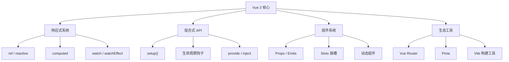
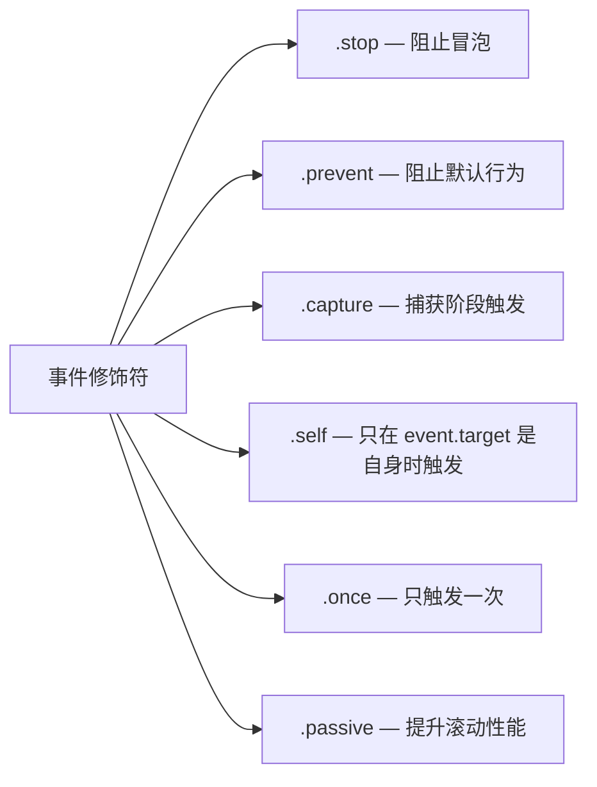
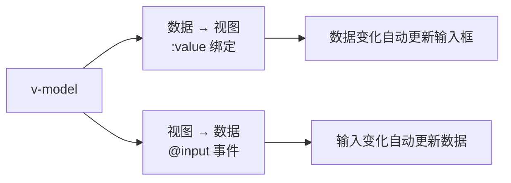
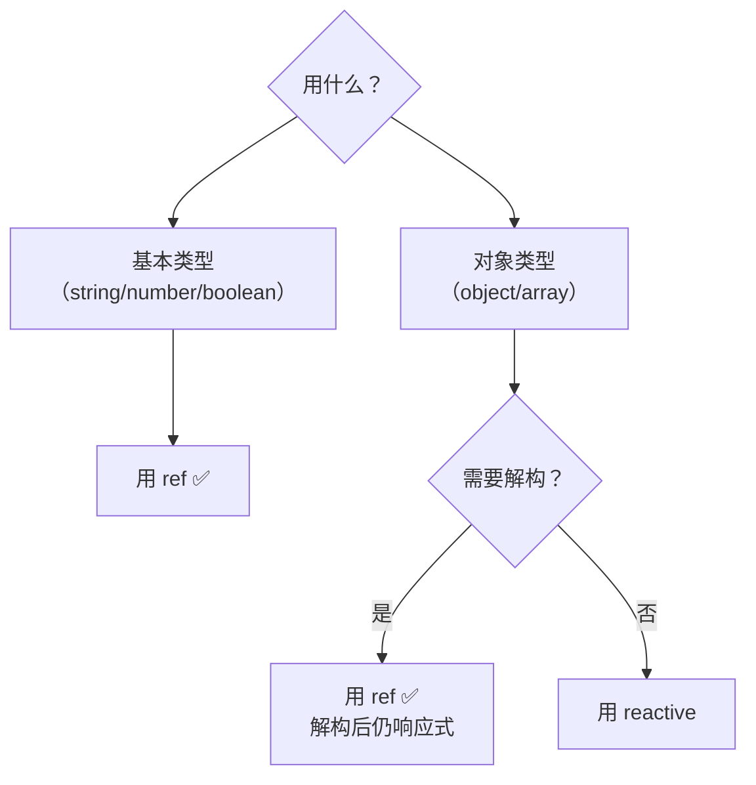
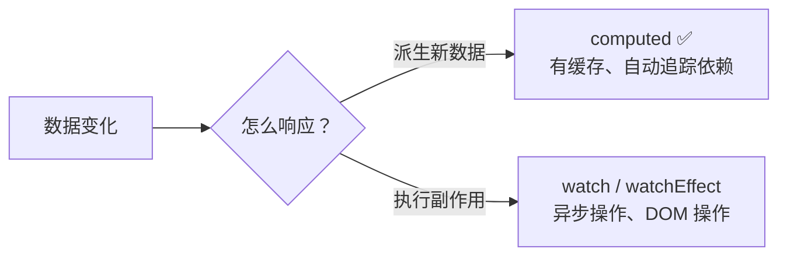
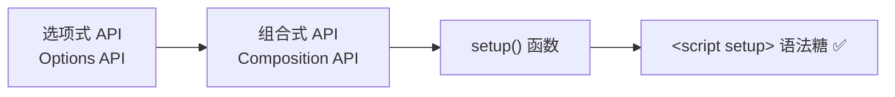
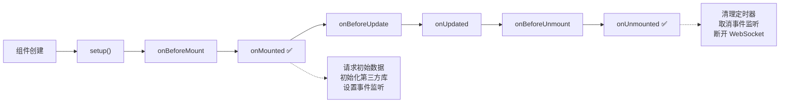
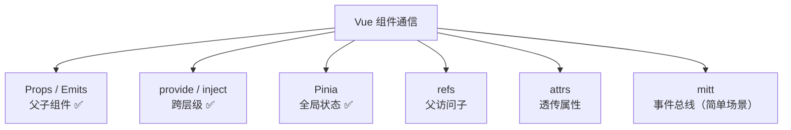
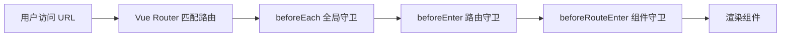
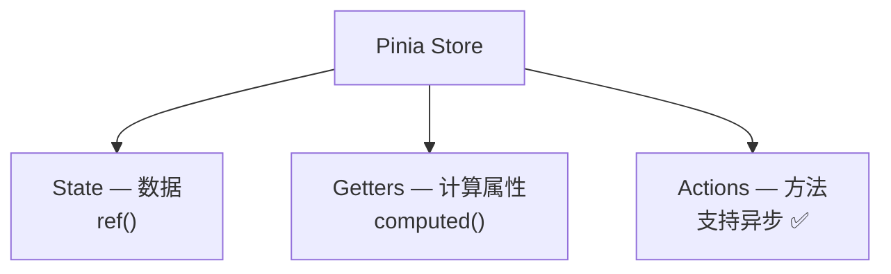

# 💚 Vue 3 基础

> Vue 的核心理念：渐进式、易上手、够灵活。国内前端框架当之无愧的 No.1

## 🧭 Vue 3 全景图



## ⚡ 为什么选 Vue 3？

| 对比维度 | Vue 3 | Vue 2 | React |
|---------|-------|-------|-------|
| 响应式 | Proxy（性能更好） | Object.defineProperty | 手动 setState |
| API 风格 | 组合式 + 选项式 | 选项式 | Hooks |
| TypeScript | ✅ 原生支持 | ⚠️ 需要额外配置 | ✅ 原生支持 |
| 性能 | 更快（Tree-shaking、Proxy） | 一般 | 快 |
| 学习曲线 | 低 | 低 | 中 |
| 包体积 | 更小（按需引入） | 较大 | 较大 |

## 📝 模板语法

Vue 模板基于 HTML，通过指令扩展了原生 HTML 的能力：

### 文本插值与指令

| 语法 | 说明 | 示例 |
|------|------|------|
| `{{ }}` | 文本插值 | `{{ message }}` |
| `v-html` | 渲染 HTML（⚠️ XSS 风险） | `<div v-html="rawHtml"></div>` |
| `v-bind` / `:` | 属性绑定 | `:class="activeClass"` |
| `v-on` / `@` | 事件绑定 | `@click="handleClick"` |
| `v-model` | 双向绑定 | `<input v-model="name">` |
| `v-if / v-else-if / v-else` | 条件渲染 | `<div v-if="show">...</div>` |
| `v-show` | 条件显示（CSS 切换） | `<div v-show="show">...</div>` |
| `v-for` | 列表渲染 | `<li v-for="item in list">` |

### v-bind 进阶

```html
<!-- 对象语法 — 动态 class -->
<div :class="{ active: isActive, 'text-danger': hasError }"></div>

<!-- 数组语法 — 组合多个 class -->
<div :class="[activeClass, errorClass]"></div>

<!-- 数组 + 对象混合 -->
<div :class="[baseClass, { active: isActive }]"></div>

<!-- style 绑定 -->
<div :style="{ color: textColor, fontSize: size + 'px' }"></div>
<div :style="styleObject"></div>
```

### 事件修饰符



```html
<!-- 阻止表单默认提交 -->
<form @submit.prevent="handleSubmit"></form>

<!-- 阻止冒泡（避免父元素事件触发） -->
<button @click.stop="handleClick"></button>

<!-- 按键修饰符 -->
<input @keyup.enter="submit">
<input @keyup.esc="cancel">
<input @keydown.ctrl.enter="save">

<!-- 组合使用 -->
<button @click.stop.prevent="doSomething">
```

### v-for 详解

```html
<!-- 基本用法 -->
<li v-for="item in items" :key="item.id">{{ item.name }}</li>

<!-- 带索引 -->
<li v-for="(item, index) in items" :key="item.id">

<!-- 遍历对象 -->
<div v-for="(value, key, index) in user" :key="key">
  {{ key }}: {{ value }}
</div>

<!-- 遍历数字 -->
<span v-for="n in 5" :key="n">{{ n }}</span>
```

::: danger v-for 的 key 为什么重要？
Vue 的 Diff 算法通过 `key` 来识别节点，**key 必须是唯一且稳定的标识**。

- ✅ 用唯一 ID：`:key="item.id"`
- ❌ 不要用 index：`:key="index"`（列表增删时会导致错误渲染）

**为什么不能用 index？** 当列表中间插入/删除元素时，index 会变化，导致 Vue 错误地复用了 DOM 节点，造成数据错乱。
:::

### v-model 双向绑定

`v-model` 是 `v-bind:value` + `v-on:input` 的语法糖：



```html
<!-- 文本输入 -->
<input v-model="name">

<!-- 多行文本 -->
<textarea v-model="content"></textarea>

<!-- 复选框 -->
<input type="checkbox" v-model="checked">

<!-- 多个复选框绑定数组 -->
<input type="checkbox" value="vue" v-model="frameworks">
<input type="checkbox" value="react" v-model="frameworks">

<!-- 单选框 -->
<input type="radio" value="male" v-model="gender">
<input type="radio" value="female" v-model="gender">

<!-- 选择框 -->
<select v-model="selected">
  <option disabled value="">请选择</option>
  <option value="a">A</option>
  <option value="b">B</option>
</select>

<!-- 修饰符 -->
<input v-model.trim="name">          <!-- 自动去除首尾空格 -->
<input v-model.number="age">          <!-- 转为数字 -->
<input v-model.lazy="name">           <!-- change 事件触发而非 input -->
```

::: details 组件上的 v-model
```typescript
// 子组件 — 定义 modelValue prop 和 update:modelValue 事件
defineProps<{ modelValue: string }>();
const emit = defineEmits<{ 'update:modelValue': [value: string] }>();

// 或使用 v-model 参数名
defineProps<{ title: string }>();
const emit = defineEmits<{ 'update:title': [value: string] }>();
```

```html
<!-- 父组件使用 -->
<MyInput v-model="name" />
<MyInput v-model:title="pageTitle" />  <!-- 指定 prop 名 -->
```
:::

## 🔄 响应式系统

响应式是 Vue 的灵魂——数据变了，视图自动更新。

### ref vs reactive

| 特性 | `ref` | `reactive` |
|------|-------|-----------|
| 适用类型 | 任意类型（基本 + 对象） | 仅对象/数组 |
| 访问方式 | `.value`（模板中自动解包） | 直接访问 |
| 解构 | ✅ 解构后仍响应式 | ❌ 解构后丢失响应式 |
| 重新赋值 | ✅ `ref.value = newValue` | ❌ 不能整体替换 |



::: tip 实际开发建议
**优先用 `ref`**。虽然 `reactive` 访问更方便，但解构丢失响应式这个坑太容易踩。统一用 `ref` 可以减少心智负担。

```typescript
const count = ref(0);
const user = ref({ name: '张三', age: 25 });

// 修改
count.value++;
user.value.name = '李四';  // 对象属性直接修改
user.value = { name: '王五', age: 30 }; // 整体替换也行
```
:::

::: danger reactive 解构陷阱
```typescript
const state = reactive({ count: 0, name: 'Vue' });
const { count, name } = state; // ❌ 丢失响应式！

// 解决方案 1：toRefs
const { count, name } = toRefs(state); // ✅ 保持响应式

// 解决方案 2：直接用 ref
const count = ref(0);
const name = ref('Vue');
```
:::

### computed 和 watch



| 特性 | `computed` | `watch` | `watchEffect` |
|------|-----------|---------|--------------|
| 返回值 | ✅ 返回计算结果 | ❌ 无返回值 | ❌ 无返回值 |
| 缓存 | ✅ 有缓存 | ❌ 无缓存 | ❌ 无缓存 |
| 惰性 | ✅ 懒计算 | ✅ 懒执行 | ❌ 立即执行 |
| 依赖追踪 | 自动 | 需要手动指定 | 自动 |
| 适用场景 | 派生数据 | 监听变化做副作用 | 自动追踪依赖的副作用 |

```typescript
// computed — 可写计算属性
const firstName = ref('张');
const lastName = ref('三');
const fullName = computed({
  get: () => firstName.value + lastName.value,
  set: (val) => {
    firstName.value = val[0];
    lastName.value = val.slice(1);
  },
});

// watch — 监听 ref
watch(count, (newVal, oldVal) => {
  console.log(`count 从 ${oldVal} 变为 ${newVal}`);
});

// watch — 监听多个源
watch([firstName, lastName], ([first, last]) => {
  console.log(`姓名变为: ${first}${last}`);
});

// watch — 监听对象属性（需要 getter 函数）
watch(
  () => user.value.name,
  (newName) => console.log(`名字变为: ${newName}`)
);

// watchEffect — 自动追踪依赖
watchEffect(() => {
  console.log(`当前 count: ${count.value}`); // 自动追踪 count
});
```

::: warning watch 的坑
```typescript
// ❌ 监听 reactive 对象时，默认是深度监听（性能可能有问题）
const state = reactive({ nested: { count: 0 } });
watch(state, () => { /* ... */ }); // 深度监听整个对象

// ✅ 用 getter 函数只监听需要的属性
watch(() => state.nested.count, () => { /* ... */ });

// ✅ 需要 immediate（立即执行一次）
watch(count, (val) => { /* ... */ }, { immediate: true });
```
:::

## 🧩 组合式 API（Composition API）

### setup 语法糖



```vue
<script setup>
// 所有顶层声明自动暴露给模板，无需 return
import { ref, computed, onMounted } from 'vue';

const count = ref(0);
const doubled = computed(() => count.value * 2);

function increment() {
  count.value++;
}

onMounted(() => {
  console.log('组件已挂载');
});
</script>

<template>
  <button @click="increment">{{ count }} × 2 = {{ doubled }}</button>
</template>
```

::: details 组合式 API 的优势
1. **逻辑复用** — 通过 `composables` 函数复用逻辑（替代 Mixin）
2. **更好的类型推导** — TS 支持更完善
3. **更灵活的代码组织** — 相关逻辑放一起，而不是分散在 data/methods/computed
4. **Tree-shaking 友好** — 未使用的 API 不会打包
5. **更好的可测试性** — 纯函数更容易单元测试
:::

### 生命周期钩子



| 选项式 | 组合式 | 说明 |
|--------|-------|------|
| `beforeCreate` | 不需要（setup 本身） | setup 在 beforeCreate 之前执行 |
| `created` | 不需要（setup 本身） | — |
| `beforeMount` | `onBeforeMount` | 挂载前 |
| `mounted` | `onMounted` | ✅ 最常用：请求初始数据 |
| `beforeUpdate` | `onBeforeUpdate` | 更新前 |
| `updated` | `onUpdated` | 更新后 |
| `beforeUnmount` | `onBeforeUnmount` | 卸载前（清理定时器等） |
| `unmounted` | `onUnmounted` | ✅ 清理副作用 |

::: tip 生命周期最佳实践
```typescript
// ✅ 标准模式
onMounted(async () => {
  // 请求数据
  const data = await fetchUserList();
  userList.value = data;
  
  // 设置监听
  window.addEventListener('resize', handleResize);
});

onUnmounted(() => {
  // 清理副作用
  window.removeEventListener('resize', handleResize);
  clearInterval(timer);
});
```
:::

## 🧩 组件通信



### Props 与 Emits

```vue
<!-- 子组件 Child.vue -->
<script setup lang="ts">
// 定义 Props（带类型和默认值）
const props = withDefaults(defineProps<{
  title: string;
  count?: number;
  items?: string[];
}>(), {
  count: 0,
  items: () => [],
});

// 定义 Emits
const emit = defineEmits<{
  change: [value: string];
  delete: [id: number];
}>();

function handleClick() {
  emit('change', '新值');
}
</script>
```

### provide / inject

```typescript
// 祖先组件 — 提供数据
import { provide, ref } from 'vue';

const theme = ref('dark');
provide('theme', theme);        // 提供响应式数据
provide('changeTheme', (t) => { // 提供方法
  theme.value = t;
});

// 后代组件 — 注入数据
const theme = inject<Ref<string>>('theme');
const changeTheme = inject<(t: string) => void>('changeTheme');
```

::: details 插槽 Slots
```vue
<!-- 父组件 -->
<Card>
  <template #header>
    <h2>标题</h2>
  </template>
  <!-- 默认插槽 -->
  <p>这是内容</p>
  <!-- 具名插槽 -->
  <template #footer>
    <button>确定</button>
  </template>
</Card>

<!-- 子组件 Card.vue -->
<template>
  <div class="card">
    <div class="card-header"><slot name="header"></slot></div>
    <div class="card-body"><slot></slot></div>
    <div class="card-footer"><slot name="footer"></slot></div>
  </div>
</template>

<!-- 作用域插槽 — 子组件向插槽传递数据 -->
<List :items="users">
  <template #default="{ item, index }">
    <UserCard :user="item" :index="index" />
  </template>
</List>
```
:::

## 🛣️ Vue Router

### 路由配置

```typescript
import { createRouter, createWebHistory } from 'vue-router';

const router = createRouter({
  history: createWebHistory(),
  routes: [
    { path: '/', component: () => import('@/views/Home.vue') },
    {
      path: '/user/:id',
      component: () => import('@/views/User.vue'),
      props: true, // 将路由参数作为 props 传入
      meta: { requiresAuth: true, title: '用户详情' },
    },
    {
      path: '/dashboard',
      component: () => import('@/views/Dashboard.vue'),
      children: [
        { path: '', component: () => import('@/views/DashOverview.vue') },
        { path: 'settings', component: () => import('@/views/DashSettings.vue') },
      ],
    },
    { path: '/:pathMatch(.*)*', component: () => import('@/views/NotFound.vue') },
  ],
});
```

### 路由模式

| 模式 | URL 形式 | 原理 | 适用场景 |
|------|---------|------|---------|
| `createWebHistory` | `/user/1` | HTML5 History API | ✅ 推荐，SEO 友好 |
| `createWebHashHistory` | `/#/user/1` | URL hash | 不需要服务器配置 |

### 导航守卫



::: details 路由守卫实战
```typescript
// 全局前置守卫 — 登录校验
router.beforeEach((to, from, next) => {
  const token = localStorage.getItem('token');
  
  if (to.meta.requiresAuth && !token) {
    next({ path: '/login', query: { redirect: to.fullPath } });
  } else {
    next(); // 放行
  }
});

// 全局后置守卫 — 设置页面标题
router.afterEach((to) => {
  document.title = (to.meta.title as string) || '默认标题';
});

// 路由独享守卫
{
  path: '/admin',
  component: Admin,
  beforeEnter: (to, from, next) => {
    if (isAdmin()) next();
    else next('/403');
  },
}
```
:::

## 🍍 Pinia 状态管理

Pinia 是 Vue 3 官方推荐的状态管理库，替代 Vuex。

### Pinia vs Vuex

| 特性 | Pinia | Vuex |
|------|-------|------|
| TS 支持 | ✅ 完美 | ⚠️ 需要额外类型 |
| Mutations | ❌ 不需要 | ✅ 必须通过 mutation |
| 模块化 | ✅ 天然支持 | ❌ 需要 modules |
| 体积 | ~1KB | ~10KB |
| DevTools | ✅ 支持 | ✅ 支持 |
| 代码量 | 少 | 多 |

### Pinia 实战



::: details Pinia 完整示例
```typescript
// stores/user.ts — 用户状态管理
import { defineStore } from 'pinia';
import { ref, computed } from 'vue';
import { loginApi, getUserInfo } from '@/api/user';

export const useUserStore = defineStore('user', () => {
  // State
  const token = ref('');
  const userInfo = ref<User | null>(null);
  
  // Getters
  const isLoggedIn = computed(() => !!token.value);
  const username = computed(() => userInfo.value?.name ?? '');
  
  // Actions
  async function login(credentials: LoginForm) {
    const res = await loginApi(credentials);
    token.value = res.token;
    localStorage.setItem('token', res.token);
    await fetchUserInfo();
  }
  
  async function fetchUserInfo() {
    const res = await getUserInfo();
    userInfo.value = res;
  }
  
  function logout() {
    token.value = '';
    userInfo.value = null;
    localStorage.removeItem('token');
  }
  
  return { token, userInfo, isLoggedIn, username, login, fetchUserInfo, logout };
});

// 组件中使用
const userStore = useUserStore();
await userStore.login({ username: 'admin', password: '123' });
console.log(userStore.username); // 自动解包
```
:::

### Pinia 持久化

```typescript
// stores/index.ts — 全局 Pinia 持久化配置
import { createPinia } from 'pinia';
import piniaPluginPersistedstate from 'pinia-plugin-persistedstate';

const pinia = createPinia();
pinia.use(piniaPluginPersistedstate);

// 在 Store 中开启持久化
export const useUserStore = defineStore('user', () => {
  // ...
  return { token, userInfo, login, logout };
}, {
  persist: {
    key: 'user-store',
    pick: ['token'], // 只持久化 token
  },
});
```

## 🎯 面试高频题

::: details 1. Vue 3 的响应式原理是什么？
Vue 3 使用 `Proxy` 替代了 Vue 2 的 `Object.defineProperty`：

| 对比 | Vue 2（defineProperty） | Vue 3（Proxy） |
|------|----------------------|---------------|
| 新增属性 | ❌ 需要手动 `$set` | ✅ 自动拦截 |
| 数组监听 | ❌ 需要重写数组方法 | ✅ 自动拦截 |
| 性能 | 初始化时递归遍历所有属性 | 惰性代理，按需收集依赖 |
| 删除属性 | ❌ 需要手动 `$delete` | ✅ 自动拦截 |

核心流程：**读取属性时收集依赖（track），修改属性时触发更新（trigger），更新调度到微任务队列批量执行。**

::: details 2. nextTick 原理是什么？
Vue 更新 DOM 是**异步**的。数据变化后，DOM 不会立即更新，而是在下一个"微任务"中批量更新。

`nextTick` 就是在 DOM 更新完成后执行回调。内部使用 `Promise.then()` 或 `MutationObserver` 实现微任务调度。

```typescript
await nextTick();
// 此时 DOM 已更新
```

::: details 3. v-if 和 v-show 有什么区别？
| 对比 | `v-if` | `v-show` |
|------|--------|----------|
| 渲染 | 条件为 false 时不渲染 DOM | 始终渲染，通过 CSS `display: none` 控制 |
| 切换开销 | 高（销毁/重建） | 低（CSS 切换） |
| 初始渲染 | 条件为 false 时不渲染（性能好） | 始终渲染 |
| 适用场景 | 条件很少变化时 | 频繁切换时 |

::: details 4. keep-alive 的作用？
`<keep-alive>` 缓存组件实例，避免重复创建和销毁：

```html
<keep-alive :include="['Home', 'User']" :max="10">
  <router-view />
</keep-alive>
```

- `include` — 只缓存匹配的组件
- `exclude` — 排除匹配的组件
- `max` — 最大缓存数量（LRU 策略）

被缓存的组件有两个额外的生命周期：`onActivated`（激活时）和 `onDeactivated`（失活时）。
:::
