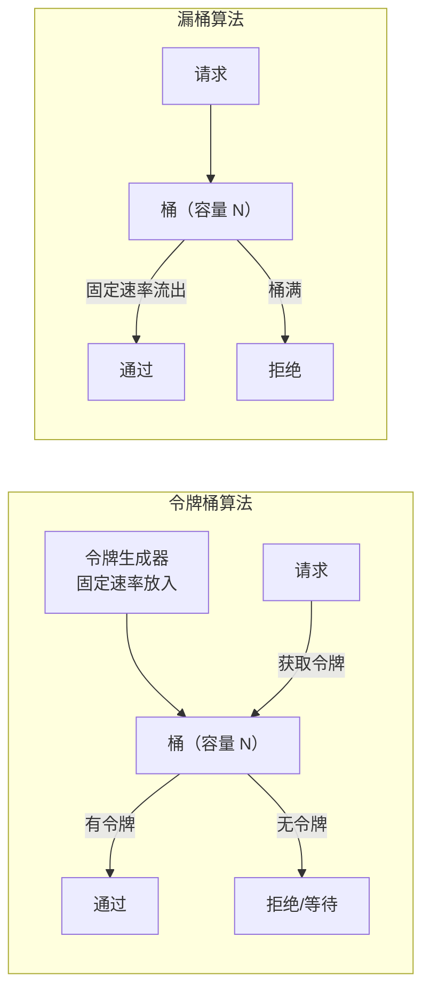
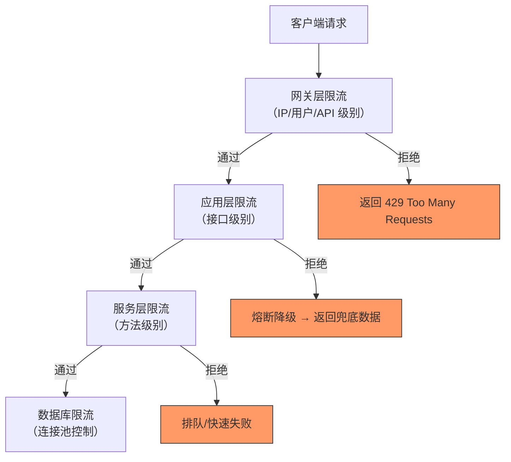
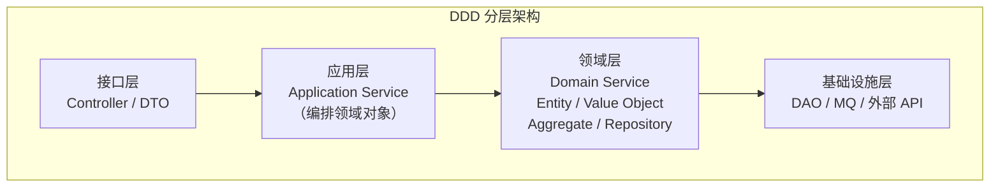
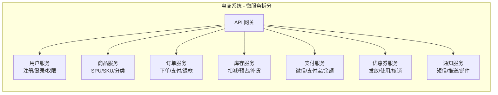
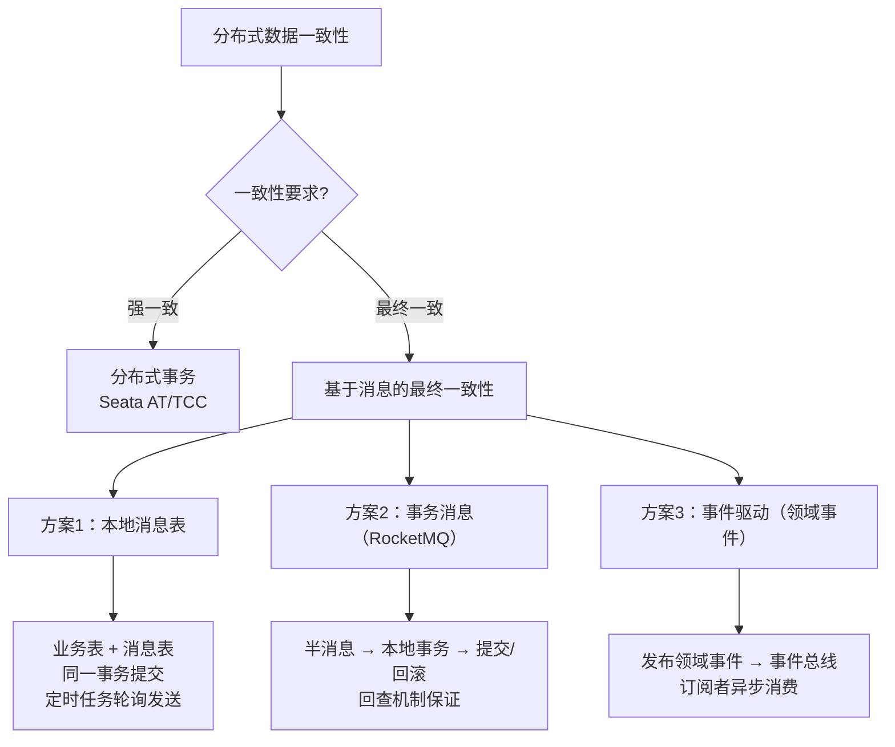
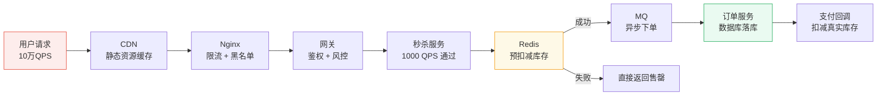

# 架构设计面试题

> 持续更新中 | 最后更新：2026-04-02

---

## ⭐⭐⭐ 高并发限流方案：令牌桶 vs 漏桶与熔断降级

**简要回答：** 限流是保护系统在高并发下不被冲垮的关键手段。常见算法有令牌桶（允许突发流量）、漏桶（平滑流量），实现方式有单机限流（Guava RateLimiter）和分布式限流（Redis + Lua）。熔断降级是限流的补充，当下游服务异常时主动切断调用，快速失败保护系统。

**深度分析：**

### 限流算法对比

| 算法 | 原理 | 突发流量 | 流量平滑 | 适用场景 |
|------|------|---------|---------|---------|
| **令牌桶** | 固定速率向桶中放入令牌，请求需要获取令牌 | ✅ 允许（桶内有令牌时） | 部分 | API 限流、秒杀 |
| **漏桶** | 请求进入桶中，固定速率流出处理 | ❌ 不允许 | ✅ 完全平滑 | 流量整形、消息队列 |
| **固定窗口** | 固定时间窗口计数 | ❌ 临界突发 | ❌ | 简单场景 |
| **滑动窗口** | 滑动时间窗口计数 | ✅ 较平滑 | ✅ | 精确限流 |



### 单机限流（Guava RateLimiter）

```java
// Guava RateLimiter - 令牌桶实现
@Service
public class OrderService {
    
    // 每秒生成 100 个令牌
    private final RateLimiter rateLimiter = RateLimiter.create(100);
    
    public Order createOrder(OrderRequest request) {
        // tryAcquire 非阻塞，获取不到立即返回 false
        if (!rateLimiter.tryAcquire(500, TimeUnit.MILLISECONDS)) {
            throw new BusinessException("系统繁忙，请稍后重试");
        }
        // 业务逻辑
        return orderMapper.insert(request);
    }
    
    // 预热限流器（冷启动场景）
    // 系统刚启动时允许少量流量，逐步提高到限流阈值
    private final RateLimiter warmupLimiter = RateLimiter.create(100, 10, TimeUnit.SECONDS);
}

// 基于 Semaphore 的并发限流
@Service
public class ConcurrentLimiterService {
    
    // 最多允许 50 个并发请求
    private final Semaphore semaphore = new Semaphore(50);
    
    public void process() {
        if (!semaphore.tryAcquire()) {
            throw new BusinessException("并发数已达上限");
        }
        try {
            // 业务逻辑
        } finally {
            semaphore.release();
        }
    }
}
```

### 分布式限流（Redis + Lua）

```java
// Redis + Lua 滑动窗口限流
@Component
public class RedisRateLimiter {
    
    @Autowired
    private StringRedisTemplate redisTemplate;
    
    /**
     * 滑动窗口限流
     * @param key 限流 key
     * @param limit 限流阈值
     * @param windowSize 窗口大小（秒）
     */
    public boolean isAllowed(String key, int limit, int windowSize) {
        String script = 
            "local current = redis.call('INCR', KEYS[1]) " +
            "if current == 1 then " +
            "    redis.call('EXPIRE', KEYS[1], ARGV[1]) " +
            "end " +
            "if current > tonumber(ARGV[2]) then " +
            "    return 0 " +
            "else " +
            "    return 1 " +
            "end";
        
        Long result = redisTemplate.execute(
            new DefaultRedisScript<>(script, Long.class),
            Collections.singletonList("rate_limit:" + key),
            String.valueOf(windowSize),
            String.valueOf(limit)
        );
        return result != null && result == 1;
    }
}

// 使用注解 + AOP 实现声明式限流
@Target(ElementType.METHOD)
@Retention(RetentionPolicy.RUNTIME)
public @interface RateLimit {
    int value() default 100;         // 限流阈值
    int windowSize() default 60;     // 窗口大小（秒）
    String key() default "";         // 限流 key（支持 SpEL）
}

@Aspect
@Component
public class RateLimitAspect {
    
    @Autowired
    private RedisRateLimiter rateLimiter;
    
    @Around("@annotation(rateLimit)")
    public Object around(ProceedingJoinPoint point, RateLimit rateLimit) throws Throwable {
        String key = getKey(point, rateLimit);
        if (!rateLimiter.isAllowed(key, rateLimit.value(), rateLimit.windowSize())) {
            throw new BusinessException("请求过于频繁，请稍后重试");
        }
        return point.proceed();
    }
}

// 使用
@RateLimit(value = 10, windowSize = 1, key = "#userId")
public void submitOrder(Long userId, OrderRequest request) { ... }
```

### 网关限流（Spring Cloud Gateway）

```yaml
# application.yml - Gateway 限流配置
spring:
  cloud:
    gateway:
      routes:
        - id: order-service
          uri: lb://order-service
          predicates:
            - Path=/api/order/**
          filters:
            - name: RequestRateLimiter
              args:
                redis-rate-limiter.replenishRate: 10    # 每秒填充 10 个令牌
                redis-rate-limiter.burstCapacity: 20     # 桶容量 20
                key-resolver: "#{@userKeyResolver}"      # 按 userId 限流
```

```java
// 按 IP 限流
@Bean
public KeyResolver ipKeyResolver() {
    return exchange -> Mono.just(
        exchange.getRequest().getRemoteAddress().getAddress().getHostAddress()
    );
}

// 按用户限流
@Bean
public KeyResolver userKeyResolver() {
    return exchange -> Mono.just(
        exchange.getRequest().getHeaders().getFirst("X-User-Id")
    );
}
```

### 熔断降级（Sentinel）

```java
// Sentinel 熔断降级
@Service
public class PaymentService {
    
    // 熔断规则：异常比例 > 50% 且请求数 > 10 时熔断 10 秒
    @SentinelResource(
        value = "processPayment",
        blockHandler = "processPaymentBlock",
        fallback = "processPaymentFallback"
    )
    public PaymentResult processPayment(PaymentRequest request) {
        // 调用第三方支付
        return paymentClient.pay(request);
    }
    
    // 限流/熔断处理（BlockException）
    public PaymentResult processPaymentBlock(PaymentRequest request, BlockException ex) {
        log.warn("支付接口被限流/熔断: {}", ex.getMessage());
        return PaymentResult.fail("系统繁忙，请稍后重试");
    }
    
    // 业务异常降级（Exception）
    public PaymentResult processPaymentFallback(PaymentRequest request, Throwable ex) {
        log.error("支付接口异常降级: {}", ex.getMessage());
        return PaymentResult.fail("支付服务暂不可用，已记录您的请求");
    }
}
```

**Sentinel 熔断策略：**

| 策略 | 说明 | 适用场景 |
|------|------|---------|
| 慢调用比例 | 响应时间超过阈值算慢调用，比例超限熔断 | 第三方接口超时 |
| 异常比例 | 异常请求占总请求比例超限熔断 | 第三方接口报错 |
| 异常数 | 窗口内异常数超限熔断 | 异常数量敏感场景 |

### 限流降级分层架构



:::tip 实践建议
- **限流是最后一道防线**，优先通过扩容、缓存、异步化解决性能问题
- 限流阈值要压测确定，不要拍脑袋（建议设为系统容量的 80%）
- 多级限流：网关 → 应用 → 方法 → 数据库连接池
- 熔断降级要提供兜底数据（如默认推荐、缓存数据），提升用户体验
- 限流后给用户友好提示，不要直接返回 500 错误
- 监控限流指标，如果频繁触发说明需要扩容

```java
// 限流降级完整实践
@RestController
@RequestMapping("/api/order")
public class OrderController {
    
    @PostMapping("/create")
    @RateLimit(value = 100, windowSize = 1)
    @SentinelResource(value = "createOrder", blockHandler = "createOrderBlock")
    public Result<Order> createOrder(@RequestBody OrderRequest request) {
        // 1. 参数校验
        // 2. 防重检查（幂等）
        // 3. 库存预扣（Redis）
        // 4. 创建订单（异步 MQ）
        return Result.success(orderService.createOrder(request));
    }
    
    public Result<Order> createOrderBlock(OrderRequest request, BlockException ex) {
        return Result.fail(429, "下单太频繁啦，请稍后再试~");
    }
}
```
:::

:::danger 面试追问
- 令牌桶和漏桶的本质区别？→ 令牌桶控制的是平均速率 + 允许突发，漏桶控制的是恒定输出速率
- 分布式限流有什么难点？→ 时钟不同步、Redis 单点问题、Lua 脚本原子性
- Sentinel 和 Hystrix 有什么区别？→ Sentinel 有实时监控面板、支持更丰富的规则、性能更好；Hystrix 已停止维护
- 如何做动态限流？→ Sentinel Dashboard 动态配置、Nacos/Apollo 配置中心下发限流规则
- 限流和降级的区别？→ 限流是主动控制请求量，降级是服务异常时的兜底策略，两者配合使用
:::

---

## ⭐⭐ 微服务拆分原则：DDD 领域驱动设计

**简要回答：** 微服务拆分的核心原则是"高内聚、低耦合"，推荐使用 DDD（领域驱动设计）方法指导拆分：先划分领域边界，再确定服务边界，最后保证数据一致性。拆分粒度不宜过粗（单体）也不宜过细（分布式单体），一般一个微服务对应一个限界上下文。

**深度分析：**

### DDD 核心概念



| DDD 概念 | 说明 | 举例 |
|---------|------|------|
| **限界上下文（Bounded Context）** | 语义边界，同一个概念在不同上下文含义不同 | 订单上下文的"商品" vs 库存上下文的"商品" |
| **聚合根（Aggregate Root）** | 一组相关对象的入口，保证一致性 | 订单（包含订单项） |
| **实体（Entity）** | 有唯一标识，可变 | 订单、用户 |
| **值对象（Value Object）** | 无唯一标识，不可变 | 地址、金额 |
| **领域事件（Domain Event）** | 领域内发生的重要事件 | OrderCreated、PaymentCompleted |
| **领域服务（Domain Service）** | 跨实体的业务逻辑 | 转账服务（涉及两个账户） |

### 电商系统拆分示例



### 拆分粒度原则

```
拆分粒度判断标准：

1. 业务独立性：能否独立开发、部署、扩容？
2. 数据独立性：是否有独立的数据存储？
3. 团队匹配：能否由一个小团队（2-pizza team）负责？
4. 变更频率：变更是否集中？不同频率的拆开
5. 故障隔离：一个服务挂了影响范围？

拆分粒度参考：
├── 太粗：整个电商系统 = 1 个服务 ❌
├── 太细：每个表 = 1 个服务 ❌
└── 合理：订单域（含订单+订单项+收货地址）= 1 个服务 ✅
```

### 数据一致性方案



```java
// 方案1：本地消息表（通用性强）
@Service
public class OrderService {
    
    @Transactional
    public Order createOrder(OrderRequest request) {
        // 1. 创建订单
        Order order = new Order(request);
        orderMapper.insert(order);
        
        // 2. 写入本地消息表（同一事务）
        OutboxMessage message = new OutboxMessage();
        message.setTopic("order-created");
        message.setPayload(JSON.toJSONString(order));
        message.setStatus(0);  // 待发送
        outboxMapper.insert(message);
        
        return order;
    }
}

// 定时任务发送消息
@Scheduled(fixedRate = 5000)
public void sendOutboxMessages() {
    List<OutboxMessage> messages = outboxMapper.selectByStatus(0);
    messages.forEach(msg -> {
        try {
            rocketMQTemplate.send(msg.getTopic(), msg.getPayload());
            msg.setStatus(1);  // 已发送
            outboxMapper.updateById(msg);
        } catch (Exception e) {
            // 重试次数超限标记失败
            msg.setRetryCount(msg.getRetryCount() + 1);
            outboxMapper.updateById(msg);
        }
    });
}

// 方案2：事务消息（RocketMQ）
@RocketMQTransactionListener
public class OrderTransactionListener implements RocketMQLocalTransactionListener {
    
    @Autowired
    private OrderMapper orderMapper;
    @Autowired
    private InventoryClient inventoryClient;
    
    @Override
    public RocketMQLocalTransactionState executeLocalTransaction(Message msg, Object arg) {
        Order order = (Order) arg;
        try {
            // 1. 创建订单
            orderMapper.insert(order);
            // 2. 扣减库存（RPC）
            inventoryClient.deduct(order.getProductId(), order.getQuantity());
            return RocketMQLocalTransactionState.COMMIT;
        } catch (Exception e) {
            return RocketMQLocalTransactionState.ROLLBACK;
        }
    }
    
    @Override
    public RocketMQLocalTransactionState checkLocalTransaction(Message msg) {
        // 回查：检查订单是否存在
        String orderId = msg.getHeaders().get("orderId", String.class);
        Order order = orderMapper.selectById(orderId);
        return order != null ? RocketMQLocalTransactionState.COMMIT 
                             : RocketMQLocalTransactionState.ROLLBACK;
    }
}
```

### 拆分后的挑战与应对

| 挑战 | 解决方案 |
|------|---------|
| 服务间调用复杂 | 服务网格（Istio）、Feign + Sentinel |
| 分布式事务 | 本地消息表、事务消息、TCC、Saga |
| 数据查询跨服务 | CQRS（读写分离）、数据冗余、ES 聚合查询 |
| 服务治理复杂 | Nacos/Sentinel/SkyWalking 全链路 |
| 团队协作成本 | 清晰的服务边界文档、API 契约优先 |
| 测试复杂 | 契约测试（Pact）、集成测试环境 |

:::tip 实践建议
- **先做单体，再拆分**：不要一开始就微服务，先做模块化单体，等业务稳定后再拆
- **按业务能力拆分，不是按技术层拆分**：✅ 订单服务、❌ 数据库服务
- **每个服务独立数据库**：禁止跨库 JOIN，通过 API 或消息同步数据
- **API 契约优先**：先定义接口（OpenAPI/Swagger），再各自实现
- **灰度拆分**：先拆最独立的模块，逐步推进，不要一步到位
- **拆分前评估**：引入微服务的成本（运维复杂度、网络延迟、数据一致性）是否值得

```java
// 拆分步骤（推荐）
// 1. 模块化（Monolith Modular）→ 按领域划分 Maven 模块
// 2. 抽离公共服务（认证、配置、监控）
// 3. 拆分最独立的模块（如通知服务）
// 4. 逐步拆分核心业务（订单、支付）
// 5. 每一步都保证系统可用（灰度发布）
```
:::

:::danger 面试追问
- DDD 的领域事件怎么实现？→ Spring Event（单体）、消息队列（分布式）、EventStore（事件溯源）
- 拆分后如何做跨服务查询？→ CQRS + ES 聚合查询、数据冗余、BFF 层聚合、GraphQL
- Saga 和 TCC 有什么区别？→ TCC 需要每个服务实现 Try/Confirm/Cancel 三个接口，侵入性强；Saga 是正向执行 + 补偿操作，侵入性弱
- 微服务怎么拆分数据库？→ 每个服务独立数据库（Database per Service），禁止跨库 JOIN
- 什么时候不适合微服务？→ 团队小（<5人）、业务简单、早期创业项目、对运维能力要求不高的项目
:::

---

## ⭐ 如何设计一个秒杀系统？

**简要回答：** 核心思路是「削峰填谷 + 分层过滤」。请求进来后层层拦截，只让少数合法请求打到数据库：CDN → Nginx 限流 → 网关鉴权 → Redis 预扣减 → MQ 异步下单 → 数据库落库。

**深度分析：**



| 层级 | 作用 | 技术 |
|------|------|------|
| CDN | 静态资源（商品页、JS/CSS） | Nginx、Cloudflare |
| Nginx | 限流（令牌桶）、IP 黑名单 | limit_req、Lua |
| 网关 | 鉴权、风控（刷单检测） | Spring Cloud Gateway |
| 秒杀服务 | 校验、Redis 预扣减 | Lua 脚本保证原子性 |
| MQ | 削峰，异步下单 | RocketMQ、Kafka |
| 订单服务 | 数据库落库 | MySQL |

```java
// Redis 预扣减库存（Lua 脚本，原子操作）
String script = """
    local stock = tonumber(redis.call('GET', KEYS[1]))
    if stock and stock > 0 then
        redis.call('DECR', KEYS[1])
        redis.call('LPUSH', KEYS[2], ARGV[1])
        return 1
    end
    return 0
    """;

Long result = redisTemplate.execute(
    new DefaultRedisScript<>(script, Long.class),
    Arrays.asList("seckill:stock:" + productId, "seckill:queue:" + productId),
    userId.toString()
);
if (result == 1L) {
    // 预扣减成功，发 MQ 消息异步创建订单
    rocketMQTemplate.convertAndSend("seckill-order", orderDTO);
} else {
    throw new BizException("商品已售罄");
}
```

:::tip 面试追问
- **超卖怎么防止？** Redis Lua 脚本原子扣减 + 数据库唯一索引兜底
- **恶意刷单怎么防？** 验证码（人机验证）、IP 限流、用户维度限购（Redis SETNX）
- **下单后多久没支付怎么办？** 延迟消息（RocketMQ 延迟级）30 分钟后检查订单状态，未支付则取消并回滚库存
- **库存回滚？** 支付超时取消 → 发消息 → 订单服务取消订单 → 库存服务回滚库存
:::
