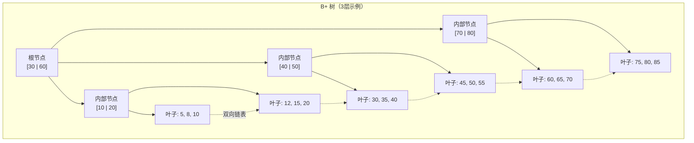
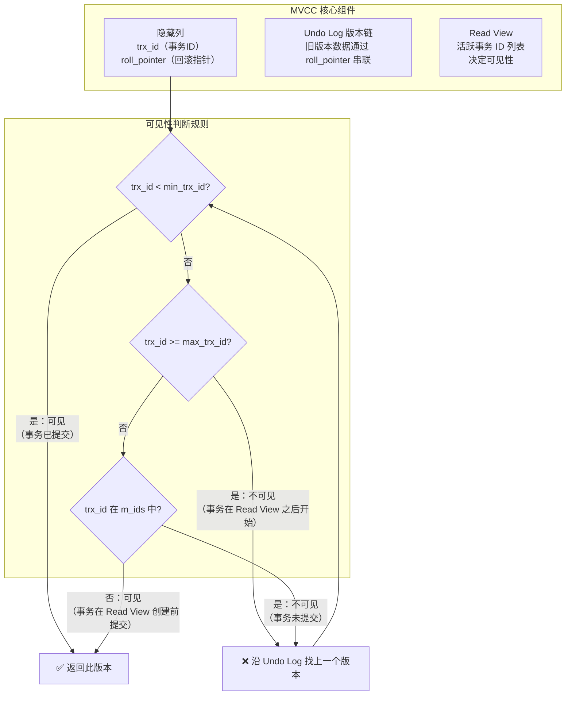
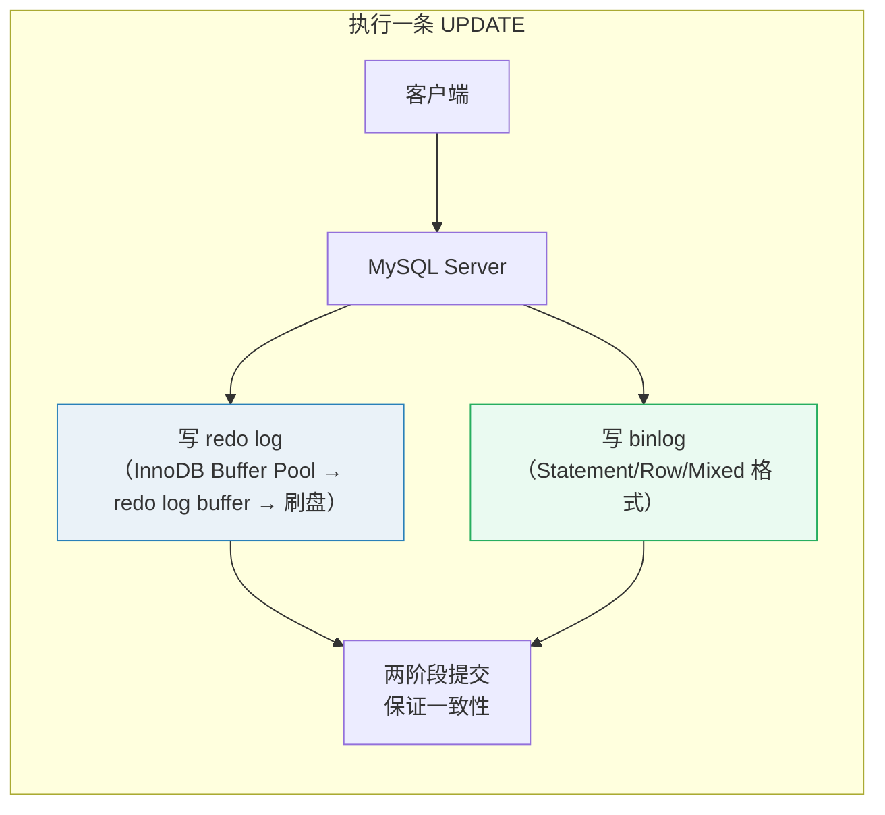

# 数据库面试题

> 持续更新中 | 最后更新：2026-04-02

---

## ⭐⭐⭐ MySQL 索引优化：B+ 树结构、最左前缀原则与索引失效

**简要回答：** MySQL InnoDB 使用 B+ 树作为索引数据结构，所有数据存储在叶子节点并通过双向链表连接，支持高效的范围查询。索引优化核心是遵循最左前缀原则，善用覆盖索引，避免索引失效。

**深度分析：**

### B+ 树结构



**为什么选 B+ 树而不是 B 树或红黑树？**

| 数据结构 | 查找效率 | 范围查询 | 磁盘 IO | 适用场景 |
|---------|---------|---------|---------|---------|
| B+ 树 | O(log n) | ✅ 链表顺序遍历 | 少（节点大，层级浅） | 磁盘数据库 |
| B 树 | O(log n) | ❌ 需要中序遍历 | 较多（数据在非叶子节点） | 磁盘数据库 |
| 红黑树 | O(log n) | ❌ | 多（二叉树，层级深） | 内存数据结构 |
| Hash | O(1) | ❌ | - | 等值查询 |

**B+ 树特点：**
- 非叶子节点只存索引（键值），不存数据 → 单个节点能存更多索引 → 树更矮 → IO 次数更少
- 叶子节点存储所有数据，通过双向链表连接 → 范围查询高效
- 一般 3-4 层就能存储千万级数据（每层约 1000 个子节点）

### 聚簇索引 vs 非聚簇索引

```
聚簇索引（Clustered Index）：
- 叶子节点存储完整数据行
- 一张表只能有一个聚簇索引（通常是主键）
- 主键索引查询：直接在叶子节点找到数据

非聚簇索引（Secondary Index）：
- 叶子节点存储主键值（不是数据行）
- 需要回表（Bookmark Lookup）：先查二级索引得到主键 → 再查聚簇索引得到数据
```


### 最左前缀原则

```sql
-- 建立联合索引
CREATE INDEX idx_age_name_city ON user(age, name, city);

-- ✅ 命中索引
SELECT * FROM user WHERE age = 20;                    -- 用到 age
SELECT * FROM user WHERE age = 20 AND name = '张三';   -- 用到 age + name
SELECT * FROM user WHERE age = 20 AND name = '张三' AND city = '北京'; -- 全部命中
SELECT * FROM user WHERE age = 20 AND city = '北京';   -- 用到 age（name 跳过了，city 用不了）

-- ❌ 不命中索引（违反最左前缀）
SELECT * FROM user WHERE name = '张三';                -- 跳过了 age
SELECT * FROM user WHERE city = '北京';                 -- 跳过了 age, name
SELECT * FROM user WHERE name = '张三' AND city = '北京'; -- 跳过了 age

-- ✅ 范围查询后的列不命中（age 范围查询后，name 用不了索引）
SELECT * FROM user WHERE age > 20 AND name = '张三';    -- 只用到 age
```

### 覆盖索引

```sql
-- 覆盖索引：查询的列都在索引中，不需要回表
CREATE INDEX idx_age_name ON user(age, name);

-- ✅ 覆盖索引（不需要回表）
SELECT age, name FROM user WHERE age = 20;

-- ❌ 需要回表（city 不在索引中）
SELECT age, name, city FROM user WHERE age = 20;

-- ✅ 使用覆盖索引优化
CREATE INDEX idx_age_name_city ON user(age, name, city);
```

### 索引失效的常见场景

```sql
-- 1. 对索引列使用函数
SELECT * FROM user WHERE YEAR(create_time) = 2024;   -- ❌
SELECT * FROM user WHERE create_time >= '2024-01-01'; -- ✅

-- 2. 隐式类型转换
-- phone 是 varchar 类型
SELECT * FROM user WHERE phone = 13800138000;  -- ❌ 数字隐式转为字符串
SELECT * FROM user WHERE phone = '13800138000'; -- ✅

-- 3. 使用 OR（部分列没有索引时）
SELECT * FROM user WHERE age = 20 OR city = '北京'; -- ❌ city 无索引时全表扫描

-- 4. LIKE 以通配符开头
SELECT * FROM user WHERE name LIKE '%张%';   -- ❌
SELECT * FROM user WHERE name LIKE '张%';    -- ✅

-- 5. NOT IN / NOT EXISTS / !=
SELECT * FROM user WHERE age != 20;          -- ❌（优化器可能走索引，但不保证）

-- 6. IS NOT NULL（部分版本/场景下）
SELECT * FROM user WHERE name IS NOT NULL;   -- ⚠️ 可能不走索引

-- 7. 对索引列做运算
SELECT * FROM user WHERE age + 1 = 21;       -- ❌
SELECT * FROM user WHERE age = 20;           -- ✅
```

:::tip 实践建议
- 索引设计原则：**单表索引不超过 5 个**，联合索引区分度高的列在前
- 使用 `EXPLAIN` 分析执行计划，关注 `type`（至少 ref）、`key`（用了哪个索引）、`rows`（扫描行数）
- 区分度低的列（如性别）不适合单独建索引
- 避免 SELECT *，使用覆盖索引减少回表
- 长字符串字段建索引用前缀索引：`INDEX idx_name(name(20))`

```sql
-- 索引优化检查清单
EXPLAIN SELECT * FROM user WHERE age = 20 AND name = '张三';
-- type=ref, key=idx_age_name, rows=5 → 优化良好
-- type=ALL, key=NULL, rows=100000 → 需要优化
```
:::

:::danger 面试追问
- 什么是索引下推（Index Condition Pushdown）？→ MySQL 5.6 引入，在索引遍历过程中，对索引中包含的字段直接做过滤，减少回表次数
- 什么情况下应该建联合索引而不是单列索引？→ 多个列经常一起作为查询条件时，联合索引比多个单列索引更高效（减少索引维护开销，避免 index merge）
- 为什么不建议用 SELECT *？→ 无法使用覆盖索引、增加网络传输、增加内存消耗
- 如何查看 SQL 是否走索引？→ `EXPLAIN` 分析 `type`（const > eq_ref > ref > range > index > ALL）
- 什么情况下索引会失效但 EXPLAIN 显示走了索引？→ 可能是优化器选择错了，可以用 `FORCE INDEX` 强制指定
:::

---

## ⭐⭐ Redis 缓存穿透、击穿与雪崩：原理与解决方案

**简要回答：** 缓存穿透是查询不存在的数据绕过缓存直达数据库；缓存击穿是热点 key 过期瞬间大量请求打到数据库；缓存雪崩是大量 key 同时过期或 Redis 宕机导致请求全部打到数据库。三者本质都是保护数据库不被大流量冲垮。

**深度分析：**

### 三大问题对比

| 问题 | 定义 | 根本原因 | 典型场景 |
|------|------|---------|---------|
| **缓存穿透** | 查询不存在的数据，缓存和数据库都没有 | 恶意攻击或业务 bug | 查询 id=-1 的用户 |
| **缓存击穿** | 热点 key 过期，瞬间大量并发请求到 DB | 单个热点 key 失效 | 秒杀商品库存缓存过期 |
| **缓存雪崩** | 大量 key 同时过期或 Redis 宕机 | 缓存大面积失效 | 每天零点大批缓存同时过期 |


### 缓存穿透解决方案

```java
// 方案1：缓存空值（简单有效）
public User getUserById(Long id) {
    String key = "user:" + id;
    String value = redisTemplate.opsForValue().get(key);
    
    if (value != null) {
        if ("NULL".equals(value)) {
            return null;  // 缓存了空值，防止穿透
        }
        return JSON.parseObject(value, User.class);
    }
    
    User user = userMapper.selectById(id);
    if (user == null) {
        // 缓存空值，设短过期时间
        redisTemplate.opsForValue().set(key, "NULL", 5, TimeUnit.MINUTES);
        return null;
    }
    redisTemplate.opsForValue().set(key, JSON.toJSONString(user), 30, TimeUnit.MINUTES);
    return user;
}

// 方案2：布隆过滤器（推荐，适合大数据量）
@Component
public class BloomFilterService {
    
    @Autowired
    private RedisTemplate<String, Object> redisTemplate;
    
    // 添加元素到布隆过滤器
    public void addToBloomFilter(String key, String value) {
        redisTemplate.opsForValue().setBit("bloom:" + key, hash(value), true);
    }
    
    // 判断元素是否存在（可能误判不存在，但不会误判存在）
    public boolean mightExist(String key, String value) {
        return Boolean.TRUE.equals(redisTemplate.opsForValue().getBit("bloom:" + key, hash(value)));
    }
    
    public User getUserById(Long id) {
        // 布隆过滤器判断
        if (!mightExist("user", String.valueOf(id))) {
            return null;  // 一定不存在，直接返回
        }
        // 正常查询缓存和数据库...
    }
}
```

### 缓存击穿解决方案

```java
// 方案1：互斥锁（推荐，防止并发重建）
public User getUserById(Long id) {
    String key = "user:" + id;
    String value = redisTemplate.opsForValue().get(key);
    
    if (value != null) {
        return JSON.parseObject(value, User.class);
    }
    
    // 获取分布式锁
    String lockKey = "lock:user:" + id;
    Boolean locked = redisTemplate.opsForValue().setIfAbsent(lockKey, "1", 10, TimeUnit.SECONDS);
    
    try {
        if (Boolean.TRUE.equals(locked)) {
            // 双重检查
            value = redisTemplate.opsForValue().get(key);
            if (value != null) {
                return JSON.parseObject(value, User.class);
            }
            // 查数据库并重建缓存
            User user = userMapper.selectById(id);
            redisTemplate.opsForValue().set(key, JSON.toJSONString(user), 30, TimeUnit.MINUTES);
            return user;
        } else {
            // 未获取到锁，短暂等待后重试
            Thread.sleep(100);
            return getUserById(id);
        }
    } finally {
        // 释放锁
        redisTemplate.delete(lockKey);
    }
}

// 方案2：逻辑过期（适合允许短暂数据不一致的场景）
@Data
public class CacheData<T> {
    private T data;
    private LocalDateTime expireTime;  // 逻辑过期时间
}

public User getUserById(Long id) {
    String key = "user:" + id;
    CacheData<User> cacheData = (CacheData<User>) redisTemplate.opsForValue().get(key);
    
    if (cacheData == null) {
        return null;
    }
    
    if (cacheData.getExpireTime().isAfter(LocalDateTime.now())) {
        return cacheData.getData();  // 未过期，直接返回
    }
    
    // 逻辑过期，异步重建缓存
    CompletableFuture.runAsync(() -> {
        String lockKey = "lock:user:" + id;
        if (Boolean.TRUE.equals(redisTemplate.opsForValue().setIfAbsent(lockKey, "1", 10, TimeUnit.SECONDS))) {
            try {
                User user = userMapper.selectById(id);
                CacheData<User> newData = new CacheData<>();
                newData.setData(user);
                newData.setExpireTime(LocalDateTime.now().plusMinutes(30));
                redisTemplate.opsForValue().set(key, newData);
            } finally {
                redisTemplate.delete(lockKey);
            }
        }
    });
    
    return cacheData.getData();  // 返回旧数据，用户体验更好
}
```

### 缓存雪崩解决方案

```java
// 方案1：过期时间加随机值
public void setCache(String key, Object value, long baseMinutes) {
    // 在基础过期时间上加 0~10 分钟的随机值，避免同时过期
    long randomMinutes = ThreadLocalRandom.current().nextLong(0, 10);
    redisTemplate.opsForValue().set(key, value, baseMinutes + randomMinutes, TimeUnit.MINUTES);
}

// 方案2：缓存预热（定时任务提前加载热点数据）
@Component
public class CacheWarmUpTask {
    
    @Autowired
    private RedisTemplate<String, Object> redisTemplate;
    
    // 每天凌晨 0 点前执行，预热当天热点数据
    @Scheduled(cron = "0 55 23 * * ?")
    public void warmUp() {
        // 查询热点商品并预加载到缓存
        List<Product> hotProducts = productMapper.selectHotProducts();
        hotProducts.forEach(p -> {
            String key = "product:" + p.getId();
            redisTemplate.opsForValue().set(key, p, 24, TimeUnit.HOURS);
        });
    }
}

// 方案3：高可用架构（Redis Sentinel / Cluster）
// Redis Sentinel：自动故障转移，至少 3 节点（1 主 2 从）
// Redis Cluster：数据分片 + 高可用，至少 6 节点（3 主 3 从）
```

### 三种方案对比

| 问题 | 方案 | 优点 | 缺点 | 推荐度 |
|------|------|------|------|--------|
| 穿透 | 缓存空值 | 简单 | 浪费缓存空间 | ⭐⭐ |
| 穿透 | 布隆过滤器 | 空间效率高 | 存在误判率 | ⭐⭐⭐ |
| 击穿 | 互斥锁 | 一致性强 | 性能略低 | ⭐⭐⭐ |
| 击穿 | 逻辑过期 | 性能好 | 短暂不一致 | ⭐⭐ |
| 雪崩 | 随机过期时间 | 简单有效 | - | ⭐⭐⭐ |
| 雪崩 | 缓存预热 | 主动防御 | 需要预知热点 | ⭐⭐⭐ |
| 雪崩 | Redis 高可用 | 根本解决 | 架构复杂 | ⭐⭐⭐ |

:::tip 实践建议
- **生产环境三管齐下**：布隆过滤器防穿透 + 互斥锁防击穿 + 随机过期时间防雪崩
- 缓存 key 设计要有层次：`业务:模块:实体:标识`，如 `order:user:detail:123`
- 大 key（> 10KB）要拆分，避免阻塞 Redis
- 设置合理的缓存过期时间：热点数据 5-30 分钟，配置数据 1-24 小时
- 监控缓存命中率，低于 90% 需要排查

```java
// 缓存使用模板（推荐）
public <T> T getCacheData(String key, Class<T> clazz, Supplier<T> dbLoader, long expireMinutes) {
    String value = redisTemplate.opsForValue().get(key);
    if (value != null) {
        return JSON.parseObject(value, clazz);
    }
    
    T data = dbLoader.get();
    if (data != null) {
        long randomMinutes = ThreadLocalRandom.current().nextLong(0, 5);
        redisTemplate.opsForValue().set(key, JSON.toJSONString(data), expireMinutes + randomMinutes, TimeUnit.MINUTES);
    } else {
        redisTemplate.opsForValue().set(key, "NULL", 5, TimeUnit.MINUTES);
    }
    return data;
}

// 使用
User user = getCacheData("user:123", User.class, () -> userMapper.selectById(123L), 30);
```
:::

:::danger 面试追问
- 布隆过滤器的原理是什么？误判率怎么算？→ 多个 Hash 函数映射到位数组，存在一定误判率。位数组越大、Hash 函数越多，误判率越低
- 缓存和数据库一致性怎么保证？→ 延迟双删、Canal 监听 binlog、消息队列异步更新
- Redis 持久化 RDB 和 AOF 怎么选？→ RDB 适合备份，AOF 适合数据安全，推荐 4.0+ 混合持久化
- 什么是缓存预热？→ 系统启动或定时任务提前加载热点数据到缓存
- 大流量下 Redis 挂了怎么办？→ 多级缓存（本地缓存 + Redis）、限流降级、Redis 高可用集群
:::

---

## ⭐ MVCC 多版本并发控制原理？

**简要回答：** MVCC（Multi-Version Concurrency Control）是 InnoDB 引擎实现事务隔离的机制，通过隐藏列（trx_id, roll_pointer）、Undo Log 链和 Read View 实现读不加锁。RC 级别每次 SELECT 创建新 Read View，RR 级别事务第一次 SELECT 创建 Read View 后复用。

**深度分析：**



| 隔离级别 | Read View 创建时机 | 特点 |
|----------|-------------------|------|
| READ COMMITTED (RC) | 每次 SELECT 创建新的 | 每次读到最新已提交数据，不可重复读 |
| REPEATABLE READ (RR) | 事务第一次 SELECT 创建，后续复用 | 同一事务内读到一致快照，可重复读 |

:::danger 面试追问
- RR 级别能完全避免幻读吗？→ 不能。快照读（普通 SELECT）避免了幻读，但当前读（`SELECT ... FOR UPDATE`）仍然可能幻读。InnoDB 通过 Gap Lock（间隙锁）来防止幻读
- Undo Log 什么时候清理？→ Purge 线程在没有任何活跃的 Read View 引用旧版本时清理
- MVCC 和锁是什么关系？→ MVCC 解决读写冲突（读不加锁），锁解决写写冲突（悲观锁）和写读冲突（当前读）
:::

---

## ⭐ MySQL 中 binlog 和 redo log 的区别？

**简要回答：** redo log 是 InnoDB 引擎层的物理日志，记录页的修改，用于崩溃恢复（crash-safe）；binlog 是 MySQL Server 层的逻辑日志，记录所有 DDL/DML 操作，用于主从复制和数据恢复。

**深度分析：**



| 维度 | redo log | binlog |
|------|---------|--------|
| 层级 | InnoDB 引擎层 | MySQL Server 层 |
| 类型 | 物理日志（页修改） | 逻辑日志（SQL 语句或行变更） |
| 用途 | 崩溃恢复（crash-safe） | 主从复制、数据恢复 |
| 大小 | 固定大小，循环写 | 追加写入，可配置过期 |
| 写入时机 | 事务提交时刷盘 | 事务提交时写入 |

:::tip 两阶段提交
为什么需要两阶段提交？保证 redo log 和 binlog 的一致性：
1. **Prepare 阶段**：redo log 写入磁盘，标记为 prepare 状态
2. **Commit 阶段**：binlog 写入磁盘后，redo log 标记为 commit 状态
3. 如果崩溃恢复：redo log 处于 prepare 且 binlog 存在 → 提交事务；binlog 不存在 → 回滚事务
:::

---

## ⭐ MySQL 高可用方案有哪些？

**简要回答：** 主从复制 + 读写分离是最基础的方案，进一步可以用 MHA（自动故障切换）、MySQL InnoDB Cluster（组复制）、Orchestrator 等方案实现高可用。

**深度分析：**

| 方案 | 原理 | 优点 | 缺点 |
|------|------|------|------|
| 主从复制 | binlog 异步同步 | 简单，读扩展 | 主从延迟，主宕机需手动切换 |
| 半同步复制 | 至少一个从库确认收到 binlog | 减少数据丢失 | 性能略降 |
| MHA | 监控主库，自动故障切换 | 切换快（30s 内） | 单点写入，额外组件维护 |
| 组复制 (Group Replication) | Paxos 协议，所有节点一致 | 强一致性 | 至少 3 节点，性能损耗大 |
| MySQL Router + InnoDB Cluster | 官方全套方案 | 自动路由 + 高可用 | 运维复杂度高 |

:::tip 面试追问
- **主从延迟怎么解决？** 并行复制（基于库/组提交）、读写分离中间件路由关键读请求到主库
- **GTID 是什么？** 全局事务标识符，代替传统 binlog position 做复制，简化主从切换和故障恢复
:::

