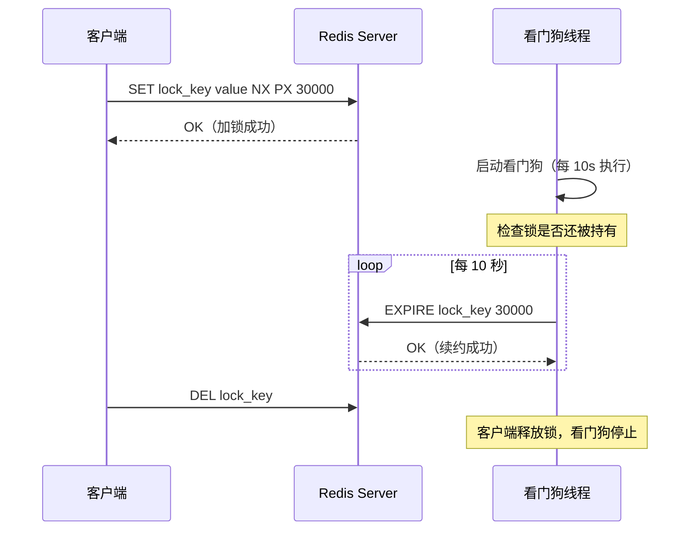
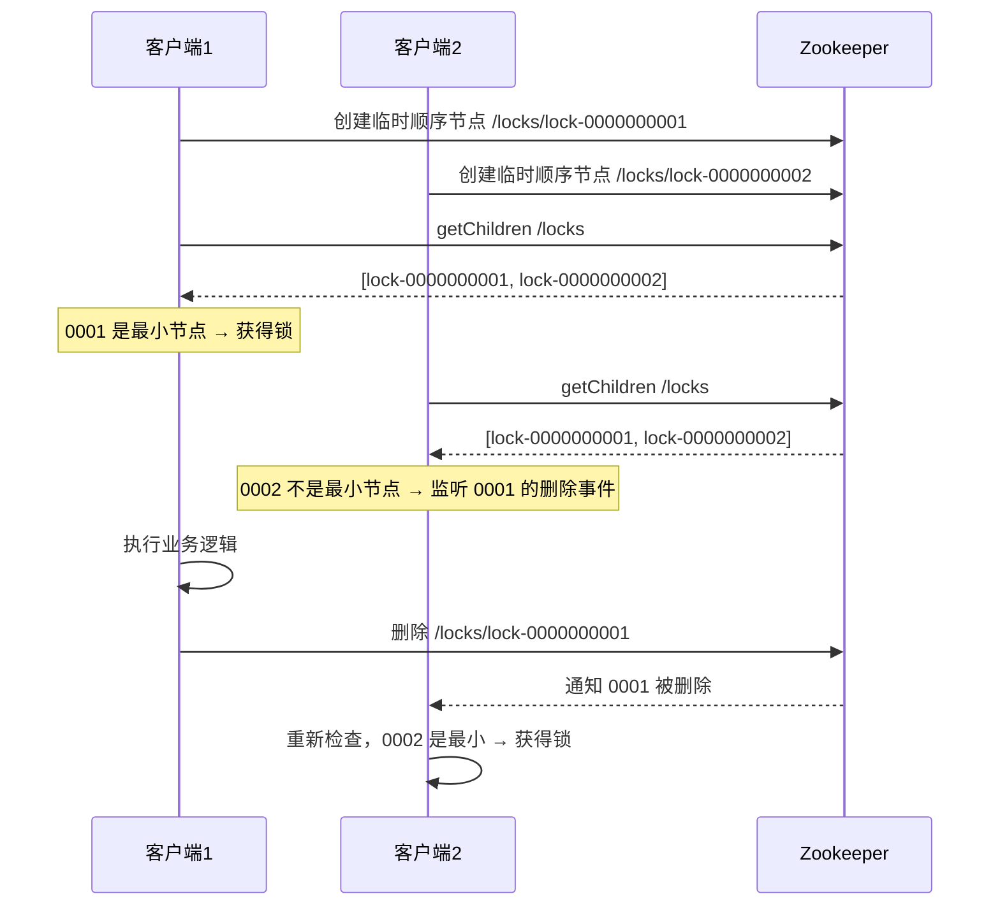
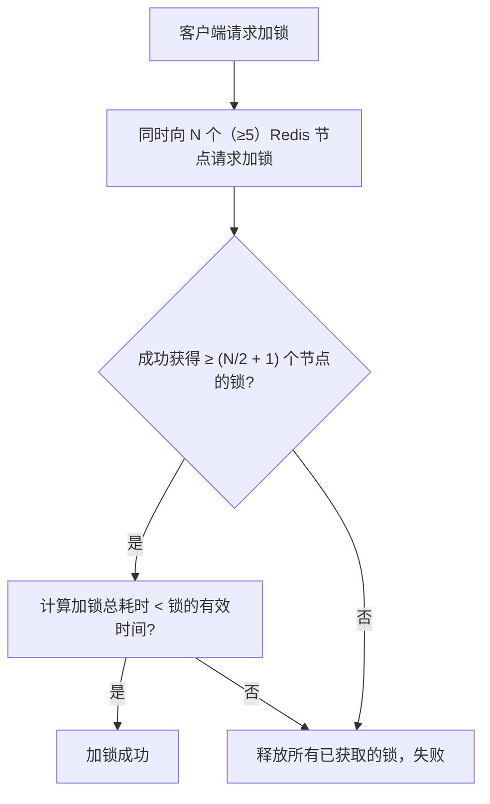
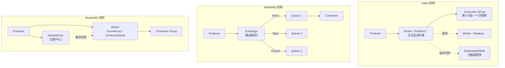
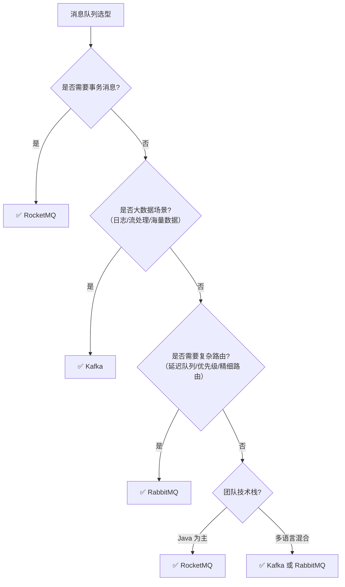
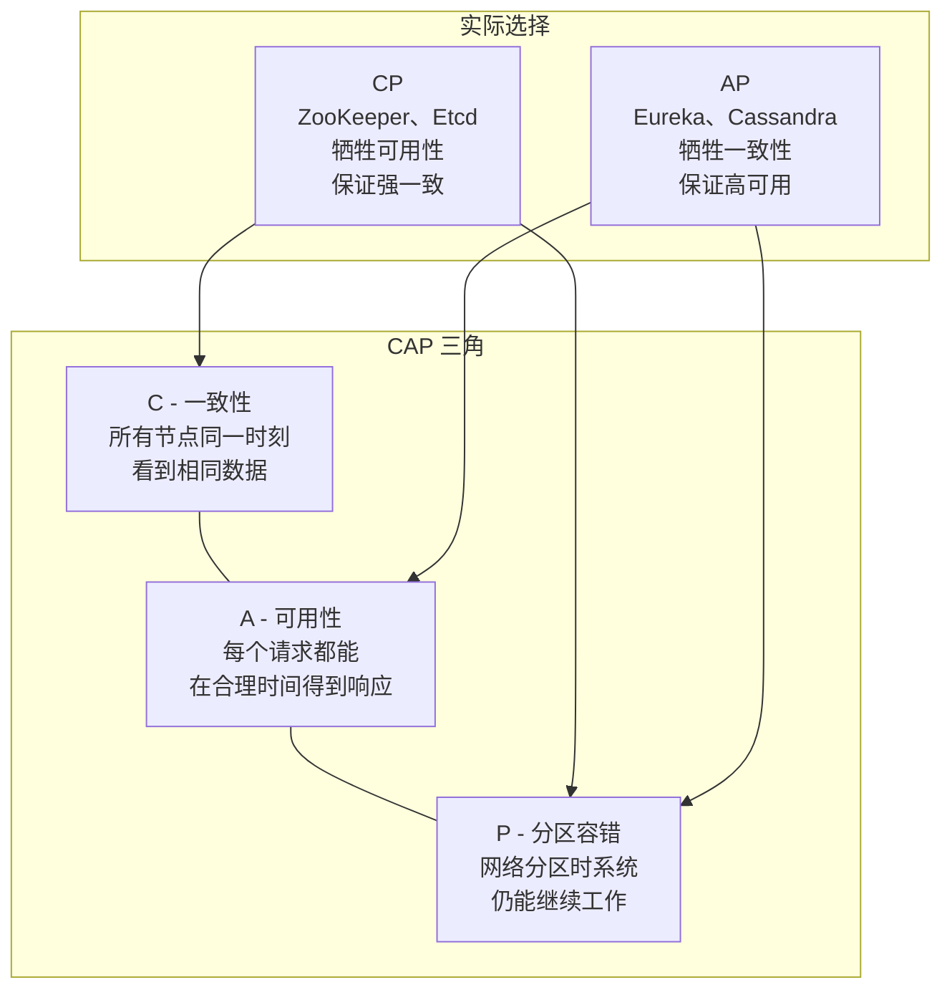
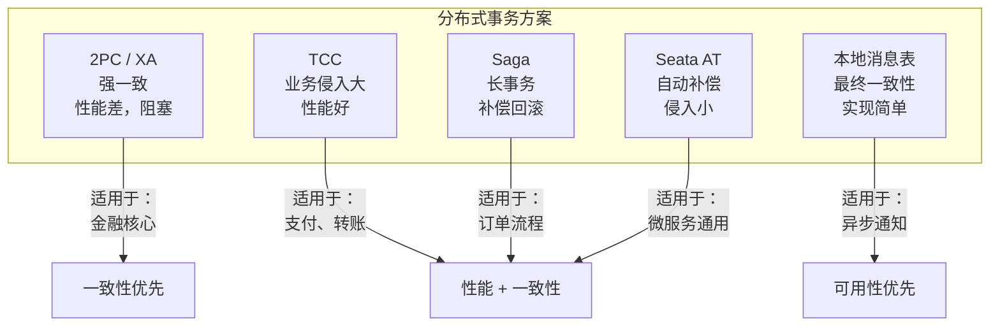

# 分布式面试题

> 持续更新中 | 最后更新：2026-04-02

---

## ⭐⭐⭐ 分布式锁实现：Redis vs Zookeeper 对比选型

**简要回答：** 分布式锁用于在分布式环境下保证同一资源同一时刻只有一个客户端可以访问。主流实现有 Redis（SETNX + Lua 脚本）和 Zookeeper（临时顺序节点），两者各有优劣：Redis 性能高但可靠性略低，Zookeeper 可靠性高但性能较低。

**深度分析：**

### Redis 分布式锁

#### 基础实现（Redisson）

```java
// Redisson 分布式锁使用
@Autowired
private RedissonClient redissonClient;

public void deductStock(Long productId) {
    RLock lock = redissonClient.getLock("lock:stock:" + productId);
    try {
        // 尝试加锁：等待 5 秒，锁持有 30 秒自动释放
        if (lock.tryLock(5, 30, TimeUnit.SECONDS)) {
            try {
                // 查询库存
                int stock = stockMapper.getStock(productId);
                if (stock > 0) {
                    stockMapper.deduct(productId);
                }
            } finally {
                lock.unlock();
            }
        } else {
            throw new BusinessException("获取锁失败，请稍后重试");
        }
    } catch (InterruptedException e) {
        Thread.currentThread().interrupt();
    }
}
```

#### Redisson 看门狗机制



```java
// Redisson 看门狗原理（简化版）
// 锁默认 30 秒过期，看门狗每 10 秒续约一次（30/3=10）
// 如果客户端宕机，看门狗停止续约，锁 30 秒后自动释放
// 注意：必须使用 lock.lock() 或 lock.tryLock() 无 timeout 参数才启用看门狗
```

#### Redis 分布式锁的 Lua 脚本保证原子性

```lua
-- 加锁脚本
if redis.call('setnx', KEYS[1], ARGV[1]) == 1 then
    redis.call('expire', KEYS[1], ARGV[2])
    return 1
else
    return 0
end

-- 释放锁脚本（防止释放别人的锁）
if redis.call('get', KEYS[1]) == ARGV[1] then
    return redis.call('del', KEYS[1])
else
    return 0
end
```

### Zookeeper 分布式锁

```java
// Curator 实现 Zookeeper 分布式锁
@Autowired
private CuratorFramework curatorFramework;

public void deductStock(Long productId) {
    InterProcessMutex lock = new InterProcessMutex(
        curatorFramework, "/locks/stock/" + productId);
    try {
        if (lock.acquire(5, TimeUnit.SECONDS)) {
            try {
                int stock = stockMapper.getStock(productId);
                if (stock > 0) {
                    stockMapper.deduct(productId);
                }
            } finally {
                lock.release();
            }
        }
    } catch (Exception e) {
        throw new RuntimeException("获取锁失败", e);
    }
}
```

#### Zookeeper 锁原理（临时顺序节点）



### 对比选型

| 维度 | Redis 分布式锁 | Zookeeper 分布式锁 |
|------|---------------|-------------------|
| **性能** | 高（单线程处理，10万+ QPS） | 较低（写需要走 Leader，几万 QPS） |
| **可靠性** | 较低（主从切换可能丢锁） | 高（CP 模型，强一致性） |
| **实现复杂度** | 中（需要 Lua 脚本 + 看门狗） | 中（Curator 封装好） |
| **锁释放** | 过期自动释放 + 主动释放 | 客户端宕机自动释放（临时节点） |
| **公平性** | 非公平（抢锁） | 公平（顺序节点排队） |
| **可用性** | AP 模型 | CP 模型 |
| **适用场景** | 高并发、允许少量不一致 | 金融、支付等强一致场景 |

### RedLock 算法



> **注意：** RedLock 算法由 Redis 作者 Antirez 提出，但被分布式专家 Martin Kleppmann 质疑（时钟漂移、GC 停顿等问题）。生产环境推荐使用 Redisson 的单实例锁 + 看门狗，或直接用 Zookeeper。

:::tip 实践建议
- 大多数业务场景用 **Redis（Redisson）** 就够了，性能好、使用简单
- 金融、支付等强一致性场景用 **Zookeeper（Curator）**
- 锁的粒度尽量细，避免锁住大范围资源
- 锁一定要设超时时间，防止死锁
- 避免在锁内做耗时操作（如 RPC 调用）
- 考虑锁的可重入性（Redisson 支持）

```java
// 最佳实践：锁 + 幂等 + 重试
public boolean deductStock(Long productId, String requestId) {
    // 1. 幂等检查（防止重复扣减）
    if (deductRecordMapper.existsByRequestId(requestId)) {
        return true;
    }
    
    RLock lock = redissonClient.getLock("lock:stock:" + productId);
    try {
        if (lock.tryLock(3, 10, TimeUnit.SECONDS)) {
            try {
                // 2. 再次幂等检查（双重检查）
                if (deductRecordMapper.existsByRequestId(requestId)) {
                    return true;
                }
                // 3. 业务逻辑
                int stock = stockMapper.getStock(productId);
                if (stock > 0) {
                    stockMapper.deduct(productId);
                    deductRecordMapper.insert(requestId, productId);
                    return true;
                }
                return false;
            } finally {
                lock.unlock();
            }
        }
        return false;
    } catch (InterruptedException e) {
        Thread.currentThread().interrupt();
        return false;
    }
}
```
:::

:::danger 面试追问
- Redis 主从切换时锁会丢失吗？→ 会。客户端 A 在 Master 加锁，Master 还没同步到 Slave 就宕机了，Slave 升级为 Master 后没有锁信息，客户端 B 可以加锁成功
- Zookeeper 的临时节点和持久节点有什么区别？→ 临时节点在客户端会话结束时自动删除，持久节点需要手动删除。分布式锁用临时顺序节点
- Redisson 的公平锁是怎么实现的？→ 基于 Redis 的 List 结构实现等待队列，按请求顺序排队
- 如何实现分布式锁的可重入？→ Redisson 使用 Hash 结构记录加锁次数，每次加锁计数 +1，解锁计数 -1，为 0 时真正释放
- 分布式锁和数据库乐观锁怎么选？→ 乐观锁适合冲突少的场景（通过 version 字段），分布式锁适合冲突多的场景
:::

---

## ⭐⭐ 消息队列选型：Kafka vs RabbitMQ vs RocketMQ

**简要回答：** Kafka 适合大数据量、高吞吐的日志和流处理场景；RabbitMQ 适合低延迟、复杂路由的企业级消息场景；RocketMQ 适合电商、金融等需要事务消息和顺序消息的场景。选型核心看业务需求：吞吐量优先选 Kafka，可靠性优先选 RabbitMQ，事务消息选 RocketMQ。

**深度分析：**

### 三大 MQ 对比

| 维度 | Kafka | RabbitMQ | RocketMQ |
|------|-------|----------|----------|
| **语言** | Scala/Java | Erlang | Java |
| **单机吞吐量** | 10万+ 级 | 万级 | 10万级 |
| **延迟** | ms 级 | μs 级 | ms 级 |
| **消息可靠性** | 高（副本机制） | 高（确认机制） | 高（同步刷盘） |
| **事务消息** | ❌ 不支持 | ❌ 不支持 | ✅ 支持 |
| **顺序消息** | ✅ 分区内有序 | ❌ 不保证 | ✅ 严格有序 |
| **消息回溯** | ✅ 支持 offset 回溯 | ❌ 消费后删除 | ✅ 支持时间回溯 |
| **消息堆积** | ✅ 支持 TB 级 | ❌ 内存堆积有上限 | ✅ 支持 |
| **生态** | 大数据生态完善 | 企业级集成丰富 | 阿里生态 |
| **适用场景** | 日志、大数据、流处理 | 业务消息、RPC | 电商、金融、订单 |

### 架构对比



### Kafka 适用场景

```java
// Kafka 生产者示例
@Configuration
public class KafkaConfig {
    
    @Bean
    public Producer<String, String> kafkaProducer() {
        Properties props = new Properties();
        props.put(ProducerConfig.BOOTSTRAP_SERVERS_CONFIG, "localhost:9092");
        props.put(ProducerConfig.KEY_SERIALIZER_CLASS_CONFIG, StringSerializer.class);
        props.put(ProducerConfig.VALUE_SERIALIZER_CLASS_CONFIG, StringSerializer.class);
        // 可靠性配置
        props.put(ProducerConfig.ACKS_CONFIG, "all");          // 所有副本确认
        props.put(ProducerConfig.RETRIES_CONFIG, 3);            // 重试次数
        props.put(ProducerConfig.ENABLE_IDEMPOTENCE_CONFIG, true); // 幂等
        return new KafkaProducer<>(props);
    }
}

// Kafka 典型场景：日志收集、用户行为追踪、实时数仓
```

**Kafka 优势：**
- 超高吞吐量：顺序写磁盘 + 零拷贝 + 批量发送
- 持久化存储：消息存储在磁盘，支持长期保留
- 水平扩展：增加 Partition 提升并发
- 大数据生态集成：Spark、Flink、Kafka Streams

### RabbitMQ 适用场景

```java
// RabbitMQ 延迟消息（死信队列实现）
@Configuration
public class RabbitMQConfig {
    
    // 业务队列
    @Bean
    public Queue orderQueue() {
        return QueueBuilder.durable("order.queue").build();
    }
    
    // 死信队列（延迟消息）
    @Bean
    public Queue deadLetterQueue() {
        return QueueBuilder.durable("order.dead.queue").build();
    }
    
    // 交换器
    @Bean
    public DirectExchange orderExchange() {
        return new DirectExchange("order.exchange");
    }
    
    // 业务队列绑定死信交换器
    @Bean
    public Queue orderQueueWithDLX() {
        Map<String, Object> args = new HashMap<>();
        args.put("x-dead-letter-exchange", "dlx.exchange");  // 死信交换器
        args.put("x-dead-letter-routing-key", "order.dead");
        args.put("x-message-ttl", 30000);  // 30秒过期转死信
        return QueueBuilder.durable("order.delay.queue").withArguments(args).build();
    }
}
```

**RabbitMQ 优势：**
- 低延迟：μs 级消息投递
- 丰富路由：Direct、Topic、Fanout、Headers
- 灵活的消息模型：延迟队列、优先级队列、死信队列
- 高可靠性：消息确认、持久化、镜像队列

### RocketMQ 适用场景

```java
// RocketMQ 事务消息（电商下单场景）
@Component
public class OrderTransactionProducer {
    
    @Autowired
    private RocketMQTemplate rocketMQTemplate;
    
    public void createOrder(Order order) {
        // 发送半消息（消费者暂时不可见）
        rocketMQTemplate.sendMessageInTransaction(
            "order-topic",
            MessageBuilder.withPayload(JSON.toJSONString(order)).build(),
            order
        );
    }
    
    // 本地事务执行器
    @RocketMQTransactionListener
    public class OrderTransactionListener implements RocketMQLocalTransactionListener {
        
        @Override
        public RocketMQLocalTransactionState executeLocalTransaction(Message msg, Object arg) {
            try {
                Order order = (Order) arg;
                orderMapper.insert(order);  // 执行本地事务
                return RocketMQLocalTransactionState.COMMIT;
            } catch (Exception e) {
                return RocketMQLocalTransactionState.ROLLBACK;
            }
        }
        
        @Override
        public RocketMQLocalTransactionState checkLocalTransaction(Message msg) {
            // 事务回查：MQ 多次未收到确认时调用
            String orderId = (String) msg.getHeaders().get("orderId");
            Order order = orderMapper.selectById(orderId);
            if (order != null) {
                return RocketMQLocalTransactionState.COMMIT;
            }
            return RocketMQLocalTransactionState.UNKNOWN;
        }
    }
}
```

**RocketMQ 优势：**
- 事务消息：分布式事务的最佳实践
- 顺序消息：同一订单的消息顺序消费
- 消息回溯：按时间重新消费
- 延迟消息：18 个固定延迟级别

### 选型决策树



:::tip 实践建议
- **中小项目**：RabbitMQ，上手快、功能全、社区好
- **大数据项目**：Kafka，吞吐量无敌、生态完善
- **电商/金融项目**：RocketMQ，事务消息是刚需
- 消息队列是"终极武器"，不要为了用而用。简单场景用 Redis 队列就够了
- 生产环境务必配置：消息确认、重试、死信队列、监控告警

```java
// 通用最佳实践
// 1. 消息生产者：设置唯一消息 ID（幂等）
// 2. 消息消费者：先处理业务再确认（防止消息丢失）
// 3. 消息幂等：用 messageId 去重
// 4. 消息积压：增加消费者数量 + 临时扩容 + 紧急消费程序
```
:::

:::danger 面试追问
- Kafka 如何保证消息不丢失？→ Producer acks=all + Broker min.insync.replicas=2 + Consumer 手动提交 offset
- 如何处理消息积压？→ 临时增加 Partition 和 Consumer、写程序快速消费到新 Topic、消费端优化处理逻辑
- RabbitMQ 如何保证消息顺序消费？→ 单 Queue 单 Consumer 或使用 Consistent Hashing Exchange
- RocketMQ 事务消息的原理？→ 半消息 → 执行本地事务 → 提交/回滚 → 回查机制
- Kafka 的零拷贝原理？→ sendfile 系统调用，数据从磁盘直接到网卡，跳过用户空间
:::

---


---

## ⭐ CAP 理论是什么？怎么理解？

**简要回答：** CAP 定理指出分布式系统无法同时满足一致性（Consistency）、可用性（Availability）、分区容错性（Partition tolerance）三个保证，最多只能满足其中两个。由于网络分区不可避免，实际选择是 CP 或 AP。

**深度分析：**



| | CP 系统 | AP 系统 |
|--|--------|--------|
| 网络分区时 | 拒绝服务或超时 | 返回旧数据 |
| 代表 | ZooKeeper、Etcd、HBase | Eureka、Cassandra、DynamoDB |
| 适用场景 | 金融、配置中心 | 缓存、社交、搜索 |

:::warning CAP 的常见误区
1. **CAP 是三者择二，不是三者选一**：P 是必选项（网络分区必然存在），所以实际是 CP 或 AP
2. **不是绝对的 0 和 1**：BASE 理论（Basically Available、Soft State、Eventually Consistent）是 AP 的实践
3. **不要滥用 CAP**：如果系统不需要分布式（单机），CAP 不适用
:::

---

## ⭐ 分布式事务有哪些解决方案？

**简要回答：** 常见方案：2PC（强一致但阻塞）、TCC（Try-Confirm-Cancel，柔性事务）、Saga（长事务编排）、本地消息表 + MQ（最终一致性）、Seata（阿里开源，支持 AT/TCC/Saga/XA 四种模式）。

**深度分析：**



| 方案 | 一致性 | 性能 | 复杂度 | 侵入性 |
|------|--------|------|--------|--------|
| 2PC/XA | 强一致 | 低（同步阻塞） | 低 | 低（数据库层面） |
| TCC | 最终一致 | 高 | 高（三个方法） | 高（业务代码） |
| Saga | 最终一致 | 高 | 中（编排/协调） | 中 |
| 本地消息表 | 最终一致 | 高 | 低 | 低 |
| Seata AT | 最终一致 | 中 | 低 | 低（自动代理） |

:::tip 面试追问
- **2PC 的协调者单点问题**：协调者宕机会导致参与者一直锁定资源。3PC 增加了超时机制但仍有问题
- **Seata AT 模式原理**：一阶段记录 undo_log（数据快照），二阶段异步清理；回滚时用 undo_log 恢复
- **幂等性**：分布式事务中 retry 是常态，下游接口必须保证幂等（唯一请求ID去重）
:::

---

## ⭐ 如何保证接口的幂等性？

**简要回答：** 幂等性指多次调用结果和一次调用相同。常见方案：唯一索引、Token 机制、乐观锁（版本号）、分布式锁、状态机。

**深度分析：**

```java
// 方案1：唯一索引（数据库层去重）
CREATE UNIQUE INDEX uk_order_no ON orders(order_no);
// 重复插入会抛 DuplicateKeyException，捕获后查询返回

// 方案2：Token 机制（提交前先获取 Token）
// 1. 前端请求 /api/token 获取 token
// 2. 提交表单时带上 token
// 3. 后端删除 token（原子操作），删除成功 = 首次提交
@PostMapping("/order")
public Result createOrder(@RequestParam String token) {
    boolean deleted = redisTemplate.delete("idempotent:" + token);
    if (!deleted) return Result.fail("请勿重复提交");
    // 处理业务...
}

// 方案3：乐观锁（版本号）
UPDATE account SET balance = balance - 100, version = version + 1
WHERE id = 1 AND version = 5;  // 版本不匹配则更新失败

// 方案4：状态机（订单状态只能单向流转）
UPDATE orders SET status = 'PAID' WHERE id = 1 AND status = 'UNPAID';
// 已支付的订单再次更新会匹配 0 行

// 方案5：分布式锁
String lockKey = "order:" + orderId;
RLock lock = redisson.getLock(lockKey);
if (lock.tryLock(5, 30, TimeUnit.SECONDS)) {
    try { /* 处理业务 */ } finally { lock.unlock(); }
}
```

| 方案 | 适用场景 | 优点 | 缺点 |
|------|----------|------|------|
| 唯一索引 | 插入去重 | 数据库保证，最可靠 | 依赖数据库，已存在数据不适用 |
| Token 机制 | 表单提交 | 简单有效 | 需要额外接口获取 Token |
| 乐观锁 | 更新操作 | 无锁，并发性能好 | 只适用于更新场景 |
| 状态机 | 业务状态流转 | 符合业务语义 | 状态设计要合理 |
| 分布式锁 | 通用场景 | 灵活 | 引入外部组件，性能损耗 |

