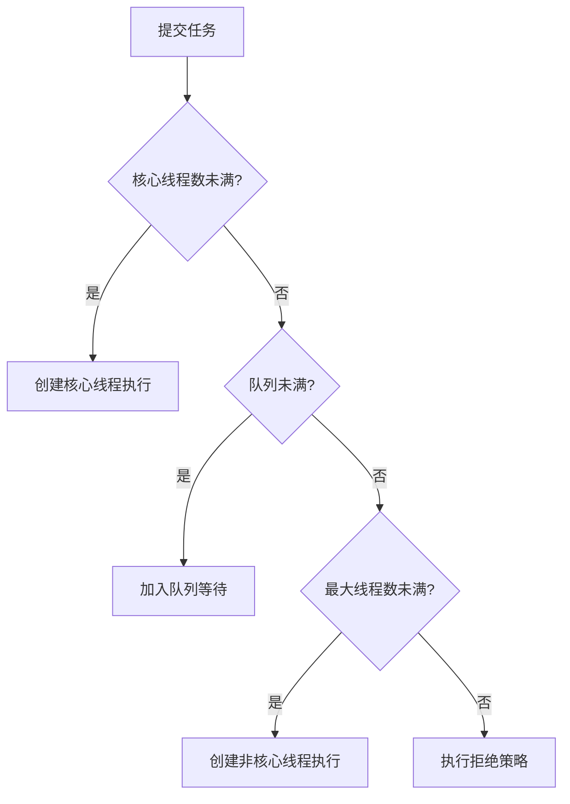

# Java 基础面试题

> 持续更新中 | 最后更新：2026-04-01

---

## ⭐ HashMap 的底层实现原理？

**简要回答：** JDK 8 中 HashMap 由数组 + 链表 + 红黑树组成。通过 hash 值定位数组下标，链表长度超过 8 且数组长度 ≥ 64 时转为红黑树。

**深度分析：**

```java
// 核心数据结构
transient Node<K,V>[] table;

// put 流程
1. 计算 hash: (h = key.hashCode()) ^ (h >>> 16)  // 高16位异或低16位，减少碰撞
2. 定位桶: index = (n - 1) & hash
3. 桶为空 → 直接放入
4. 桶非空 → 遍历链表
   - key 已存在 → 更新 value
   - 链表长度 < 8 → 尾插法
   - 链表长度 ≥ 8 且 table.length ≥ 64 → treeifyBin 转红黑树
   - table.length < 64 → resize 扩容
```

**关键细节：**

| 特性 | JDK 7 | JDK 8 |
|------|-------|-------|
| 数据结构 | 数组 + 链表 | 数组 + 链表 + 红黑树 |
| 插入方式 | 头插法（多线程环形链表） | 尾插法 |
| 扩容时机 | size > threshold | 同左 |
| 扩容后位置 | 重新 hash | 原位置 或 原位置 + oldCap |

**为什么容量是 2 的幂？**
- `index = hash & (n - 1)` 等价于 `hash % n`，但位运算更快
- 扩容时元素要么留在原位，要么移动到 `原位置 + oldCap`，方便迁移

:::danger 面试追问
- HashMap 为什么线程不安全？→ put/resize 并发时数据丢失、环形链表（JDK7）
- ConcurrentHashMap 怎么实现的？→ JDK7 Segment + ReentrantLock，JDK8 CAS + synchronized
- hash 碰撞怎么办？→ 链表 → 红黑树 → 再扩容
:::

---

## ⭐ ConcurrentHashMap 的实现原理？

**简要回答：** JDK 8 使用 CAS + synchronized 实现细粒度锁，锁住的是链表/红黑树的头节点，并发性能远优于 JDK 7 的 Segment 分段锁。

**深度分析：**

```
put 流程：
1. 计算 hash 定位桶
2. 桶为空 → CAS 自旋写入
3. 桶处于扩容状态 → helpTransfer 协助扩容
4. 桶非空 → synchronized 锁住头节点
   - 遍历链表/红黑树，找到则更新，找不到则追加
5. addCount → 判断是否需要扩容
```

**与 JDK 7 对比：**

| 维度 | JDK 7 | JDK 8 |
|------|-------|-------|
| 锁粒度 | Segment（默认16个） | 桶级别（首节点） |
| 锁机制 | ReentrantLock | CAS + synchronized |
| 并发级别 | 固定 16 | 与桶数量一致 |
| 数据结构 | 数组 + 链表 | 数组 + 链表 + 红黑树 |

---

## ⭐ 线程池的核心参数与拒绝策略？

**简要回答：** 7 个核心参数：corePoolSize、maximumPoolSize、keepAliveTime、unit、workQueue、threadFactory、handler。4 种拒绝策略。

**深度分析：**

```java
public ThreadPoolExecutor(
    int corePoolSize,      // 核心线程数
    int maximumPoolSize,   // 最大线程数
    long keepAliveTime,    // 空闲线程存活时间
    TimeUnit unit,         // 时间单位
    BlockingQueue<Runnable> workQueue,  // 任务队列
    ThreadFactory threadFactory,        // 线程工厂
    RejectedExecutionHandler handler    // 拒绝策略
)
```

**任务提交执行顺序：**



**4 种拒绝策略：**

| 策略 | 行为 | 适用场景 |
|------|------|----------|
| AbortPolicy | 抛 RejectedExecutionException | 默认，需要感知失败 |
| CallerRunsPolicy | 提交线程自己执行 | 不丢失任务，适合非异步场景 |
| DiscardPolicy | 静默丢弃 | 可容忍丢失 |
| DiscardOldestPolicy | 丢弃队列最老任务 | 优先处理新任务 |

:::tip 实践建议
- CPU 密集型：corePoolSize = CPU 核数 + 1
- IO 密集型：corePoolSize = CPU 核数 × 2（或更多）
- **禁止使用 Executors 创建线程池**（无界队列可能导致 OOM）
:::

---

## ⭐ volatile 关键字的作用？

**简要回答：** 保证可见性 + 禁止指令重排序，但不保证原子性。

**深度分析：**

```java
// 可见性示例
private volatile boolean flag = false;

// 线程A
flag = true;  // 立刻对其他线程可见

// 线程B
while (!flag) { ... }  // 能感知到变化

// 典型用途：DCL 双重检查锁
private static volatile Singleton instance;

public static Singleton getInstance() {
    if (instance == null) {                    // 第一次检查
        synchronized (Singleton.class) {
            if (instance == null) {            // 第二次检查
                instance = new Singleton();    // volatile 防止指令重排
            }
        }
    }
    return instance;
}
```

**为什么不保证原子性？**

```java
volatile int count = 0;

// 两个线程同时执行 count++，实际是 3 步操作：
// 1. 读取 count 值
// 2. 加 1
// 3. 写回 count
// volatile 只保证读/写本身可见，不保证复合操作的原子性
```

**底层原理：** 使用内存屏障（Memory Barrier），JVM 层面对应 `lock` 前缀指令 + 缓存一致性协议（MESI）。

---

## ⭐ Java 中 == 和 equals 的区别？

**简要回答：** `==` 比较引用地址（基本类型比较值），`equals` 比较内容（需要重写，默认行为同 `==`）。

**深度分析：**

```java
String s1 = new String("hello");
String s2 = new String("hello");
String s3 = "hello";
String s4 = "hello";

s1 == s2;     // false（不同对象）
s1.equals(s2); // true（内容相同）
s3 == s4;     // true（字符串常量池）
s1 == s3;     // false（堆 vs 常量池）
```

**equals 的规范（来自 Object）：**
- 自反性：x.equals(x) = true
- 对称性：x.equals(y) = y.equals(x)
- 传递性：x.equals(y) && y.equals(z) → x.equals(z)
- 一致性：多次调用结果一致
- x.equals(null) = false

**重写 equals 必须重写 hashCode**，否则在 HashMap/HashSet 中会出问题。

:::danger 面试追问
- String 的 hashCode 怎么算的？→ `s[0]*31^(n-1) + s[1]*31^(n-2) + ... + s[n-1]`，为什么选 31？→ 31 是奇素数，`31 * i = (i << 5) - i` 位运算高效
:::


---

## ⭐ ThreadLocal 的原理是什么？为什么会发生内存泄漏？怎么避免？

**简要回答：** ThreadLocal 通过每个线程维护一个 `ThreadLocalMap`（key 是 ThreadLocal 的弱引用，value 是强引用）实现线程隔离。内存泄漏发生在 ThreadLocal 外部强引用被置 null 后，key 被 GC 回收变成 null，但 value 仍然强引用存在无法回收。解决方案是使用后调用 `remove()`。

**深度分析：**

```
ThreadLocal 内存模型：

Thread 对象
├── ThreadLocalMap threadLocals
│   ├── Entry[0]: key(WeakReference) → ThreadLocal@A, value → Object (强引用)
│   ├── Entry[1]: key(WeakReference) → ThreadLocal@B, value → Object (强引用)
│   └── Entry[n]: key(null)           → value → Object (强引用) ⚠️ 泄漏！
│
└── ThreadLocalMap inheritableThreadLocals

内存泄漏过程：
1. ThreadLocal ref 被置为 null（外部强引用断开）
2. ThreadLocalMap 中 key 是 WeakReference → GC 时 key 被回收，变成 null
3. value 仍然是强引用 → 无法被 GC → 内存泄漏
4. 线程长期存活（如线程池）→ 泄漏的 value 一直占用内存
```

```java
// ThreadLocal 核心源码
public class ThreadLocal<T> {
    public void set(T value) {
        Thread t = Thread.currentThread();
        ThreadLocalMap map = t.threadLocals;
        if (map != null) {
            map.set(this, value);  // this 作为 key
        } else {
            createMap(t, value);   // 首次使用创建 ThreadLocalMap
        }
    }

    public T get() {
        Thread t = Thread.currentThread();
        ThreadLocalMap map = t.threadLocals;
        if (map != null) {
            Entry e = map.getEntry(this);
            if (e != null) return (T) e.value;
        }
        return setInitialValue();  // 返回 initialValue() 的值
    }

    public void remove() {
        ThreadLocalMap m = Thread.currentThread().threadLocals;
        if (m != null) m.remove(this);  // ✅ 手动清理
    }
}

// ThreadLocalMap.Entry — WeakReference
static class Entry extends WeakReference<ThreadLocal<?>> {
    Object value;  // 强引用
    Entry(ThreadLocal<?> k, Object v) {
        super(k);  // key 是弱引用
        value = v;  // value 是强引用
    }
}
```

**为什么 key 设计为弱引用？**
- 如果 key 是强引用，ThreadLocal 对象永远不会被回收（即使外部已置 null）
- 弱引用保证 ThreadLocal 对象能被 GC 回收，但引入了 value 泄漏问题
- 这是权衡设计：key 泄漏比 key+value 都泄漏要好

**最佳实践：**

```java
// ❌ 错误写法
public void process() {
    threadLocal.set(new SimpleDateFormat("yyyy-MM-dd"));
    // ... 使用
    // 忘记 remove → 线程池场景下 value 泄漏
}

// ✅ 正确写法：try-finally 保证 remove
public void process() {
    try {
        threadLocal.set(userContext);
        // ... 业务逻辑
    } finally {
        threadLocal.remove();  // 必须！
    }
}
```

**关键细节：**

| 特性 | 说明 |
|------|------|
| 存储位置 | 每个线程的 ThreadLocalMap，非 ThreadLocal 本身 |
| key 类型 | WeakReference（ThreadLocal 对象） |
| value 类型 | 强引用（实际存储的对象） |
| 泄漏条件 | ThreadLocal 被回收 + 线程长期存活 + 未调用 remove |
| 预防措施 | 每次 use 后 finally 中调用 remove() |

:::danger 面试追问
- InheritableThreadLocal 是什么？→ 子线程可以继承父线程的 ThreadLocal 值，但线程池中父子线程关系不确定，推荐使用 Alibaba TTL（TransmittableThreadLocal）
- 线程池场景下 ThreadLocal 有什么坑？→ 线程被复用，上一次的 ThreadLocal 值会被带到下一次任务，必须在 finally 中 remove
- Spring 中哪里用到了 ThreadLocal？→ RequestContextHolder（保存当前请求）、TransactionSynchronizationManager（事务资源绑定）、@Scope("request")
:::
