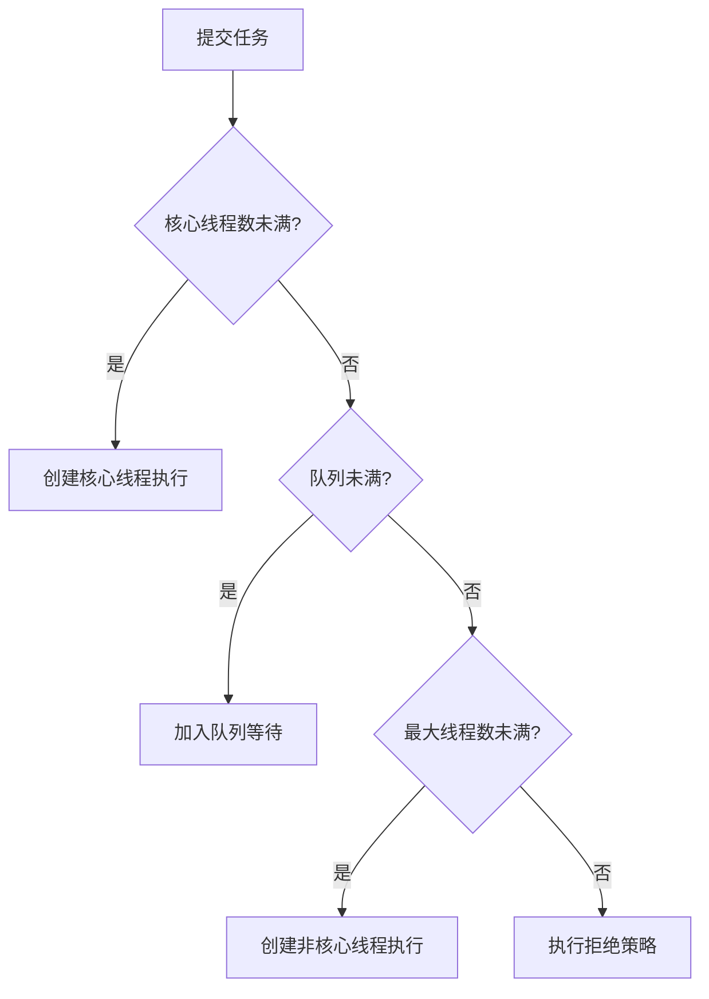
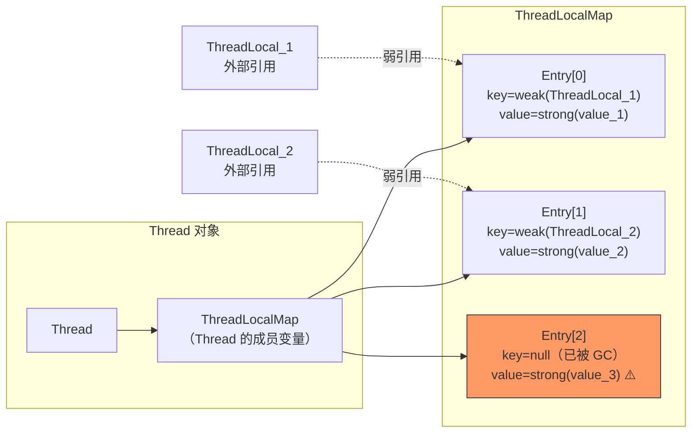
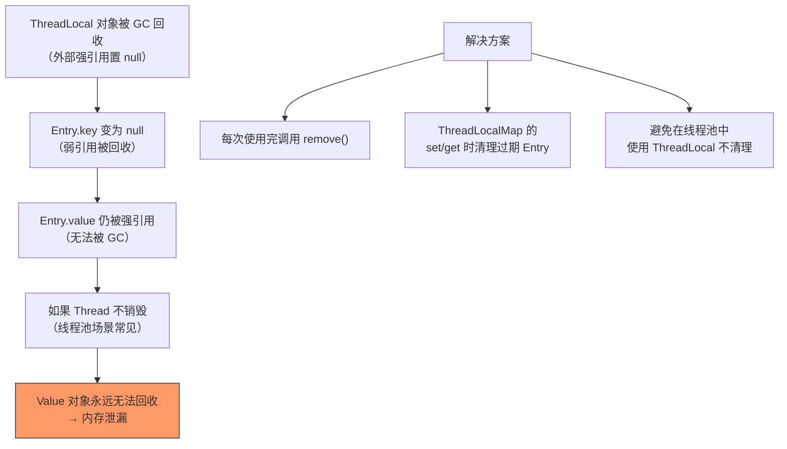

# Java 基础面试题

> 持续更新中 | 最后更新：2026-04-02

---

## ⭐ HashMap 的底层实现原理？

**简要回答：** JDK 8 中 HashMap 由数组 + 链表 + 红黑树组成。通过 hash 值定位数组下标，链表长度超过 8 且数组长度 ≥ 64 时转为红黑树。

**深度分析：**

```java
// 核心数据结构
transient Node<K,V>[] table;

// put 流程
1. 计算 hash: (h = key.hashCode()) ^ (h >>> 16)  // 高16位异或低16位，减少碰撞
2. 定位桶: index = (n - 1) & hash
3. 桶为空 → 直接放入
4. 桶非空 → 遍历链表
   - key 已存在 → 更新 value
   - 链表长度 < 8 → 尾插法
   - 链表长度 ≥ 8 且 table.length ≥ 64 → treeifyBin 转红黑树
   - table.length < 64 → resize 扩容
```

**关键细节：**

| 特性 | JDK 7 | JDK 8 |
|------|-------|-------|
| 数据结构 | 数组 + 链表 | 数组 + 链表 + 红黑树 |
| 插入方式 | 头插法（多线程环形链表） | 尾插法 |
| 扩容时机 | size > threshold | 同左 |
| 扩容后位置 | 重新 hash | 原位置 或 原位置 + oldCap |

**为什么容量是 2 的幂？**
- `index = hash & (n - 1)` 等价于 `hash % n`，但位运算更快
- 扩容时元素要么留在原位，要么移动到 `原位置 + oldCap`，方便迁移

:::danger 面试追问
- HashMap 为什么线程不安全？→ put/resize 并发时数据丢失、环形链表（JDK7）
- ConcurrentHashMap 怎么实现的？→ JDK7 Segment + ReentrantLock，JDK8 CAS + synchronized
- hash 碰撞怎么办？→ 链表 → 红黑树 → 再扩容
:::

---

## ⭐ ConcurrentHashMap 的实现原理？

**简要回答：** JDK 8 使用 CAS + synchronized 实现细粒度锁，锁住的是链表/红黑树的头节点，并发性能远优于 JDK 7 的 Segment 分段锁。

**深度分析：**

```
put 流程：
1. 计算 hash 定位桶
2. 桶为空 → CAS 自旋写入
3. 桶处于扩容状态 → helpTransfer 协助扩容
4. 桶非空 → synchronized 锁住头节点
   - 遍历链表/红黑树，找到则更新，找不到则追加
5. addCount → 判断是否需要扩容
```

**与 JDK 7 对比：**

| 维度 | JDK 7 | JDK 8 |
|------|-------|-------|
| 锁粒度 | Segment（默认16个） | 桶级别（首节点） |
| 锁机制 | ReentrantLock | CAS + synchronized |
| 并发级别 | 固定 16 | 与桶数量一致 |
| 数据结构 | 数组 + 链表 | 数组 + 链表 + 红黑树 |

---

## ⭐ 线程池的核心参数与拒绝策略？

**简要回答：** 7 个核心参数：corePoolSize、maximumPoolSize、keepAliveTime、unit、workQueue、threadFactory、handler。4 种拒绝策略。

**深度分析：**

```java
public ThreadPoolExecutor(
    int corePoolSize,      // 核心线程数
    int maximumPoolSize,   // 最大线程数
    long keepAliveTime,    // 空闲线程存活时间
    TimeUnit unit,         // 时间单位
    BlockingQueue<Runnable> workQueue,  // 任务队列
    ThreadFactory threadFactory,        // 线程工厂
    RejectedExecutionHandler handler    // 拒绝策略
)
```

**任务提交执行顺序：**



**4 种拒绝策略：**

| 策略 | 行为 | 适用场景 |
|------|------|----------|
| AbortPolicy | 抛 RejectedExecutionException | 默认，需要感知失败 |
| CallerRunsPolicy | 提交线程自己执行 | 不丢失任务，适合非异步场景 |
| DiscardPolicy | 静默丢弃 | 可容忍丢失 |
| DiscardOldestPolicy | 丢弃队列最老任务 | 优先处理新任务 |

:::tip 实践建议
- CPU 密集型：corePoolSize = CPU 核数 + 1
- IO 密集型：corePoolSize = CPU 核数 × 2（或更多）
- **禁止使用 Executors 创建线程池**（无界队列可能导致 OOM）
:::

---

## ⭐ volatile 关键字的作用？

**简要回答：** 保证可见性 + 禁止指令重排序，但不保证原子性。

**深度分析：**

```java
// 可见性示例
private volatile boolean flag = false;

// 线程A
flag = true;  // 立刻对其他线程可见

// 线程B
while (!flag) { ... }  // 能感知到变化

// 典型用途：DCL 双重检查锁
private static volatile Singleton instance;

public static Singleton getInstance() {
    if (instance == null) {                    // 第一次检查
        synchronized (Singleton.class) {
            if (instance == null) {            // 第二次检查
                instance = new Singleton();    // volatile 防止指令重排
            }
        }
    }
    return instance;
}
```

**为什么不保证原子性？**

```java
volatile int count = 0;

// 两个线程同时执行 count++，实际是 3 步操作：
// 1. 读取 count 值
// 2. 加 1
// 3. 写回 count
// volatile 只保证读/写本身可见，不保证复合操作的原子性
```

**底层原理：** 使用内存屏障（Memory Barrier），JVM 层面对应 `lock` 前缀指令 + 缓存一致性协议（MESI）。

---

## ⭐ Java 中 == 和 equals 的区别？

**简要回答：** `==` 比较引用地址（基本类型比较值），`equals` 比较内容（需要重写，默认行为同 `==`）。

**深度分析：**

```java
String s1 = new String("hello");
String s2 = new String("hello");
String s3 = "hello";
String s4 = "hello";

s1 == s2;     // false（不同对象）
s1.equals(s2); // true（内容相同）
s3 == s4;     // true（字符串常量池）
s1 == s3;     // false（堆 vs 常量池）
```

**equals 的规范（来自 Object）：**
- 自反性：x.equals(x) = true
- 对称性：x.equals(y) = y.equals(x)
- 传递性：x.equals(y) && y.equals(z) → x.equals(z)
- 一致性：多次调用结果一致
- x.equals(null) = false

**重写 equals 必须重写 hashCode**，否则在 HashMap/HashSet 中会出问题。

:::danger 面试追问
- String 的 hashCode 怎么算的？→ `s[0]*31^(n-1) + s[1]*31^(n-2) + ... + s[n-1]`，为什么选 31？→ 31 是奇素数，`31 * i = (i << 5) - i` 位运算高效
:::

---

## ⭐⭐⭐ ThreadLocal 原理与内存泄漏

**简要回答：** ThreadLocal 通过每个线程独立的 ThreadLocalMap 存储数据副本，实现线程隔离。内部结构是 ThreadLocalMap（Entry[]），Key 是 ThreadLocal 的弱引用，Value 是强引用。内存泄漏发生在 ThreadLocal 对象被回收后，Key 变为 null 但 Value 仍被 Entry 强引用，导致 Value 无法回收。

**深度分析：**

### 内部结构



```java
// ThreadLocal 内部结构（简化版）
public class ThreadLocal<T> {
    
    // Thread 类中的成员变量
    // ThreadLocal.ThreadLocalMap threadLocals = null;
    
    public void set(T value) {
        Thread t = Thread.currentThread();
        ThreadLocalMap map = t.threadLocals;
        if (map != null) {
            map.set(this, value);  // this（ThreadLocal）作为 key
        } else {
            createMap(t, value);
        }
    }
    
    public T get() {
        Thread t = Thread.currentThread();
        ThreadLocalMap map = t.threadLocals;
        if (map != null) {
            Entry e = map.getEntry(this);
            if (e != null) {
                return (T) e.value;
            }
        }
        return setInitialValue();
    }
    
    public void remove() {
        ThreadLocalMap map = Thread.currentThread().threadLocals;
        if (map != null) {
            map.remove(this);  // 手动清除 Entry
        }
    }
}

// ThreadLocalMap.Entry 继承 WeakReference
static class Entry extends WeakReference<ThreadLocal<?>> {
    Object value;  // 强引用
    
    Entry(ThreadLocal<?> k, Object v) {
        super(k);  // key 是弱引用
        value = v;
    }
}
```

### 内存泄漏原因分析



```
引用链分析：
Thread → ThreadLocalMap → Entry → value（强引用链，无法回收）
                                    ↑
ThreadLocal → Entry.key（弱引用，已被 GC 回收）

泄漏条件：
1. ThreadLocal 外部强引用被置 null
2. Entry.key 被 GC 回收（弱引用）
3. Entry.value 仍被 Thread → ThreadLocalMap → Entry 强引用
4. 线程长期存活（线程池中的线程不会销毁）
```

### 正确使用方式

```java
// ❌ 错误用法：忘记 remove
@Service
public class UserContextService {
    
    private static final ThreadLocal<User> CURRENT_USER = new ThreadLocal<>();
    
    public void processRequest(HttpServletRequest request) {
        User user = parseUser(request);
        CURRENT_USER.set(user);
        try {
            doBusiness();  // 业务逻辑
        } finally {
            // ❌ 忘记清理，线程回线程池后 value 还在
        }
    }
}

// ✅ 正确用法：finally 中 remove
@Service
public class UserContextService {
    
    private static final ThreadLocal<User> CURRENT_USER = new ThreadLocal<>();
    
    public void processRequest(HttpServletRequest request) {
        User user = parseUser(request);
        CURRENT_USER.set(user);
        try {
            doBusiness();
        } finally {
            CURRENT_USER.remove();  // ✅ 必须清理
        }
    }
}

// ✅ 使用 try-with-resources 模式（自定义包装）
public class ThreadLocalScope<T> implements AutoCloseable {
    
    private final ThreadLocal<T> threadLocal;
    
    public ThreadLocalScope(ThreadLocal<T> threadLocal, T value) {
        this.threadLocal = threadLocal;
        threadLocal.set(value);
    }
    
    @Override
    public void close() {
        threadLocal.remove();
    }
    
    public static <T> ThreadLocalScope<T> with(ThreadLocal<T> tl, T value) {
        return new ThreadLocalScope<>(tl, value);
    }
}

// 使用
try (var scope = ThreadLocalScope.with(CURRENT_USER, user)) {
    doBusiness();
}  // 自动调用 close() → remove()
```

### ThreadLocal 常见应用场景

| 场景 | 说明 | 示例 |
|------|------|------|
| **用户上下文传递** | 在线程内传递用户信息，避免参数透传 | UserContext、RequestContext |
| **数据库连接管理** | Spring 的 @Transactional 用 ThreadLocal 保存 Connection | TransactionSynchronizationManager |
| **日期格式化** | SimpleDateFormat 线程不安全，用 ThreadLocal 保证线程隔离 | 每个线程一个 SimpleDateFormat 实例 |
| **链路追踪** | 在线程内传递 traceId，方便日志追踪 | MDC（Mapped Diagnostic Context） |
| **限流计数** | 每个线程独立的计数器 | RateLimiter |

```java
// Spring 中使用 ThreadLocal 传递用户上下文
public class UserContext {
    
    private static final ThreadLocal<UserInfo> CONTEXT = new ThreadLocal<>();
    
    public static void set(UserInfo user) {
        CONTEXT.set(user);
    }
    
    public static UserInfo get() {
        return CONTEXT.get();
    }
    
    public static void remove() {
        CONTEXT.remove();
    }
}

// 拦截器中设置
@Component
public class UserInterceptor implements HandlerInterceptor {
    
    @Override
    public boolean preHandle(HttpServletRequest request, HttpServletResponse response, 
                             Object handler) {
        String token = request.getHeader("Authorization");
        UserInfo user = parseToken(token);
        UserContext.set(user);
        return true;
    }
    
    @Override
    public void afterCompletion(HttpServletRequest request, HttpServletResponse response,
                                Object handler, Exception ex) {
        UserContext.remove();  // ✅ 请求结束后清理
    }
}
```

### JDK 8 增强：InheritableThreadLocal

```java
// InheritableThreadLocal：子线程继承父线程的 ThreadLocal 值
// 注意：线程池中无效（线程不是新创建的，是复用的）

// 线程池场景的解决方案：TransmittableThreadLocal（阿里巴巴开源）
// https://github.com/alibaba/transmittable-thread-local

// TTL 示例
TtlRunnable.get(() -> {
    // 可以访问父线程的 ThreadLocal 值
    UserInfo user = UserContext.get();
    doBusiness(user);
});

// 装饰线程池
ExecutorService ttlExecutorService = TtlExecutors.getTtlExecutorService(executorService);
ttlExecutorService.submit(() -> {
    UserInfo user = UserContext.get();  // ✅ 可以访问
});
```

:::tip 实践建议
- **永远在 finally 中调用 remove()**，这是最重要的原则
- 线程池中使用 ThreadLocal 要格外注意，线程会复用
- ThreadLocal 的 key 使用 `private static final` 修饰，防止重复创建
- 大对象不要放在 ThreadLocal 中，避免内存占用过大
- 推荐使用 TTL（TransmittableThreadLocal）解决线程池场景的传递问题
- 初始化值用 `withInitial()` 方法，避免 get() 返回 null

```java
// 推荐的 ThreadLocal 初始化方式
private static final ThreadLocal<SimpleDateFormat> DATE_FORMAT = 
    ThreadLocal.withInitial(() -> new SimpleDateFormat("yyyy-MM-dd HH:mm:ss"));

private static final ThreadLocal<UserInfo> USER_CONTEXT = 
    ThreadLocal.withInitial(() -> UserInfo.ANONYMOUS);
```
:::

:::danger 面试追问
- ThreadLocal 的 key 为什么用弱引用？→ 如果用强引用，ThreadLocal 对象永远无法回收（Thread → Map → Entry → key 的强引用链）。弱引用可以在外部没有强引用时被 GC 回收
- 既然用了弱引用，为什么还会内存泄漏？→ 弱引用只回收 key，value 仍被 Entry 强引用。如果线程长期存活（线程池），value 就无法回收
- ThreadLocalMap 的 set/get 方法有清理过期 Entry 的逻辑吗？→ 有。set() 时会探测清理部分过期 Entry，get() 时遇到过期 Entry 也会清理。但这不是主动的、彻底的清理
- ThreadLocal 和 synchronized 有什么区别？→ ThreadLocal 是空间换时间（每个线程一份数据），synchronized 是时间换空间（共享数据加锁）
- Spring 事务管理中 ThreadLocal 的作用？→ 通过 ThreadLocal 保存当前线程的数据库连接，保证同一个事务中使用同一个 Connection
:::
