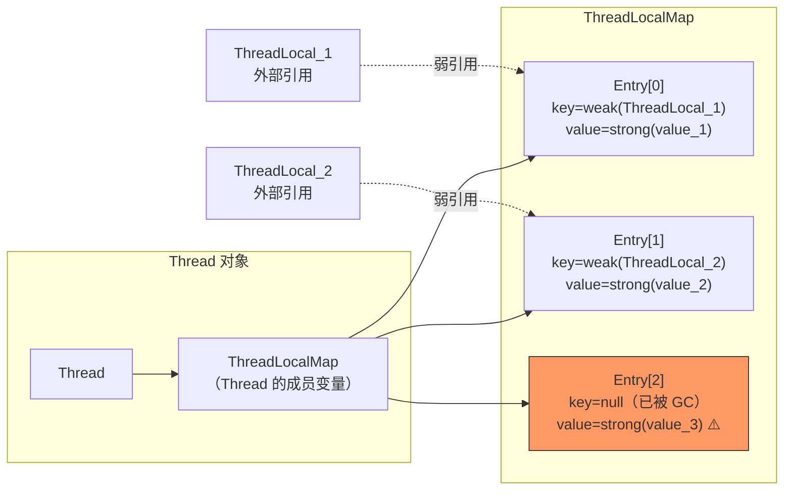
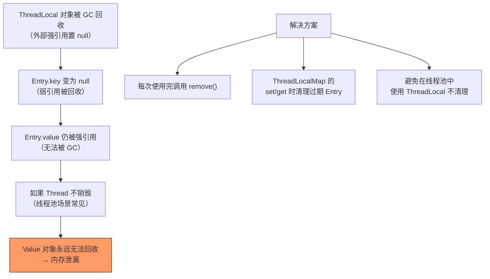
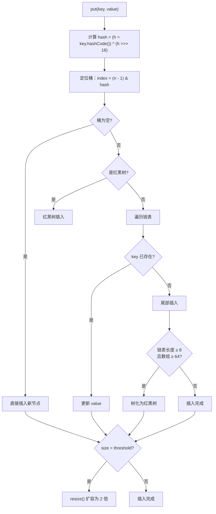
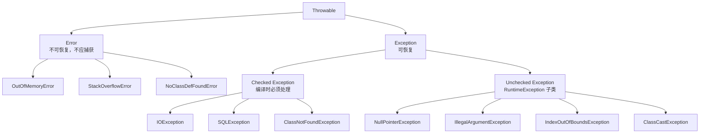

# Java 基础面试题

> 持续更新中 | 最后更新：2026-04-02

## ⭐ ConcurrentHashMap 的实现原理？

**简要回答：** JDK 8 使用 CAS + synchronized 实现细粒度锁，锁住的是链表/红黑树的头节点，并发性能远优于 JDK 7 的 Segment 分段锁。

**深度分析：**

```
put 流程：
1. 计算 hash 定位桶
2. 桶为空 → CAS 自旋写入
3. 桶处于扩容状态 → helpTransfer 协助扩容
4. 桶非空 → synchronized 锁住头节点
   - 遍历链表/红黑树，找到则更新，找不到则追加
5. addCount → 判断是否需要扩容
```

**与 JDK 7 对比：**

| 维度 | JDK 7 | JDK 8 |
|------|-------|-------|
| 锁粒度 | Segment（默认16个） | 桶级别（首节点） |
| 锁机制 | ReentrantLock | CAS + synchronized |
| 并发级别 | 固定 16 | 与桶数量一致 |
| 数据结构 | 数组 + 链表 | 数组 + 链表 + 红黑树 |

---

## ⭐ Java 中 == 和 equals 的区别？

**简要回答：** `==` 比较引用地址（基本类型比较值），`equals` 比较内容（需要重写，默认行为同 `==`）。

**深度分析：**

```java
String s1 = new String("hello");
String s2 = new String("hello");
String s3 = "hello";
String s4 = "hello";

s1 == s2;     // false（不同对象）
s1.equals(s2); // true（内容相同）
s3 == s4;     // true（字符串常量池）
s1 == s3;     // false（堆 vs 常量池）
```

**equals 的规范（来自 Object）：**
- 自反性：x.equals(x) = true
- 对称性：x.equals(y) = y.equals(x)
- 传递性：x.equals(y) && y.equals(z) → x.equals(z)
- 一致性：多次调用结果一致
- x.equals(null) = false

**重写 equals 必须重写 hashCode**，否则在 HashMap/HashSet 中会出问题。

:::danger 面试追问
- String 的 hashCode 怎么算的？→ `s[0]*31^(n-1) + s[1]*31^(n-2) + ... + s[n-1]`，为什么选 31？→ 31 是奇素数，`31 * i = (i << 5) - i` 位运算高效
:::

---

## ⭐⭐⭐ ThreadLocal 原理与内存泄漏

**简要回答：** ThreadLocal 通过每个线程独立的 ThreadLocalMap 存储数据副本，实现线程隔离。内部结构是 ThreadLocalMap（Entry[]），Key 是 ThreadLocal 的弱引用，Value 是强引用。内存泄漏发生在 ThreadLocal 对象被回收后，Key 变为 null 但 Value 仍被 Entry 强引用，导致 Value 无法回收。

**深度分析：**

### 内部结构



```java
// ThreadLocal 内部结构（简化版）
public class ThreadLocal<T> {
    
    // Thread 类中的成员变量
    // ThreadLocal.ThreadLocalMap threadLocals = null;
    
    public void set(T value) {
        Thread t = Thread.currentThread();
        ThreadLocalMap map = t.threadLocals;
        if (map != null) {
            map.set(this, value);  // this（ThreadLocal）作为 key
        } else {
            createMap(t, value);
        }
    }
    
    public T get() {
        Thread t = Thread.currentThread();
        ThreadLocalMap map = t.threadLocals;
        if (map != null) {
            Entry e = map.getEntry(this);
            if (e != null) {
                return (T) e.value;
            }
        }
        return setInitialValue();
    }
    
    public void remove() {
        ThreadLocalMap map = Thread.currentThread().threadLocals;
        if (map != null) {
            map.remove(this);  // 手动清除 Entry
        }
    }
}

// ThreadLocalMap.Entry 继承 WeakReference
static class Entry extends WeakReference<ThreadLocal<?>> {
    Object value;  // 强引用
    
    Entry(ThreadLocal<?> k, Object v) {
        super(k);  // key 是弱引用
        value = v;
    }
}
```

### 内存泄漏原因分析



```
引用链分析：
Thread → ThreadLocalMap → Entry → value（强引用链，无法回收）
                                    ↑
ThreadLocal → Entry.key（弱引用，已被 GC 回收）

泄漏条件：
1. ThreadLocal 外部强引用被置 null
2. Entry.key 被 GC 回收（弱引用）
3. Entry.value 仍被 Thread → ThreadLocalMap → Entry 强引用
4. 线程长期存活（线程池中的线程不会销毁）
```

### 正确使用方式

```java
// ❌ 错误用法：忘记 remove
@Service
public class UserContextService {
    
    private static final ThreadLocal<User> CURRENT_USER = new ThreadLocal<>();
    
    public void processRequest(HttpServletRequest request) {
        User user = parseUser(request);
        CURRENT_USER.set(user);
        try {
            doBusiness();  // 业务逻辑
        } finally {
            // ❌ 忘记清理，线程回线程池后 value 还在
        }
    }
}

// ✅ 正确用法：finally 中 remove
@Service
public class UserContextService {
    
    private static final ThreadLocal<User> CURRENT_USER = new ThreadLocal<>();
    
    public void processRequest(HttpServletRequest request) {
        User user = parseUser(request);
        CURRENT_USER.set(user);
        try {
            doBusiness();
        } finally {
            CURRENT_USER.remove();  // ✅ 必须清理
        }
    }
}

// ✅ 使用 try-with-resources 模式（自定义包装）
public class ThreadLocalScope<T> implements AutoCloseable {
    
    private final ThreadLocal<T> threadLocal;
    
    public ThreadLocalScope(ThreadLocal<T> threadLocal, T value) {
        this.threadLocal = threadLocal;
        threadLocal.set(value);
    }
    
    @Override
    public void close() {
        threadLocal.remove();
    }
    
    public static <T> ThreadLocalScope<T> with(ThreadLocal<T> tl, T value) {
        return new ThreadLocalScope<>(tl, value);
    }
}

// 使用
try (var scope = ThreadLocalScope.with(CURRENT_USER, user)) {
    doBusiness();
}  // 自动调用 close() → remove()
```

### ThreadLocal 常见应用场景

| 场景 | 说明 | 示例 |
|------|------|------|
| **用户上下文传递** | 在线程内传递用户信息，避免参数透传 | UserContext、RequestContext |
| **数据库连接管理** | Spring 的 @Transactional 用 ThreadLocal 保存 Connection | TransactionSynchronizationManager |
| **日期格式化** | SimpleDateFormat 线程不安全，用 ThreadLocal 保证线程隔离 | 每个线程一个 SimpleDateFormat 实例 |
| **链路追踪** | 在线程内传递 traceId，方便日志追踪 | MDC（Mapped Diagnostic Context） |
| **限流计数** | 每个线程独立的计数器 | RateLimiter |

```java
// Spring 中使用 ThreadLocal 传递用户上下文
public class UserContext {
    
    private static final ThreadLocal<UserInfo> CONTEXT = new ThreadLocal<>();
    
    public static void set(UserInfo user) {
        CONTEXT.set(user);
    }
    
    public static UserInfo get() {
        return CONTEXT.get();
    }
    
    public static void remove() {
        CONTEXT.remove();
    }
}

// 拦截器中设置
@Component
public class UserInterceptor implements HandlerInterceptor {
    
    @Override
    public boolean preHandle(HttpServletRequest request, HttpServletResponse response, 
                             Object handler) {
        String token = request.getHeader("Authorization");
        UserInfo user = parseToken(token);
        UserContext.set(user);
        return true;
    }
    
    @Override
    public void afterCompletion(HttpServletRequest request, HttpServletResponse response,
                                Object handler, Exception ex) {
        UserContext.remove();  // ✅ 请求结束后清理
    }
}
```

### JDK 8 增强：InheritableThreadLocal

```java
// InheritableThreadLocal：子线程继承父线程的 ThreadLocal 值
// 注意：线程池中无效（线程不是新创建的，是复用的）

// 线程池场景的解决方案：TransmittableThreadLocal（阿里巴巴开源）
// https://github.com/alibaba/transmittable-thread-local

// TTL 示例
TtlRunnable.get(() -> {
    // 可以访问父线程的 ThreadLocal 值
    UserInfo user = UserContext.get();
    doBusiness(user);
});

// 装饰线程池
ExecutorService ttlExecutorService = TtlExecutors.getTtlExecutorService(executorService);
ttlExecutorService.submit(() -> {
    UserInfo user = UserContext.get();  // ✅ 可以访问
});
```

:::tip 实践建议
- **永远在 finally 中调用 remove()**，这是最重要的原则
- 线程池中使用 ThreadLocal 要格外注意，线程会复用
- ThreadLocal 的 key 使用 `private static final` 修饰，防止重复创建
- 大对象不要放在 ThreadLocal 中，避免内存占用过大
- 推荐使用 TTL（TransmittableThreadLocal）解决线程池场景的传递问题
- 初始化值用 `withInitial()` 方法，避免 get() 返回 null

```java
// 推荐的 ThreadLocal 初始化方式
private static final ThreadLocal<SimpleDateFormat> DATE_FORMAT = 
    ThreadLocal.withInitial(() -> new SimpleDateFormat("yyyy-MM-dd HH:mm:ss"));

private static final ThreadLocal<UserInfo> USER_CONTEXT = 
    ThreadLocal.withInitial(() -> UserInfo.ANONYMOUS);
```
:::

:::danger 面试追问
- ThreadLocal 的 key 为什么用弱引用？→ 如果用强引用，ThreadLocal 对象永远无法回收（Thread → Map → Entry → key 的强引用链）。弱引用可以在外部没有强引用时被 GC 回收
- 既然用了弱引用，为什么还会内存泄漏？→ 弱引用只回收 key，value 仍被 Entry 强引用。如果线程长期存活（线程池），value 就无法回收
- ThreadLocalMap 的 set/get 方法有清理过期 Entry 的逻辑吗？→ 有。set() 时会探测清理部分过期 Entry，get() 时遇到过期 Entry 也会清理。但这不是主动的、彻底的清理
- ThreadLocal 和 synchronized 有什么区别？→ ThreadLocal 是空间换时间（每个线程一份数据），synchronized 是时间换空间（共享数据加锁）
- Spring 事务管理中 ThreadLocal 的作用？→ 通过 ThreadLocal 保存当前线程的数据库连接，保证同一个事务中使用同一个 Connection
:::

---

## ⭐ HashMap 底层原理？

**简要回答：** JDK 8 中 HashMap 底层是 **数组 + 链表 + 红黑树**。通过 hash 值定位数组下标，链表解决哈希冲突，链表长度 ≥ 8 且数组 ≥ 64 时转为红黑树。

**深度分析：**



| 要点 | 说明 |
|------|------|
| 默认容量 | 16，负载因子 0.75 |
| hash 计算 | 扰动函数：`hashCode() ^ (hashCode() >>> 16)`，减少碰撞 |
| 扩容 | 2 倍扩容，通过 `hash & oldCap` 一位判断新位置 |
| 树化 | 链表 ≥ 8 且数组 ≥ 64 → 红黑树；节点 ≤ 6 → 退化为链表 |
| 线程安全 | HashMap 非线程安全，并发用 ConcurrentHashMap |

:::tip 面试追问
- **为什么容量必须是 2 的幂？** 方便用位运算 `&` 代替取模 `%`，效率更高
- **JDK 7 vs JDK 8**：JDK 7 头插法（多线程可能死循环），JDK 8 尾插法
- **负载因子为什么是 0.75？** 泊松分布，0.75 是时间和空间的平衡点
:::

---

## ⭐ String 为什么不可变？有什么好处？

**简要回答：** String 被 `final` 修饰，内部 `char[]`（JDK 9+ 是 `byte[]`）是 `private final` 的，没有修改方法。不可变带来线程安全、String Pool 优化、安全性。

**深度分析：**

```java
public final class String implements Serializable, Comparable<String> {
    private final byte[] value;  // JDK 9+ 改为 byte[] + coder，节省内存
    private final int coder;     // LATIN1 = 0, UTF16 = 1
}
```

**不可变的深层原因：**

| 好处 | 说明 |
|------|------|
| **String Pool** | 相同字符串共享一个实例，节省内存。如果可变，一处修改全局受影响 |
| **线程安全** | 天然不可变，多线程共享无需同步 |
| **安全性** | 作为 HashMap 的 key、网络参数、文件路径等，防止被篡改 |
| **类加载** | 类名作为 String 存储在常量池，可变会导致类加载混乱 |

:::warning String 常见陷阱
1. **String s = "hello"** vs **String s = new String("hello")**：前者在常量池，后者在堆上
2. **字符串拼接**：循环中用 `+` 拼接会创建大量临时对象，用 `StringBuilder`
3. **intern()**：将字符串放入常量池并返回引用，JDK 7+ 常量池移到堆中
:::

**String vs StringBuilder vs StringBuffer：**

| 特性 | String | StringBuilder | StringBuffer |
|------|--------|--------------|-------------|
| 可变性 | 不可变 | 可变 | 可变 |
| 线程安全 | 天然安全 | 不安全 | 安全（synchronized） |
| 性能 | 拼接慢 | 最快 | 比 StringBuilder 慢 |
| 使用场景 | 少量拼接 | 单线程拼接 | 多线程拼接 |


---

## ⭐ ArrayList 和 LinkedList 的区别？各适合什么场景？

**简要回答：** ArrayList 底层是动态数组，支持随机访问 O(1)，插入删除需移动元素 O(n)；LinkedList 底层是双向链表，插入删除只需修改指针 O(1)，随机访问需遍历 O(n)。

**深度分析：**

```java
// ArrayList 源码核心
public class ArrayList<E> {
    transient Object[] elementData;  // 底层数组
    private int size;
    
    // 扩容：1.5 倍 growth
    private void grow() {
        int newCapacity = oldCapacity + (oldCapacity >> 1);
        elementData = Arrays.copyOf(elementData, newCapacity);
    }
}

// LinkedList 源码核心
public class LinkedList<E> {
    transient Node<E> first;  // 头节点
    transient Node<E> last;   // 尾节点
    
    private static class Node<E> {
        E item;
        Node<E> next;
        Node<E> prev;
    }
}
```

| 维度 | ArrayList | LinkedList |
|------|-----------|------------|
| 底层结构 | 动态数组 | 双向链表 |
| 随机访问 get(i) | O(1) | O(n) |
| 头部插入 | O(n)（需移动元素） | O(1) |
| 尾部插入 | 均摊 O(1) | O(1) |
| 中间插入 | O(n) | O(n)（查找 O(n) + 插入 O(1)） |
| 内存占用 | 紧凑 | 每个节点额外 2 个指针（16 字节） |
| CPU 缓存友好 | ✅ 数组连续内存 | ❌ 节点分散在堆中 |

:::tip 面试追问
- **为什么说 LinkedList 不一定比 ArrayList 快？** 因为链表节点在堆上分散分布，无法利用 CPU 缓存行（Cache Line），实际测试中 ArrayList 在大多数场景下更快
- **ArrayList 扩容细节**：每次扩容 1.5 倍，如果预知数据量应通过 `new ArrayList<>(10000)` 指定初始容量避免多次扩容
- **ArrayList 删除元素陷阱**：在 for 循环中删除元素要用迭代器或倒序遍历，正序删除会漏删
:::

---

## ⭐ Java 异常体系是怎样的？Checked 和 Unchecked 区别？

**简要回答：** 所有异常继承自 `Throwable`，分为 `Error`（不可恢复）和 `Exception`（可恢复）。Exception 又分 Checked（编译时检查）和 Unchecked（运行时异常，RuntimeException 子类）。

**深度分析：**



| 类型 | 基类 | 编译检查 | 典型场景 |
|------|------|---------|---------|
| Checked | Exception（非 RuntimeException） | ✅ 必须处理或声明 throws | IO、数据库、网络 |
| Unchecked | RuntimeException | ❌ 不强制处理 | 空指针、参数非法、越界 |

```java
// Checked: 必须处理
public void readFile() throws IOException {  // 必须 throws 或 try-catch
    Files.readString(Path.of("test.txt"));
}

// Unchecked: 不强制处理
public void divide(int a, int b) {
    return a / b;  // ArithmeticException 是 RuntimeException，无需声明
}
```

:::warning 异常处理最佳实践
1. **不要用异常控制业务流程**：异常的性能开销大（创建异常对象会填充堆栈）
2. **不要 catch 后吞掉异常**：至少 `log.error("msg", e)`，否则问题难以排查
3. **finally 中不要 return**：会覆盖 try/catch 中的返回值
4. **try-with-resources** 替代手动 close：`try (InputStream is = new FileInputStream(f)) { ... }`
:::

