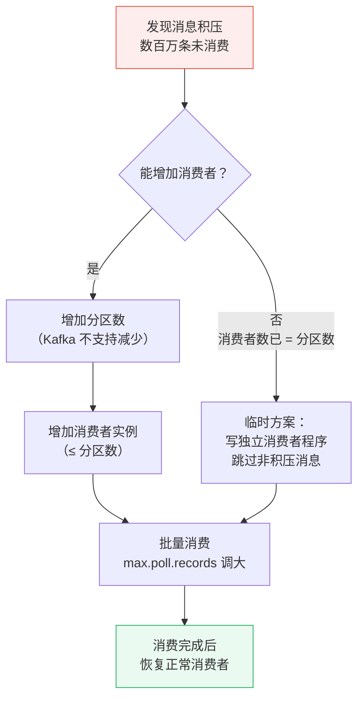

# Kafka 面试题

> 持续更新中 | 最后更新：2026-04-02

---

## ⭐ 如何选型消息队列？Kafka、RocketMQ、RabbitMQ 各自的优缺点？

**简要回答：** Kafka 适合大数据/日志场景（高吞吐、持久化强）；RocketMQ 适合业务消息（事务消息、顺序消息、延迟消息）；RabbitMQ 适合中小规模业务（路由灵活、协议丰富、管理界面友好）。

**深度分析：**

```
三大 MQ 定位对比：

Kafka：        日志采集、流处理、大数据    →  吞吐量之王
RocketMQ：     电商交易、金融支付          →  功能最全面
RabbitMQ：     中小规模业务、微服务解耦     →  易用性最佳
```

**关键细节：**

| 特性 | Kafka | RocketMQ | RabbitMQ |
|------|-------|----------|----------|
| 开发语言 | Scala/Java | Java | Erlang |
| 吞吐量 | 百万级/秒 | 十万级/秒 | 万级/秒 |
| 延迟 | ms 级 | ms 级 | μs 级（Erlang VM） |
| 消息可靠性 | 同步/异步刷盘 | 同步刷盘 | 消息持久化 + ACK |
| 事务消息 | 不支持（幂等替代） | ✅ 支持 | 不支持 |
| 延迟消息 | 不支持 | ✅ 18 个延迟级别 | ✅ 死信队列 + 插件 |
| 顺序消息 | ✅ 分区内有序 | ✅ 严格顺序 | ❌ 不保证 |
| 消息回溯 | ✅ offset 重置 | ✅ 时间戳回溯 | ❌ 不支持 |
| 消息堆积 | ✅ 磁盘存储，PB 级 | ✅ 磁盘存储 | ❌ 内存为主，堆积能力弱 |
| 运维复杂度 | 中（依赖 ZooKeeper/KRaft） | 中 | 低（单机友好） |
| 社区生态 | 最强（大数据生态） | 国内活跃 | 国际活跃 |

**选型决策树：**

```
日处理数据量 > 亿级？
├── 是 → Kafka（日志、流处理、大数据）
└── 否
    ├── 需要事务消息/顺序消息？
    │   ├── 是 → RocketMQ（电商、金融）
    │   └── 否
    │       ├── 团队规模小/快速上手？→ RabbitMQ
    │       └── 消息堆积要求高？→ RocketMQ
```

:::danger 面试追问
- Kafka 如何保证消息不丢失？→ Producer: acks=all + retries; Broker: min.insync.replicas ≥ 2 + 同步刷盘; Consumer: 手动提交 offset
- RocketMQ 事务消息的实现原理？→ 半消息 + 本地事务执行 + 回查机制（Broker 定时回查 Producer 事务状态）
- 如何保证消息的幂等消费？→ 全局唯一消息 ID + Redis/数据库去重表，消费前先查重
:::

---

## ⭐ Kafka 如何保证消息不丢失？

**简要回答：** 三个环节：Producer 端（acks=all + retries）、Broker 端（min.insync.replicas ≥ 2）、Consumer 端（手动提交 offset，业务处理完再提交）。

**深度分析：**

```java
// Producer 端配置
Properties props = new Properties();
props.put("acks", "all");                          // 所有 ISR 副本确认
props.put("retries", Integer.MAX_VALUE);             // 无限重试
props.put("max.in.flight.requests.per.connection", 1); // 顺序保证
props.put("enable.idempotence", true);               // 开启幂等

// Broker 端配置
// min.insync.replicas=2（ISR 中至少 2 个副本确认）
// unclean.leader.election.enable=false（禁止非 ISR 副本成为 Leader）

// Consumer 端：手动提交 offset
props.put("enable.auto.commit", "false");  // 关闭自动提交

while (true) {
    ConsumerRecords<String, String> records = consumer.poll(Duration.ofMillis(1000));
    for (ConsumerRecord<String, String> record : records) {
        // 1. 业务处理（落库等）
        processMessage(record);
        // 2. 业务处理成功后再提交 offset
        consumer.commitSync();  // 同步提交
    }
}
```

:::tip 面试追问
- **acks=all vs acks=1？** all 等所有 ISR 副本确认（最安全），1 只等 Leader 确认（Leader 挂了可能丢）
- **什么是 ISR？** In-Sync Replicas，与 Leader 保持同步的副本集合。落后太多的副本会被踢出 ISR
- **消费者组再平衡时会不会丢消息？** 可能。解决方案：Consumer 配置 `enable.auto.commit=false` + 再平衡监听器中提交 offset
:::

---

## ⭐ Kafka 如何保证消息顺序？

**简要回答：** Kafka 只保证**分区内有序**，不保证全局有序。发送时指定相同的 Key（如订单ID），确保相关消息进入同一个分区。

**深度分析：**

```java
// 同一订单的消息发到同一分区，保证顺序
ProducerRecord<String, String> record = new ProducerRecord<>(
    "order-topic",
    orderId.toString(),  // Key → 决定分区（相同 Key → 相同分区）
    JSON.toJSONString(orderEvent)
);
producer.send(record);

// Consumer 消费时也要保证单线程消费一个分区
// KafkaConsumer 的 poll 是单线程的，天然保证分区内的顺序
```

| 场景 | 方案 |
|------|------|
| 同一业务实体有序 | 发送时指定相同的 Key |
| 全局有序 | 只有一个分区（不推荐，丧失并发性） |
| 消费端乱序 | 内存缓冲排序、按时间戳排序（不推荐，复杂） |

:::tip 面试追问
- **Key 为 null 时怎么分配分区？** 使用轮询（Round Robin）或 Sticky 分区策略
- **分区数怎么定？** 一般等于消费者数或略大，保证负载均衡。扩分区可以，缩分区不行
- **为什么分区多性能不一定好？** 分区过多 → 文件句柄多 → 内存占用大 → 故障恢复慢
:::

---

## ⭐ Kafka 消息积压怎么处理？

**简要回答：** 紧急扩容消费者、增加分区数、临时消费者程序批量处理。关键是要快速消费积压，避免影响正常业务。

**深度分析：**



| 方案 | 操作 | 适用场景 |
|------|------|----------|
| 增加消费者 | 部署更多 Consumer 实例 | 消费者数 < 分区数 |
| 增加分区 | `kafka-topics --alter --partitions` | 需要更多并行度 |
| 批量消费 | `max.poll.records=500` | 单条处理太慢 |
| 异步处理 | 消费后丢到线程池并行处理 | 无严格顺序要求 |
| 临时消费者 | 跳过历史消息，只消费新的 | 紧急恢复，容忍少量丢失 |

:::warning 根本解决方案
积压通常是消费能力不足，根本解决：
1. **优化消费逻辑**：减少 IO、批量落库、异步处理
2. **提升消费并发**：增加分区 + 消费者
3. **削峰**：上游限流，避免突发流量打满
:::
