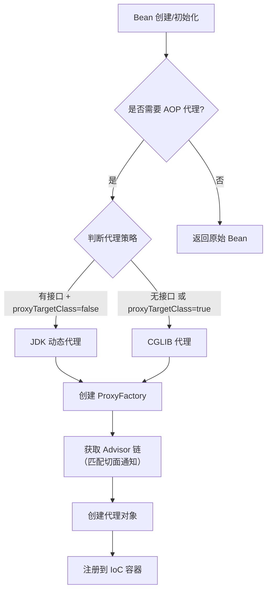
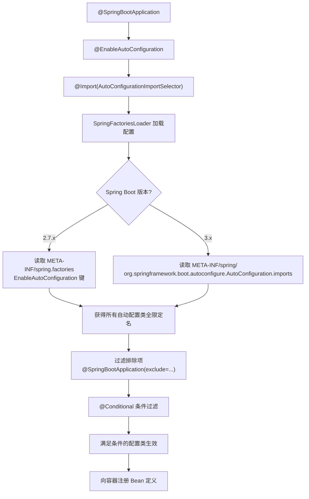
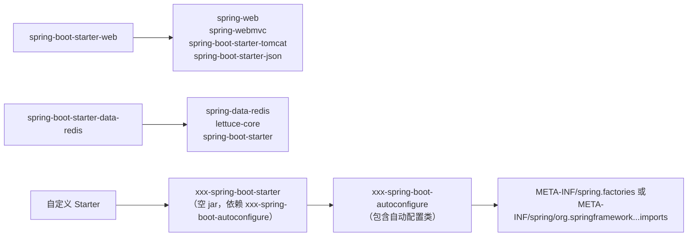
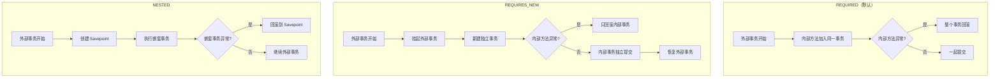

# Spring 生态面试题

> 持续更新中 | 最后更新：2026-04-02

---

## ⭐⭐⭐ Spring AOP 实现原理：JDK 动态代理 vs CGLIB 代理

**简要回答：** Spring AOP 底层通过动态代理实现，默认策略是：目标类实现了接口用 JDK 动态代理，未实现接口用 CGLIB 代理（Spring Boot 2.x 起默认全部使用 CGLIB）。核心原理是在运行时生成代理对象，将切面逻辑织入目标方法的前后。

**深度分析：**

### JDK 动态代理

基于接口，通过 `java.lang.reflect.Proxy` 在运行时生成代理类，实现与目标类相同的接口。

```java
// JDK 动态代理核心代码
public class JdkProxyDemo {
    public static void main(String[] args) {
        // 目标对象
        UserService target = new UserServiceImpl();

        // 创建代理对象
        UserService proxy = (UserService) Proxy.newProxyInstance(
            target.getClass().getClassLoader(),        // 类加载器
            target.getClass().getInterfaces(),         // 目标接口
            new InvocationHandler() {                   // 调用处理器
                @Override
                public Object invoke(Object proxy, Method method, Object[] args) throws Throwable {
                    // 前置增强
                    System.out.println("[Before] " + method.getName());
                    // 执行目标方法
                    Object result = method.invoke(target, args);
                    // 后置增强
                    System.out.println("[After] " + method.getName());
                    return result;
                }
            }
        );

        proxy.save("张三");
    }
}
```

**底层原理：** `Proxy.newProxyInstance` 会根据接口在内存中动态生成一个 `$Proxy0` 类字节码，该类继承 `Proxy` 并实现目标接口。每次方法调用都转发到 `InvocationHandler.invoke()`。

### CGLIB 代理

基于继承，通过字节码技术生成目标类的子类，重写非 final 方法。

```java
// CGLIB 代理核心代码
public class CglibProxyDemo {
    public static void main(String[] args) {
        Enhancer enhancer = new Enhancer();
        enhancer.setSuperclass(UserService.class);       // 设置父类（目标类）
        enhancer.setCallback(new MethodInterceptor() {
            @Override
            public Object intercept(Object obj, Method method, Object[] args,
                                    MethodProxy proxy) throws Throwable {
                System.out.println("[Before] " + method.getName());
                // 注意：调用 proxy.invokeSuper 而非 method.invoke，避免死循环
                Object result = proxy.invokeSuper(obj, args);
                System.out.println("[After] " + method.getName());
                return result;
            }
        });

        UserService proxy = (UserService) enhancer.create();
        proxy.save("张三");
    }
}
```

**底层原理：** CGLIB 使用 ASM 字节码框架动态生成目标类的子类，通过 `FastClass` 机制（方法索引）避免反射调用开销。

### 对比分析

| 维度 | JDK 动态代理 | CGLIB 代理 |
|------|-------------|-----------|
| 实现方式 | 基于接口（实现相同接口） | 基于继承（生成子类） |
| 要求 | 目标类必须实现接口 | 目标类不能是 final 类 |
| 性能 | 调用时使用反射，略慢 | 生成 FastClass，调用更快 |
| 生成速度 | 较快 | 较慢（生成字节码更复杂） |
| final 方法 | 不受影响（接口方法） | 无法代理 final 方法 |
| 依赖 | JDK 内置 | 需要 cglib 库 |

### Spring AOP 代理创建流程



:::tip 实践建议
- Spring Boot 2.x 默认 `spring.aop.proxy-target-class=true`，统一使用 CGLIB
- `@EnableAspectJAutoProxy(proxyTargetClass = true)` 可手动指定
- **内部方法调用不走代理**：同一类中 A 方法调用 B 方法，B 上的切面不生效（因为没有经过代理对象）
- 解决内部调用问题：用 `AopContext.currentProxy()` 或自我注入

```java
// 解决内部方法调用不生效
@Service
public class UserService {
    @Autowired
    @Lazy
    private UserService self;  // 自我注入

    public void methodA() {
        self.methodB();  // 通过代理对象调用，切面生效
    }

    @Transactional
    public void methodB() { ... }
}
```
:::

:::danger 面试追问
- Spring AOP 和 AspectJ 有什么区别？→ Spring AOP 是运行时织入（动态代理），AspectJ 是编译时/类加载时织入（字节码修改），功能更强大
- 同一个类中方法 A 调用方法 B，B 上的 @Transactional 为什么失效？→ 因为没有经过代理对象，直接 this 调用
- CGLIB 为什么不能代理 final 类？→ 因为基于继承生成子类，final 类不能被继承，final 方法不能被重写
- JDK 动态代理生成的类是什么样的？→ 继承 Proxy，实现目标接口，持有 InvocationHandler 引用
- Spring 如何决定一个 Bean 需要被代理？→ 通过 `AutoProxyCreator` 后置处理器，检查是否有匹配的 Advisor（切面通知）
:::

---

## ⭐⭐ Spring Boot 自动配置原理

**简要回答：** Spring Boot 通过 `@EnableAutoConfiguration` 注解，结合 `spring.factories`（2.7.x）或 `org.springframework.boot.autoconfigure.AutoConfiguration.imports`（3.x）加载自动配置类，再通过 `@Conditional` 系列条件注解按需生效，实现"约定优于配置"。

**深度分析：**

### 核心注解链

```java
// @SpringBootApplication 是三个注解的组合
@SpringBootConfiguration      // 标记为配置类
@EnableAutoConfiguration       // 核心：开启自动配置
@ComponentScan                 // 包扫描

// @EnableAutoConfiguration 内部
@Import(AutoConfigurationImportSelector.class)  // 导入自动配置选择器
```

### 自动配置加载流程



### 条件注解详解

```java
// 常用条件注解
@ConditionalOnClass(DataSource.class)           // classpath 中存在指定类
@ConditionalOnMissingBean(DataSource.class)     // 容器中不存在指定 Bean
@ConditionalOnProperty(prefix = "spring.datasource", name = "url")  // 配置存在
@ConditionalOnWebApplication                    // 是 Web 应用
@ConditionalOnExpression("${spring.cache.type:redis}")  // SpEL 表达式

// 以 Redis 自动配置为例
@Configuration
@ConditionalOnClass(RedisOperations.class)
@EnableConfigurationProperties(RedisProperties.class)
public class RedisAutoConfiguration {

    @Bean
    @ConditionalOnMissingBean(name = "redisTemplate")  // 用户没自定义才生效
    public RedisTemplate<String, Object> redisTemplate(RedisConnectionFactory factory) {
        RedisTemplate<String, Object> template = new RedisTemplate<>();
        template.setConnectionFactory(factory);
        template.setKeySerializer(new StringRedisSerializer());
        template.setValueSerializer(new GenericJackson2JsonRedisSerializer());
        return template;
    }
}
```

### Starter 机制



**自定义 Starter 示例：**

```java
// 1. 配置属性类
@ConfigurationProperties(prefix = "demo.sms")
public class SmsProperties {
    private String accessKey;
    private String secretKey;
    private String signName;
    // getter/setter
}

// 2. 自动配置类
@Configuration
@ConditionalOnClass(SmsService.class)
@EnableConfigurationProperties(SmsProperties.class)
public class SmsAutoConfiguration {

    @Bean
    @ConditionalOnMissingBean
    @ConditionalOnProperty(prefix = "demo.sms", name = "access-key")
    public SmsService smsService(SmsProperties properties) {
        return new SmsService(properties);
    }
}

// 3. 注册（Spring Boot 2.7.x）
// META-INF/spring.factories
// org.springframework.boot.autoconfigure.EnableAutoConfiguration=\
//   com.example.sms.SmsAutoConfiguration

// 4. 使用：pom 引入 starter，配置文件填写属性即可
```

:::tip 实践建议
- 想知道哪些自动配置生效了？启动时加 `--debug` 或配置 `debug=true`
- 想排除某个自动配置？`@SpringBootApplication(exclude = DataSourceAutoConfiguration.class)`
- 想自定义某个 Bean？自己定义一个同类型的 Bean，`@ConditionalOnMissingBean` 保证你的优先
- 排查自动配置问题：看 `ConditionEvaluationReportLoggingListener` 的日志输出

```yaml
# 排查自动配置
debug: true
# 或只看特定自动配置的日志
logging:
  level:
    org.springframework.boot.autoconfigure: DEBUG
```
:::

:::danger 面试追问
- Spring Boot 2.7 和 3.x 的自动配置加载方式有什么变化？→ 从 spring.factories 改为 AutoConfiguration.imports 文件，性能更好，按需加载
- @ConditionalOnBean 和 @ConditionalOnMissingBean 为什么不建议在自动配置类之外使用？→ 因为 Bean 的加载顺序不确定，可能导致条件判断不准确
- spring.factories 的 SPI 机制除了自动配置还用在哪？→ Spring 的事件监听器 `ApplicationListener`、`ApplicationContextInitializer` 等
- 如何自定义一个 Starter？→ 创建 autoconfigure 模块 + starter 模块（依赖 autoconfigure），配置条件注解和属性类
:::

---

## ⭐⭐ Spring 事务传播行为详解

**简要回答：** Spring 事务通过 `@Transactional` 注解的 `propagation` 属性控制事务传播行为，定义了多个事务方法相互调用时事务如何传播。共 7 种传播行为，最常用的是 `REQUIRED`（默认）和 `REQUIRES_NEW`。

**深度分析：**

### 7 种传播行为

| 传播行为 | 说明 | 当前有事务 | 当前无事务 |
|---------|------|-----------|-----------|
| **REQUIRED**（默认） | 支持当前事务，无则新建 | 加入当前事务 | 新建事务 |
| **REQUIRES_NEW** | 总是新建事务 | 挂起当前事务，新建 | 新建事务 |
| **NESTED** | 嵌套事务 | 嵌套事务（savepoint） | 新建事务 |
| **SUPPORTS** | 支持当前事务 | 加入当前事务 | 非事务方式执行 |
| **NOT_SUPPORTED** | 非事务方式执行 | 挂起当前事务 | 非事务方式执行 |
| **MANDATORY** | 必须在事务中 | 加入当前事务 | 抛异常 |
| **NEVER** | 非事务方式执行 | 抛异常 | 非事务方式执行 |

### 典型场景代码

```java
@Service
public class OrderService {

    @Autowired
    private PaymentService paymentService;
    @Autowired
    private LogService logService;

    // 场景1：REQUIRED - 默认行为
    @Transactional
    public void createOrder(Order order) {
        orderMapper.insert(order);
        paymentService.processPayment(order);  // 加入同一个事务
        // 如果这里抛异常，整个事务回滚（包括 payment）
    }

    // 场景2：REQUIRES_NEW - 独立事务（最常用）
    @Transactional
    public void batchProcess(List<Order> orders) {
        for (Order order : orders) {
            try {
                paymentService.processPayment(order);  // 每个支付独立事务
            } catch (Exception e) {
                logService.recordFailure(order, e);    // 记录失败，不影响后续
            }
        }
    }
}

@Service
public class PaymentService {

    // 独立事务：无论外部事务成功还是失败，支付记录都提交
    @Transactional(propagation = Propagation.REQUIRES_NEW)
    public void processPayment(Order order) {
        paymentMapper.insert(order);
        // 这里异常只回滚自己，不影响外部事务
    }
}

// 场景3：NESTED - 嵌套事务
@Service
public class InventoryService {

    @Transactional
    public void updateInventory(Long productId, int quantity) {
        // 主事务操作
        inventoryMapper.deduct(productId, quantity);

        try {
            // 嵌套事务：失败回滚到 savepoint，不影响主事务
            productService.syncPrice(productId);
        } catch (Exception e) {
            // 价格同步失败，库存扣减仍然有效
            log.warn("价格同步失败，继续执行", e);
        }
    }
}
```

### 事务传播流程图



### 隔离级别

| 隔离级别 | 脏读 | 不可重复读 | 幻读 | 性能 |
|---------|------|-----------|------|------|
| READ_UNCOMMITTED | ✅ | ✅ | ✅ | 最高 |
| READ_COMMITTED | ❌ | ✅ | ✅ | 高 |
| **REPEATABLE_READ**（MySQL 默认） | ❌ | ❌ | ❌（InnoDB） | 中 |
| SERIALIZABLE | ❌ | ❌ | ❌ | 最低 |

### 事务失效的 8 大场景

```java
// 1. 方法不是 public（Spring AOP 只能代理 public 方法）
@Transactional
private void doSomething() { ... }  // ❌ 不生效

// 2. 同一类中方法内部调用（没有经过代理对象）
@Service
public class OrderService {
    public void methodA() {
        this.methodB();  // ❌ methodB 的事务不生效
    }
    @Transactional
    public void methodB() { ... }
}

// 3. 异常被 catch 吞掉
@Transactional
public void method() {
    try {
        // 业务逻辑
    } catch (Exception e) {
        log.error("异常", e);  // ❌ 异常被吞，事务不回滚
    }
}

// 4. 抛出的是非 RuntimeException（checked 异常默认不回滚）
@Transactional
public void method() throws Exception {
    throw new IOException("文件错误");  // ❌ 不回滚
}
// 解决：@Transactional(rollbackFor = Exception.class)

// 5. 数据库引擎不支持（MyISAM 不支持事务，需要 InnoDB）

// 6. Bean 未被 Spring 管理（自己 new 的对象，不走代理）

// 7. 传播行为设置不当（如 NOT_SUPPORTED 导致事务挂起）

// 8. 多线程调用（不同线程不在同一个事务中）
@Transactional
public void method() {
    new Thread(() -> {
        // ❌ 新线程不在当前事务中
        orderMapper.insert(order);
    }).start();
}
```

:::tip 实践建议
- 始终使用 `@Transactional(rollbackFor = Exception.class)` 显式指定回滚异常
- 事务方法尽量放在 Service 层，Controller 层不加事务
- 事务方法不要做 RPC 调用，避免长事务
- 推荐编程式事务 `TransactionTemplate` 替代声明式，更灵活可控
- 只读查询方法加 `@Transactional(readOnly = true)`，优化数据库连接

```java
// 编程式事务示例
@Service
public class OrderService {
    @Autowired
    private TransactionTemplate transactionTemplate;

    public void createOrder(Order order) {
        transactionTemplate.execute(status -> {
            try {
                orderMapper.insert(order);
                paymentService.pay(order);
                return true;
            } catch (Exception e) {
                status.setRollbackOnly();
                return false;
            }
        });
    }
}
```
:::

:::danger 面试追问
- Spring 事务的底层实现原理？→ 基于 AOP 代理，通过 `TransactionInterceptor` 拦截，使用 `PlatformTransactionManager` 管理事务
- REQUIRED 和 NESTED 的区别？→ REQUIRED 加入同一事务，NESTED 创建 savepoint 可以部分回滚
- REQUIRES_NEW 的外部事务挂起是怎么实现的？→ 通过事务管理器保存当前事务上下文（Connection），新建独立 Connection
- 事务失效了怎么排查？→ 检查：是否 public、是否同类内部调用、异常是否被吞、rollbackFor 是否配置、数据库引擎是否支持
- Spring 事务和分布式事务（Seata）有什么关系？→ Spring 事务是本地事务，Seata 是分布式事务解决方案（AT/TCC/Saga 模式）
:::
