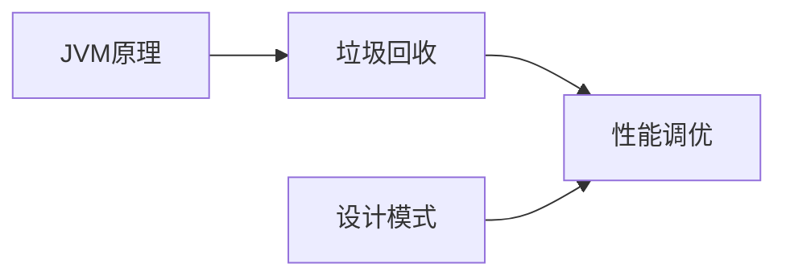

# Java进阶

Java进阶模块深入探讨JVM原理、性能调优、设计模式等高级主题。

## 模块概览

| 章节 | 描述 | 难度 |
|------|------|------|
| [JVM原理](./jvm.md) | 内存模型、类加载机制 | 高级 |
| [垃圾回收](./gc.md) | GC算法、垃圾收集器 | 高级 |
| [性能调优](./tuning.md) | JVM调优、性能监控 | 高级 |
| [设计模式](./design-patterns.md) | 23种设计模式 | 中级 |

## 学习路径

## 核心知识点

### 1. JVM架构

- 类加载器子系统
- 运行时数据区
- 执行引擎
- 本地库接口

### 2. 内存模型

- 堆（Heap）
- 栈（Stack）
- 方法区（Method Area）
- 程序计数器
- 本地方法栈

### 3. 垃圾回收

- GC算法（标记-清除、复制、标记-整理）
- 垃圾收集器（Serial、Parallel、CMS、G1、ZGC）
- GC调优参数

### 4. 性能调优

- JVM参数配置
- 性能监控工具
- 常见问题排查
- 调优案例分析

### 5. 设计模式

- 创建型模式（5种）
- 结构型模式（7种）
- 行为型模式（11种）
