# Java 设计模式

> 设计模式不是"背下来面试用"的。每个设计模式都是为了解决一个真实的设计问题。理解了问题，模式就自然记住了。

## 什么是设计模式？

设计模式是前辈们在大量软件项目中总结出来的**可复用的解决方案模板**。1994 年 GoF（四人帮）出版了《设计模式》一书，总结了 23 种经典设计模式，分为三大类：

```mermaid
graph TD
    subgraph creational["创建型（5 种）——怎么创建对象"]
        direction LR
        S1["单例"] ~~~ S2["工厂方法"] ~~~ S3["抽象工厂"] ~~~ S4["建造者"] ~~~ S5["原型"]
    end
    subgraph structural["结构型（7 种）——怎么组合对象"]
        direction LR
        T1["适配器"] ~~~ T2["桥接"] ~~~ T3["组合"] ~~~ T4["装饰器"] ~~~ T5["外观"] ~~~ T6["代理"] ~~~ T7["享元"]
    end
    subgraph behavioral["行为型（11 种）——对象怎么协作"]
        direction LR
        B1["策略"] ~~~ B2["观察者"] ~~~ B3["模板方法"] ~~~ B4["责任链"] ~~~ B5["命令"]
        B5 ~~~ B6["状态"] ~~~ B7["迭代器"] ~~~ B8["中介者"] ~~~ B9["备忘录"] ~~~ B10["访问者"] ~~~ B11["解释器"]
    end
```

::: tip 一句话理解设计模式的核心原则
**开闭原则**——对扩展开放，对修改关闭。好的设计让新增功能时不需要改已有代码。
:::

## 使用频率排序

| 排名 | 模式 | 分类 | 频率 | Spring 中的应用 |
|------|------|------|------|---------------|
| 1 | [单例](design-patterns/singleton.md) | 创建型 | ⭐⭐⭐⭐⭐ | Bean 默认 scope |
| 2 | [工厂方法](design-patterns/factory-method.md) | 创建型 | ⭐⭐⭐⭐⭐ | BeanFactory |
| 3 | [策略](design-patterns/strategy.md) | 行为型 | ⭐⭐⭐⭐⭐ | 多实现注入 |
| 4 | [代理](design-patterns/proxy.md) | 结构型 | ⭐⭐⭐⭐⭐ | AOP |
| 5 | [模板方法](design-patterns/template-method.md) | 行为型 | ⭐⭐⭐⭐ | 各种 Template |
| 6 | [观察者](design-patterns/observer.md) | 行为型 | ⭐⭐⭐⭐ | ApplicationEvent |
| 7 | [建造者](design-patterns/builder.md) | 创建型 | ⭐⭐⭐⭐ | Lombok @Builder |
| 8 | [责任链](design-patterns/chain-of-responsibility.md) | 行为型 | ⭐⭐⭐⭐ | FilterChain |
| 9 | [装饰器](design-patterns/decorator.md) | 结构型 | ⭐⭐⭐ | BeanWrapper |
| 10 | [适配器](design-patterns/adapter.md) | 结构型 | ⭐⭐⭐ | HandlerAdapter |
| 11 | [抽象工厂](design-patterns/abstract-factory.md) | 创建型 | ⭐⭐⭐ | 跨平台组件 |
| 12 | [外观](design-patterns/facade.md) | 结构型 | ⭐⭐⭐ | JdbcTemplate |
| 13 | [状态](design-patterns/state.md) | 行为型 | ⭐⭐⭐ | 状态机 |
| 14 | [享元](design-patterns/flyweight.md) | 结构型 | ⭐⭐ | String 常量池 |
| 15 | [命令](design-patterns/command.md) | 行为型 | ⭐⭐ | @Retryable |
| 16 | [桥接](design-patterns/bridge.md) | 结构型 | ⭐⭐ | JDBC Driver |
| 17 | [组合](design-patterns/composite.md) | 结构型 | ⭐⭐ | 文件系统 |
| 18 | [中介者](design-patterns/mediator.md) | 行为型 | ⭐⭐ | DispatcherServlet |
| 19 | [迭代器](design-patterns/iterator.md) | 行为型 | ⭐⭐ | Java Iterator |
| 20 | [备忘录](design-patterns/memento.md) | 行为型 | ⭐⭐ | Local History |
| 21 | [原型](design-patterns/prototype.md) | 创建型 | ⭐⭐ | Cloneable |
| 22 | [访问者](design-patterns/visitor.md) | 行为型 | ⭐⭐ | ASM 字节码 |
| 23 | [解释器](design-patterns/interpreter.md) | 行为型 | ⭐⭐ | SpEL |

## 创建型模式

> 关注"怎么创建对象"，将对象的创建和使用分离。

| 模式 | 一句话 | 适用场景 |
|------|--------|---------|
| [单例](design-patterns/singleton.md) | 全局只有一个实例 | 连接池、配置管理 |
| [工厂方法](design-patterns/factory-method.md) | 子类决定创建哪个产品 | 不同数据库的 DAO |
| [抽象工厂](design-patterns/abstract-factory.md) | 创建一族相关产品 | 跨平台 UI 组件 |
| [建造者](design-patterns/builder.md) | 分步构建复杂对象 | 参数多的对象构造 |
| [原型](design-patterns/prototype.md) | 通过克隆创建新对象 | 创建成本高的对象 |

## 结构型模式

> 关注"怎么组合类和对象"，形成更大的结构。

| 模式 | 一句话 | 适用场景 |
|------|--------|---------|
| [适配器](design-patterns/adapter.md) | 让不兼容的接口协同工作 | 第三方 SDK 接入 |
| [桥接](design-patterns/bridge.md) | 抽象和实现分离，独立变化 | 多维度组合 |
| [组合](design-patterns/composite.md) | 单个对象和组合对象统一对待 | 文件系统、组织架构 |
| [装饰器](design-patterns/decorator.md) | 动态添加额外功能 | Java IO、日志增强 |
| [外观](design-patterns/facade.md) | 简化复杂子系统的接口 | JdbcTemplate |
| [代理](design-patterns/proxy.md) | 控制对对象的访问 | AOP、延迟加载 |
| [享元](design-patterns/flyweight.md) | 共享对象减少内存 | 连接池、String 常量池 |

## 行为型模式

> 关注"对象之间怎么协作"，分配职责。

| 模式 | 一句话 | 适用场景 |
|------|--------|---------|
| [策略](design-patterns/strategy.md) | 算法可替换 | 支付方式、排序 |
| [观察者](design-patterns/observer.md) | 一对多通知 | Spring 事件、MQ |
| [模板方法](design-patterns/template-method.md) | 固定骨架，灵活步骤 | JdbcTemplate |
| [责任链](design-patterns/chain-of-responsibility.md) | 请求沿链传递 | 过滤器链、审批流 |
| [命令](design-patterns/command.md) | 请求封装成对象 | 撤销/重做 |
| [状态](design-patterns/state.md) | 行为随状态变化 | 订单状态机 |
| [迭代器](design-patterns/iterator.md) | 顺序访问集合元素 | Java Iterator |
| [中介者](design-patterns/mediator.md) | 集中管理对象交互 | 聊天室、塔台 |
| [备忘录](design-patterns/memento.md) | 保存和恢复状态 | 撤销、存档 |
| [访问者](design-patterns/visitor.md) | 不改类结构定义新操作 | 编译器语法树 |
| [解释器](design-patterns/interpreter.md) | 定义语法规则并解释执行 | 正则、SpEL |

## 面试高频题

**Q1：简单工厂、工厂方法、抽象工厂的区别？**

简单工厂：一个工厂类用 switch/if-else 创建不同产品（违反开闭原则）。工厂方法：每个产品一个工厂类，通过接口定义工厂方法（符合开闭原则）。抽象工厂：一组相关产品（如 Button + Checkbox）对应一个工厂，切换工厂就切换整套产品。

**Q2：装饰器 vs 代理 vs 适配器？**

装饰器：增强功能，调用者知道有包装（如咖啡加奶）。代理：控制访问，调用者不知道有代理（如 AOP）。适配器：接口转换，让不兼容的接口协同工作。

**Q3：策略 vs 状态？**

策略：调用方**主动选择**策略（如选择支付方式）。状态：状态**自动切换**，不同状态下行为不同（如订单状态机）。

**Q4：Spring 中用到了哪些设计模式？**

单例（Bean）、工厂（BeanFactory）、代理（AOP）、模板方法（JdbcTemplate）、观察者（Event）、适配器（HandlerAdapter）、责任链（FilterChain）、装饰器（BeanWrapper）。

## 延伸阅读

- 上一篇：[GC 垃圾回收](gc.md)
- 下一篇：[性能调优](tuning.md)
- [Spring AOP](../spring/aop.md) — 代理模式的实际应用
- [Spring IOC](../spring/ioc.md) — 工厂模式、单例模式在 Spring 中的应用
