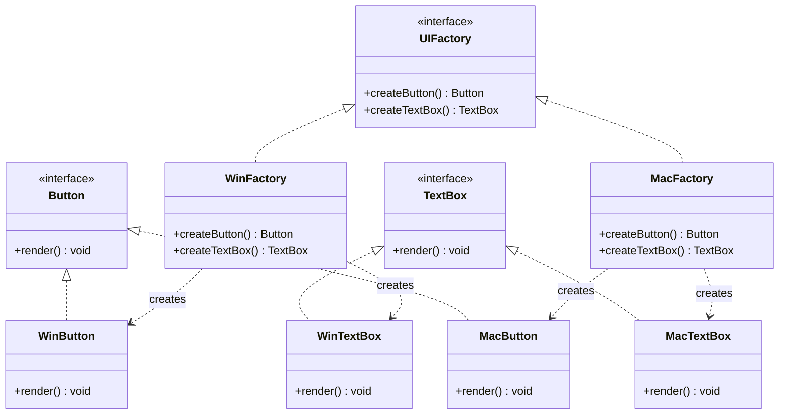

# 抽象工厂 Abstract Factory

> 提供一个接口来创建一系列相关或相互依赖的对象，无需指定具体类。

## 意图

抽象工厂模式将多个工厂方法组合在一起，形成一个"产品族"的创建接口。客户端通过选择不同的具体工厂，可以一次性获得一组匹配的对象。

比如在跨平台 UI 开发中，Windows 风格和 Mac 风格各有自己的按钮、文本框、菜单——抽象工厂让你选择一个工厂后，所有创建出来的组件风格一致。

## 适用场景

- 系统需要独立于产品的创建、组合和表示时
- 系统需要配置多个产品族，每次只使用其中一个族时
- 需要提供一组相关产品的统一创建接口时

## UML 类图



## 代码示例

### ❌ 没有使用该模式的问题

```java
// 客户端代码直接创建具体对象，风格不统一，难以切换
public class Application {
    private WinButton button;
    private MacTextBox textBox; // 混搭了！

    public Application() {
        this.button = new WinButton();
        this.textBox = new MacTextBox(); // Windows 按钮配 Mac 文本框？
    }

    public void renderUI() {
        button.render();
        textBox.render();
    }

    // 切换风格需要修改所有 new 的地方
}
```

### ✅ 使用该模式后的改进

```java
// 抽象产品
public interface Button {
    void render();
}

public interface TextBox {
    void render();
}

// Windows 产品族
public class WinButton implements Button {
    @Override
    public void render() {
        System.out.println("渲染 Windows 风格按钮");
    }
}

public class WinTextBox implements TextBox {
    @Override
    public void render() {
        System.out.println("渲染 Windows 风格文本框");
    }
}

// Mac 产品族
public class MacButton implements Button {
    @Override
    public void render() {
        System.out.println("渲染 Mac 风格按钮");
    }
}

public class MacTextBox implements TextBox {
    @Override
    public void render() {
        System.out.println("渲染 Mac 风格文本框");
    }
}

// 抽象工厂
public interface UIFactory {
    Button createButton();
    TextBox createTextBox();
}

// 具体工厂
public class WinFactory implements UIFactory {
    @Override
    public Button createButton() { return new WinButton(); }
    @Override
    public TextBox createTextBox() { return new WinTextBox(); }
}

public class MacFactory implements UIFactory {
    @Override
    public Button createButton() { return new MacButton(); }
    @Override
    public TextBox createTextBox() { return new MacTextBox(); }
}

// 客户端
public class Application {
    private Button button;
    private TextBox textBox;

    public Application(UIFactory factory) {
        this.button = factory.createButton();
        this.textBox = factory.createTextBox();
    }

    public void renderUI() {
        button.render();
        textBox.render();
    }
}

// 使用
public class Main {
    public static void main(String[] args) {
        // 只需更换工厂，整个 UI 风格自动统一切换
        Application app = new Application(new MacFactory());
        app.renderUI();
    }
}
```

### Spring 中的应用

Spring 的 `SqlSessionFactory` 是抽象工厂的经典应用：

```java
// MyBatis 集成 Spring 时
@Configuration
public class MyBatisConfig {

    @Bean
    public SqlSessionFactory sqlSessionFactory(DataSource dataSource) throws Exception {
        SqlSessionFactoryBean factoryBean = new SqlSessionFactoryBean();
        factoryBean.setDataSource(dataSource);
        // 这里创建的 SqlSession、Mapper 等都是同一个产品族
        return factoryBean.getObject();
    }
}

// 通过 SqlSessionFactory 创建的 SqlSession、Configuration、MapperProxy
// 都属于 MyBatis 这个产品族，彼此兼容
```

## 优缺点

| 优点 | 缺点 |
|------|------|
| 保证同一族产品一起使用，风格一致 | 新增产品等级（新增接口）非常困难，需改所有工厂 |
| 客户端与具体产品解耦 | 产品族扩展容易，但产品等级扩展困难 |
| 符合开闭原则（在产品族维度） | 增加系统抽象层和理解复杂度 |

## 面试追问

**Q1: 抽象工厂模式和工厂方法模式的区别？**

A: 工厂方法是一个工厂生产一种产品，通过继承来扩展。抽象工厂是一个工厂生产一族产品，通过组合来扩展。工厂方法侧重"一种产品的多个变体"，抽象工厂侧重"多个相关产品的组合"。

**Q2: 抽象工厂如何扩展新的产品等级？**

A: 这是抽象工厂的弱点。新增产品等级需要修改抽象工厂接口，然后修改所有具体工厂实现，违反开闭原则。解决方案是结合简单工厂或依赖注入，将产品等级的创建逻辑放到配置中。

**Q3: 实际项目中什么时候用抽象工厂？**

A: 当你的系统需要支持多种"风格"或"平台"时，比如跨平台 UI、多数据库支持（MySQL 系列和 PostgreSQL 系列的 DAO）、多日志框架切换等。如果只是一两个独立的对象创建，用工厂方法或简单工厂就够了。

## 相关模式

- **工厂方法模式**：抽象工厂中的每个创建方法都是工厂方法
- **单例模式**：具体工厂通常实现为单例
- **原型模式**：抽象工厂可以用原型模式来创建产品，而不是直接 new
