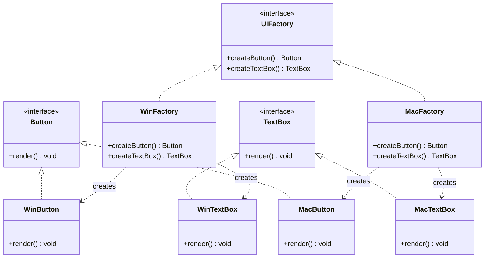

# 抽象工厂 Abstract Factory

> 提供一个接口来创建一系列相关或相互依赖的对象，无需指定具体类。

## 意图

抽象工厂模式将多个工厂方法组合在一起，形成一个"产品族"的创建接口。客户端通过选择不同的具体工厂，可以一次性获得一组匹配的对象。

打个比方：你去买车，选了丰田这个"工厂"，那发动机、变速箱、轮胎自然都是丰田系的原装配件，它们彼此之间是经过验证的匹配组合。如果你混着来——丰田的发动机 + 大众的变速箱——虽然也能装，但兼容性和售后都是问题。抽象工厂就是保证你拿到的是一整套原装配件，不会出现"混搭翻车"的情况。

再比如跨平台 UI 开发，Windows 风格和 Mac 风格各有自己的按钮、文本框、菜单——抽象工厂让你选择一个工厂后，所有创建出来的组件风格一致，用户体验不会"串台"。

核心思想：**一个工厂管一族产品，保证族内产品互相兼容**。

## 适用场景

- 系统需要独立于产品的创建、组合和表示时
- 系统需要配置多个产品族，每次只使用其中一个族时
- 需要提供一组相关产品的统一创建接口时
- 跨平台/多主题/多数据库等需要切换整套实现的场景
- 你想要强制约束"只能使用同一族的产品"时

:::tip 判断标准
如果你发现代码里有大量 `new XxxA() + new YyyA()` 的组合，而且 A 系列必须配套使用，那大概率需要抽象工厂。
:::

## UML 类图



## 代码示例

### ❌ 没有使用该模式的问题

```java
// ========== 痛点：直接 new 具体类，风格混搭，切换成本高 ==========

// 客户端代码直接创建具体对象，风格不统一，难以切换
public class Application {
    // 硬编码了具体类，想换风格？逐个改 new
    private WinButton button;
    private MacTextBox textBox; // 混搭了！Windows 按钮 + Mac 文本框

    public Application() {
        this.button = new WinButton();
        this.textBox = new MacTextBox(); // 这俩风格完全不一样
    }

    public void renderUI() {
        button.render();
        textBox.render();
    }

    // 问题1：如果客户要求全换成 Mac 风格，要改所有 new 的地方
    // 问题2：如果再加一个 Linux 风格，代码里到处加 if-else
    // 问题3：没有任何约束，程序员可能无意中混搭不同族的产品
}

// 另一个痛点：到处散落的工厂调用
public class SettingsPanel {
    public void render() {
        // 又一堆 new，和 Application 里重复了
        WinButton saveButton = new WinButton();
        WinTextBox nameField = new WinTextBox();
        saveButton.render();
        nameField.render();
    }
}
```

### ✅ 使用该模式后的改进

```java
// ========== 抽象产品：定义一族产品的公共接口 ==========

// 抽象产品 A：按钮
public interface Button {
    void render(); // 渲染按钮到界面
}

// 抽象产品 B：文本框
public interface TextBox {
    void render(); // 渲染文本框到界面
}

// ========== Windows 产品族：所有组件都是 Windows 风格 ==========

public class WinButton implements Button {
    @Override
    public void render() {
        System.out.println("[Windows] 渲染蓝色矩形按钮，带立体边框");
    }
}

public class WinTextBox implements TextBox {
    @Override
    public void render() {
        System.out.println("[Windows] 渲染白色凹陷文本框，带 3D 边框");
    }
}

// ========== Mac 产品族：所有组件都是 Mac 风格 ==========

public class MacButton implements Button {
    @Override
    public void render() {
        System.out.println("[Mac] 渲染圆角按钮，带毛玻璃效果");
    }
}

public class MacTextBox implements TextBox {
    @Override
    public void render() {
        System.out.println("[Mac] 渲染简洁圆角文本框，带聚焦光圈");
    }
}

// ========== 抽象工厂：定义一族产品的创建接口 ==========

public interface UIFactory {
    // 每个方法创建一个产品，保证同一族的产品风格一致
    Button createButton();
    TextBox createTextBox();
}

// ========== 具体工厂：每个工厂负责创建一族产品 ==========

// Windows 工厂：只创建 Windows 风格的组件
public class WinFactory implements UIFactory {
    @Override
    public Button createButton() {
        return new WinButton(); // 返回 Windows 按钮，不会错
    }

    @Override
    public TextBox createTextBox() {
        return new WinTextBox(); // 返回 Windows 文本框，风格统一
    }
}

// Mac 工厂：只创建 Mac 风格的组件
public class MacFactory implements UIFactory {
    @Override
    public Button createButton() {
        return new MacButton(); // 返回 Mac 按钮
    }

    @Override
    public TextBox createTextBox() {
        return new MacTextBox(); // 返回 Mac 文本框
    }
}

// ========== 客户端：只依赖抽象，不关心具体实现 ==========

public class Application {
    // 依赖抽象产品接口，不依赖具体实现
    private final Button button;
    private final TextBox textBox;

    // 通过构造方法注入工厂，由工厂决定创建哪一族的产品
    public Application(UIFactory factory) {
        this.button = factory.createButton();
        this.textBox = factory.createTextBox();
    }

    public void renderUI() {
        button.render();
        textBox.render();
    }
}

// ========== 使用示例 ==========

public class Main {
    public static void main(String[] args) {
        System.out.println("===== Mac 风格 UI =====");
        // 只需更换工厂，整个 UI 风格自动统一切换
        Application macApp = new Application(new MacFactory());
        macApp.renderUI();

        System.out.println("\n===== Windows 风格 UI =====");
        // 换成 Windows 风格，一行代码搞定
        Application winApp = new Application(new WinFactory());
        winApp.renderUI();
    }
}
```

### 变体与扩展

#### 变体 1：工厂 + 配置文件（运行时切换产品族）

```java
// 通过配置文件或环境变量决定使用哪个工厂
public class FactoryProvider {
    // 根据 platform 参数返回对应的工厂
    public static UIFactory getFactory(String platform) {
        switch (platform.toLowerCase()) {
            case "windows":
                return new WinFactory();
            case "mac":
                return new MacFactory();
            default:
                throw new IllegalArgumentException("不支持的平台: " + platform);
        }
    }
}

// 客户端通过配置选择
public class Main {
    public static void main(String[] args) {
        // 从配置文件读取平台类型
        String platform = System.getProperty("ui.platform", "mac");
        UIFactory factory = FactoryProvider.getFactory(platform);
        Application app = new Application(factory);
        app.renderUI();
    }
}
```

#### 变体 2：结合单例（具体工厂通常是单例的）

```java
// 具体工厂通常不需要每次都创建新实例，用单例节省资源
public class WinFactory implements UIFactory {
    // 饿汉式单例
    private static final WinFactory INSTANCE = new WinFactory();

    private WinFactory() {} // 私有构造，防止外部 new

    public static WinFactory getInstance() {
        return INSTANCE;
    }

    @Override
    public Button createButton() { return new WinButton(); }

    @Override
    public TextBox createTextBox() { return new WinTextBox(); }
}
```

#### 变体 3：反射创建具体产品（减少工厂子类）

```java
// 用反射替代具体工厂子类，适合产品族稳定的场景
public class ReflectiveUIFactory implements UIFactory {
    private final String pkg; // 产品包名，如 "com.example.win"

    public ReflectiveUIFactory(String pkg) {
        this.pkg = pkg;
    }

    @Override
    public Button createButton() {
        try {
            // 通过反射动态创建：com.example.win.WinButton
            String className = pkg + ".WinButton";
            return (Button) Class.forName(className).getDeclaredConstructor().newInstance();
        } catch (Exception e) {
            throw new RuntimeException("创建 Button 失败", e);
        }
    }

    @Override
    public TextBox createTextBox() {
        try {
            String className = pkg + ".WinTextBox";
            return (TextBox) Class.forName(className).getDeclaredConstructor().newInstance();
        } catch (Exception e) {
            throw new RuntimeException("创建 TextBox 失败", e);
        }
    }
}
```

### 运行结果

```
===== Mac 风格 UI =====
[Mac] 渲染圆角按钮，带毛玻璃效果
[Mac] 渲染简洁圆角文本框，带聚焦光圈

===== Windows 风格 UI =====
[Windows] 渲染蓝色矩形按钮，带立体边框
[Windows] 渲染白色凹陷文本框，带 3D 边框
```

## Spring/JDK 中的应用

### Spring 中的应用

#### 1. MyBatis 的 SqlSessionFactory

```java
// MyBatis 集成 Spring 时，SqlSessionFactory 是一个抽象工厂
// 它创建的产品族包括：SqlSession、Configuration、MapperProxy 等
@Configuration
public class MyBatisConfig {

    @Bean
    public SqlSessionFactory sqlSessionFactory(DataSource dataSource) throws Exception {
        SqlSessionFactoryBean factoryBean = new SqlSessionFactoryBean();
        factoryBean.setDataSource(dataSource); // 注入数据源
        // SqlSessionFactory 创建的所有产品（SqlSession、Mapper 等）
        // 都属于 MyBatis 这个"产品族"，彼此兼容
        return factoryBean.getObject();
    }
}

// 使用时：从同一个 SqlSessionFactory 获取的组件天然兼容
@Autowired
private SqlSessionFactory sqlSessionFactory;

public void queryUser(Long id) {
    try (SqlSession session = sqlSessionFactory.openSession()) {
        UserMapper mapper = session.getMapper(UserMapper.class);
        User user = mapper.selectById(id); // SqlSession 和 Mapper 来自同一族
    }
}
```

#### 2. Spring 的 EntityManagerFactory（JPA）

```java
// EntityManagerFactory 是 JPA 的抽象工厂
// 创建 EntityManager、EntityTransaction、Query 等产品族
@Configuration
public class JpaConfig {

    @Bean
    public LocalContainerEntityManagerFactoryBean entityManagerFactory(DataSource dataSource) {
        LocalContainerEntityManagerFactoryBean factory = new LocalContainerEntityManagerFactoryBean();
        factory.setDataSource(dataSource);
        factory.setPackagesToScan("com.example.entity");
        factory.setJpaVendorAdapter(new HibernateJpaVendorAdapter());
        // 这个工厂创建的 EntityManager、Query、Metamodel
        // 都是 Hibernate 实现的"产品族"
        return factory;
    }
}
```

### JDK 中的应用

#### 1. javax.xml.parsers.DocumentBuilderFactory

```java
// JDK 内置的抽象工厂：创建 DOM 解析器的产品族
DocumentBuilderFactory factory = DocumentBuilderFactory.newInstance();
// 创建 DocumentBuilder（解析器）
DocumentBuilder builder = factory.newDocumentBuilder();
// 创建 Document（解析结果）
Document document = builder.parse(new File("config.xml"));

// 不同实现（Xerces、Crimson 等）通过 newInstance() 切换
// DocumentBuilder + Document + NodeList 等属于同一产品族
```

#### 2. java.sql.Connection（数据库连接族工厂）

```java
// Connection 本身就是一个抽象工厂
// 它创建的产品族包括：Statement、PreparedStatement、CallableStatement、DatabaseMetaData 等
Connection conn = DriverManager.getConnection("jdbc:mysql://localhost:3306/test");

// 这些产品都来自同一个数据库驱动，彼此兼容
Statement stmt = conn.createStatement();
PreparedStatement pstmt = conn.prepareStatement("SELECT * FROM users WHERE id = ?");
DatabaseMetaData meta = conn.getMetaData();

// 换一个数据库驱动（MySQL → PostgreSQL），只需改连接 URL
// 创建的 Statement 等产品族自动切换
```

:::warning 抽象工厂 vs 工厂方法
抽象工厂的每个 `createXxx()` 方法本质上就是一个工厂方法。区别在于：工厂方法关注**单一产品**的创建，抽象工厂关注**一族产品**的创建。抽象工厂是工厂方法的"升级版"——把多个工厂方法打包成一个工厂接口。
:::

## 优缺点

| 维度 | 优点 | 缺点 |
|------|------|------|
| **一致性** | 保证同一族产品一起使用，风格/兼容性一致 | — |
| **解耦** | 客户端与具体产品完全解耦，只依赖抽象接口 | — |
| **扩展性（产品族）** | 新增产品族（如 Linux 风格）只需新增一个工厂，符合开闭原则 | — |
| **扩展性（产品等级）** | — | 新增产品等级（如新增 Checkbox）需要改所有工厂接口和实现，违反开闭原则 |
| **复杂度** | — | 增加系统抽象层，引入大量接口和实现类，理解成本高 |
| **约束力** | 工厂天然约束了产品族，防止混搭 | 约束有时也是限制，临时混搭需求难以满足 |

## 面试追问

**Q1: 抽象工厂模式和工厂方法模式的区别？**

A: 工厂方法是一个工厂生产一种产品，通过继承来扩展——新增产品就新增一个工厂子类。抽象工厂是一个工厂生产一族产品（多种相关产品），通过组合来扩展——新增产品族就新增一个工厂。打个比方：工厂方法是"一个奶茶店只卖一种口味的奶茶，要新口味就开新店"；抽象工厂是"一个餐厅提供完整的套餐，前菜+主菜+甜点配套"。

**Q2: 抽象工厂如何扩展新的产品等级？这是不是它的致命弱点？**

A: 是的，这是抽象工厂最被诟病的弱点。比如你已经有了 Button + TextBox 两个产品等级，现在要加一个 Checkbox，你需要：
1. 修改 UIFactory 接口，加 `createCheckbox()`
2. 修改 WinFactory，实现 `createCheckbox()` 返回 WinCheckbox
3. 修改 MacFactory，实现 `createCheckbox()` 返回 MacCheckbox

这违反了开闭原则。解决方案有几种：
- 结合简单工厂或反射，在工厂内部根据配置动态创建
- 使用依赖注入（Spring），将产品等级的创建逻辑放到配置中
- 如果产品等级经常变动，可能不适合用抽象工厂

**Q3: 实际项目中什么时候用抽象工厂？**

A: 满足以下条件时考虑使用：
1. **多个相关产品需要配套使用**（如跨平台 UI、多数据库 DAO、多日志框架）
2. **产品族数量有限且稳定**（2-5 个产品族）
3. **需要运行时切换整套实现**（如 A/B 测试切换不同实现）

如果只是一两个独立的对象创建，用工厂方法或简单工厂就够了。别为了用设计模式而用设计模式。

**Q4: 抽象工厂如何与 Spring 结合使用？**

A: Spring 的依赖注入天然适合抽象工厂模式。你可以：
1. 将抽象工厂定义为接口，具体工厂定义为 `@Component`
2. 使用 `@Qualifier` 或 `@Conditional` 选择注入哪个工厂
3. 使用 `@Profile` 根据环境切换产品族

```java
// 环境隔离的抽象工厂
@Configuration
@Profile("windows")
public class WinFactoryConfig {
    @Bean
    public UIFactory uiFactory() { return new WinFactory(); }
}

@Configuration
@Profile("mac")
public class MacFactoryConfig {
    @Bean
    public UIFactory uiFactory() { return new MacFactory(); }
}
```

## 相关模式

- **工厂方法模式**：抽象工厂中的每个创建方法都是工厂方法
- **单例模式**：具体工厂通常实现为单例，避免重复创建工厂实例
- **原型模式**：抽象工厂可以用原型模式来创建产品，而不是直接 new
- **桥接模式**：抽象工厂创建的产品可以作为桥接模式的实现部分
